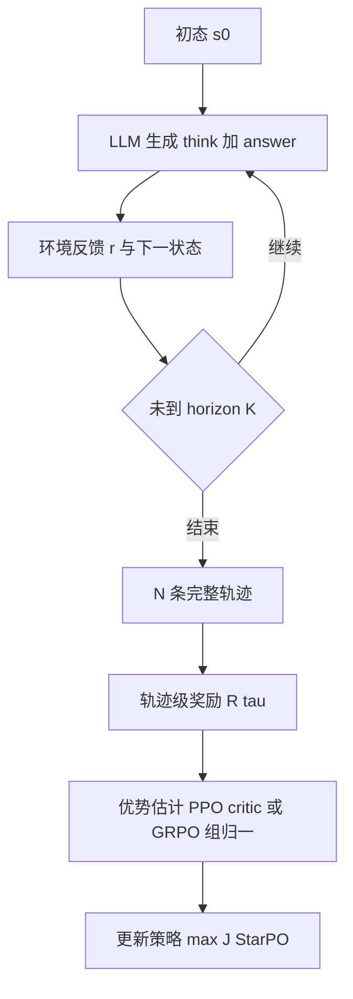

# RAGEN：轨迹级优化多轮 Agent，先碰到 Echo Trap

<!-- release-date: 2025-04-24 -->

**本文依据** ：`RAGEN: Understanding Self-Evolution in LLM Agents via Multi-Turn Reinforcement Learning`，arXiv 2504.20073v2（2025-05-26），39 页 A4。作者 Zihan Wang、Kangrui Wang、Qineng Wang、Pingyue Zhang、Linjie Li 等（前四位与 Linjie Li 为共同一作）；第一单位 Northwestern University，合作 University of Washington、Stanford University、Microsoft、New York University、University of British Columbia、Singapore Management University。通讯 Manling Li。首发日取 arXiv v1 提交日 2025-04-24；本地读的是 v2，数字与页码均对应该 PDF。项目页 [ragen-ai.github.io](https://ragen-ai.github.io/)，代码仓 [RAGEN-AI/RAGEN](https://github.com/RAGEN-AI/RAGEN)。标「外部补充」的段落不来自本文。

## 一句话

单轮数学、代码的强化学习把「一次回答」当样本；Agent 要在环境里走多轮、吃随机反馈，整条轨迹才是一个学习单元。RAGEN 把这件事做成系统：上面是 **StarPO**（State-Thinking-Actions-Reward Policy Optimization，状态—思考—动作—奖励的策略优化），把观察、思考、动作和反馈整条优化；下面是可插环境、奖励与 rollout 的训练环。四套风格化环境上，vanilla 多轮 RL 会反复掉进 **Echo Trap**：组内奖励方差悬崖下跌、熵塌、梯度尖峰，模型把局部赚到分的套话越学越死。**StarPO-S** 用不确定度过滤轨迹、接 critic、再做梯度塑形来拖住崩塌。rollout 要多样初态、中等动作粒度、尽量在线采；没有细粒度、能看见推理质量的奖励时，`<think>` 不会自己长出来，甚至会幻觉。

## 一、矛盾：单轮 RL 的样本，对不上多轮随机交互

数学、代码这类静态任务，输入是题、输出是答案，奖励立刻打在这一对上。Agent 不是这样：它要记住历史、逐步决策，环境还可能滑一步、给噪声（PDF p.2）。作者把规划助手、机器人、辅导都归进这类设定，并问一句（PDF p.2）：

> 让会自我演化的 LLM Agent 学得有效、又学得稳，设计上到底该盯哪些因素？

网页浏览一类真实任务往往靠预训练先验和大量任务工程。本文故意先用三套**极简、完全可控**的符号环境，再加一套开放域网页购物，把「从零学策略」和「吃语言先验」拆开看（PDF p.2、p.20）。

四套环境（PDF p.5、p.20–21）：

| 环境 | 轮次 | 随机性 | 测什么 |
|---|---|---|---|
| Bandit（双臂老虎机） | 单轮 | 有 | 噪声反馈下的风险敏感推理 |
| Sokoban（推箱子） | 多轮 | 无 | 不可逆符号规划 |
| Frozen Lake（冰湖） | 多轮 | 有 | 规划加上概率转移 |
| WebShop | 多轮 | 开放域 | 自然语言 grounding 与网页交互 |

Bandit：低风险臂固定回报 $0.15$，高风险臂 $\mathrm{Bernoulli}(0.25)$。低风险臂**单次更常赢**，期望却更低；标签还可反转成 BanditRev，逼模型别死记「Dragon 好听」（PDF p.21 图 8）。Sokoban：箱子只能推不能拉；奖励 $+1$ 箱子在目标、$-1$ 离开目标、$+10$ 完成、每步 $-0.1$（PDF p.21）。Frozen Lake：动作以 $1/3$ 成功、以 $2/3$ 垂直滑偏；成功 $+1$，其余 $0$（PDF p.21）。WebShop 用 Yao 等人的购物环境补语言与界面（PDF p.21）。附录写：即便 GPT-4o，这些符号环境零样本也很差，所以需要落地的策略学习（PDF p.20）。

## 二、StarPO：整条轨迹当一个优化对象

旧目标是逐步、单轮的（PDF p.3 式 (1)）：

$$
J_{\mathrm{step}}(\theta)=\mathbb{E}_{s\sim\mathcal{D},\,a\sim\pi_\theta(\cdot\mid s)}\bigl[R(s,a)\bigr]
$$

交互写成 MDP $\mathcal{M}=\{S,A,P\}$。动作常是 token 序列；每步

$$
a_t\sim\pi_\theta(\cdot\mid s_t,\tau_{<t}),\qquad (r_t,s_{t+1})\sim P(\cdot\mid s_t,a_t)
$$

最多 $K$ 步，得到整条 $\tau=\{s_0,a_0,r_0,\ldots,s_K\}$（PDF p.3）。

StarPO 的目标换成轨迹回报（PDF p.3–4 式 (2)）：

$$
J_{\mathrm{StarPO}}(\theta)=\mathbb{E}_{\mathcal{M},\,\tau\sim\pi_\theta}\bigl[R(\tau)\bigr]
$$

$\pi_\theta(\tau)$ 拆到 token 似然，才能直接接到自回归 LLM。封面把缩写写成 State-Thinking-**Actions**-Reward；§2.2 标题写成 Action 单数——同一套框架，不是两套方法（PDF p.1、p.3）。

每步输出带推理的结构化动作（PDF p.4 式 (3)）：

$$
a^T_t=\texttt{<think>...</think><answer>}a_t\texttt{</answer>}
$$

$a_t$ 可以是一串环境可执行的子动作。轨迹里观察、思考、动作、反馈**一起**进优化。训练环：每次从初态 $s_0$ 滚 $N$ 条轨迹；每环 $P$ 个初态、更新 batch $E$、共 $L$ 环，梯度步数 $S=L\cdot P\cdot N/E$（PDF p.4）。可 on-policy，也可从 replay 用 $\pi_{\mathrm{old}}$。

图是机制示意，对应 PDF p.3 图 2。

模块上 PPO 与 GRPO 都能接进同一轨迹抽象。PPO 用 critic 估 token 级优势再裁剪（PDF p.4 式 (4)）。GRPO 无 critic：整条一个标量 $R(\tau_i)$，组内标准化后**同一优势广播到该轨迹每个 token**（PDF p.5 式 (5)–(6)）：

$$
\hat A_{i,t}=\frac{R(\tau_i)-\mathrm{mean}\{R(\tau_1),\ldots,R(\tau_G)\}}{\mathrm{std}\{R(\tau_1),\ldots,R(\tau_G)\}}
$$

这正是后面 Echo Trap 的结构伏笔：中间哪一步想得好，被整条分数抹平。

**RAGEN** 是把 StarPO 跑起来的系统：结构化 rollout、可定制奖励、多轮随机环境；新环境、奖励、rollout 策略可插（PDF p.5）。致谢写明基础设施来自 veRL，早期探索受 TinyZero 启发（PDF p.13）。这是执行后端，不是另一种算法。

## 三、实验设定

主实验：符号三任务用 Qwen-2.5 Instruct **0.5B**，更难的 WebShop 用 **3B**；附录扩到 7B / 72B 与 GPT-4o（PDF p.5、p.23）。H100（附录写 H100/A100），符号任务最多 200 个 rollout–更新迭代，WebShop 因上下文长只训 100 步（PDF p.5、p.22）。

正文：$P=8$ 个 prompt、$N=16$ 条 rollout / prompt，最多 5 轮、10 个动作（PDF p.5）。附录 C.2 写成每组 $K=16$ 条轨迹、每回合最多 5 个动作、每局 10 个动作，更新 batch $E=32$、每 GPU mini-batch 4（PDF p.22）。GAE $\gamma=1.0$、$\lambda=1.0$，Adam，熵奖励 $\beta=0.001$，格式罚 $-0.1$（缺 `<think>` / `<answer>`）。vanilla StarPO 用 KL 系数 $0.001$（k1 估计）；StarPO-S 按 DAPO 去掉训练时 KL、事后跟踪（PDF p.22）。评测：每环境固定 256 条 prompt，温度 $T=0.5$，5 轮截断（PDF p.5、p.22）。指标：成功率、rollout 熵、组内奖励变异、回复长度、梯度范数（PDF p.5、p.22–23）。

## 四、Echo Trap：多轮 RL 自己的崩法

图 3：Bandit、Sokoban 先升后塌。PPO 因 critic 更平滑，崩得晚、峰值更高；Frozen Lake 上 GRPO 更稳——状态价值难估，PPO 的 critic 反而添乱（附录 I，PDF p.6、p.27）。WebShop 两边都成，作者归因于语言先验强、初始奖励高，不太需要 critic 稳住梯度（PDF p.6）。

Finding 1（PDF p.6）：单轮 PPO / GRPO 原样搬过来，早期有增益，但常崩；critic 只能推迟不稳，挡不住推理退化。

对照早晚轨迹：Bandit 早期还在辨符号含义和期望回报，后期变成重复套话。作者把这种「在自生成轨迹上把局部赚分的推理模板越学越死」叫做 **Echo Trap**，并引用 Shumailov 等人关于递归自生成数据导致模型塌缩的工作（PDF p.6）。附录表 6：Step 0 还能对比 Dragon / Phoenix 的性格隐喻；Step 150 几乎只剩「我一开始就想选 Dragon」（PDF p.26）。

监测（PDF p.7 图 4）：

- 平均奖励平台或下跌：任务坏了。
- 梯度范数尖峰：更新已经不可逆。Bandit 约 step 170、Sokoban 约 110、Frozen Lake 约 90。
- **组内奖励标准差**往往更早报警。FrozenLake-PPO 约 step 40 方差骤降，奖励均值约 step 90 才塌，而当时成功率还接近最优；Bandit-PPO 标准差约 step 70 见底，奖励峰值约 step 120；Sokoban-PPO 标准差与均值约 step 10 一起塌。
- 熵应平稳衰减（FrozenLake-GRPO）；乱升或乱抖常对应推理已塌（Bandit / Sokoban 上的 GRPO）。

Finding 3：崩塌有可预期的动力学，不是「突然坏了」（PDF p.7）。

## 五、StarPO-S：过滤不确定样本，再塑梯度

StarPO-S 三刀：采样质量、梯度稳定、探索正则，避免过早塌（PDF p.8）。核心假设：该练的是**结果不确定**的实例，太简单和太难都信息量低，对标主动学习（PDF p.8）。实例不确定度（PDF p.8 式 (7)）：

$$
U(\pi_\theta,\mathcal{M},s_0)=\mathrm{Std}_{\tau\sim\pi_\theta(\cdot\mid s_0)}\bigl[R(\tau)\bigr]
$$

按组内奖励标准差排序，每步只留 top $p\%$ 高不确定 prompt。PPO 上：Frozen Lake 留 75% 把稳定期从约 100 步拖到约 140 步；留 50% **可以完全避开崩塌**。GRPO 无 critic，受益较小但仍有。默认 $p=25\%$——作者承认偏狠，Sokoban / Frozen Lake 这类预训练里少见、推理模式容易重复的任务更吃这套；不是所有场景最优（PDF p.8 图 5）。过滤还缩短墙钟时间（图 5 最右栏）。

另外两件从 DAPO 搬来的梯度塑形：去掉 KL；**Clip-Higher** 非对称裁剪 $\varepsilon_{\mathrm{high}}=0.28$、$\varepsilon_{\mathrm{low}}=0.2$，让高回报轨迹学得更狠（PDF p.8、p.24 图 11）。图 6：四任务上 StarPO-S 都推迟崩塌、抬高终绩（PDF p.9）。附录还试了 **response mask** 与 **Bi-level GAE**（指向同组后续工作 VAGEN），Sokoban 上都有帮助（PDF p.9、p.24 图 12）。

附录 E：过滤在组内方差会掉到极低的环境（太易或太难）最有用；WebShop 方差本来就高且稳，StarPO-S 边际小（PDF p.25 图 13）。

## 六、Rollout 塑形：多样初态、中等粒度、尽量在线

在 vanilla Sokoban 上训，迁到 SokobanNewVocab、LargeSokoban、FrozenLake（PDF p.9，细节附录 K）。

**任务多样性 vs 每 prompt 条数**（固定 batch）。表 1（PDF p.10）：每 prompt **4 条**最好——既有多样初态，又有同条件下的对比。32 条 / prompt 把多样性挤掉；1 条则没有组内对比。SokobanNewVocab：4 条 $25.39\%$，32 条 $20.22\%$；FrozenLake：4 条 $21.48\%$，1 或 2 条只有 $12.50\%$。

**每回合动作预算**。表 2（PDF p.10）：**5–6 个动作 / 回合**最好。Sokoban 上 1 个动作 $12.11\%$，6 个 $33.59\%$，7 个掉到 $22.27\%$。LargeSokoban 同样 6 个最高（$6.64\%$），7 个掉到 $3.91\%$。太短规划不开；太长噪声大、奖励被稀释。

**Online-$k$**：同一批 rollout 复用 $k$ 次更新。$k=1$ 全在线。图 7：Online-1 收敛更快、泛化更好；Online-5 / 10 明显落后（PDF p.10–12）。多轮 RL 的数据要尽量反映**当前**策略，否则优化目标与行为错位。

Finding 5 把这三句收成原则（PDF p.10）。

## 七、没有细粒度推理奖励，思考不会长出来

表 3，StarPO-S（PDF p.11）：Bandit 带思考 $100.00\%$，NoThink $81.25\%$；反转标签 Bandit-Rev $67.58\%$ vs $56.25\%$。单轮、符号线索有用时，思考帮泛化。FrozenLake 几乎打平（$19.92\%$ vs $19.53\%$）。Sokoban 上 NoThink 在 SokobanNewVocab 甚至更高（$26.17\%$ vs $18.75\%$）。

表 4：`<think>` 长度随训练缩短（PDF p.11）。Bandit 原任务 step 0 为 $66.0$ token，step 200 为 $17.6$；NoThink 一直约 $12.4$。Sokoban 原任务 $307.1\to 89.5$。BanditRev 更难，思考缩得慢（$68.8\to 30.7$）。图 14 同一趋势（PDF p.27）。

作者推测：多轮稀疏、延迟的结局奖励分不清「想清楚了」和「瞎试成功了」。附录 L 有奖励很高但推理胡话的例子。格式罚 $-0.1$ 只能逼结构，逼不出内容。Finding 6：没有显式鼓励可解释中间步的奖励，Agent 会抄近路绕开推理（PDF p.12）。

规模（图 10，PDF p.23–24）：Bandit / WebShop 上 3B、7B 明显强过 0.5B；Sokoban / Frozen Lake 增益很小——网格符号任务和预训练重叠低，语言先验使不上。WebShop 7B 在 4×H100 上会 OOM，只报 3B。

零样本对照表 5（PDF p.23）：GPT-4o Sokoban $27.73\%$、FrozenLake $26.56\%$；Qwen2.5-72B $19.53\%$ / $23.83\%$；训过的 0.5B（每 prompt 4 条）$20.70\%$ / $21.48\%$。作者强调参数差两个数量级以上，靠 rollout 构造仍能接近大模型零样本——不是说 0.5B 全面超过 GPT-4o。

附录 G 的对照更刺耳：Sokoban 上 SFT（BFS 造 1000 条真值轨迹 + LoRA）$74.6\%$，StarPO-S 约 $20.3\%$；Frozen Lake SFT $23\%$ vs StarPO-S $21.8\%$（PDF p.26）。规则 RL 有前景，但「只靠自我演化」离可演示的专家轨迹监督还远。这是作者自己写的缺口，不是外部贬低。

附录 H 的 LoRA 全文微调对照：原文写 SimpleSokoban 验证成功率「大约 $0.2\%$」，同时说与全参「可比」，显存约 $23\%$ vs $48\%$（PDF p.27）。$0.2\%$ 与正文 $20\%$ 量级对不上，更像排版/小数点问题；**本文不把它当成可靠主结果**，只记下「他们试过 LoRA 省资源」。

## 八、局限与可迁移启发

局限（PDF p.12–13）：任务规模相对小；没用上 replay buffer 等成熟 RL 做法；没有多模态。致谢里的 VAGEN 指向视觉 Agent，不在本 PDF 实验里。

可迁移、且不依赖他们那三套玩具网格的几条：

1. **多轮 Agent 的样本是轨迹，不是单轮答案。** 组内一个标量广播到每个 token，会制造 Echo Trap 的结构条件。
2. **先盯组内奖励标准差和熵，再盯平均回报。** 方差先死、梯度再炸，往往已经晚了。
3. **不确定度过滤是主动学习，不是万能。** 组内方差已经很高（开放域、多样回复）时，狠滤 $25\%$ 可能误伤。
4. **Rollout 三件套：多样初态 + 每态多条对比、中等动作预算、Online-1。** 7 步预算在他们表里已经变差，不是越长越好。
5. **格式 token 不等于推理。** 结局成败奖励下，思考长度会自己萎缩；要推理，就得有能区分「想得对不对」的信号。
6. **符号网格上，放大模型救不了先验空白**；语言任务上 scale 才明显。SFT 用专家轨迹可以远超当时的规则 RL——自我演化还不是唯一路径。

## 关键词回看

- **StarPO**：把整条多轮交互（状态、思考、动作、奖励）当优化单元。
- **RAGEN**：跑 StarPO 的模块化训练与评测系统。
- **Echo Trap**：自生成轨迹上，局部赚分的套话被放大，多样性与长期表现一起塌。
- **StarPO-S**：高不确定轨迹过滤 + critic / 梯度塑形（去 KL、非对称裁剪等）。
- **Online-$k$**：同一批 rollout 复用 $k$ 次更新；$k=1$ 全在线。

## 参考资料

- 论文：arXiv [2504.20073](https://arxiv.org/abs/2504.20073)
- 项目页：https://ragen-ai.github.io/
- 代码：https://github.com/RAGEN-AI/RAGEN
- 训练基础设施（原文致谢）：[volcengine/verl](https://github.com/volcengine/verl)
- 外部补充、非本篇主张：同方向后续的逐步信用分配见仓库内 [GiGPO](./GiGPO.md)；视觉多轮变体见作者引用的 VAGEN 仓库，不在本 PDF 范围内。
