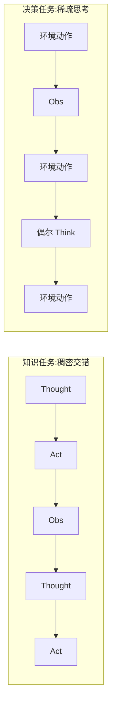

# ReAct：把「想」和「做」交错进同一条轨迹

<!-- release-date: 2022-10-06 -->

**本文依据** ：`ReAct: Synergizing Reasoning and Acting in Language Models`，arXiv 2210.03629v3（2023-03-10，ICLR 2023 camera ready），33 页。作者 Shunyu Yao 等；Princeton CS 与 Google Research Brain team 合作（第一作者实习于 Google）。首发日取 arXiv v1 提交日 2022-10-06；本地读的是 v3 / ICLR 正式版，数字与页码均对应该 PDF。标「外部补充」的段落不来自本文。

## 一句话

CoT 只在脑子里推，Act-only 只对外动手，两边都会崩：前者幻觉、后者迷路。ReAct 把语言模型的动作空间扩成「环境动作 ∪ 语言思考」，让 **Thought / Act / Observation** 交错出现——思考用来拆目标、改计划、处理异常，动作用来从维基或环境拿证据。HotpotQA / FEVER 上它更接地；ALFWorld / WebShop 上，一两条例子就能超过用 $10^3$–$10^5$ 条轨迹训出来的模仿 / 强化学习。

## 一、矛盾：推理和行动被当成两门课

人类做饭时不会「先把整份菜谱想完再动手」，也不会「闭着眼乱翻抽屉」。两步之间会用语言给自己记账：「盐没有了，改用酱油」；也会伸手打开冰箱，好回答「现在能做什么」。论文把这种交错叫做 verbal reasoning 与 task-oriented actions 的协同（PDF p.1）。

当时 LLM 上的两条线是分开的：

- **Chain-of-Thought（CoT，思维链）** ：让模型先写几步推理再给答案。问题是整条链是静态黑箱，不接地，幻觉会沿链传播（PDF p.2，图 1(1b)）。
- **纯 Acting** ：把观察转成文本，让模型直接吐环境动作（SayCan、WebGPT、Inner Monologue 一类）。问题是模型几乎不用语言做高层规划或工作记忆，异常一来就原地打转（PDF p.2，图 1(2a)）。

图 1 用同一道 HotpotQA 题把四种提示摆在一起（PDF p.2）：

| 提示 | 怎么走 | 典型翻车 |
|---|---|---|
| Standard | 直接答 | 凭内部知识瞎猜 |
| CoT（只推理） | 一步步想，不查 | 把 Apple Remote 编成控制 Apple TV |
| Act-only | Search / Lookup / Finish，不想 | 搜到 Front Row 失败后乱 Finish |
| ReAct | Thought → Act → Obs 循环 | 搜不到就改查询，最后 Finish[keyboard function keys] |

ALFWorld 那一半更直白：任务是把胡椒瓶放到抽屉。Act-only 反复去水槽拿不存在的胡椒瓶；ReAct 先 Think「胡椒瓶更可能在柜子 / 台面」，再按常识搜，找到就换子目标（PDF p.2 图 1(2)）。

贯穿全文的主张就一句：**reason to act，同时 act to reason**。

## 二、方法：把「思考」塞进动作空间

交互设定是标准的：时刻 $t$ 收到观察 $o_t$，按策略 $\pi(a_t \mid c_t)$ 选动作，上下文 $c_t = (o_1, a_1, \ldots, o_t)$（PDF p.3）。难的是 $c_t \mapsto a_t$ 往往高度隐含——QA 要综合前三步检索才能 Finish，家务游戏要记住「水槽里没有胡椒瓶」。

ReAct 只改一件事：把动作空间扩成

$$\hat{A} = A \cup L$$

其中 $L$ 是自由语言。落在 $L$ 里的那一步叫 **thought / reasoning trace** ：不改环境、没有 Observation，只把 $c_{t+1} = (c_t, \hat{a}_t)$ 更新掉，给后面的推理或动作当便签（PDF p.3）。

思考在轨迹里实际干什么，论文列了一张功能表（PDF p.3，对应图 1）：

| 思考干什么 | 例子 |
|---|---|
| 拆目标、写计划 | 「先搜 Apple Remote，找到它原先控制的程序」 |
| 注入常识 | 「胡椒瓶更可能在柜子 1–6、台面 1–3」 |
| 从观察里抽关键句 | 「Apple Remote 原先是为了控制 Front Row」 |
| 记账并切换子目标 | 「胡椒瓶找到了，下一步放到抽屉」 |
| 处理异常、改查询 | 「Front Row 搜不到，改搜 Front Row software」 |

$L$ 无限大，所以这篇主要不做从零学策略，而是 **冻住 PaLM-540B**，用 1–6 条人工轨迹做 in-context 例子，同时生成领域动作和自由思考（PDF p.3）。附录 A.1 补了 GPT-3（text-davinci-002）结果：HotpotQA EM 30.8 vs PaLM-540B 的 29.4，ALFWorld 成功率 78.4 vs 70.9（PDF p.14 表 5）。

两类任务的交错密度不一样：

知识任务（图 1(1)）逐步都是 Thought–Action–Observation。决策任务步数可能超过 50，思考只出现在「该拆目标 / 该换子目标」的位置，由模型自己决定何时插入（PDF p.3–4）。

作者强调四条工程性质，后面实验都在兑现（PDF p.4）：提示好写（人在动作旁边打字即可）；跨任务灵活；少样本就泛化；人可以读轨迹、改 thought 来纠偏（第 4 节图 5）。

## 三、知识任务：用一个很弱的维基 API 接地

### 设定

HotpotQA 要跨两段以上维基做多跳问答；FEVER 要把断言标成 SUPPORTS / REFUTES / NOT ENOUGH INFO。本文用 **question-only** ：模型只拿到问题 / 断言，没有金标段落，内部知识不够就得去检索（PDF p.4）。

动作只有三种，刻意比当时的神经检索器弱，为了模拟人按 Ctrl+F 翻维基（PDF p.4）：

| 动作 | 返回 |
|---|---|
| `search[entity]` | 对应词条前 5 句；没有词条则给搜索引擎 top-5 近似实体 |
| `lookup[string]` | 当前页里下一次出现该字符串的句子 |
| `finish[answer]` | 交卷 |

HotpotQA 用 6 条、FEVER 用 3 条人工 ReAct 轨迹当 few-shot；再多例子不再涨分（PDF p.4 脚注 2）。思考用途包括拆问题、抽观察、常识 / 算术、改写查询、合成答案。

对照是把同一条轨迹削掉不同字段（PDF p.5）：

- **Standard** ：全削，只留问答
- **CoT** ：削掉动作和观察
- **CoT-SC** ：温度 0.7 采 21 条 CoT，多数票
- **Act** ：削掉思考，有点像提示版 WebGPT（任务和动作空间不同）

### 内部知识 vs 外部知识

作者观察到：ReAct 更事实、更接地；CoT 推理骨架更准，但容易幻觉。于是用两条启发式把两边接起来（PDF p.5）：

- **ReAct → CoT-SC** ：ReAct 在步数上限内交不出答案，就退回 CoT-SC。HotpotQA 上限 7 步、FEVER 上限 5 步；正确轨迹里真用满上限的分别只有 0.84% 和 1.33%（PDF p.5 脚注 3）。
- **CoT-SC → ReAct** ：$n$ 条 CoT-SC 里多数答案出现次数少于 $n/2$，认为内部知识不够自信，改走 ReAct。

微调走 STaR 式自举：用 ReAct（及其他基线）生成的 **3,000 条答案正确的轨迹**，微调 PaLM-8B / 62B，让小模型根据问题解码整条「思考 + 动作 + 观察」（PDF p.5，细节 PDF p.15 附录 B.1）。

### 主结果（PaLM-540B 提示）

表 1（PDF p.5）：

| 方法 | HotpotQA EM | FEVER Acc |
|---|---:|---:|
| Standard | 28.7 | 57.1 |
| CoT | 29.4 | 56.3 |
| CoT-SC | 33.4 | 60.4 |
| Act | 25.7 | 58.9 |
| ReAct | 27.4 | 60.9 |
| CoT-SC → ReAct | 34.2 | **64.6** |
| ReAct → CoT-SC | **35.1** | 62.0 |
| 监督 SoTA | 67.5 | 89.5 |

几件必须分开记的事：

1. **ReAct 稳定好于 Act**（27.4 vs 25.7；60.9 vs 58.9）。思考的价值尤其在最后合成答案（PDF p.5，图 1(1c–d)）。
2. **相对 CoT 不是全面碾压**。 FEVER 上 ReAct 60.9 > CoT 56.3，因为 SUPPORTS / REFUTES 往往只差一个事实，必须去查；HotpotQA 上 ReAct 27.4 略低于 CoT 29.4（PDF p.6）。
3. **提示最好的是混合** ：HotpotQA 上 ReAct → CoT-SC 拿 35.1，FEVER 上 CoT-SC → ReAct 拿 64.6。图 2 显示，这两种混合在不同 CoT-SC 采样数下都压过纯 CoT-SC，大约 3–5 个样本就能追上 CoT-SC 用 21 个样本的成绩（PDF p.5–6，图 2）。
4. 离领域 SoTA（67.5 / 89.5）还很远。作者自己把这条写成局限：少样本提示撑不起复杂动作空间（PDF p.5 表 1，PDF p.9）。

### 失败模式：接地换灵活性

人工抽了 ReAct / CoT 各 50 条对、50 条错，共 200 条，标成功 / 失败类型（PDF p.6 表 2）：

| | 类型 | ReAct | CoT |
|---|---|---:|---:|
| 成功 | 真阳性（推理和事实都对） | 94% | 86% |
| 成功 | 假阳性（幻觉但仍「对」） | 6% | 14% |
| 失败 | 推理错误（含死循环出不去） | 47% | 16% |
| 失败 | 检索空或没用 | 23% | — |
| 失败 | 幻觉 | 0% | 56% |
| 失败 | 标签歧义（预测对但 EM 对不上） | 29% | 28% |

三条观察（PDF p.6）：

- CoT 的主失败是幻觉（失败里 56%；成功里假阳性 14% vs ReAct 的 6%）。ReAct 因为每步都能指回 Obs，轨迹可检查。
- 交错结构让 ReAct 更死板，推理错误反而更高（47% vs 16%）。典型病是 **反复生成同一 Thought / Act**，作者归进推理错误，并怀疑贪心解码是原因之一（PDF p.6 脚注 4）。
- ReAct 有 23% 栽在检索：搜空了就很难改写查询爬回来。这是事实性与灵活性的交易，也是混合 CoT-SC 的动机。

图 4 还展示一类评测噪声：酒店房间数金标 2,664 已经过时。Standard 答 3,000，CoT 答 2,885，都是幻觉；Act 能搜但交不出答案。只有 ReAct 查到 Treasure Island Hotel and Casino 有 2,884 间房加 220 套套房，交卷 3,104（PDF p.14 图 4）。EM 会把它判错——这是数据集问题，不是模型「更差」。

### 微调：小模型学会「去查」比学会「背事实」更值

图 3 是 HotpotQA 上 Standard / CoT / Act / ReAct 的 prompt vs finetune 缩放（PDF p.7）。文字结论、没有逐点坐标：

- 8B / 62B **只做提示**时，ReAct 在四法里最差——少样本同时学推理和动作太难。
- **3,000 条轨迹一微调**，ReAct 变成四法最好：8B 微调 ReAct 超过所有 62B 提示法；62B 微调 ReAct 超过所有 540B 提示法。
- 微调 Standard / CoT 明显弱于微调 ReAct / Act：前者在背（可能幻觉的）事实，后者在学怎么访问维基，技能更能泛化。
- ReAct / Act 吃更多步数（8B 和 62B 都训 4,000 步），Standard / CoT 训太久会掉（8B 2,000 步，62B 1,000 步）（PDF p.15 附录 B.1）。

## 四、决策任务：稀疏思考比「每步内心独白」有用

两个环境都是长视野、稀疏奖励（PDF p.7）。

**ALFWorld** ：文本版家务，6 类任务，实例可有 50+ 地点，专家策略可超过 50 步。挑战之一是用常识猜物品位置（台灯多半在书桌 / 架子 / 梳妆台）。评测 134 个未见游戏。每类任务标 3 条稀疏思考轨迹，用其中 2 条的 6 种排列做鲁棒性；Act 用同一批轨迹但删思考。对照 BUTLER：每类任务用 $10^5$ 条专家轨迹做模仿学习（PDF p.7）。

稀疏思考只干四件事：拆目标、跟踪子目标是否完成、决定下一个子目标、用常识判断去哪找 / 拿了怎么用（PDF p.7）。

**WebShop** ：1.18M 真实商品、12k 条人类指令，在仿 Amazon 的网站上搜、点选项、下单。指标是 500 条测试指令上的 Score（覆盖了多少目标属性）和 Success Rate（是否全部满足）。Act 提示含 search / 选商品 / 选选项 / buy；ReAct 额外想「还要不要逛、何时买、哪个选项对得上指令」。对照：1,012 条人类轨迹的 IL，以及再加 10,587 条训练指令的 IL+RL（PDF p.7–8）。

表 3 ALFWorld 成功率（%）（PDF p.8）：

| 方法 | Pick | Clean | Heat | Cool | Look | Pick 2 | All |
|---|---:|---:|---:|---:|---:|---:|---:|
| Act（6 次最好） | 88 | 42 | 74 | 67 | 72 | 41 | 45 |
| ReAct（平均） | 65 | 39 | 83 | 76 | 55 | 24 | 57 |
| ReAct（6 次最好） | 92 | 58 | 96 | 86 | 78 | 41 | **71** |
| ReAct-IM（平均） | 55 | 59 | 60 | 55 | 23 | 24 | 48 |
| ReAct-IM（6 次最好） | 62 | 68 | 87 | 57 | 39 | 33 | 53 |
| BUTLER$_g$（8 次最好） | 33 | 26 | 70 | 76 | 17 | 12 | 22 |
| BUTLER（8 次最好） | 46 | 39 | 74 | 100 | 22 | 24 | 37 |

要点：

- 最好的 ReAct 试验 **71%**，好于最好的 Act 45% 和 BUTLER 37%。最差的 ReAct 试验仍有 48%，已经超过那两个最好试验（PDF p.8）。
- 六次对照里 ReAct 相对 Act 的增益 33%–90%，平均 62%。没有思考时，Act 不会拆子目标，也跟丢环境状态。
- **ReAct-IM** 把思考改成 Inner Monologue 那种稠密外部反馈（只复述状态和「还缺什么」），最好也只有 53%，六类里五类输给 ReAct（PDF p.8）。附录 B.2 写明 IM 风格缺少：判断子目标完成、决定下一子目标、用预训练常识猜物品位置（PDF p.15）。

表 4 WebShop（PDF p.8）：

| 方法 | Score | SR |
|---|---:|---:|
| Act | 62.3 | 30.1 |
| ReAct | **66.6** | **40.0** |
| IL | 59.9 | 29.1 |
| IL+RL | 62.4 | 28.7 |
| Human Expert | 82.1 | 59.6 |

one-shot Act 已经和训了上千条轨迹的 IL / IL+RL 持平；加上稀疏推理，成功率绝对 +10 个百分点（摘要里写的 10% 即此）。人仍是 59.6 SR：专家会大幅改写查询、多逛商品，提示方法还学不会（PDF p.8）。

图 5 是人在环上改 thought：ALFWorld 里 ReAct 因一句幻觉（Act 17 以为抽屉里还有第二串钥匙）失败；人删掉幻觉、在 Act 23 补「第二串更可能在 dresser / garbagecan / …」，后续动作整段转向并成功（PDF p.15）。论文的论点是：改几句思考比改几十个动作、也比改网络权重更接近人对齐。这是个例子，不是系统实验。

## 五、和相邻工作差在哪

- 相对 CoT / Self-Consistency / Least-to-most / STaR：那些是孤立、固定的推理；ReAct 把动作和观察写进同一条输入流，任务也不再限于推理（PDF p.8–9）。
- 相对 WebGPT / 对话 API 调用：那些不显式建模思考，且依赖昂贵人类反馈。ReAct 的策略学习成本是「用语言写下推理过程」（PDF p.9）。
- 相对 SayCan：LLM 提案、视觉 affordance 再排序，没有交错思考。
- 相对 Inner Monologue：闭环系统的前作，但独白主要是环境反馈，不是可灵活插入的内部推理（PDF p.8–9）。

## 六、局限（论文自己写的）

- **提示带宽**。 动作空间一大，演示一多就超出 in-context 长度（PDF p.9）。HotpotQA 微调只是初步。
- **检索器故意很弱**。 三条维基 API 远不如当时的神经检索；23% 失败来自空结果（PDF p.4, p.6）。这是实验设计，不是「ReAct 已经解决检索」。
- **结构换灵活性**。 稠密交错提高接地，也提高推理错误和死循环（PDF p.6）。
- **离 SoTA / 人类仍远**。 HotpotQA EM 35.1 vs 监督 67.5；WebShop SR 40.0 vs 人 59.6（PDF p.5, p.8）。
- **主实验模型不开放**。 主结果在 PaLM 上；可复现性靠附录提示、GPT-3 补充和项目页（PDF p.9）。
- **安全**。 接上真实网页或物理动作有风险。本文把交互限制在维基和 WebShop 研究环境，动作空间里不能真下单、不能改维基（PDF p.9–10）。

没写的：没有工具选择器、没有多工具路由、没有现代 function calling 协议。那些是后续 Agent 工作补的，不要读进这篇。

## 七、可迁移启发

1. **思考是零环境副作用的动作**。 实现上不必另起一个「规划模块」：把 thought 和 tool call 放进同一解码循环，thought 不发工具、只写回上下文。
2. **交错密度按视野选**。 多跳问答用稠密 Thought–Act–Obs；长视野控制用稀疏 Think。Inner Monologue 那种每步复述状态，在 ALFWorld 上明确更差。
3. **接地和骨架可以拆开再拼**。 CoT 会幻觉、ReAct 会死板，启发式切换（步数用尽 / 投票不够自信）在表 1 上是最强提示法。今天的「先检索再生成 / 生成失败再检索」是同一类开关。
4. **微调目标该是技能不是答案**。 3,000 条自举轨迹就让 8B 超过 62B 提示：学的是怎么访问维基，不是背 EM 标签。
5. **人对齐可以打在 thought 上**。 改两句思考能扭转后半段策略；这比 RLHF 改权重便宜，也比逐条改动作可解释。
6. **评测要允许世界在变**。 图 4 的过时标签说明：接了真实 API 之后，EM 可能惩罚更新后的正确答案。

## 关键词回看

- **ReAct** ：Reason + Act；Thought / Act / Obs 交错。
- **Thought** ：语言空间里的动作，不产生 Observation。
- **Act-only / CoT** ：从 ReAct 轨迹分别削思考、削环境交互得到的对照。
- **CoT-SC** ：Self-Consistency，多样本 CoT 多数票。
- **question-only** ：不给金标段落，逼模型检索或用内部知识。
- **稀疏 vs 稠密思考** ：决策任务按需插入；知识任务逐步交错。

## 参考

- 论文：arXiv 2210.03629v3，ICLR 2023
- 项目页（论文脚注）：https://react-lm.github.io/
- 前作对照：Wei et al., 2022（CoT）；Wang et al., 2022（Self-Consistency）；Nakano et al., 2021（WebGPT）；Huang et al., 2022b（Inner Monologue）；Yao et al., 2022（WebShop）
