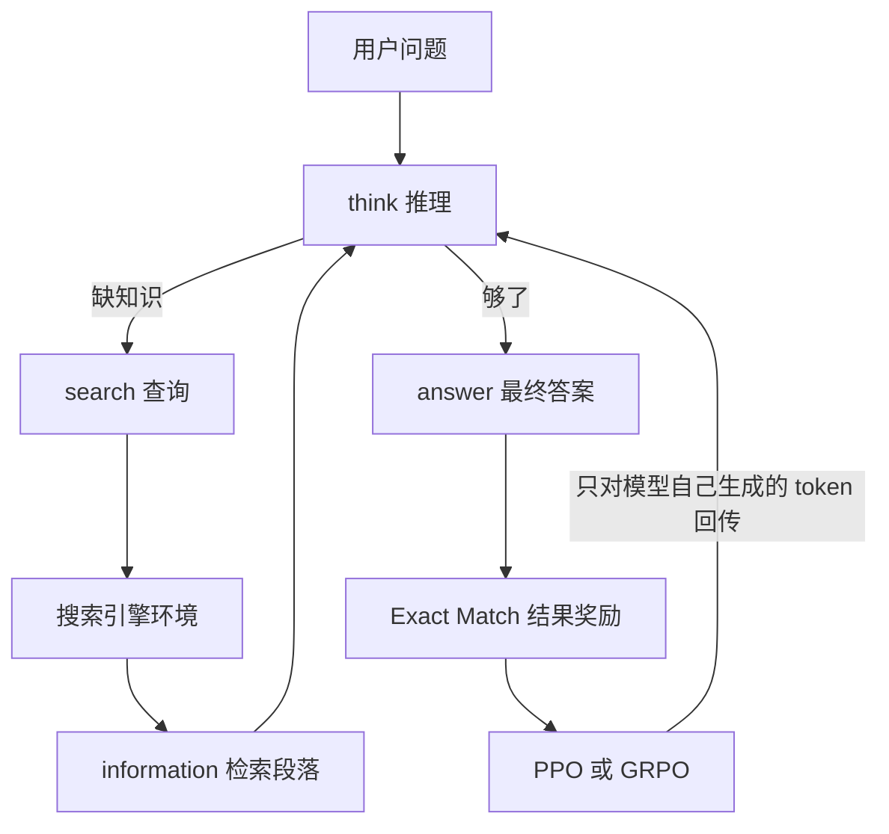

# Search-R1：用强化学习让模型边想边搜

<!-- release-date: 2025-03-12 -->

**本文依据**：`Search-R1: Training LLMs to Reason and Leverage Search Engines with Reinforcement Learning`，arXiv 2503.09516v5（2025-08-05，31 页），COLM 2025 camera ready。作者 Bowen Jin、Hansi Zeng、Zhenrui Yue、Jinsung Yoon、Sercan Ö. Arık、Dong Wang、Hamed Zamani、Jiawei Han；UIUC CS、UMass Amherst CIIR、Google Cloud AI Research。代码与权重 `PeterGriffinJin/Search-R1`。首发日取 arXiv v1 提交日 2025-03-12；本地读的是 v5 / COLM 2025，v5 不回写首发日。文中数字都标 PDF 页码；标「外部补充」的段落不来自本文。

## 一句话

只靠提示让大模型去搜，模型往往不会搜、不会改查询、也不会把检索结果真正用进下一步推理。Search-R1 把搜索引擎当成强化学习环境的一部分：模型在 `<think>` 里想、在 `<search>` 里发查询、读回 `<information>`，最后用 `<answer>` 交答案。训练时对检索回来的 token 做 **loss mask**，奖励只看最终答案是否 **Exact Match**。七个 QA 上，相对同设置的 RAG，摘要写 Qwen2.5-7B **24%**、Qwen2.5-3B **20%**（PDF p.1）；正文贡献条又写两套模型相对 RAG 平均相对提升 **41%** 与 **20%**（PDF p.2）。默认 RL 算法是 PPO。

## 一、矛盾：会推理，不等于会用搜索引擎

大模型缺领域知识和时效信息，幻觉也多。接搜索引擎的常见两条路（PDF p.1–2、p.3）：

| 路线 | 做法 | 卡在哪 |
|---|---|---|
| RAG | 用用户问题当查询，检索一次，把段落拼进上下文再生成 | 查询不会随推理改写；一次检索经常不够或多跳对不上 |
| 搜索当工具 | 提示或监督微调，让模型在推理中调搜索（IRCoT、ReAct、Toolformer） | 提示泛化差；监督要大量高质量轨迹；搜索本身不可微，端到端梯度下不去 |

提示式多轮检索（如 IRCoT）看起来已经「边想边搜」，但训练目标并没有优化「怎么跟搜索引擎打交道」（PDF p.1）。监督式工具学习能适应，却难规模化。

另一边，OpenAI-o1 / DeepSeek-R1 已经证明：哪怕只给结果奖励，RL 也能长出自验证、自纠正这类推理习惯（PDF p.2）。把这套搬到「推理 + 搜索」上，作者列出三个未解问题（PDF p.2）：

1. **框架与稳定性** ：检索段落进了 rollout，怎么保证策略梯度不把检索文本也当自己生成的去学。
2. **多轮交错** ：问题难了要多搜几次，简单了可以不搜；策略必须随复杂度变。
3. **奖励** ：过程奖励难标；结果奖励够不够让模型学会稳定的搜索行为。

Search-R1 的定位很直：DeepSeek-R1-Zero 主要练参数内部推理；本文在同样「只看结果」的 RL 上，把搜索补进环境（PDF p.2）。

图是按 PDF p.4 图 1 与 p.5 算法 1 重画的机制示意，不是实测时间线。

## 二、把搜索引擎写进策略：$\pi_\theta(\cdot \mid x; \mathcal{R})$

经典 LLM-RL 假设整段 $y$ 都是策略模型吐出来的（附录 A，PDF p.15 式 5）。Search-R1 里 $y$ 夹着检索文本，目标改成（PDF p.3 式 1；附录 A 式 6）：

$$
\max_{\pi_\theta} \mathbb{E}_{x\sim\mathcal{D},\, y\sim\pi_\theta(\cdot\mid x;\mathcal{R})} \bigl[ r_\phi(x,y) \bigr] - \beta D_{\mathrm{KL}}\bigl[\pi_\theta(y\mid x;\mathcal{R}) \,\|\, \pi_{\mathrm{ref}}(y\mid x;\mathcal{R})\bigr]
$$

$\pi_\theta$ 是策略模型，$\pi_{\mathrm{ref}}$ 是参考模型，$\mathcal{R}$ 是搜索引擎。$y$ 是「模型 token + 检索段落」交错的轨迹。作者把它写成 $\pi_\theta(\cdot\mid x)\otimes\mathcal{R}$（PDF p.4）。

图 1 上半是 **PPO + 搜索**：rollout 模块里策略 LLM 和搜索引擎来回，产出轨迹 $o$，再过奖励模型、参考模型、价值 LLM，GAE 出优势 $A$（PDF p.4 图 1）。下半是 **GRPO + 搜索**：同一问题采一组 $\{o_1,\ldots,o_G\}$，组内相对奖励算优势，不再训 critic。

### 检索 token 必须 mask

PPO / GRPO 的 token 级损失默认扫整段 rollout。检索段落如果也进梯度，模型会去「模仿检索器的用词」，而不是学何时搜、搜什么。Search-R1 引入指示函数 $I(y_t)$：模型自己生成的 token 为 1，检索 token 为 0。PPO 目标只在 $I(y_t)=1$ 的位置求和（PDF p.4 式 2）。GRPO 同样 mask，KL 项也只算模型 token（PDF p.5 式 3）。

这是全文最值得搬走的实现细节：**环境吐出来的观察不要当策略动作来优化**。

### 多轮 rollout（算法 1）

动作预算 $B$，默认 **4**（PDF p.16）。每一步模型一直生成，直到打出 `</search>`、`</answer>` 或 `<eos>`（PDF p.6 算法 1）：

- 检测到 `<search>…</search>`：抽出查询，调 $\mathcal{R}$，把结果包进 `<information>…</information>` 接到轨迹上，继续想。
- 检测到 `<answer>…</answer>`：结束。
- 否则：往轨迹里塞一句 *My action is not correct. Let me rethink.*，逼它重来。

模板故意只约束格式，不灌「必须反思、必须多搜」这类内容偏见，好观察 RL 自己长出什么习惯（PDF p.5 表 1）。人话版指令是：每次拿到新信息先在 `<think>` 里想；缺知识就 `<search>`；够了就直接 `<answer>`，答案里不要长篇说明。

### 奖励：只有 EM，没有格式分

$$
r_\phi(x,y)=\mathrm{EM}(a_{\mathrm{pred}},a_{\mathrm{gold}})
$$

（PDF p.6 式 4）。相对 DeepSeek-R1，本文**不加格式奖励**，作者说学完的模型已经能守结构；也不训神经奖励模型，怕 LLM 对奖励形态敏感，再加一份算力（PDF p.6）。

## 三、实验怎么摆平

七个数据集（PDF p.6–7）：

| 类型 | 数据 |
|---|---|
| 通用 QA | NQ、TriviaQA、PopQA |
| 多跳 QA | HotpotQA、2WikiMultiHopQA、Musique、Bamboogle |

训练把 **NQ + HotpotQA** 训练集并成一份；评测覆盖这两个 in-domain，以及另外五个 out-of-domain。指标 **Exact Match**。检索语料是 2018 Wikipedia dump，检索器 **E5**，所有检索方法统一 **top-3** 段落（PDF p.7）。

模型：Qwen2.5-3B / 7B 的 Base 与 Instruct。纯推理基线用 Instruct（Base 跟不住指令）；RL 方法 Base / Instruct 都训。默认 RL 是 **PPO**（PDF p.7）。

基线三档（PDF p.7）：

1. 不检索：直接生成、CoT。
2. 推理时检索：RAG、IRCoT、Search-o1。
3. 微调：SFT；无搜索的 R1（用本文数据按 DeepSeek-R1 那套 RL 训，只有推理和答案）；带搜索的 **rejection sampling**（每题采 5 条轨迹，留下答案对的，再用同一套多轮交互做 SFT）。

公平性写得很死：同一检索器、同一篇数、同一知识库、同一训练数据、同一预训练 LLM（PDF p.7）。附录 B 解释为何不拿 Re2G、RetroLLM 当直接基线：那些管线更重、更任务特化（PDF p.15）。

### 训练超参（附录 B.2，PDF p.16）

| 项 | PPO | GRPO |
|---|---|---|
| 策略学习率 | $1\times 10^{-6}$ | $1\times 10^{-6}$ |
| 价值学习率 | $1\times 10^{-5}$ | 无 critic |
| 步数 | 500 | 500 |
| warmup | 策略 0.285，价值 0.015 | 0.285 |
| GAE | $\lambda=1$，$\gamma=1$ | — |
| 每题采样 | — | 5 条（组大小 5） |
| 硬件 | 单机 8×H100 | 同左 |
| 总 batch / mini / micro | 512 / 256 / 64 | 同左 |
| 最大序列 | 4096；回复 500；检索内容 500 | 同左 |
| $\beta$ / clip $\epsilon$ | 0.001 / 0.2 | 同左 |
| rollout | vLLM，温度 1.0，top-p 1.0 | 同左 |
| 动作预算 $B$ | 4 | 4 |

每 100 步存盘；训练发散就取奖励曲线上最近的稳定点（PDF p.16）。

## 四、主表：七个 QA 上到底赢在哪

表 2 在 PDF p.8。下面只摘「平均 EM」和几条对照，完整格子以原表为准。

**Qwen2.5-7B**（PDF p.8 表 2）：

| 方法 | NQ | TriviaQA | PopQA | HotpotQA | 2Wiki | Musique | Bamboogle | 平均 |
|---|---:|---:|---:|---:|---:|---:|---:|---:|
| Direct | 0.134 | 0.408 | 0.140 | 0.183 | 0.250 | 0.031 | 0.120 | 0.181 |
| CoT | 0.048 | 0.185 | 0.054 | 0.092 | 0.111 | 0.022 | 0.232 | 0.106 |
| IRCoT | 0.224 | 0.478 | 0.301 | 0.133 | 0.149 | 0.072 | 0.224 | 0.239 |
| Search-o1 | 0.151 | 0.443 | 0.131 | 0.187 | 0.176 | 0.058 | 0.296 | 0.206 |
| RAG | 0.349 | 0.585 | 0.392 | 0.299 | 0.235 | 0.058 | 0.208 | 0.304 |
| SFT | 0.318 | 0.354 | 0.121 | 0.217 | 0.259 | 0.066 | 0.112 | 0.207 |
| R1-base | 0.297 | 0.539 | 0.202 | 0.242 | 0.273 | 0.083 | 0.296 | 0.276 |
| Rejection Sampling | 0.360 | 0.592 | 0.380 | 0.331 | 0.296 | 0.123 | 0.355 | 0.348 |
| **Search-R1-base** | **0.480** | **0.638** | **0.457** | **0.433** | 0.382 | **0.196** | **0.432** | **0.431** |
| Search-R1-instruct | 0.393 | 0.610 | 0.397 | 0.370 | **0.414** | 0.146 | 0.368 | 0.385 |

**Qwen2.5-3B**（PDF p.8 表 2）：

| 方法 | 平均 EM | 备注 |
|---|---:|---|
| RAG | 0.270 | 3B 上最强的检索推理基线之一 |
| Rejection Sampling | 0.265 | 带搜索的过滤 SFT，平均仍低于 RAG |
| Search-R1-base | 0.303 | Bamboogle 只有 0.088，弱于部分提示方法 |
| **Search-R1-instruct** | **0.325** | 3B 上的最优 |

作者自己的四点观察（PDF p.7）：

1. 相对 RAG 的相对提升：正文写 7B **24%**、3B **20%**（与摘要一致，PDF p.1、p.7）；贡献条写两套 LLM 相对 RAG **41%** 与 **20%**（PDF p.2）。按表 2，7B Search-R1-base 平均 0.431 对 RAG 0.304，相对提升约四成，与 41% 对齐；3B 最优 0.325 对 0.270，约 20%。in-domain（NQ、HotpotQA）和 out-of-domain 都涨。
2. 超过无搜索的 R1：7B 上 R1-base 平均 0.276，Search-R1-base 0.431。外部知识进推理，不是锦上添花。
3. Base 和 Instruct 都能用 R1-Zero 那套结果奖励，搜索增强推理不是 Instruct 专属。
4. 更大模型更会学搜索：7B 相对「第二名 RAG」的缺口明显大于 3B。3B-base 在 Musique / Bamboogle 上甚至掉到 0.049 / 0.088（PDF p.8）。

CoT 在 7B 平均 0.106，低于直接生成 0.181：没有检索时硬想，会把答案想歪（PDF p.8）。Rejection sampling 有搜索轨迹，7B 平均 0.348，仍明显低于 Search-R1-base 的 0.431。同样能搜，用 RL 优化何时搜、搜什么，比只留下「答对了的轨迹」做 SFT 更有效。

### 14B 附录：规模还在涨

附录 C 表 5（PDF p.17）：Qwen2.5-14B 上 Search-R1-base 平均 **0.479**，Search-R1-instruct **0.433**；RAG 0.281，无搜索 R1-base 0.357。作者说加大模型，Search-R1 仍一致领先。

## 五、消融：PPO、mask、top-k、组大小

### PPO 对 GRPO（表 3，PDF p.8；图 2(a) / 图 5，PDF p.9、p.18）

| 7B | 平均 |
|---|---:|
| Search-R1-base GRPO | 0.350 |
| Search-R1-instruct GRPO | 0.396 |
| Search-R1-base PPO | **0.431** |
| Search-R1-instruct PPO | 0.385 |

| 3B | 平均 |
|---|---:|
| Search-R1-base GRPO | 0.312 |
| Search-R1-instruct GRPO | **0.336** |
| Search-R1-base PPO | 0.303 |
| Search-R1-instruct PPO | 0.325 |

三条经验（PDF p.8）：GRPO 收敛更快（没有 critic 热身）；PPO 更稳，GRPO 训久了会 **reward collapse**；终局奖励两者接近。本文因此默认 PPO。图 5 把 3B/7B × base/instruct 四条曲线画全，趋势一致（PDF p.18 图 5）。

### Base 对 Instruct（图 2(b)、图 4，PDF p.9、p.17）

Instruct 起点高、收敛快；训完训练奖励和 Base 非常接近。作者的判断：通用后训练能加速「推理 + 搜索」，但 RL 能把 Base 补上来（PDF p.9）。

### 回复长度与有效搜索次数（图 2(c)(d)，PDF p.9）

Qwen2.5-7B-base：

1. 前约 **100** 步：回复长度骤降，训练奖励略升——先砍废话、学会格式。
2. 100 步之后：长度和奖励一起升——开始频繁调搜索，轨迹因检索段落变长。
3. 有效搜索次数随训练单调增加（图 2(d)）。

这和「只给结果奖励，过程行为自己长」的叙事一致：模型不是被教「必须搜 k 次」，而是发现搜了更能对。

### 检索 token mask（表 4 / 表 6，PDF p.9、p.18；图 3，PDF p.17）

7B-base + PPO：有 mask 平均 **0.431**，无 mask **0.343**（NQ 0.480 vs 0.388）。3B-base：有 mask **0.303**，无 mask **0.262**。图 3 上无 mask 的训练奖励明显更差、更抖。

### top-k（图 6、表 7，PDF p.18–19）

主实验跟 Lin et al. 取 **k=3**。再比 1 / 3 / 5（7B-base + PPO，500 步）：

| top-k | 平均 EM |
|---|---:|
| 1 | 0.375 |
| **3** | **0.431** |
| 5 | 0.400 |

k=5 前 200 步奖励升最快，随后下滑且不稳；k=1 召回不够；k=5 噪声多，模型可能学到「检索经常没用」（PDF p.18）。**检索质量会反过来塑造 RL 是否愿意用工具**。

### GRPO 组大小（图 7、表 8，PDF p.19–20）

主实验组大小 5。再比 1 / 3 / 5；大小为 1 时 GRPO 退化为 REINFORCE。

| 组大小 | 平均 EM |
|---|---:|
| **1** | **0.410** |
| 3 | 0.363 |
| 5 | 0.350 |

更大组收敛快、训练奖励高，但更容易塌；更小组泛化更好。作者明确写出速度与稳定性的权衡（PDF p.19）。

## 六、案例：它到底在搜什么

附录 I / J 用 Qwen2.5-7B-base + PPO 对照无搜索 R1（PDF p.20–31）。

**成功时长什么样** ：香水 *Curious* 是哪位歌手、出生在哪：R1 直接答 Beyoncé / Houston；Search-R1 先搜香味，发现是 Britney Spears，再搜出生地 *McComb, Mississippi*，甚至再搜一次城市确认——第二轮其实已经够答，第三轮是自验证（PDF p.20 表 9、p.21）。Chris Jericho 与 Gary Barlow 的共同职业：拆成两人职业再求交，得到 musician（PDF p.21–22 表 10）。单跳够用时，一次搜索就能停（Ronald Ryan，PDF p.23 表 12）。多跳则补查询：两个国家公园分别定位，合并成 Canary Islands, Spain（PDF p.24 表 13）。

**失败模式写得很具体**（不要只当附录故事）：

| 失败 | 例子 | 页码 |
|---|---|---|
| 检索里已经有别名，答案却用了官方标题对不上 EM | Weezer 首专答 *Weezer*，标准答案 *The Blue Album* | PDF p.23 表 11 |
| 查询写偏，被无关段落带跑 | 导演问成 Sam Peckinpah | PDF p.25 表 14 |
| 查询不会拆，证据不够仍交卷 | *Is Google Making Us Stoopid?* 扩写答成 National Magazine Award，标准是 Pulitzer Prize | PDF p.27 表 16 |
| 检索跑偏到别的真人秀 | The Rap Game 答成 Flavor of Love 的赢家 | PDF p.31 表 20 |

也有「检索源不够仍停下来、用已有证据作答」的正面行为（Captain Marvel / SHAZAM，PDF p.30 表 19）。作者承认：分解失败和被无关段落误导，仍然存在（PDF p.23）。

## 七、局限与没写的东西

正文结论段把后续工作写成开放清单，而不是已完成能力（PDF p.10）：更精细的奖励、按不确定性动态调检索、接到更多工具与信息源、多模态。本文**没有**真实 Web 搜索实验，知识库是 2018 Wikipedia dump；**没有**过程奖励对比实验；格式奖励明确留给未来（PDF p.6）。评测是短答案 EM，案例里 *The Blue Album* / *Weezer* 这种别名问题，EM 会惩罚「语义对、字符串不对」。最大动作预算 4、回复与检索各截 500 token（PDF p.16），更长多跳是否还稳，原件没测。

## 八、可迁移启发

1. **工具输出是观察，不是动作**。对检索（以及任何环境返回）做 token-level loss mask，是 Search-R1 相对「把整段轨迹当 LLM 生成」最硬的一条。无 mask 7B 平均从 0.431 掉到 0.343（PDF p.9）。
2. **结果奖励可以长出搜索策略，但工具噪声会教坏策略**。top-k=5 训练后期奖励下滑，说明「多给几段」不是免费的（PDF p.18–19）。
3. **提示式多轮 RAG 不等于会用搜索**。同检索器、同数据下，IRCoT / Search-o1 平均明显低于 Search-R1；rejection sampling 有正确轨迹仍追不上 RL（PDF p.8）。
4. **PPO 更稳、GRPO 更快；组越大越容易塌**。搜索交错 rollout 比纯数学推理更噪，稳定性优先时默认 PPO 说得通（PDF p.8、p.19）。
5. **Base 也能靠 RL 追上 Instruct 的终局，但小模型学搜索更吃力**。3B-base 在最难的多跳上几乎没学会用搜（PDF p.8）。
6. **自验证会自己出现，也会浪费动作预算**。案例里第三轮确认是能力，也可能在 $B=4$ 时挤掉真正该搜的步。

对自己做 Agent RL 的直接清单：环境返回 mask 掉；先上规则结果奖励，不要一上来训过程奖励模型；检索 top-k 当训练超参而不是越大越好；用奖励曲线而不是固定最后一步做评测（发散时取稳定 ckpt，PDF p.16）。

## 关键词回看

- **Search-R1**：把搜索引擎放进 RL 环境，多轮交错推理与检索。
- **Retrieved token masking**：策略梯度与 KL 不算检索 token。
- **Outcome reward**：只对最终答案做 EM，无格式分、无神经奖励模型。
- **PPO / GRPO**：前者带 critic 更稳，后者组内相对优势、收敛快但易塌。
- **动作预算 $B$**：默认 4；格式错了会插入 rethink 句子。
