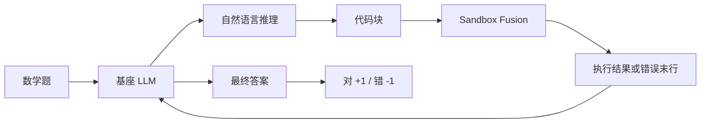

# ToRL：从基座直接做工具集成强化学习

<!-- release-date: 2025-03-30 -->

**本文依据**：`ToRL: Scaling Tool-Integrated RL`（封面排版 T O RL），arXiv 2503.23383v1（2025-03-30，10 页 A4）。作者 Xuefeng Li\*、Haoyang Zou\*、Pengfei Liu†，归属 SJTU、SII、GAIR。代码与模型 `GAIR-NLP/ToRL`。首发日取 arXiv v1 提交日 2025-03-30；本地 PDF 已是 v1。文中数字都标 PDF 页码；标「外部补充」的段落不来自本文。

## 一句话

已有的工具集成推理（Tool-Integrated Reasoning，TIR）大多先蒸馏轨迹再做监督微调，模型只能模仿预定的调工具套路。ToRL 把代码解释器塞进强化学习环境，从 **Qwen2.5-Math 基座**直接训，不走 SFT。ToRL-7B 在 AIME24 上 **43.3%**，比无工具 RL 高 **14%**，比当时最好的 TIR 模型高 **17%**（PDF p.1）。训练后期出现作者没写进提示的行为：该调工具才调、丢掉没用的代码、计算和分析来回核对。

它解决的不是「再写一套 ReACT」，而是：工具策略能不能像 R1 那类推理能力一样，从奖励里长出来，而不是从教师轨迹里抄出来。

## 一、矛盾：会推理的模型，算不准；会调工具的模型，探不开

纯自然语言思维链（Chain-of-Thought，CoT）在复杂计算、解方程、穷举上会失手（PDF p.2）。ToRA、MathCoder、Qwen2.5-Math-Instruct-TIR 一类 **TIR** 让模型写代码、交给解释器、再根据输出继续想，这条路已经被证明有效。

卡点不在「会不会调一次 Python」，而在训练方式（PDF p.2）：

| 旧做法 | 卡在哪 |
|---|---|
| 从更强模型蒸馏轨迹再 SFT | 工具怎么用被教师轨迹锁死，探索空间小 |
| 在已经 SFT 过的模型上再 RL（如部分 Qwen-Math） | 实现不透明，看不清工具是怎么嵌进 RL 循环的 |

所以 ToRL 的选择是跳过 SFT，从基座直接做带工具的 RL。作者认为这样长出来的行为，和「先模仿再微调」不是同一类东西（PDF p.2）。

## 二、全景：解释器进 rollout，奖励只看对不对



图是按 PDF p.3 式 (1)–(4) 与 p.4 的 rollout 描述重画的机制示意，不是实测时间线。

形式化：轨迹是交替的自然语言、代码、执行结果（PDF p.3）：

$$s_k = r_1, c_1, o_1, \ldots, r_k, c_k, o_k$$

每一步模型根据题目和已有轨迹写出 $r_k, c_k$，解释器 $I$ 执行代码得到 $o_k$，再拼回去。循环直到给出最终答案。

数据不是海量题库硬堆。竞赛题来自 NuminaMATH、MATH、DeepScaleR；去掉证明题和不好自动核验的题后剩 **75,149** 道可核验题，再用他们自己的 LIMR 做难度平衡蒸馏，落到 **28,740** 道，后面实验都用这份（PDF p.2）。

## 三、为什么不做 SFT

SFT 会把「何时写代码、写什么样的代码」先钉死。后面的 RL 只能在这条窄路上微调。ToRL 要的是：基座在奖励驱动下自己发现策略——包括什么时候不该写代码。

提示故意写得很薄（PDF p.4 图 3）：要求把自然语言和程序合在一起解题，答案放进 `\boxed{}`。没有示范轨迹，没有「必须调几次工具」的规则。

默认实验还更狠（PDF p.5）：

- 算法 **GRPO**，veRL 框架，每题 rollout **16** 条，batch **128**
- **不加 KL loss**，温度 **1**，为了探索
- 默认每条回复最多调工具 **C = 1**
- 默认奖励 **只用对错**：对 +1、错 −1；代码能否执行的 −0.5 惩罚先关掉，放到消融里再谈

训练框架是 veRL，解释器是 ByteDance 的 Sandbox Fusion；评测 greedy、温度 0（PDF p.5）。

## 四、Rollout 里工具怎么接进去

生成时一旦看到代码结束标记 `` ```output ``，系统停下来，抽出最近一块代码执行，再把结果按 `` ```output\nOBSERVATION\n``` `` 插回上下文，然后继续写（PDF p.4）。执行失败也把错误送回去——作者假设诊断信息能帮下一轮写出能跑的代码。

四条工程选择（PDF p.4）：

1. **上限 C**。每调一次工具，GPU 就空转；rollout 速度和调工具次数大致成反比。超过 C 次就不再执行，强迫改回纯文本。
2. **沙箱**。先试过 qwen-agent 的 Python 执行器，延迟极低，但和训练进程不隔离，段错误可能拖垮整次训练。改用 Sandbox Fusion，稍慢，但隔离。
3. **错误只留最后一行**。完整 traceback 带一堆无关路径；只留 `NameError: name 'a' is not defined` 这类末行，省上下文。
4. **观察结果不算 loss**。沙箱输出在算梯度时 mask 掉，避免模型背具体打印，而不是学推理。

可执行性惩罚做成表（PDF p.5 表 1–2）：答案对 +1、错 −1；代码能跑 0、不能跑 −0.5。主实验不用后一张表。

## 五、主结论：43.3% / 14% / 17%

表 3 评测时为了公平，**工具调用上限也设成 1**（PDF p.5）。Qwen2.5-Math-Instruct-TIR 是把已有 Instruct 模型放进同一套 TIR 环境测，不是作者另训的 TIR 专家。

| 模型 | SFT/RL | 工具 | AIME24 | AIME25 | MATH500 | Olympiad | AMC23 | 平均 |
|---|---|---|---:|---:|---:|---:|---:|---:|
| Qwen2.5-Math-1.5B-Instruct | RL | 否 | 10.0 | 10.0 | 66.0 | 31.0 | 62.5 | 35.9 |
| 同上-TIR | RL | 是 | 13.3 | 13.3 | 73.8 | 41.3 | 55.0 | 41.3 |
| **ToRL-1.5B** | RL | 是 | **26.7** | **26.7** | **77.8** | **44.0** | **67.5** | **48.5** |
| Qwen2.5-Math-7B-Instruct | RL | 否 | 10.0 | 16.7 | 74.8 | 32.4 | 65.0 | 39.8 |
| 同上-TIR | RL | 是 | 26.7 | 16.7 | 78.8 | 45.0 | 70.0 | 47.4 |
| SimpleRL-Zero | RL | 否 | 33.3 | 6.7 | 77.2 | 37.6 | 62.5 | 43.5 |
| rStar-Math-7B | SFT | 否 | 26.7 | — | 78.4 | 47.1 | 47.5 | — |
| Eurus-2-7B-PRIME | RL | 否 | 26.7 | 13.3 | 79.2 | 42.1 | 57.4 | 43.1 |
| **ToRL-7B** | RL | 是 | **43.3** | **30.0** | **82.2** | **49.9** | **75.0** | **62.1** |

相对表内同底座 Instruct-TIR：1.5B 的 AIME24 从 13.3 到 26.7（+13.3）；7B 从 26.7 到 43.3（+16.6）。摘要里的「超过无工具 RL **14%**、最佳已有 TIR **17%**」是封面主张（PDF p.1）；表 3 里 7B 无工具 Instruct 是 10.0，SimpleRL-Zero 无工具是 33.3，ToRL-7B 43.3 相对后者是 +10.0。引言另写 43.3% 可与部分 32B RL 模型相比（PDF p.2），没有列出那几个 32B 的分数。

图 1 是 16 步滑动平均的 AIME24 训练曲线（PDF p.1 图 1，视觉核对）：

- 左：ToRL-1.5B，横轴约 0–1000 step，纵轴 5–25；蓝线相对灰虚线 Qwen-Math-1.5B-Ins-TIR 标了 **+12%**，红线是无工具 baseline。
- 右：ToRL-7B，横轴约 0–500 step，纵轴 20–40；相对 baseline 标了 **+14%**。蓝线后段明显高于红线和灰虚线。

图 4 把 7B 拆到五个基准：Average / AIME24 / AIME25 / MATH500 / OlympiadBench / AMC23，蓝线全程压过红（无工具）和灰虚（Instruct-TIR）（PDF p.6 图 4）。具体终点以表 3 为准，不从图上估点。

1.5B 平均 **48.5%**，相对 Instruct-TIR 的 41.3 是 +7.2；7B 平均 **62.1%**，相对同表其他开源同底座是 +14.7（PDF p.5）。

## 六、训练中工具行为怎么变

图 5 看的是训练过程，不是最终分数（PDF p.6）。正文写明的数字：

- **Code Ratio**：前 **100** step 内，含代码的回复比例从约 **40%** 升到 **80%**（PDF p.6）。
- **Pass Ratio**：能跑通的代码比例持续上升（图 5b 纵轴刻度约 0.76–0.84，正文未给终点精确值）。
- **对/错样本的 Pass Ratio**：答对的轨迹，代码通过率更高（PDF p.6）。
- **有效代码**：真正被解释器执行的比例（超出 C 的代码不算），以及最终答案出现之前写下的代码比例，两条都随训练上升——后验「验算用」的空转代码在被压下去。

Takeaway-I（PDF p.7）：步数增加后，用代码解题的比例和能跑通的比例都在涨；同时模型自己识别并减少无效代码。这就是摘要里的「自我管制无效代码」，提示里没有这条规则。

## 七、C 和可执行惩罚：一个有用，一个没用

在 1.5B 上把 C 从 1 调到 2，平均准确率大约再高 **2%**，训练却明显变慢（PDF p.7 图 6a–b、表 4）：

| C | 单步平均时间（秒） |
|---:|---:|
| 0 | 118 |
| 1 | 237 |
| 2 | 288 |

测在 **8×A800** 上（PDF p.7）。C=0 就是不调工具；从 0 到 1，单步时间翻倍还多。这是「多调一次工具换两点分」和「GPU 空等解释器」之间的硬权衡。

把「代码跑不通 −0.5」加进奖励（图 6c–d 的 ErrorPenalty），**没有涨分**（PDF p.7）。作者猜测：罚执行错误会诱使模型写极简、几乎不会错、但也解不了题的代码。所以默认实验关掉这项是有意识的，不是漏做。

Takeaway-II：加大 C 能提分但严重伤效率；可执行性奖励加了没用。

## 八、涌现：战略调工具、交叉验证、听错误改代码

封面下半是一条后期轨迹（PDF p.1 图 1）：自然语言推出 $k+m=-9$，代码打出 16，对不上，于是重写代码、再跑，最终改口成 16。

表 5（PDF p.8）：Horner 法算多项式，第一次代码 `TypeError: 'int' object is not subscriptable`，模型改存储方式后再跑，得到 $v_1=-7$。

表 6（PDF p.8）：12 个球的编号题，自然语言先给出不合法的 2, 10, 13，代码核出 `[3, 10, 12]`，模型改答案。

Takeaway-III（PDF p.7）：ToRL 长出多种认知行为——吃执行反馈、用代码和自然语言交叉检查。摘要还写了「计算 vs 分析之间动态切换」（PDF p.1）。这些是训练后期的观察，不是单独消融出来的因果证明。

图 2 用同一道「小数点后紧跟几个 0」对比 CoT 和 TIR：CoT 手算得 9，TIR 跑 Python 得 17（PDF p.3）。用来说明工具能改结论，不是 ToRL 训练后的样本。

## 九、没写什么，以及能搬走什么

10 页论文停在结论和参考文献。没有：多工具（搜索、计算器以外的 API）、大于 7B、C>2 的完整曲线、与「先 SFT 再同样 GRPO」的对照、可执行惩罚为何伤害探索的定量证据、解释器延迟分解、AIME 之外的非数学任务。奖励是规则核答案，不适用于不好自动判对的开放题。默认 C=1 意味着主表数字是在「每题最多跑一次代码」的约束下拿到的。

可迁移的几条，不依赖他们那 2.8 万题：

1. **工具策略可以放进 RL 探索，不必先 SFT 钉死**。若你已经有能核验的奖励，优先试基座 + 环境里的解释器。
2. **观察结果必须 mask**。否则模型容易背打印，而不是学何时该算。
3. **错误要回传，但不要用「跑不通就扣分」当主奖励**。反馈当上下文，对错当奖励，两件事分开。
4. **C 是训练墙钟，不是推理装饰**。多一次调用可以涨点分，单步时间从 118s 量级跳到 200s 以上；先定预算再定 C。
5. **隔离执行环境**。低延迟但和训练共进程的解释器，一次非法内存访问就能毁掉整次 job。

## 关键词回看

- **TIR**：推理中间插入可执行代码，用输出当下一轮上下文。
- **ToRL**：TIR 放进从基座出发的 RL，而不是 SFT 之后的修补。
- **C**：单条回复允许的最大工具调用次数。
- **GRPO**：本组实验用的策略优化算法；本文当训练配置用，不展开公式。
- **Code Executability Reward**：跑不通扣 0.5；主实验不用。

## 参考资料

- 论文：https://arxiv.org/abs/2503.23383
- 仓库：https://github.com/GAIR-NLP/ToRL
- Sandbox Fusion（文中执行环境）：https://bytedance.github.io/SandboxFusion/
