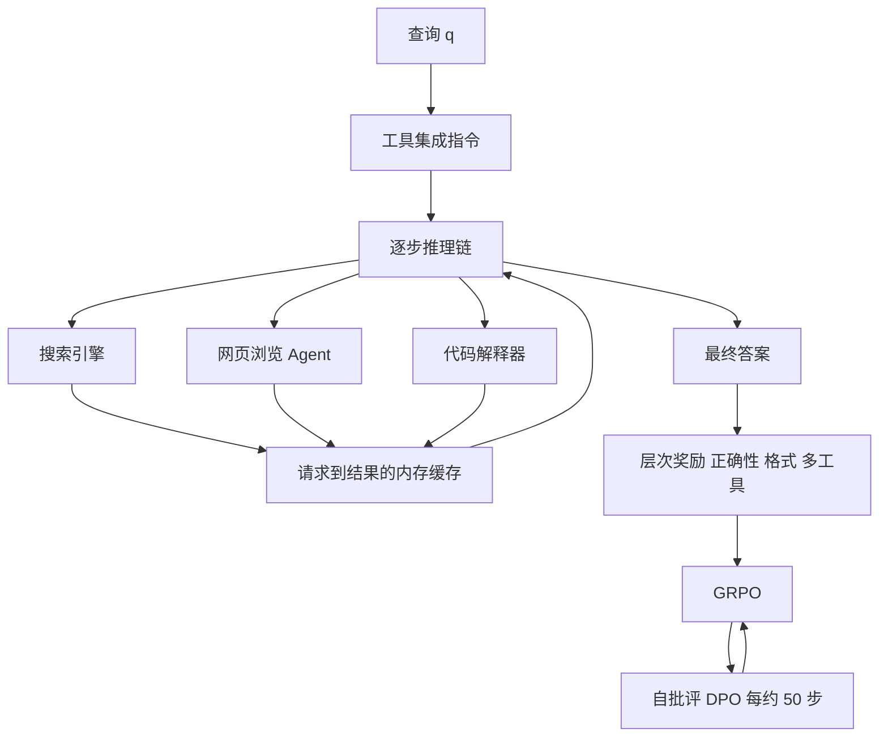

# Tool-Star：多工具协作难在「一起训」，不只是再加一把工具

<!-- release-date: 2025-05-22 -->

**本文依据**：`Tool-Star: Empowering LLM-Brained Multi-Tool Reasoner via Reinforcement Learning`，arXiv 2505.16410v1（2025-05-22，39 页 letter）。作者 Guanting Dong、Yifei Chen、Xiaoxi Li、Jiajie Jin、Hongjin Qian、Yutao Zhu、Hangyu Mao、Guorui Zhou、Zhicheng Dou（通讯）、Ji-Rong Wen。Renmin University of China、BAAI、Kuaishou Technology。代码 `https://github.com/dongguanting/Tool-Star`。本地 PDF 头已是 v1，首发日取 v1 提交日 2025-05-22。文中数字都标 PDF 页码；标「外部补充」的段落不来自本文。

## 一句话

单工具强化学习会把模型训成「只会搜」或「只会写代码」的专才：Search-R1 在知识题上能到 40% 以上 F1，计算题相对底座掉超过 20 个点；ToRL 反过来在知识题上甚至不如 RAG（PDF p.9）。Tool-Star 的主张是：先用合成管线造出「该不该调、从易到难」的轨迹，再冷启动 SFT，再用带层次奖励的 multi-tool self-critic RL，让 3B 模型在十个基准上平均到 **46.1**，相对 Qwen2.5-3B-Instruct 的 26.1 大约涨 20 个点（PDF p.8 表 1）。

它解决的不是「再写一套 ReACT」，而是：多工具协作为什么训不动，以及奖励、数据和推理时补丁怎么一起把这件事做成。

## 一、矛盾：会搜或会算，不等于会协作

2025 年春，DeepSeek-R1 和 o1 一类模型已经靠大规模强化学习长出长思维链。真实任务却经常同时要两件事：动态找信息，以及精确计算。工具集成推理（Tool-Integrated Reasoning，TIR）把外部工具嵌进逐步推理，把纯语言推理扩成和环境交互（PDF p.2）。

当时三条路都卡在同一处（PDF p.2–3）：

1. **提示**：Search-o1 一类靠提示让模型自己搜，实现便宜，工具用得不稳。
2. **蒸馏加 SFT**：从强模型抄轨迹，弱模型模仿。轨迹质量封顶，出分布就垮。
3. **单工具 RL**：ToRL、Search-R1、ReTool、OTC、ToolRL 用结果奖励让模型自己探索。它们几乎都只跟一把工具玩。

论文点名的缺口是：现实推理要同时吃搜索引擎和代码解释器的反馈，当时几乎没有针对多工具协作的专用 RL 和奖励（PDF p.3）。于是两个研究问题被钉死（PDF p.2）：

- 怎么让工具用得合理、调用成本可控。
- 怎么在整条推理链里把多把工具的功能接起来。

后文实验把这个缺口写成数字：只靠多工具提示，十项平均 **23.4**，还低于底座 26.1（PDF p.8 表 1）。提示能让模型「看起来在调」，学不到有效行为。

## 二、全景：六把工具，两段训练，一条合成管线

Tool-Star 把系统拆成三块（PDF p.3–4，图 2–3）：

1. 合成高质量工具轨迹。
2. 两阶段训练：冷启动 SFT，再 multi-tool self-critic RL。
3. 推理时再挂三把「补丁工具」，专门收拾失败。

训练时真正让模型自己调的是三把核心工具；另外三把只在推理时上场（PDF p.4）。

图是按 PDF p.4 工具设计、p.7 图 3 重画的机制示意，不是实测时间线。

形式化上，给定查询 $q$、工具集 $T$ 和指令 $I^{T}$，模型一边生成推理链 $R_c$，一边把工具反馈 $F^{T}$ 拼回去，直到写出答案 $y$（PDF p.4 式 (1)）。这不是「先想完再调一次」，而是每一步都可以调、调完继续想。

## 三、六类工具：三把用来学，三把用来救

### 训练时三把（PDF p.4，细节 PDF p.20–21）

- **搜索引擎**：本地检索或网页检索。训练时用 Bing 网页搜索；开域问答评测改用 2018 Wikipedia 加 E5。经验上，网页摘要和浏览 Agent 都能抬 RL，但摘要更慢（PDF p.21）。
- **网页浏览 Agent**：打开搜索结果 URL，解析、正则清洗，再用同规模 Instruct 模型按查询摘要。可选：关掉它，搜索引擎就直接回 snippet。
- **代码解释器**：沙箱跑模型写的代码，对就回结果，错就回报错。实现跟 ToRA 对齐（PDF p.21）。

为了少等重复调用，rollout 里加了**内存**：同一请求直接命中缓存（PDF p.6）。训练时工具调用次数上限是 **3**，为了加速（PDF p.22，跟 DAPO 的做法）。

### 推理时三把（PDF p.4、p.7）

- **代码调试器**：拿原代码加编译错误，只输出修好的 Python。
- **工具回溯器**：调用失败或调试失败时，回到出错特殊标记前的换行，从那里重写。实验里模型自己定位经常不准，所以用规则回溯（PDF p.21）。
- **推理链精炼器**：超长时删冗余，换成更短的链再继续；精炼后可以不再调工具。

这三把在实验里用的都是和被试**同规模**的 Instruct 模型，论文把它写成一种 self-play 式的推理时扩展（PDF p.21）。图 4 显示加推理时工具后调用错误下降、分数上升；DotaMath 在 GSM8K 上的增益超过 **20%**，因为弱代码模型更吃这套补丁，Tool-Star 本身错误已经较少（PDF p.10）。

## 四、数据从哪来：提示采样加 hint，再按难度切开

缺工具轨迹是第一道墙。管线三步（PDF p.4–5，图 2）。

### 原料

约 **90K** 纯文本推理数据 $D_{\text{text}}$，加约 **1K** 已有 TIR 数据 $D_{\text{tool}}$（PDF p.4）。表 5 拆开是（PDF p.21）：

| 来源 | 类型 | 任务 | 条数 |
|---|---|---|---:|
| NuminaMath | 纯语言 | 计算 | 72.4K |
| HotpotQA | 纯语言 | 知识 | 8.1K |
| 2WikiMultiHopQA | 纯语言 | 知识 | 10K |
| SimpleDeepSearch | TIR | 知识 | 0.9K |
| WebWalker | 纯语言 | 知识 | 3K |

附录又写：计算侧 72.4K 对齐 Numina-MATH TIR；知识侧 HotpotQA 加 2Wiki 共 **10.6K**，再加 0.9K SimpleDeepSearch 和 3K WebWalker；合计约 **100K**，其中 TIR 原数据大约 **1%**（PDF p.22）。只用这些数据集的**问题**，不抄强模型原思维链。采样底座是 Qwen2.5-3B-Instruct，温度 **0.7**、top-p **0.95**，每题只采 **3** 次（PDF p.22）。

### 第一步：两种采样

**TIR 提示采样**（PDF p.4）：用工具集成提示让模型在 `<search>` / `<python>` 里发请求，解析后调工具，把反馈塞进 `<result>`，循环直到超调用次数、超长，或写出 `<answer>`。只留答对的，得到 $D_{\text{tool}}^{P}$。

**Hint 采样**（PDF p.5）：先让模型纯语言推理，再按 START 的思路插入两类 hint——逻辑校验（随机替换 maybe / wait / not sure 一类犹豫词）和答案反思（插在答案后）。从 hint 处截断，让模型接着做带工具的推理。只留答对的，得到 $D_{\text{tool}}^{H}$。再和原有 $D_{\text{tool}}$ 合并成 $D_{\text{tool}}^{v1}$。

这不是「强模型教弱模型怎么调」，而是用同一底座自己滚轨迹，再用对错过滤。

### 第二步：质量归一

三条硬规则（PDF p.5）：

1. **调用次数**：超过阈值 $\beta$ 的丢掉，$\beta=5$（PDF p.22）。
2. **去重**：同一回复里重复搜同一查询或重复同一段代码的丢掉。
3. **格式**：统一特殊标记，保证起止标签成对。

得到 $D_{\text{tool}}^{v2}$。

### 第三步：难度分级

再对每道题做一次纯语言推理。按「直接推理（DR）对不对」和「工具推理（TIR）对不对」切四类（PDF p.5–6，图 2）：

- 第 1、2 类：DR 已经对，工具没必要。从文本结果里抽出 $D_{\text{text}}^{\text{sub}}$。
- 第 3 类：TIR 对、DR 不对，工具的价值最清楚，进 $D_{\text{tool}}^{\text{sub}}$。
- 第 4 类：两边都难，留给 RL，记 $D_{\text{tool}}^{\text{RL}}$。

冷启动 SFT 集 $D_{\text{tool}}^{\text{SFT}} = D_{\text{text}}^{\text{sub}} \cup D_{\text{tool}}^{\text{sub}}$。最终约 **54K** 条（1–3 类）做冷启动，从第 4 类随机抽 **10K** 做 RL（PDF p.22）。逻辑是课程学习：先学会「什么时候不该调、什么时候该调」，再在难题上练多工具协作。

## 五、两阶段训练：先会格式，再懂奖励

### 冷启动 SFT

标准下一词预测（PDF p.6）。超参（PDF p.22）：Qwen2.5-3B-Instruct，学习率 $7\times 10^{-6}$，DeepSpeed ZeRO-3 加 FlashAttention-2，batch **128**，weight decay **0.1**，**3** 个 epoch，BF16，最长输入 **4096**。

这一步的作用后文用曲线说清楚：RL 第 0 步奖励就已经不错，3B / 1.5B 的验证分大约从 **0.375** 和 **0.29** 起步，纯 Instruct 低于 **0.15**（PDF p.10）。冷启动把早期黑盒乱探索砍掉一截。这和 ToolRL 那篇「冷启动 GRPO 往往强过先 SFT 再 RL」不是同一设定——Tool-Star 的 SFT 数据是按难度筛过的，而且明确要给 RL 留第 4 类难题。

### 层次奖励

不只看对错和格式，还奖励「真的两把工具一起用」（PDF p.6 式 (3)）：

- 格式差：$-1$。
- 格式对、准确率为 0：$0$。
- 格式对且准确率 $>0$：取 $\max(\text{Acc.}+r_{M}, \text{Acc.})$。
- 若推理链里同时出现 `<search>` 和 `<python>`，$r_{M}=0.1$，否则 $0$。

奖励范围大约 $[-1, 1.1]$（PDF p.10）。多工具奖励很小，故意挂在「已经答对」之后，避免为了拿 0.1 乱调。

### 带工具的 GRPO

算法是组相对策略优化（Group Relative Policy Optimization，GRPO）：同一问题滚一组输出，组内标准化优势，不必另训 critic（PDF p.6 式 (4)）。Rollout 里检测到特殊标记就调工具，反馈拼回链。**工具返回全部 mask，不算进 loss**，只对文本推理和工具请求算梯度，免得策略去拟合检索文档或解释器输出（PDF p.22，图 3）。

附录图 8：去掉 mask，奖励迅速塌到 **-1**，持续策略 hacking。作者认为多工具反馈比单工具 RL 更不稳，单工具文献里 mask 不一定会炸（PDF p.19）。

GRPO 超参（PDF p.22）：veRL，约 10K 题，每题 **8** 条 rollout，总 batch **128**、mini-batch **16**，最长输出 **4096**，训练期最多调工具 **3** 次，KL 系数 **0**，**2** 个 epoch，8 张 A800。验证集约 **300** 条，覆盖 AIME24/25、MATH500、HotpotQA、2Wiki、MuSiQue、Bamboogle。学习率正文排版残缺，PDF p.22 可见为 $1\times 10^{-6}$。结果是三次独立试验平均。

### Self-critic：每隔一段 RL，用 DPO 把奖励原则吃进去

层次奖励对模型不友好，不容易自己摸到「什么行为值得 0.1」。做法（PDF p.6–7，算法 1 在 p.20）：

1. 先对冷启动模型做 $K$ 步普通 GRPO，得到 $\pi_{\theta}^{\text{RL}}$。
2. 从 RL 集里拒采样一批题，当前策略每题自采样 $n$ 条。
3. 规则奖励自动打分。$r_{i}\ge 1$ 当正例，$r_{i}<1$ 当负例。输出里带候选回复、推理痕迹和分数。
4. 用 DPO 拉开正负例（PDF p.7 式 (5)）。参考模型固定为进入该阶段时的 $\pi_{\theta}^{\text{RL}}$。

DPO 超参（PDF p.22–23）：学习率 $5\times 10^{-7}$，余弦、warmup **0.1**，全局 batch **64**，sigmoid、$\beta=0.3$，**2** epoch，最长 **4096**。标准 RL 每 **0.5** epoch（约每 **50** 步）插一次 self-critic，再用得到的模型接回 GRPO。算法 1 写成外层循环 $C$ 次：每次先 GRPO $S$ 步，再对采样题各滚 $G$ 条，挑一对对错做 DPO（PDF p.20）。

案例里，负例分数 **-1** 常常是因为特殊标记数量对不上参考，属于格式不一致（PDF p.27）。Self-critic 不是另训一个裁判模型，而是让策略自己看见「同一题上，什么样的链能拿到 $\ge 1$」。

GRPO 和 REINFORCE++ 在表 4 里差不到 **3%**：GRPO 在 GSM8K / MATH 略高（85.0 / 81 对 84.4 / 80.5），REINFORCE++ 在 Bamboogle 略高（53.1 对 52.5）（PDF p.19）。主文仍用 GRPO。

## 六、十个基准：专才会偏科，通才才平均得高

评测分计算和知识（PDF p.8）。计算用 Qwen2.5-72B-Instruct 做 LLM 裁判；开域问答用 token 级 F1。答案从 `\box{}` 里抽。另定义工具使用效率

$$
\mathrm{TE}=\frac{1}{N}\sum_{i=1}^{N}\frac{S_{i}}{T_{i}^{c}}
$$

即各数据集「用工具时答对比例」再平均（PDF p.8）。图 1 左侧就是知识 vs 计算的平均 TE：Search-o1、ReCall、ToRL 各偏一边，Tool-Star 两边都高（PDF p.1）。

基线三类：底座 Instruct；单工具（ToRL、DotaMath、RAG、Search-o1、Search-R1）；多工具（多工具提示、ReCall）。缺 3B Instruct 官方权重的，按开源超参复现。知识题上给代码助手模型补 RAG（Top-5），求公平（PDF p.8）。

### 表 1 主结果（PDF p.8；雷达图数字与表一致，PDF p.1 图 1）

| 方法 | AIME24 | AIME25 | MATH500 | GSM8K | MATH | WebWalker | HQA | 2Wiki | MuSiQ | Bamb | 平均 |
|---|---:|---:|---:|---:|---:|---:|---:|---:|---:|---:|---:|
| Qwen2.5-3B-Instruct | 10.0 | 6.7 | 63.0 | 75.0 | 71.6 | 0.5 | 9.7 | 9.4 | 3.6 | 11.7 | 26.1 |
| Llama3.2-3B-Instruct | 0.0 | 3.3 | 40.0 | 71.2 | 58.2 | 0.5 | 12.5 | 9.2 | 4.0 | 18.3 | 21.7 |
| ToRL | 20.0 | 10.0 | 72.0 | 84.4 | 81.0 | 12.0 | 37.9 | 27.0 | 8.3 | 25.4 | 37.8 |
| DotaMath | 3.3 | 6.7 | 56.2 | 78.2 | 71.8 | 11.5 | 35.6 | 31.2 | 7.5 | 23.8 | 32.6 |
| RAG | 13.3 | 10.0 | 54.0 | 46.0 | 56.0 | 14.6 | 39.4 | 31.2 | 10.3 | 17.4 | 29.0 |
| Search-o1 | 16.7 | 3.3 | 69.0 | 34.0 | 63.0 | 13.0 | 34.9 | 28.9 | 9.6 | 35.1 | 30.2 |
| Search-R1 | 0.0 | 3.3 | 26.0 | 43.0 | 44.0 | 14.4 | 43.2 | 25.5 | 16.5 | 40.8 | 25.7 |
| Multi-Tool Prompting | 3.3 | 3.3 | 54.2 | 48.8 | 59.6 | 9.2 | 15.9 | 16.2 | 6.5 | 17.8 | 23.4 |
| ReCall | 16.6 | 6.7 | 63.0 | 77.8 | 74.2 | 13.0 | 43.5 | 38.9 | 16.5 | 40.8 | 39.1 |
| **Tool-Star（Qwen2.5-3B）** | **20.0** | **16.7** | **72.0** | **85.0** | **82.6** | **20.8** | **51.9** | **40.0** | **19.3** | **52.5** | **46.1** |
| Tool-Star（Llama3-3B） | 10.0 | 10.0 | 54.8 | 77.8 | 70.6 | 24.0 | 48.9 | 43.2 | 16.6 | 54.7 | 41.0 |

三条读法（PDF p.8–9）：

1. 只靠提示挖不出好行为。多工具提示平均 23.4，低于底座。
2. 单工具 RL 偏科。Search-R1 的 HQA 43.2，MATH500 却只有 26.0（底座 63.0）；ToRL 计算强、知识弱于 RAG。
3. Tool-Star 在 Qwen 和 Llama 上都涨，平均提升接近 **20%**（正文口径，PDF p.9）。Qwen 版平均 46.1 是表内最高；Llama 版平均 41.0，WebWalker / 2Wiki / Bamboogle 甚至高于 Qwen 版。

### 更深的网：GAIA 和 HLE（PDF p.19 表 3）

| | Qwen | Llama | ToRL | DotaMath | RAG | Search-o1 | Search-R1 | Multi-Tool Prompting | Tool-Star |
|---|---:|---:|---:|---:|---:|---:|---:|---:|---:|
| GAIA | 3.9 | 5.8 | 8.7 | 4.9 | 8.7 | 7.8 | 9.7 | 5.8 | **15.5** |
| HLE | 7.4 | 5.0 | 7.2 | 4.8 | 7.2 | 6.2 | 7.8 | 5.6 | **8.0** |

GAIA 上相对第二名 Search-R1 的 9.7，作者写成超过 **60%** 的相对提升（PDF p.19）。HLE 只到 8.0，优势薄。案例（表 6，PDF p.29）是典型多工具：先搜「最长寿脊椎动物」得到格陵兰鲨，再搜格陵兰 2023 人口，再用 Python 四舍五入到千位得到 56000。HotpotQA / AIME 案例则常只调一把该调的工具（PDF p.27、p.30–31）。论文把这写成：会按任务选「组合还是单工具」，不是每题都强行双开。

### 消融（PDF p.9 表 2，3B）

| | HQA | Bamb | GSM8K | MATH |
|---|---:|---:|---:|---:|
| Tool-Star | 51.9 | 52.5 | 85.0 | 82.6 |
| 去掉冷启动 | 43.5（-8.4） | 40.8（-11.7） | 77.8（-7.2） | 74.2（-8.4） |
| 去掉 RL | 47.5（-4.4） | 43.9（-8.6） | 80.2（-4.8） | 78.4（-4.2） |
| 去掉层次奖励 | 50.4（-1.5） | 50.3（-2.2） | 83.1（-1.9） | 80.2（-2.4） |
| 去掉 Self-Critic | 49.8（-2.1） | 48.3（-4.2） | 82.8（-2.2） | 77.8（-4.8） |

两阶段都砍不得：去冷启动掉得最狠，去 RL 次之。层次奖励和 self-critic 是在已经能跑的 RL 上再抠点。

### 本地搜还是网页搜（PDF p.10 图 5）

知识题上，网页搜相对本地 Wikipedia：HotpotQA 几乎不动；2Wiki 约 **+13** F1，Bamboogle 约 **+8** F1。作者给两个原因：wiki 是网页语料子集，浏览 Agent 能给出比 wiki 文档更短更准的信息；Bing 服务端检索强过他们离线部署的 E5-base（PDF p.10）。训练用 Bing、美英区域、每查询 **10** 页；推理时数学和复杂推理用 Bing，开域 QA 用 FlashRAG 的 2018 Wikipedia 加 E5-base-v2（PDF p.23）。

### 规模与曲线（PDF p.10 图 6–7）

0.5B / 1.5B / 3B 的 Qwen2.5 都从冷启动的高奖励起步，训练中平均奖励上升。大约第 **10** 步奖励有一点涌现，回复长度没有突然的「aha」拐点，而是慢慢稳住（PDF p.10）。前 100 步里 KL、奖励、验证分都往上走。冷启动之后 0–20 步奖励只有温和涌现，不像从零 RL 那样大起大落（PDF p.10–11）。

## 七、没写开的，和可带走的

局限写得很干脆（PDF p.27–28）：

- 训练三把、推理三把，相对单工具是扩了，但视觉模型当工具、MCP 一类协议都还没做。
- 算力和多工具 rollout 太贵，RL 只做到 **0.5B / 1.5B / 3B**。作者把表 4 当成可扩展的初步证据，计划 7B、32B。注意：表 4 实际比的是 GRPO vs REINFORCE++，不是参数量扫；正文「见表 4」和附录标题对不上，这是原文笔误，不是更大模型的结果。
- 更广的影响一节提醒：工具更自主之后，选错工具、推理不透明、偏见会进高风险场景，需要可控和可解释（PDF p.28）。这是立场，不是实验。

没公开或含糊的：

- 式 (1)(2) 的编号在正文里打架（hint 采样也标成式 (2)）。
- GRPO 学习率在纯文本抽取里残成「8,」，需看 PDF 页渲染。
- TE 图的逐方法精确柱高主要在图 1 左侧，正文没有另给一张数表。
- 浏览器 Agent、调试器、精炼器都是同规模 Instruct，等于推理时又烧一遍同级模型，成本没有单独报。

可迁移的几条，不依赖他们这套六工具：

1. **先问工具有没有必要**。DR 已经对的样本不要硬塞进「必须调工具」的 SFT，否则模型学会为调而调。
2. **难题留给 RL**。两边都做不对的第 4 类，比再蒸馏一条教师链更适合探索。
3. **多工具奖励要挂在答对之后**。0.1 的协作奖励很小，格式错直接 -1，避免奖励黑客。
4. **工具输出必须 mask**。多工具设定下不 mask 会塌到 -1；这和某些单工具 RL 经验相反。
5. **复杂奖励可以隔一段用 DPO 自学**。不必另训奖励模型，用规则打分做成正负对，让策略记住「$\ge 1$ 长什么样」。
6. **推理时补丁是训练的外挂，不是替代**。弱代码模型吃调试器和回溯更狠；主模型变强之后，这块增益变小。

和同方向 ToolRL 对照（外部补充，见已发布 `ToolRL.md`）：ToolRL 强调「奖励分解比再蒸馏长思考重要」，设定是通用工具选择与参数匹配；Tool-Star 强调「多异构工具协作」，设定是搜索加代码的逐步推理。两篇都用 GRPO，但 Tool-Star 坚持冷启动 SFT 加 mask 工具反馈，并多了一段 self-critic DPO。不要把两边的「冷启动更好 / 更差」直接对打，数据构造完全不同。

## 关键词回看

- **工具集成推理（TIR）**：推理过程中调用外部工具，用真实返回钉住下一步。
- **多工具协作**：同一条链里同时用搜索和代码（以及可选浏览），而不是只专精一把。
- **Hint 采样**：在纯语言链的犹豫处或答案后插入调用提示，再从那里续写成带工具的轨迹。
- **难度四级**：按 DR / TIR 对错切开，易的给 SFT，难的给 RL。
- **层次奖励**：格式、正确性，再加上「双工具都出现」的小奖励 $r_{M}$。
- **GRPO**：组内相对优势，不另训 critic。
- **Self-critic DPO**：用规则奖励把自采样轨迹分成正负，穿插进 RL，逼模型内化奖励结构。
- **工具调用 mask**：检索和代码结果不进 loss。
- **推理时工具**：调试、回溯、精炼，用来救失败，不是训练目标本身。
