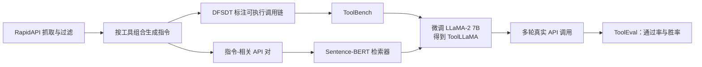

# ToolLLM：开源模型怎么学会用一万六千个真实 API

<!-- release-date: 2023-07-31 -->

**本文依据**：`ToolLLM: Facilitating Large Language Models to Master 16000+ Real-world APIs`，arXiv 2307.16789v2（2023-10-03，24 页）。作者 Yujia Qin、Shihao Liang 等，清华大学主导，ModelBest、中国人民大学、Yale、WeChat AI、知乎合作。代码与模型 `OpenBMB/ToolBench`。首发日取 arXiv v1 提交日 2023-07-31；本地读的是 v2，v2 不回写首发日。文中数字都标 PDF 页码；标「外部补充」的段落不来自本文。

## 一句话

开源 LLaMA 当时不会用工具，不是因为模型太小，而是指令微调几乎只练语言任务。ToolLLM 用 ChatGPT 自动造数据：从 RapidAPI 筛出 **16,464** 条真实 REST API（PDF p.1），再生成指令、用深度优先搜索决策树标出可执行的调用链，微调出 ToolLLaMA。在自家评测上，7B 模型接近教师 ChatGPT，还能零样本摸到没见过的 API。

**它解决的不是「再写一套 ReACT」**，而是三件连在一起的工程：数据从哪来、失败了怎么换路、一万六千个 API 里怎么先挑出该用的那几个。

## 一、矛盾：开源模型会聊天，不会办事

2023 年中，LLaMA 经过 Alpaca、Vicuna 一类指令微调，已经能对话。但把「去 RapidAPI 上查天气、订酒店、交叉验证一部电影的档期」这类事交给它，它不会。论文把原因写得很直：当时的指令微调几乎只覆盖基础语言任务，工具使用被忽略了（PDF p.1）。

闭源这边，ChatGPT / GPT-4 已经能调工具，但内部机制不公开。社区要复现，缺的是一整条可复制的管线：数据、训练、评测。

先前几份工具数据各卡在一处（PDF p.2，表 1 在 p.3）：

| 缺口 | 具体表现 |
|---|---|
| API 不够真或不够多 | 有的用模拟 API，有的只有几十到几百个真实接口 |
| 场景太窄 | 多数只覆盖单工具；真实任务往往要多工具穿插、多轮执行 |
| 假定用户已指定 API | 面对上万接口，人手点选不现实 |
| 推理太弱 | 只用 CoT 或 ReACT；有的甚至不真的打 API，拿不到真实返回就无法规划下一步 |

所以这篇要做的不是再训一个聊天模型，而是让开源模型在**真实、多样、要检索、要多步**的 API 世界里学会办事。

## 二、全景：三条流水线拧成一套框架

论文把整件事叫 **ToolLLM**：数据构造 + 模型训练 + 评测。数据叫 **ToolBench**，微调后的模型叫 **ToolLLaMA**，评测器叫 **ToolEval**。推理时先用神经 **API retriever** 推荐接口，再让模型多轮调用（PDF p.2 图 1）。

图是按 PDF p.2 图 1 重画的机制示意，不是实测时间线。

三阶段数据构造全部靠 `gpt-3.5-turbo-16k`（当时已升级 function call），人工监督很少，新 API 可以按同一流程加进去（PDF p.3）。

和先前数据集比，量级差一截（PDF p.3 表 1）：

| 数据集 | 真实 API | 真打接口 | 多工具 | API 检索 | 工具数 | API 数 | 样本数 | 真实调用次数 | 平均推理迹 |
|---|---|---|---|---|---:|---:|---:|---:|---:|
| ToolBench（本文） | 是 | 是 | 是 | 是 | 3,451 | 16,464 | 126,486 | 469,585 | 4.0 |
| APIBench | 否 | 否 | 否 | 是 | 3 | 1,645 | 17,002 | 0 | 1.0 |
| API-Bank | 是 | 是 | 否 | 否 | 53 | 53 | 274 | 568 | 2.1 |
| ToolAlpaca | 否 | 否 | 否 | 否 | 400 | 400 | 3,938 | 0 | 1.0 |
| 另一份也叫 ToolBench 的工作 | 是 | 是 | 否 | 是 | 8 | 232 | 2,746 | 3,926 | 5.9 |

注意：表里「另一份 ToolBench」是 Xu 等人 2023 的同名数据集，不是本文。本文的差异主要在**真实 REST、多工具、检索、以及真打接口得到的返回**。

## 三、阶段一：从五万接口筛到一万六千

数据不是从「先想指令再找 API」开始，而是先把 RapidAPI 上的真实接口搬下来。

RapidAPI 是面向开发者的 API 市场，注册一把 key 就能试大量第三方服务。接口按 **49** 个粗粒度 **category**（体育、金融、天气等）划分，另有 **500+** 个更细的 **collection**（如中文 API、数据库 API）；同一 collection 里的接口往往目标相近（PDF p.4）。

层次是 **category / collection → tool → API**（PDF p.4 图 3）。一个 tool 下面可以挂多条 API。论文为每个 tool 抓名称、描述、host URL 和全部 API；为每条 API 抓名称、描述、HTTP 方法、必选/可选参数、request body、可执行代码片段、示例返回。这些文档是后面「没见过的 API 只看文档也能用」的前提。

质量参差：有的 404，有的内部错误。最初抓到 **10,853** 个 tool、**53,190** 条 API；经过可用性测试、响应时间与返回质量过滤（丢掉超慢、HTML 源码、错误页），留下 **3,451** 个 tool、**16,464** 条 API（PDF p.4；过滤细节 PDF p.14 附录 A.1）。

索引里常写「1.6 万」，原件精确数是 **16,464**。

## 四、阶段二：先抽样 API，再让 ChatGPT 编指令

旧做法是头脑风暴指令再搜 API。面对稀疏的真实工具图，随机组合经常得到一堆互不相关的接口，很难写成一条自然指令。

本文反过来：先抽一小撮 API，把文档塞给 ChatGPT，让它同时产出（1）会用到这些 API 的指令；（2）每条指令真正相关的 API 子集。后者直接拿去训检索器（PDF p.4–5）。

提示由三块组成：任务说明、每条 API 的完整文档、三条人工写的种子示例。单工具种子 **12** 条，多工具 **36** 条，每次随机抽 3 条做 in-context（PDF p.5）。

三种场景对应三种抽样（PDF p.4 图 3、p.5）：

| 代号 | 场景 | 怎么抽 |
|---|---|---|
| I1 | 单工具指令 | 遍历每个 tool，针对它名下的 API 生成 |
| I2 | 类内多工具 | 同一 category 里随机抽 2–5 个 tool，每 tool 最多 3 条 API |
| I3 | 集合内多工具 | 同一 collection 里同样抽 2–5 个 tool、每 tool 最多 3 条 API |

I2 / I3 用层次结构缓解「工具之间几乎不相连」的稀疏性。生成后丢掉幻觉出的、不在抽样集合里的相关 API。最终约 **20 万** 条合格（指令，相关 API）对：I1 **87,413**，I2 **84,815**，I3 **25,251**（PDF p.5）。

附录 A.7 把提示写得很死：每条查询要调用 2–5 个 API、至少约 30 词、不要点名「该用哪条 API」，而是把具体参数（地址、产品名、公司名）直接写进用户口吻（PDF p.17–23）。这是在逼教师模型编**可执行、带槽位**的需求，而不是空泛的「帮我查一下」。

## 五、阶段三：ReACT 走不通时，换成可以悔棋的树

给定指令，要把决策写成多轮对话：每一步输出 Thought、API 名、参数，打真实接口，把返回 $r_t$ 喂回下一步（PDF p.5–6）。ChatGPT 的 function call 把每条 API 文档塞进 function 字段；另外定义两个结束函数：

- **Finish with Final Answer**：给出对用户的完整答复；
- **Finish by Giving Up**：试过多轮仍完不成（提供的 API 不够用）就放弃。

### 旧方法卡在哪

CoT / ReACT 有两条硬伤（PDF p.6）：

1. **错误传播**：一次调错会把模型锁进死循环（反复用错参数、幻觉出不存在的 API）。
2. **只探一条路**：动作空间很大，GPT-4 也经常找不到合法路径，标注效率极低。

### DFSDT 做什么

**深度优先搜索决策树（Depth-First Search-based Decision Tree，DFSDT）** 把搜索做成树：模型可以沿一条有希望的路往下走，也可以调用「放弃」丢掉当前节点、展开新节点。展开子节点时，把已经生成过的节点信息塞回提示，明确要求「生成一个不同的节点」，用来扩搜索空间（PDF p.5 图 4、p.6）。

选 DFS 而不是 BFS：标注目标是**找到一条合法路径就停**，BFS 会烧掉过多 OpenAI 调用。

只保留通过的路径，最终得到 **126,486** 条（指令，解答路径）对，用来训 ToolLLaMA（PDF p.6）。

### 实现上它其实是「先序遍历的 DFS」

经典 DFS 每层生成多个子节点再排序，用 LLM 两两比较大约是 $O(n \log n)$ 次调用。作者发现排名最高的往往就是先生成的那个，于是**跳过排序**，改成先序遍历（PDF p.14–15 附录 A.4）：

- 简单指令从不悔棋时，DFSDT 退化为 ReACT，成本相当；
- 复杂指令仍能探到经典 DFS 会探到的那些节点。

因此：训练数据是 DFSDT 造的，推理时 ToolLLaMA 仍可选用 ReACT 或 DFSDT。ReACT 被论文写成 DFSDT 的退化特例。

和并发的 Tree-of-Thought 比：ToT 面向 24 点、填字这类可用暴力搜索穷尽的任务；DFSDT 面向**决策空间近乎无限**的一般决策，实现细节因此不同（PDF p.9）。Reflexion 让模型反思失败；DFSDT 把它扩成「评估多条推理迹，挑最有希望的一条」。

## 六、API 太长怎么办：压缩返回，再拉长上下文

真实 API 返回经常又长又噪。附录 A.2：每个 API 响应格式固定，用 ChatGPT 看一条示例，按专家写的压缩 schema 删掉不重要的 key。推理时返回超过 **1024** token 就压缩；压完仍超则截前 1024（PDF p.14）。人工检查认为关键信息还在。

ToolLLaMA 底座是 **LLaMA-2 7B**，原生上下文 4096，API 返回一长就不够。用 **positional interpolation** 把上下文扩到 **8192**（PDF p.7）。训练超参（PDF p.14 附录 A.3）：学习率 $5\times 10^{-5}$，warmup ratio $4\times 10^{-2}$，总 batch **64**，最大长度 8192，插值比 **2**，训 **2** 个 epoch，按开发集选 checkpoint。输入输出格式尽量对齐 ChatGPT；function call 字段如何组织并不公开，于是把这部分**直接拼进 prompt**。

这是一个明确的缺口：学生模型没有教师那种原生 function 协议，只能用拼接近似。

## 七、API retriever：一万六千条里先召回再推理

用户不可能手工从海量接口里圈定候选。检索器把指令和 API 文档编成向量，用相似度打分。底座是 **Sentence-BERT / BERT-BASE**，正例来自阶段二的「相关 API」，再抽样负例做对比学习（PDF p.6–7）。

对照 BM25 和 OpenAI `text-embedding-ada-002`，指标是 NDCG@1 / NDCG@5（PDF p.7 表 2）：

| 方法 | I1 @1 | I1 @5 | I2 @1 | I2 @5 | I3 @1 | I3 @5 | 平均 @1 | 平均 @5 |
|---|---:|---:|---:|---:|---:|---:|---:|---:|
| BM25 | 18.4 | 19.7 | 12.0 | 11.0 | 25.2 | 20.4 | 18.5 | 17.0 |
| Ada | 57.5 | 58.8 | 36.8 | 30.7 | 54.6 | 46.8 | 49.6 | 45.4 |
| 本文检索器 | 84.2 | 89.7 | 68.2 | 77.9 | 81.7 | 87.1 | 78.0 | 84.9 |

单工具比多工具好检索，符合直觉。后文主实验里，把检索器 Top-5（而不是 oracle 的 $S_N^{\text{sub}}$）交给 ToolLLaMA，通过率和胜率**不降反升**（PDF p.8）：oracle 集合里不少 API 能被功能更好的同类替换，检索等于扩了相关集合。

## 八、ToolEval：没有唯一标准答案时怎么打分

RapidAPI 上的接口会随时间变，一条指令也可以有无数条「正确」调用链，没法标死一份 ground-truth 路径。比模型时还得保证大家打到**同一版本**的 API。人工评太慢，于是学 AlpacaEval，用 ChatGPT 做 **ToolEval**（PDF p.6）。

两个指标：

1. **Pass rate（通过率）**：有限预算内是否把指令做完。这是「能不能执行」的底线。
2. **Win rate（胜率）**：同一指令两条路径，评哪条更好。胜率相对 **ChatGPT-ReACT**；高于 50% 表示更好。表 4 把平局对半拆进胜/负，未合并的原始胜/平见附录表 6（PDF p.8、p.16）。

与人工在 300 条指令、多种方法上的一致率：通过率 **87.1%**，胜率 **80.3%**（PDF p.6、p.16）。

通过率规则很细，因为要同时处理「指令可解 / 不可解」和「给出答案 / 放弃」（PDF p.15）：

- 可解却轻易放弃、或工具给了有效信息却答非所问 / 拒答 → Fail；
- 工具全程无有效信息、已穷尽 API、最终如实说做不到 → 可以算 Pass；
- 不可解时，拒答或放弃算 Pass，自己编造「我已经完成了」算 Fail。

每条路径让 ChatGPT 预测 **不少于 4 次** 再多数表决。

胜率只在「都 Pass」或「都 Fail」的成对路径上比，准则按优先级大致是：信息是否够、是否符合事实、失败原因是否说清、里程碑数量、是否多试了有用 API、同样 API 数下少重复调用更好（PDF p.16）。

论文自己承认：工具评测比对话难得多，**人类专家之间也经常吵**——有人喜欢少调几次快速给答案，有人喜欢把 API 试遍做交叉验证。一致率因此有上限。这不是一句客套，而是把评测本身标成未完成的问题（PDF p.16）。

## 九、DFSDT 值不值得多花钱

标注前，用 ChatGPT 比过 ReACT、ReACT@N（把调用次数堆到与 DFSDT 同一预算，找到一条合法路径即算过）和 DFSDT 的通过率（PDF p.7 表 3）：

| 策略 | I1 | I2 | I3 | 平均 |
|---|---:|---:|---:|---:|
| ReACT | 37.8 | 40.6 | 27.6 | 35.3 |
| ReACT@N | 49.4 | 49.4 | 34.6 | 44.5 |
| DFSDT | 58.0 | 70.6 | 62.8 | 63.8 |

同一预算下 DFSDT 能标过更多指令，总标注成本更低。增益在 I2 / I3 上更大：难指令是 ReACT 重复多少遍也走不通的，正是这些「硬例子」把复杂工具场景灌进训练集。

## 十、主实验：7B 学生能不能追上教师

### 泛化怎么切

训练数据再多，用户仍会丢来没见过的接口。论文切三层（PDF p.7）：

1. **Inst.**：同一批训练过的工具，指令没见过；
2. **Tool**：同一 category 里、训练时没见过的工具；
3. **Cat.**：整个 category 都没见过的工具。

I1 三层都测（I1-Inst. / I1-Tool / I1-Cat.）；I2 已在类内跨工具，只测 Inst. 与 Cat.；I3 的 collection 本身就跨 category，只测 Inst.。除「检索器那一行」外，主表都把 **oracle API 集合** 喂给模型，模拟用户指定了候选接口。

基线：Vicuna、Alpaca，以及教师侧 ChatGPT、Text-Davinci-003、GPT-4、Claude-2；后四者都跑 ReACT 和 DFSDT。

### 表 4 要记住的几行（PDF p.8）

平均通过率 / 胜率：

| 模型 | 方法 | 平均 Pass | 平均 Win |
|---|---|---:|---:|
| Vicuna / Alpaca | ReACT 与 DFSDT | 0.0 | 0.0 |
| Claude-2 | DFSDT | 22.6 | 43.5 |
| Text-Davinci-003 | DFSDT | 43.1 | 46.3 |
| ChatGPT | ReACT | 40.2 | — |
| ChatGPT | DFSDT | 64.8 | 64.3 |
| GPT-4 | ReACT | 57.2 | 64.4 |
| GPT-4 | DFSDT | 71.1 | 70.4 |
| ToolLLaMA | ReACT | 29.0 | 47.0 |
| ToolLLaMA | DFSDT | 66.7 | 60.0 |
| ToolLLaMA | DFSDT + 检索器 Top-5 | 67.3 | 63.1 |

三条作者结论（PDF p.8）：

1. 通用对话微调**覆盖不到工具使用**：Vicuna / Alpaca 通过率与胜率全是 0。
2. 所有模型上 DFSDT 都明显强于 ReACT。ChatGPT+DFSDT 的通过率超过 GPT-4+ReACT，胜率相当——决策策略有时比换更强底座更划算。
3. ToolLLaMA+DFSDT 明显强于 Davinci-003 和 Claude-2，平均通过率 **66.7**，接近教师 ChatGPT 的 **64.8**（论文说 almost on par；表上通过率还略高，胜率 **60.0 vs 64.3** 仍略低），仅次于 GPT-4+DFSDT。未见过的指令和工具上泛化仍然成立。

分场景里多工具更吃策略：ChatGPT 在 I3-Inst. 上 ReACT 只有 22.0，DFSDT 拉到 62.0；ToolLLaMA-DFSDT 在 I2-Inst. / I2-Cat. 通过率都是 77.0。

PDF p.2 图 2 把各方法画在「通过率–胜率」平面上，叙事与表 4 一致：ToolLLaMA 超过 Davinci-003、Claude-2，接近 ChatGPT。

## 十一、OOD：没见过的 TorchHub / TensorHub / HuggingFace

APIBench（Gorilla 那篇）是另一套领域：机器学习 Hub 上的 API，指令和接口都不在 ToolBench 里。ToolLLaMA **不再训练**，只换检索器（自家检索器或 oracle），并定义一个「选 API、给调用代码、用自然语言描述输出」的函数；不做 APIBench 那种完全不给 API 描述的 zero-shot，因为三个域训练时从未见过（PDF p.8–9、p.16 附录 A.6）。

对照 Gorilla（在 APIBench 上微调的 LLaMA-7B）：ZS = 训练时 prompt 不含检索到的 API；RS = retrieval-aware。指标是幻觉率（越低越好）和 AST 准确率（PDF p.9 表 5）：

| 方法 | HF 幻觉 | HF AST | TorchHub 幻觉 | TorchHub AST | TensorHub 幻觉 | TensorHub AST |
|---|---:|---:|---:|---:|---:|---:|
| ToolLLaMA + 本文检索器 | 10.60 | 16.77 | 15.70 | 51.16 | 6.48 | 40.59 |
| Gorilla-ZS + BM25 | 46.90 | 10.51 | 17.20 | 44.62 | 20.58 | 34.31 |
| Gorilla-RS + BM25 | 6.42 | 15.71 | 5.91 | 50.00 | 2.77 | 41.90 |
| ToolLLaMA + Oracle | 8.66 | 88.80 | 14.12 | 85.88 | 7.44 | 88.62 |
| Gorilla-ZS + Oracle | 52.88 | 44.36 | 39.25 | 59.14 | 12.99 | 83.21 |
| Gorilla-RS + Oracle | 6.97 | 89.27 | 6.99 | 93.01 | 2.04 | 94.16 |

读法：

- 同一 oracle 下，ToolLLaMA 全面压过 Gorilla-ZS；对上专门为 APIBench 训过的 Gorilla-RS，AST 接近但幻觉更高。
- 自家检索器 + ToolLLaMA，在 HF / TorchHub 的 AST 上超过 Gorilla+BM25 的两种训练设置。
- 反过来，Gorilla **泛化不回 ToolBench**：多工具、多步、真 REST 比 Hub 单次调用难得多（PDF p.9）。

「文档写清楚 + 检索 + 多步决策」这套，比「在某个 Hub 上把调用格式背熟」更能搬到新域。

## 十二、论文没单列限制，但边界已经写在正文里

24 页里没有 Limitations 小节。能从正文直接读出的边界如下。

- **教师与数据偏差**：整条标注链依赖 ChatGPT function call。学生学到的是教师会走的路，不是「人类专家最优工具策略」。
- **RapidAPI 会变**：接口时效、配额、挂掉，是他们放弃固定标准答案、强调评测时版本一致的原因（PDF p.6）。
- **评测上限**：人类都对「怎样算更好的路径」达不成一致（PDF p.16）。ToolEval 是可扩展的代理，不是金标准。
- **Function 协议未对齐**：ChatGPT 如何组织 function 字段不公开，ToolLLaMA 只能拼接（PDF p.14）。
- **上下文仍靠截断**：压缩后仍截 1024；8192 也只是插值拉长，不是无限工具轨迹。
- **DFSDT 不是免费的**：比单次 ReACT 贵，只是比「同等预算刷 ReACT@N」更值。
- **通用指令微调 ≠ 工具能力**：Vicuna / Alpaca 零通过，说明「会聊天」推不出「会调 API」。
- **无强化学习 / 无自博弈**：训练是监督微调教师轨迹，没有用环境反馈再优化策略。

这些不是攻击，是把 2023-07 这版框架能承诺的范围划清。

## 十三、可迁移启发

1. **工具数据不要从用户话术倒推 API，要从 API 文档正推指令。** 先抽样再生成，才能覆盖长尾接口；再用类/集合约束多工具组合，避免随机抽样得到一堆无关工具。
2. **真打接口。** 没有真实返回，后续规划是在演空城。表 1 里 APIBench / ToolAlpaca 零真实调用，和本文 46 万次调用不在同一问题里。
3. **单链 ReACT 不够就升级成可放弃、可换路的树；实现上可以先序遍历，简单题退回 ReACT。** 策略提升有时大于换模型。ChatGPT+DFSDT 通过率超过 GPT-4+ReACT，是这条最硬的证据。
4. **结束动作要显式允许「放弃」。** 不可解指令上，诚实放弃应算成功，胡编完成才是失败。评测规则必须写进训练时的 Finish 函数，否则模型只会硬答。
5. **上万工具必须检索。** Top-5 检索甚至能优于 oracle 候选，因为真实世界里「指定集合」未必是功能最好的集合。
6. **泛化测三层：新指令、同类新工具、新类。** 只报 in-domain 指令不够。OOD 到 APIBench 说明「读文档 + 检索」比「背某一个 Hub 的调用格式」更可搬。
7. **对话 SFT 带不来工具。** 若产品要接插件，需要单独的工具轨迹，而不是指望 Vicuna 式数据。
8. **评测先过「能不能跑完」，再比「跑得好不好」，并接受平局。** 工具任务没有唯一路径；把平局藏进胜率之前，先在附录留原始 Win/Tie。

## 十四、关键词回看

- **ToolBench**：三阶段自动构造的工具指令数据，16,464 条 REST API，126,486 条带真实调用链的样本。
- **DFSDT**：可悔棋的深度优先决策树；贵在扩搜索空间，实现上用先序遍历控成本。
- **ToolLLaMA**：LLaMA-2 7B + 位置插值 8K，在 ToolBench 上 SFT。
- **API retriever**：BERT 句向量检索，从一万六千条里推荐相关 API。
- **ToolEval**：ChatGPT 代理评测，通过率 + 相对 ChatGPT-ReACT 的胜率。
- **I1 / I2 / I3**：单工具、类内多工具、集合内多工具。
- **Inst. / Tool / Cat.**：指令级、工具级、类别级泛化。

## 参考资料

- 论文：arXiv [2307.16789](https://arxiv.org/abs/2307.16789)（本地 PDF 为 v2，2023-10-03）
- 代码与模型：[OpenBMB/ToolBench](https://github.com/OpenBMB/ToolBench)
- 外部补充：Gorilla / APIBench 是 Patil 等人 2023 的独立工作（arXiv 2305.15334），本文只把它当 OOD 测试集，不代表 APIBench 的完整结论。
