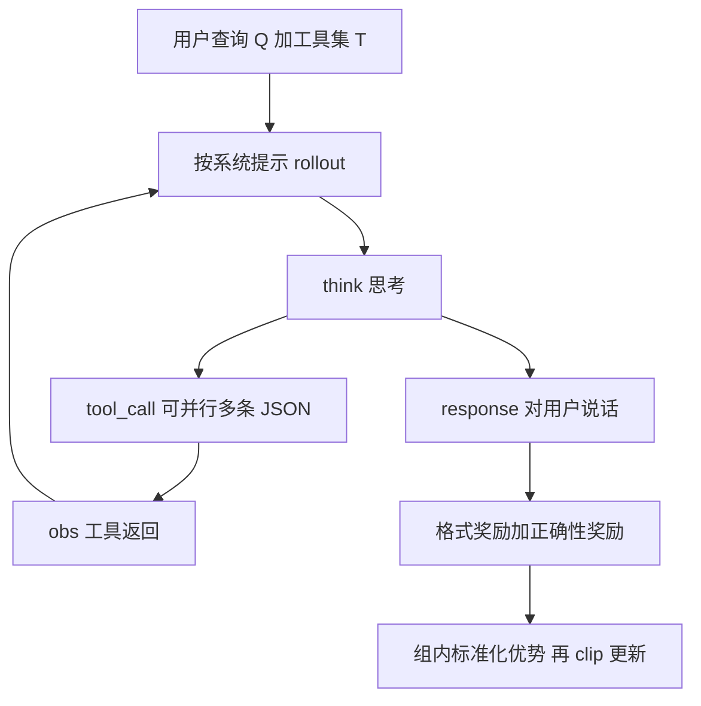

# ToolRL：工具学习真正缺的是奖励，不是再抄一条长思维链

<!-- release-date: 2025-04-16 -->

**本文依据**：`ToolRL: Reward is All Tool Learning Needs`，arXiv 2504.13958v1（2025-04-16，19 页 A4）。作者 Cheng Qian、Emre Can Acikgoz、Qi He、Hongru Wang、Xiusi Chen、Dilek Hakkani-Tür、Gokhan Tur、Heng Ji，University of Illinois Urbana-Champaign。代码与数据 `qiancheng0/ToolRL`。本地 PDF 头已是 v1，首发日取 v1 提交日 2025-04-16。文中数字都标 PDF 页码；标「外部补充」的段落不来自本文。

## 一句话

工具用不好，常常不是因为没蒸馏出「但是等等」那种长思考，而是奖励太粗：只看最终答案对不对，模型学不到「该不该调、调哪把、参数对不对」。ToolRL 把奖励拆成格式加正确性，再在 GRPO 上冷启动训 Instruct 模型。跨工具与问答基准，相对底座约 **17%**、相对 SFT 约 **15%**（PDF p.1 摘要；引言复述同一对数字，PDF p.3）。

它解决的不是「再写一套 ReACT」，而是：SFT 模仿教师轨迹为什么不泛化，以及工具调用这种**多工具、多参数、多步**任务该怎么给可学的奖励。

## 一、矛盾：会背「但是等等」，仍会乱调工具

2025 年春，数学与逻辑推理已经靠 R1 一类强化学习长出反思、纠错和长程规划。工具集成推理（Tool-Integrated Reasoning，TIR）走的是另一条路：模型一边想，一边调搜索、计算器或代码解释器，用真实返回把下一步钉住（PDF p.1–2）。

当时训练 TIR 的主流仍是监督微调（SFT）：离线造好「思考 + 调用」轨迹，再让模型模仿（PDF p.2）。SFT 能学会格式，但泛化、探索和临场改路都弱。图 1 给了一个刺眼的例子（PDF p.1）：

- 任务是无关工具检测：用户问旧金山到洛杉矶的距离，候选工具却是 `get_date`。
- **SFT（蒸馏 R1 长思考）**：先假装深思，再「但是等等」地硬把日期工具解释成能算距离，照样调用。
- **RL 模型（GRPO）**：直接判断 `get_date` 不合适，改口要距离计算器或地图服务。

论文把这写成：SFT 只是在模仿「but wait」这类表面线索，并没有真的在想该不该用这把工具（PDF p.2）。数学题往往只有一个标准答案；工具任务每一步可能同时调多把工具、每把都有一套参数。只拿「最终答案匹配」当奖励，信号太稀，学不动中间决策。于是问题变成：强化学习能不能更好地武装工具使用，以及 TIR 的最优奖励长什么样。

Search-R1、TORL 已经在搜问答或数学代码上试过 RL，但工具集合窄、任务类型单一。本文要对**通用工具选择与应用**做奖励设计，并声称这是该设定下第一份系统研究（PDF p.2–3）。

## 二、全景：形式化 TIR，再把奖励塞进 GRPO

论文结构很直：先把 TIR 写成逐步决策，再规定 rollout 格式，再设计奖励，最后用 GRPO 更新策略（PDF p.4–6）。

图是按 PDF p.4 图 3、p.5 图 4 重画的机制示意，不是实测时间线。

给定工具集 $T=\{t_1,\ldots,t_n\}$ 和查询 $Q$，到第 $k$ 步的轨迹是（PDF p.4）：

$$
s_k=(r_1,T_1,o_1),\ldots,(r_k,T_k,o_k)
$$

其中 $r_i$ 是自然语言思考，$T_i\subseteq T$ 是这一步调用的工具集合，$o_i$ 是执行后的观察（环境或用户反馈）。下一步策略 $\pi:s_k\mapsto(r_{k+1},T_{k+1})$ 要选能推进任务的工具。训练数据每步都有 ground-truth 调用，所以可以逐步给密奖励，而不必像问答那样只盯最终答案。论文后文又用 Bamboogle 证明：这种逐步监督训出来的策略，也能迁到「调用自由、只评最终答案」的设定（PDF p.4、p.8）。

## 三、Rollout：思考、调用、回答可以同屏出现

系统提示（PDF p.5 图 4）强制三种特殊标记：

- `<think>`：每轮必须有，用来写推理；
- `<tool_call>`：JSON 列表，可并行多条；无参数就给空字典；
- `<response>`：对用户的自然语言回复。

`<tool_call>` 与 `<response>` **不是互斥**，同一段输出里可以同时出现（PDF p.4）。解析到调用后，执行结果写入 `<obs>`，拼回对话历史（用户侧模板见 PDF p.18 图 12）。温度 **1.0**，去掉对参考模型的 KL 惩罚，让策略更快适应这套自定义格式（PDF p.6）。

这和「必须先想完再调、调完再答」的僵硬协议不同：模型可以边澄清、边调、边给中间答复。后文拒用无关工具、主动追问缺槽，都靠这个自由度。

## 四、奖励：格式是门槛，正确性才是主菜

规则奖励拆成两项（PDF p.4–5）：

$$
R_{\text{final}}=R_{\text{format}}+R_{\text{correct}}\in[-3,4]
$$

### 格式奖励

$R_{\text{format}}\in\{0,1\}$：ground-truth 要求的字段是否都出现、顺序是否对。不对就是 0，没有半对。

### 正确性奖励

把预测调用集合 $P$ 与标注集合 $G$ 做最优匹配，再拆三层（PDF p.4–5）：

1. **工具名**：Jaccard，$r_{\text{name}}=|N_G\cap N_P|/|N_G\cup N_P|\in[0,1]$。
2. **参数名**：对每个 ground-truth 调用，参数 key 再做一次 Jaccard，累加后落在 $[0,|G|]$。
3. **参数值**：对每个匹配上的 key，值相等记 1，累加。

总分 $r_{\text{match}}=r_{\text{name}}+r_{\text{param}}+r_{\text{value}}$，满分

$$
S_{\max}=1+|G|+\sum_{G_j\in G}|\mathrm{keys}(G_j)|
$$

再线性拉到 $[-3,3]$：

$$
R_{\text{correct}}=6\cdot\frac{R_{\max}}{S_{\max}}-3\in[-3,3]
$$

刻度故意让正确性比格式更重（格式最多 +1，正确性可到 ±3），后面消融证明把两者拉成同等量级会掉点（PDF p.10 表 6）。

这就是标题里「Reward is All」的具体含义：不是不要数据、不要算法，而是工具学习里**可分解的过程奖励**比再抄一条教师思维链更关键。

## 五、GRPO 怎么训：组内比高低，不跟参考模型拴死

GRPO 是 PPO 的变体：同一查询 rollout 一组回答，用组内均值和标准差标准化优势，省掉独立 critic（PDF p.5–6）。查询 $Q$ 的一组为

$$
G_Q=\{A,(s_1,r_1),\ldots,(s_n,r_n)\}
$$

$A$ 是标注，$r_i=R_{\text{format}}+R_{\text{correct}}$。标准化优势：

$$
A_i(s_i\mid Q)=\frac{r_i-\mu_Q}{\sigma_Q+\eta}
$$

目标仍是带 clip 的 PPO 目标，但**去掉相对参考模型的 KL 项**，让模型更自由地改格式与行为。作者说这样收敛更快、效果相当、管线更简单（PDF p.6）。

超参在附录（PDF p.17 表 8）：veRL 框架，每步 batch **512**，每条查询 **4** 条 rollout，共 **15** epoch；学习率 $1\times 10^{-6}$；prompt 最长 **2048**、回复最长 **1024**；每跑 **2** 张 A100 80G，vLLM rollout，显存利用率 **0.6**。底座是 Qwen2.5-Instruct（1.5B / 3B / 7B）和 Llama-3.2-Instruct 3B。

PPO 对照用近似设定，但保留 KL 系数 **0.001**、另训 critic（学习率 $1\times 10^{-5}$），prompt/回复更短（1024 / 512）（PDF p.17 表 9）。奖励设计号称算法无关，实验上却是 GRPO 更稳。

## 六、数据只有 4K：混三种工具分布，再切成单步

RL 训练集刻意混三种来源（PDF p.6）：

| 来源 | 抽样 | 训练时想灌进去的能力 |
|---|---:|---|
| ToolACE | 2K | 何时该调工具、何时直接答 |
| Hammer（masked） | 1K | 工具名和参数名被随机化，逼模型读描述而不是背标签 |
| xLAM | 1K | 一步多工具、工具之间有依赖 |

合计 **4K**。多步轨迹拆成单步，历史塞进用户提示。附录说再加同类数据过 4K，收敛和终绩几乎不再涨，多样性不够（PDF p.17）。

SFT 基线用同分布的 **400** 条（带从 DeepSeek-R1 蒸馏来的 `<think>`）或全部 **4K**。400 条据说已够学会格式；只用 SFT 又容易过拟合（PDF p.17）。GRPO **不算思考文本对不对**，只拿工具调用算奖励。

## 七、主实验：冷启动 GRPO 几乎总是最高的那根柱

评测三套（PDF p.6–7）：

- **BFCL V3**：单步、多步、真实执行、拒用无关工具、并行多工具；
- **API-Bank**：73 个 API，三档难度的多轮对话；
- **Bamboogle**：多跳问答，只看最终答案，训练时没按这个协议练过。

基线：原 Instruct、同数据 SFT、SFT400 再接 PPO/GRPO、PPO 冷启动。主主张是 Qwen 系列上冷启动 GRPO 全面最好，相对同体量 SFT 大约 **10** 个百分点绝对提升（正文被挤成「约 10%」的残缺字形，PDF p.7）。Llama-3.2-3B 涨幅更小，作者猜它对 GRPO 式泛化更不适应，但 API-Bank 上仍强过多数基线。

### BFCL V3 总体准确率（PDF p.8 表 1；左栏柱状图 PDF p.2 图 2）

| 模型 | Raw | SFT400 | SFT4k | PPO 冷启动 | **GRPO 冷启动** |
|---|---:|---:|---:|---:|---:|
| Qwen2.5-1.5B | 19.41% | 40.21% | 40.67% | 38.32% | **46.20%** |
| Qwen2.5-3B | 33.04% | 34.08% | 41.97% | 51.15% | **52.98%** |
| Qwen2.5-7B | 41.97% | 34.08% | 36.53% | 46.68% | **58.38%** |
| Llama-3.2-3B | 22.09% | 41.22% | 44.16% | 42.98% | **44.10%** |

7B 上 SFT 甚至低于 Raw（34.08% / 36.53% 对 41.97%）：模仿教师轨迹会把已有指令能力学坏。GRPO 冷启动把 7B 拉到 **58.38%**，多轮准确率从 Raw 的 4.25% 升到 **18.12%**（PDF p.8 表 1）。无关工具检测上，SFT400 的 7B 掉到 8.11%，GRPO 回到 76.68%——和图 1 的故事一致。

### API-Bank 总体（PDF p.8 表 2）

| 模型 | Raw | SFT4k | **GRPO 冷启动** |
|---|---:|---:|---:|
| Qwen2.5-1.5B | 30.65% | 47.07% | **63.15%** |
| Qwen2.5-3B | 51.59% | 50.92% | **67.00%** |
| Qwen2.5-7B | 62.48% | 47.07% | **64.66%** |
| Llama-3.2-3B | 40.54% | 43.89% | **59.13%** |

7B 在 API-Bank 上相对 Raw 只涨约 2 点，Level 3 的 38.17% 低于 PPO 冷启动的 48.85%（SFT400+PPO 是 37.40%）。论文主文仍把 GRPO 冷启动写成「一般最高」，细表里并非每个子指标都赢。读主结论时要把这条缺口留着。

### Bamboogle：没按最终答案训，也能少调、答对（PDF p.8 表 3）

只给网络搜索工具，评准确率和平均调用次数：

| 模型 | Raw 准确率 | 调用次数 | **GRPO 准确率** | 调用次数 |
|---|---:|---:|---:|---:|
| Qwen2.5-1.5B | 20.8% | 0.61 | **44.0%** | 1.19 |
| Qwen2.5-3B | 52.0% | 1.77 | **60.0%** | 1.32 |
| Qwen2.5-7B | 69.6% | 1.42 | **72.0%** | 1.63 |
| Llama-3.2-3B | 34.4% | 1.25 | **52.0%** | 0.89 |

对照 SFT400 的 7B：准确率掉到 28.8%，平均调用却飙到 **3.71**（PDF p.8 表 3）。SFT 会「为了调而调」；GRPO 冷启动在 7B 上 72.0%、1.63 次调用，作者解释为需要时才调、会用反馈、不靠堆调用次数（PDF p.9）。

### 先 SFT 再 RL，训练奖励更高，榜更差

SFT 初始化后接 GRPO，训练曲线上格式与正确性奖励都更高（分布已经对齐），但 BFCL / API-Bank 泛化不如冷启动；有限 SFT 再 GRPO 往往仍超过纯 4K SFT，却仍低于从头 GRPO（PDF p.7，图 5 在 p.7）。论文判断：SFT 带来记忆和过拟合，削弱 GRPO 的探索。更高的训练奖励不等于更好的泛化。

PPO 冷启动有时超过 SFT，但不稳；PPO 反而更吃 SFT 初始化。图 6：GRPO 正确性奖励更高，格式奖励爬得更快（PDF p.7）。奖励设计对 PPO「部分有效」，主战场仍是 GRPO。

附录把 4K SFT 再接 RL 当成「理论上界」（同一 4K 先 SFT 再 RL）。结果并不一致更好；7B 上 SFT4k+PPO 的 BFCL 总体掉到 **33.80%**，低于 Raw 的 41.97%（PDF p.18 表 10）。作者归因于 SFT 过拟合限制了后续探索（PDF p.19）。

## 八、没见过的语言、没见过的目标

泛化切两刀，都来自 BFCL 子集，训练数据里没有显式覆盖（PDF p.8 图 7）：

- **陌生场景**：在未见过的编程语言里做工具调用（Python / Java / JavaScript）；
- **陌生目标**：无关工具检测（普通与 Live）。

Qwen2.5-3B 冷启动 GRPO 在两张图上都最高。定性两例（PDF p.9 表 4）：

1. 用户要在圣何塞买夜里 11 点的电影票，但没给片名和日期。模型不盲调 `BuyMovieTickets`，先问片名和日期。
2. 问与 $y=3x+2$ 垂直的直线斜率，候选工具是 `find_critical_points`。模型算出 $-1/3$，明确说这把工具无关。

论文把这写成涌现的主动性和元认知：会拒工具、会澄清、会直接答。这是观察加案例，不是单独消融出来的因果。

## 九、奖励四维消融：更长思考不是更好

第五节按类型、刻度、粒度、时序拆奖励（PDF p.9–12）。三条 takeaway 值得单独记住。

### 类型：长度奖励会把小模型带沟里

R1 叙事喜欢更长的 `<think>`。作者加

$$
R_{\text{length}}=\min\bigl(L_{\text{think}}/L_{\text{target}},1\bigr)
$$

$L_{\text{target}}=512$（生模型很少超过一半这么长）。长度和长度奖励确实涨（PDF p.9 图 8），BFCL 却掉（PDF p.10 表 5）：

| 模型 | 原 GRPO | 加长度奖励 | 动态长度 |
|---|---:|---:|---:|
| Qwen2.5-1.5B | 46.20% | 33.23% | 28.51% |
| Qwen2.5-3B | 52.98% | 48.89% | 48.24% |
| Llama-3.2-3B | 44.10% | 44.98% | 43.15% |

1.5B 的无关检测从 56.44% 崩到 4.52%。动态版把目标长度随进度放大，$R_{\text{dynamic}}=\min(L_{\text{think}}/(L_{\text{target}}(1+p)),1)$，$p$ 是训练进度，思考更稳地变长（PDF p.10 图 9），榜仍更差。

**Takeaway 1**：更长推理痕迹并不天生更好；长度奖励在小模型上甚至有害（PDF p.10）。工具任务里「想得长」容易变成过思，和数学里堆 token 换正确率不是同一回事。

### 刻度：正确性要比格式重，但不要突然换挡

把正确性从 $[-3,3]$ 压成与格式同级的 $[-1,1]$（「Equal max」），多数模型总体准确率微降（PDF p.11 表 6）。1.5B：46.20% → 39.47%，无关检测 56.44% → 16.44%。

时序两种：

- **两阶段（粗）**：前 $s=30$ 步正确性缩到 $[-1,1]$、格式 $[0,1]$；之后正确性恢复 $[-3,3]$、格式缩到 $[0,0.5]$。30 步是因为格式奖励通常在此前已经陡升（PDF p.11）。
- **动态（细）**：用进度 $p$ 连续插值，$\mathrm{Scale}_{\text{format}}=[-2+p,2-p]$，$\mathrm{Scale}_{\text{correct}}=[-2-p,2+p]$，从「格式与正确性同等」滑向「正确性更重」。

两阶段掉点；动态在 3B（52.98% → **53.81%**）和 Llama（44.10% → **46.85%**）上超过原设置，1.5B 基本持平（45.71%）（PDF p.11 表 6）。图 10 显示突变会打乱两条奖励曲线（PDF p.11）。

**Takeaway 2**：逐渐调刻度，好过突然换挡；先易后难要平滑过渡（PDF p.12）。

### 粒度：拆得越细越好学

从原文最细的「名 Jaccard + 参数名 Jaccard + 值相等」，逐步缠成更粗的信号（PDF p.12）：

- **Finegrained**：工具名、参数名改成集合全等指示函数（更严，不是更细）；
- **Intermediate**：整个参数字典一次全等；
- **Coarse**：整个工具集合一次全等，对就 1、错就 0。

图 11：越粗，训练中正确性奖励越难爬上去，信号更稀、归因更难（PDF p.12）。表 7（PDF p.13）：

| 模型 | Original | Finegrained | Intermediate | Coarse |
|---|---:|---:|---:|---:|
| Qwen2.5-1.5B | 46.20% | 40.71% | 37.65% | 36.72% |
| Qwen2.5-3B | 52.98% | 52.06% | 51.36% | 51.40% |
| Llama-3.2-3B | 44.10% | 39.82% | 38.62% | 35.95% |

注意命名：这里的 Finegrained 其实是「更严的精确匹配」，比 Original 的 Jaccard 更脆，所以分数更低。真正的「最细、最好」是原文那套可部分给分的分解。

**Takeaway 3**：细粒度分解提供更密的学习信号；缠成一条对错会拖累训练和终绩（PDF p.12）。

## 十、局限、没写清的，以及可迁移的

论文几乎没有独立 Limitations 节。能从正文和附录读出的边界：

- **17% / 15%** 是摘要对「多个工具与 QA 基准」的概括，不是某一张表里某一格的加权平均；正文没有给出这对百分比的精确聚合公式（PDF p.1、p.3）。
- 主结论偏 Qwen；Llama-3.2-3B 在 BFCL 上相对 SFT4k 几乎没涨（44.10% 对 44.16%）。
- API-Bank Level 3、部分无关检测，PPO 或 SFT 变体会赢单格；「全面最高」是总体叙事。
- 逐步奖励依赖逐步 ground-truth 调用；Bamboogle 的迁徙是实验观察，不是理论保证。
- 去掉 KL、温度 1.0、4K 数据、2×A100，都是这一设定下的选择，没有规模扫描。
- 「主动性 / 元认知」来自案例，不是受控指标。
- 没有真实生产 API 稳定性、延迟、费用；工具执行在训练循环里被当成可解析的观测。

**外部补充**（非本文）：仓库为 `https://github.com/qiancheng0/ToolRL`；arXiv 条目 `2504.13958`。后续同方向工作（Search-R1、TORL、各类 R1-style 工具 RL）把奖励继续往「可执行、可验证」推，但那是后话，不能写进这篇的实验结论。

可迁移、且不绑死在 7B 或 BFCL 上的几条：

1. **过程可打分就不要只打最终答案**：工具名、参数名、参数值分开给分，比「整次调用全对才 1」更像能学的课。
2. **正确性权重要压过格式，但格式仍要当门槛**：格式 0/1，正确性跨度更大；两者等权会走捷径刷格式。
3. **先模仿再 RL 不是免费的热身**：训练奖励变好看，榜可能变差；工具场景里冷启动 GRPO 可以比 SFT 初始化更泛化。
4. **别把数学里的越想越长直接搬过来**：长度奖励在工具任务上能加长 `<think>`，小模型还可能崩掉拒工具能力。
5. **刻度要滑，不要跳**：两阶段硬切会掉点；用训练进度插值，让重点从格式滑向正确性。
6. **数据混分布比堆同质样本更重要**：4K 里故意掺「何时不调」「名字被遮」「一步多工具」；再堆同类过 4K 收益消失。

关键词回看：**TIR** 是带工具的逐步推理；**格式奖励** 管特殊标记齐不齐；**正确性奖励** 管调用匹配得有多细；**GRPO** 用同查询一组样本标准化优势，本文还拆掉了 KL 锚。读完应能回答：为什么 SFT 会「过思却拒不了错工具」，以及若自己训工具策略，奖励该沿哪四根轴调。
