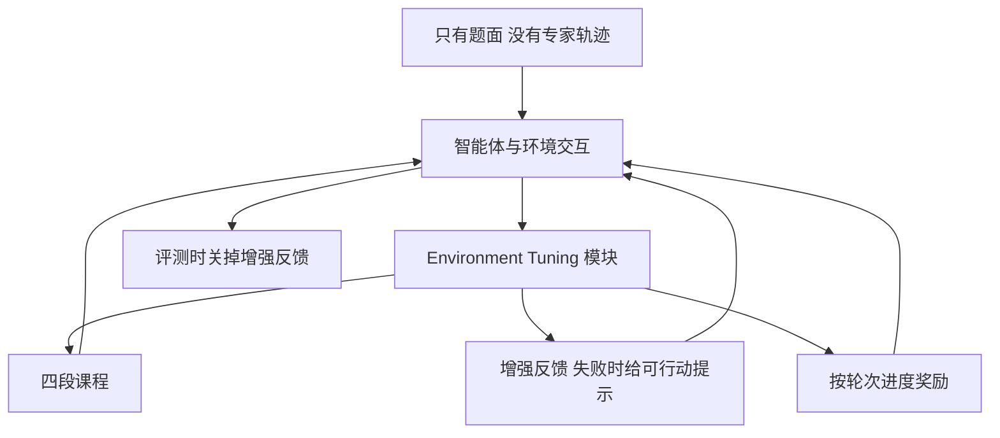

# 不要只微调 Agent：400 道 BFCL 题上，先把环境调到能教

<!-- release-date: 2025-10-11 -->

**本文依据**：封面正式标题 **Don’t Just Fine-tune the Agent, Tune the Environment**；arXiv `2510.10197v2`（2026-01-30，44 页，ICLR 2026）。作者 Siyuan Lu\* 等；第一作者单位标注 4,2,3,1（首列 4 = AWorld Team, Inclusion AI；兼 Zhejiang University、Shanghai Innovation Institute、Westlake University），脚注写明 Siyuan 与 Zechuan 在 Ant Group 实习期间完成。通讯作者 Leilei Gan、Chenyi Zhuang、Tao Lin。代码仓库 `AWorld-RL/EnvTuning`。本地读的是 v2 PDF；`release-date` 取 arXiv v1 提交日 2025-10-11。文中数字紧跟 `(PDF p. N)`；标「外部补充」的段落不来自本文。

## 一句话

多轮工具调用缺高质量轨迹：合成数据上做 **监督微调（Supervised Fine-Tuning，SFT）** 容易过拟合；直接在环境里做强化学习，又会卡在冷启动和梯度爆炸。这篇把训练对象从「抄专家轨迹」换成 **环境调谐（Environment Tuning）**：四段课程、失败时给出可行动的纠错反馈、按轮次给细粒度进度奖励。只用 Berkeley Function-Calling Leaderboard（BFCL）V3 的 **400** 道题实例、不要专家演示，就能把基座从接近零拉到可用，并把若干已 SFT 的工具模型再抬一截；分布外也不像纯 SFT 那样塌掉。

## 一、矛盾：轨迹够稀，环境又太硬，两条旧路都走不通

单轮数学推理已经有数据集、自动验算器和稳定的 RL 算法。多轮工具调用不是同一类题：智能体要在动态环境里理解请求、调工具、再回答，直到整条任务做完（PDF p.2）。作者把困难收成三条（PDF p.2）：

- **数据稀（C1）**：人工标多轮工具轨迹极贵。BFCL V3 多轮子集一共只有 **800** 条，传统「堆数据」几乎没得堆。
- **环境复杂（C2）**：同一张榜跨 **8** 个域、**84** 把工具，还要跨域编排。
- **链条长（C3）**：一条样本含多轮用户请求，**每一轮检查都过才算成功**；中途一次失败整题失败。

主流补数据的办法是合成轨迹再 SFT。作者后文用实验说明：静态合成轨迹上的模型，换到真实一点的分布外场景会塌（PDF p.2、p.8）。强化学习看起来更对口——在线交互、探索、泛化——但环境一大，还不会用工具的策略在动作空间里打转，滚不出有用经验，这就是 **冷启动**。即便过了这一关，长链条上的噪声轨迹会让优化极敏感，容易训练崩溃（PDF p.2）。

全文问题因此不是「再找一个更好的 SFT 配方」，而是（PDF p.2）：

> 数据极度稀缺时，怎样把复杂多轮工具智能体训稳，还要能泛化？

Environment Tuning 的回答是三根柱子一起上（PDF p.2–3）：

1. **结构化课程**：从语法到任务、从简单到含糊再到「评测时那种冷冰冰的报错」。
2. **可行动的环境增强（Actionable Environment Augmentation）**：失败时给纠错提示，把死胡同变成课。
3. **细粒度进度奖励**：用「这一轮状态对不对、执行结果对不对」替代整条轨迹末尾的 0/1。

图按 PDF p.5 图 3 重画，是机制示意，不是实测时间线。课程会动态改奖励、环境反馈（标准 / 增强）和数据划分。

## 二、为什么直接 RL 会在 70 步附近炸掉

多轮工具使用被写成 **部分可观测马尔可夫决策过程（Partially Observable Markov Decision Process，POMDP）**（附录 A，PDF p.14）。一条回合对应一整条用户任务，由预先写好的请求序列 $q_1,\ldots,q_N$ 组成。动作只有两类：

- 工具调用 $a_t^{\text{tool}}$（`<tool_call>`）
- 最终回答 $a_t^{\text{answer}}$（`<answer>`），回答完当前子任务后环境抛出下一问

整条轨迹 $\tau$ 只有在答完最后一问 $q_N$ 之后，才拿到稀疏终端奖励 $R_T\in\{0,1\}$（PDF p.14）。目标是最大化期望终端奖励 $J(\theta)=\mathbb{E}[R_T]$。信用分配因此极难：中间哪一步把状态弄坏了，0/1 看不出来。

基座模型在这种环境里的失败模式很杂：参数填空、调用不存在的工具、把环境改到不可逆（PDF p.4）。Xue 等人指出，噪声轨迹上的 RL 对这类错误极敏感，持续出现就容易不稳定乃至梯度爆炸。作者自己的对照：用 Qwen2.5-7B-Instruct 在 **400** 条上做单阶段 RL，大约 **70** 步内崩溃，成功率大约只多 **10%**（PDF p.4；附录 E.2 图 6 写峰值大约高出基座 10–15 个百分点，约第 60 步，第 70 步梯度范数爆炸后准确率掉回起点，PDF p.21）。

所以「从第一天就优化整题成功」在长视野、稀疏奖励里无效。课程必须先把「环境听得懂的话」教会，再谈推理。

## 三、四段课程：先会说话，再学会做事，最后去掉脚手架

### 第 1 段：语法与模式正确

智能体还不会推理之前，必须先会说环境的语言，否则策略惩罚会把「格式错」和「想法错」搅在一起（PDF p.4）。作者拆开工具调用与自然语言回答，只用与任务无关的计数器：

- $C_{\text{correct}}$：工具名对、参数合法
- $C_{\text{error}}$：工具名对、参数不合法
- $C_{\text{format}}$：违反规定 XML 风格格式的轮数

$$
R_{\text{format}}=(N-C_{\text{format}})/N,\qquad R_{\text{tool}}=C_{\text{correct}}/(C_{\text{correct}}+C_{\text{error}})
$$

其中 $N$ 是本回合总轮数。若至少尝试过一次工具调用，指示 $I_{\text{tool}}=1$，否则为 0：

$$
R_{\text{Stage1}}=I_{\text{tool}}\cdot(R_{\text{format}}+R_{\text{tool}})
$$

附录 E.1 图 5(a) 显示：格式奖励和工具调用奖励陡升，空转对话（void turns）被压下去，`Is Tool Call` 很快饱和到 1.0，总交互轮数急剧下降（PDF p.20）。这段的意义不是涨榜，而是给后面的任务奖励清场。

### 第 2 段：在增强反馈里学基础多轮

数据换成 BFCL 的 **Base** 全划分。奖励换成进度奖励 $R_P$；环境换成增强反馈（PDF p.5）。目标是在「有人把错误讲清楚」的条件下，把核心推理摸出来。

### 第 3 段：含糊、缺工具、长上下文

训练集聚齐 Missing Parameters、Missing Functions、Long-Context。奖励和增强反馈与第 2 段相同，任务更难：缺槽要追问、缺函数要认出来、长上下文里要检索（PDF p.5）。系统提示在第 3、4 段额外强调：缺信息时先看别的工具能不能补上；没有工具或补不回来，**禁止幻觉调用**，必须用 `<answer>` 追问或拒绝（附录 F，PDF p.23–24）。

### 第 4 段：对齐评测环境

仍用全数据与进度奖励，但 **关掉环境增强**。智能体必须靠自己消化标准报错，避免养成「离开提示就不会做」的依赖。作者明确写：这一步是为了分布外稳健（PDF p.5）。

阶段切换不靠固定步数。备注 3.1：验证集准确率平台、且梯度范数稳定，才进入下一段（PDF p.5）。图 5(b) 显示四段过程中梯度范数保持稳定，验证集（从剩余 BFCL 里拿出 **100** 条）稳步上升（PDF p.20）。

消融表 3（Qwen2.5-7B-Instruct，PDF p.9）：

| 训练阶段 | Avg. | Base | Miss Func | Miss Param | Long Context |
|---|---:|---:|---:|---:|---:|
| 基座 | 7.00 | 9.33 | 9.33 | 6.33 | 3.00 |
| 直接 GRPO（全 400 条，奖励 $0.9R_P+0.1R_{\text{format}}$） | 17.42 | 20.00 | 24.67 | 14.67 | 10.33 |
| + Stage 1 | 15.50 | 19.00 | 22.33 | 9.33 | 11.33 |
| + Stage 2 | 25.83 | 32.00 | 33.67 | 20.00 | 17.67 |
| + Stage 3 | 32.00 | 44.67 | 34.33 | 25.33 | 23.67 |
| + Stage 4（全文方法） | 36.92 | 50.33 | 40.33 | 29.33 | 27.67 |

直接 RL 几乎不涨，正是冷启动。课程每段都有贡献，最终比直接 GRPO 高 **19.50** 个百分点（PDF p.9）。第 1 段平均分略低于直接 GRPO，因为它本来就不优化任务成功，只修语法。

## 四、环境增强：别把「没航线」和「机场代码写错」混成一句

标准训练环境常回含糊报错（错误码、「not found」），既不说根因，也不提示下一步。智能体只好穷举，学不到工具之间的依赖和每把工具的内部约束（PDF p.6）。作者不走「预先造好依赖图再让模型背顺序」那条路（对比 APIGen-MT、ToolACE 一类），而是把依赖写进反馈，逼模型在交互里推断，而不是背轨迹（PDF p.6）。

两个教学例子（PDF p.6）：

- **Travel API**：没先查机场代码就订票。标准反馈「No available route」会让模型以为没航班；增强反馈「Invalid airport code[s]:…」暗示要先调另一把工具查代码。
- **文件系统**：预训练知识爱给 `rm` 传完整路径，BFCL 文件系统不允许。标准 `FileNotFoundError` 会误导成「文件不存在」；增强反馈直接给规则：「Paths are not allowed. Specify only file/directory name…」。

附录案例把对照写死（PDF p.24–31、p.35–40）：

- 文件系统：增强环境让智能体改成先 `cd` 再 `rm`；基线「No such file」则过早放弃（G.1）。
- 多 API 旅行：增强环境点出目的地「Pinehaven」不是合法机场代码，并提示可用别的工具查代码，最终订到商务舱 **3800.0**；基线「No available route」直接停（G.2，PDF p.30–31）。
- 车辆 + 社交：`estimate_distance` 要邮编不要城市名。增强环境写「invalid zipcode pair… verify both zipcodes are correct and numeric」，智能体能先 `get_zipcode_based_on_city`；基线「distance not found in database」会卡死，后续还把字符串塞进要浮点的接口（G.3，PDF p.35–40）。

增强不是人手写每一条报错。附录 B：半自动双智能体流水线（PDF p.14–18）——

1. **Augmentation Generator** 看失败轨迹，判断要不要增强、错误类别（缺依赖 / 参数约束 / 状态前置 / 格式 / 资源不可用）、增强类型，再写出提示。
2. **Constitutional Judge** 卡四条：不能泄漏具体调用、不能把探索空间收成唯一路径、必须可行动、提示质量合格。全部通过才入库。
3. 被拒最多再试 **3** 次。一个域只需 **3–5** 条人工 few-shot 当种子，之后可覆盖大量错误案例（PDF p.18）。

坏例子：「你应该先调用 `get_airport_code('San Francisco')`」——太具体。好例子：「机场代码无效。你可能需要先检索该城市的正确代码。」（PDF p.15）

图 4(a) 消融（PDF p.9）：增强反馈让各划分学习曲线更稳；Missing Parameters / Missing Functions 上提升超过 **20%**。

## 五、进度奖励：不要等整条轨迹结束再给 0 或 1

长视野的第二个坑是奖励稀疏（PDF p.6）。进度奖励 $R_P$ 不按 token 打分，而在每一轮结束时看两件事：环境状态对不对、所选动作的执行结果对不对。第 $t$ 轮

$$
r_t=r_t^{\text{state}}\cdot r_t^{\text{exec}}
$$

两路都对才是 1。整回合

$$
R_P=\frac{1}{T}\sum_{t=1}^{T} r_t
$$

这样「几乎做对」和「完全跑偏」能分开，部分成功的轨迹仍有学习信号，同时不锁死唯一解题路径（PDF p.6–7）。附录 C（PDF p.18–19）：改环境的调用（建文件、订票）对最终状态与真值状态；只通过返回值体现的调用（查股价、查天气）对返回值与真值结果。

图 4(b)（PDF p.9–10）：第 2 段（Base）上，二元奖励和 $R_P$ 差别不大；第 3 段复杂划分上，二元奖励会让 Missing Parameters / Missing Functions **训练失败、表现接近零**——稀疏信号给不出探索的激励。Long Context 上 $R_P$ 也明显更稳。

## 六、训练算法：改编的 GRPO，KL 系数故意开大

主文写用改编的 **Group-Relative Policy Optimization（GRPO）**，带解耦裁剪和 KL 惩罚（PDF p.8）。附录 D.2 把损失写成带 DAPO / ProRL 风格解耦裁剪的 PPO 形式（PDF p.19–20）：

$$
L(\theta)=-\mathbb{E}_t\Big[\min\big(r_t(\theta)\hat A_t,\ \mathrm{clip}(r_t(\theta),1-\epsilon_{\mathrm{low}},1+\epsilon_{\mathrm{high}})\hat A_t\big)\Big]+\beta\,D_{\mathrm{KL}}(\pi_\theta\|\pi_{\mathrm{ref}})
$$

优势不训练 critic，按同一 prompt 的一组样本做组内标准化（GRPO）：

$$
\hat A_t(\tau)=\frac{R(\tau)-\mu_G}{\sigma_G+\varepsilon_A}
$$

超参：$\beta=0.1$，$\epsilon_{\mathrm{low}}=0.2$，$\epsilon_{\mathrm{high}}=0.28$（PDF p.20）。多轮有状态任务需要更强正则，常规 0.001 不够。图 7：无 KL 会熵崩、验证准确率掉；$\beta=0.001$ 只推迟崩溃；$\beta=0.1$ 能保住熵并持续涨分（PDF p.21–22）。

对照基线 **ToolRL**：同样 GRPO，但奖励是 $R_{\text{format}}+R_{\text{correct}}$，$R_{\text{correct}}$ 只衡量工具调用对不对（PDF p.8）。后文会看到：这套「直接 RL」涨幅小，在已经 SFT 过的模型上甚至倒退。

## 七、实验怎么切：400 训、400 测，分布外换域

BFCL V3 多轮 **800** 条，四划分各 **200**：Base、Missing Functions、Missing Parameters、Long-Context。训练 **每划分抽 100，共 400**；剩下 400 做分布内测试（PDF p.7、p.19）。评测看环境最终状态（文件系统等），不只看调用语法（PDF p.19）。

分布外（训练全是闭域 API，OOD 换域换能力，PDF p.7）：

- BFCL V4 Web Search（`duckduckgo_search` + `fetch_url_content`，还有概率网络失败）与 Memory（KV / 向量库 / 递归摘要三种后端）（PDF p.19）
- $\tau^2$-bench：零售、航空、电信客服，双控环境（智能体和用户模拟器都能动工具）（PDF p.19）
- ACEBench Agent：沙箱里多步推理、长上下文、隐含规则（PDF p.19）

模型三组（PDF p.7–8）：

- 要调的基座：Qwen2.5-7B-Instruct、Llama-3.1-8B-Instruct；以及两个已经 SFT 过的 Llama：ToolACE-2-Llama-3.1-8B、watt-tool-8B（作者写 Llama 上直接 RL 历来难）。
- 开源 SFT 对照：Arch-Agent-7B、xLAM-2-8b-fc-r、BitAgent-8B。
- 闭源参照：Claude Sonnet 4、GPT-4o、Gemini 2.5 Pro、o3。

## 八、分布内：400 条就能从接近零拉起来，也能再抬已 SFT 的模型

表 1 主结果（BFCL V3 多轮，PDF p.7）。下面只摘与叙事有关的行；闭源与开源对照一并列出。

| 模型 | Average | Base | Miss Func | Miss Param | Long Context |
|---|---:|---:|---:|---:|---:|
| Claude Sonnet 4 | 57.00 | 63.00 | 58.00 | 51.00 | 56.00 |
| GPT-4o | 51.00 | 59.00 | 54.00 | 41.00 | 50.00 |
| Gemini 2.5 Pro | 28.75 | 32.00 | 29.00 | 22.00 | 32.00 |
| o3 | 49.25 | 47.00 | 55.00 | 47.00 | 48.00 |
| Arch-Agent-7B | 42.05 | 47.15 | 53.75 | 34.20 | 33.10 |
| xLAM-2-8b-fc-r | 70.50 | 77.85 | 69.15 | 65.80 | 69.20 |
| BitAgent-8B | 36.99 | 47.85 | 33.20 | 26.15 | 40.75 |
| Qwen2.5-7B-Instruct | 7.00 | 9.33 | 9.33 | 6.33 | 3.00 |
| + ToolRL | 18.00 | 23.00 | 26.00 | 16.00 | 7.00 |
| + Environment Tuning | 36.92 | 50.33 | 40.33 | 29.33 | 27.67 |
| Llama-3.1-8B-Instruct | 5.48 | 6.15 | 6.80 | 3.20 | 5.75 |
| + ToolRL | 11.25 | 9.00 | 10.00 | 9.00 | 17.00 |
| + Environment Tuning | 28.25 | 28.20 | 25.85 | 22.15 | 36.80 |
| ToolACE-2-Llama-3.1-8B | 37.99 | 48.85 | 34.15 | 25.20 | 43.75 |
| + ToolRL | 33.75 | 46.00 | 29.00 | 22.00 | 38.00 |
| + Environment Tuning | 47.18 | 55.20 | 38.15 | 38.20 | 57.15 |
| watt-tool-8B | 35.74 | 45.85 | 33.15 | 25.20 | 38.75 |
| + ToolRL | 42.00 | 55.00 | 35.00 | 31.00 | 47.00 |
| + Environment Tuning | 54.34 | 64.15 | 48.15 | 40.20 | 64.85 |

读法（PDF p.8）：

1. **从零也能训**。Qwen 从 **7.00%** 到 **36.92%**（+29.92），超过 BitAgent-8B、Arch-Agent-7B 和 Gemini 2.5 Pro。Llama 基座从 **5.48%** 到 **28.25%**。
2. **已 SFT 的模型还能网上再修**。ToolACE-2 再涨 **9.19** 到 **47.18%**；watt-tool-8B 从 **35.74%** 到 **54.34%**（+18.50），超过文中多数闭源（o3、GPT-4o），仍低于 Claude Sonnet 4 的 57.00 和 xLAM-2 的 70.50。摘要里写 watt-tool「54.25%」（PDF p.3），与表 1 的 54.34 不一致，本文以表为准，摘要数字另记一笔。
3. **直接 RL 不够，有时有害**。ToolRL 在 ToolACE-2 上 **-4.24**（37.99→33.75）；Environment Tuning 同模型是 +9.19。Qwen 上 ToolRL 只 +11.00，Environment Tuning 是 +29.92。

xLAM-2 分布内仍是开源里最高的 **70.50%**。作者没有声称 400 条 RL 能在分布内打死大规模合成 SFT；下一节才是他们真正要打的点。

## 九、分布外：SFT 会塌，交互学到的是解题原则

表 2（PDF p.8）。所有相对比较以 Llama-3.1-8B-Instruct 为底。xLAM 在 Retail / Airline 上划灰：它在原版 $\tau$-bench 上训过，不能当 OOD。

| 模型 | BFCL V4 Avg | Web Search | Memory | $\tau^2$ Avg | Retail | Airline | Telecom | ACE Avg | Multi-turn | Multi-step |
|---|---:|---:|---:|---:|---:|---:|---:|---:|---:|---:|
| xLAM-2-8b-fc-r | 9.17 | 5.00 | 13.33 | 36.67 | 57.50 | 40.00 | 12.50 | 1.65 | 0.00 | 3.33 |
| BitAgent-8B | 7.41 | 4.50 | 10.32 | 10.00 | 7.50 | 15.00 | 7.50 | 5.00 | 10.00 | 0.00 |
| Llama-3.1-8B-Instruct | 8.46 | 1.00 | 15.91 | 20.00 | 2.50 | 30.00 | 27.50 | 1.65 | 0.00 | 3.33 |
| + ToolRL | 11.52 | 11.00 | 12.04 | 21.67 | 10.00 | 25.00 | 30.00 | 1.65 | 0.00 | 3.33 |
| + Environment Tuning | 16.53 | 15.00 | 18.06 | 21.67 | 5.00 | 30.00 | 30.00 | 4.17 | 5.00 | 3.33 |
| ToolACE-2 | 15.90 | 9.00 | 22.80 | 10.83 | 10.00 | 15.00 | 7.50 | 8.34 | 10.00 | 6.67 |
| + ToolRL | 18.91 | 9.00 | 28.82 | 14.17 | 5.00 | 30.00 | 7.50 | 6.65 | 3.30 | 10.00 |
| + Environment Tuning | 16.79 | 14.00 | 19.57 | 20.83 | 20.00 | 30.00 | 12.50 | 15.00 | 10.00 | 20.00 |
| watt-tool-8B | 8.67 | 4.00 | 13.33 | 13.33 | 15.00 | 20.00 | 5.00 | 2.50 | 5.00 | 0.00 |
| + ToolRL | 13.12 | 1.50 | 24.73 | 11.67 | 12.50 | 15.00 | 7.50 | 9.15 | 3.30 | 15.00 |
| + Environment Tuning | 13.68 | 8.00 | 19.35 | 15.83 | 20.00 | 20.00 | 7.50 | 7.50 | 0.00 | 15.00 |

要点（PDF p.8–9）：

- **SFT 过拟合在 Web Search 上最刺眼**。xLAM-2 分布内 70.50%，Web Search 掉到 **5.00%**。BitAgent、watt-tool 同样很低。
- **从交互里学原则**。Llama 基座 Web Search **1.00%**，Environment Tuning 后 **15.00%**。
- **给已经会一点 OOD 的模型补洞**。ToolACE-2 Web Search 9.00%→14.00%；ACEBench Agent 平均 **8.34%→15.00%**（摘要写 8.5%→15.0%，PDF p.3，与表 2 的 8.34 略有出入，仍以表为准）。同模型上 ToolRL 把 ACE 平均降到 **6.65%**。
- 不是每格都赢：ToolACE-2 的 Memory 在 Environment Tuning 后从 22.80 降到 19.57，BFCL V4 平均 15.90→16.79 只是小涨，真正拉开的是 ACE 与 $\tau^2$ 平均（10.83→20.83）。watt-tool 的 ACE 平均 ToolRL（9.15）高于 Environment Tuning（7.50）。作者的主结论仍成立：**整体上环境交互比静态轨迹更能抗塌**，但单格并非单调。

附录 G.4（PDF p.41–44）用 $\tau^2$-bench 电信域做定性：用户要「excellent」网速，根因有两处——Data Saver 开着，以及设备侧 Data Roaming 关着（运营商侧漫游已开）。预训练模型修好第一处，测速变成 good 就停，甚至提议换套餐（用户明确拒绝）；Environment Tuning 后的模型会回头看初次诊断里的 `"roaming": "Disabled"`，再让用户打开漫游，最终测到 excellent。这是作者用来回答「是不是只是背 BFCL 模式」的案例，不是大规模统计。

## 十、局限、未写清的地方，以及能搬走的东西

论文自己承认的未来工作（PDF p.10）：课程和反馈生成还要更自动；还没做到更复杂的多模态智能体场景。

读完整篇还要自己标出的边界：

- **训练题只有 BFCL V3 的 400 条闭域 API**。OOD 数字说明「换域不会像 SFT 那样立刻归零」，不说明这套课程能直接搬到 SWE-bench 或计算机使用。
- **环境增强依赖 LLM 写提示 + 宪法裁判**。种子还要人写 3–5 条。提示若泄漏解法，探索会被毁掉；作者用裁判卡泄漏，但裁判本身也是模型。
- **进度奖励需要逐步真值**：每轮的状态或返回值都要对得上。没有可检查环境，这套 $R_P$ 造不出来。
- **分布内仍打不过 xLAM-2（70.50%）**。400 条 RL 的卖点是数据效率和 OOD，不是同一张 BFCL V3 上的绝对第一。
- **表与摘要有两处圆整/不一致**（watt-tool 54.25 vs 54.34；ToolACE ACE 8.5 vs 8.34）。以表格为准。
- 相关工作把 ReCall、ARTIST 写成「直接在线 RL，在 BFCL 上增益有限」（PDF p.3），本文没有复现它们的数字。
- 训练算力、步数预算、每组 rollout 条数，主文和附录 D 都没有一张完整 recipe 表。

可迁移启发，按「能直接用 / 依赖这篇设定」分开：

- **能直接用**：先把格式与合法调用从任务成功里拆出来，单独做一段奖励；长链条不要一上来优化整题 0/1；复杂划分上若二元奖励学不动，改成「每轮状态 × 执行」的进度平均；阶段切换看验证平台 + 梯度范数，而不是固定步数；多轮有状态 RL 把 KL 开到能保住熵的量级（他们是 0.1，不是 0.001）；评测前把训练脚手架（详细报错）关掉，否则测的是「会看提示」而不是「会办事」。
- **依赖这篇设定**：可行动报错、逐步真值、四段数据划分都绑在 BFCL 这类可执行、可对照状态的工具沙箱上。没有状态检查器，就退回「只能 SFT 轨迹」的世界。
- **和 SFT 的关系**：这篇不是禁 SFT。watt-tool / ToolACE 先 SFT 再 Environment Tuning，分布内最高的开源线仍是大规模合成 SFT（xLAM-2）。更干净的叙事是：**轨迹模仿负责把工具用会，环境调谐负责在稀缺数据和分布外时别塌。**

## 关键词回看

- **Environment Tuning**：不收集专家轨迹，只给题面，用课程 + 增强环境 + 密奖励在交互里学多轮工具使用。
- **冷启动**：还不会用工具时，复杂环境滚不出有用经验，直接 RL 学不动或学爆。
- **可行动环境增强**：把含糊报错改成能提示依赖和约束、但不泄漏具体调用的教学反馈。
- **进度奖励 $R_P$**：每轮「状态正确 × 执行正确」的平均，用来区分部分成功。
- **第 4 段对齐**：训练后期关掉增强反馈，避免策略绑死在脚手架上。
