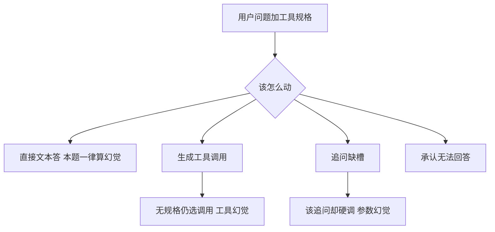

# When2Call：现有榜只看调得准不准，这篇测何时该调、何时追问、何时承认不能答

<!-- release-date: 2025-04-26 -->

**本文依据**：`When2Call: When (not) to Call Tools`，arXiv 2504.18851v1（2025-04-26，19 页 A4）。作者 Hayley Ross\*（封面单位 Harvard University；脚注 Work done while at NVIDIA）、Ameya Sunil Mahabaleshwarkar\*（NVIDIA）、Yoshi Suhara（NVIDIA）。代码与数据 `NVIDIA/When2Call`。本地 PDF 头已是 v1，首发日取 v1 提交日 2025-04-26。文中数字都标 PDF 页码；标「外部补充」的段落不来自本文。

## 一句话

工具调用榜（以 BFCL 为代表）主要问：该调的工具在、槽也齐，模型有没有调对、参数对不对。真实部署里更常见的失败不是「调错 JSON」，而是：**不该调时硬调、缺槽时编参数、没有合适工具时编一把以前见过的工具或直接编答案**。When2Call 把行为收成四选一：直接答、调工具、追问、承认答不了。公开工具模型在这张榜上离天花板很远；用同一套多选题做 **奖励感知偏好优化（Reward-aware Preference Optimization，RPO）**，比再抄一条监督微调更有效，而且不那么容易把模型训成「宁可不开工具」。

## 一、矛盾：调得准，不等于知道何时不该调

典型工具调用管线是两步（PDF p.1）：系统提示里塞一批 API 规格；模型先吐符合规格的调用（通常是 JSON），拦截执行后再根据返回写自然语言，像一层 RAG。

训练时见过的工具，和上线时挂的工具，经常对不上。客服模型被问明天天气，不该幻觉出训练里见过的天气工具，也不该编明天的天气。图 1 更细：手头只有学生档案库，用户却要成绩——该说做不到，而不是硬调（PDF p.1）。工具对了但用户没给必填槽，该追问，而不是把缺的参数编出来。

当时的主流评测，包括当时的标准 **Berkeley Function Calling Leaderboard（BFCL）**，主战场仍是「正确工具已给出、信息也够」时调用准不准（PDF p.1–2）。BFCL 的 Irrelevance、ToolSandbox 会覆盖「没给对的工具」或「信息不够」，但只检查**有没有吐调用**，不检查模型改去干什么。When2Call 把缺口补成显式四类行为（PDF p.2）：

- (a) 直接用文本答（不调工具）
- (b) 调工具
- (c) 追问
- (d) 承认无法回答

题面一律需要工具才能答（实时信息、数据库一类），所以 (a) **永远算幻觉答案**。这让它同时能测：没有合适工具时，模型更爱编答案，还是更爱认输。评测提供两条路：开源模型用选项上的对数概率；闭源模型用 LLM-as-judge 把自由生成收进四类（PDF p.2）。

相对旧榜，When2Call 还量化三类幻觉：答案幻觉、工具幻觉、参数幻觉，以及追问率（PDF p.2 表 1）。它没有把工具调用校验当成主任务——那是 BFCL 的活；作者明确写成与 BFCL 互补（PDF p.3）。

图是按 PDF p.1 图 1 与 p.2 四类行为重画的机制示意，不是实测时间线。

## 二、数据怎么造：从 BFCL / APIGen 切出「该不该动」

评测集从 **BFCL v2 Live** 的 Simple / Multiple Function 长出来（人工题、许可宽松）；训练集从 **APIGen** 同类切出来（PDF p.3）。生成模型一律 **Mixtral 8x22B**。

两步（PDF p.3）：

1. **过滤**：问是不是必须靠工具（实时、库、专用软件），还是预训练知识原则上就能答。提示见附录表 9（PDF p.15）。计算器、公开常识一类会被滤掉——后面局限节会回到这件事。
2. **一题变三题**：原题保留，正确项是 BFCL/APIGen 的工具调用；再改两道，分别让正确项变成追问或无法回答。四类错误选项也一并生成，后面才能做偏好对。

无法回答题：给工具规格，要求写一道**同一语义域**但工具答不了的题，故意比 BFCL Irrelevance 里「天气对客服」那种远错配更难（PDF p.3–4）。追问题：解析必填参数，丢掉其中一个，让模型改写用户话并写出追问；只对至少两个必填参数的规格做，避免「现在股价多少」丢掉唯一 ticker 后变成空问（PDF p.3）。

### 规模（PDF p.4 表 2）

| 划分 | (a) | (b) 调用 | (c) 追问 | (d) 无法答 | 0 把工具 | 1 把 | 2+ 把 |
|---|---:|---:|---:|---:|---:|---:|---:|
| Test | 0 | 1,295 | 1,062 | 1,295 | 258 | 712 | 2,682 |
| LLM-as-judge 子集 | 0 | 100 | 100 | 100 | 18 | 61 | 221 |
| Train | 0 | 2,000 | 2,000 | 2,000 | 617 | 2,934 | 2,449 |
| 偏好训练变体 | 0 | 4,500 | 3,000 | 3,000 | 918 | 6,860 | 2,722 |

测试集约 **3,652** 题（1,295+1,062+1,295）。工具需求分类：实时 2,178、数据库 534、其他 940（PDF p.4 表 2）。多工具比例对齐 BFCL Live / APIGen，并额外加了零工具档。

评测不用让模型吐「Answer: (a)」，而用四个完整选项上的对数概率，躲开选项顺序、选项个数对准确率的人为扰动（PDF p.4）。指标：准确率、按字节长度归一化的准确率、F1。实现挂在 LM Evaluation Harness。每个模型有自己的工具语法：默认 JSON，但按模型预处理系统提示和选项 (b)，避免语法陌生污染 logprob（PDF p.4–5）。没有官方工具提示的（如 Llama 3.1 8B Instruct）用极简提示（附录表 7，PDF p.14），故意不写「何时不该调」，以免给这些模型额外优势。

## 三、社区模型：会调，不等于会认输

表 3 是主结果（PDF p.5）。When2Call 列：Macro F1、长度归一准确率、**零工具时仍选调用的工具幻觉率**（越低越好）。BFCL 用 v2 Live 的 AST 与 Irrelevance，因为构造来源就是 Live。

| 模型 | F1 | Acc-Norm | 工具幻觉 | BFCL AST | BFCL Irr. |
|---|---:|---:|---:|---:|---:|
| Llama 3.2 3B Instruct | 17.9 | 46.5% | 52% | 37.6% | 46.6% |
| Llama 3.1 8B Instruct | 16.6 | 44.2% | 67% | 51.6% | 40.0% |
| Llama 3.1 70B Instruct | 37.8 | 46.1% | 57% | 68.3% | 36.5% |
| Qwen 2.5 3B Instruct | 29.8 | 48.9% | 23% | 54.8% | 53.1% |
| Qwen 2.5 7B Instruct | 32.0 | 50.9% | 21% | 64.1% | 51.4% |
| Qwen 2.5 72B Instruct | 32.8 | 49.2% | 23% | 69.3% | 61.1% |
| xLAM 7B FC-R | 31.5 | 42.7% | 24% | 58.3% | 79.8% |
| xLAM 8x22B R | 34.3 | 48.3% | 9.0% | 74.7% | 75.2% |

读法有三条（PDF p.5）：

1. **离天花板很远**。Qwen 2.5 从 3B 到 72B，When2Call F1 几乎不动（29.8 / 32.0 / 32.8），作者说需要更多研究，可能跟各档训练数据有关。
2. **大多不肯承认答不了**。混淆矩阵里 (d) 准确率低，工具幻觉高。Llama 70B 的 AST 已经 68.3%，Irrelevance 却只有 36.5%，工具幻觉 57%。
3. **该追问时仍爱硬调**。公开工具数据里「给了规格就该调」远多于「不调 / 追问 / 认输」，模型过专于前一种。

附录完整表还收了更小档（PDF p.18 表 12）：Llama 3.2 1B F1 21.7、工具幻觉 43%；Qwen 2.5 0.5B F1 32.0、幻觉 20%——小模型不一定更乱调，但整体仍远不够用。

混淆矩阵把「低分原因」拆开，而不是一句「总在调工具」（PDF p.8、p.18–19）：

- **Llama 3.1 70B**（表 13）：该调用几乎全对（1,287 / 1,295），但该追问时 1,009 次改去调；该无法答时 1,030 次改去调。这才是「见工具就调」。
- **Qwen 2.5 7B / 72B**（表 14–15）：经常正确地不调，但在剩下三个文本选项里选错；极不愿选 (d)。7B 在无法答上只对 78 题，却有 645 次改去追问、453 次硬调。
- **xLAM 7B**（表 16）：无法答对 164，但仍大量改去追问（568）或直接答（249）；该调用时也有 393 次改去追问。

所以 Macro F1 会被 (d) 拖死，即使微平均准确率看起来没那么惨（PDF p.8）。xLAM 在 BFCL Irrelevance 上 79.8%，When2Call Acc-Norm 只有 42.7%：Irrelevance 高，推不出 When2Call 高（PDF p.7 图 2）。When2Call 要选对**另一种行为**，而且题–工具错配更细。

Qwen、xLAM、以及后面微调过的 Minitron，追问正确率能过一半，但仍常把缺的参数编进调用（PDF p.8）。

## 四、训练：负例不是越多越好，RPO 比 SFT 更能保住「该调还是调」

底座是 **Mistral-NeMo-Minitron 4B / 8B Base**，用 NeMo-Aligner；八台 8×H100，每个模型大约 3–4 小时（PDF p.5）。三种设定都混通用数据，以免把指令跟随、聊天、问答弄丢：

1. 只在已有工具数据上 SFT（基线）
2. SFT 混合里加入 When2Call 训练集约
3. 先在已有工具数据上 SFT，再在 When2Call 上做 RPO

公开工具 SFT 数据来自 APIGen、Glaive 一类，并在单调用、多调用、多轮根据工具返回作答之间做平衡（PDF p.5）。基线已经在 When2Call 上超过多数同档乃至更大的社区模型，BFCL 也有竞争力（PDF p.6）——光是「工具数据里掺一点不调用」，就比社区默认配方强。但基线仍远不够：8B 基线 F1 31.9、工具幻觉 19%、Irrelevance 36.3%（PDF p.5 表 3）。

### SFT 掺 When2Call

把第 2.2 节流水线接到 APIGen 上，正确选项当 target，再与上面的工具 SFT 混合。实验里 **调用 :（无法答或追问）= 2:1** 总体最好（PDF p.6）。学习率常数：4B 为 $5\\times 10^{-6}$，8B 为 $4\\times 10^{-6}$，无 warmup。

掺进去以后 When2Call 大涨（8B：F1 31.9→49.4，Acc-Norm 49.1%→68.2%，幻觉 19%→7.0%），但 4B 的 BFCL Live AST **掉 6.2 个百分点**（57.9%→51.7%）：模型偏保守，该调也不调了（PDF p.5–6）。讨论里还写：把无关指令题和工具规格随机配对当负例，When2Call 涨、AST 跌；把整份 When2Call 训练集约塞进指令混合，同样偏保守（PDF p.7）。SFT 后再接一轮「有帮助」对齐，问题更重。

### RPO：正确项当 chosen，错误项当 rejected

多选题天然能做偏好对（PDF p.6）。对每类正确项，从另外三类里均匀抽一个当 rejected。为了不把调用能力训没，再加一半样本：chosen 永远是正确调用，rejected 用三种破坏做成——删必填参数、改错参数值、多调用时丢掉子集。两子集 **1:1**。KL 惩罚 **0.05** 在工具榜上最好。学习率常数：4B $9\\times 10^{-7}$，8B $7\\times 10^{-7}$，warmup **10** 步。偏好变体里把 (b) 提到 4,500，(c)(d) 各 3,000，就是为了避免过度保守（PDF p.3–4 表 2）。

RPO 相对 When2Call-SFT：4B 的 AST 跌幅更小（54.0% 对 51.7%），8B 则 **三张榜一起涨**（When2Call F1 52.4、Acc-Norm 70.0%、幻觉 **1.2%**；AST 62.5% 略高于基线 62.2%；Irr. 78.1%）（PDF p.5 表 3）。这是全文的训练主结论：不是再模仿一条「正确行为」轨迹，而是用正负对把「该调 / 不该调」的边界钉住。

8B 三条混淆矩阵把保守度画清楚（PDF p.19 表 17–19）：

| 真值\\预测（无法答列） | 基线 SFT | When2Call-SFT | When2Call-RPO |
|---|---:|---:|---:|
| 真是调用，却选无法答 | 7 | 9 | 138 |
| 真是无法答，选对 | 218 | 520 | 850 |
| 真是无法答，却选调用 | 537 | 282 | 106 |

RPO 把「无法答」真正学会了，代价是该调用时有 138 题改口认输。作者认为这是可调的权衡：改 RPO 混合或答题对，就能在「少幻觉」和「别漏调」之间滑动，并与 BFCL 的调用准确率对齐（PDF p.8）。

## 五、闭源与 LLM-as-judge：多选题会低估「见过自己话术」的模型

对数概率评测吃不到闭源 API。替代方案：同一套提示让模型自由生成，再用 **GPT-4-Turbo-04-09** 把输出分进四类——裁判不必自己会调工具（PDF p.6）。每类 100 题以控制费用。此时准确率不再做长度归一。

表 5（PDF p.7）：基线的 MC F1 与 judge F1 接近（4B 29.7 vs 27.9；8B 31.9 vs 34.8）。When2Call 训过的模型，MC 会**低估**：8B RPO 是 52.4 vs **66.1**，4B RPO 是 51.0 vs **64.3**。原因是训练见过自己那套「不调用」话术，多选题选项的具体措辞会绊住 logprob。作者建议：在 When2Call 上训过之后，能用 judge 就用 judge。

三个 GPT 用 judge（PDF p.7 表 4；BFCL 报 prompting 分、不用 native function-calling，便于对照）：

| 模型 | F1 | Acc | 工具幻觉 | BFCL AST | BFCL Irr. |
|---|---:|---:|---:|---:|---:|
| GPT-4o | 61.3 | 61.3% | 26% | 79.8% | 83.8% |
| GPT-4o-Mini | 52.9 | 54.2% | 41% | 76.5% | 80.7% |
| GPT-4-Turbo-04-09 | 64.6 | 64.3% | 22% | 63.8% | 35.6% |

闭源整体高于表 3 的社区模型，包括 When2Call 微调过的 4B/8B。但仍有空：工具幻觉并不优于社区模型；GPT-4-Turbo 的 Irrelevance 只有 35.6%，和它在 When2Call 上相对最高的 F1 再次对不上——又一次说明两张榜不是同一件事。

## 六、局限（PDF p.9）与合成质量（附录 A）

- **合成噪声**：每轮提示迭代人工抽约 10%（每类 50 条）。附录表 6（PDF p.13）：150 条合成答案总体质量 **94%**；100 条合成问题 **82%**。局限节另写「问题 92%、答案 94%」（PDF p.9）——两处口径不一致，本文两处都记下，不私自取一个。剩余问题包括：BFCL 里极特殊的工具让 (a) 有时像「含糊但不全错」；无法答选项偶发夹带追问；偶发生成其实能用该工具回答的题。
- **直接答永远算错**：只覆盖「没有工具就答不了」这一种真实世界。端侧小模型上，数学题可能不用工具也能硬算，调工具则用延迟换准度。作者把计算器类从数据里滤掉了；未来若覆盖这类题，必须让用户按自己的算力–准度偏好解读。
- **闭源只测了 GPT 一家**。
- **只有英文**。

幻觉率定义（PDF p.12）：答案幻觉 = 选 (a)，直接读混淆矩阵；工具幻觉 = 零工具题上仍选 (b)；参数幻觉 = 该追问却选 (b)。仓库带混淆矩阵与工具幻觉脚本。

## 七、可迁移启发

1. **把「何时不调」写成一等公民的标签。** 只测 JSON 对不对，会上线后才发现幻觉工具和编槽。四类行为已经够用：调、追问、认输、直接答。
2. **负例不能靠随机乱配。** 远错配（天气对客服）会虚高「不相关」分；同域近错配、缺一个必填槽，才接近产品事故。
3. **SFT 灌「无法答」容易过保守。** 先保证调用多样性，再用偏好对（正确 vs 破坏调用 / 错误行为）钉边界；调用与不调用的比例要单独扫，本文经验是 2:1 再加 RPO 里把调用 chosen 加厚。
4. **看混淆矩阵，不要只看一个 F1。** Llama 是见工具就调；Qwen/xLAM 是会停手但不会认输。修系统提示还是修数据，取决于错在哪一类幻觉。
5. **训过自己的拒答话术后，不要只用多选题 logprob 验收。** 自由生成加分类，更接近线上。

外部补充：BFCL 排行榜会随时间变，正文脚注写 Irrelevance 已开始饱和（PDF p.9）；本文数字一律停在 2025-04-26 这份 v1，不以现在的线上榜回写。

## 关键词回看

- **When2Call**：四选一行为基准，测何时调、何时追问、何时承认不能答。
- **工具 / 答案 / 参数幻觉**：分别对应无规格仍调用、不该直接答却直接答、缺槽却编参数。
- **RPO**：用多选题的正负对做偏好优化，比把同一数据当 SFT target 更能保住「该调还是调」。
- **BFCL Irrelevance**：只问有没有乱调；高分推不出 When2Call 高分。
