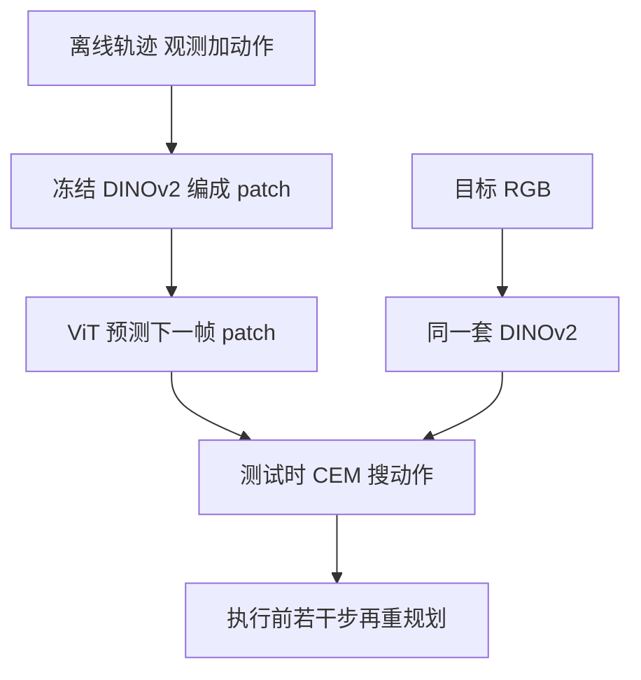

# DINO-WM：把世界模型冻在 DINOv2 的 patch 上，测试时再规划

<!-- release-date: 2024-11-07 -->

**本文依据**：`DINO-WM: World Models on Pre-trained Visual Features enable Zero-shot Planning`，arXiv `2411.04983v2`（2025-02-01，21 页）。作者 Gaoyue Zhou、Hengkai Pan、Yann LeCun、Lerrel Pinto；第一单位 Courant Institute, New York University（封面另列 Meta AI）。项目页 `https://dino-wm.github.io`。首发日取 arXiv v1 提交日 2024-11-07；本地读的是 v2。文中数字标 `(PDF p. N)`；标「外部补充」的段落不来自本文。封面未印会议名。

## 一句话

世界模型若要任务无关，就不该在像素上重建世界，也不该把奖励写进表征。DINO-WM 把 DINOv2 的 patch 特征冻住，只用离线轨迹学动力学，测试时把目标图编成同一套特征，用 MPC 搜动作。六套环境、无专家演示、无奖励、无逆模型：Maze / Wall / Reach / PushT 成功率 0.98 / 0.96 / 0.92 / 0.90，Rope / Granular 的 Chamfer 距离 0.41 / 0.26（PDF p.6 表 1）。最难几项相对先前工作平均约 45%（引言，PDF p.2）；Granular 上 LPIPS 相对次优 0.080 → 0.035，约 56%（PDF p.8 表 4）。

## 一、矛盾：在线世界模型绑死任务，离线世界模型又要额外拐杖

机器人这两年靠模仿学习和强化学习能做复杂动作，但部署时策略几乎都是前馈：观测进、动作出，不再优化。要泛化，训练时就得把所有任务都见过——既不可行，也不经济（PDF p.1）。

另一条路是学动力学，测试时再针对当前任务搜动作。这就是世界模型。它分两条：

| 范式 | 数据从哪来 | 卡在哪 |
|---|---|---|
| 在线 | 和环境交互，边采边改模型 | 模型只在当前策略覆盖的区域准；换任务就要重训（PDF p.1） |
| 离线 | 预先采好的轨迹 | 求解时往往还要专家演示、关键点、预训练逆模型或稠密奖励，通用性被这些辅料吃掉（PDF p.2） |

像素空间预测贵（还常配扩散）；潜空间预测又多半绑着重建或奖励，表征变成任务专用（PDF p.2）。全文主矛盾因此不是「再训一个更准的视频生成器」，而是：**离线轨迹上，用什么不牺牲通用性的辅料，把动力学学到能直接做视觉目标到达。**

作者给的辅料是已经在互联网图像上预训练好的 **DINOv2 patch 特征**：空间布局和物体中心先验已经在里面，不必为每个新环境从零学感知（PDF p.2、p.4）。

（机制示意，根据 PDF p.3 图 1、p.4 图 2。）

## 二、观测模型：感知是通用任务，不要在新环境里从零学

环境被写成部分可观测 MDP：观测空间 $O$、动作空间 $A$，转移 $p(o_{t+1}\mid o_{\le t},a_{\le t})$（PDF p.3）。测试时给任意当前观测和一张目标 RGB，要产出动作序列到达目标——不是在线 RL 里优化固定奖励，也不是文本条件视频模型（PDF p.3）。

世界模型三件套（PDF p.3）：

- 观测模型：$z_t\sim\mathrm{enc}_\theta(z_t\mid o_t)$
- 转移模型：$z_{t+1}\sim p_\theta(z_{t+1}\mid z_{t-H:t},a_{t-H:t})$
- 解码器（可选，只为可视化）：$\hat o_t\sim q_\theta(o_t\mid z_t)$

解码器的训练目标和其余部分独立。训练和规划都可以不重建像素，比 IRIS、DreamerV3 那类把重建和动力学捆在一起更便宜（PDF p.4）。附录里把重建损失反传到预测器，PushT 成功率从 0.92 掉到 0.80（PDF p.15 表 7）。

DINOv2 整段冻结。每帧 $o_t$ 变成 $z_t\in\mathbb{R}^{N\times E}$（$N$ 个 patch，$E$ 维）（PDF p.4）。作者的理由很直白：面对新环境从零学观测模型又慢又常学不好，因为感知本该吃大规模图像数据（PDF p.4）。

## 三、转移模型：整帧一起预测，再加因果掩码

转移用 ViT，去掉 tokenization，直接吃 patch，相当于 decoder-only Transformer（PDF p.4）。改动两处：

1. **动作与本体感觉**：动作经 MLP 映到 $K$ 维，拼到每个 patch 上；有本体感觉就同样拼接（PDF p.4–5）。附录共享超参里动作嵌入维是 10（PDF p.18 表 12）。
2. **帧级因果注意力**：时刻 $t$ 的每个 patch 只看过去 $H$ 帧的全部 patch，不在同一帧里按 token 自回归。对比 IRIS：IRIS 在 token 级自回归，预测第 $k$ 个 token 还能看本帧已经生成的前 $k-1$ 个。作者认为整帧当一块更利于全局结构和时间泛化（PDF p.4）。

无掩码时，训练能偷看未来帧，测试时没有这些帧。PushT 上历史 $h=1$ 时有无掩码都是 0.76；$h=2$ 无掩码掉到 0.36、有掩码 0.88；$h=3$ 无掩码 0.08、有掩码 0.92（PDF p.14 表 6）。更长历史能带上速度、加速度、动量，但必须堵住作弊。

训练用 teacher forcing：轨迹切成长度 $H+1$ 的段，对 $H$ 个预测帧做潜空间一致性（PDF p.5）：

$$
L_{\mathrm{pred}}=\bigl\|p_\theta\bigl(\mathrm{enc}_\theta(o_{t-H:t}),\phi(a_{t-H:t})\bigr)-\mathrm{enc}_\theta(o_{t+1})\bigr\|^2
$$

$\phi$ 是动作编码器。全程不重建像素。

解码器是一叠转置卷积，损失 $L_{\mathrm{rec}}=\|q_\theta(z_t)-o_t\|^2$（PDF p.5）。它不影响规划能力，只让人看懂模型在想什么。

## 四、规划：潜空间 MSE，CEM 比反传动作更稳

当前图 $o_0$、目标图 $o_g$ 都编成潜向量。代价是终点潜状态与目标的均方误差（PDF p.5）：

$$
C=\|\hat z_T-z_g\|^2,\quad \hat z_t=p(\hat z_{t-1},a_{t-1}),\quad \hat z_0=\mathrm{enc}(o_0),\quad z_g=\mathrm{enc}(o_g)
$$

主实验用 **模型预测控制（MPC）** 加 **交叉熵方法（CEM）**：每轮从高斯抽 $N$ 条长 $T$ 的动作，滚世界模型，留代价最低的 $K$ 条更新分布，收敛后执行前 $k$ 步再重规划（PDF p.15）。模型可微，也可以对动作做梯度下降，但实验里 CEM 更好（PDF p.5、p.16 表 8）：

| 优化 | PointMaze | Push-T | Wall | Rope | Granular |
|---|---:|---:|---:|---:|---:|
| CEM（开环一次执行） | 0.8 | 0.86 | 0.74 | — | — |
| 梯度下降（开环） | 0.22 | 0.28 | — | — | — |
| MPC（CEM + 重规划） | 0.98 | 0.90 | 0.96 | 0.41 | 0.26 |

作者猜测给训练和规划目标加正则可能改善 GD，留给后续（PDF p.5）。

## 五、六个环境：随机轨迹就够，不要专家

观测一律 $224\times 224$ RGB（PDF p.5）。任务都是从任意起点到达一张目标图。数据几乎全是随机动作（PDF p.13）：

| 环境 | 在测什么 | 训练轨迹 | 轨迹长度 | 历史 $H$ | frameskip |
|---|---|---:|---:|---:|---:|
| PointMaze（表里叫 Maze） | 2 自由度力驱动小球到目标，含惯性和加速度 | 2000 | 100 | 3 | 5 |
| Wall | 两房间夹一门；另有墙门位置随机的变体 | 1920（固定）/ 10240（多样） | 50 | 1 | 5 |
| Reacher（Reach） | 两关节臂；要整臂姿态对齐，不只末端 | 3000 | 100 | 3 | 5 |
| Push-T | 推 T 块；绿 T 只是视觉锚，不是目标 | 18500（专家轨迹加噪回放） | 100–300 | 3 | 5 |
| Rope | XArm 拨软绳 | 1000 | 表 11 写 5；A.1 写 20 步 | 1 | 1 |
| Granular | 约一百颗粒子聚成指定形状 | 1000 | 同上 | 1 | 1 |

PushObj 变体另采 20000 条 100 步随机轨迹。Push-T 目标保证 25 步内可行（PDF p.5、p.13、p.18 表 11）。

**表 11 与 A.1 对 Rope / Granular 的轨迹长度不一致**（5 对 20），正文没有裁定，读实验时不要合成一个数。A.9 还写输入 resize 到 $196\times 196$、特征 $(14\times 14,384)$，表 12 又写 Image size 224——以实验设定节的 224 为准，把 196 当作实现细节里的未对齐陈述（PDF p.5、p.17–18）。

ViT：深度 6、16 头、MLP 2048，约 19M 参数。DINOv2 提 $(14\times 14,384)$。预测器学习率 $5\times 10^{-5}$，解码器 $3\times 10^{-4}$，动作编码器 $5\times 10^{-4}$，AdamW，100 epoch，batch 32（PDF p.17–18）。六套环境共用这套超参。

## 六、主结果：简单导航持平 Dreamer，接触丰富处拉开

对照 IRIS、DreamerV3、TD-MPC2 都在同一批离线数据上训、**不给奖励**，再用 MPC；AVDC 是扩散视频，附录另比动作条件变体（PDF p.6）。Maze / Reach / PushT / Wall 各 50 组起终点看成功率；Rope / Granular 因步进贵，10 组看 Chamfer 距离（越小越好）（PDF p.6）。

表 1（PDF p.6）：

| 模型 | Maze SR | Wall SR | Reach SR | PushT SR | Rope CD | Granular CD |
|---|---:|---:|---:|---:|---:|---:|
| IRIS | 0.74 | 0.04 | 0.18 | 0.32 | 1.11 | 0.37 |
| DreamerV3 | 1.00 | 1.00 | 0.64 | 0.30 | 2.49 | 1.05 |
| TD-MPC2 | 0.00 | 0.00 | 0.00 | 0.00 | 2.52 | 1.21 |
| DINO-WM | 0.98 | 0.96 | 0.92 | 0.90 | 0.41 | 0.26 |

Wall 和 PointMaze 上与 DreamerV3 持平（甚至 Maze 略低 0.02）。拉开发生在需要接触和物体动力学的地方。TD-MPC2 没有奖励就学不好潜空间，六项几乎全崩（PDF p.6）。引言「最难任务平均提升 45%」没有给出逐项公式；Reach 相对 DreamerV3 为 $(0.92-0.64)/0.64\approx 44\%$，Reach 与 PushT 相对各自最强基线的绝对增益平均约 0.44，和 45% 同一量级，精确聚合方式原文未写（PDF p.2、p.6）。

数据量在 PushT 上单调：200 / 1000 / 5000 / 10000 / 18500 条，成功率 0.08 / 0.48 / 0.72 / 0.88 / 0.92，解码后 LPIPS 0.056 → 0.005（PDF p.14 表 5；附录表号与正文「Table 5」的环境族表不是同一张——正文 4.5 节写 From Table 5，实际是 p.8 的表 3）。

A6000 上单步推理（batch 32）0.014 s；仿真一步（batch 1）3.0 s；CEM 100×10 次规划 53.0 s。可变形物体仿真更慢，潜空间前向是固定分辨率，所以相对仿真加速更明显（PDF p.17 表 10）。这是规划耗时，不是控制频率承诺。

## 七、表征消融：全局向量过迷宫，过不了精细空间

同一套转移头，换编码器（PDF p.6–7 表 2）：

| 编码器 | Maze | Wall | Reach | PushT | Rope CD | Granular CD |
|---|---:|---:|---:|---:|---:|---:|
| R3M | 0.94 | 0.34 | 0.40 | 0.42 | 1.13 | 0.95 |
| ImageNet ResNet-18 | 0.98 | 0.12 | 0.06 | 0.20 | 1.08 | 0.90 |
| DINO CLS（全局向量） | 0.96 | 0.58 | 0.60 | 0.44 | 0.84 | 0.79 |
| DINO patch（本文） | 0.98 | 0.96 | 0.92 | 0.90 | 0.41 | 0.26 |

PointMaze 动力学简单，大家都能近满分。任务一要精确空间，单向量编码器就掉。作者的解释：R3M / ResNet / CLS 把图压成一个全局特征，丢掉操作需要的布局（PDF p.7）。

## 八、配置泛化：门换位置还能找门，粒子变少仍能聚堆

三族未见配置（PDF p.7–8、p.13）：

- **WallRandom**：训练见过的墙门位置与测试不重叠。
- **PushObj**：训练四种形状，测未见的类俄罗斯方块和「+」；智能体和物体都要到目标位。
- **GranularRandom**：直接用 4.3 节那个固定粒子数训好的模型，测试粒子更少，目标是随机位置的方堆。

表 3（PDF p.8）：

| 模型 | WallRandom SR | PushObj SR | GranularRandom CD |
|---|---:|---:|---:|
| IRIS | 0.06 | 0.14 | 0.86 |
| DreamerV3 | 0.76 | 0.18 | 1.53 |
| R3M | 0.40 | 0.16 | 1.12 |
| ResNet | 0.40 | 0.14 | 0.98 |
| DINO CLS | 0.64 | 0.18 | 1.36 |
| DINO-WM | 0.82 | 0.34 | 0.63 |

WallRandom 上作者认为模型学到了「墙和门」而不是死记坐标；别人经常找不对门。PushObj 对所有方法都难：只见过四种形状，物理参数推不准。GranularRandom 粒子不到训练时一半，图像已出分布；patch 编码让「每块里有多少粒子」仍比较局部，CD 最低（PDF p.8）。

## 九、和生成视频比：好看不等于能规划

AVDC 按文本目标扩散整段视频。图 6：画面真实，但单步物理跳变大，到不了精确目标（PDF p.8）。动作条件变体（当前帧 + 动作 → 下一帧）开环滚长了会偏离真值，不够拿来做任务规划（PDF p.16 图 7）。扩散还贵，不适合测试时 MPC（PDF p.3）。

开环滚出（图 4，PDF p.7）：给定首帧和动作序列，DINO-WM 解码结果和真值几乎分不出；这是「潜空间预测 + 独立解码器」的可视化，不是规划本身的成功判据。

LPIPS（越低越好，PDF p.8 表 4；SSIM 在 p.17 表 9）：

| 方法 | PushT | Wall | Rope | Granular |
|---|---:|---:|---:|---:|
| R3M | 0.045 | 0.008 | 0.023 | 0.080 |
| ResNet | 0.063 | 0.002 | 0.025 | 0.080 |
| DINO CLS | 0.039 | 0.004 | 0.029 | 0.086 |
| AVDC | 0.046 | 0.030 | 0.060 | 0.106 |
| DINO-WM | 0.007 | 0.0016 | 0.009 | 0.035 |

引言 56% 对得上 Granular：相对 R3M/ResNet 的 0.080，$(0.080-0.035)/0.080=56.25\%$。PushT 相对 DINO CLS 的 0.039 降幅更大（约 82%），不要把 56% 套到所有环境。即使编码器没有环境专用重建目标，解码质量仍高于那些有重建目标的模型（PDF p.8）。

## 十、局限：覆盖、真动作、动作空间规划

结论三句话：潜空间动力学、任务无关、测试时规划出零样本行为（PDF p.8）。限制同样三条，都不是边角：

1. 离线数据要有足够状态—动作覆盖；复杂环境很难。作者设想以后加探索、在线更新（PDF p.8）。
2. 仍要智能体的真值动作，吃不了互联网上无动作的视频（PDF p.8）。
3. 现在在动作空间规划；更细的控制可能需要高层规划加低层策略的层次结构（PDF p.8）。

社会影响声明是模板句，没有额外风险讨论（PDF p.9）。资助来自 Honda、Hyundai、NSF 2339096、ONR，Pinto 有 Packard Fellowship（PDF p.9）。

## 可迁移

- **感知与动力学拆开**：通用视觉先验冻结，环境特异的部分只学「特征怎么随动作走」。新环境缺数据时，先不要从零训编码器。
- **重建损失不是世界模型的必选项**：可视化解码器可以后挂；把它反传到预测器，PushT 上会伤规划。
- **整帧因果，不要 token 级偷看**：历史一加长，无掩码会在训练里作弊。任何「多帧预测下一帧」的 Transformer 都该先做这张消融。
- **规划器是探针，不是贡献本身**：CEM+MPC 很标准；文章用它证明潜空间有没有把接触动力学留下。评估世界模型时，用目标到达比只用 LPIPS 更接近「能不能拿来做事」。
- **全局向量够导航、不够操作**：迷宫上大家都能满分，不能拿简单导航宣称表征够用。
- **覆盖仍是天花板**：18500 条才把 PushT 推到 0.92；200 条只有 0.08。方法不取消数据需求，只是让同样数据更够用。
- **不要假设生成视频能直接 MPC**：物理一致性与单步代价可微，比「看起来像」更硬。

## 关键词回看

- **世界模型**：用观测和动作预测未来，供测试时优化行为，而不是训死一个前馈策略。
- **DINOv2 patch**：把图切成格子，每格一个向量；相对 CLS 全局向量保留布局。
- **任务无关**：训练不吃奖励、折扣、终止，只吃离线轨迹。
- **MPC / CEM**：反复想象动作序列、留下代价低的、执行一小段再重规划。
- **Chamfer 距离**：两堆点之间的最近邻距离，用来衡量粒子/绳与目标构型有多近。

## 参考资料

- 原件：`readings/_src/世界模型与 Agent/DINO-WM.pdf`（arXiv `2411.04983v2`）
- 项目与代码入口：`https://dino-wm.github.io`
- DINOv2：`https://github.com/facebookresearch/dinov2`
- 预测器实现基于 `https://github.com/lucidrains/vit-pytorch/`
