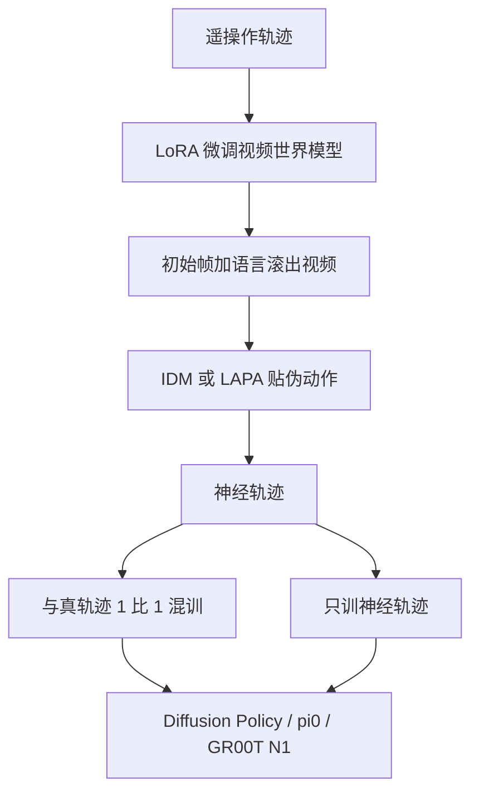

# DreamGen：世界模型先做梦，策略再拿伪动作练

<!-- release-date: 2025-05-19 -->

**本文依据**：`DreamGen: Unlocking Generalization in Robot Learning through Video World Models`，arXiv `2505.12705v2`（封面印 `arXiv:2505.12705v2 [cs.RO] 17 Jun 2025`，23 页）。作者 Joel Jang、Seonghyeon Ye、Zongyu Lin、Jiannan Xiang 等；四人共同一作。第一作者最低编号单位 **NVIDIA**（封面另列 University of Washington、KAIST、UCLA、UCSD 等）。Scott Reed、Yuke Zhu、Linxi Fan 共同指导。封面无会议名。项目页印 `https://research.nvidia.com/labs/gear/dreamgen`（PDF p.1）。文中数字标 `(PDF p. N)`。

## 一句话

真机遥操作贵，仿真又过不了 sim2real。DreamGen 把图像到视频的世界模型当合成数据机：先 LoRA 适配机体，再按「初始帧 + 语言」滚出视频，用逆动力学（IDM）或潜动作（LAPA）贴伪动作，得到 **neural trajectories（神经轨迹）**，最后训视觉运动策略（PDF p.1–2 图 1–2）。GR1 只在一个环境里采 pick-and-place，就能在已见环境里把新行为均分成功率从 11.2% 拉到 43.2%，在未见环境里从 0% 拉到 28.5%（PDF p.7 表 1）。DreamGen Bench 的指令跟随与物理对齐，和下游 RoboCasa 成功率正相关（PDF p.8 图 6）。

## 主矛盾：世界模型很会演，策略要的是能执行的控

机器人基础模型靠大规模遥操作，新任务和新场景几乎都要重采（PDF p.2）。仿真合成省人力，但要工程、要过 sim2real，液体、布、锤子一类接触还不好建（PDF p.2、p.9）。

另一条路是视频世界模型。前人多把它们当 **测试时规划器**：生成未来画面，再反解动作或当高层计划（PDF p.2）。问题是最强的视频生成器现在跑不动和策略并排的实时闭环，强先验用不上。

DreamGen 换用法：世界模型 **离线造数据**，不进控制环。视频没有真动作，所以要补伪标签。作者把这套视频加伪动作叫神经轨迹（PDF p.2）。

和「只改外观」的生成增强也不同。CACTI、GenAug、RoVi-Aug 一类主要做 in-painting 或视频到视频，多样性卡在视觉偏移，机器人运动本身几乎不变（PDF p.9）。DreamGen 要的是新动词、新场景里的新运动。

## 全景：四步，机体适配完再做梦

（机制示意，根据 PDF p.2 图 2。）

四步（PDF p.2–4）：

1. **微调世界模型**：在目标机体的遥操作上 LoRA，学运动学与约束，尽量少忘互联网视频先验。
2. **滚出视频**：给新初始帧和语言指令，生成熟悉或全新任务的视频。
3. **贴伪动作**：IDM 或 LAPA。
4. **训策略**：语言加图像出动作块。神经轨迹没有本体感觉，状态输入填零。

多数下游实验的基座视频模型是 **WAN2.1**（PDF p.3）。RoboCasa 与 DROID 多视角时，把左、右、腕相机拼成 $2\\times 2$ 网格，右下角填黑（PDF p.3、p.16 图 10）。

## 伪动作：有真控用 IDM，没有真控用潜动作

### IDM

架构是扩散 Transformer + SigLIP-2 视觉编码器，训练目标是 flow matching（PDF p.3–4 图 3a）。条件只有两帧图像，预测两帧之间的动作块。不加语言、不加本体感觉，故意只学动力学。训练数据默认与世界模型同一套遥操作。推理用滑动窗口：每次预测 $H$ 步 $\\hat{a}_t$ 到 $\\hat{a}_{t+H}$，再滑一格（PDF p.4）。

有数字孪生时，可以把伪动作回放到仿真，判断瓶颈在视频还是在 IDM。作者经验是多数瓶颈在视频质量（PDF p.15 图 7、附录 A）。

### LAPA 潜动作

用 LAPA 的 Transformer 编解码器，VQ-VAE 目标，让潜动作抓住两帧之间的视觉差（PDF p.4 图 3b）。生成视频上：当前帧与 1 秒后的未来帧。策略侧用量化前的连续嵌入，跟 GR00T N1 一样。码本大小 8，序列长度 16，训练 10 万步、batch 1024（PDF p.15）。

表 3 的混合数据合计 4.381 亿帧、约 5721.3 小时，含真机、仿真和人视频：GR-1 遥操作 88.4 小时、DexMG 61.64 小时、DROID 428.3 小时、RT-1 338.4 小时、Language Table 195.7 小时、Bridge-v2 111.1 小时、RoboCasa 268.0 小时、Agibot-Alpha 1979.4 小时、Sth-v2 105.7 小时、Ego4D 2144.7 小时（PDF p.15 表 3）。

潜动作的好处：训练 LAPA 时 **不需要目标机体的真动作**。IDM 的好处：伪动作在机体空间里，可以 **只靠神经轨迹训策略再真机评**。后文默认 IDM，因为各设定都有遥操作能训够用的 IDM（PDF p.5）。零真值、全新机体上的零样本仍是开放问题（PDF p.5 脚注 6）。

### 策略怎么吃这些轨迹

条件是观测 $o_t$ 和指令 $i_t$，预测 $\\hat{a}_{t:t+H}$（PDF p.4）。混训时真假轨迹采样比 1:1。GR00T N1 把两类轨迹当不同 embodiment，分开动作编解码，作者猜测这能对冲状态全是零（PDF p.4、p.6）。行为和场景泛化实验 **只训神经轨迹**（PDF p.4）。

初步实验里零状态不伤性能；让 IDM 同时预测状态留给以后（PDF p.4 脚注 4）。

## 实验一：给已有任务加数据

### 仿真 RoboCasa：神经轨迹对数线性

评测协议跟原 RoboCasa 论文。世界模型用 1200 条真人演示微调；IDM 和策略走三档真值：低 720、中 2.4k、高 7.2k（PDF p.5）。图 4 横轴是神经轨迹条数，纵轴是 24 任务均分成功率，策略骨干是 GR00T N1（PDF p.4–5）。

三件事（PDF p.5）：

- IDM 和 LAPA 混训都抬点，所以后面默认 IDM。
- 神经轨迹条数与成功率呈 **对数线性**。作者把相对原演示最多放大到约 333 倍（PDF p.2）。
- **只训神经轨迹** 也能到非零：引言写 20.6%，附录表 4 的 ONLY NT 均分是 **20.55%**（PDF p.5、p.16 表 4）。以表为准。

表 4 还给出 30 / 100 / 300 条真轨迹，以及各自加上 24 万条神经轨迹（NT）的对照（PDF p.16；30/100/300 对应图 4 的低/中/高）：

| 设定 | 均分成功率 (%) |
|---|---:|
| 30 traj. | 17.44 |
| 100 traj. | 32.07 |
| 300 traj. | 49.59 |
| 30 + NT | 23.32 |
| 100 + NT | 39.94 |
| 300 + NT | 57.61 |
| ONLY NT | 20.55 |

300 条真轨迹加 NT 到 57.61，仍高于只加数据前的 49.59。ONLY NT 的 20.55 略高于 30 条真轨迹的 17.44，但远低于 100 条真轨迹的 32.07：合成能救急，替代不了中等规模真演示。

24 万条 RoboCasa 神经轨迹的生成成本：1500 张 NVIDIA L40、54 小时（PDF p.9）。这是限制节的数字，不是免费缩放。

### 真机：三台机体、九个难仿真任务

九个任务：Fourier GR1、Franka、低成本 SO-100（PDF p.5–6）。主实验走低数据：GR1 / Franka 用所采数据的 10%（每任务约 10 条；GR1 叠毛巾用 25 条），SO-100 用 25%（10 条和 13 条）。神经轨迹：GR1 每任务 300 条，Franka 每任务 100 条，SO-100 为 40 和 50 条，与真轨迹 1:1 混训（PDF p.6）。

引言把 GR00T N1 均分写成 GR1 37% → 46.4%、Franka 23% → 37%、SO-100 21% → 45.5%（PDF p.2–3）。附录表 5 更细（PDF p.17；此处不拷表格星号）。**以表 5 为准**：

| 模型 | GR1 均分 | Franka Pick | Cube | Tool | SO-100 Pick | Tic-Tac-Toe |
|---|---:|---:|---:|---:|---:|---:|
| GR00T N1 低数据 | 37.0 | 40.0 | 10.0 | 20.0 | 17.0 | 25.0 |
| GR00T N1 + 神经轨迹 | 46.0 | 60.0 | 20.0 | 30.0 | 26.0 | 65.0 |
| GR00T N1 全量真数据 | 69.0 | 80.0 | 50.0 | 40.0 | 36.0 | 40.0 |

GR1 低数据四任务：锤 60.0、擦 36.6、叠 27.0、碗 25.0；加神经轨迹后 65.0、49.0、37.0、35.0（PDF p.17 表 5）。引言 46.4 对不上表均分 46.0。Franka 三任务低数据均分 $(40+10+20)/3 \\approx 23.3$，加神经轨迹 $(60+20+30)/3 = 36.7$，和引言 23 → 37 大致同向。SO-100 低数据均分 $(17+25)/2 = 21$，加神经轨迹 $(26+65)/2 = 45.5$，与引言一致。

Diffusion Policy 在 GR1 上也从 22.0 到 27.0，但锤任务从 35.0 掉到 15.0（PDF p.17）。不是所有骨干、所有任务都涨。作者说 GR00T N1 涨得更稳，归因于 IDM 动作单独编解码（PDF p.6）。

全量真数据仍明显高于「低数据 + 神经轨迹」：GR1 均分 69.0 对 46.0。合成是补低数据，不是已经替代全量遥操作。

微调配方（PDF p.17 附录 F）：

- GR1 四项灵巧：世界模型先在 **2884** 条单环境 pick-and-place 上训，再在每任务低数据上继续微调；IDM 只用这 2884 条，不再按任务后训。
- Franka：世界模型先在 49895 条 DROID 上训，再按任务低数据微调。只训 DROID 时梦能换场景，抓取细节会错。IDM 用全部 49895 条、不后训。低数据条数：牛奶入碗 11、叠方块 10、舀 M&M 8。
- SO-100：原视频把多条相同动作拼在一条里，要人工剪开。采样 10 和 13 段视频，剪完得到 68 和 44 条轨迹。

WAN2.1 超参（PDF p.16 附录 D）：学习率 $1\\times 10^{-4}$，LoRA rank 4、alpha 4。RoboCasa 100 epoch、batch 32；GR1 75 epoch、batch 64；DROID 5 epoch、batch 64；SO-100 两任务各 200 epoch、batch 8。

## 实验二：新动词和新房间

世界模型只在 GR1 的 **2884** 条多样 pick-and-place 上微调（第三节又写 2885，差 1 条；PDF p.7）。然后只拿神经轨迹训 GR00T N1。新行为定义为 **新动词**，不是旧运动换物体（PDF p.7）。每项新行为生成 50 条神经轨迹（PDF p.7）。

表 1（PDF p.7；已见环境 14 项、新环境 13 项）：

**已见环境、新行为**（基线 / DreamGen）：开微波炉 0 / 23，开 MacBook 0 / 45，关饭盒 0 / 10，打铃鼓 5 / 15，敲键盘 0 / 90，抓按钮 45 / 75，倒水 40 / 55，浇花 50 / 95，点蜡烛 10 / 15，用吸尘器 0 / 55，熨衬衫 0 / 20，拿勺 7 / 17，摊垫 0 / 55，移鼠标 0 / 35。**均分 11.2 → 43.2**。

正文曾写基线 11.8%，随即又写 11.2% → 43.2%（PDF p.7）。表头均分是 11.2。倒水等任务对「只拿起瓶子」给 0.5 分，所以纯 pick-and-place 基线不是全零（PDF p.7）。

**新环境**：基线 13 项全 0.0。DreamGen 均分 **28.5**。其中已见行为变体（拾柑橘、装三明治、称橙、扔杯、梨入篮、酱料上托盘）为 30、10、20、45、35、45；新行为（浇花、提篮、搅勺、打蛋器、关汤盒、揭锅、盖锅）为 15、55、15、25、55、30、35（PDF p.7 表 1）。

摘要写「22 个新行为、已见与未见环境」（PDF p.1）。表 1 是 14 个已见环境新行为 + 7 个新环境新行为，合计 21 个不同动词行；「22」不要当表 1 的行数。

和 $\\pi_{0.5}$ 一类靠 **堆环境数量** 做场景泛化不同：这里物理采集只有一个实验室，新场景只拍初始帧（PDF p.7）。初始帧仍要人手拍；作者希望以后用图像到图像扩散改物体位置、类别和背景（PDF p.3 脚注 3）。

评测每 checkpoint 10 次 rollout，随机目标物位置（PDF p.20）。分步给分细则在表 8（PDF p.21），例如开微波炉 0.33 / 0.66 / 1.0。均分里混了部分分，读 43.2 时不要当成「整段任务全成功」。

## DreamGen Bench：先评视频，再决定值不值得上真机

要量化「视频模型能不能接到某个机体上」：既要内化刚体物理，又要对新物体、新行为、新场景泛化。两个指标（PDF p.7–8）：

- **指令跟随（IF）**：视频是否完成指定任务。Qwen2.5-VL 给 0/1；另有 GPT-4o 与人工。
- **物理对齐（PA）**：VideoCon-Physics 给 0–1，再与 Qwen2.5-VL 的物理分平均。多视角和多样真机环境上 VideoCon-Physics 不可靠，所以要混通用 VLM（PDF p.8）。

四个模型：Hunyuan、CogVideoX、WAN2.1、Cosmos；各有 zero-shot 与 sft。两套数据：仿真 Franka（RoboCasa 训练 1200 条、评 48 帧）和真机 GR1（训练 100 条；物体 50、行为 47、环境 30 帧）（PDF p.8 表 2）。

零样本几乎不会当机器人：多数 IF/PA 接近 0；Cosmos-zero 在 RoboCasa 上 Qwen IF 22.9、物体 PA 32.0，仍远低于微调（PDF p.8 表 2）。

微调后 WAN2.1-sft 与 Cosmos-sft 最强。摘几格（表 2 把 GPT / Qwen / 人混排，下列按原文能读清的列）：

| 模型 | RoboCasa IF-GPT | RoboCasa 人 IF | GR1 物体 PA（人） | GR1 行为 IF-Qwen | GR1 环境 PA（人） |
|---|---:|---:|---:|---:|---:|
| Hunyuan-sft | 68.8 | 81.3 | 52.0 | 10.6 | 43.2 |
| CogVideoX-sft | 72.9 | 79.2 | 72.0 | 28.0 | 61.1 |
| WAN2.1-sft | 77.1 | 91.7 | 80.0 | 55.3 | 67.4 |
| Cosmos-sft | 79.2 | 93.8 | 84.0 | 61.7 | 53.3 |

人工 IF 与 GPT-4o IF 的 Pearson：RoboCasa 0.94、GR1-Object 0.93、GR1-Behavior 0.96、GR1-Env 约 1.00（PDF p.19 表 6）。正文写平均 Pearson 大于 90%（PDF p.8）。Qwen IF 与人的相关也高（0.92–0.97，PDF p.19 表 7），但 RoboCasa 上 Qwen 绝对值低得多（Hunyuan 8.3 对人 81.3），只能当排序，不能当成功率。

图 6：每个模型生成 7k 条神经轨迹，只靠它们训 RoboCasa 策略。Bench 分取表 2 的 IF(GPT) 与 PA 平均。与 RoboCasa 分正相关（PDF p.8）。图是散点，正文没有相关系数数字。

更便宜的中间检查：把 IDM 动作在 GR1 数字孪生里回放，不必每次都生成 7k 视频再训策略（PDF p.19 附录 H.4）。

## 和相关工作的边界

仿真数据（MimicGen、RoboCasa、RoboGen 等）卡在 sim2real、难仿真物体、以及 TAMP 或插值演示的运动多样性（PDF p.9）。视觉增强不改运动。测试时用 IDM / 光流 / 语言规划的视频策略，吃的是当时能实时跑的生成器。并发工作把文生视频接到新任务，但范围停在仿真（PDF p.9）。另一路把策略、正逆动力学焊在同一个生成模型里，和 SOTA 视频模型解耦不开。DreamGen **故意拆开**：视频模型可以换最新的 WAN / Cosmos，策略可以换 Diffusion Policy / $\\pi_0$ / GR00T N1（PDF p.9）。

人视频潜动作（LAPA 等）在这里换成世界模型合成的机器人视频，再与真动作混训（PDF p.9）。

## 没写什么、作者承认的限制

没写：WAN2.1 参数量与预训练配方、IDM 的 $H$ 默认值、真机评测的置信区间、图 4 曲线的逐点数字、图 6 的具体相关系数。封面无会议。首发日按任务给定的 v1 日 2025-05-19；本地 PDF 是 v2、页眉 17 Jun 2025。

限制节（PDF p.9–10）：

- 没直接对标「从人视频学」的方法；任务相对简单，覆盖不了全部运动学。
- 算力大：24 万条 RoboCasa 要 1500×L40、54 小时。
- 初始帧仍手拍。
- Bench 的自动评分用轻量开源模型，物理真实性会幻觉。

## 可迁移的读法

- 世界模型不一定要进控制环。当前最强视频生成器更适合 **离线造轨迹**。
- 伪动作是接口：有真控就训 IDM，没有真控就潜动作。IDM 才能「只合成、真机评」。
- 神经轨迹没有状态就填零，混训时最好把合成动作当单独 embodiment，避免和真本体感觉抢编码器。
- 低数据真机上合成能涨，但全量真数据仍高一截。对数线性是仿真里的观察，不要直接外推真机条数。
- 场景泛化可以只换初始帧，不必先堆几十个实验室——前提是视频模型预训练里已经见过足够多房间。
- 先用视频 Bench（指令 + 物理）筛模型，再决定是否烧 GPU 造 7k 轨迹。自动分能排座次，绝对值要拿人评校准。
