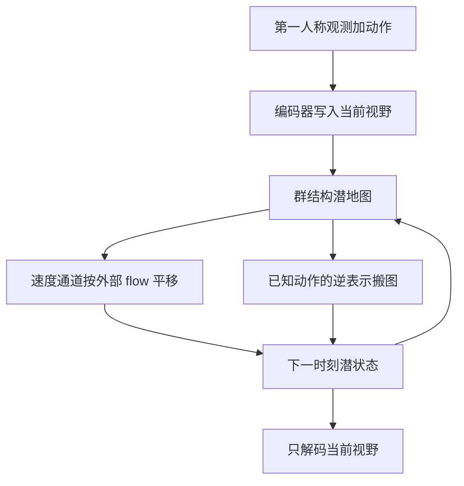

# FloWM：把自身运动和外部动体收成同一套 Lie 群 flow，部分观测也能滚很远

<!-- release-date: 2026-01-03 -->

**本文依据**：`Flow Equivariant World Models: Memory for Partially Observed Dynamic Environments`，arXiv `2601.01075v1`（2026-01-03，34 页）。作者 Hansen Jin Lillemark、Benhao Huang（共同一作）、Fangneng Zhan、Yilun Du、T. Anderson Keller；第一作者最低编号单位 Kempner Institute, Harvard University（封面另列 UC San Diego CSE、Carnegie Mellon University ML、Harvard SEAS）。封面印 Preprint。首发日取 arXiv v1 提交日 2026-01-03。文中数字标 `(PDF p. N)`；标「外部补充」的段落不来自本文。封面未印会议名。

## 一句话

视频世界模型若只靠滑动窗口注意力，出视野的物体一旦被挤出上下文，回头看到的就是幻觉。FloWM 把智能体的自身运动和外界物体运动都写成单参数 Lie 群 **flow**，潜记忆在共动坐标系里跟着流：自身动作用已知表示 $T_{a_t}^{-1}$ 搬图，外界速度用一组 **速度通道** 各自平移。2D MNIST World 上训 20 步、测 150 步，FloWM 的 MSE 是 $0.0005\to 0.0018$，DFoT 是 $0.1448\to 0.2111$（PDF p.8 表 1）。3D Dynamic Block World 上 70 / 210 步预测 MSE 为 $0.000603$ / $0.001539$，DFoT 为 $0.011759$ / $0.021684$（PDF p.9 表 2）。

## 一、矛盾：窗口里的视频很真，窗口外的世界已经没了

具身智能体拿到的不是全知俯视图，而是跟着自己转、跟着自己走的第一人称窗口。作者用围猎作比喻：既要估猎物的位置和速度，又要估同伴怎么动，而眼前永远只是环境的一小块（PDF p.1）。生物看起来像有一张和全局状态同步流动的潜地图。主流视频世界模型没有这张图。

世界模型要能预测「给了初值和动作之后，环境会怎么走」（Ha & Schmidhuber, 2018；PDF p.2）。近年主流是大尺度潜扩散 Transformer，观感好、能随数据和算力涨，但作者认为它们**本质上缺部分观测下的长程动力学**（PDF p.2）。

部分观测的硬要求是：任意久以前见过的东西，只要还和未来有关，就必须能取回来并推到当前。History-Guided Diffusion Forcing 一类自回归方法可以把自注意力窗口拉长，但帧一多，就要靠滑窗或别的近似丢掉信息。视频时空注意力又贵。一旦旧观测离开窗口，转身就会露出全新的幻觉场景；死抱过期帧，还会把已经在窗外演化的动力学弄错（PDF p.2）。

现有「记忆增强」大多只保证**静态 3D 场景的多视角一致**，没有把窗外动力学和自身运动收成同一套结构（PDF p.3）。全文主矛盾因此不是「再训一个更真的视频生成器」，而是：

**出视野的物体仍在按物理走。记忆必须跟物体一起流，也必须跟智能体一起转，而不能只是把旧画面存进视点相关的银行。**

（机制示意，根据 PDF p.2 图 1、p.3 图 2、p.6 图 4。）

图 2 把三条路线并排：标准自回归视频扩散把窗外帧直接丢掉；没有记忆时，过去观测和未来帧的依赖会断；现有记忆多是视点相关的，动态场景对不上。FloWM 把过去观测写进空间潜记忆，并用内部动力学持续更新（PDF p.3）。

## 二、flow 等变：时间参数化的对称性，不是再学一遍平移

神经网络 $\phi$ 对群 $G$ 等变，是指输入被 $g$ 变了，输出按同一套规则变：$\phi(g\cdot f)=g\cdot\phi(f)$（PDF p.3）。结构化权值共享减少参数，也把数据里已知的对称性写进模型。分子动力学里对 $E(3)$ 等变，数据效率可以到三个数量级（Batzner 等；PDF p.3）。视频世界模型反复从数据里重学同一套平移和旋转，等于把这套代数丢掉了。

Keller (2025) 把静态群等变扩成时间参数化的序列变换，称为 **flow**。向量场 $\nu$ 生成 $\psi_t(\nu)\in G$，把 $g_0$ 积到 $g_t$。形式上一参数子群：$\psi_t(\nu):\mathbb{R}\times\mathfrak{g}\to G$，由李代数元 $\nu$ 生成，$t$ 常被读成时间。序列到序列模型 $\Phi$ 是 flow 等变，当输入整段被某个 flow 作用时，输出也按同一 flow 走（PDF p.3 式 1）。信号上的作用是左作用：$\psi_t(\nu)\cdot f_t(g):=f_t(\psi_t(\nu)^{-1}\cdot g)$。

部分观测时，物体可以在看不见的地方动。等变应对的是**全局世界状态** $w_i$，而不是当前观测 $f_i$。中间加观测函数 $O(w_i)$，式 2 要求 $\Phi$ 对完整世界状态等变——输出应是动态环境的忠实记忆图，而不只是当前画面（PDF p.4）。作者说这主要是形式约定；证明仍按全观测写，见附录 A（PDF p.4、p.17）。

Keller 的充分条件是：在输入的共动坐标系里算。简单 RNN 的隐状态必须和输入一起流（PDF p.4 式 3）：

$$
h_{t+\Delta t}=\sigma\bigl(\psi_{\Delta t}(\nu)\cdot h_t+f_t\bigr)
$$

对一组 flow $\nu\in V$，Flow Equivariant RNN 准备多条 **速度通道** $h_t(\nu)$，各自按自己的向量场流（图 3 里画成叠起来的行）。李代数元素按固定代数组合：输入被 $\psi(\hat\nu)$ 作用后，隐状态也流，通道按 $\nu-\hat\nu$ 置换（PDF p.4 式 4）。

世界模型的记忆应对智能体动作群**和**外界物体运动群都做成群结构。用输出空间里动作表示的逆 $T_{a_t}^{-1}$ 去搬记忆，得到对自身运动的等变；速度通道负责外部运动。群运算封闭的直接后果：一套动作把智能体带回曾经看过的位置，表示必须相同。这正是窗外动力学的那块缺口（PDF p.4–5）。

## 三、广义递推：编码器加更新算子，再乘一步 flow

为了撑起 3D 部分观测，作者把递推写成任意等变编码器 $E_\theta[f_t;h_t]$ 和更新 $U_\theta[h_t;o_t]$，速度通道再乘 $\psi_1$（PDF p.4 式 5）：

$$
h_{t+1}(\nu)=\psi_1(\nu)\cdot U_\theta\bigl[h_t(\nu);E_\theta[f_t;h_t]\bigr](\nu)
$$

要保持 flow 等变，两条硬条件（PDF p.5 式 6）：

1. $E_\theta$ 和 $U_\theta$ 对自己的输入群等变。
2. 编码器对速度通道做 **trivial lift**：所有 $\nu$ 上写出同一份观测编码。

附录 A 用归纳证明：在隐状态沿 flow 维常数、且对 flow 作用不变的初始化下，广义递推仍满足 $h_t[\psi(\hat\nu)\cdot f](\nu)=\psi_t(\hat\nu)\cdot h_t[f](\nu-\hat\nu)$。和 Keller 原文的差别是：flow 写在 $U_\theta$ 外面，交换关系里的时间指标从 $t-1$ 变成 $t$（PDF p.17）。

**自身运动等变**用相对性：自身运动等价于输入在动，但中间多了一个已知动作 $a_t$。模型可以停在智能体的共动系，不必再为自身运动加通道。这就是 FloWM。用 $T_{a_t}$ 表示动作在隐状态上的作用（PDF p.5 式 7）：

$$
h_{t+1}(\nu)=T_{a_t}^{-1}\,\psi_1(\nu)\cdot U_\theta\bigl[h_t(\nu);E_\theta[f_t,h_t]\bigr](\nu)
$$

2D 平移动作里，$T_{a_t}$ 就是视觉流 $\psi_1(-a_t)$，和内部 flow 合成 $\psi_1(\nu-a_t)$。旋转等更复杂的动作则直接作用在空间维和速度通道上（PDF p.5）。

## 四、两个实例：卷积 RNN 写 2D，ViT 写俯视潜地图

### 简单循环 FloWM（MNIST World）

在 Keller 模型上加上统一的自身运动等变（PDF p.5 式 8）：

$$
h_{t+1}(\nu)=\psi_1(\nu-a_t)\cdot\sigma\bigl(W\star h_t(\nu)+\mathrm{pad}(U\star f_t)\bigr)
$$

部分观测的做法很土、也很干净：只往隐状态里小于世界尺寸的窗口写入、读出（图 3 蓝虚线框），其余部分按 $\psi_1(\nu-a_t)$ 在视野外流。读出时对速度通道做逐像素 max-pool，再经解码器 $g_\theta$ 预测下一观测。对应 $E_\theta[f_t;h_t](\nu)=U\star f_t$，$U_\theta=\sigma(W\star h_t+\mathrm{pad}(o_t))$，二者都对平移等变（PDF p.5）。

实现规模：隐状态通道 $C_{\mathrm{hid}}=64$；部分观测世界 $50\times 50$，窗口 $32\times 32$；速度集合 $V=\{-2,\ldots,2\}^2$，故 $|V|=25$；核 $3\times 3$、循环填充、无偏置；解码器两层卷积。全体 FloWM 与消融大约 75K 参数。训练：50 帧上下文、预测随后 20 帧 MSE，Adam、$10^{-4}$、batch 32、梯度裁剪 1.0、50 epoch；无速度通道但有自身运动等变的变体延到 100 epoch（PDF p.26–28）。

无速度通道就是带自身运动等变的卷积 RNN；再去掉 $-a_t$ 就是普通卷积 RNN。附录还试过把动作拼到输入和隐状态当额外通道：略好，但学不出内置等变（PDF p.27–28）。

### Transformer FloWM（3D Block World）

隐状态 $h_t$ 是按空间排好的 token，当作 Ha & Schmidhuber 意义上的**自上而下 2D 抽象地图**，不是真 3D 体素。动作群是 2D 平移加 90 度旋转，外部物体运动是 2D 平移，因此 $T_g$ 已知（PDF p.6）。

编码器是 ViT：把当前图像 patch 和视野内地图 token 拼在一起。地图永远以智能体为中心，平移旋转都围着中心转，所以视野坐标固定，对应三角形楔（图 4）。更新是门控混合，只改视野内格子（PDF p.6 式 9）：

$$
U_\theta[h_t;o_t]^{(x,y)}=\begin{cases}
(1-\alpha)h_t^{(x,y)}+\alpha o_t^{(x,y)} & (x,y)\in\mathrm{FoV}\\
h_t^{(x,y)} & \text{否则}
\end{cases}
$$

$\alpha=\sigma(W\,\mathrm{concat}[h_t;o_t])$。$U_\theta$ 对空间坐标的平移旋转等变。编码器要从 3D 第一人称映到抽象俯视图，**没有解析等变**（也不做显式深度反投影）。作者把编码器输出**当作**已经等变，指望步间的 $T_{a_t}^{-1}\psi_1(\nu)$ 逼它学会——引用过 Keller & Welling (2022)、Keurti 等 (2024)。实验看起来成立，但第 6 节承认这让 3D 训练前期变慢（PDF p.6、p.10）。

3D 配置：6 层 ViT 编解码、8 头、维 256、约 10M 参数；隐状态空间 $32\times 32$（世界尺寸的两倍，随机出生点才撑得住）；$|V|=5$（$\pm 1$ 轴对齐加零速度，无对角）；前进行 roll 一格，左转/右转 $\pm 90^\circ$。图像 patch 16，正弦位置编码；解码器用可学习 `[MASK]` 对 $\mathrm{FoV}(h_{t+1})$ 做交叉注意力。训练：50 帧上下文、预测随后 90 帧 MSE，teacher forcing 12.5%，Adam、$10^{-4}$、batch 16、150k step、2×H100（PDF p.25–26 表 11）。

## 五、对照：滑窗扩散和 SSM 记忆都是视点相关的

**DFoT**：History-guided Diffusion Forcing + CogVideoX 风格 Transformer，先训空间下采样 VAE 再潜扩散。训练不区分观测帧和预测帧，固定长度自注意力；动作按 CogVideoX 拼进窗口。推理时上下文帧低噪声、预测帧从纯噪声去噪，滑窗前移（PDF p.7、p.29）。MNIST 上约 95.3M、245k step、batch 128、1×L40S；Block World 300k、batch 32、2×L40S（PDF p.30 表 12）。VAE 重建 MSE 在 MNIST 约 0.02，所以 DFoT 的像素 MSE 先天大约高这么多（PDF p.31）。

**DFoT-SSM**：短窗 Diffusion Forcing 加分块扫描 SSM（Po 等 2025；Dao & Gu 2024）。训练有干净上下文帧。约 97.8M。Block World 评测统一给 70 帧上下文，因为 SSM 滑窗按 70 前进更顺；脚注说 50 或 70 结果接近（PDF p.7、p.9、p.30–31）。

相关工作把这两类和 WORLDMEM、体素地图放到同一把尺子上：静态场景、token 条件动作、视点相关存储、或深度反投影加 max-pool，都没有「窗外也按 flow 更新」这一步（PDF p.9–10）。Neural Map 的自我中心版被作者写成 FloWM **去掉速度通道** 的特例；EgoMap 用 Spatial Transformer 学变换，只是近似等变（PDF p.10）。

## 六、2D MNIST World：三件事叠在一起，扩散就散

世界是黑画布加若干恒速 MNIST 数字，视窗小于世界；每步数字按速度走，智能体随机相对平移。边界循环：左边出去右边回来。主设定 **dynamic po**：世界 $50$、窗口 $32$、5 个数字、自身平移范围 10、数字速度 $\pm 2$。训练集 180,000、验证 8,000。训练：50 观测 + 20 预测；长度外推：50 + 150（PDF p.7、p.23 表 7）。

表 1（PDF p.8），50 上下文，预测 20 / 150 帧：

| 模型 | MSE 20 | MSE 150 | PSNR 20 | PSNR 150 | SSIM 20 | SSIM 150 |
|---|---:|---:|---:|---:|---:|---:|
| FloWM | 0.0005 | 0.0018 | 32.99 | 27.56 | 0.9900 | 0.9813 |
| 无 VC | 0.0041 | 0.0334 | 23.83 | 14.77 | 0.9576 | 0.7729 |
| 无 SME | 0.1234 | 0.1317 | 9.088 | 8.805 | 0.0366 | 0.0127 |
| 无 SME、无 VC | 0.1233 | 0.1333 | 9.091 | 8.751 | 0.0374 | 0.0146 |
| 动作拼接 | 0.1125 | 0.1359 | 9.491 | 8.669 | 0.0623 | 0.0149 |
| DFoT | 0.1448 | 0.2111 | 8.394 | 6.755 | 0.4045 | 0.2434 |
| DFoT-SSM | 0.1277 | 0.1688 | 8.940 | 7.726 | 0.4550 | 0.3146 |
| 全黑基线 | 0.1656 | 0.1654 | 7.810 | 7.814 | 0.3573 | 0.3564 |

FloWM 滚到 $t=199$ 仍对得上窗外数字；无 VC 无 SME 失败；无 VC 在训练窗内还能凑合，长了就漂。DFoT 很快变成「像数字的伪影」；DFoT-SSM 数字慢慢褪成黑。图 5(c) 说 SME+VC 收敛步数比没有这些先验的低几个数量级——图是曲线，正文没有给出逐步数（PDF p.7–8）。

附录把三件事拆开（PDF p.23 表 6）。全观测、无自身运动时大家都能做，DFoT 仍带着约 0.02 的 VAE 底噪（表 8：FloWM MSE 0.00009 / 0.00104，DFoT 0.02128 / 0.03601）。一加自身运动，无 SME 立刻崩到全黑附近（表 9：无 SME 的 20 步 MSE 0.15595）。静态部分观测上无 VC 最好（表 10：0.00002 / 0.00004），因为速度通道没有外部运动可建模，只会加噪。作者的归纳：自身运动等变是能不能解的关键；速度通道换精确度和收敛时间，代价是更大的隐状态（PDF p.24）。

## 七、3D Block World：反弹让窗外动力学变非线性

Miniworld 方房间，彩色方块随机位置和速度；智能体离散动作：左转、右转、前进、不动。块撞墙反弹，窗外运动不再是恒速平移。探索带偏置：有时贴墙停下来看。训练 50 上下文 + 90 预测；表 2 评测用 70 上下文、70 / 210 预测。每个子集 10,000 训练、1,000 验证；世界 $15\times 15$，观测 $128\times 128$，6–10 个块，速度轴对齐 $\pm 1$。块之间、块与智能体都无碰撞。颜色选自蓝、绿、黄、红、紫、灰（PDF p.8–9、p.21 表 3）。

表 2（PDF p.9）：

| 模型 | MSE 70 | MSE 210 | PSNR 70 | PSNR 210 | SSIM 70 | SSIM 210 |
|---|---:|---:|---:|---:|---:|---:|
| FloWM | 0.000603 | 0.001539 | 32.19 | 28.13 | 0.9673 | 0.9525 |
| 无 VC | 0.007615 | 0.009614 | 21.18 | 20.17 | 0.9045 | 0.8935 |
| 无 SME、无 VC | 0.009579 | 0.012625 | 20.19 | 18.99 | 0.8782 | 0.8631 |
| DFoT | 0.011759 | 0.021684 | 19.30 | 16.64 | 0.9377 | 0.8885 |
| DFoT-SSM | 0.022616 | 0.022570 | 16.46 | 16.46 | 0.8877 | 0.8879 |

图 7：FloWM 滚到最后一帧仍一致；基线幻觉出新物体、忘掉旧物体和颜色。图 6 是逐步 MSE 曲线。正文有一处笔误，把逐步误差写成「Figure 7」（PDF p.9）；曲线在图 6。

**Textured** 变体随机墙/地/块纹理，三分之一概率换成球。表 4（PDF p.22）：FloWM 70 / 210 步 MSE $0.000826$ / $0.000926$，DFoT $0.005581$ / $0.009050$，DFoT-SSM $0.009658$ / $0.012169$。作者强调这篇的重点是 flow 记忆而不是视觉骨干，纹理集只说明差距在更花的外观上仍在。

**静态** 子集速度为 0。表 5（PDF p.22）：无 VC 最好（MSE $0.000789$ / $0.000641$），完整 FloWM 略差（$0.000860$ / $0.000937$）。DFoT-SSM 在静态上比动态好得多（$0.004763$ / $0.007985$），仍不如有空间记忆的 FloWM。作者猜测：没有空间记忆、再加每局块数随机，基线记不住块在哪。

## 八、算力：同一数量级，换的是不能沿时间并行

附录 H 在单卡 H100 上估训练 FLOPs：batch 1、140 帧的前向/反向 GFLOPs，再乘真实 batch 和步数。表 16（PDF p.33）：FloWM 16×150k → 27.5 EFLOPs；DFoT 32×300k → 15.7；SSM 32×300k → 10.5。正文说大约 1.7 到 2.6 倍，仍同一数量级。

表 17 是 batch 1、2 帧的逐步开销：FloWM 前向 31.18 GFLOPs / $104.47\pm 101.05$ ms，DFoT 4.94 / $90.93\pm 109.59$ ms。逐步墙钟同一数量级，但 FloWM 有循环状态，**不能沿序列并行**，推理随预测帧数线性涨。作者当成换长程潜地图的明确代价（PDF p.33）。后续想：编码器与隐状态更新解耦、线性可结合更新以便 parallel scan、对视野做稀疏/多尺度写入（PDF p.33）。

## 九、局限：刚体、确定性、离散速度、固定自我中心图

第 6 节写得很干脆（PDF p.10–11）：

1. 当前实例针对**简单刚体运动和已知动作参数化**。非刚体、形变、以及「开门 / 捡起」这类语义动作都不在范围内。要把 flow 递推接到更丰富的潜群或层级上。
2. 实验是给定动作序列的**确定性**动力学，单步重建损失、单条 rollout。作者把确定性当成随机动力学的前置；同一张等变潜地图原则上可接随机潜变量。
3. 3D ViT 编码器对 3D 变换**没有解析等变**，前期学得慢，等近似等变出现后速度通道才用得上。解析等变的 3D 编码器有望接近 2D 上的收敛速度。
4. flow 等变至今只对**离散集合** $V$ 成立，真实速度连续。作者引用离散群近似仍有用（Cohen & Welling；Kuipers & Bekkers；Petrache & Trivedi），仍希望做到连续速度。
5. 潜地图是自我中心的，空间范围和分辨率固定。纹理结果说明外观复杂度还能撑，开放世界需要可变尺寸地图和更强感知骨干。
6. 评测只当预测视频模型。作者想把这张记忆接到 JEPA 或 TD-MPC2 一类非生成世界模型里，再在潜空间规划（PDF p.10–11）。

神经科学附录是类比不是证据：视觉皮层有自身运动调制和预测误差；海马位置细胞/网格细胞的相位随前进等变（PDF p.21）。不要当成 FloWM 的实验支持。

致谢：Chan Zuckerberg Initiative Foundation 对 Kempner Institute 的捐赠（PDF p.11）。附录 I：偶尔用 LLM 润色句子（PDF p.34）。项目页在摘要末尾写了 “Project page”，正文多处 “here”，PDF 文本层没有印出 URL。

## 可迁移

- **记忆要世界中心，不要视点中心。** 滑窗、SSM、按相机位检索旧帧，都在记「当时看起来像什么」。窗外动力学要的是「物体现在在哪、速度是多少」。
- **自身运动和外部运动可以共用同一套 Lie 群 flow。** 差别只在自身运动有已知 $a_t$，不必再开通道。相对性写成 $T_{a_t}^{-1}\psi_1(\nu)$ 就够。
- **群封闭直接给出回环一致。** 走一圈回到原点，表示必须重合——这是几何约束，不是再加一项循环一致性损失。
- **速度通道是外部运动的坐标系，不是装饰。** 静态场景去掉它们更好；动态一加上，无 VC 会漂。通道集合应对齐数据里真正出现的速度。
- **解析等变写不进编码器时，步间的群作用仍能当教师。** 3D 俯视映射就是这样；代价是前期慢，不要假装已经「设计成等变」。
- **确定性、部分观测、长 rollout 是比 FVD 更硬的探针。** 看起来像但忘掉窗外物体，短视感知指标罚得轻。
- **循环潜地图换不来时间并行。** 若产品要实时长视频，先承认线性于地平线，再考虑解耦编码或 parallel scan；不要用「和扩散同一数量级 FLOPs」掩盖逐步延迟结构不同。

## 关键词回看

- **Flow**：由李代数元素生成的一参数群作用，把「匀速平移」写成时间上的对称性。
- **速度通道**：隐状态按候选速度各备一份，输入速度一变，通道置换。
- **自身运动等变（SME）**：用已知动作的逆表示搬潜地图，模型停在智能体共动系。
- **部分观测世界模型**：当前帧不含完整状态，必须记住并演化窗外物体。
- **FloWM**：把 SME 和外部 flow 写进同一条递推的世界模型；2D 是卷积 RNN，3D 是 ViT 更新的俯视 token 地图。

## 参考资料

- 原件：`readings/_src/世界模型与 Agent/Flow-Equivariant-WM.pdf`（arXiv `2601.01075v1`）
- Keller, T. Anderson. *Flow Equivariant Recurrent Neural Networks*. arXiv `2507.14793`（前作，本文 flow 定义所依）
- Song 等. History-Guided Video Diffusion（DFoT 基线）
- Po 等. Long-context State-Space Video World Models（DFoT-SSM 基线）
