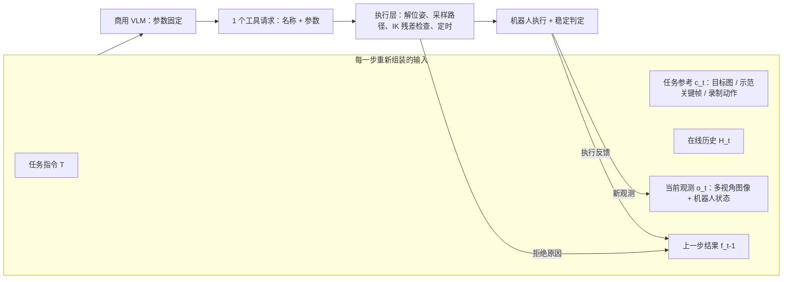

# GPT-Policy：不训练机器人策略，把示范塞进商用 VLM 的上下文里

<!-- release-date: 2026-09-16 -->

> 本文依据 **In-Context Robot Learning with VLM Agents**，即 arXiv:2609.19138v1（2026-09-16），共 32 页。第一作者 Dongzhou Cheng，第一单位 Morphi Robot（另列 Shanghai Innovation Institute）；通讯作者 Tong Wu（Morphi Robot、Fudan University）；另有华中科技大学、复旦、湖南大学、港中文、上海交大、武汉大学、东南大学、北航的合作者，共 15 位作者，其中 7 位共同一作（PDF p. 1）。代码仓与项目页链接印在首页（PDF p. 1）。封面未印会议名。页码均指这份 PDF 的物理页码。全文把 3 件事分开标注：**论文明确写了什么**、**我们如何解释它**、**哪些是外部资料补充**。

## 读前先把几个词说成人话

这篇论文不训练任何模型。它把一个现成的商用大模型接到机器人手臂上，然后问：光靠「给它看东西」，能不能让它学会新任务？所以难点不在网络结构，而在「喂什么、怎么喂、喂完怎么让手臂安全地动」。

先把会反复出现的词说清楚：

- **VLM（Vision-Language Model，视觉语言模型）**：能同时读图和文字、输出文字的大模型。本文主力是 GPT-6 Astra，对照组有 Fable 5.1 与 Kimi K3（PDF p. 11–12）。
- **ICL（In-Context Learning，上下文学习）**：不改模型参数，只靠在输入里放示例，让模型在这一次调用里学会新做法。论文给机器人 ICL 的定义是：测试时提供示范、样例或交互经验，行为随之适应，**没有梯度更新**，也没有持久改动任务专属参数（PDF p. 1）。
- **VLA（Vision-Language-Action，视觉语言动作模型）**：专门用机器人数据训练、直接输出动作的策略网络。本文不是 VLA，它把 VLA 当成未来可以接在下层的「快系统」（PDF p. 12–13）。
- **工具调用（tool call）**：模型不直接出关节角，而是输出一个结构化请求，比如「把右手末端移到这个位姿」。执行层负责把请求翻译成电机指令。
- **TCP（Tool Center Point，工具中心点）**：末端执行器上一个标定过的参考点，位姿就是指它的位置与朝向（PDF p. 5）。
- **IK（Inverse Kinematics，逆运动学）**：已知末端要到的位姿，反解各关节角。
- **SLERP（球面线性插值）**：在两个朝向之间沿最短旋转弧均匀过渡的插值方法（PDF p. 5）。
- **Harness（执行外壳）**：包住模型的那层软件。它组装输入、校验输出、驱动机器人、回传结果。本文的方法贡献主要就在这一层。
- **关键帧（keyframe）**：从示范视频里挑出来、代表关键时刻的少数几帧。VLM 看到的「视频」其实是这些帧加时间戳（PDF p. 4、p. 20）。

## 一句话先说清

机器人基础模型（GEN-1.5、S1、Zero-WAM 等）已经开始展示「看一段示范就能做新任务」的能力，但它们都是专门为机器人训练的（PDF p. 2）。这篇论文问的是互补的问题：**完全不训练、直接拿商用 VLM**，能把上下文学习做到什么程度？

作者的回答是一个叫 GPT-Policy 的通用 agent 框架，3 件东西串成闭环（PDF p. 1–2）：

1. **上下文编译**：把示范视频压成带时间戳的关键帧，可选地对齐录制的机器人状态与动作；
2. **固定参数的 VLM**：每一步只输出 1 个参数化的工具请求；
3. **受约束的执行层**：校验请求（IK 残差、速度加速度限制），执行，再把测量结果和拒绝原因回传给下一步决策。

5 类上下文各自负责告诉模型一件不同的事（PDF p. 1–2 与 Figure 1；任务名见 PDF p. 7 Table 1）：

| 上下文族 | 它告诉模型什么 | 实验任务 |
|---|---|---|
| 人类视频 | 任务怎么做、按什么顺序，不含机器人动作 | 捡红毛巾、捡笔记本 |
| 机器人视频（可加动作） | 视频给过程，对齐的动作记录给运动参考 | 拧瓶盖、拔插插头 |
| 目标图 | 想要的最终状态，不规定中间动作 | 摆 T 形、摆水果 |
| 自身交互历史 | 之前看到了什么、做了什么、结果如何 | 柠檬放粉色盘子、移动探索 |
| 在线人机交互 | 人的走子或手势，澄清意图或改变规则 | 井字棋、按手势捡水果 |

在 10 个真机任务、5 类上下文上，每个条件各跑 3 次（PDF p. 6–7）。结论分正反 2 面：

- **上下文确实有用**。人类视频没有任何机器人动作标签，却把 2 个抓取任务从 0/3 提到 2/3（PDF p. 7）；再加上对齐的机器人动作记录，拧瓶盖做到 3/3，拔插插头从 0/3 做到 2/3（PDF p. 7）。
- **懂了不等于做得到**。精确接触、结果核验、物理安全仍然是短板；作者反复观察到双臂互相碰撞（PDF p. 13）。各条件的平均用时在 5.3–25.53 分钟之间（PDF p. 7）；红毛巾任务上 GPT-6 Astra 不给示范的那一次运行估计用掉约 12M token（PDF p. 12）。

对读者最有用的不是那几个 3/3，而是这套「VLM 只出意图、执行层把关物理」的接口，以及论文对「模型说完成了不等于真完成了」的反复强调。

### 一条阅读路线

如果只有半小时读原文，建议按这个顺序：

1. **p. 4 Figure 2 与式 (1)**：整个闭环就是一行采样加一行执行。
2. **p. 5 Figure 3**：工具请求怎么变成关节轨迹，拒绝反馈从哪条虚线回来。
3. **p. 7 Table 1**：全部真机结果都在这一张表里，注意哪些任务有对照、哪些没有。
4. **p. 8 与 p. 11 Figure 7**：动作记录为什么能帮上忙，这是全文唯一一张定量的机制图。
5. **p. 12 Table 2 与 Takeaways**：跨模型对比只是单次运行；3 条结论是作者的总判断。
6. **p. 13 Future Directions 与 Scope and Limitations**：作者自己承认的边界。

附录 A–B（p. 17–19）是执行层的数值细节，附录 C（p. 19–20）是示范数据的处理，附录 D（p. 20–32）是全部提示词。附录 D 很长，但它才是「这套系统到底怎么约束模型」的真正答案，值得挑 P2、P3、P4 这 3 段细读。

## 主要矛盾：会想的模型不会动，会动的模型要重新训

论文的起点是一个老矛盾（PDF p. 1–2）：

- 任何有限的示范集合都覆盖不了机器人部署时会遇到的全部情况。人会看别人做一遍、看个样例、从后果里学，机器人策略却大多做不到这种部署时的适应。
- 专门训练的机器人基础模型开始能做 one-shot 适应，但每一种新能力都要靠专门的数据和训练。
- 商用 VLM 已经有很强的推理、工具使用和多步执行能力（论文点名 GPT-6 Astra、Claude Fable、Kimi K3、GLM-5.3），也天然会上下文学习（PDF p. 1–3）；但它输出的是文字，不是力矩。

于是问题变成：

> 能不能把「理解示范」这件事交给现成的 VLM，把「让手臂安全地到达那个位姿」交给传统机器人软件，中间只用一个窄接口连起来？如果能，这个组合在哪里成功、在哪里断？

作者强调，回答这个问题有 2 层价值：一是看清通用模型里**已经有**多少机器人任务理解；二是把「必须靠专门具身学习才能获得」的能力单独分出来（PDF p. 2）。所以这篇论文的定位更接近一份实证报告，而不是一个要刷榜的新方法。

## 先看全景：一个闭环，3 段职责

Figure 2（PDF p. 4）把系统画成 3 格：组装输入、VLM 策略、工具执行，外加一条把观测和执行反馈送回下一步的虚线。下面按同一逻辑重画成流程示意，不是原图：

这张图按 PDF p. 3–6 的正文与 Figure 2、Figure 3 重画。3 段的分工是这篇论文的骨架：

| 段 | 谁负责 | 输入 | 输出 |
|---|---|---|---|
| 上下文编译 | 宿主程序 + 一个选帧用的视觉模型 | 示范视频、录制状态与动作、目标图、历史 | 按时间排序、带视角标签的图文交错消息 |
| 决策 | 商用 VLM，参数不变 | 上面的消息 + 系统指令 + 工具定义 | 1 个 JSON 工具请求 |
| 执行 | 具身适配器（按机器人不同） | 工具请求 | 关节轨迹、测量状态、误差、拒绝原因 |

论文实现了 3 种具身：YAM 与 ARX X5 都是双臂、每臂 6 关节，用顶视和双腕 3 路 RGB；Morphi Kino 是双臂、每臂 7 关节，带移动底盘、可动腰部和头部，用头、胸、双腕 4 路 RGB（PDF p. 18）。正文没有逐任务写明用的是哪台机器人。

## 问题形式：2 行式子说完整个闭环

论文把每一步决策写成（PDF p. 4，式 1）：

$$
a_t \sim \pi_\theta(\,\cdot \mid T, c_t, o_t, f_{t-1}),
\qquad
(o_{t+1}, f_t) = \mathcal{E}(a_t, o_t)
$$

第一行说：VLM 策略 $\pi_\theta$ 看任务指令 $T$、上下文 $c_t$、当前观测 $o_t$ 和上一步工具结果 $f_{t-1}$，采样出一个工具请求 $a_t$。第二行说：机器人工具接口 $\mathcal{E}$ 执行这个请求，返回新观测 $o_{t+1}$ 和本步结果 $f_t$。

符号的意思是：

- $o_t = (I_t, s_t)$，$I_t$ 是按相机视角标好的图像，$s_t$ 是机器人状态（PDF p. 3）；
- $c_t$ 可以包含目标图 $G$、以关键帧表示的示范视频 $V$、录制的动作序列 $A$（可附测量状态），以及在线交互历史 $H_t$（PDF p. 3）；
- $a_t = (u_t, v_t)$，$u_t$ 是工具名，$v_t$ 是参数（PDF p. 4）；
- $f_t$ 是返回信息、执行进度或错误；第一步没有 $f_{t-1}$（PDF p. 4）。

**我们如何解释它。** 这个式子里最重要的是一个没写出来的东西：$\theta$ 在整个任务里固定不变（PDF p. 4）。所谓「学习」，全部发生在 $c_t$ 和 $H_t$ 这 2 个输入槽里。这和强化学习或微调的「学习」是两回事——这里没有任何东西被保存下来，下一个任务开始时模型和第一次见面一样。

## 上下文编译：把一段视频变成 VLM 读得动的东西

### 旧问题：VLM 读不了长视频，更读不懂一串关节角

一段示范视频可能几十秒、上千帧；遥操作还会录下每个控制周期的关节目标和末端位姿。整段塞给 VLM，既贵，又会让关键时刻淹没在重复的静止画面里。反过来只给一两张图，中间的动作又丢了。

### 新设计：2 轮选帧，再按需挂上数字

任务参考分 3 种（PDF p. 4）：

- **目标图 G**：只给目标状态，不规定中间动作；
- **示范视频 V**：人类亲手做一遍，或人遥操作机器人做一遍；
- **录制动作 A**：可选，附在视频上，可能带测量的机器人状态。

论文反复强调，这些参考记录和模型本次要输出的工具请求 $a_t$ 是两回事（PDF p. 4）。

选帧分 2 轮，由一个视觉模型完成（PDF p. 20–21）：

1. **P0a 局部选帧**：在重叠的视频窗口里，选能表达初始状态、关键动作、状态变化和最终结果的最小帧集合。提示词要求保留抓取、释放、换手前后的证据，要保留重复拧动的顺序，并明说「首尾姿态相似不代表没动」（PDF p. 21）。
2. **P0b 全局审阅**：合并冗余的停顿与窗口边界，通常保留 12–16 帧，不超过上限（PDF p. 21）。

硬上限是最多 24 个关键帧、48 张图，每边不超过 1,280 像素，不放大（PDF p. 20）。输入时，按时间顺序交错放图，每张图附相对时间、相机标签和阶段注释；参考与实时观测之间有显式的边界标记（PDF p. 20）。

人类示范用单一视角，不含任何数值状态。3 个人类示范的关键帧数（PDF p. 19，Table 4）：

| 任务 | 关键帧数 |
|---|---:|
| Pick Red Towel | 8 |
| Pick Up Notebook | 6 |
| Remove Glue Cap（附加参考任务，不在主对比里） | 7 |

### Video 与 Video + Action 的区别：图一样，多了数字

机器人示范是遥操作录下来的，包括带时间戳的图像、测量的关节与末端状态、运动与夹爪指令（PDF p. 19）。2 种输入模式**共用同一批图**，只有 Video + Action 附上测量状态和动作片段（PDF p. 19）。

对齐方法是时间戳匹配（PDF p. 20）：

- 每个关键帧取 0.1 s 内最近的状态；其他相机视角也在同一容差内匹配到顶视图；
- 缺失的测量保持缺失，不补零；
- 论文特意说明这是时间戳匹配，**不是**硬件同步曝光。

关键帧 $t_i$ 的图配上它的测量状态，以及通往 $t_{i+1}$ 的动作片段。动作片段只保留端点、大约每秒 1 个样本、以及夹爪指令变化的两侧（PDF p. 20）。

这一步压缩有多狠，看 Table 5（PDF p. 20）：

| 任务 | 模式 | 关键帧 | 图像 | 状态 | 片段 | 动作样本（压缩前 / 后） |
|---|---|---:|---:|---:|---:|---:|
| Unscrew Bottle Cap | None | 0 | 0 | 0 | 0 | 0 / 0 |
| | Video | 13 | 13 | 0 | 0 | 0 / 0 |
| | Video + Action | 13 | 13 | 13 | 12 | 212 / 205 |
| Remove and Reinsert Plug | None | 0 | 0 | 0 | 0 | 0 / 0 |
| | Video | 14 | 42 | 0 | 0 | 0 / 0 |
| | Video + Action | 14 | 42 | 14 | 13 | 1,405 / 131 |

拔插插头用了 3 路视角，所以 14 个关键帧对应 42 张图；动作样本从 1,405 条压到 131 条（PDF p. 20）。拧瓶盖只用顶视，压缩前后几乎不变。

动作行的编码也做了省 token 处理：列顺序在头部声明一次；同一片段里和上一行相同的值写成 `"="`；`null` 表示缺失，绝不是 0（PDF p. 25–26）。

### 提示词怎么防止模型「照抄历史」

P2 这段提示词把示范包在 `HISTORICAL DEMONSTRATION` 与 `END HISTORICAL DEMONSTRATION` 之间，明确告诉模型（PDF p. 22）：

- 示范里的图和动作描述的是**过去某一次**，不是当前场景，也不是待执行的指令；
- 要学的是物体关系、手臂分工、操作顺序和可见结果，然后按当前观测调整；
- 示范完成了它的阶段序列，不能证明当前任务成功；
- 要保留示范的接触面、物体相对夹爪的朝向、推拉方向、手臂分工和阶段顺序，但这些是**关系**，不是盲目回放绝对坐标；
- Video 模式下即使任务描述提到了数值参考，也只能从图里推几何，不许编造数值位姿；Video + Action 模式下，可以把录制的位置、朝向、夹爪事件当成数值规划参考，但要先核对来源具身、基坐标系、TCP 参考和四元数顺序。

**我们如何解释它。** 这是整篇论文里最值得借鉴的一段工程纪律。VLM 很容易把上下文里的内容当成新指令，或把历史结果当成当前状态。作者没有指望模型自己分清，而是在格式、边界标记和措辞 3 层上反复划线。

### 在线历史：怎么在长任务里不爆上下文

在线历史 $H_t$ 与任务参考分开存放，记录观测、工具请求、结果和操作者反馈（PDF p. 4）。不同模型厂商的适配器处理方式不同（PDF p. 4、p. 19）：

- Codex 刷新时保留参考内容和累积文字，丢掉较旧的实时图像；
- ARX 上的 Claude Messages 适配器固定初始输入、限制最近实时图像的数量、把较旧的交互摘要化。

这些处理都保持同一次真机试验的连续性和决策计数（PDF p. 4）。

### 可迁移启发

给多模态 agent 喂示范时，先把「过去」和「现在」在格式上彻底分开，再决定给多少数字。关键帧加注释能传达「做什么、按什么顺序」；时间对齐的数值记录能补上「关键帧之间怎么动」。两者共用同一批图，才能干净地比较「多给数字」这一个变量。

## 执行层：让 VLM 只出意图，物理可行性交给传统软件

### 旧问题：直接让语言模型出关节角，既不稳也不安全

语言模型不擅长输出长串精确浮点数，更不懂关节限位和加加速度限制。若让它直接出关节指令，一个幻觉数字就可能让手臂撞上桌面。

### 新设计：工具请求 + 4 步笛卡尔执行

VLM 每一步只能返回 1 个工具选择，格式是 `{"name": ..., "arguments": ...}`，对象外不许有任何文字（PDF p. 22）。每个运动请求都要带一个简短 `note`，说明当前看到的证据和下一步目的（PDF p. 5、p. 22）。

附录 D 列出的工具（PDF p. 28–29）：

| 工具 | 作用 | 要点 |
|---|---|---|
| `move_to` | 移到 1 个绝对 TCP 目标 | 双臂请求里，某一侧写 `null` 表示保持原位 |
| `move_eef_chunk` | 按顺序经过多个目标 | 宿主保留每个路点和顺序，只加采样、改时间，不改几何 |
| `set_gripper` | 改夹爪开度 | 0 全闭、1 全开；必须单独一步，运动中夹爪指令保持不变 |
| `check_path` | 只检查不执行 | 检查整条路径的 IK、关节限位和时间；通过不代表无碰撞 |
| `locate_point` | 查询像素对应的几何 | 单视角只给射线、不给深度；2 个腕部视角需同一静止特征和足够视差 |
| `done` / `give_up` | 结束 | 必须附证据与反思；`done` 本身不是成功标签 |

位姿用 `pose_xyzquat = [x, y, z, qx, qy, qz, qw]`，在各臂自己的基坐标系下，四元数按 xyzw 顺序（PDF p. 5、p. 17）。

笛卡尔执行分 4 步（PDF p. 5–6，Figure 3）：

1. **解位姿**：从测量的关节角正运动学算出起点；非空目标的四元数归一化；标定变换把 TCP 目标转到 IK 使用的末端坐标系（PDF p. 17）。
2. **采样路径**：位置线性插值，朝向沿最短弧做 SLERP（PDF p. 5，式 2）：

$$
p_j(s) = (1-s)\,p_j + s\,p_{j+1},
\qquad
R_j(s) = R_j \exp\!\bigl(s\,\mathrm{Log}(R_j^{\top} R_{j+1})\bigr)
$$

$s \in [0,1]$ 是这一段的进度。第二式的意思是：先算出从 $R_j$ 转到 $R_{j+1}$ 的相对旋转，取它的旋转向量，按进度 $s$ 缩放，再乘回起点朝向。

3. **解 IK 并重定时**：每个采样点用上一个解做种子解 IK（PDF p. 6，式 3），再检查位置残差和朝向残差是否在执行容差内（PDF p. 6，式 4）。朝向残差是目标与实际的相对旋转角（PDF p. 17，式 5）。
4. **执行并观测**：下发带时间戳的关节参考，回报测量状态、端点误差和稳定状态（PDF p. 6）。

IK 被拒绝时，拒绝原因在下发之前就回到 VLM（PDF p. 18）。

### 定时：把整条轨迹均匀拉长，直到不超限

Ruckig（一个带加加速度限制的实时轨迹生成库）先给路径分配时间，然后用有限差分估计每个采样点的速度、加速度、加加速度，算出它们与限值之比的最大值 $r_v, r_a, r_j$（PDF p. 17）。时间整体拉长的倍数是（PDF p. 17，式 6）：

$$
\alpha_0 = \max\{1,\ r_v,\ \sqrt{r_a},\ \sqrt[3]{r_j}\},
\qquad
\alpha = \begin{cases} 1, & \alpha_0 = 1 \\ 1.001\,\alpha_0, & \alpha_0 > 1 \end{cases}
$$

为什么开方？因为时间拉长 $\alpha$ 倍时，速度缩小 $\alpha$ 倍，加速度缩小 $\alpha^2$ 倍，加加速度缩小 $\alpha^3$ 倍（PDF p. 17）。要让加加速度比值降到 1 以下，就需要 $\alpha^3 \ge r_j$。多乘的 1.001 是一点余量。关节采样点本身不变，只改时间。论文也说明：这检查的是采样出来的参考，不是连续时间下的真实物理加加速度（PDF p. 17）。

双臂在提交前一起规划，对应的段按较长的一方同步，快的一方被放慢（PDF p. 17）。

### 3 台机器人的数值配置

附录 B Table 3（PDF p. 18）列出源码配置的默认值，单次运行可能覆盖。摘几行关键的：

| 设置 | YAM | ARX X5 | Morphi Kino |
|---|---|---|---|
| 关节数 | 每臂 6 | 每臂 6 | 每臂 7 |
| RGB 视角 | 顶视 + 双腕 | 顶视 + 双腕 | 头、胸 + 双腕 |
| 实时图像分辨率 | 640 × 480 | 640 × 480 | 1280 × 720 |
| 轨迹频率 | 100 Hz | 100 Hz | 10 Hz |
| TCP 线速度 / 角速度 | 0.08 m/s / 0.5 rad/s | 0.08 m/s / 0.5 rad/s | 每轴 0.03 m/s / 未规定 |
| 执行 IK 容差 | 0.002 m，约 1° | 0.002 m，约 1° | 小于 0.003 m，小于 0.02 rad |
| IK 后端 | I2RT kinematics | ARX SDK + 阻尼最小二乘精化 | 数值 IK + 解析回退 |
| 末端保持时间 | 0.12 s | 0.12 s | 1 s |
| 稳定超时 | 3 s | 3 s | 1 s |

数值 IK 的停止容差是 $10^{-4}$ m 与 $5\times10^{-4}$ rad（PDF p. 17）。Morphi Kino 还额外检查相邻采样点的关节变化小于 0.15 rad，关节速度上限 0.2 rad/s（PDF p. 17）。

### 执行层明说自己不做什么

这一段比参数表更重要（PDF p. 6、p. 18–19）：

- **规划器不做碰撞检查**。运行时诊断和厂商检查都不能保证无碰撞运动。
- **参考被接受、关节稳定下来，都不代表任务成功**。「稳定」只是关节不动了，不是 TCP 精确到位，更不是抓牢了。
- **模型宣布完成不等于物理成功**。最终的成功或失败标签由人来打（PDF p. 30）。

平台之间的执行层也不完全一样（PDF p. 19）：ARX 上的 Claude 适配器额外提供 TCP 几何信息、运动拒绝规则，并在一个独立的模型会话里复核「完成」声明，把没被证实的完成请求退回控制循环；论文检查过的 YAM 分支省略了这些额外步骤；Morphi Kino 用通用 agent 策略加具身专属的工具封装与原生执行检查。

**我们如何解释它。** 论文说「共享接口」，但实际上不同平台、不同厂商的外壳厚度不同。这会影响跨模型比较的公平性：Table 2 的几个模型如果跑在不同适配器上，差距里有一部分可能来自外壳而非模型。正文没有交代 Table 2 用的是哪个平台和适配器。

### 可迁移启发

让大模型出「目标」，让确定性软件出「轨迹」，并且把每一次拒绝的原因原样回传。这样模型犯错的代价是一次被拒绝的请求，而不是一次撞机。另外，要把「执行成功」「模型说成功」「任务成功」拆成 3 个字段，别让任何一层替另一层做结论。

## 提示词里的行为纪律

附录 D 的 P3 与 P4 2 段提示词（PDF p. 27、p. 30），把人类操作员的常识写成了规则。挑几条最能说明问题的：

- **效率不许替代核验**：没有接触的清晰路径用 `move_eef_chunk` 一次走完，不要拆成很多步；但到了接触、夹爪变化、遮挡或跟踪异常就必须停下来看（PDF p. 27）。
- **先对准、再看、再单独关夹爪**：「指令已下发」不代表「已到位」（PDF p. 27）。
- **松手前确认有支撑，松手后先看再撤**：全开指令不代表宽物体已经脱离手指（PDF p. 27）。
- **力矩不是接触力**：关节力矩含重力项，不能当接触力读（PDF p. 27）。
- **失败一次不等于做不到**：换视角、换接近方向、换抓法、换步长再试；IK 被拒时不许为了让 IK 通过而把夹爪歪过去（PDF p. 30）。
- **插入任务要确认真正插到底**，而不是插头搁在插座上（PDF p. 30）。
- **还有安全的办法时不许 `give_up`**，也不许为了把决定交给人类而提前停下（PDF p. 30）。

**我们如何解释它。** 这些规则读起来像一份新手操作员培训手册。它们说明作者在调试中踩过这些坑，也说明本文的成功率有相当一部分来自这层手写的「程序性知识」，而不全是 VLM 从上下文里学到的。这一点在读 Table 1 时要记住。

## 实验设定：10 个真机任务，5 类上下文，各跑 3 次

实验要回答 3 个问题（PDF p. 6）：

1. 每种上下文到底提供了什么信息？
2. 这些信息能否提高完成率、减少决策次数？
3. 哪些上下文在精细接触、柔性物体和人机协作任务上仍然有效？

规则（PDF p. 6）：

- 每个 episode 从重置场景开始，任务成功、执行预算耗尽或触发安全终止时结束；
- 只有最终场景满足任务专属的几何和语义标准才算成功，所有条件用同一套标准；
- 每个实验重复 3 次。

3 个指标（PDF p. 6）：

- **成功率 S/T**：成功次数 / 总次数；
- **决策数**：每个生成的动作目标或动作块算 1 次决策；
- **执行时间**：完成任务的总用时。

Table 1（PDF p. 7）是全文的主结果。决策数和时间对所有试验取平均，**包括失败的**。所有结果都来自 GPT-6 Astra：

| 上下文族 | 任务 | 提供的上下文 | S/T | 决策数 | 时间（分钟） |
|---|---|---|---:|---:|---:|
| 人类视频示范 | Pick Red Towel | None | 0/3 | 96.3 | 24.6 |
| | | Human Video | 2/3 | 76.7 | 18.9 |
| | Pick Up Notebook | None | 0/3 | 94.0 | 24.6 |
| | | Human Video | 2/3 | 66.7 | 16.1 |
| 机器人视觉示范 | Unscrew Bottle Cap | None | 0/3 | 71.0 | 16.1 |
| | | Robot Video | 2/3 | 74.3 | 15.2 |
| | | Robot Video + Action | 3/3 | 54.7 | 17.9 |
| | Remove and Reinsert Plug | None | 0/3 | 24.0 | 5.3 |
| | | Robot Video | 0/3 | 33.7 | 7.9 |
| | | Robot Video + Action | 2/3 | 48.3 | 10.8 |
| 目标图 | Arrange T Shape | Target Image | 3/3 | 66.7 | 15.8 |
| | Arrange Fruit | Target Image | 3/3 | 49.0 | 12.4 |
| 自身交互历史 | Lemon To Pink Plate | Self History | 3/3 | 35.3 | 8.1 |
| | Movable Exploration | Self History | 3/3 | 40.33 | 25.53 |
| 在线人机交互 | Tic-Tac-Toe | Human-Robot Interaction | 3/3 | 69.7 | 13.6 |
| | Pointed Fruit Pickup | Human-Robot Interaction | 3/3 | 67.3 | 15.0 |

读这张表之前要先知道 3 件事：

1. **只有前 4 个任务有对照**。目标图、自身历史、人机交互这 6 个任务只报了带上下文的 1 种条件，没有「不给上下文」的数字。3/3 说明系统能做成，不说明是上下文让它做成的。
2. **每格只有 3 次**。0/3 对 2/3 是一个方向信号，不是统计显著的差异。
3. **成本含失败试验**。失败的试验往往跑到预算上限，所以「有上下文时决策更少」有一部分是「成功了所以提前结束」的副作用（这是我们的解释，论文在拔插插头一节自己也提醒了这一点，PDF p. 8）。

## 人类视频：没有动作标签，照样能学到抓法

2 个任务都是抓取软或薄的物体：一条红毛巾、一本平放的笔记本。直接夹很难，人会先用一只手按住或推起一边，再从下面伸手。

结果（PDF p. 6–7）：

- 毛巾：0/3 到 2/3，平均决策 96.3 降到 76.7，时间 24.6 降到 18.9 分钟；
- 笔记本：0/3 到 2/3，决策 94.0 降到 66.7，时间 24.6 降到 16.1 分钟。

论文的读法是：示范提供了有用的程序性指导，抓法和交互顺序可能帮助约束 agent 的策略选择；人类示范不含任何机器人动作标签，机器人专属的运动目标全是 agent 从当前观测生成的；这些结果与「跨具身迁移交互策略」相符（PDF p. 7）。

**我们如何解释它。** 措辞是「相符」而不是「证明」，这个分寸是对的。还有一个混杂因素值得注意：附录 D 给出的 Human Video 指令是「看示范帧，模仿示范的抓法，用右手捡起红毛巾」，而对照组是「用右手捡起红毛巾」（PDF p. 30）。正文说 None「使用同样的指令和观测，只是不给视频」（PDF p. 6），但附录列出的这 2 条文字指令并不相同，多了「模仿示范的抓法」一句。附录还录了一个「不给视频、但用文字描述抓法」的变体：「一只手挡住毛巾，另一只手从下面伸进去，然后抓住提起」（PDF p. 30），但正文没有报这个变体的结果。有了它，才能分开「视频的贡献」和「知道抓法的贡献」。

## 机器人视频加动作：关键帧之间的空白，靠数字补

2 个任务都需要接触精度（PDF p. 8）：

- **拧瓶盖**：拧开后瓶子必须稳稳立在桌上；
- **拔插插头**：拔出后插回原插座，松开夹爪后仍要完全插紧。

按 None、Robot Video、Robot Video + Action 的顺序（PDF p. 8）：

- 拧瓶盖：0/3、2/3、3/3；决策 71.0、74.3、54.7；时间 16.1、15.2、17.9 分钟；
- 拔插插头：0/3、0/3、2/3；决策 24.0、33.7、48.3；时间 5.3、7.9、10.8 分钟。

动作参考在 2 个任务上都拿到最高成功率，但**没有一致地降低成本**（PDF p. 8）。拔插插头上，None 只用 24.0 次决策、5.3 分钟就结束了，我们推测是早早放弃或失败；Video + Action 用得更多，却做成了 2 次。

纯视频在拔插插头上没有帮助（0/3 对 0/3）。**我们如何解释它。** 插入是毫米级的接触任务，关键帧里看不出插头该以什么角度、多深地进去；这正是数值记录能补上的信息。

### 动作参考为什么有用：Figure 7 的定量证据

Figure 7（PDF p. 11）比较的是拧瓶盖中**挑选出来的** 2 次运行，1 次 Video、1 次 Video + Action：

- **(b) 请求目标与示范的朝向差**：在左手抓瓶（KF 1）、左手把瓶子倾斜递出（KF 3）、右手接近瓶盖（KF 3）3 个阶段，Video 分别差 29.4°、74.3°、73.9°；Video + Action 3 处都小于 $10^{-3}$ 度（PDF p. 11）。
- **(a) 支撑夹爪的测量倾角**：读自 Figure 7(a)，Video 那次整个支撑阶段都在接近 90° 的位置，示范与 Video + Action 都在 10°–20° 之间（PDF p. 11，读自图）。
- **(c) 对应帧**：红框标出 Video 那次左臂姿态明显不同，绿框标出 Video + Action 那次与示范一致。

论文的假设是：动作参考的时间信息更密，减少了关键帧之间运动的歧义；稀疏关键帧把中间运动留给模型去猜，动作参考提供了中间的指令位姿和夹爪切换，约束了这种推断（PDF p. 8）。

**我们如何解释它。** 小于 $10^{-3}$ 度的朝向差，意思是模型几乎原样照抄了示范里的四元数——这正是 P2 提示词要求的「用对应阶段的朝向推理工具轴，不要丢掉数值朝向证据」（PDF p. 22）。所以这里的「学习」更像「从上下文里检索并复用一个数」，而不是理解了为什么要这样握。这并不贬低结果：对于 VLM，「从图里看出一个 3D 朝向」恰恰是最难的，直接给它数字就绕过了这个短板。代价是这种做法依赖示范与当前场景的坐标系对得上，瓶子位置一变，照抄的朝向可能就不合适了。另外 (b) 画的是**请求的目标**，不是测量的结果；(a) 才是测量值。2 次都是挑选出来的运行，不是统计。

### 可迁移启发

如果下游模型看图推几何的能力弱，就别让它从图里推：把示范里对应阶段的数值状态一起给它，并在提示词里告诉它先核对坐标系再用。关键帧负责「做什么」，数值负责「具体怎么摆」。

## 目标图、自身历史、在线交互：能做成，但没有对照

### 目标图

摆 T 形积木与摆水果都给 1 张目标布局图，2 个任务都是 3/3，决策 66.7 与 49.0，时间 15.8 与 12.4 分钟（PDF p. 9）。论文说初步的定性比较里，有目标图时比没有时更接近目标布局（PDF p. 9），但没有给出无目标图的数字。作者的解释是：一张图能同时规定物体身份、相对位置和间距，这些用文字很难说准（PDF p. 9–10）。

### 自身交互历史

「柠檬放到粉色盘子」与「移动探索」都是 3/3（PDF p. 10）：

- 柠檬：决策 35.3、时间 8.1 分钟；
- 移动探索：决策 40.33、时间 25.53 分钟。

两者决策数相近，时间却差了 3 倍多；论文只说移动探索「耗时明显更长」，借此强调决策数和墙钟时间是 2 个不同的指标（PDF p. 10），没有拆解时间花在哪里。

论文用了「Surprisingly」来描述一个行为：粉色盘子被毛巾盖住，agent 自己先把毛巾掀开，找到盘子再放柠檬（PDF p. 10）。移动探索中它还会主动绕开障碍物（PDF p. 10）。作者把这解释为对中间子目标的高层推理：改变场景来获取缺失信息，选择可行路线继续搜索（PDF p. 10）。

**我们如何解释它。** 掀毛巾这件事很漂亮，但它主要体现的是 VLM 的常识推理，而不是「从自身历史里学习」。要证明历史有用，需要对比「保留历史」和「每步只看当前帧」2 种条件，论文没有给。

### 在线人机交互

井字棋与按手势捡水果都是 3/3（PDF p. 11）：

- 井字棋：决策 69.7、时间 13.6 分钟；赢和平局都算成功（PDF p. 11）；
- 按手势捡水果：决策 67.3、时间 15.0 分钟。

交互历史让 agent 能追踪谁做了什么、轮到谁、任务进行到哪（PDF p. 11）。论文观察到 agent 在井字棋里选择了当前局面的最优着法（PDF p. 11）。

**我们如何解释它。** 附录 D 里井字棋的提示词已经写明了着法优先级：先直接赢，再堵对方的直接赢，再走双威胁或至少保平（PDF p. 32）。所以「选最优着法」有一部分是提示词给的，不全是模型自己的策略推理。还有一个细节：提示词要求「只在轮到绿方、且人手已经离开棋盘时才动」，并说明即使局面有利也不能违反这条（PDF p. 32）——这是一条安全约束，写在任务层而不是执行层。

## 跨模型对比：单次运行，只能看方向

Table 2（PDF p. 12）比较的是红毛巾抓取任务上的**单次运行**。任务进度是完成程度，不是成功率；token 是估计值，单位 M 为 100 万：

| 模型 | 示范 | 任务进度 | 运行时间（分钟） | Token（M） |
|---|---|---:|---:|---:|
| GPT-6 Astra | None | 55% | 24.63 | 12.047 |
| GPT-6 Astra | Human Video | 100% | 15.85 | 4.956 |
| Fable 5.1 | Human Video | 30% | 13.27 | 2.386 |
| Kimi K3 | Human Video | 20% | 11.73 | 1.735 |

论文的读法（PDF p. 11）：

- GPT-6 Astra 加人类视频后，任务进度从 55% 到 100%，运行时间短约 35.6%，估计 token 少约 58.9%；
- Fable 5.1 与 Kimi K3 用的资源更少，但进度只到 30% 与 20%；
- 这些例子**不能建立可靠的模型排名**。

2 个百分比我们用表里的数验算过：$(24.63-15.85)/24.63 \approx 35.6\%$，$(12.047-4.956)/12.047 \approx 58.9\%$，与原文一致。

Figure 8 右侧的帧序列（PDF p. 12）把差别画得很具体：示范视频是「开始、按稳、抓住、提起」4 步；GPT-6 Astra 加视频走出了同样的 4 步；GPT-6 Astra 不加视频是「接触、调整 4 次、重新定向、没提起来」；Fable 5.1 与 Kimi K3 都出现了「撤回、重试」，最终没提起来。

**我们如何解释它。** 另外 2 个模型用时和 token 都更少，不是因为效率更高，而是更早停下来了。这张表最有信息量的一格，是 GPT-6 Astra 不加视频时单次就用掉约 12M token（PDF p. 12）——对于一个捡毛巾的任务，这个成本说明了为什么作者在 Takeaways 里把「每一步都慢且贵」单列为一条。

## 作者的 3 条结论与 6 个方向

Takeaways 方框（PDF p. 12）写了 3 条：

1. **一点上下文就能走很远**：人类视频揭示任务如何展开，动作参考提供更精确的运动线索；在这些早期试验里，上下文帮 agent 做到了精细操作和柔性物体处理。
2. **计划好，执行难**：上下文能让任务理解、规划和适应更好，但「知道做什么」不等于「做得可靠」。精确位姿生成、接触执行、结果核验和物理安全各自都是挑战。
3. **动作需要时间**：VLM agent 已能生成有用动作，但每次决策仍然慢且贵。专门的 VLA / WAM 模型在快速低层控制上可能更有优势，VLM agent 更适合负责推理、适应和重规划。

Future Directions（PDF p. 13）列了 6 个方向：

| 方向 | 动机或做法 |
|---|---|
| VLM 驱动操作的物理安全 | 反复观察到双臂碰撞；需要独立于 VLM 的安全层，同时检查双臂轨迹、监控间距与接触、能中断不安全指令；报告碰撞、险情与安全干预次数 |
| 接触感知的外壳 | 在现有执行与拒绝反馈上暴露抓取稳定性和接触后的物体运动；滑移检测、力感知限制、局部恢复 |
| System 1 / System 2 | 参考 Hi Robot 的分层；慢的 agent 做规划，快的控制器（比如 VLA 策略）做位姿精化与双臂协调；关键问题是局部反馈何时触发重规划 |
| 主动感知的移动操作 | agent 要决定看哪里、站哪里，而不只是怎么抓；需要持久空间记忆和底盘与手臂协调 |
| 组合式长程上下文 | 参考 ICRT 的轨迹提示；测试能否从多个示范组合子技能、保留已完成子目标、丢掉过时上下文 |
| 对物理动力学的上下文适应 | 参考触觉动力学模型与视频条件世界动作模型；用最近的交互更新摩擦、柔顺性和物体响应的预测 |

## 限制、边界，以及不要补进去的实现

论文自己在 Scope and Limitations 里写的（PDF p. 13）：

- 证据只覆盖少量任务序列，平台、模型、上下文条件都是选定的；
- 消融不完整，加上看不到模型的预训练数据，限制了因果结论和「学会了新技能」的说法；
- 上下文质量、观测与动作对齐、执行延迟和人工干预仍是约束；
- 双臂互撞说明现有保护本身不足以支撑安全自主部署。

我们读完还要补几条判断：

- **「受控的上下文消融」只在 4 个任务上成立**。摘要写了 matched comparisons 与 controlled context ablations（PDF p. 1），但 Table 1 里有对照组的只有人类视频与机器人视频 2 族；其余 3 族各 2 个任务都只有单一条件（PDF p. 7）。
- **样本量是每格 3 次，跨模型是每格 1 次**。结论应读作「方向一致的初步证据」。
- **条件之间不只差上下文**。正文称 None 用同样的指令（PDF p. 6），附录列出的人类视频组指令却多了「模仿抓法」（PDF p. 30）；手写的 P1–P4 规则对所有条件都生效，其中大量是操作经验。
- **平台与适配器没有逐任务交代**。不同平台的执行外壳厚度不同（PDF p. 19），而正文没说每个任务、每个模型跑在哪台机器人和哪个适配器上。
- **没有公开 VLM 调用的延迟分解**。只给了任务总时长和一次运行的 token，看不出时间花在模型推理、机器人运动还是稳定等待上。
- **成功由人工判定**。几何和语义标准说了原则（PDF p. 6），没有给每个任务的具体判据。

## 可迁移启发

1. **把「想」和「动」用一个窄接口隔开。** VLM 只出带理由的结构化目标，确定性软件负责可达性、限速和定时。模型出错的代价从「撞机」降为「被拒绝一次」。
2. **拒绝原因是最便宜的反馈。** 把 IK 失败、超限、未稳定这些原因原样回传，模型下一步就有东西可改；这比让模型自己从图像里发现失败快得多。
3. **在格式上把历史和现在分开。** 示范、历史、实时观测各有边界标记，并在提示词里明说「历史结果不证明当前成功」。对任何带检索或记忆的 agent 都适用。
4. **给数字比让模型看图猜数字更可靠。** Figure 7 说明，把示范里的末端朝向直接给出，比让模型从关键帧推 3D 朝向准得多。前提是坐标系对得上。
5. **「完成」要拆成 3 层。** 执行层说「到位并稳定」，模型说「我认为完成」，人或独立检查说「任务成功」。ARX 适配器用一个独立模型会话复核完成声明，是一个可以直接复用的做法。
6. **成本指标要带上失败试验，也要分开决策数和墙钟时间。** 移动探索决策数与柠檬任务相近，时间却多 3 倍多；这 2 个指标回答的是不同问题。
7. **对照组要控制文字指令。** 想证明某种上下文有用，除了去掉它，还要保证文字指令不变，或者加一组「用文字描述同样信息」的对照。

## 关键词回看

- **机器人 ICL**：测试时给示范、样例或交互经验，行为随之适应，不做梯度更新，不改任务专属参数。
- **GPT-Policy**：商用 VLM 加上下文编译加受约束执行层的通用 agent 框架，不是一个训练出来的策略网络。
- **式 (1)**：$a_t \sim \pi_\theta(\cdot \mid T, c_t, o_t, f_{t-1})$ 加 $(o_{t+1}, f_t) = \mathcal{E}(a_t, o_t)$；$\theta$ 全程固定。
- **5 类上下文**：人类视频、机器人视频（可加动作）、目标图、自身交互历史、在线人机交互。
- **Video 与 Video + Action**：同一批关键帧图像，后者多了 0.1 s 内对齐的测量状态和约每秒 1 条的动作样本。
- **工具集**：`move_to`、`move_eef_chunk`、`set_gripper`、`check_path`、`locate_point`、`done`、`give_up`。
- **笛卡尔执行 4 步**：解位姿、线性加 SLERP 采样、逐点 IK 与残差检查、Ruckig 加整体时间拉伸。
- **时间拉伸系数**：取 1、速度比、加速度比的平方根、加加速度比的立方根中的最大值。
- **规划器不做碰撞检查**：双臂互撞是作者列在首位的未来方向。
- **Table 1**：10 个任务，每格 3 次，只有 4 个任务有对照。
- **Table 2**：红毛巾单次运行，GPT-6 Astra 加视频 100%，Fable 5.1 为 30%，Kimi K3 为 20%。

## 资料与阅读边界

### 本文依据的版本

- 本地原件：`readings/_src/世界模型与 Agent/GPT-Policy.pdf`，32 页，页边印 `arXiv:2609.19138v1 [cs.CV] 16 Sep 2026`（PDF p. 1）。
- 官方页：[arXiv:2609.19138](https://arxiv.org/abs/2609.19138)。截至 2026-09-23 核验只有 v1，提交于 2026-09-16 UTC，主分类 cs.CV，另列 cs.RO。`release-date` 取 v1 提交日 2026-09-16。
- 代码仓 [cheng-haha/GPT-Policy](https://github.com/cheng-haha/GPT-Policy) 与 [项目页](https://cheng-haha.github.io/GPT-Policy/) 的链接印在首页（PDF p. 1）；仓库内容未能核实，本文不引用其中任何实现。

### 论文明确写了、本文覆盖了的部分

摘要与第 1 节的问题定义；第 2 节相关工作的定位；第 3 节问题形式（式 1）、上下文构造、工具接口、SLERP（式 2）、IK 与残差（式 3–4）、执行与反馈；第 4 节实验设定、Table 1、Figure 4–7 与5 类上下文的逐节结果；第 5 节跨模型对比（Table 2、Figure 8）、Takeaways、6 个未来方向、范围与限制；第 6 节结论；附录 A（式 5–6 与数值容差）；附录 B（Table 3 与平台差异）；附录 C（Table 4–5、选帧与对齐）；附录 D 的提示词结构（P0a–P4、F1–F7）与代表性任务提示。Figure 1 是 5 类上下文的示意海报，每类配一个示例任务，本文改用「一句话先说清」里的表格呈现，未单独配图。

### 外部资料补充（不是 PDF 原文）

- 版本与首发日来自 arXiv 官方 API 的元数据。
- 相关工作里提到的 GEN-1.5、S1、Zero-WAM、Show-Harness、RoboTTT、ASPIRE、ENPIRE、RoboPrompt 等，本文只按论文的一句话描述转述，没有逐篇核对原文。

### 原文没有公开、本文也不补的缺口

- 每个任务使用的机器人平台与模型适配器；
- 目标图、自身历史、人机交互 6 个任务的无上下文对照数字；
- 人类视频任务「文字描述抓法」变体的结果；
- 每个任务的具体成功判据与执行预算；
- VLM 单步延迟、各模型的调用参数与推理设置；
- 双臂碰撞发生的频次与具体任务；
- Table 2 以外任务的 token 用量。
