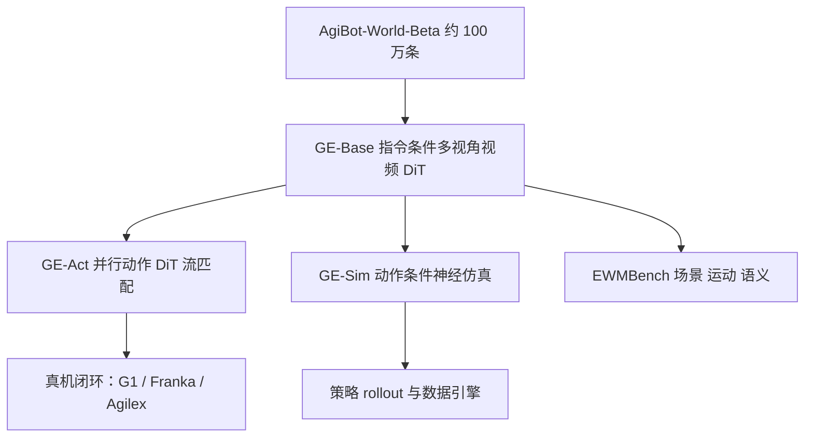

# Genie Envisioner：把学控、仿真和评测收进同一条视频世界模型

<!-- release-date: 2025-08-07 -->

**本文依据**：`Genie Envisioner: A Unified World Foundation Platform for Robotic Manipulation`，arXiv `2508.05635v3`（封面印 `arXiv:2508.05635v3 [cs.RO] 4 Nov 2025`，26 页）。作者 Yue Liao、Pengfei Zhou、Siyuan Huang、Donglin Yang、Shengcong Chen、Yuxin Jiang、Yue Hu、Jingbin Cai、Si Liu、Jianlan Luo、Liliang Chen、Shuicheng Yan、Maoqing Yao、Guanghui Ren；前三名共同一作，通讯 Shuicheng Yan、Maoqing Yao、Guanghui Ren。封面机构 **AgiBot Genie Team**、LV-NUS Lab、BUAA。无会议名。项目页印 `https://genie-envisioner.github.io`（PDF p.1）。文中数字标 `(PDF p. N)`。

## 一句话

主流 VLA 把画面压进语言空间再出控；采集、训练、评测还各搭一套。Genie Envisioner（GE）把这三件事收进同一套指令条件视频生成：GE-Base 学「下一小段操作长什么样」，GE-Act 从同一套潜空间用轻量流匹配出轨迹，GE-Sim 把动作当条件当神经仿真器，EWMBench 再按场景、运动、语义打分（PDF p.1–3 图 1）。预训练用 AgiBot-World-Beta 约 100 万条、2967 小时真机双臂数据（PDF p.5）。域内 AgiBot G1 上，54 步力矩轨迹在消费级 GPU 上 200 ms 内出完；换体到 Dual Franka 和 Agilex Cobot Magic 只需约 1 小时遥操作（PDF p.3）。

## 主矛盾：流水线碎了，表征还站在语言这边

操作策略要过采集、训练、评测三道门。现有系统每道门各有基建、各要调参，失败模式被挡在缝里，规模化复现也慢（PDF p.1）。

第二条裂缝在表征。OpenVLA、$\pi_0$ 一类 VLA 先用视觉–语言模型把画面映到语义语言空间，再在那个空间上学动作。语言空间擅长指令，却容易丢掉空间布局和时序细节（PDF p.3）。视频世界模型能画未来，但多数停在合成，接不上闭环控（PDF p.22）。

GE 的选择是反过来：先用多视角视频扩散在视觉空间里建模「指令下场景会怎么走」，再从同一套潜特征分出动作头和动作条件仿真。学控、仿真、评测共用一条生成骨架，而不是三套互不相认的模块（PDF p.1–3）。

（机制示意，根据 PDF p.2 图 1。）

## GE-Base：按视频块自回归，再加稀疏记忆

操作数据是序列。GE-Base 把输出切成每块 $N$ 帧的视频块。第 $t$ 步世界模型 $W$ 生成下一块 $x_{1:N}^{(t)}$，条件是初始观测 $x_0$、语言指令 $q$，以及从历史里稀疏抽样的记忆 $\hat{x}_{0:t-1}$（PDF p.4）：

$$x_{1:N}^{(t)}=W(\hat{x}_{0:t-1},x_0,q)$$

记忆不靠最近几帧硬撑长程，是把长历史抽稀后并进视觉条件。训练时记忆帧从更早历史随机抽，故意加难；推理时按固定间隔均匀抽，求稳（PDF p.5、p.7）。

骨干可接不同视频 DiT。正文用两条 2B 基座：LTX-Video 更轻、给下游出动作；COSMOS2 画质更高、给仿真（PDF p.5）。双臂自我中心感知用三路同步相机：头（$v^h$）加左右腕（$v^l,v^r$）。共享视频编码器 $E$ 出各视角 token，每路再配一份噪声图 $z^{(i)}$，加上 2D 旋转位置编码 $e_{\mathrm{pos}}$ 和视角可学习嵌入 $e_{\mathrm{view}}$，再拼时间步编码 $e_t$ 进 DiT（PDF p.5 图 3）。

跨视角不能每层都做满。隐状态先看成 $(B,N,T,H,W,C)$，把普通空间自注意力扩成跨视角自注意力；只在部分块里插跨视角，其余块把 $N$ 折进 batch，变成 $(B\cdot N,T,H,W,C)$。指令走冻结的 T5-XXL，用交叉注意力灌进视觉 token（PDF p.5）。

这是可迁移的效率切口：多相机一致性不必每层全连接，稀疏插几层跨视角，剩下按单视角算。

## 预训练两段：先扛住帧率乱，再对齐控的时间粒度

数据是 AgiBot-World-Beta：约 100 万条高质量真机双臂遥操作，合计 2967 小时，带自然语言指令、多视角画面和结构化动作（PDF p.5）。三路标定相机抽同步视频，做成文本–视频对。视频编码器和解码器全程冻结，只训生成通路（PDF p.6 图 4）。

**第一段 GE-Base-MR（多分辨率适应）**。57 帧片段，采样率在 3 Hz 到 30 Hz 之间随机；另加 4 帧稀疏记忆。VAE 压成 8 帧潜空间再去噪。目的是让运动快慢和掉帧别把表征打散。32 张 NVIDIA A100，大约 7 天（PDF p.6）。

**第二段 GE-Base-LF（低频对齐）**。固定 5 Hz 抽 9 帧，再加 4 帧记忆，压成 2 个潜帧。时间粒度和后面的动作头对齐，方便按离散动作步给视频反馈。同样 32 张 A100，大约 3 天（PDF p.6）。

生成时按块自回归，直到指令对应的操作走完。图 5 是 AgiBot G1 上取奶、装袋一类任务的三视角样例；定量对比放到第 6 节 EWMBench（PDF p.7）。

## GE-Act：不在部署时画视频，只在潜空间出控

视频世界模型会画，但不等于能拧关节。GE-Act 是插在 LTX-Video 版 GE-Base 上的即插即用动作模块：约 1.6 亿参数的自回归动作解码器，把多视角潜特征加成指令，映射成有时序结构的动作，部署时不必显式出视频（PDF p.8）。

结构跟视觉骨干对齐：DiT 块深度相同，隐维缩小。第 $i$ 个视觉块：

$$v_i=B_i^{\mathrm{vis}}(v_{\mathrm{in}},T(q))$$

动作路从噪声动作 token $z_{\mathrm{act}}$ 出发，用交叉注意力读 $v_i$（PDF p.8）：

$$a_i=B_i^{\mathrm{act}}(z_{\mathrm{act}},\mathrm{CrossAttn}(z_{\mathrm{act}},v_i))$$

最后用基于去噪的流匹配，把噪声动作收成连贯轨迹（PDF p.8 图 6）。

### 训练：先冻结世界模型学动作，再分两段贴任务

图 7 画了三段，正文把后两段叫任务适应（PDF p.9）。

1. **动作预训练**。世界模型 $W$ 用冻结的 GE-Base-LF；只更新动作解码。关掉视频生成。条件是 5 Hz 的 4 帧视觉记忆，预测 30 Hz、54 步高频动作，损失只看真值轨迹。16 张 A100，大约 3 天（PDF p.9）。
2. **任务视频适应**。只更新视频生成部分。全量 AgiBot-World 加任务子集，任务子集权重乘 10。8 张 A100，大约 12 小时（PDF p.9）。
3. **任务动作特化**。骨干和动作头一起，只在任务数据上微调。正文写 8 张 A100 大约 36 小时；图 7 标注是 `24 hours x 8 x GPU`。两处不一致，以正文 36 小时和示意图 24 小时并存，不要合成一个数（PDF p.9 图 7）。

换体时动作头不复用。新平台动作语义对不上，第二段从零训新的动作 DiT，视觉骨干留下；CLIP 与视频编码器冻结（PDF p.13）。注意：主骨干指令编码器是 T5-XXL，这里冻结的 CLIP 是适应流程里点名的语义先验，不要和 T5 混成同一个模块。

### 慢快异步：视频去一次噪，动作连去五次

视觉 5 Hz、动作 30 Hz，时间分辨率 1 对 6。视频 DiT 每次前向只做一步流匹配去噪，潜特征缓存；动作模型对同一份缓存连做五步去噪。54 步前向在机载 NVIDIA RTX 4090 上 200 ms 内完成（PDF p.10）。训练时隐状态甚至可用高斯噪声初始化，躲开视频编解码瓶颈——这是工程声明，不是单独消融表（PDF p.10）。

快模式在传送带抓移动袋这类短时延任务上，正文说明显好过同步标准模式。图 8 是柱状对照，抽取文本没有刻度，本文不填成功率数字（PDF p.10–11）。

## 域内实验：五个任务，两种成功率

AgiBot G1 上五件事（PDF p.10）：

- 做三明治：面包、培根、生菜再盖面包
- 倒茶：抓壶、倒、放回
- 擦桌子：抓抹布连续擦
- 微波炉加热：开门、放碗、按键
- 传送带装洗衣液：抓移动袋装箱

指标两个。逐步成功率（SR）：子步骤成功数除以总子步。端到端（E2E）：只看整任务最终是否完成，中间允许重试（PDF p.11）。对照 UniVLA 和 GR00T N1，同一平台、同一套任务遥操作微调。正文结论是 GE-Act 在 SR 和 E2E 上整体更高；图 8 无表，不抄柱高（PDF p.11）。

### 表 1：没有域内世界模型预训练，几乎学不会放杯子

固定任务：桌上抓红圆柱放进纸杯，位置固定，305 条示范，一律 4 万步。`VidAW` 表示从 GE-Base 初始化，`VidAda` 表示任务视频适应，`S` 表示是否喂机器人状态（PDF p.12 表 1）：

| VidAW | VidAda | E2E 有状态 | E2E 无状态 | SR 有状态 | SR 无状态 |
|---|---|---:|---:|---:|---:|
| 否 | 否 | 0.15 | 0.30 | 0.05 | 0.11 |
| 否 | 是 | 0 | 0.05 | 0 | 0 |
| 是 | 否 | 0.81 | 0.49 | 0.64 | 0.26 |
| 是 | 是 | 0.89 | 0.37 | 0.76 | 0.37 |

从零训或只从通用 LTX-Video 适应，成功率接近 0。有域内预训练后，有状态设定 SR 0.64、E2E 0.81；再加视频适应到 0.76 和 0.89。状态接到通用视频预训练上会掉点，作者写成捷径学习（PDF p.12）。注意：摘要式「64 SR 和 81 E2E」与表中小数是同一组，百分比写法来自正文叙述。

## 换体：一小时遥操作，动作头重训

预训练动作空间绑在 AgiBot 上，不能零样本丢到新机。协议是少样本适应：每任务收少量高质量遥操作，微视频 DiT，动作 DiT 从零训（PDF p.12–13）。

**Agilex Cobot Magic**。折盒子、折衣服，各 250 条，约 1 小时，Aloha 遥操作。对照 GR00T N1、$\pi_0$、UniVLA，同一数据微调。正文写 UniVLA 和 GR00T 在精细变形任务上成功率为 0%，人工介入才能走几步；$\pi_0$ 好于前两者，GE-Act 再明显高于 $\pi_0$。图 11 仍是柱图，无表内数字（PDF p.13）。图 2 还展示包装规则：黄糖用蓝章、白糖用红章，先叠可变形盒、放糖、封盖，物体不可见后再靠记忆盖章（PDF p.3）。

**Dual Franka**。折衣服，同样 250 条约 1 小时；没有专用遥操作接口，用空间鼠标采。正文强调 $\pi_0$ 和 GR00T 在 Franka 上有过大规模训练，GE-Act 仍用一小时适应数据在真机执行上更好——依据仍是图 11，不是表（PDF p.14）。

**RoboTwin 仿真**。四任务 jointly 微调，共 200 条（每任务 50），一个模型打全部；基线是一任务一模型。正文：四任务里三个好于 $\pi_0$ 和 GO-1，抬锅略落后，作者猜联合训练有任务干扰（PDF p.14）。

换体最可迁移的不是「世界模型万能」，而是：**视觉先验可迁，动作头按本体重做。** 少样本预算花在新动作接口上，比硬搬旧解码器更诚实。

## GE-Sim：把低维动作写进视频 token

仿真要的是「给定动作，下一帧像真的」。GE-Sim 把 GE-Base 改成动作条件生成。快仿真用 LTX 变体，高保真用 COSMOS2。另加冻结 CLIP 图像编码器把参考图当风格锚，经交叉注意力进每个 DiT 块（PDF p.15）。

单臂一步 7 维 $[x,y,z,\mathrm{roll},\mathrm{pitch},\mathrm{yaw},o]$，双臂拼成 14 维；水平 $K$ 步则 $A\in\mathbb{R}^{K\times 14}$（PDF p.15）。分层条件两路：

**Pose2Image**。末端位置用标定内外参投到像素；姿态转成旋转矩阵，轴也投到图像上指示方向；夹爪开合画在单位圆上，浅开深闭；左右臂颜色不同，得到与画面对齐的姿态图 $P_i$。和历史帧 $I_i$ 共用编码器后逐元素相加（PDF p.16 式 1）：

$$v_i=E(I_i)+E(P_i)$$

**运动向量**。相邻 6-DoF 姿态差 $\Delta a_i=a_i-a_{i-1}$，可学习编码器成运动 token，与参考图风格 token 拼接，交叉注意力进 DiT（PDF p.16 式 2）。

训练从高时间分辨率的 GE-Base-MR 初始化，全量 AgiBot-World-Beta，动作用真值轨迹。为了鲁棒，掺了失败、做不完、次优轨迹（人遥操作和真机部署都有）。VAE 和 CLIP 冻结，其余用视频表示上的流匹配损失（PDF p.16）。

闭环：策略看指令和初值出轨迹 → GE-Sim 生成视频块 → 视频加原指令再进策略，直到指令结束。同一条动作换不同初始画面，还能当数据引擎。正文写分布式集群并行可达每小时数千条 episode；没有给出单卡吞吐表（PDF p.3、p.17）。

图 16 定性：同样动作条件，COSMOS2 变体比 LTX 变体更稳、更像。表 2 是定量（PDF p.21）：

| 模型 | BLEU | CLIP | DYN | Div. | PSNR | SA | Log. | TA | Scn. |
|---|---:|---:|---:|---:|---:|---:|---:|---:|---:|
| LTX | 0.33 | 90.8 | 0.78 | 0.011 | 19.9 | 0.94 | 0.97 | 0.98 | 0.90 |
| COSMOS | 0.31 | 90.2 | 0.85 | 0.010 | 20.7 | 0.87 | 0.97 | 0.97 | 0.91 |

总分接近时，COSMOS 动态一致性（DYN）和 PSNR 更高，LTX 的空间对齐（SA）更高。固定动作下多样性 Div. 都很低（0.010–0.011），作者当成动作–视频对应紧、不是缺点（PDF p.21）。

## EWMBench：别用通用视频榜代替操作世界模型

操作视频的约束更死：背景、物体摆放、本体形态应尽量不变，变的是姿态和接触，而且还得跟指令走。通用 FVD、VBench 对人爱看的视频友好，对「控得对不对」不准（PDF p.18、p.22）。

数据集从 AgiBot-World-Beta 测试集挑 10 个家务/工业任务，与 100 万级预训练任务不相交。每任务拆 4–10 个原子子动作并写步骤说明；每任务均匀抽 100 条。为拉开轨迹多样性，双臂末端轨迹体素化，用 3D IoU 做相似度，贪心挑重叠最少的（PDF p.19）。

指标三层（PDF p.19–20）：

- **场景一致性**：在操作数据上微调 DINOv2，对连续帧和首帧做 patch 余弦相似。
- **动作轨迹**：人工标参考轨迹；训练末端检测器从生成视频重建。空间对齐 $SA=1/(d_{\mathrm{symH}}(G,P)+\epsilon)$，每指令生成 3 条视频，取对称 Hausdorff 最小的再往下评。时间对齐 $TA=1/(d_{\mathrm{NDTW}}+\epsilon)$。动态一致性 DYN 用速度、加速度的 Wasserstein 距离，并用幅度比归一化，$\epsilon=10^{-8}$，$\alpha=0.007$，$\beta=0.003$。
- **运动语义**：Qwen2.5-VL-7B-Instruct 做全局摘要对指令的 BLEU、逐步描述的 CLIP 相似；GPT 先列幻觉、物体消失、物理荒谬等逻辑错误类型，再用视频 VLM 检测并罚分。多样性定义为 $1-$ 同指令生成视频的全局 CLIP 相似。

指令条件生成的聚合分（PDF p.20 图 17b）：

| 模型 | Scene | Motion | Semantics | Score |
|---|---:|---:|---:|---:|
| GE-Base | 0.9427 | 1.6676 | 2.0907 | 4.7010 |
| Kling | 0.8888 | 0.9440 | 2.0370 | 3.8698 |
| Hailuo | 0.8577 | 0.5362 | 2.0186 | 3.4125 |
| COSMOS | 0.7963 | 0.7085 | 1.7824 | 3.2872 |
| OpenSora | 0.9210 | 0.3442 | 1.8739 | 3.1392 |
| LTX | 0.9156 | 0.4002 | 1.6518 | 2.9676 |

GE-Base 总分最高，拉开最大的是 Motion（1.6676 对 Kling 的 0.9440）。语义分和通用模型接近（2.0907 对 Kling 2.0370），作者自己说运动语义并不碾压，强的是控相关的时间对齐和动态一致性。GE-Base 建在 LTX 上，而裸 LTX 总分最低（2.9676），这条对照用来说明域内预训练，而不是骨架天生更强（PDF p.20–21）。

图 18 把人排、VBench 排、EWMBench 排放在一起：四人模型是 GE-Base、Kling-1.6、Hailuo I2V-01-live、OpenSora-2.0。正文说 EWMBench 与人排更一致，VBench 在需要本体一致和目标推理时会偏。图里没有印出排序表，本文不编名次数字（PDF p.21）。

## 限制：单平台数据，上半身平行夹爪，代理指标

作者列三条（PDF p.23）：

- 预训练只用 AgiBot-World-Beta 单一真机平台，没有互联网规模或仿真数据。
- 范围停在上半身桌面、平行夹爪，没有灵巧手和全身移动。
- EWMBench 仍是代理指标加部分人评，多样失败模式和含糊语义下的自动任务成功判定仍开放。

代码、模型和完整榜「发表后开源」是承诺，本文不把它写成已经可下载（PDF p.1、p.4）。致谢点名前作 EnerVerse、EnerVerse-AC、EWMBENCH（PDF p.23）。

## 可迁移的几刀

- **先视觉空间、后动作头**。指令条件视频如果真能保住布局和接触，动作解码可以做得很轻；表 1 说明没有这套域内先验，305 条示范也几乎学不会放杯子。
- **视频低频、动作高频**。5 Hz 视觉潜变量缓存，30 Hz 动作连去噪，是把两种时间尺度拆开，而不是让视频模型跟关节同频。
- **换体时重训动作、冻结视觉**。一小时预算给新本体接口，比假装动作空间已经对齐更稳。
- **动作条件仿真要失败数据**。只喂成功轨迹，仿真器会变成成功演示回放。
- **评世界模型别只看 FVD**。场景不变、轨迹对、指令逻辑对，才是操作域的三轴；通用视频榜可以跟人爱看的东西对齐，却对不齐「能不能拿来评策略」。

## 关键词回看

- **世界基础模型（world foundation model）**：这里特指指令条件、多视角、分块自回归的视频扩散，不是游戏里的潜动力学 RSSM。
- **稀疏记忆（sparse memory）**：从长历史抽少量帧并进当前视觉条件。
- **流匹配动作头（flow-matching action decoder）**：在噪声动作上做去噪流，把潜视觉映射成 54 步轨迹。
- **Pose2Image**：把 6-DoF 加夹爪画成与画面对齐的姿态图，再和观测潜变量相加。
- **EWMBench**：按场景一致性、轨迹质量、运动语义评操作视频世界模型的套件。

## 参考资料

- 原件：`readings/_src/世界模型与 Agent/Genie-Envisioner.pdf`
- 项目页（封面）：https://genie-envisioner.github.io
- 数据集前作 AgiBot World Colosseo：arXiv `2503.06669`
- 评测前作 EWMBench：arXiv `2505.09694`
