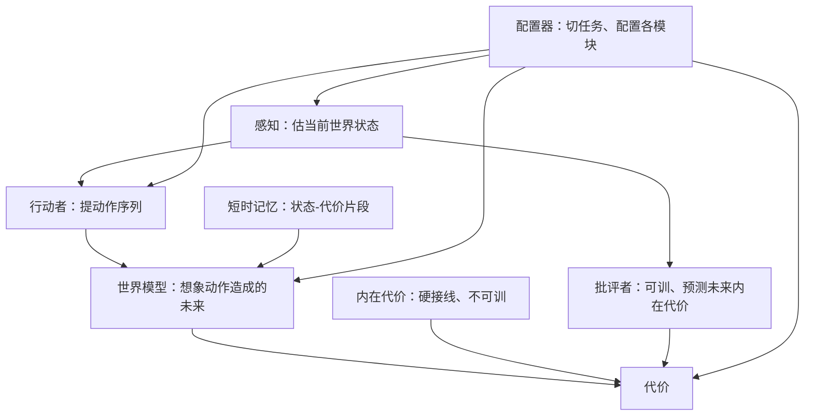

# 潜变量能量模型讲义：从当前机器学习的缺口走到 H-JEPA

<!-- release-date: 2023-06-05 -->

**本文依据**：`Introduction to Latent Variable Energy-Based Models: A Path Towards Autonomous Machine Intelligence`，arXiv `2306.02572v1`（5 Jun 2023，29 页）。作者 Anna Dawid、Yann LeCun；第一作者第一单位 ICFO - Institut de Ciències Fotòniques, The Barcelona Institute of Science and Technology（封面还列 University of Warsaw Faculty of Physics、NYU Courant Institute、Meta FAIR）。封面印 **Les Houches Summer School Lecture Notes 2022**、Preprint，日期 June 6, 2023。内容跟 LeCun 2022 年 7 月在 École de Physique des Houches「统计物理与机器学习」暑期学校的系列课（组织者 Florent Krzakala、Lenka Zdeborová）。首发日取 arXiv v1 提交日 2023-06-05。这是讲义笔记，用来讲清能量模型、潜变量与层次联合嵌入预测架构（H-JEPA），不是 2022 年 OpenReview 立场文本身的复述。文中数字标 `(PDF p. N)`，页码是这份 PDF 文件页。标「外部补充」的段落不来自本文。

## 一句话

监督学习和强化学习能把围棋、翻译、蛋白质折叠做到专家级，但样本和试错贵到不像人：婴儿几个月就有直觉物理，机器人强化学习要模拟交互好几年（PDF p.2）。这篇讲义把缺口收成三件事——学世界模型、把推理做成能量最小化、把复杂计划做成层次分解——再主张：高维连续世界里别硬归一化概率，改用能量模型（EBM）；不确定性和结构用潜变量；预测不要在像素上对平均值，而要在表示空间里对，并且用正则而不是对比样本去塑能量面。积木叫联合嵌入预测架构（JEPA），叠起来叫 H-JEPA（PDF p.1、p.8、p.20–23）。

## 读前最小地图

- **能量（energy）**：给一对变量打一个标量分。兼容的配对低，不兼容的高。推理是找让能量最低的答案，不是先归一化成概率。
- **能量函数 vs 训练损失**：能量只用于推理。训练另有损失，用来把观测到的配置压低、把没见过的抬高（PDF p.9）。
- **潜变量（latent variable）**：输入里没直接给、但对预测有用的隐藏因素（姿态、光照、别的司机怎么开）。推理时对它再最小化或边缘化（PDF p.11）。
- **坍缩（collapse）**：能量面变平，所有答案差不多低。能给出多峰预测的模型都容易这样（PDF p.13）。
- **对比 vs 正则**：对比把训练集外的假样本能量拉高，维数一高就指数贵；正则限制低能区域能占多大体积（PDF p.14–16）。
- **JEPA / H-JEPA**：两边各编一个表示，在表示空间里预测，中间用潜变量补缺信息；多层叠起来，底层管短时细预测，高层管长时粗预测（PDF p.20–22）。

## 一、矛盾：成绩单漂亮，常识还没装上

过去十年深度学习靠 GPU 矩阵乘把卷积、全连接和 Transformer 训到很大（PDF p.3）。讲义先列成绩，再翻缺口，避免一上来就骂「现在的系统不行」。

**已经能落地的**（PDF p.3–4）：

- 辅助驾驶：自动紧急制动、自适应巡航、车道保持等；欧洲 2022 年 7 月起部分 ADAS 在新车上强制。市场以 Mobileye EyeQ 为代表。限定城区的无人出租车：旧金山 Cruise、凤凰城 Waymo、北京百度。
- 翻译与可及性：NLLB 在 **202** 种语言之间翻译，先编成与语言无关的表示再解码，不必为每对语言单独监督（PDF p.3）。DALL-E、Make-A-Scene 把文字或草图变成图；Wav2Vec、XLSR 把音频变成可转写表示。
- 内容安全：Facebook 仇恨内容在用户看到之前被撤下的比例，2018 年大约 **40%**，2022 年 1–3 月报 **95.6%**，作者把它归到 NLP、自监督、Transformer，外加对黑名单内容的近邻检索（PDF p.3–4）。
- 视觉：语义分割给每个像素类别，实例分割把重叠形状拆成不同物体；例子是 Detectron 2（PDF p.4）。
- 医学：fastMRI 用物理知情的卷积–反卷积网络（常称 U-Net）利用动量空间冗余欠采样，采集大约快 **4** 倍，Siemens、Phillips、General Electrics 往新机器里集成（厂名按原文拼写）；下一步想跳过给人看的二维切片，从 k 空间直接到诊断（PDF p.4）。
- 生物医学与科学：AlphaFold、RoseTTA Fold 从氨基酸序列预测三维结构；粒子物理、流体与大气 PDE、宇宙模拟、量子态表示、催化剂设计也在用深度学习（PDF p.4）。

**缺口**更具体（PDF p.4–5）：

自动驾驶只在高精地图、多传感器、好天气、宽路上像样，离 SAE Level 5（任意环境、无需人类注意、没有方向盘和踏板）还远。人大约二十小时能学会开车，现有模型要成千上万小时录像。虚拟助理要懂意图、实时语音、增强现实叠加；家用机器人要高层环境理解。这些都需要近人水平的智能。

作者把缺的那一块叫常识：用世界模型补上知觉和记忆里没有的信息，例如预测未来（PDF p.5）。现有系统主要靠监督学习（大量标注）和强化学习（海量试错）。游戏可以并行重打；真实世界每一步都费时间、有代价，开车甚至能死人。系统还专、脆，输入到输出步数基本固定，不会推理和规划。大语言模型有时像在推理，但知识几乎全来自文字，覆盖不了人和动物能做的物理实验，也缺幼年最主要的视觉输入（PDF p.5）。

对照：婴儿几乎全靠观察。大约 **2–6** 个月有客体永久性、固体、刚性；大约第十个月开始懂重力、惯性、动量守恒；大约第十二个月出现理性、目标导向动作（PDF p.5）。学习形态最像自监督，只有少量监督（和父母互动）和少量强化（真去试）。人大多在脑子里想象后果，而不是穷举。人有身体、物理、社交的动力学模型，能做不限步数的推理链，把复杂任务拆成子任务。世界模型一旦成型，新任务学得很快。

于是三条挑战（PDF p.5–6）：

1. **学表示和可预测的世界模型**，好预测未来、尤其是自己动作的后果，从而规划和控结果；表示应对任务无关。最可能的路是自监督，因为监督和强化样本太贵。
2. **学一种能和深度学习兼容的推理**。类比 Kahneman 的 System 2：带意图，不像前馈潜意识（System 1）。逻辑推理不可微，难和深度网络接。可能做法：把推理和规划做成能量最小化。
3. **学规划复杂动作序列**，需要动作计划的层次表示。

脚注提醒：Marcus 等人主张把逻辑推理塞进 AI，但不可微，难和深度学习拼（PDF p.5）。

## 二、全景：可微的感知–规划–行动环

LeCun 2022 立场文里的模块结构，本讲义用图 1 概述，细节指向原文（PDF p.6）。

（机制示意，根据 PDF p.6 图 1。）

感知估当前状态；行动者在世界模型指导下提动作；世界模型按想象动作预测未来。这叫感知–规划–行动环。代价拆成两块：内在代价硬接线，建模痛、快感、饿；批评者可训，预测未来内在代价，并受感知影响——作者把批评者的变化理解成文化、规范、他人的外部影响。短时记忆存状态–代价片段，给世界模型用。总任务是采取让代价最小的动作，更好是让未来期望代价最小。配置器负责切任务。对现代工具友好的一点：模块全部可微（PDF p.6–7）。

这个环像最优控制里的模型预测控制（MPC），关键差别是这里的世界模型是学来的。也不同于强化学习：代价函数已知、模块可微，不必真去执行动作才能预测未来代价（PDF p.7）。

世界模型主要靠自监督训。图 2：从可见部分预测被藏起来的部分。信息量比喻：自监督是蛋糕（每个样本数百万比特），监督是糖霜（每样本 **10–10,000** 比特），强化是樱桃（部分样本只有几比特）（PDF p.7）。自监督已经常当前置，再接监督或强化；也用于 MPC 的前向模型和基于模型的强化策略。

**图像上的坑。** 自监督对文本很顺。图像若只允许一个预测，训练会去拟合所有可能的平均，结果糊。现实有随机、知觉有限，不可能预测每个细节；做决定通常也不需要全部细节，只要任务相关的那些（PDF p.7）。

因此自监督面对未来系统有两道题（PDF p.8）：

1. 在预测里表示不确定性；
2. 同一输入允许多个同样合理的预测，也就是多峰。

概率模型在连续高维上不可处理：不知道怎么正确表示归一化的连续分布。下一个词还可以对词典做分布；下一帧视频或接下来一百个词，对「所有可能」建分布就不现实。作者主张在这种设定里放弃「对预测表示概率分布」（PDF p.8）。

替代方案：能量模型加潜变量处理不确定性和任务相关的信息冗余，再加层次结构做复杂规划，合称 H-JEPA（PDF p.8）。

## 三、能量模型：决策只要对的那个最低

决策（例如开车）只要选对答案。其他答案的概率只要更低就行，精确数值无关（PDF p.8）。于是不预测「唯一最可能事件」，而用标量能量 $F(x,y)$ 刻画条件 $x$ 和决策 $y$ 的依赖。训好的模型给正确配对最低能量，错误的更高。

正式说法（PDF p.9）：EBM 给每组变量配置一个标量能量。兼容配对（下雪时开慢）低能，不兼容高能。推理是

$$\check{y}=\arg\min_y F_w(x,y)$$

图 3(b) 用 $y=x^2$ 当例子：给定 $x$ 找能量最低的 $y$。优点：可以表示一对多的多峰依赖；原则上也能接不同模态。若 $y$ 连续且 $F$ 光滑可微，推理可以用基于梯度的算法。图 3 还强调：只看训练集，能量函数并不唯一（PDF p.9）。

**能量不是训练目标。** 训练用另一套损失，让观测配置比未观测配置能量更低（PDF p.9）。

相对概率模型（PDF p.10）：概率训练最大化似然，损失被钉在负对数似然一类（交叉熵）。换别的损失，和概率的弱联系也断了。EBM 没有立刻的概率解释，训练目标和相似度/打分函数都更自由。

下棋是经典对照：穷举所有走法和后果不可行，只对一部分可能性树打分（蒙特卡洛树搜索、图上最短路），最终要的是最小能量（对自己最小、对对手最大），分数不必归一化。归一化反而会踩标签偏置：离开某状态的转移概率只在该状态内归一，而不是全局（PDF p.10）。

放弃概率也有代价（PDF p.10）：

- 能量设定里不好谈不确定性；
- 能量未校准，单位任意，两套分开训的 EBM 不好拼。要避开，就设计成组件之间不必互传输出。

若一定要接回概率，把能量看成未归一的负对数概率，用 Gibbs–Boltzmann：

$$P(y\mid x)=\frac{\exp[-\beta F(x,y)]}{\int dy'\,\exp[-\beta F(x,y')]}$$

分母是配分函数，$\beta$ 像逆温度。高维连续里算配分函数极难，所以概率模型在那里不可处理（PDF p.10）。附录 A 把离散/连续 Gibbs、联合、条件、边缘分布写全，并指出边缘化等于把能量换成自由能 $F_w(x,y)=-\frac{1}{\beta}\log\int_z\exp[-\beta E_w(x,y,z)]$（PDF p.25）。

脚注还警告：纯最大似然会把每个数据点推到无穷概率、别处精确为零，这种模型不能推理；贝叶斯先验通过正则躲开（PDF p.10）。

## 四、潜变量：把没看见的因素显式化

再加一组隐藏变量 $z$，正确值从不或很少直接给。它要抓住 $y$ 里 $x$ 没现成提供的信息。人脸识别可以是性别、朝向、瞳色发色；物体/场景可以是位姿、光照、分割、标签；语音标注是句法切分和句法树；语音识别是音素切分；手写识别是把一行切成字（PDF p.11 表 1）。自动驾驶里，$z$ 可以参数化其他司机的可能行为，用来处理真实不确定性。

**结构化预测**：数据有未知结构，学习者必须先解开结构才能准预测。目标检测要恢复分割图再对子结构分别预测；语音识别缺的是把音频切成词；手写缺的是把词切成字母。这些分割图天然适合当潜变量（PDF p.11）。

推理时对 $z$ 最小化或边缘化：

$$F_w(x,y)=\arg\min_z E_w(x,y,z)$$

或

$$F_w(x,y)=-\frac{1}{\beta}\log\int dz'\,\exp[-\beta E_w(x,y,z')]$$

然后 $\check{y}=\arg\min_y F_w(x,y)$（PDF p.11）。脚注：边缘化就是统计物理里系综的自由能，高维太贵，实践常换成更便宜的最小化。

教学例子：参数 $w=\{r_1,r_2\}$ 在数据流形上学到椭圆，潜变量编码角度（PDF p.11–12 图 4）：

$$E_{r_1,r_2}(y,z)=(y_1-r_1\sin z)^2+(y_2-r_2\cos z)^2$$

$F=\arg\min_z E$ 就是点 $y$ 到椭圆的平方距离。若改边缘化，则 $z$ 从 $0$ 到 $2\pi$ 上每一点都贡献，最近的点贡献最大。

潜变量模型由确定性函数组成，但整体非确定性，因为 $z$ 在模型外决定。从分布里抽 $z$ 会得到预测分布（模型变概率）；从有限集合里选只得到一组预测（只是非确定性）。于是可以多预测，而不是一个。$z$ 可以当开关或调制器。理想情况它表示预测变化的独立解释因子。容量必须压住，否则训练会把预测需要的信息全塞进 $z$（PDF p.12）。

## 五、怎么训：先防坍缩，再选对比还是正则

基本 EBM 推理 $\arg\min_y F(x,y)$；潜变量版对 $y,z$ 一起最小化。训练原则：把可能/兼容的点雕成低能，把不像的点抬高。两条路：对比；正则与架构约束。选哪条取决于架构（PDF p.12）。

图 5 两种结构（PDF p.13）：

- **确定性回归**：能量是网络对 $x$ 的预测 $\hat{y}$ 与 $y$ 的距离。这种对坍缩免疫，但不能扩成多峰或非确定性。只需压低训练点能量。
- **联合嵌入**：两个编码器分别出 $\mathrm{Enc}_x(x)$、$\mathrm{Enc}_y(y)$，目标是表示靠近。若只最小化两端距离，编码器会忽略输入、输出同一个常数。

还会坍缩的：图 4(b) 那种潜变量生成结构，若只最小化 $y$ 与「依赖 $z$ 的预测」的距离，可以完全不理 $x$，找一个 $z$ 让预测等于 $y$。自编码器若只最小化重构误差，可以学成恒等映射，没见过的输入能量也是零（PDF p.13）。结论：凡能对单输入给出多预测的模型，都容易坍缩。防法：约束能量面，数据点低能，高密度区之外要更高（PDF p.13）。

图 6：正确训练一边压训练点，一边防坍缩；对比用训练集外样本往上拉；正则限制低能区域体积（PDF p.14）。

### 对比：什么架构都能用，维数一高就崩

对比：压低训练点，抬高特意造的对比点。对任意架构可用，但随数据维数扩展很差（PDF p.14）。成对铰链损失：

$$L_{\mathrm{hinge}}(x,y,\hat{y},w)=\bigl[F_w(x,y)-F_w(x,\hat{y})+m(y,\hat{y})\bigr]_+$$

$x,y$ 要压低，$\hat{y}$ 要抬高。最小化时训练点能量至少比对比点低一个与距离有关的间隔 $m$。间隔必须非零，否则仍会坍缩。也可以用一组点而不是一对，例如 InfoNCE（PDF p.14）。

对比点怎么来（PDF p.14–15）：离散或可处理空间可以穷举；否则蒙特卡洛或其近似；找模型错给低能的「最冒犯」预测；孪生网络那类联合嵌入用兼容/不兼容对（同一物体不同视角 vs 不同物体）；扭曲或损坏原数据（去噪自编码器）；生成对抗网络：生成器造低能假样本，判别器给它们高能。更全的清单指向 LeCun 2006 教程 2.2 节和立场文附录 8.3.3。

**对比样本的需求是维数灾难的源头，甚至指数变差。** 真实数据极高维，作者认为对比法不太可能通向未来的自主智能（PDF p.15）。

最大似然是对比的特例。用 Gibbs 把 EBM 换成概率后，负对数似然（再除以 $1/\beta$）是（PDF p.15）：

$$L_{\mathrm{NLL}}(x,y,w)=F_w(x,y)+\frac{1}{\beta}\log\int dy'\,\exp[-\beta F_w(x,y')]$$

第一项压训练点；第二项抬高整个空间（含训练点）。第一项梯度可反传；第二项梯度是

$$\frac{\partial}{\partial w}\Bigl(\frac{1}{\beta}\log\int dy'\,\exp[-\beta F_w(x,y')]\Bigr)=-\int dy'\,P_w(y'\mid x)\frac{\partial F_w(x,y')}{\partial w}$$

可用 $P_w(y'\mid x)$ 的蒙特卡洛样本近似，不必显式算分布。于是 NLL = 压低训练点 + 抬高蒙特卡洛点，仍是对比法（PDF p.15）。

最大似然还想把流形上和紧邻外侧的能量差拉到无穷，流形变成无穷深、无穷窄的峡谷，必须再正则（贝叶斯先验或限制参数）。对比扩展差，再加上这条，作者认为概率模型同样可能在通往自主智能的路上失败（PDF p.15）。

### 正则：限制低能体积，更像未来该用的

正则：压低输入能量时，必须抬高空间里别的部分，等于限制低能点能占的体积。相对对比更不容易吃维数灾难，作者觉得更有希望训未来的 EBM（PDF p.16）。

怎么限体积：

- 架构本身把低能体积封死：PCA（重构能力限于主分量）、k-means（离散表示）、高斯混合、流模型（硬编码归一化）。
- 加正则项，最小化某种低能体积度量。潜变量 EBM 可以限制 $z$ 的信息容量：离散、稀疏（稀疏自编码器）、随机（变分自编码器）、低维。
- score matching：在数据点附近最小化能量梯度、最大化曲率（PDF p.16）。

自编码任务 $x=y$，正则目标（PDF p.16）：

$$L_{\mathrm{reg}}(y,w)=D\bigl(y,\mathrm{Dec}(\mathrm{Enc}(y))\bigr)+R(\mathrm{Enc}(y))$$

许多约束拟合是它的特例：

1. PCA：$L=\|y-w^T w\|^2$，隐式正则来自 $w^T w$ 低秩。
2. 带瓶颈的自编码器：小瓶颈。
3. k-means：对离散的 $k$ 个均值最小化重构。
4. 高斯混合：正则来源类似 k-means。
5. 稀疏编码：$\min_z\|y-wz\|^2+\lambda\|z\|_1$。

卷积稀疏自编码器会学出和手工图像滤波器类似的特征（PDF p.16）。

另一条：把 $z$ 换成噪声随机变量 $z\sim q(z\mid y)$，最小化能量期望 $\langle F(y)\rangle_z=\int dz\,q(z\mid y)E(y,z)$，再用 $\mathrm{KL}(q(z\mid y)\|p(z))$ 量 $q$ 对 $y$ 的依赖，$p(z)$ 是 $E_y[q(z\mid y)]$。于是正则自编码可以读成：一边降期望能量，一边最大化熵（PDF p.17）。

## 六、三个历史例子：对照「对比有多贵」

### Hopfield（1982）

全连接循环、对称权重 $w_{ij}=w_{ji}$、二元激活 $y_i\in\{-1,1\}$（PDF p.17 图 7(a)）：

$$F_w(y)=-\sum_{ij} y_i w_{ij} y_j$$

推理反复更新 $y_i\leftarrow\mathrm{sign}(\sum_j \check{w}_{ij} y_j)$，收敛到能量局部极小。训练损失就是能量本身，Hebbian：$w_{ij}\leftarrow w_{ij}+y_i^{\mathrm{train}} y_j^{\mathrm{train}}$。没有对比项，会冒出虚假极小（不是训练数据塑出来的记忆），推理可能掉进去，所以实践不好用（PDF p.17）。

### Boltzmann 机（1983）

Hopfield 加上隐单元，也就是潜变量；第一次把「输入输出都观察不到的神经元」引进机器学习（PDF p.17–18）。能量含可见–可见、隐–隐、可见–隐三类连接；对隐单元边缘化得自由能。只留可见–隐连接就是受限玻尔兹曼机（PDF p.18 图 7(c)）。损失带对比项：

$$L_{\mathrm{Boltzmann}}(y,w)=F_w(y)+\log\sum_{y'}\exp[F_w(y')]$$

对比样本用马尔可夫链蒙特卡洛。梯度要分别从 $P(z'\mid y)$（$y$ 固定）和联合 $P(y',z')$ 采样。一步可写成 $w_{ij}\leftarrow w_{ij}+(y_i z'_j-y''_i z''_j)$，正相减负相。采样成本大，真实应用少；脚注说在表示量子态等特定场合仍有人用（PDF p.18–19）。

### 去噪与掩码自编码器

去噪自编码器是对比 EBM：把损坏输入复原成干净版（PDF p.19 图 8）。螺旋加点噪声当 $x$，干净点当 $y$，最小化重构误差，输出被拉回螺旋。两臂之间、等距的点会难：模型只许一个输出。脚注：加潜变量可以解。作者认为这种折叠在真实数据里少见。

掩码自编码器是去噪的特例：藏一部分、预测被藏的。NLP 很成功（从「几乎从零开始的 NLP」到 BERT、RoBERTa、OPT），NLLB 也靠这类想法。NLLB-200 可在 **202** 种语言、**40,602** 个方向上翻译；训练集 **180 亿** 句对，但只覆盖 **2,440** 个语言方向；加更多语言，单语言表现还会升（PDF p.19）。连续域（图像）上掩码自编码器较差，因为填洞方式太多、模型只许出一个。结合 Transformer 的掩码自编码器（MAE）被当作有希望的方向。作者把多峰问题的解指向下一节的潜变量联合嵌入（PDF p.19–20）。

## 七、JEPA：在表示空间里预测，而不是在像素上平均

把 EBM、潜变量、正则训练合到一块，得到联合嵌入预测架构（PDF p.20 图 9）。

两条（一般不同、不共享参数的）编码器把 $x$、$y$ 编成 $s_x$、$s_y$。输入可以不同模态，例如视频和音频。能量是表示之间的距离。预测器 $\mathrm{Pred}_{w_3}$ 从 $s_x$ 预测 $s_y$，潜变量 $z$ 补上 $s_x$ 里没有、但预测 $s_y$ 需要的信息。编码器可以有不变性，把多个 $y$ 映到同一个 $s_y$；$z$ 也可以抓住另一类不变性。于是多峰不必在原始空间里对平均值。

训练目标不只是预测误差。对比在高维太贵，所以用带正则的损失（PDF p.21 图 10）：

- 最小化 $D(s_x,s_y)$；
- 最大化 $s_x$ 关于 $x$、$s_y$ 关于 $y$ 的信息量（否则编码器变常数，信息性坍缩）；
- 最小化或限制 $z$ 的信息量（否则模型只靠 $z$）。

$R(z)$ 可用第四节的容量限制。表示信息量的一个例子是 VICReg（方差–不变性–协方差正则）（PDF p.21）：

- 在一个 batch 上最小化表示各分量之间的协方差，逼线性无关，鼓励抓住输入的不同方面；
- 用铰链损失把每个分量方差维持在阈值以上，例如 $[1-\sqrt{\mathrm{Var}(v_i)}]_+$，逼同一 batch 里样本表示不同；
- 预训练时用 expander（一个网络）非线性抬维，减弱分量间不仅是相关、还有非线性依赖。

相关正则还有 BYOL、SimSiam、Barlow Twins；作者注明类似想法 1992 年就有（Becker 与 Hinton 的立体图表面发现）（PDF p.21–22）。

## 八、H-JEPA：细节多少取决于时间尺度

正则训出来的 JEPA 会让编码器丢掉对预测无用的细节，让表示更好互相预测。但什么算「有用」随尺度变。短时、基于有限知觉的精确预测需要很多细节；同样细节对长时预测可能没用甚至有害，长时要的是另一类环境信息（PDF p.22）。

H-JEPA 把多层 JEPA 叠起来（PDF p.22 图 11）：给序列 $x_0,x_1,\ldots$，JEPA-1 用低层表示做短时预测，JEPA-2 用高层表示做更长时预测。层间可以加卷积和池化，把表示变粗，预测更远。这样有多层世界表示，更重要的是层次规划：复杂任务拆成更细的子任务，并被新观察定期更新。这对应通往自主智能的第三条挑战（PDF p.22）。

结论把三条优点收紧（PDF p.23）：

1. 捕获两个输入对象的依赖，格式可以不同；
2. 在表示空间预测，编码器可丢掉任务无关特征；
3. 潜变量编码输入里没有现成给出的因素，处理知觉不确定性。

作者的判断（不是新实验）：用正则方法训的这套层次结构，可能是在不确定性下做层次规划的预测世界模型的起点（PDF p.23）。本讲义没有新基准、没有新网络宽度深度、没有训练超参表。

## 九、局限、没写什么、可迁移

**讲义自己承认的缺口：**

- EBM 能量未校准，组件之间不好传分；不确定性不如概率模型直观（PDF p.10）。
- 对比与最大似然在高维连续上扩展差；最大似然还要把流形挖成峡谷（PDF p.15）。
- Hopfield 无对比项会出虚假记忆；Boltzmann 采样贵（PDF p.17–19）。
- 掩码/去噪自编码器在多峰连续域只出一个预测会糊或左右为难（PDF p.7、p.19）。
- 潜变量容量若不限制，会吞掉所有预测信息（PDF p.12、p.21）。
- 模块图（感知、行动者、世界模型、内在代价、批评者、记忆、配置器）是立场文架构的概述，本讲义不展开每个模块的实现（PDF p.6）。
- H-JEPA 是建筑草图：没有证明它已被训成可用的层次规划器。

**原件未写的实现：**

- 没有 I-JEPA / V-JEPA 的实验表（那些是后续工作）。
- 没有端到端家用机器人或 Level 5 驾驶的实现。
- 没有把 Gibbs 温度 $\beta$ 和具体优化器绑死的 recipe。

**可迁移（讲义里的设计原则，不是 2023 年之后的工程结论）：**

1. **决策先问「谁该最低」，再问「概率是多少」。** 高维连续里配分函数算不起时，打分函数比归一化分布更接近用。
2. **能量和损失分开。** 推理最小化能量；训练最小化「塑地形」的损失。混成一个数会把坍缩和拟合搅在一起。
3. **能多峰就会坍缩。** 联合嵌入、潜变量生成、自编码器，只要只压正样本，就准备好常数编码器或恒等映射。要么架构封死低能体积，要么显式正则信息量。
4. **对比样本随维数爆炸。** 图像/视频世界模型优先想 VICReg 一类表示正则、瓶颈、稀疏、随机潜变量，而不是靠海量负样本铺能量面。
5. **别在像素上对平均值。** 不确定时把预测挪到表示空间，让编码器丢细节，$z$ 只补缺的那一截信息。
6. **时间尺度换分辨率。** 短时细、长时粗，用层间池化，而不是同一套像素预测器拉长地平线。
7. **规划做成可微能量最小，而不是不可微逻辑外挂。** 与 MPC 同构，但世界模型可学、代价可拆成硬接线内在代价和可训批评者。
8. **自监督当主餐。** 信息比特密度远高于监督和强化；后两者更像微调和对齐，不是世界模型的主学习信号。

## 关键词回看

能量模型、未校准能量、配分函数、标签偏置、潜变量、结构化预测、能量坍缩、对比学习、铰链间隔、负对数似然即对比、正则与体积限制、VICReg、Hopfield / Boltzmann / 去噪与掩码自编码器、JEPA、H-JEPA、感知–规划–行动环、模型预测控制、System 1 / System 2。

## 参考资料

- 原件：Anna Dawid, Yann LeCun, *Introduction to Latent Variable Energy-Based Models: A Path Towards Autonomous Machine Intelligence*，arXiv `2306.02572v1`，Les Houches Summer School Lecture Notes 2022。
- 讲义明确跟读的前作：Yann LeCun, *A Path Towards Autonomous Machine Intelligence*，OpenReview，Version 0.9.2，2022-06-27（本篇参考文献 [6]）。
- 能量学习教程：LeCun 等，*A tutorial on energy-based learning*，2006（参考文献 [37]）。
