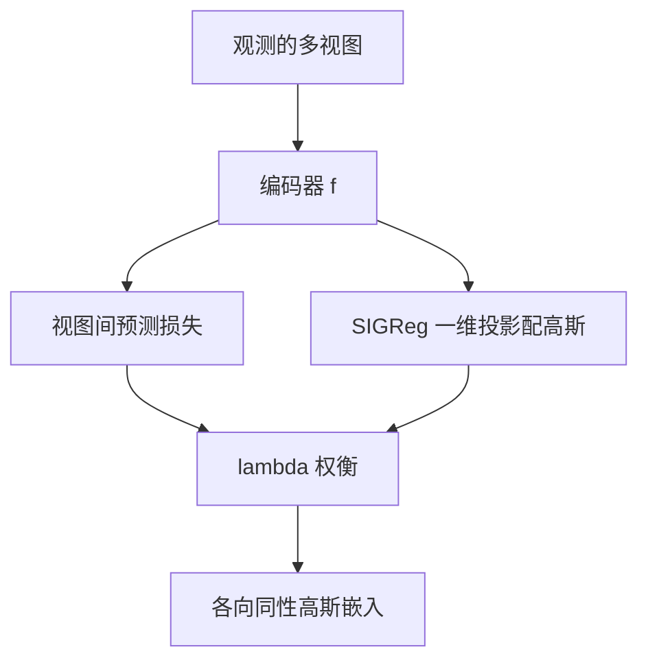

# LeJEPA：先证明嵌入该是各向同性高斯，再把防塌缩从启发式换成 SIGReg

<!-- release-date: 2025-11-11 -->

**本文依据**：`LeJEPA: Provable and Scalable Self-Supervised Learning Without the Heuristics`，arXiv `2511.08544v3`（14 Nov 2025，50 页）。作者 Randall Balestriero、Yann LeCun（封面标 Equal contribution）；第一作者最低编号单位 Brown University（封面还列 Meta-FAIR、NYU）。本地 PDF 页眉为 arXiv `2511.08544v3`。首发日取 arXiv v1 提交日 2025-11-11。封面没有印会议名。文中数字标 `(PDF p. N)`，页码是这份 PDF 文件页。标「外部补充」的段落不来自本文。

## 一句话

JEPA 要学可操作的世界表示，但预测任务本身允许把所有输入压成同一个点。现成做法用 stop-gradient、teacher–student、非对称视图和一堆调度把塌缩按住，训练因此脆。这篇先证：在不知道下游任务时，嵌入的最优分布是各向同性高斯；再给出线性复杂度的 SIGReg，把嵌入往这个分布推。预测损失加 SIGReg 就是 LeJEPA：一个权衡超参 $\lambda$，无 stop-gradient、无 teacher–student。ImageNet-1K 预训练、冻结骨干线性探测，ViT-H/14 到 **79%**（PDF p.1）。

## 一、矛盾：JEPA 蓝图清楚，防塌缩全靠启发式

学习可操作的世界及其动力学，核心是从观测里得到有组织、能拿去做事的高维嵌入。JEPA（Joint-Embedding Predictive Architecture，联合嵌入预测架构）的做法是：让语义相关视图的嵌入互相可预测（PDF p.1–2）。视图可以是变换或损坏：遮挡、裁剪、模糊、时空平移、几何/光度变换、视角、多传感器；监督形式还可以是图文对、文本–代码对。只要视图共享希望抓住的语义，预测任务就能把编码器 $f_\theta$ 往那份共享知识对齐（PDF p.2）。

失败模式也很清楚：表示塌缩。编码器把所有输入映到几乎同一个点（完全塌缩），或映到低维子空间（维度塌缩）（PDF p.2）。为堵这条捷径，当时的 SOTA recipe 堆启发式：stop-gradient、非对称视图生成、带精细 EMA 的 teacher–student、显式归一化/白化层，再配一堆超参平衡。结果是训练脆。研究重心于是滑向扩数据、扩模型、甚至后训练，JEPA 本身的理论地基很少有人碰（PDF p.2）。

作者把设计压成两条公理（PDF p.2）：

1. 把预测任务做对；
2. 强制嵌入服从各向同性高斯。

第 (i) 条沿用既有 JEPA 实践。第 (ii) 条是新的：SIGReg（Sketched Isotropic Gaussian Regularization，素描各向同性高斯正则）。它既堵塌缩捷径，又被证明能把下游任务上的期望风险往下压。合在一起叫 Latent-Euclidean JEPA，即 LeJEPA（PDF p.2）。

作者声称的工程收益（PDF p.1–2）：单个权衡超参；时间和内存对维度与样本量线性；跨超参、架构（ResNet、ViT、ConvNet）和域稳定；无 stop-gradient、无 teacher–student、无超参调度器；分布式实现大约 **50** 行。实验覆盖 **10+** 数据集、**60+** 架构。

（机制示意，根据 PDF p.2–3 图 2 与第 5 节。）

## 二、背景：JEPA 只要「能预测」且「不退化」

数据被看成样本、视图、特征的张量。理论不依赖具体怎么排这个张量，只要求样本独立同分布（PDF p.3）。编码器 $f_\theta:\mathbb{R}^D\to\mathbb{R}^K$ 的内部结构对后文定理不重要。

定义 1：JEPA 要求从一个视图的嵌入能预测另一视图的嵌入，且嵌入整体不退化（PDF p.4 式 (1)）。预测可以直接比 $\ell_p$，也可以再加一个 Pred 网络；Pred 只在视图信息量不对称时才有理由，例如机器人数据里条件于观测到的动作（PDF p.4）。

当时预训练的两条主路是监督学习和重建。标签能同时拉近同类、挡住完全塌缩；重建则强迫嵌入保留输入信息。大量 JEPA 解释走互信息界，把已有方法回收成 MI 的不同界。作者认为这类工作解释得多、指导得少：新进展主要是更大的数据、更旧的 recipe 放大、以及新的数据筛选（PDF p.4–5）。他们要从一阶原理推出新的 JEPA，而不是再解释一遍现成系统。

## 三、为什么必须是各向同性高斯

问的是：编码器输出该服从什么分布，才能让任意下游任务上的经验风险尽量小？作者分别在线性探测和非线性探测里证：各向同性高斯是唯一最优（PDF p.5）。

### 线性探测：各向异性同时放大偏差和方差

冻结编码器后最常用的评测是线性探测。嵌入矩阵 $Z\in\mathbb{R}^{N\times K}$，未知标签 $y$。线性探针做带 Tikhonov 的最小二乘：

$$\hat\beta=\arg\min_\beta\|y-Z\beta\|_2^2+\lambda\|\beta\|_2^2$$

（PDF p.5）

取两个列空间相同、总能量相同、几何不同的嵌入：$Z_{\mathrm{aniso}}$ 的协方差特征值不全相等，$Z_{\mathrm{iso}}$ 的特征值全等于那些特征值的平均。

- **引理 1**：只要最大特征值大于最小特征值，就存在下游任务，使带 $\lambda>0$ 正则时各向异性估计器偏差更大（PDF p.5）。
- **引理 2**：$\lambda=0$ 的 OLS 总方差在各向同性时最小，$\mathrm{tr}(\mathrm{Var}(\hat\beta_{\mathrm{aniso}}))>\mathrm{tr}(\mathrm{Var}(\hat\beta_{\mathrm{iso}}))$（PDF p.5）。

图 3 用两类分类的 logistic 回归重复抽样画决策边界：各向同性时 $\mathrm{Var}(\hat\beta)=0.0056$，各向异性时 $0.0801$，条件数 20（PDF p.6）。结论：特征分布必须各向同性。

### 非线性探测：高斯成为唯一最优

半径 $k$-NN 和核回归是两类常用非线性探针。在总方差一类标量约束下（例如 $\mathrm{Tr}(\mathrm{Cov}(Z))$ 或 Frobenius 范数固定），定理 1 给出积分平方偏差（ISB）：$k$-NN 的 ISB 正比于 $J(p)$，核方法的上界同样含 $J(p)$；在这些约束里，各向同性高斯是唯一使 ISB 最小的分布（PDF p.6）。细节与正则性假设在附录 A。

3.3 节的几何实验用来支撑「下游任务未知时高斯最优」。正文写：线性探针下各向异性同时加大偏差（带 Tikhonov）和方差；余弦相似度只在各向同性时能到 1（PDF p.6）。图 17 的图注却写成「各向异性（蓝）方差更低、各向同性（红）方差更高」（PDF p.48）——与引理 2 和图 3 相反。读图时以引理 2 / 图 3 为准，把图 17 图注当排版笔误，不要跟着它改结论。

设计原则由此定死：**$f_\theta(x)$ 应服从各向同性高斯，以最小化训练后遇到的最坏下游风险**（PDF p.6）。

## 四、SIGReg：用素描统计检验把高维配成高斯

下一步不是再发明一种高维散度估计，而是把「$P_\theta=Q$」写成假设检验 $H_0:P_\theta=Q$ vs $H_1:P_\theta\neq Q$（PDF p.6）。高维检验至少对样本量二次，所以把多元检验拆成一维方向检验：沿单位向量 $a$ 做推前，比较投影后的一元分布（PDF p.7 式 (3)）。

超球面版 Cramér–Wold（引理 3）：所有方向上一元分布相同，当且仅当两个随机向量同分布（PDF p.7）。定理 2：把各方向统计量取 max 聚合成 $T_A$，在经典一致一元检验下，这个素描检验对原多元原假设有水平与功效（PDF p.7）。

定义 2 的 SIGReg 把 max 改成平均，避免梯度只打在最差的那一条方向上（PDF p.7）：

$$\mathrm{SIGReg}_T\bigl(A,\{f_\theta(x_n)\}\bigr)=\frac1{|A|}\sum_{a\in A} T\bigl(\{a^\top f_\theta(x_n)\}\bigr)$$

候选 $T$ 分三家，作者最终只用特征函数检验。

**矩检验不够且不稳。** Jarque–Bera 看偏度与峰度；他们扩成 Extended Jarque-Bera，再配上前两阶矩，等于配前四阶矩（PDF p.8）。定理 3：有限 $K$ 阶矩匹配并不蕴含投影分布相等，塌缩捷径还在（PDF p.8）。把 $K$ 加大能堵捷径，但第 $k$ 阶矩的梯度范数按 $O(k)$ 涨，Monte Carlo 方差按 $O(k^2 m_{2(k-1)})$ 涨，稳定和可辨识没法同时要（PDF p.8）。

**CDF 检验不适合 SGD。** Cramér–von Mises、Anderson–Darling、Watson 都要排序，$O(N\log N)$，在多 GPU 上破坏 SGD 的易并行；排序和次序统计不可微（PDF p.9）。Kolmogorov–Smirnov 用 $\ell_\infty$，梯度稀疏。Shapiro–Wilk 实践中不稳（附录 E）。

**特征函数：有界、可微、好做 all-reduce。** Epps–Pulley 把经验特征函数与目标特征函数在加权 $\ell_2$ 下比较（PDF p.9）。ECF 是复指数的平均，天然可微，分布式里一次 `all_reduce` 即可。窗函数常用高斯 $w(t)=e^{-t^2/\sigma^2}$，$\sigma$ 常取 1。

定理 4：Epps–Pulley 对投影样本的一阶、二阶导数有与分布无关的上界，梯度因此稳定（PDF p.10）。实现时间和内存 $O(N)$，$N$ 是 minibatch。算法 1：每步用 `global_step` 同步采样 $M$ 个单位投影；积分点 `linspace(-5,5,17)`；目标 CF 是 $N(0,1)$ 的 $e^{-t^2/2}$；梯形积分后乘 $N$（PDF p.10）。

表 6：Tesla V100 上 SIGReg 前向，batch 512 / 512 slices / 16 积分点约 **0.47 ms**；batch 32768 同 slices 约 **26.4 ms**（PDF p.43）。

### 维数灾难怎么被绕开

定理 5：若密度在 Sobolev 空间 $H^\alpha$ 里，且有限方向上 Epps–Pulley 已为 0，则随机方向上的期望 CF 误差按 $|A|^{-2\alpha/(K-1)}$ 衰减。$\alpha$ 大时 $|A|=O(K)$ 就够 $\epsilon$-逼近（PDF p.11）。深度网上的平滑（结构或隐式正则）会把 $\alpha$ 抬高，所以几百个切片能约束整个空间。

第二条路是 SGD 本身：每步只抽几百个方向，但训练过程中累计方向数随步数线性涨。图 7：每步重采样方向，比固定方向覆盖强得多；实验里 $|A|$ 低到 **16** 也能打过固定的数千方向（PDF p.10–11）。

合成实验：1024 维标准高斯里只把前两维改成「X」形（边际仍像高斯、协方差仍是单位阵，图 5）。对样本做梯度下降最小化 SIGReg，$M=10$ 就能抓住退化子空间并展开回各向同性高斯（PDF p.9 图 6）。VCReg 那种只配均值方差的统计量过不了这个陷阱。

## 五、LeJEPA：预测损失 + SIGReg，启发式卸掉

SIGReg 用梯形求积，**17** 个结点就够（图 20）。Minibatch 引入 $O(1/N)$ 偏差（定理 6）；作者认为 batch **16** 已经不构成问题，未做 U-统计量去偏（PDF p.12）。

预测损失沿用 DINO 的全局/局部视图：$V_g$ 个全局、$V_l$ 个局部。所有视图去预测全局视图的均值 $\mu_n$，即 $\ell_2$ 到全局嵌入平均（PDF p.12 式 (5)–(7)）。非 ViT（如 ResNet）时全局视图等于全部视图（算法 2，PDF p.11）。

总损失（PDF p.12）：

$$\mathcal{L}_{\mathrm{LeJEPA}}=\frac\lambda V\sum_v\mathrm{SIGReg}(\{z_{n,v}\})+\frac{1-\lambda}{B}\sum_n\mathcal{L}_{\mathrm{pred}}$$

算法 2 写成 `(1-lambd)*sim + lambd*sigreg`。除模型、优化器、数据加载外，核心几十行 PyTorch。一个超参 $\lambda$。

与前作的关系（PDF p.12）：切片在生成模型和最优传输里早有（Sliced Score Matching、sliced Wasserstein）。Epps–Pulley 若积分精确，每条切片就是核 MMD，但 MMD 是二次复杂度。若把 $T$ 退化成「均值平方 + (标准差$-1)^2$」，切片数趋向无穷时 SIGReg 强制 $\mathbb{E}[Z]=0$、$\mathrm{Cov}(Z)=I$，再配 $\ell_2$ 不变性就回收 VICReg。定理 3 反对这么做：低阶矩匹配留捷径，VICReg 已经见过。

## 六、实验：稳定、损失能当选择器、域内预训练能打过迁移

除非另说，统一 recipe（PDF p.14）：$V=8$（2 个 $224\times224$ 全局、其余 $96\times96$ 局部）；AdamW，学习率在 $\{5\times10^{-3},5\times10^{-4}\}$，权重衰减在 $\{10^{-1},10^{-2},10^{-5}\}$，无权重衰减调度，学习率线性 warmup + 余弦；骨干来自 timm。

### 超参与架构都不容易塌

ImageNet-100、ResNet-50、400 epoch：线性探测随 $\lambda$ 和视图数变化，峰随视图数略调 $\lambda$。作者推荐默认 $\lambda=0.05$（PDF p.13 图 8）。表 7 数字（PDF p.43）：8 视图时 $\lambda=0.05$ 为 **84.32%**；4 视图峰在 $\lambda=0.020$ 的 **84.68%**；2 视图峰在 $\lambda=0.010$ 的 **83.49%**。

ImageNet-1K、ViT-Large/14、100 epoch、冻结线性探测（表 1，PDF p.13）：

| 设定 | 观察 |
|---|---|
| Epps–Pulley 积分域与结点数 | $[-1,1]$ 约 72%；$[-3,3]$/$[-5,5]$ 约 74–75%。512 与 2048 slices 差几个点内 |
| 全局/局部视图 | 仅 1 个全局、共 4 视图 **53.06%**；2 全局 + 总 8 视图 **74.24%**；2 全局 + 总 10 视图 **74.06%**；4 全局 + 总 10 视图 **75.08%** |
| batch | 128 已 **72.20%**；256 **74.15%**；512 **74.72%**；1024 **74.07%** |
| 投影维/嵌入维 | 投影 64、slices 4096、嵌入 2048 到 **75.65%**；投影 1024 略降到约 74% |
| register tokens | 0–8 个都在 **75.1–75.8%**，不是必需 |

推荐起点：$\lambda=0.05$，$V_g=2$，$V_l=8$，batch $\ge128$，17 个积分点，域 $[-5,5]$，1024 slices（PDF p.13）。

ImageNet-10 上约 **50** 个 $<20$M 的 timm 模型、8 个家族：冻结线性探测 **91.5–95%**。监督里强的 ResNet/ViT 在这里也更强；作者建议先用标准 ResNet/ViT，而不是 EfficientNet 一类特化结构（PDF p.14 图 9）。

表 4（ImageNet-100，400 epoch）：去掉 predictor 并不塌缩。ResNet-50 无 predictor、3 层投影、无 SWA **83.93%**；有 predictor 同配置 **83.57%**。ViT-S/8 无 predictor + SWA + 3 层投影 **84.12%**（PDF p.42）。SWA 对 ViT 有小增益，但不是为了防塌缩。Register token 在 LeJEPA 里可有可无。作者建议：默认不要 predictor、不要 register；ViT 上可选 SWA（PDF p.14）。

封面图 1 右上：ViT-g/14（**1.8B**）在 ImageNet-1K 上训练损失稳定（PDF p.1）。贡献 4 写规模接近 10 亿参数；正文 6.4 把 ViT-g 当作稳定性例子，主缩放数字是 ViT-L **0.3B** 与 ConvNeXtV2-H **0.6B**（PDF p.3、p.17）。

### 训练损失能当无标签模型选择

以往 JEPA 训练损失和下游相关弱，甚至不单调下降，只能靠有标签探测或无监督谱统计来选模型（PDF p.15）。LeJEPA 的 SIGReg 与预测损失张成的平面里，等高精度沿指向左下的线性前沿排列（图 10）。合成训练损失与下游准确率的 Spearman $\rho_s$ 约 **85%**。再按 $\lambda^\alpha$ 缩放，图 1 封面 ViT/base-8 ImageNet-1K 为 **94.52%**；$\alpha\approx0.4$ 时多组设定可到近 **99%**（PDF p.1、p.15 图 11）。于是更低的训练损失可靠地指示更好的下游，可做无标签交叉验证。

### 域内预训练 vs 前沿迁移

Galaxy10：11,000 训练样本、10 类星系形态，和自然图像统计差很远。LeJEPA 用默认超参预训练 400 epoch，对照 DINOv2 / DINOv3 / I-JEPA（PDF p.17）。图 1 与表 3（PDF p.1、p.42）：

| 设定 | 模型 | 1-shot | 全量微调 / 冻结全量 |
|---|---|---:|---:|
| 域内 LeJEPA | ConvNeXt-V2 Nano | 29.42 / 冻结 28.74 | 微调 82.72 / 冻结 76.52 |
| 域内 LeJEPA | ResNet-34 | 24.27 / 冻结 31.08 | 微调 83.28 / 冻结 78.17 |
| 迁移 | DINOv2 ViT-S/16 | 21.05 / 冻结 27.68 | 微调 78.34 / 冻结 67.62 |
| 迁移 | DINOv3 ViT-S/16 | 24.71 / 冻结 30.17 | 微调 81.60 / 冻结 71.38 |

全量微调里 ResNet-34 的 **83.28%** 高于 DINOv3 的 **81.60%**；冻结骨干差距更大（78.17 vs 71.38）。作者的判断：框架一旦能不调超参就迁到新域，域内 SSL 可以打过在自然图像上训出来的大规模前沿模型（PDF p.1、p.17）。

表 5 把同一套小骨干丢到更小的域内集上，冻结线性探测（PDF p.43）。flowers102 仅 **1020** 个训练样本，ResNeXt-26ts 到 **82.19%**。Galaxy10 上这些小模型 **73.78–77.29%**，而 I-JEPA ViT-H/14（630M，IN-1K 预训练）迁过来只有 **62.93%**——自然图像上 I-JEPA 在 cifar/inet10 仍大幅领先（cifar100 **86.93%** vs LeJEPA 约 70%）。域内优势集中在分布差的数据，不是「小模型处处赢大模型」。

### ImageNet-1K 缩放与迁移

ViT-Large（0.3B）在线线性探测 **77.1%**，ConvNeXtV2-Huge（0.6B）**78.5%**（PDF p.17）。摘要的 ViT-H/14 **79%** 是冻结骨干线性探测，正文没有再给一张同设定对照表（PDF p.1）。

表 2：IN-1K 预训练 100 epoch 的 LeJEPA，对 I-JEPA ViT-H（632M，300 epoch）做 8 数据集 few-shot（PDF p.16）。IN-1K 组内加粗最优。摘全量（all）一行：

| 模型 | 参数 | epoch | DTD | aircraft | cars | cifar10 | cifar100 | flowers102 | food | pets | avg |
|---|---:|---:|---:|---:|---:|---:|---:|---:|---:|---:|---:|
| LeJEPA ViT-L | 304M | 100 | 78.30 | 57.01 | 57.28 | 96.50 | 83.71 | 91.21 | 82.05 | 89.74 | 79.48 |
| LeJEPA ConvNeXtV2-H | 660M | 100 | 76.60 | 52.99 | 54.88 | 96.15 | 81.34 | 91.11 | 77.64 | 89.76 | 77.56 |
| I-JEPA ViT-H | 632M | 300 | 73.32 | 56.61 | 54.47 | 97.54 | 86.42 | 86.47 | 81.02 | 92.11 | 78.50 |
| I-JEPA ViT-H + STOP | 632M | 300 | 73.87 | 61.95 | 61.27 | 98.02 | 87.78 | 88.08 | 81.72 | 92.88 | 80.70 |
| I-JEPA ViT-H（IN-22K） | 632M | 900 | 75.67 | 65.39 | 49.79 | 98.46 | 89.95 | 98.54 | 81.58 | 87.19 | 80.82 |

1-shot 平均：LeJEPA ConvNeXtV2-H **31.58**，I-JEPA IN-1K **30.20**，I-JEPA+STOP **32.05**。10-shot：LeJEPA ViT-L **60.95**，I-JEPA **60.51**，+STOP **62.92**。作者强调细粒度（DTD、flowers102、food101）上 LeJEPA 更强，且 epoch 是 I-JEPA 的 1/3（PDF p.16）。I-JEPA+STOP 与 IN-22K 仍在若干任务上更高——LeJEPA 赢的是「更小、更短、IN-1K 组内可比较」，不是全面碾压带 STOP 或 22K 的 I-JEPA。

### 涌现语义

图 14：ViT-Large、ImageNet-1K、100 epoch，最后一层特征做 PCA 映到 RGB，暖色抓前景、冷色抓背景，无监督出现物体–背景分离（PDF p.17）。图 13：对 [CLS] 自注意力阈值化得到二值掩码，视频上能跟前景，作者称为无监督分割/跟踪的涌现（PDF p.16）。这是定性展示，没有分割 mIoU 表。

## 七、局限、没写清的和可迁移的

论文自己的边界：

- 最优分布论证针对线性探针、半径 $k$-NN 和核回归，在方差一类标量约束下；不是「任意下游、任意探针」的万能定理。
- SIGReg 的 Epps–Pulley 用 17 点梯形积分，有 $O(1/N)$ minibatch 偏差；去偏留作未做（PDF p.12）。
- 默认仍借用 DINO 式多裁剪；ResNet 上局部视图被关掉，说明视图协议并未被理论消掉。
- ViT-H/14 **79%** 只出现在摘要，没有与 DINOv2 同表同设定的 ImageNet 线性探测对照。
- 图 17 图注与引理 2 方向冲突，引用方差结论时不要用那条图注。
- 没有强化学习、机器人控制闭环、或语言/多模态骨干上的实验；「世界模型」停在视觉表示。
- 封面写无超参调度器，实验细节仍用学习率 warmup + 余弦（PDF p.14）——「无调度」指的是防塌缩那一套 EMA/教师，不是优化器学习率。

可迁移：

1. **先定嵌入该长什么样，再选正则。** 防塌缩不必从 stop-gradient 清单里挑，可以问「下游探针的最坏风险在哪种几何下最小」。
2. **高维配分布用随机一维切片 + 有界统计量。** 特征函数比高阶矩稳，比 CDF 好反传；每步重采样方向，用训练步数换切片数。
3. **一个 $\lambda$ 的加性结构便于排障。** 预测项与 SIGReg 分列，训练损失还能当选择器——这比「损失在掉但探针不动」的 JEPA 好用。
4. **域内小数据值得先做 SSL，而不是默认拉一个自然图像基础模型来微调。** Galaxy10 是这条的证据；自然图像基准上大 I-JEPA 仍更强，不要反过来读。
5. **Predictor 和 teacher–student 在信息对称的图像 JEPA 里主要是防塌缩装置。** 若正则已经堵住退化，可以卸掉；非对称信息（动作条件）时 Pred 仍有独立理由。

关键词回看：JEPA 是多视图嵌入预测；塌缩是预测任务的捷径；各向同性高斯是作者给出的最优嵌入几何；SIGReg 用随机投影上的 Epps–Pulley 把几何按进去；LeJEPA 就是预测 $\ell_2$ 加 SIGReg。
