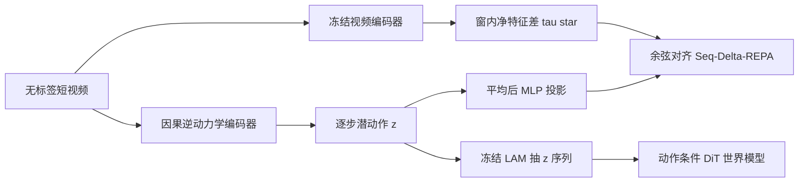

# Olaf-World：把潜动作钉在「效果方向」上，无标签视频也能当控制接口

<!-- release-date: 2026-02-10 -->

**本文依据**：`Olaf-World: Orienting Latent Actions for Video World Modeling`，arXiv `2602.10104v1`（2026-02-10，16 页）。作者 Yuxin Jiang、Yuchao Gu、Ivor W. Tsang、Mike Zheng Shou；第一作者最低编号单位 Show Lab, National University of Singapore（封面另列 CFAR & IHPC, Agency for Science, Technology and Research (A\*STAR), Singapore）。项目页 `https://showlab.github.io/Olaf-World`。首发日取本地 PDF 页边 `arXiv:2602.10104v1 [cs.CV] 10 Feb 2026`。文中数字标 `(PDF p. N)`；标「外部补充」的段落不来自本文。封面未印会议名。

## 一句话

可动作控制的视频世界模型缺的是帧对齐动作标签。从无标签视频学潜动作（latent action）能省标注，但逐步重建只在单段视频里成立：同一语义动作（「前进」）在不同场景、视角下会落到不同潜方向——重建对了，也迁不过去。Olaf-World 的 Seq∆-REPA 用冻结自监督视频编码器的**时间特征差**当跨片段共享的效果坐标，把一段窗里积分后的潜动作对齐到这个方向。下游世界模型在被动视频上预训，再靠轻量适配器接新控制接口。MIND 上跨第一/第三人称线性探测 Macro-F1：AdaWorld 1st→3rd 0.4820、3rd→1st 0.4999，本文 0.6250 / 0.5904（PDF p.5 表 1）；1 分钟级标注（1 条视频）适配后 1ST-P 的 RPE-trans 0.0284、RPE-rot 0.4680，低于同骨架 AdaWorld 的 0.0318 / 0.6420（PDF p.7 表 2）。

## 一、矛盾：重建对了，不等于「前进」在各场景是同一个向量

交互式世界模型要的是：给定当前画面和动作，滚出下一帧。大规模视频生成器已经从网上视频学到外观和物理先验，但要变成可操控模拟器，通常还得有**帧对齐动作标签**——贵，而且绑死某一套键盘/手柄约定（PDF p.1）。

潜动作学习（latent action learning）的旧答案是：逆动力学编码器从 $(x_i,x_{i+1})$ 推断 $z_i$，前向解码器用 $z_i$ 重建下一帧。无标签就能长出控制接口。卡在两处（PDF p.2–3）：

| 失败模式 | 训练时发生了什么 | 后果 |
|---|---|---|
| 捷径 / 场景纠缠 | 后验看了 $x_{i+1}$，解码器够强时，$z_i$ 可以塞进外观、光照、布局，而不是可迁移的控制因 | 换场景，$z$ 失效 |
| 跨上下文不可辨识 | 损失从不比较两条视频的潜向量；每段视频可以有自己的潜坐标基 | 同一语义动作映射到不同方向；跨场景零样本搬不动 |

图 2 把第二点画死了：段内重建可以很好，但「Forward」在场景 (a) 和 (b) 指向潜空间里不同的轴。因为目标只约束「这一段能不能重建」，坐标怎么转都行（PDF p.2 图 2）。附录命题 A.1：每个上下文各乘一个可逆 $G_c$，预测损失不变；把 $c_A$ 里学到的码拿到 $c_B$ 用，一般不是同一个效果，除非 $G_{c_B}^{-1}G_{c_A}\approx I$（PDF p.12）。$\beta$-VAE 的各向同性先验对旋转不变；对角高斯族把连续旋转收成符号置换，**离散对称仍可随上下文变**，方向仍不可比（PDF p.12–13）。

全文主矛盾因此不是「再建一个更像的下一帧预测器」，而是：**动作标签看不见，怎样给潜动作一个跨片段共享的坐标系，让同一控制语义落在同一方向。**

作者的洞察：动作本身没标，**控制造成的语义效果在视频里看得见**。冻结的自监督视频编码器给出特征差 $\Delta y$，当作共享的「效果方向」；Seq∆-REPA 把积分后的潜动作对齐过去（PDF p.1–2）。

（机制示意，根据 PDF p.4 图 3。）

## 二、潜动作模型：逐步 $\beta$-VAE 加上窗级效果对齐

给定片段 $x_{0:K}$，每步转移配一个 $z_i\in\mathbb{R}^{d_z}$。因果逆动力学给出 $q_\phi(z_i\mid x_{0:i+1})$，前向解码器 $p_\theta(x_{i+1}\mid x_i,z_i)$。逐步 $\beta$-VAE（PDF p.3 式 1）：

$$
L^{\mathrm{VAE}}_{\theta,\phi}=\frac{1}{K}\sum_{i=0}^{K-1}\Bigl(- \mathbb{E}_{q_\phi}\log p_\theta(x_{i+1}\mid x_i,z_i)+\beta\,\mathrm{KL}(q_\phi(z_i\mid x_{0:i+1})\,\|\,p(z_i))\Bigr)
$$

先验 $p(z_i)=\mathcal{N}(0,I)$。这一项能压一步预测误差，**不**保证跨视频坐标一致。

Seq∆-REPA 另加一条窗级约束。冻结编码器 $f$（文中用 V-JEPA 2 ViT）出时空 token，空间池化成每帧描述 $s_i\in\mathbb{R}^D$。效果方向是净特征变化（PDF p.4 式 2）：

$$
\tau_\ast=\frac{1}{K}\sum_{i=0}^{K-1}(s_{i+1}-s_i)
$$

时间差分压掉静态外观，平均再压掉单帧噪声，所以 $\tau_\ast$ 比像素差更适合当跨上下文参考。潜动作侧把窗内 $z$ 平均，再经可训 MLP $h_\psi$ 投到同一 $D$ 维（PDF p.4 式 3）：

$$
\bar z=\frac{1}{K}\sum_{i=0}^{K-1}z_i,\qquad u=h_\psi(\bar z)
$$

对齐用余弦，不是特征对特征（那是 REPA 系给生成器内部状态用的），而是**控制对效果**（PDF p.4 式 4）：

$$
L^{\mathrm{Seq}\Delta\text{-REPA}}_{\psi}=1-\langle\mathrm{norm}(u),\mathrm{norm}(\tau_\ast)\rangle
$$

总损失 $L_{\mathrm{LAM}}=L^{\mathrm{VAE}}+\lambda L^{\mathrm{Seq}\Delta\text{-REPA}}$（PDF p.4 式 5）。$\lambda>0$，$f$ 全程冻结。

相关工作里，Genie / AdaWorld 一类把潜动作当世界模型接口，LAPA / UniVLA 一类当跨本体策略表示；离散 VQ 与连续潜都试过。约束潜空间、强调运动而非像素，都还在**单段视频**里做，本身不强迫跨环境语义一致（PDF p.3）。Seq∆-REPA 补的就是那条全局效果锚。

## 三、Olaf-World：冻结 LAM 当统一接口，再 LoRA 接真动作

**动作感知预训。** 视频 $x_{0:T}$ 经冻结 LAM 得到逐步 $z_{0:T-1}$。骨干是预训练图生视频 DiT（SkyReels I2V 1.3B），用 flow matching 训帧序列与潜动作配对（PDF p.4）。每帧 $z_t$ 线性投影后加进扩散时间步嵌入，再映射成各块 AdaLN-Zero 调制。3D 视频 VAE 时间压缩 $r=4$，于是每 $r$ 个逐步动作合成一个潜时间条件向量（PDF p.4）。原始键盘约定从此不必对齐：世界模型只吃 LAM 的 $z$。

**特定世界适配。** 目标环境有真动作 $a_t$。小适配器 $A_\eta$ 映射 $\hat z_t=A_\eta(a_t)$。离散动作集用嵌入表 $E\in\mathbb{R}^{|A|\times d_z}$；用目标数据上冻结 LAM 的类中心初始化 $E[a]$，再微调适配器加骨干上的小 LoRA，目标仍是 flow matching（PDF p.4）。被动视频里学到的全局对齐语义尽量保住，只把新接口拧进去。

实现（附录 B，PDF p.13）：

| 件 | 规格 |
|---|---|
| LAM | Transformer 编解码各 16 块、1024 维、16 头；编码器时间注意力因果；$d_z=32$；窗 $T=16$，分辨率 $272\times 480$ |
| 对齐头 | LayerNorm + 3 层 MLP，池化后的 $z$ 投到 $D=1408$ |
| 效果教师 | 冻结 V-JEPA 2 ViT-Giant/16 (384)；关掉 color jitter，以免搅效果轨迹 |
| LAM 优化 | AdamW，$2.5\times 10^{-5}$，weight decay $10^{-2}$，总 batch 32，8×H200；$\beta=2\times 10^{-4}$，$\lambda=0.02$；100 epoch（约 146k 步），约 4.5 天 |
| 世界模型 | SkyReels I2V 1.3B DiT；$32\to 1536$ 线性注入时间步流，可学增益 $\gamma$ 初值 2.0；540p，$T=97$ 帧（25 个潜帧）（PDF p.5、p.13） |
| 预训 | AdamW，$5\times 10^{-5}$，weight decay $10^{-3}$，10k 步；4×H200，每卡 batch 4 |
| 适配 | 只训 LoRA rank 16（attn q/k/v/o 与 ffn 0/2），学习率 $10^{-4}$，weight decay 0 |

## 四、实验设定：同骨干换潜动作目标，用第一/第三人称对打

LAM 与世界模型预训数据：MiraData 的 3D Rendering 与 City Walking（PDF p.5）。受控评测与适配：MIND（开域、UE5、帧对齐动作）。两个不相交子集：**第一人称（1ST-P）** 与 **第三人称（3RD-P）**，场景和相机架都不同，共享 8 类动作：导航 W/S/A/D（前/后/左/右）与相机 ↑/↓/←/→（抬头/低头/左看/右看）（PDF p.5）。这是外观偏移加视角偏移的跨上下文测试床。

基线 AdaWorld：官方潜动作管线不动，视频骨干、数据、训/适配预算对齐本文，差异只归因到潜动作目标（PDF p.5）。世界模型适配另加 DirectAct：直接条件在真值动作上，不经潜动作预训（PDF p.7）。

三个问题：潜空间是否线性可分且跨域一致（RQ1）；能否零样本搬动作序列（RQ2）；对齐后的潜空间能否少样本接到新接口（RQ3）（PDF p.5）。

## 五、RQ1：线性探测与原型相似度

表 1，Macro-F1，越高越好。灰列是跨域（源→目标）（PDF p.5）：

| 方法 | 1st→1st | 1st→3rd | 3rd→3rd | 3rd→1st |
|---|---:|---:|---:|---:|
| AdaWorld | 0.6004 | 0.4820 | 0.4827 | 0.4999 |
| Ours | 0.8138 | 0.6250 | 0.8256 | 0.5904 |

协议：冻结 $z_t$ 上训线性分类器预测 8 类原子动作；在源域按验证 Macro-F1 选 checkpoint，零样本打到另一域（PDF p.5、p.13）。增益在更难的 3RD-P 域内最大：AdaWorld 饱和在约 0.48，本文 0.8256。图 4 训练曲线：实线域内、虚线跨域，Seq∆-REPA 两条都更高，早期更稳（PDF p.5 图 4）。图上没有印逐点表，不要把曲线读成表。

图 5：两域各自算类中心，行是 1ST-P、列是 3RD-P 的余弦热图。AdaWorld 几乎处处高相似——不同动作在跨视角下看起来都像；本文更对角占优，非匹配对被压向零或负。残差主要在偏航「看」类（← / →）：同一按键在自我中心与第三人称架上诱导的可见运动本来就不一样（PDF p.5–6 图 5）。热图格子上印了若干对角数字，正文没有把它们收成表，解读以「对角占优 vs 处处高相似」为准。

## 六、RQ2：零样本动作序列迁移是定性条

从参考片段抽出 $z_{0:T}$，接到另一段的初始帧上滚。成功标准：参考运动要在，目标外观要留（PDF p.6）。

图 6 四例（Camera Pan Left / Car Drive Forward / Camera Move Right and Down / Character Walk Left while Panning）。AdaWorld：(A) 时间冲刷与不稳；(B)(D) 受控角色消失或尺度漂；(C) 轨迹滑向泛化运动、偏离参考。Olaf-World 场景与主体更持久，运动更贴参考（PDF p.6 图 6）。**没有定量迁移表**；作者把视频质量交给项目页。这是观察，不是表 1/2 那种可复算指标。

## 七、RQ3：0 / 1 / 50 条视频适配

`#Adapt Videos ∈ {0, 1, 50}`，约 0、1 分钟、2 小时标注（PDF p.7）。画质用 VBench 的 Imaging Quality 与 Temporal Consistency（越高越好）；可控性用相对位姿误差 RPE：生成视频与真值都用 ViPE 估相机轨迹，Sim(3) Umeyama 对齐后报平移幅度与转角，越低越好（PDF p.7、p.14）。三方法同骨干、同 LoRA rank 16、同步数与优化器。

表 2（PDF p.7）：

**1ST-P**

| 方法 | 视频数 | Image Qual. ↑ | Temp. Cons. ↑ | RPE-trans ↓ | RPE-rot ↓ |
|---|---:|---:|---:|---:|---:|
| DirectAct | 0 | 0.7213 | 0.8993 | 0.0703 | 1.4311 |
| AdaWorld | 0 | 0.5600 | 0.9226 | 0.0470 | 1.0844 |
| Ours | 0 | 0.5400 | 0.9123 | 0.0387 | 0.8773 |
| DirectAct | 1 | 0.5269 | 0.8828 | 0.0672 | 1.2822 |
| AdaWorld | 1 | 0.5623 | 0.8955 | 0.0318 | 0.6420 |
| Ours | 1 | 0.5726 | 0.9015 | 0.0284 | 0.4680 |
| DirectAct | 50 | 0.5936 | 0.9345 | 0.0351 | 0.4527 |
| AdaWorld | 50 | 0.6177 | 0.9239 | 0.0263 | 0.3834 |
| Ours | 50 | 0.6312 | 0.9263 | 0.0230 | 0.3785 |

**3RD-P**

| 方法 | 视频数 | Image Qual. ↑ | Temp. Cons. ↑ | RPE-trans ↓ | RPE-rot ↓ |
|---|---:|---:|---:|---:|---:|
| DirectAct | 0 | 0.6970 | 0.9086 | 0.0897 | 0.7968 |
| AdaWorld | 0 | 0.6102 | 0.9344 | 0.0723 | 0.6067 |
| Ours | 0 | 0.5909 | 0.9203 | 0.0461 | 0.4873 |
| DirectAct | 1 | 0.6019 | 0.8851 | 0.0708 | 0.8543 |
| AdaWorld | 1 | 0.6033 | 0.8989 | 0.0525 | 0.4659 |
| Ours | 1 | 0.5844 | 0.8974 | 0.0348 | 0.3861 |
| DirectAct | 50 | 0.6265 | 0.9286 | 0.0402 | 0.3846 |
| AdaWorld | 50 | 0.6459 | 0.9306 | 0.0393 | 0.3353 |
| Ours | 50 | 0.6486 | 0.9287 | 0.0222 | 0.2082 |

全部预算下本文 RPE 最低。0 条时 DirectAct 退化成普通图生视频：画质分可以很高（1ST-P Image Qual. 0.7213），可控性没有信息——作者直接写了这一句（PDF p.7）。有监督后 DirectAct 变好，同 rank-16 仍不如潜动作预训。作者预期加大适配容量（更高 LoRA 或全参）会缩小差距（PDF p.7）。图 7：50 条后本文跟控更稳，新露出区域与初始帧更贴；AdaWorld 在 3RD-P 多键（转+左移）上常只转不左移（PDF p.7）。

## 八、未见场景与 Seq∆-REPA 消融

用 1ST-P 上满适配模型，另构 50 张 OOD 初始帧（照片级、动漫、油画等），动作序列与域内测试相同（PDF p.8、p.14）。表 3（PDF p.8）：

| 方法 | Image Qual. ↑ | Temp. Cons. ↑ | RPE-trans ↓ | RPE-rot ↓ |
|---|---:|---:|---:|---:|
| DirectAct | 0.6322 | 0.8585 | 0.0547 | 1.2343 |
| AdaWorld | 0.6181 | 0.8719 | 0.0482 | 1.7063 |
| Ours | 0.6274 | 0.8743 | 0.0478 | 1.2221 |

本文 RPE 仍最低。注意 AdaWorld 的 RPE-rot 1.7063 **差于** DirectAct 的 1.2343——外观一偏，未对齐的潜动作甚至可能帮倒忙；平移三项接近（0.0547 / 0.0482 / 0.0478），拉开主要在转角。图 8：未见风格下基线补新区域时破风格；未见物体（文中举例 Labubu）下主体漂。本文外观更稳、动作变化仍跟序列（PDF p.8）。

表 4，对齐设计（PDF p.8）：

| 变体 | 1st→1st | 1st→3rd | 3rd→3rd | 3rd→1st |
|---|---:|---:|---:|---:|
| w/o $\Delta$ | 0.6805 | 0.5287 | 0.7137 | 0.4823 |
| w/o norm | 0.8064 | 0.5311 | 0.7096 | 0.5934 |
| Full | 0.8138 | 0.6250 | 0.8256 | 0.5904 |

去掉 $\Delta$：对齐静态特征，空间捷径漏进 $z$，跨域掉得最狠（1st→3rd 0.6250→0.5287，3rd→3rd 0.8256→0.7137）。去掉 $\ell_2$ 归一、改尺度敏感 MSE：域内尚可，1st→3rd 掉到 0.5311；3rd→1st 0.5934 略高于 Full 的 0.5904，作者仍判 Full 两边最稳——跨域四格不是单调全赢，正文强调的是「两边都可靠」，不是每一格都最高（PDF p.8）。

附录 D 数据预算扫 `{0,1,3,5,10,25,50}` 条，约 `{0,1,6,13,26,60,120}` 分钟，LoRA 固定 rank 16（PDF p.14 表 10 左）。RPE-trans：0 条 0.0387 → 1 条 0.0284 → 50 条 0.0230；画质从 1 条之后大致平台。最陡的是低数据端。LoRA rank 扫（50 条固定）：rank 16 的 trans/rot 0.0230 / 0.3785；128 为 0.0213 / 0.3202；Full 为 0.0185 / 0.2980。主实验用 16 当省默认，结论不绑死某一 rank（PDF p.14–15）。表 10 未标明是 1ST-P 还是 3RD-P；数字与表 2 的 1ST-P Ours 行一致，按 1ST-P 读。

## 九、失败、局限、没写什么

图 11 三类失败（PDF p.15）：(A) 控–物理冲突：前驶再左转会撞，模型可能幻觉改掉障碍来保住运动；(B) 大揭示（拉远）时新内容糊、人体下半不一致；(C) 事件型动作（角色从左入画）在跨上下文里身份未指定，模型可能实现成背景/相机漂，相对运动合理，事件语义不对。作者把更丰富的物体进入留给后续。

附录 F（PDF p.15–16）：效果目标仍是简单余弦；逐步潜动作 16 FPS，没有技能层层次；单路效果信号会把相机、可控主体、他者、环境事件搅在一起；尚未在潜动作空间做规划；物理规则迁移、接触丰富操作都是展望。结论里的机器人「人→机器人」技能适配器同样是未来工作，不是本文实验（PDF p.8）。

正文没有独立 Limitations 节。能钉住的边界：

1. **零样本迁移没有定量表**，只有图 6 与项目页视频（PDF p.6）。
2. **适配评测绑在 8 类离散键** 与相机 RPE，不是任意连续手柄或接触操作（PDF p.5、p.14）。
3. **DirectAct 的 0 条画质可以高于潜动作预训**，不要把 Image Qual. 当成可控性（PDF p.7 表 2）。
4. **未见场景 RPE-rot 三项都在 1.2 以上**，绝对误差仍大；「最低」是相对另两行（PDF p.8 表 3）。
5. **社会影响**是模板句（PDF p.9）。
6. 封面与附录都指向项目页视频；静态 PDF 无法核时间质量。

## 可迁移

- **段内重建不能当跨场景坐标。** 命题 A.1 的 $G_c$ 对称说明：预测损失不变，码仍不可搬。要迁移，必须另加跨片段锚。
- **标签看不见时，对齐「效果」而不是「像素」。** 冻结视频编码器的时间差压静态外观，比逐步重建更像共享参考。
- **控制对效果 ≠ 特征对特征。** REPA 系对齐生成器内部状态为了画质；这里对齐的是积分潜动作与 $\Delta s$，目标是动作语义。
- **对齐要差分、要归一。** 静态特征把场景塞进 $z$；不归一则跨域幅度搅余弦。表 4 两边都掉。
- **潜动作预训换的是少样本可控性，不是零样本画质。** 表 2 的 0 条 DirectAct 画质可以最好；1 条（约 1 分钟）之后 RPE 才拉开。
- **类中心初始化嵌入表 + 小 LoRA** 是可复用适配：先用冻结 LAM 在带标签片段上估 $E[a]$，再只动适配器与低 rank。
- **同骨干换目标才能归因。** AdaWorld 对照锁死数据与 DiT，差的是潜动作目标。
- **单路 $\Delta$ 分不清谁在动。** 多实体、事件进入、碰撞改场景，都超出当前效果信号；迁到操作域前要先拆效果源。

## 关键词回看

- **潜动作（latent action）**：无标签视频里推断的逐步控制码 $z_i$，当世界模型的统一接口。
- **跨上下文不可辨识**：逐步重建允许每段视频自己的潜坐标基，同一语义动作方向不一致。
- **Seq∆-REPA**：窗内积分 $z$ 与冻结编码器净特征差做余弦对齐（控制对效果）。
- **效果方向 $\tau_\ast$**：$\frac{1}{K}\sum(s_{i+1}-s_i)$，强调动态、抑制静态外观。
- **Olaf-World**：冻结 LAM 抽 $z$ → 动作条件 DiT 预训 → 嵌入表 + LoRA 接真动作。
- **RPE**：生成与真值相机轨迹对齐后的相对位姿误差，测是否跟控，不是测是否好看。

## 参考资料

- 原件：`readings/_src/世界模型与 Agent/Olaf-World.pdf`（arXiv `2602.10104v1`）
- 项目页：`https://showlab.github.io/Olaf-World`
