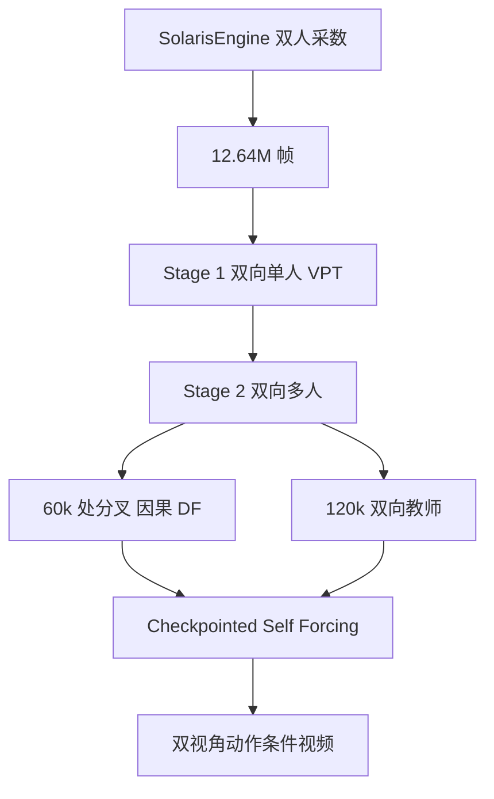

# Solaris：单智能体视角不够，多人世界模型要同时对上所有人的眼睛

<!-- release-date: 2026-02-25 -->

**本文依据**：`Solaris: Building a Multiplayer Video World Model in Minecraft`，arXiv `2602.22208v2`（2026-02-26，27 页）。作者 Georgy Savva、Oscar Michel（封面标 † 为项目负责人，顺序由抛硬币决定）、Daohan Lu 等；封面共同一作另含 Suppakit Waiwitlikhit；第一单位 New York University。项目页 `https://solaris-wm.github.io/`。首发日取 arXiv v1 提交日 2026-02-25；本地 PDF 页边为 `arXiv:2602.22208v2 [cs.CV] 26 Feb 2026`。文中数字标 `(PDF p. N)`；标「外部补充」的段落不来自本文。封面未印会议名。

## 一句话

现有动作条件视频世界模型一次只模拟一个智能体的眼睛。真实世界是多人的：一个人放方块、挖矿、转身，必须同时正确出现在其他人的画面里。Solaris 用自建的 SolarisEngine 采 **12.64M** 帧双人 Minecraft（每人 **6.32M**），把单人预训练视频 DiT 改成序列维交错的多人模型，再分四阶段从双向单人走到 Checkpointed Self Forcing。评测按移动、接地、记忆、建造、视角一致五项；完整 Solaris 在五项 FID 上都低于通道拼接的 Multiverse 式基线，建造 VLM 从 0.0 到 20.8、一致从 49.5 到 71.4（PDF p.1、p.6、p.15 表 2）。

## 一、矛盾：像素世界模型一直在「一个人看世界」

视频世界模型的用法很直白：过去画面加动作，生成下一步观察。作者列的用途是合成训练、推理时规划、策略学习与评测（PDF p.3）。卡点不是「视频好不好看」，而是：**今天的模型只模拟一个智能体的观察**。多人世界里，准确世界状态要同时覆盖所有人的视角（PDF p.3）。

Minecraft 被选作测试床，不是因为像素风格可爱，而是因为它把多人一致性逼到硬处：无界三维、遮挡、空间记忆、可改地形、怪物与天气的随机性，以及建造/挖掘/合成带来的组合复杂度（PDF p.3）。一个人挖掉一块矿，另一个人如果还看见那块矿，世界就已经裂了。

先前公开系统里，没有能采**带画面的**多人 Minecraft 对局。Malmo 有画面也号称多人，但低层动作几乎不可控；MineRL / MineDojo 有画面、无多人、同样不可控；Voyager 可控但无画面、无多人；Mineflayer 可控且多人，但没有图形输出。SolarisEngine 自称三项同时满足：可控、多人、真 Minecraft 画面（PDF p.6 表 1）。

相关工作里，作者认为当时唯一能模拟多智能体的视频世界模型是 Multiverse：U-Net，数据来自《GT4》一条「Tsukuba」赛道。Solaris 把他们的通道拼接设计拿来当对照，但环境换成开放三维 Minecraft（PDF p.4–5）。

全文主矛盾因此不是「再训一个更好看的 Minecraft 视频生成器」，而是：

**怎样让多个视角在同一世界里同时自洽——数据从哪来、网络怎么交换跨人信息、长时程自回归怎么训得动。**

（机制示意，根据 PDF p.9 图 6、p.5–10。）

## 二、数据：没有引擎，模型再巧也没有「同一世界」可学

### 2.1 为什么旧平台采不出能训世界模型的多人数据

RL 平台的动作空间太低层：不训策略就只能乱按。乱按在单人已经不像人，多人更像噪声。即便用 RL 训出能拿奖励的策略，画面也会偏向刷分，不一定多样、不像人（PDF p.6）。

Mineflayer 有寻路、放块、战斗这类可组合原语，Voyager 已经用它写高层智能体，但是单人、而且**不渲染**（PDF p.6–7）。SolarisEngine 补了两块：

1. **通信层**：让两个 bot 像人一样协作，把建造、脚手架、用工具、导航等高层原语拼成「双人完成一个目标」的 episode（PDF p.6 图 2）。
2. **相机 bot**：每个控制器 bot 配一个跑官方 Java 客户端、无头 GPU 渲染的相机 bot。服务端插件让相机镜像控制器的状态、动作甚至动画；事后用时间戳对齐动作与画面。实现上是两个进程，逻辑上是一个玩家。架构上声称可扩到任意人数，本文只跑两人（PDF p.7）。

整套东西装进 Docker Compose：控制器、相机、游戏服务器各一容器，Python 脚本并行拉多组 worker。episode 开始时传送到随机位置以换地形。Minecraft 会卡、会报错，所以有失败检测：任一端失败就全体中止当前局、换新状态接着采，不等人值守（PDF p.7）。

附录：Mineflayer 补了最近一次相机动作、攻击/使用/放置/热键事件；放块时对准方块面、非 Pathfinder 的看向命令加相机平滑。渲染从 libOSMesa CPU 换到 GPU：Normal 世界森林场景在 20 fps 下 CPU 无头会出现最多四帧重复；GPU 后流畅，还能用 NVENC 编码（PDF p.21）。

### 2.2 12.64M 帧长什么样

图 3：四类 episode——建造、战斗、移动、采矿；**9240** 局，每人 **6.32M** 帧，合计 **12.64M**。类型按「典型时长越长、抽样权重越低」随机抽。多数局 **128–512** 帧，即 **6.4–25.6** 秒（**20 fps**）（PDF p.6）。Superflat 与 Normal 各半。作者称这是第一份带动作标注、适合机器学习的多人 Minecraft 数据（PDF p.8）。

附录表 4 列出 14 种具体局型，例如两人合建房、互打 PvP、一人挖矿一人跟放火把、之字追逐（PDF p.21）。Normal 世界采了 6000 局，其中 340 局因传送落到水下；用水下氧气泡 HUD 做线性分类器过滤，作者报 100% 准确（PDF p.22）。

动作空间对齐 VPT 的 MineRL 风格，但缺两件：**开关背包**、**原始鼠标位移**（只记相对 pitch/yaw）。因此采不到背包 GUI 与合成。动作存的是语义动作而不是原始键鼠事件（PDF p.22 表 5）。相机分布被 Pathfinder 拉歪：Pathfinder 最大转速 **178 度/秒**，直方图偏向快速转头（PDF p.22–23 图 13）。

图 4 给建造房屋、PvE、追逐的时间切片；第三人称起止截图只供人看，不进训练集（PDF p.7）。

可迁移的第一点已经清楚：**多人世界模型的瓶颈经常在采数系统，不在 DiT 块。** 没有跨人同步的画面+动作，后面的共享注意力没有东西可对齐。

## 三、模型：不要把两人叠进通道，把两人排进同一条序列

### 3.1 形式

单人自回归扩散作用在潜帧 $x^{\\mathrm{SP}}\\in\\mathbb{R}^{H\\times W\\times C}$。多人把状态扩成玩家维 $P$，在形状 $(P,H,W,C)$ 的联合张量上扩散。$t$ 时刻联合状态 $\\mathbf{x}_t=\\{x_t^1,\\ldots,x_t^P\\}$，联合动作 $\\mathbf{a}_t=\\{a_t^1,\\ldots,a_t^P\\}$。序列 $\\mathbf{x}$ 形状 $(B,P,T,H,W,C)$，$\\mathbf{a}$ 形状 $(B,P,T,D)$（PDF p.8）。

$$
p_\\theta(\\mathbf{x})=\\prod_{t=1}^{T}p_\\theta(\\mathbf{x}_t\\mid \\mathbf{x}_{<t},\\mathbf{a}_{<t})
$$

本文钉死 $P=2$，但写法按任意 $P$（PDF p.8）。

条件流匹配损失（PDF p.8）：

$$
L_\\theta=\\mathbb{E}_{\\mathbf{x},\\mathbf{a},\\boldsymbol{\\sigma},\\epsilon}\\bigl\\|v_\\theta(\\mathbf{x}_{\\boldsymbol{\\sigma}},\\boldsymbol{\\sigma},\\mathbf{a})-(\\epsilon-\\mathbf{x})\\bigr\\|_2^2
$$

前向 $\\mathbf{x}_{\\boldsymbol{\\sigma}}=(1-\\boldsymbol{\\sigma})\\mathbf{x}+\\boldsymbol{\\sigma}\\epsilon$，$\\epsilon\\sim\\mathcal{N}(0,I)$。双向模型：全体玩家、全体帧共享一个噪声水平 $\\sigma\\sim U(0,1)$。因果模型用 Diffusion Forcing：每个玩家、每一帧独立抽 $\\sigma^{p,t}\\sim U(0,1)$（PDF p.9）。

### 3.2 从 Matrix Game 2.0 改过来

骨架是 Matrix Game 2.0：在多个游戏（含 Minecraft）上训过的单人可控视频 DiT。改动尽量少（PDF p.9 图 5）：

| 改什么 | 怎么改 | 为什么 |
|---|---|---|
| 动作空间 | 键盘动作模块输入维扩到完整 MineRL 动作，权重重初始化；动作模块按人独立，`B P T D → (B P) T D` | 原模型只有视角+WASD（PDF p.9–10） |
| 跨人信息 | 序列维交错两人的视觉 token；共享自注意力；每人独立 3D RoPE；层前加可学习 Player ID | 让「我放的块」出现在「你的画面」里（PDF p.8–9） |
| 首帧条件 | 交叉注意力保持 Matrix Game 2.0，按人独立 | 每人自己的起始观察（PDF p.9） |
| VAE | 全程冻结 Matrix Game 2.0 的 3D VAE | 所有阶段共用同一潜空间（PDF p.10） |

对照路线是 Multiverse 的**通道拼接**：把两人画面叠在通道维。Solaris 认为信息交换应走共享自注意力，而不是把两个视角焊成一张「更厚的图」（PDF p.8–9、p.14）。

图 1：模型只吃各玩家起始帧与细粒度动作；图上的「挖块 / 攻击 / 转向」是动作摘要。第三人称真值可视化**不进模型**（PDF p.3）。

## 四、四阶段课表：先会单人 Minecraft，再学「两人同一世界」

图 6 的阶梯（PDF p.9）：

| 阶段 | 做什么 | 步数 / 设定 | 产物 |
|---|---|---|---|
| 0 | Matrix Game 2.0 `base_distilled_model` | 预训练 | 多游戏双向视频 |
| 1 双向单人 | 在 VPT（超 2000 小时真人局）上双向微调，上下文 **33** 帧 | 120K 步，lr $1\\times 10^{-4}$，batch 64，v5p-128 | 完整 Minecraft 动作的单人初始化 |
| 2 双向多人 | 4.2 节结构 + 全序列扩散，自采数据 | 120k 步，batch 32，v5p-64；FID 在 held-out 上此处收敛 | Self Forcing 的教师 |
| 3 因果多人 | 双向训到 **60k** 时分叉；滑窗 **6** 个潜帧（**24** 真实帧）= 推理 KV 上限；Diffusion Forcing | 再 60k 步 | Self Forcing 生成器初始化 |
| 4 Self Forcing | 教师上下文长于学生；Checkpointed Self Forcing | 生成器 240 步 lr $3\\times 10^{-6}$；critic 1200 步 lr $3\\times 10^{-7}$ | 旗舰模型 |

（超参 PDF p.23 表 6。）

Stage 1 被实验证明不是可选项：去掉单人预训练，建造 VLM 仍是 0，接地从 62.5 掉到 29.2（PDF p.15 表 2）。原因很朴素：多人一致性建立在「已经会 Minecraft 物理与动作」之上；两人数据只有 12.64M 帧，撑不起从零学游戏。

Stage 3 故意比 CausVid 简单。标准 Self Forcing 初始化要 ODE 回归 + DMD 少步蒸馏。作者发现：**用因果掩码 + Diffusion Forcing 微调就够**，少步能力可以和稳定自回归一起在 Self Forcing 里学（PDF p.10、p.15）。表 3 里 ODE 回归一行几乎崩：移动 VLM 23.4、记忆 0.0。

教师继续独立训到 120k，学生从 60k 中间点出发——省时间，又保住一个更强的双向教师（PDF p.10）。

## 五、Checkpointed Self Forcing：让学生用得起「比自己更长的教师」

Self Forcing 用模型自己的滚出来监督，压训推不一致（PDF p.5）。原版要求学生上下文 = 教师上下文。Solaris 把教师加长，学生用滑窗生成，才能吃到长上下文教师（PDF p.10）。

朴素做法的内存是 $O(L_t\\cdot L_s)$：每一步一个重叠窗（帧 $1{:}L_s$，再 $2{:}L_s{+}1$，……），反传要同时留住所有窗。Jax 计算图里这些张量是冗余的（PDF p.10–11 图 7A）。

Checkpointed Self Forcing 拆成两段，类比梯度检查点（PDF p.10–11）：

1. **关梯度滚出**：自回归滑窗生成整段，缓存干净估计 $\\hat x_0^{1:N}$ 和最后的带噪状态。
2. **一次并行重算**：把干净帧和带噪帧在序列维拼成两倍长，套自定义 Teacher Forcing 掩码，一次前向模拟「每帧最后一步去噪」。内存落到 $O(L_t)$。

掩码要复现推理条件——带噪帧只看干净历史（PDF p.10–11 图 7C、p.27 算法 2）：

- 带噪 query 看同帧带噪 key，以及窗内更早的干净 key；
- 干净 query 只在干净侧做因果；
- 再加滑窗 $L_s$。

算法 1 用 diff 标出相对朴素 Self Forcing 的加减：滚出阶段 KV **不再** `stop_grad`；缓存的 $X_s$、$X_0$ 在重算前切断；重算那一步对 $G_\\theta$ 开反传（PDF p.12）。因为省了内存，作者还能对 KV 表征反传（算法 1 第 29 行）——原版 Self Forcing 通常在 KV 上停梯度。表 3 显示 KV-BP 把五项 FID 都压下来，代价是部分任务的动作跟随 VLM 下降（PDF p.11、p.15）。

并发工作 RELIC 也做长上下文教师 + 反传重算，但要多次滚动前向。Solaris 用掩码一次并行过（PDF p.5）。

附录 E.1 补原版 Self Forcing：流匹配里 $\\hat x_0=x_\\sigma-\\sigma v_\\theta(x_\\sigma,\\sigma)$；每步随机截断噪声水平 $\\sigma_{\\mathrm{stop}}$，DMD 打在截断后的干净估计上，扩散步数方向内存常数（PDF p.24）。

## 六、评测：五项都是「两人是否还在同一个世界」

held-out、训练没见过的局型。FID 看画质；「VLM 当裁判」问可验证的是非/方位题，答案对上已知真值才算对。VLM 标准差来自同一评测重复 3 次（PDF p.11、p.15）。

| 任务 | 在测什么 | VLM 怎么问 |
|---|---|---|
| Movement | WASD 平移与鼠标转头，在观察者视角里对不对 | 对方是靠近/远离/左/右；转头结束时对方在左/右/中 |
| Grounding | Superflat，面对面；一人转走再转回。静止者一直看着他，他应知道自己相对位置 | 转走时看不见对方，转回时看得见 |
| Memory | 两人都转走、停、转回 | 转走时双方都看不见，转回时都看见 |
| Building | 一人按预定形状（方或条）建造，另一人看 | 观察者是否看见约 6 格外的结构 |
| Consistency | Normal 世界，面对面后同时转 90°，同侧或对侧 | 同侧应「同一景色」，对侧应「不同」 |

（PDF p.12–13、p.25 表 7。）

真值视频上 VLM 并非 100%：移动平移 100.00，旋转 96.88，接地 96.88，记忆 92.71±1.47，建造 98.96±1.47，一致同侧 98.96±1.47、对侧 93.75±4.42（PDF p.25）。所以生成视频的 VLM 分有裁判噪声上限，不能当成环境里的绝对正确率。

## 七、实验：通道拼接会画，但世界对不齐

### 7.1 定性

图 9：滚到 224 帧。Solaris 还能打、地形纹理还在。Frame concat：第二人严重退化，第一人纹理被摊平。无预训练：人体复制、错误弹窗、塌进不真实水下（PDF p.13）。图 10：放置后方块计数同步、两人同时下雨、火把装备/放置与挖掘动画、复杂地形 PvP（PDF p.14）。动作序列来自训练集没有的 bot 对局；结束帧与游戏真值状态对齐（PDF p.13–14）。

### 7.2 架构表（PDF p.15 表 2）

| 方法 | Movement VLM / FID | Grounding | Memory | Building | Consistency |
|---|---|---|---|---|---|
| Frame concat | 77.1±2.9 / 68.9 | 53.1±0.0 / 66.6 | 37.5±2.6 / 74.4 | 0.0±0.0 / 103.2 | 49.5±5.3 / 129.4 |
| Solaris w/o pretrain | 69.3±0.7 / 42.5 | 29.2±1.5 / 49.9 | 18.8±0.0 / 67.8 | 0.0±0.0 / 86.6 | 49.5±3.2 / 121.4 |
| Solaris | 68.2±2.7 / **38.5** | **62.5±0.0 / 38.0** | 37.5±2.6 / **55.1** | **20.8±1.5 / 83.6** | **71.4±7.1 / 99.4** |

五项 FID 完整 Solaris 都最低。难项（建造、一致、接地）VLM 也最高。移动 VLM 反而是 concat 最高（77.1 vs 68.2）；作者定性说 concat 在 **no-op** 时会幻出动作（PDF p.15）。无预训练建造仍是 0——单人 VPT 阶段不是锦上添花。

### 7.3 Self Forcing 消融（PDF p.15 表 3）

| Init. | Pre-DMD | KV-BP | Movement VLM / FID | Grounding | Memory | Building | Consistency |
|---|---|---|---|---|---|---|---|
| ODE Reg | × | ✓ | 23.4±1.5 / 65.3 | 3.1 / 56.6 | 0.0 / 99.5 | 3.1 / 95.7 | 49.0±4.2 / 142.3 |
| Causal FT | ✓ | ✓ | 21.4±2.7 / 49.1 | 3.1 / 40.4 | 0.0 / 55.7 | 8.3±1.5 / 90.5 | 55.2±3.7 / 160.1 |
| Causal FT | × | × | **78.6±0.7** / 60.3 | **72.9±1.5** / 55.2 | **49.0±2.9** / 63.8 | 15.6±0.0 / 87.4 | 70.8±6.6 / 105.1 |
| Causal FT | × | ✓ | 68.2±2.7 / **38.5** | 62.5 / **38.0** | 37.5±2.6 / **55.1** | **20.8±1.5 / 83.6** | **71.4±7.1 / 99.4** |

读法：

- ODE 初始化与 Self Forcing 前再做少步 DMD，都伤得厉害。
- 关掉 KV-BP，动作跟随 VLM 在移动/接地/记忆上更高，但 FID 全面更差，建造/一致也不如开 KV-BP 的旗舰。
- 旗舰选的是「画质与难项语义」，不是「所有 VLM 最高」。作者自己写了这点权衡（PDF p.15）。

## 八、局限：合成数据，而且世界没有持久状态

结论承认三件事做成了：可扩展采数、单人到多人课表、Checkpointed Self Forcing。平台还可多人、可给 VLM/VLA 供数、可训感知-动作统一模型、可做神经符号、可当 3D 理解/规划/记忆基准（PDF p.15）。

限制写得很硬（PDF p.16）：

1. **训练数据全是合成的。** 动作分布与视觉分布都有缺口（相机被 Pathfinder 拉成高速转头；无背包 GUI）。单人预训练有用，但怎样更充分用海量单人数据，留给后续。
2. **没有持久记忆。** 两人离开彼此视野，共享上下文丢失，轨迹开始分叉。
3. **不是游戏引擎。** 世界只由两张初始帧指定，没有可控制、可保持的底层环境状态。

社会影响/风险没有单独展开。评测 VLM 在真值上已有缺口（记忆 92.71、对侧一致 93.75），生成分要带着裁判误差读。Building 即便旗舰也只有 20.8 VLM、FID 83.6——多人「改世界」远未解决。

开源：引擎、模型代码、HF 数据与权重集合都印在封面（PDF p.1）。

## 可迁移

- **多人世界模型先解决「同一世界的同步记录」。** 控制器+相机进程、时间戳对齐、失败即整局作废，比先改 DiT 更底层。
- **跨人信息走序列维共享注意力，而不是通道拼接。** 表 2 里 concat 移动 VLM 可以更高，建造却是 0。
- **先单人学会游戏，再多人学一致性。** 12.64M 双人帧不够从零学 Minecraft。
- **教师可以比学生长，但滑窗反传必须检查点。** 内存 $O(L_t L_s)\\to O(L_t)$ 之后，才谈得上 KV 反传。
- **CausVid 的 ODE + 少步蒸馏不是 Self Forcing 的必经之路。** 因果 DF 微调可以当生成器初始化；表 3 显示乱加 Pre-DMD 会把记忆打到 0。
- **FID 与 VLM 会打架。** KV-BP 降 FID、降部分动作 VLM；选旗舰要先决定评的是画质还是跟随。
- **像素世界模型没有隐式游戏状态。** 出视野即丢共享上下文——若下游要规划，还得另接记忆或符号状态。
- **VLM 裁判先在真值上标定。** 表 7 的 GT Acc 是读表 2/3 的分母。

## 关键词回看

- **视频世界模型**：用视频扩散模拟「观察+动作 → 下一观察」，本文强调与抽象潜动态/规划式世界模型的差别。
- **SolarisEngine**：Docker 化的双人 Minecraft 采数；Mineflayer 控制 + 官方客户端渲染。
- **序列维交错 / Player ID**：多人 token 排进同一自注意力，用 ID 区分是谁的眼睛。
- **Checkpointed Self Forcing**：先无梯度滚出再掩码并行重算，把长教师滑窗的反传内存压下来。
- **Diffusion Forcing**：逐帧独立噪声水平，让双向扩散长出因果生成。
- **VLM as a judge**：对生成视频问有标准答案的题，测语义是否跟任务走。

## 参考资料

- 原件：`readings/_src/世界模型与 Agent/Solaris.pdf`（arXiv `2602.22208v2`）
- 项目页：`https://solaris-wm.github.io/`
- 引擎：`https://github.com/solaris-wm/solaris-engine`
- 模型代码：`https://github.com/solaris-wm/solaris`
- 数据集合：`https://huggingface.co/collections/nyu-visionx/solaris-data`
- 模型集合：`https://huggingface.co/collections/nyu-visionx/solaris-models`
