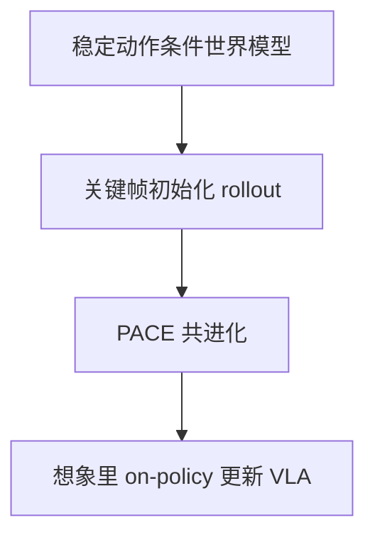

# WoVR：不假设世界模型忠实，管制 RL 怎么用不完美的想象动力学

<!-- release-date: 2026-02-15 -->

**本文依据**：`WoVR: World Models as Reliable Simulators for Post-Training VLA Policies with RL`，arXiv `2602.13977v1`（2026-02-15，21 页）。作者 Zhennan Jiang、Shangqing Zhou、Yutong Jiang、Zefang Huang、Mingjie Wei、Yuhui Chen、Tianxing Zhou、Zhen Guo、Hao Lin、Quanlu Zhang、Yu Wang、Haoran Li、Chao Yu、Dongbin Zhao；Jiang 与 Zhou 共同一作，通讯 Haoran Li、Chao Yu、Yu Wang。第一作者最低编号单位 Institute of Automation, Chinese Academy of Sciences（封面另列 University of Chinese Academy of Sciences、Zhongguancun Academy、Infinigence AI；编号 1 为 Tsinghua university，属通讯 Yu Wang / Chao Yu）。项目 `https://github.com/RLinf/RLinf`、`https://huggingface.co/Collections/RLinf/wovr`。首发日取本地 PDF 页边 `arXiv:2602.13977v1 [cs.RO] 15 Feb 2026`。文中数字标 `(PDF p. N)`；标「外部补充」的段落不来自本文。封面未印会议名。

## 一句话

闭环想象 rollout 的幻觉不只是画面坏——它会腐蚀优化信号，让策略去挖模型漏洞而不是真任务。WoVR 不假设世界模型忠实，而是从模拟器、交互协议、策略–模型对齐三层管制 RL 怎么用不完美想象动力学。骨干 Wan2.2-TI2V-5B，Keyframe-Initialized Rollouts 加 PACE 共进化。表 1 上 WoVR Rollout 256：FPS 23.0、LPIPS 0.063、FID 24.378、FVD 50.041、FloLPIPS 0.102（PDF p.11）。表 2 LIBERO 平均成功率 base 39.9 → WoVR 69.2（相对 +29.3；摘要写 39.95%→69.2%，以表为准）（PDF p.12）。表 3 真机 30 trial：base 平均 61.7 → WoVR 91.7（+30.0）（PDF p.13）。训练与评测 8×H100（PDF p.10）。

## 一、矛盾：幻觉会改优化目标，不只改画面

视觉–语言–动作（Vision–Language–Action，VLA）策略多半靠模仿学习。演示覆盖不到的地方，策略就到顶。强化学习能抬天花板，但 PPO / GRPO 这类 on-policy 方法要大规模并行交互；真机贵、慢、还常要人盯，物理仿真又很难对齐接触丰富的操作（PDF p.1–2）。

于是有人把预训练视频生成器当模拟器，策略完全在想象里训。问题是：学来的世界模型**不是忠实模拟器**。本文把幻觉定义成闭环交互里想象结果与真实结果的系统性错位：画面可以很像，状态转移却物理上错，甚至给出假成功（PDF p.2 图 1）。

两条机制把误差放大：

- **自回归反馈**：下一步条件是自己刚生成的脏帧，早期小错被放大。
- **分布漂移**：策略一变，动作就离开世界模型训练分布，越滚越 OOD。

若把幻觉轨迹直接拿去算优势，强化学习会被激励去**利用模型系统性错误**，而不是任务进度。全文主矛盾因此不是「再训一个更像的视频生成器」，而是：**世界模型注定会幻觉，RL 怎样在不完美想象动力学下仍然可靠。**

作者的立场：这首先是可靠性问题，不是建模问题。要管三层——可控模拟器、可靠交互协议、策略–模型对齐。WoVR 建在 RLinf 上，不假设世界模型忠实，只管制 RL 怎么跟它互动（PDF p.2–3）。

（机制示意，根据 PDF p.5 图 2。）

相关工作把这条路拆开看：真机 on-policy 不现实；通用世界模型多面向导航、Self-Forcing/DMD、难从零训；具身侧虽有末端投影、AdaLN、交叉注意力、MoE 注入，仍慢、长程易崩、细粒度接触不稳。World-Env、WMPO 把世界模型当模拟器替换件，机械耦合 on-policy 与想象 rollout，没有专门管 rollout 长度、成功后幻觉、或把优化限制在模型可靠区间（PDF p.3–4）。

## 二、问题形式：WM-MDP 里滚闭环

VLA 后训练写成 MDP $M=(O,A,P,R,\gamma)$。时刻 $t$ 看观测 $o_t$ 和语言 $l_t$，策略吐一块动作 $a_t\sim\pi_\theta(\cdot\mid o_t,l_t)$，环境给下一观测和标量奖励。目标是期望折扣回报（PDF p.4 式 1–3）。

把真实转移换成学来的世界模型，得到 WM-MDP：

$$
M_{\mathrm{WM}}=(O,A,\hat P_\phi,\hat R_\psi,\gamma)
$$

下一观测 $\tilde o_{t+1}\sim\hat P_\phi(\cdot\mid o_t,a_t)$，奖励 $\tilde r_t=\hat R_\psi(\tilde o_{t+1})$。优化目标形式不变，期望改在 $\hat P_\phi$ 上（PDF p.4–5 式 4–6）。策略全程在想象里闭环。

## 三、模拟器：双通道动作注入 + 首帧锚定

长程 chunk-by-chunk 自回归会漂：全局结构走样、背景塌。WoVR 先把模拟器做成**动作可控、滚得住**（PDF p.6）。

**骨干**是 Wan2.2-TI2V-5B 视频扩散。具身仿真要动作因果，不能只做图生视频。每个 DiT 块两条路注入动作（PDF p.6 图 3）：

1. 动作嵌入与扩散时间步融合，走 AdaLN-Zero 风格调制，在特征上改去噪。
2. 原来的交叉注意力里，文本嵌入换成动作嵌入，给全局条件。

**首帧锚定**。每步条件是 $[o_0,o_{t'-c':t'}]$：整段初始参考帧 + 上一 chunk 最近记忆帧。许多自注意力头去噪时会盯第一帧（PDF p.6–7 图 4）。流程：Wan 编码器得到 $[z_0,z_{t-c:t}]$，对下一 chunk 采高斯噪声，拼进动作条件 DiT，解码未来帧再接到上下文上，一块一块滚（PDF p.7）。

训练用 Rectified Flow：预测速度 $v_t$（PDF p.7 式 7）。非参考上下文潜变量训练时再注扩散噪声，逼模型别脆复制上下文，缩小闭环训推差。

奖励侧：真机难做稠密奖励，用稀疏成功。奖励分类器看下一观测，阈值 0.5 出 0/1（PDF p.7 式 8）；轻量网络、BCE，做法跟 HiL-SERL。幻觉成功会直接进这个二值信号——所以后面必须 mask。

## 四、交互：关键帧初始化 + 成功后 mask 的 GRPO

从 $o_0$ 滚全程，早期误差叠完，世界模型会给出「看起来成功、物理上失败」的假胜利（PDF p.8 图 5）。Keyframe-Initialized Rollouts（KIR）把一部分轨迹从任务关键中间态 $o_k$ 起步，尤其是当前策略的失败态。决定性接触往往就在附近；从 $o_0$ 滚等于先让模型猜很长前缀，错已经铸成。

策略更新用 GRPO。一组想象轨迹算组相对优势。幻觉常在想象成功之后占主导，所以 **mask 成功后的步，并按有效长度归一化**（PDF p.8–9 式 9–11）。KIR 轨迹有效步更短，归一化后每步权重大，梯度被短、任务关键段主导，而不是长、易漂的尾巴。

## 五、对齐：PACE 低频共进化，不是每步改动力学

策略一优化，动作分布就离开训世界模型的数据。PACE（Policy–Aligned Co-Evolution）不把世界模型当死模拟器。先用基座 VLA 轨迹训 $\mathrm{WM}_{\mathrm{Base}}$；在里面做完第一段策略优化后，用进化后策略再采有限 rollout，精炼成 $\mathrm{WM}_{\mathrm{Evo}}$（PDF p.9）。精炼只做一次或极低频——区别于经典模型基 RL 的高频改动力学。好处：策略训练期不必持续真人监督和 reset；又能把模拟器拉回当前策略分布。

系统：RLinf 的环境后端换成这个世界模型。附录 A：Generation / Simulator / Training 共置同一组 GPU；世界模型是网络，offload 只搬参数。具身闭环若每步 offload 会贵，改成 **只在 rollout 阶段一头一尾** 搬 Generation 与 Simulator（PDF p.21 图 8）。

## 六、实验设定：Q1 画质、Q2 LIBERO、Q3 真机

三问：模拟器稳不稳、可控不可控、快不快；策略能不能超过已有世界模型 RL；想象里训出的策略能不能上真机（PDF p.9–10）。

世界模型指标：LPIPS、FID、FVD、FloLPIPS，外加吞吐 FPS。策略主指标是成功率 SR，固定初始条件多次独立 rollout。对照：画质侧 EVAC、Cosmos-Predict2、OpenSora（WMPO 骨干）；策略侧 OpenVLA-OFT-base、同预算真环境 GRPO、WMPO。世界模型方法各自模拟器里训到收敛；GRPO 同 rollout 预算。全部实验 8 张 NVIDIA H100（PDF p.10）。

Q1 数据：LIBERO 上 3000 条 VLA rollout、各 512 帧训世界模型，200 条同长度留作评测。评测协议统一：4 帧视觉上下文 + 8 步动作 chunk，自回归生成后续 8 帧；第一块只有一张图时复制填满上下文。EVAC 用绝对末端动作，其余用残差动作（PDF p.10–11）。

Q2：LIBERO Spatial / Object / Goal / Long，各 10 任务。基座跟 SimpleVLA-RL：OpenVLA-OFT 再做 one-trajectory SFT。每套真环境预算 2500 条：先用基座采 1500（每任务 150）训 $\mathrm{WM}_{\mathrm{Base}}$，想象优化后再采 1000 精炼 $\mathrm{WM}_{\mathrm{Evo}}$，实践中只共进化一步。WMPO / WoVR 这 2500 条只训世界模型，策略优化全程想象、不再碰真模拟器；GRPO 把同一预算花在 on-policy 真交互（PDF p.11–12）。

Q3：Franka Emika Panda。Pick Banana（香蕉放到盘子）、Pick Bread（面包放到标记）。每任务 10 条遥操作演示预训练基座，再采 150 条基座 rollout 训世界模型。部署后每任务 30 次独立 trial（PDF p.12–13）。

## 七、主结果：表赢摘要里的 39.95

**表 1**（PDF p.11）。FPS 印在 256 行；512 / 128 行同方法共用该 FPS。越低越好的是 LPIPS / FID / FVD / FloLPIPS。

| 方法 | Rollout | FPS↑ | LPIPS↓ | FID↓ | FVD↓ | FloLPIPS↓ |
|---|---|---|---|---|---|---|
| EVAC | 512 | | 0.146 | 46.528 | 345.818 | 0.205 |
| EVAC | 256 | 2.7 | 0.130 | 49.153 | 354.983 | 0.192 |
| EVAC | 128 | | 0.106 | 44.337 | 423.132 | 0.166 |
| Cosmos-Predict2 | 512 | | 0.315 | 165.862 | 275.737 | 0.265 |
| Cosmos-Predict2 | 256 | 3.50 | 0.226 | 106.324 | 203.853 | 0.306 |
| Cosmos-Predict2 | 128 | | 0.164 | 77.555 | 304.456 | 0.281 |
| OpenSora | 512 | | 0.105 | 38.478 | 89.391 | 0.156 |
| OpenSora | 256 | 7.00 | 0.082 | 33.577 | 94.998 | 0.122 |
| OpenSora | 128 | | 0.069 | 33.413 | 111.643 | 0.113 |
| WoVR | 512 | | 0.091 | 34.252 | 68.011 | 0.154 |
| WoVR | 256 | 23.0 | 0.063 | 24.378 | 50.041 | 0.102 |
| WoVR | 128 | | 0.047 | 18.553 | 39.047 | 0.079 |

WoVR 各长度四项画质都最低（越好）。骨干约 5B，大于 OpenSora 约 1.3B，但只需 5 步扩散、3D VAE；OpenSora 采样步更多、2D VAE，所以 WoVR 更快（PDF p.11）。

**表 2**（PDF p.12）。成功率 %。括号是相对 base。摘要写平均 39.95%→69.2%；**表 2 Avg 是 39.9，以表为准。**

| 方法 | Spatial | Object | Goal | Long | Avg↑ |
|---|---|---|---|---|---|
| OpenVLA-OFT-base | 61.5 | 36.3 | 48.2 | 13.7 | 39.9 |
| GRPO (online) | 66.6 | 45.1 | 52.1 | 14.5 | 44.6 |
| WMPO | 67.8 | 48.0 | 54.6 | 13.7 | 46.2 |
| WoVR | 81.5（+20.0） | 82.0（+45.7） | 77.5（+29.3） | 35.8（+22.1） | 69.2（+29.3） |

正文说 GRPO 每次更新接近一千条额外模拟器轨迹，样本效率差。WMPO 在短中程套件有收益，Long 上 13.7 与 base 持平——后段自回归不稳把优化弄坏。WoVR 四套都最高，Long 也 +22.1（PDF p.12）。

**表 3**（PDF p.13）。30 trial。正文写 46.67 / 76.67，**以表为准**。

| 方法 | Pick Banana | Pick Bread | Avg |
|---|---|---|---|
| OpenVLA-OFT-base | 46.7（14/30） | 76.7（23/30） | 61.7 |
| WoVR | 93.3（28/30）（+46.6） | 90.0（27/30）（+13.3） | 91.7（+30.0） |

策略优化期不再额外在线交互。Banana 从 14/30 到 28/30，Bread 从 23/30 到 27/30。

## 八、消融：拿掉锚、噪声、KIR、PACE 各垮一截

表 4 只在 LIBERO-Spatial：1500 条训世界模型，24 条留测（PDF p.13–14）。

| 变体 | Rollout | LPIPS↓ | FID↓ | FVD↓ | FloLPIPS↓ |
|---|---|---|---|---|---|
| WoVR | 512 / 256 / 128 | 0.091 / 0.069 / 0.051 | 36.687 / 27.238 / 20.780 | 73.493 / 63.948 / 49.017 | 0.154 / 0.110 / 0.081 |
| 无参考帧 | 512 / 256 / 128 | 0.133 / 0.089 / 0.064 | 73.942 / 49.406 / 35.559 | 123.502 / 86.000 / 86.146 | 0.168 / 0.116 / 0.090 |
| 记忆 1 帧 | 512 / 256 / 128 | 0.120 / 0.086 / 0.065 | 64.501 / 46.790 / 36.047 | 86.042 / 81.742 / 79.605 | 0.165 / 0.117 / 0.095 |
| 无噪声上下文 | 512 / 256 / 128 | 0.099 / 0.074 / 0.054 | 44.712 / 31.691 / 23.444 | 77.284 / 61.660 / 58.836 | 0.160 / 0.115 / 0.085 |

无参考帧长程掉得最狠；无噪声上下文短程还行、越长差距越大。图 7：无锚或无噪声会出现空间漂移和物体消失，完整模型更贴真值（PDF p.15）。

表 5 同套件上的策略消融（PDF p.16）：

| 方法 | 成功率↑ |
|---|---|
| WoVR | 0.815 |
| 无 KIR | 0.782 |
| 无 PACE | 0.710 |

0.815 与表 2 Spatial 81.5% 一致。去掉 KIR 到 0.782；去掉共进化到 0.710——策略分布一漂，固定模拟器更伤。

## 九、限制与可迁移

结论自己划边界：幻觉只是压住，没有消掉，极长程或高接触仍会出问题；还依赖学来的奖励模型和有限真数据精炼，更宽的可靠性保证是开放问题（PDF p.16）。封面没写会议。奖励是阈值化二值分类，假成功一旦过 0.5 就会进 GRPO，全靠 mask 与 KIR 挡；PACE 实践中只精炼一次，不是持续对齐。

可迁移、不绑死这篇设定的几条：

- **幻觉当优化故障，不当生成故障。** 画面好仍可能给假 $r$。管 RL 怎么用模型，比只卷 FID 更贴「当模拟器」。
- **缩短有效误差深度。** KIR 把学习集中到接触附近，比逼模型从 $o_0$ 滚对全程更便宜。
- **成功后不要再训。** 想象成功之后往往是幻觉高发区；mask + 按有效长度归一，让短关键段主导梯度。
- **低频共进化。** 策略一变就 OOD；不必每步改动力学，采一轮进化后轨迹精炼模拟器，真机开销可控。
- **首帧锚定 + 脏上下文训练。** 自回归滚自己的帧时，固定参考压全局布局，训练时给记忆帧加噪缩小训推差。
- **共置 GPU 不要每步 offload。** 神经网络模拟器没有物理状态要迁；闭环阶段头尾搬一次即可（PDF p.21）。

## 十、关键词回看

- **VLA**：观测 + 语言直接出动作。
- **WM-MDP**：转移和奖励都来自学来的世界模型。
- **幻觉**：闭环里想象与真实结果的系统性错位，含假成功。
- **KIR**：从任务关键帧、尤其失败态起步，缩短有效预测深度。
- **masked GRPO**：成功后步不算，按有效长度归一。
- **PACE**：$\mathrm{WM}_{\mathrm{Base}}\to\mathrm{WM}_{\mathrm{Evo}}$ 的低频策略对齐精炼。
- **首帧锚定**：上下文始终带 $o_0$。
- **双通道动作注入**：AdaLN 调制 + 动作交叉注意力。

## 参考资料

- 原件 PDF：`readings/_src/世界模型与 Agent/WoVR.pdf`
- arXiv：`https://arxiv.org/abs/2602.13977`
- 代码：`https://github.com/RLinf/RLinf`
- 权重集合：`https://huggingface.co/Collections/RLinf/wovr`
