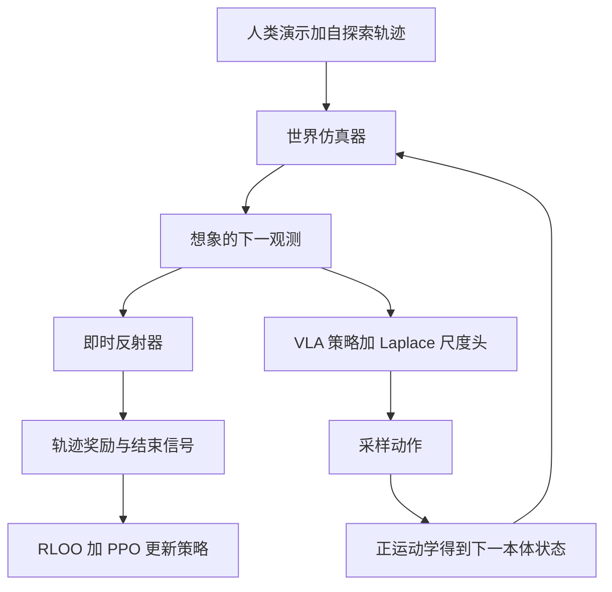

# World-Env：世界模型当虚拟环境，给 VLA 做后训练

<!-- release-date: 2025-09-29 -->

**本文依据**：`World-Env: Leveraging World Model as a Virtual Environment for VLA Post-Training`，arXiv `2509.24948v6`（16 页）。作者 Junjin Xiao、Yandan Yang、Xinyuan Chang、Ronghan Chen、Feng Xiong、Mu Xu、Wei-Shi Zheng、Qing Zhang；第一作者最低编号单位 **School of Computer Science and Engineering, Sun Yat-sen University**（封面另列 AMap, Alibaba Group 与教育部重点实验室；实习脚注写第一作者实习在 AMap）。封面印 `arXiv:2509.24948v6 [cs.RO] 27 Apr 2026`，无会议名。`release-date` 取 v1 公开日 2025-09-29。文中数字标 `(PDF p. N)`。代码页印 `https://github.com/amap-cvlab/world-env`（PDF p.1，原文 URL 被断行）。

## 一句话

模仿学习的 VLA 在少样本上掉得很快；真机 RL 又不可重置、贵、不安全。World-Env 把世界模型当可回滚的虚拟环境：几何一致的未来帧仿真器出下一张图，VLM 引导的即时反射器给连续奖励并判断何时停手。LIBERO 每任务只用 5 条专家轨迹，OpenVLA-OFT 后训练后均分成功率 79.6%，高于同设定 SFT 的 74.85%（PDF p.5 表 1）。真机四任务也全部高于 SFT（PDF p.7 表 3）。和必须进仿真器的 RIPT-VLA 比，数字接近，作者强调这边能落到真机（PDF p.6 表 2）。

## 主矛盾：要交互，但不能碰真世界

VLA 把语言指令接到低层电机指令。主流做法是在预训练视觉–语言模型上做模仿学习（PDF p.1–2）。演示一少，新物体、新任务就垮。

强化学习能靠交互补数据，但两条现成路都卡死（PDF p.2 图 2）：

- **真机**：状态改了很难还原，工业场景一次失败可能就是报废件。
- **传统仿真器**：建模贵、sim-to-real 差、换物体就要重搭。

作者问：有没有既不碰真机、又比仿真器更懂语义的试验场？答案是带动作条件的视频世界模型：给定当前画面和动作，想象下一帧，策略在梦里试，不必把杯子真的打翻（PDF p.2）。

还有第三个矛盾：现有 VLA 常常**不知道任务已经做完**。图 8 里「把酒瓶放到柜顶」已经成功，后续冗余动作又把酒瓶碰掉（PDF p.8）。所以环境不仅要出下一帧，还要能喊停。

World-Env 因此是两块（PDF p.1–2）：

1. **物理一致的世界仿真器**：动作条件的未来帧预测。
2. **VLM 引导的即时反射器**：连续奖励，并在语义对齐超过阈值时发结束信号。

（机制示意，根据 PDF p.3 图 3、p.4 第 4 节。）

## 策略侧：确定性 VLA 外挂一层噪声

基座跟 OpenVLA-OFT：视觉–语言骨干抽特征，轻量动作头出连续控（PDF p.3 式 1）：

$$a_t=\pi_\theta(o_{1:t},s_{1:t},g)$$

$o$ 是 RGB，$s$ 是本体（6D 末端位姿加 1D 夹爪），$g$ 是语言指令。策略本身是确定性的。探索靠另训一个尺度头，把动作写成 Laplace 分布：位置是 $\mu_t$（OFT 动作），尺度是 $\beta_t$（PDF p.4、附录图 9）。采样：

$$a_t\sim\mathrm{Laplace}(\mu_t,\beta_t)$$

世界仿真器吃的不是原始动作向量，而是正运动学算出的下一本体状态 $s_{t+1}$，再预测 $o_{t+1}$。想象观测加新本体状态喂回策略，直到达到最大步数，或反射器确认成功（PDF p.4）。

这是可迁移的拆法：**视觉动力学用世界模型，关节几何用正运动学**。世界模型不必再学机器人运动学。

## 世界仿真器：动作图画上去，VGGT 把几何钉住

图 4（PDF p.4）：动作先投影成 **action map**——前景是末端位姿标记，背景全黑，用来拉对比、少干扰场景。再从记忆库抽一张历史观测，和 action map 一起当像素级条件，送进 U-Net 去噪扩散。

几何要稳，作者走双路交叉注意力（PDF p.4）：

- **VGGT**：细几何和空间布局。
- **CLIP**：高层语义。

只靠 LIBERO 成功演示，世界模型见不到失败态，策略一旦偏了就跟丢。他们用已 SFT 的 OpenVLA-OFT 在 LIBERO 仿真器里跑，再加 Laplace 扰动，收集失败和次优转移，和成功人类轨迹拼成训练集聚（PDF p.4）。图 6 对比：没有额外数据时，手臂跟踪和接触后的物体状态糊掉；加了失败轨迹才像样（PDF p.6）。

附录表 9 的生成指标（PDF p.11）：

| 设定 | FID↓ | FVD↓ | PSNR↑ | SSIM↑ | LPIPS↓ |
|---|---:|---:|---:|---:|---:|
| 无额外数据 | 100.9978 | 116.7792 | 20.1600 | 0.7450 | 0.1385 |
| 无 VGGT | 70.9232 | 114.5264 | 23.1841 | 0.8219 | 0.0806 |
| DINO | 41.7398 | 74.9209 | 23.4069 | 0.8511 | 0.0602 |
| SAM | 40.6276 | 74.0298 | 23.6022 | 0.8532 | 0.0599 |
| CLIP+VGGT（本文） | 39.1941 | 73.5313 | 23.8343 | 0.8579 | 0.0562 |

VGGT 比 SAM/DINO 略好；没有额外数据则 FID/FVD 明显更差。表 8：给世界模型输出加高斯噪声（均值 0、方差 0.1）或颜色扰动后，LIBERO-Spatial 成功率从 87.6 掉到 85.4 / 87.0，作者说早期脏预测还能扛（PDF p.11）。

训练数据分布（PDF p.11 图 11）：成功 12876 条、失败 7134 条，约 64.3% / 35.7%。成功轨迹长度呈双峰，这是他们做动态终止的动机之一。

世界模型在策略学习时**冻结**，只用离线数据训好，当环境用（PDF p.3）。这和「边训策略边训世界模型」不是同一条路。

## 即时反射器：连续分，而不是 0/1

旧后训练常用仿真器给的二元成功信号。全成或全败时，batch 里优势估计塌成 0，没有梯度（PDF p.5）。反射器对想象视频 $o_{1:t}$ 和指令 $g$ 出 $[0,1]$ 的逐步完成概率（PDF p.4–5 式 4）：

$$R(o_{1:t},g)=\sigma(R_\theta(h_t))$$

冻结视觉编码器抽 patch，冻结 LLM 做跨模态推理，轻量奖励头吃池化嵌入。结束条件：$R>\eta$，$\eta=0.5$（PDF p.5）。

标签来自 LIBERO 专家轨迹和仿真器里的策略轨迹，逐步二元完成标记，奖励头用 BCE（PDF p.5）。**RL 时奖励却用得很稀疏**：整条轨迹只在终止步（或走到 $T$）记一个标量回报（PDF p.5）。逐步头是为了会喊停；优化器仍吃一条轨迹一个数。

附录：骨干是冻结的 LLaVA，均匀抽 32 帧，中心裁到 $384\times384$，提示词要求只答 Yes/No，sigmoid 当完成概率。奖励头 batch 8、学习率 $1\times10^{-4}$、Adam、50 epoch（PDF p.9）。表 7：$\eta=0.5$ 时准确率 0.925、精确率 0.867、召回 0.928、F1 0.896，比 0.2/0.4/0.6/0.8 更均衡（PDF p.10）。

尺度头本身：和动作头同结构 MLP，NLL 拟合 Laplace；batch 8、学习率 $5\times10^{-4}$、1000 步（PDF p.9 式 7–9）。

## 后训练：世界里 rollout，RLOO 估优势，PPO 更新

三阶段：生成轨迹、估优势、更新策略（PDF p.5–6）。每条初始状态采 $N$ 条 rollout，行为策略 $\pi_\phi$ 固定为迭代开始时的策略。轨迹奖励 $R_n$ 来自反射器。Leave-One-Out 基线（PDF p.6 式 5）：

$$b_n=\frac{1}{N-1}\sum_{j\neq n}R_j,\quad A_n=R_n-b_n$$

重要性比是当前与行为 Laplace 密度之比。PPO 裁剪目标（PDF p.6 式 6），$\epsilon=0.1$，优势广播到整条轨迹所有时间步。完整伪代码在附录算法 1（PDF p.10）。

实现（PDF p.6）：8 张 NVIDIA H20（各 96 GB），大约 48 小时。LoRA rank 32 训视觉–语言骨干，动作头和尺度头全参。batch 4。LoRA 学习率 $1\times10^{-4}$，动作/尺度头 $1\times10^{-5}$。每轮 $N=8$ 条 rollout。

## 实验：少样本、停手、真机

LIBERO 四套：Spatial / Goal / Object / Long（LIBERO-10）。每套 10 任务，每任务训练 50、测试 50；本文 **OpenVLA-OFT 只用训练拆分里 5 条**，测试仍走全测试集（PDF p.7）。基线全部按同一 5 轨迹约束重训。

### 表 1：5 条演示的主结果

成功率（PDF p.5 表 1）：

| 方法 | Goal | Object | Spatial | Long | Average |
|---|---:|---:|---:|---:|---:|
| $\pi_0$ | 67.6 | 68.4 | 80.2 | 28.2 | 61.1 |
| $\pi_0$+FAST | 59.2 | 76.8 | 59.2 | 24.8 | 55.0 |
| OpenVLA | 73.2 | 55.0 | 82.4 | 32.2 | 60.7 |
| UniVLA | 82.0 | 76.2 | 84.4 | 56.4 | 74.75 |
| OpenVLA-OFT | 84.0 | 74.2 | 84.2 | 57.0 | 74.85 |
| OFT + 后训练（本文） | 86.4 | 86.6 | 87.6 | 57.8 | 79.6 |

Long 几乎没动（57.0 → 57.8），增益主要在 Object（74.2 → 86.6）。图 5 三条多目标任务上，大约 20 个训练步就压过 SFT（PDF p.5）。

### 表 2：和仿真器 RL 比，不是全面赢

RIPT-VLA 必须进仿真器（PDF p.6 表 2）：

| 方法 | Goal | Object | Spatial | Long |
|---|---:|---:|---:|---:|
| RIPT-VLA | 86.2 | 83.4 | 88.6 | 58.4 |
| 本文 | 86.4 | 86.6 | 87.6 | 57.8 |

Object 更高，Spatial / Long 略低。作者卖点是「数字接近且能上真机」，不要把表 2 读成全面超过 RIPT。

### 表 4：强制跑满地平线，停手才是大头

没有真值结束信号时，基线必须跑满最大步数，本文用反射器停。成功率（PDF p.8 表 4）：

| 方法 | Goal | Object | Spatial | Long | Average |
|---|---:|---:|---:|---:|---:|
| $\pi_0$ | 55.4 | 71.0 | 72.6 | 20.6 | 54.9 |
| $\pi_0$+FAST | 21.2 | 74.0 | 44.8 | 15.0 | 38.75 |
| OpenVLA | 68.4 | 47.4 | 59.8 | 26.6 | 50.55 |
| UniVLA | 72.0 | 75.2 | 66.4 | 48.0 | 65.4 |
| OpenVLA-OFT | 67.4 | 73.8 | 71.2 | 39.8 | 63.05 |
| 本文 | 85.0 | 78.4 | 78.4 | 57.8 | 74.9 |

OFT 从主表 74.85 掉到 63.05，说明「做完还在动」会把已经成功的状态弄坏。本文 Long 仍是 57.8，和主表相同。

### 表 5：两块都要开

消融（PDF p.8 表 5；空单元格表示该组件关掉）：

| 额外数据 | 奖励头 | Goal | Object | Spatial | Long |
|---|---|---:|---:|---:|---:|
| 否 | 否 | 68.4 | 75.2 | 73.2 | 42.2 |
| 是 | 否 | 79.8 | 81.8 | 78.4 | 44.6 |
| 否 | 是 | 68.8 | 76.4 | 74.4 | 43.8 |
| 是 | 是 | 86.4 | 86.6 | 87.6 | 57.8 |

只加奖励头几乎不动；额外数据抬中等套件；两块一起 Long 才从 42.2 到 57.8。关掉奖励头、改用现成 VLM 提示做二元分类，复杂任务上还会伤学习（PDF p.7–8）。

### 表 3：真机四任务

每任务 10 条轨迹，同时做策略 SFT 和世界模型微调。「清理桌面」是把三个玩具放进桶（PDF p.7 图 7、表 3）：

| 方法 | Clean table | Put green toy | Put red toy | Put orange toy |
|---|---:|---:|---:|---:|
| OpenVLA-OFT | 20 | 30 | 30 | 20 |
| 本文 | 30 | 50 | 40 | 50 |

原文没写分母，只给这些整数；按成功率百分比读最稳，不要发明次数。

附录表 6 把本文 5-shot 数字和 Octo 比：Octo Goal/Object/Spatial/Long 为 84.6 / 85.7 / 78.9 / 51.1。作者写「只用 10% 训练数据仍超过 Octo」（PDF p.9）。Octo 行不是同一 5 轨迹设定，对照强度弱于表 1。

## 限制：数据饥渴，rollout 慢

世界仿真器和反射器都要多样轨迹才准；作者指望通用世界模型以后减轻这点（PDF p.8）。策略优化比同期方法慢，瓶颈在仿真器生成轨迹。没有公开扩散步数、世界模型参数量、记忆库抽样规则，也没有把世界模型在策略更新中解冻的实验。

## 可迁移的几刀

- **把不可重置的真机换成可回滚的想象环境**，正运动学管本体，视频模型管外观。
- **世界模型训练必须见失败**。只喂成功演示，策略一偏就跟丢（表 5、图 6）。
- **奖励连续，是为了优势别塌成 0**；真正优化仍可一条轨迹一个标量。
- **会停手和会做对是两件事**。表 4 对表 1：同样的策略，跑满地平线会把成功改失败。
- 和必须进物理仿真器的 RL 后训练比，数字可以接近；卖点是少真机交互，不是全面超过仿真器 RL。

## 关键词回看

- **VLA**：视觉–语言–动作，指令到电机。
- **世界仿真器**：动作条件的未来帧；本文用 action map + CLIP/VGGT 交叉注意力的扩散 U-Net。
- **即时反射器**：冻结 LLaVA 加奖励头，出完成概率并触发 $\eta=0.5$ 终止。
- **RLOO / LOOP**：同初态多条 rollout 留一法估优势，再套 PPO。
- **Laplace 尺度头**：给确定性动作头外挂探索噪声。
