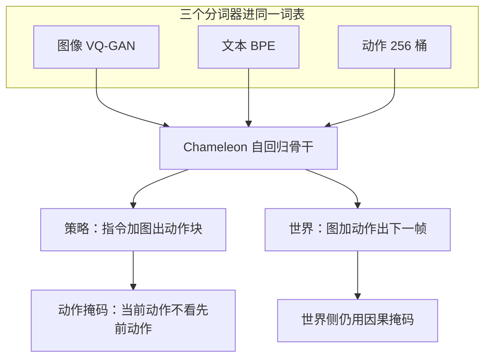

# WorldVLA：把动作和下一帧塞进同一条自回归

<!-- release-date: 2025-06-26 -->

**本文依据**：`WorldVLA: Towards Autoregressive Action World Model`，arXiv `2506.21539v1`（Submitted on 26 Jun 2025，14 页）。作者 Jun Cen、Chaohui Yu、Hangjie Yuan、Yuming Jiang、Siteng Huang、Jiayan Guo、Xin Li、Yibing Song、Hao Luo、Fan Wang、Deli Zhao、Hao Chen；第一作者最低编号单位 **DAMO Academy, Alibaba Group**（封面另列 Hupan Lab、Zhejiang University）。封面印 `arXiv:2506.21539v1 [cs.RO] 26 Jun 2025`，另印 Date: June 27, 2025；无会议名。文中数字标 `(PDF p. N)`。代码页印 `https://github.com/alibaba-damo-academy/WorldVLA`（PDF p.1）。

## 一句话

普通 VLA 只把动作当输出，世界模型能看懂动作却吐不出控。WorldVLA 用 Chameleon 骨干把图、文、动作打进同一词表，一条自回归同时当策略和下一帧预测器（PDF p.1–2 图 1）。LIBERO 上 512 分辨率、无大规模机器人预训练，均分成功率 81.8%，高于同档离散 OpenVLA 的 76.5%（PDF p.5 表 2）。动作块若按默认因果掩码往后抄，成功率会掉；把先前动作挡住，当前动作只看图文，才能把块生成救回来（PDF p.5 图 3、p.6 表 3）。

## 主矛盾：两边各缺半边

VLA 把预训练多模态大模型接上动作头或动作专家，感知和决策来自互联网先验，泛化比「视觉骨干 + MLP」强。但它把动作只当输出，从不把动作当输入再读一遍，所以对「这个控会把世界变成什么样」没有显式理解（PDF p.1）。

世界模型相反：当前观测加动作，预测下一视觉状态，等于同时读画面和动力学。它不能直接出动作，规划还要另接一层（PDF p.1）。

表 1 把四类生成器按输入输出切开（PDF p.3）：

| 类型 | 离散代表 | 连续代表 | 输入 | 输出 |
|---|---|---|---|---|
| 动作模型 | OpenVLA | $\pi_0$ | 文 + 视频 | 动作 |
| 视频预测 | MAGVIT | SVD | 文 + 视频 | 视频 |
| 世界模型 | iVideoGPT | DWS | 文 + 视频 + 动作 | 视频 |
| 动作世界模型 | WorldVLA（本文） | UVA | 文 + 视频 + 动作 | 视频 + 动作 |

UVA 走扩散头分别出图和动作。WorldVLA 走另一条：离散自回归，感知和控共用一个 LLM（PDF p.3）。

第二个矛盾出在动作块。一次吐多步对抓取又快又稳，但预训练几乎没见过动作模态。默认因果掩码让后一步动作盯着前一步动作，错了就往后传。作者说朴素自回归会让抓取成功率掉 10% 到 50%；他们的动作注意力掩码再把成功率抬回 4% 到 23%（PDF p.2）。这组百分比是摘要口径，下面表 3、图 6 才是分设定数字。

## 全景：一个模型两套数据

策略 $\pi_\theta$ 看历史图和指令出当前动作：

$$a_t=\pi_\theta(a_t\mid o_{t-h:t},l)$$

世界模型 $f_\phi$ 看历史图和历史动作出当前帧：

$$o_t=f_\phi(o_t\mid o_{t-h:t-1},a_{t-h:t-1})$$

统一模型 $M_\psi$ 两套头共用一套权重（PDF p.4 式 1–3）。

（机制示意，根据 PDF p.4 图 2、p.5 图 3。）

骨干从 Chameleon 初始化，因为它本来就能理解和生成图像（PDF p.4）。三个分词器（PDF p.4–5）：

- **图像**：VQ-GAN，压缩比 16，码本 8192；$256\times256$ 出 256 个 token，$512\times512$ 出 1024 个。
- **动作**：每维连续控切成 256 桶，桶宽由训练数据范围定。一步动作 7 个 token：3 个相对位移、3 个相对转角、1 个绝对夹爪。
- **文本**：BPE，词表 65536，其中已经含 8192 个图像 token 和 256 个动作 token。

图、文、动作全部离散化后做下一 token 预测。

## 训练：混两套序列，损失只算该算的半边

混数据有三层理由（PDF p.5）：世界模型用「状态 + 动作 → 下一观测」学物理，对操作有用；它可以在脑子里试动作、躲开坏结局；它必须读懂动作输入，反过来逼策略把控写清楚。反过来，策略要看懂图才能出动作，这套视觉理解再喂给世界模型的生成。

**动作数据**。文本是 `What action should the robot take to` + 任务 + `?`。输入 $M$ 张图，输出 $K$ 步动作。损失 $L_{\mathrm{action}}$ 只算动作 token（PDF p.5）。

**世界数据**。文本是 `Generate the next frame based on the current image and the action.`，**不给任务指令**，因为动作本身应能决定下一状态。条件预测重复 $N$ 次，损失 $L_{\mathrm{world}}$ 只算生成的图像 token（PDF p.5）。

总损失：

$$L=L_{\mathrm{action}}+\alpha L_{\mathrm{world}}$$

图像 token 远多于动作 token（256 或 1024 对 7），用 $\alpha$ 压世界损失。实验里 $\alpha=0.04$，$M=2$，LIBERO-Long 的 $K=10$、其余三套 $K=5$，世界侧 $N=1$（PDF p.5 式 4、p.6）。

### 动作注意力掩码

默认因果掩码：当前 token 只看前面，动作块里后一步动作能看见前一步动作（PDF p.5 图 3a）。作者认为动作模态没在 MLLM 预训练里练过，泛化弱，错误会沿动作链传。

新掩码：生成当前动作时**只看文本和图像，不看先前动作**（图 3b）。效果上接近一次并行出多步，和 OpenVLA-OFT、$\pi_0$ 一类「动作头一次吐块」对齐。世界模型侧仍用普通因果掩码（图 3c）。

这是全文最可迁移的工程点：自回归骨干不等于动作块也必须因果。模态没预训练过时，让后一步抄前一步，就是在放大量化误差。

## 实验怎么钉住「互相帮」

评测在 LIBERO：Spatial / Object / Goal / Long，另有 LIBERO-90 短程任务可作预训练，本文主表没用大规模机器人预训练（PDF p.5–6）。滤掉失败轨迹和无操作，与 OpenVLA 一样。世界模型要成对视频–动作，默认 90% 训练 / 10% 验证；**表 2 为公平对照改用全部可用数据训练**（PDF p.6）。

动作评测：每任务 50 次不同初态 rollout，记成功率。世界评测：验证集上 FVD、PSNR、SSIM、LPIPS（PDF p.6）。

作者强调离散动作模型先天吃亏：动作量化会丢信息。连续模型（扩散策略、Octo、DiT Policy、UVA、Seer、OpenVLA-OFT）一次并行出多步或走扩散，数字通常更高（PDF p.6）。

### 主表：无预训练仍超过 OpenVLA

表 2（PDF p.5；原文加粗最优，此处不拷星号）：

| 方法 | 预训练 | Spatial | Object | Goal | Long | Average |
|---|---|---:|---:|---:|---:|---:|
| Diffusion Policy | 否 | 78.3 | 92.5 | 68.3 | 50.5 | 72.4 |
| Octo | 是 | 78.9 | 85.7 | 84.6 | 51.1 | 75.1 |
| DiT Policy | 是 | 84.2 | 96.3 | 85.4 | 63.8 | 82.4 |
| Seer | 否 / 是 | — | — | — | 78.7 / 87.7 | — |
| OpenVLA-OFT | 是 | 96.9 | 98.1 | 95.5 | 91.1 | 95.4 |
| UVA | 否 | — | — | — | 93.0 | — |
| OpenVLA | 是 | 84.7 | 88.4 | 79.2 | 53.7 | 76.5 |
| WorldVLA $256\times256$ | 否 | 85.6 | 89.0 | 82.6 | 59.0 | 79.1 |
| WorldVLA $512\times512$ | 否 | 87.6 | 96.2 | 83.4 | 60.0 | 81.8 |

512 比 256 好，作者归因于 Chameleon 的图像分词和 LLM 都按 512 预训练，抓取也更吃细节（PDF p.6）。摘要写「同骨干动作模型抓取成功率高 4%」：512 均分 81.8 对 OpenVLA 76.5，差 5.3 个百分点；不要把摘要的 4% 当成表 2 某一格。相对连续 SOTA（OpenVLA-OFT 95.4、UVA 在 Long 上 93.0）仍明显落后，文章自己把离散量化当原因。

### 消融：世界帮动作、掩码救命

表 3，256 设定上的成功率（PDF p.6）：

| Index | 动作 | 世界 | 动作块 | 本文掩码 | Goal | Object | Spatial | Long | Avg |
|---|---|---|---|---|---:|---:|---:|---:|---:|
| 1 | 是 | 否 | 否 | 否 | 67.3 | 82.9 | 77.8 | 23.0 | 62.8 |
| 2 | 是 | 是 | 否 | 否 | 73.1 | 88.0 | 80.2 | 27.3 | 67.2 |
| 3 | 是 | 否 | 是 | 否 | 79.6 | 82.9 | 36.7 | 16.9 | 54.0 |
| 4 | 是 | 否 | 是 | 是 | 84.4 | 90.9 | 81.8 | 49.3 | 76.6 |
| 5 | 是 | 是 | 是 | 是 | 85.1 | 90.9 | 84.0 | 52.4 | 78.1 |

读表：

- 加世界、不加块：62.8 → 67.2。
- 加块但用默认掩码：均分掉到 54.0，Spatial 从 77.8 砸到 36.7，Long 从 23.0 到 16.9。Goal 反而从 67.3 升到 79.6，不是所有套都掉。
- 换本文掩码：54.0 → 76.6。
- 掩码再加上世界：76.6 → 78.1。

图 4：纯动作模型会冲向终点却没抓住奶酪或酒瓶；动作世界模型会反复试抓，抓稳再走（PDF p.7）。这是定性例子，不是表 2 的 50 次均值。

### 动作帮世界：长视频才明显，短视频 FVD 甚至略差

表 4（PDF p.8）：

| | 10 帧 FVD↓ | PSNR↑ | SSIM↑ | LPIPS↓ | 50 帧 FVD↓ | PSNR↑ | SSIM↑ | LPIPS↓ |
|---|---:|---:|---:|---:|---:|---:|---:|---:|
| 世界模型 | 250.0 | 29.62 | 90.73 | 11.97 | 718.6 | 23.98 | 83.41 | 15.60 |
| 动作世界模型 | 255.1 | 29.77 | 90.40 | 11.94 | 674.1 | 24.30 | 83.55 | 15.44 |

摘要写「相对朴素世界模型，LIBERO 上 FVD 降 10%」。表上 10 帧 FVD 从 250.0 升到 255.1，略差；50 帧从 718.6 到 674.1，约降 6.2%。**以表格为准**，不要把摘要的 10% 抄成短视频结论。PSNR / LPIPS 在两档长度上都略好。图 5：纯世界模型打不开抽屉、盘子一推碗消失、碗上不了炉；动作世界模型这几处更像物理（PDF p.8）。

### 世界模型 vs 无动作视频预测

视频预测条件是任务 + 当前图，不含动作；文本是 `Generate the future image based on the task and current image.` + 指令（PDF p.8）。图 7 是图、不是表：作者说世界模型在全部评测任务上抬动作；视频预测两套任务有益、一套有害。解释是：没有动作时下一帧不唯一，多个合理未来会对同一起点，训练会吵；世界模型还逼模型读懂动作（PDF p.8–9）。

### 历史帧、吞吐、世界预训练

表 5，Goal 成功率与 FPS（PDF p.9；原文没写这是 Goal，但列与表 3 的 Goal 行对齐：无块 1 帧 58.4、2 帧 67.3 对上表 3 的 67.3）：

| | 1 帧 SR / FPS | 2 帧 SR / FPS | 4 帧 SR / FPS |
|---|---|---|---|
| 无动作块 | 58.4 / 2.27 | 67.3 / 1.77 | 78.7 / 1.22 |
| 有动作块 | 74.0 / 3.67 | 84.4 / 3.13 | 84.7 / 2.78 |

有块时 2 帧已经饱和（84.4 vs 4 帧 84.7），默认用 2 帧换速度。VQ-GAN 语义理解弱于 CLIP，所以单帧不够（PDF p.9）。

表 6：先用世界模型预训练再当动作模型（PDF p.9）：

| | Goal | Object | Spatial | Long | Avg |
|---|---:|---:|---:|---:|---:|
| 无世界预训练 | 67.3 | 82.9 | 77.8 | 23.0 | 62.8 |
| 有世界预训练 | 73.1 | 84.0 | 79.8 | 30.2 | 66.8 |

均分 62.8 → 66.8。这是「世界权重当动作初始化」，不是表 3 那种混训。

图 6：块太长，机器人来不及根据新观测改策略，成功率会再掉（PDF p.8）。图本身是曲线，正文没有逐点数字。

## 没写什么、作者自己要改什么

报告没写：参数量、训练步数、GPU 天数、真机、LIBERO-90 预训练主结果、掩码的实现伪代码以外的 kernel。封面 Date 是 June 27，arXiv 行是 26 Jun，首发日取 v1。

结论里他们要做的（PDF p.9）：放大数据和模型；换掉离散图像分词，做又能理解又能高质量生成的统一 tokenizer；再加辅助动作头抬抓取。这些是展望，不是已做消融。

## 可迁移的读法

- 先问动作有没有被当成**输入**。只当输出的 VLA 缺动力学；只预测画面的世界模型缺控。WorldVLA 的主张是同一套离散 token 两头用。
- 自回归出动作块时，默认因果掩码可能是错的。动作若没进预训练，让后一步看前一步等于让弱模态带飞。掩码成「每步只看图文」是便宜的并行解码。
- 混训损失必须按 token 数加权。图像 256–1024、动作 7，$\alpha=0.04$ 不是玄学，是量级差。
- 摘要和表会打架。FVD「降 10%」对不上表 4 的 10 帧；互相增强要看长视频和动作成功率，不要只背摘要。
- 离散统一模型在 LIBERO 上能超过 OpenVLA，但过不了 OpenVLA-OFT / UVA。量化损失是作者承认的天花板。
