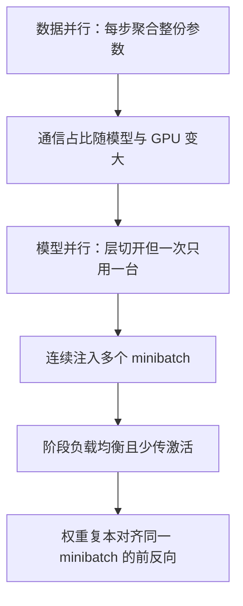

# PipeDream：把 DNN 切成流水线阶段，用权重复本把双向训练填满 GPU

<!-- release-date: 2018-06-08 -->

**本文依据**：`PipeDream: Fast and Efficient Pipeline Parallel DNN Training`，arXiv:1806.03377v1 [cs.DC] 8 Jun 2018，letter，14 页。共同一作 Aaron Harlap（Carnegie Mellon University；脚注写工作始于 Microsoft Research 实习，不改归属）、Deepak Narayanan（Stanford University）；其余作者 Amar Phanishayee、Vivek Seshadri、Nikhil Devanur（Microsoft Research），Greg Ganger、Phil Gibbons（Carnegie Mellon University）。封面页眉印该 arXiv 行，未印会议名。文中数字均标 PDF 页码；标「外部补充」的段落不来自本文。

## 一句话

数据并行要把整份模型参数在 worker 之间聚合，模型一大、网一慢、GPU 一再快，通信就会吃掉训练时间——VGG-16 上通信可占到总时间的 85%（PDF p. 1）。PipeDream 把层切成阶段、阶段映射到机器，再向流水线连续注入多个 minibatch，机器之间只传相邻层的激活与梯度，相对数据并行通信最多少 95%；同时用权重复本保证同一 minibatch 的前向与反向用同一套参数（PDF p. 1）。五个模型、两套集群上，到达目标精度的时间相对数据并行最多快约 5 倍（封面摘要写 5x；表 1 里 VGG16、8 机、集群 B 为 5.12 倍）（PDF p. 1、p. 11）。

它解决的不是「再开一台 GPU 复制一份模型」，而是 **2018 年已经能把模型塞进单卡、却被参数同步拖死的那条路：计算越快，BSP 数据并行越像在等网。**

## 一、旧路：数据并行等参数，模型并行一次只用一台机

训练时间拆成两段乘积：统计效率（到目标精度要几个 epoch）乘硬件效率（一个 epoch 要多久）（PDF p. 2）。数据并行把数据切开、每台机一份完整模型，再用集体通信或参数服务器对齐权重。每步都同步（BSP）统计上干净，但图 2 那种时间线里，机器要停下来等别人的梯度（PDF p. 3）。

图 1 把这件事钉在三世代 NVIDIA GPU（K80、Titan X、V100）和五个模型上，机器之间是 10 Gbps 网（PDF p. 3）。三条观察：AlexNet、VGG16、S2VT 即使在相对慢的 K80 上通信占比已经很高；数据并行 worker 变多，所有模型通信占比都升；GPU 从 K80 换到 V100，通信等待对五个模型都更重（PDF p. 3）。封面把 VGG-16 的极端例子写成通信可占训练时间的 85%（PDF p. 1）。

异步并行（ASP）不卡梯度、硬件更忙，但梯度打在过期权重上，统计效率掉。作者引用并复现：ASP 并不能缩短端到端训练时间（PDF p. 3–4）。

模型并行把层分给不同 GPU，机器之间只传组间激活与梯度。图 3 是四机、一次只跑一个 minibatch：任一时刻只有一个阶段在算，其余空转（PDF p. 4）。传统上很少把多个 minibatch 首尾相接地灌进这条双向流水线，原因有二：前向之后还要沿同一组层反向，调度难；天真流水线会让反向打在比前向更新过的权重上，最终精度不如数据并行（PDF p. 4）。怎么切层也常丢给程序员，强化学习自动放置既贵又慢，而且没有把流水线、数据并行、模型并行缝在一起（PDF p. 4）。

相关工作里，高速集群上的大 minibatch SGD、1-bit 量化、更聪明的 all-reduce，仍是同步通信模式，只能略减等待；Chen 等人曾短暂讨论模型并行里流水线多个 minibatch，但没有给出面向真实大模型的统计效率、规模与通用切分（PDF p. 4）。

于是贡献钉成四条：一种专为 DNN 的并行方式（流水线 + 模型并行 + 必要时数据并行）；把这条想法做成系统时要解的关键问题；实现 PipeDream；在通信已经拖垮数据并行、甚至数据并行慢于单机的设定里给出实验（PDF p. 2）。

把因果链摊开（机制示意，根据 PDF p. 1–5 图 1–4 重画，不是实测时间轴）：

## 二、流水线并行：阶段只传一层输出，计算与通信重叠

流水线并行把模型切成若干阶段，每个阶段是连续的一层子序列，映射到一块 GPU，这块 GPU 既做这些层的前向也做反向。含输入层的叫输入阶段，含输出层的叫输出阶段。图 4 是四机例子，时间线上同一台机在算下一批的同时，后台传激活与梯度（PDF p. 5）。

只注入一个 minibatch 时，最多一块 GPU 在忙，这就是图 3。要让 GPU 不空，就把多个 minibatch 一个接一个打进去：某阶段做完一批的前向，异步把激活送给下一阶段，同时开始下一批；反向同理，把梯度送给上一阶段后再开另一批（PDF p. 5）。

相对 BSP 有两条硬件账。第一，少传。图 5 把 VGG16、minibatch 32、ImageNet1K 上各层输出大小和整份参数大小（黑虚线）摆在一起：BSP 要传全部参数，流水线每台机往往只传某一层的输出，VGG16 上通信可减超过 90%（PDF p. 5）。第二，重叠。前向激活与反向梯度跨阶段异步传，和后续 minibatch 的计算叠在一起（PDF p. 5）。

不同层适合的并行方式不同。PipeDream 因此要在流水线模型并行上，对部分阶段再做数据并行（同一阶段多机、不同 minibatch）。图 6 是八机上的示意切分（PDF p. 6）。要做成真实大模型，还剩三件事：自动切分；调度既要吞吐又要学习在往前走；流水线带来的异步不能把学习弄坏（PDF p. 5–6）。

**旧问题 → 新设计 → 机制 → 收益 → 代价。** 数据并行传整模、模型并行空转。流水线让所有阶段同时处理不同输入，通信从「整份参数」变成「切点上的激活/梯度」。代价是：切不好会有空泡；双向流水线必须管权重版本。

可迁移：先问通信是不是整份参数在动；若瓶颈在同步，优先减「必须对齐的字节数」，再谈重叠。

## 三、自动切分：剖面一层的时间与输出，动态规划压最慢阶段

给定 $N$ 层、$M$ 台机，目标是总训练时间最短。对流水线，这等价于压最慢那一阶段的时间（PDF p. 6）。切分还要让各阶段工作量大致相当，并尽量少传跨阶段数据，否则吞吐掉（PDF p. 6）。

DNN 训练跨 minibatch 的计算与通信时间方差很小。于是在一台机上用 1000 个 minibatch 做短剖面（实验里 GPU 同构，剖一台即可），对每层 $l$ 记下三件事：前向加反向的计算时间 $T_l$；输出激活大小 $a_l$（也是反向输入梯度大小）；参数大小 $w_l$（PDF p. 6）。

通信估成「要传的字节 / 链路带宽」，路径是 GPU→CPU、过网、CPU→GPU。用 $a_l$ 估阶段之间传激活的时间 $C_l$。数据并行、$m$ 台机时，每 worker 通信量写成 $4\times(m-1)\times|w_l|/m$，用来估该层在分布式参数服务器上的权重同步时间 $W_l^m$（PDF p. 6）。

优化器输出三件事：层如何捆成阶段；每阶段复制几份（数据并行度）；稳态下要注入多少 minibatch 才能把管填满（PDF p. 6）。

记 $A(j,m)$ 为第 1 到第 $j$ 层、用 $m$ 台机时，最优流水线里最慢阶段的时间，要求的是 $A(N,M)$。记 $T(i\to j,m)$ 为第 $i$ 到 $j$ 层捆成一个阶段、复制 $m$ 份时该阶段的时间：取「这些层总计算时间」与「这些层总通信时间」的较大者，再按复制度摊开（PDF p. 6）。最优流水线要么就是这一整段复制 $m$ 次，即 $A(j,m)=T(1\to j,m)$；要么拆成「前 $i$ 层用 $m-m'$ 台机的最优子流水线」再接「余下层复制 $m'$ 份」，并对子流水线最慢阶段时间、$i$ 与 $i+1$ 之间激活/梯度通信 $2\cdot C_i$、以及后段数据并行时间三者取 max，再对切点和 $m'$ 取 min（PDF p. 7）。子问题最优性成立，故用动态规划。初值：$A(1,m)=T(1\to 1,m)$，$A(i,1)=T(1\to i,1)$。子问题 $O(NM)$ 个，每个 $O(NM)$，总时间 $O(N^2 M^2)$（PDF p. 7）。

稳态下每个输入阶段应注入的最优 minibatch 数是

$$
\mathrm{NOAM}=\Bigl\lceil\frac{\text{机器数}}{\text{输入阶段机器数}}\Bigr\rceil
$$

即 NUM_OPT_ACTIVE_MINIBATCHES（PDF p. 7）。

图 7 把剖面、优化器、运行时执行计划串成工作流（PDF p. 6）。

## 四、1F1B 与确定性轮转：双向管里既要往前推，又要让学习动起来

DNN 训练是双向管：前向从输入走到输出，反向沿同一组层走回来。每个活跃 minibatch 可能停在不同层、不同方向。每台机于是要在两件事里选：做一批的前向、把活推给下游；或做另一批的反向、让学习真的更新（PDF p. 7）。

永远优先前向，权重更新要等反向，整体学习往前走得慢；永远优先反向，上游会周期性没活干。PipeDream 的调度：启动阶段，输入阶段恰好放进 NOAM 个 minibatch，把管充满。进入稳态后，每个阶段在一批的前向与一批的反向之间交替，称为 one-forward-one-backward（1F1B）。管平衡时，稳态里没有 GPU 空转，而且每个 minibatch 都能完成学习（PDF p. 7）。

图 8 是四阶段、每阶段一机：NOAM 为 4。启动时输入阶段放进恰好四批；输出阶段做完第一批前向立刻做同一批反向，然后交替。反向往回传时，前面的阶段也开始交替。稳态里每台机不是在做前向就是在做反向。1F1B 并不要求前向和反向一样长；实践里反向总比前向长，调度仍然有效（PDF p. 7）。

阶段被复制时，用确定性轮转把上一阶段的活分到副本上：`minibatchID mod stageReplicaID`。这样一批的反向一定落在做它前向的那台机上。1F1B 与轮转都是静态策略，各机本地执行，不必昂贵的分布式协调（PDF p. 7）。

**旧问题 → 新设计 → 机制 → 收益 → 代价。** 双向管让「推吞吐」和「完成反向」打架。启动用 NOAM 填满，稳态 1F1B，复制阶段用确定性轮转对齐前反向机器。代价是：切分必须足够均衡，否则 1F1B 仍会空等。

可迁移：流水线调度先固定「稳态在飞的任务数」，再规定前向与反向的交替，避免启发式抢占把学习饿死。

## 五、权重复本：同一 minibatch 的前向和反向必须看见同一套 $w$

天真流水线里，一批的前向用一套参数、反向用另一套。图 8 无数据并行时，阶段 1 上 minibatch 5 的前向发生在 minibatch 1 的更新之后，反向却发生在 2、3、4 的更新之后——梯度不是对前向那套权重求的，模型可能不收敛（PDF p. 8）。不同阶段过期程度还不一样：第三阶段前后向之间只夹一次更新，输出阶段没有夹更新。这种层间不对称会再伤收敛。实验上，天真流水线达不到数据并行的精度（PDF p. 8）。

PipeDream 用两招。

**Weight Stashing（权重复本）。** 每个活跃 minibatch 留一份权重。前向用当时最新的权重，做完把这份权重存进该 minibatch 的中间状态；反向用同一份算梯度。于是**阶段内部**，同一 minibatch 的前向与反向参数版本一致。图 8 里 minibatch 5 在机器 1 上用的是 batch 1 更新后的参数，在机器 2 上用的是 batch 2 更新后的参数。Stashing 不保证跨阶段版本一致（PDF p. 8）。

**Vertical Sync（纵向同步）。** 消除跨阶段不一致。图 8 里若打开它，minibatch 5 在所有机器的前向与反向都用 minibatch 1 更新后的参数。进入管的 $m_i$ 带上输入阶段当时看到的最新版本 $w^{(i-x)}$，这份信息随激活与梯度往前传；各阶段前向都用藏起来的 $w^{(i-x)}$，反向也用它，然后各自更新出 $w^{(i)}$，并删掉旧副本。阶段之间这次协调是异步的（PDF p. 8）。

把过期程度写清楚。直管、$n$ 个阶段。普通 minibatch SGD 的更新是用当前各阶段权重上的平均梯度。加上 stashing 后，阶段 1 的梯度大约晚 $n$ 步，阶段 2 晚 $n-1$ 步，……，输出阶段不晚，整体像

$$
w^{(t+1)}=w^{(t)}-\nu\cdot \nabla f\bigl(w_1^{(t-n+1)},w_2^{(t-n+2)},\ldots,w_n^{(t)}\bigr)
$$

没有 stashing 时，这次更新甚至不是任何一组权重向量上损失函数 $f$ 的有效梯度。再加上 vertical sync，各阶段都用同一套晚 $n-1$ 步的权重，语义上等于 $n$ 台机、每台仍用原来 minibatch 大小的 BSP 数据并行（PDF p. 8）。

作者认为 stashing 对「有意义的学习」是关键的。默认语义是：**要 stashing，不要 vertical sync**——夹在单机 minibatch SGD 与 BSP 数据并行之间。实验里 vertical sync 的影响可忽略，默认关掉是因为它要在每个阶段多存元数据（PDF p. 8）。

GPU 内存：进出管的输入、权重、中间状态必须在卡上，否则动态分配和 CPU–GPU 拷贝会吃掉硬件效率。PipeDream 按阶段、按 NOAM 算出要存的激活、参数和中间状态，训练开始时一次性分配并复用。输出阶段只需为一批存中间状态，输入阶段要为 NOAM 批存（PDF p. 8–9）。

## 六、实现：Caffe worker、静态缓冲、分片参数服务器

输入是模型结构、训练集、GPU 数。先在单机用训练集的一个子集剖面，再跑 3.2 节优化器，把模型切成 $k$ 个阶段（部分阶段复制），运行时每阶段绑一块 GPU（PDF p. 9）。

接口是 C++ 库，管参数与中间数据；当前 ML worker 是 Caffe，文中写可接到 TensorFlow、MXNet、CNTK，但本文实验用的是 Caffe（PDF p. 9）。图 9：PipeDream 管缓冲池和机内/机间通信，给 Caffe 线程的是层输入、参数、输出与参数更新所在的 GPU 指针（PDF p. 9）。

初始化时静态分配激活、权重、梯度、中间状态（含每个活跃 minibatch 的输入激活与 stashed 权重）。之后 worker 向运行时拉下一项活；输入阶段造第一批前向，把管踢起来。此后各机 1F1B，活跃 minibatch 总数限制在 NOAM（PDF p. 9）。

参数按层分开放在本阶段 GPU 上，各有 ID。阶段未复制：更新写回 GPU 里最新版本。阶段已复制：更新拷到主机内存再送参数服务器。更新的版本不会立刻丢掉，直到用过更新鲜参数的反向做完（PDF p. 9）。前向中间数据要等到该批在本阶段的反向做完才丢；反向中间数据用完（必要时发给下一阶段）就放。因此前向常同时管多份中间数据，反向通常只留当前这一份（PDF p. 9–10）。

数据并行阶段用类似 GeePS 的分布式参数服务器，wait-free backpropagation：某层梯度一算完就送，不等整阶段算完。每个 worker 带一个参数分片，存参数的一个子集；分片在聚合完本阶段所有副本的更新后，立刻把最新参数推给其他分片（PDF p. 10）。全部层放进一个阶段并复制到所有机器，就是普通数据并行，作为框架的特例（PDF p. 10）。阶段之间通信用 ZeroMQ 加定制序列化（PDF p. 10）。

检查点默认每个 epoch 结束做一次，为容错。不需要全局协调：各阶段在做该 epoch 最后一批反向时本地把参数倒出去。失败后从所有阶段都成功检查过的最后一个 epoch 重启（PDF p. 10）。

## 七、实验：五个模型、两套集群，通信越贵收益越大

设定。数据：ILSVRC12 / ImageNet 1K，约 130 万训练图、1000 类、5 万验证图；MSVD，1970 段视频、词表 12,594（PDF p. 10）。集群 A：私有 Titan X，12 GB 显存，E5-2698Bv3，64 GB 内存，25 Gbps 以太网。集群 B：AWS p3.2xlarge，V100，16 GB 显存，E5-2690，64 GB 内存，10 Gbps 以太网。两边 Ubuntu 16.04、CUDA 8.0、cuDNN v6。B 的 GPU 更快、网更慢，因此 PipeDream 相对收益在 B 上更大（PDF p. 10）。

表 1 里端到端训到「宣传精度」的三个模型：VGG16 550 MB；Inception-v3 157 MB；S2VT 349 MB。VGG16 与 Inception-v3 用 ILSVRC12，S2VT 用 MSVD。VGG16 与 S2VT：SGD，动量 0.9，初始学习率 0.01。Inception-v3：RMSProp，初始学习率 0.045，每两 epoch 按 0.94 指数衰减。每机 minibatch：VGG16 与 Inception-v3 为 32，S2VT 为 80。目标：VGG16 top-1 68%；Inception-v3 top-1 67%；S2VT METEOR 0.294。训练中会调学习率以更快到目标（PDF p. 10）。对照是同一套代码的数据并行与单机配置；数据并行相对开源 GeePS 至少一样快（PDF p. 10）。

封面与引言还列了 Inception-v3、VGG16、ResNet-50、AlexNet 相对数据并行 BSP 的加速 1.45 倍、5.12 倍、1.21 倍、6.76 倍，以及 S2VT 上 3 倍（PDF p. 1–2）。第 5 节因篇幅没有给出 AlexNet 与 ResNet-50 的端到端精度–时间曲线，只在集群 B 上报告相对 8 机 BSP 的吞吐：ResNet-50 1.21 倍、AlexNet 6.78 倍（与引言 6.76 倍差在四舍五入）（PDF p. 11）。图 10–12 每个点代表 5 个 epoch（PDF p. 11）。

表 1（PDF p. 11；「配置」如 2-1-1 表示三阶段、第一阶段复制 2 份）：

| 模型 | 机数（集群） | BSP 相对单机 | PipeDream 配置 | 相对单机 | 相对 BSP | 通信相对 BSP 减少 |
|---|---|---|---|---|---|---|
| VGG16 | 4（A） | 1.47× | 2-1-1 | 3.14× | 2.13× | 90% |
| VGG16 | 8（A） | 2.35× | 7-1 | 7.04× | 2.99× | 95% |
| VGG16 | 16（A） | 3.28× | 9-5-1-1 | 9.86× | 3.00× | 91% |
| VGG16 | 8（B） | 1.36× | 7-1 | 6.98× | 5.12× | 95% |
| Inception-v3 | 8（A） | 7.66× | 8 | 7.66× | 1.00× | 0% |
| Inception-v3 | 8（B） | 4.74× | 7-1 | 6.88× | 1.45× | 47% |
| S2VT | 4（A） | 1.10× | 2-1-1 | 3.34× | 3.01× | 95% |

除 Inception-v3、8 机、集群 A 外，最优配置都不是纯数据并行也不是纯模型并行，而是三者组合（PDF p. 11）。Inception-v3 在集群 A、8 机上通信开销只有 5%，优化器直接选出全数据并行，配置写「8」，相对 BSP 为 1.00×、通信减少 0%（PDF p. 11）。

集群 A、8 机。VGG16 的 BSP 相对单机只有 2.35 倍，因为 8 机通信开销 72%；PipeDream 消掉其中 95%，相对单机 7.04 倍、相对 BSP 2.99 倍（PDF p. 11）。Inception-v3 的 BSP 已接近线性，7.66 倍（PDF p. 11）。图 10 是这两条精度–时间曲线（PDF p. 11）。

换到更快 GPU、更慢网（集群 B、8 机）。VGG16 端到端从集群 A 上约 220 小时降到集群 B 上略少于 100 小时；两边缩放到 8 机都变差，但 BSP 伤得更重：PipeDream 相对 BSP 从 2.99 倍升到 5.12 倍。Inception-v3 在 B 上也比 BSP 快 45%（即 1.45 倍）（PDF p. 11）。图 11 对应这两条曲线（PDF p. 12）。

改机器数。通信开销随机器数升（图 1）。图 12 是 VGG16 在集群 A 上 4 机与 16 机。BSP 相对单机：4 / 8 / 16 机分别为 1.47×、2.35×、3.28×；PipeDream 为 3.14×、7.04×、9.86×。四机 PipeDream 几乎赶上十六机 BSP（PDF p. 12）。

ASP。四机数据并行 ASP 无同步、无通信等待，但统计效率差。PipeDream 到达 48% 精度比四机 ASP 快 7.4 倍（PDF p. 12）。

S2VT。LSTM 类循环网上 BSP 很难扩。四机集群 A 上通信开销 70%，BSP 相对单机只有 1.1 倍；PipeDream 通信减少 95%，相对单机 3.34 倍、相对 BSP 3.01 倍（PDF p. 12）。引言把同一设定写成 3 倍（PDF p. 2）。

阶段内数据并行值不值得。图 13 在集群 A 上训 VGG16，对比三种切法（PDF p. 12）：

- 朴素模型并行（无流水线、无数据并行）：任一时刻只用一台机，比单机还慢；作者在不支持流水线的 TensorFlow 模型并行里看到类似掉速（PDF p. 12）。
- 直管（流水线 + 模型并行、阶段不复制）：相对单机 4 机 2.56×、8 机 3.49×，已经好于数据并行的 1.47× 与 2.35×（PDF p. 12）。
- 完整 PipeDream：4 机 3.14×、8 机 7.04×（PDF p. 12）。

结论段把封面数字收回来：相对当时的先进做法，五个 DNN、两套集群上到达目标精度最多快 5 倍（PDF p. 13）。

## 八、这篇没写什么，以及能搬走的几条

没写的。没有把 AlexNet、ResNet-50 训到目标精度的时间曲线，只给集群 B 上的吞吐倍数（PDF p. 11）。没有公开切分算法产出的具体层边界（表 1 只有阶段复制串）。Caffe 以外的框架只是「可扩展」声明，没有实验（PDF p. 9）。默认关掉 vertical sync，没有把「可忽略」量化成表（PDF p. 8）。集群是 10–25 Gbps 以太网与当时的 Titan X / V100，不是 NVLink / InfiniBand 专线；作者刻意对比的是公有云商品 SKU，而不是 DGX 一类高价互连（PDF p. 4、p. 10）。

可迁移。

1. **先量通信占墙钟的比例，再决定并行形态。** 图 1 已经表明：同一模型换一代 GPU，瓶颈会从算转向传。Inception-v3 在快网慢卡上优化器会退回纯数据并行——自动切分的价值包括「有时不要切」。
2. **流水线的收益来自少传切点激活，不是来自「看起来像流水线」。** 天真灌 batch 会把反向打在错误的权重上；stashing 是统计效率的底线。
3. **双向管的调度要同时服务吞吐和学习进度。** NOAM 填满 + 1F1B + 确定性轮转，比永远抢前向更稳。
4. **阶段复制是负载整形，不是第二套系统。** 图 13 说明直管已经能赢 BSP，再在重层上复制才把 8 机从 3.49 倍拉到 7.04 倍。
5. **内存一次性按在飞批次数铺好。** 输入阶段按 NOAM 留中间状态，输出阶段只留一批，避免训练中途 malloc。

## 关键词回看

- **数据并行 / BSP / ASP**：复制整模、切数据；BSP 每 minibatch 同步，ASP 不候梯度。
- **模型并行**：切层；传统上一次只用一个阶段。
- **流水线并行（PP）**：切阶段 + 多 minibatch 在飞 + 必要时阶段复制。
- **NOAM**：稳态在飞 minibatch 数，$\lceil M/\text{输入阶段机数}\rceil$。
- **1F1B**：稳态下前向与反向交替。
- **Weight stashing**：同一 minibatch 前反向共用一份权重复本。
- **Vertical sync**：跨阶段也锁定同一过期版本；本文默认关。

## 参考资料

- 原件：`readings/_src/分布式训练与并行/PipeDream.pdf`（arXiv:1806.03377v1，2018-06-08）。
- 文中对照的数据并行实现与剖面基线：GeePS（Cui 等，EuroSys 2016）；worker 为 Caffe。
- 实验模型出处见 PDF 参考文献：VGG16、Inception-v3、ResNet、AlexNet、S2VT。
