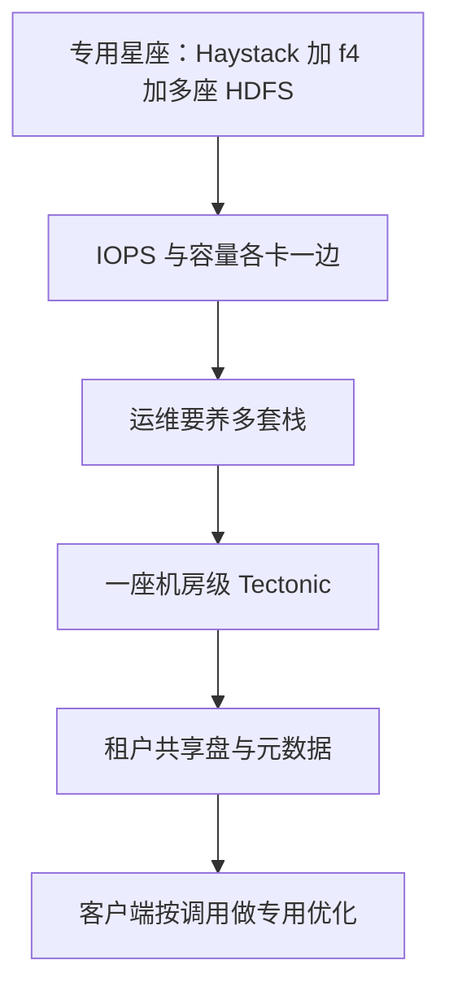

# Tectonic：把专用存储收成一座机房级文件系统，效率从 EB 规模里长出来

<!-- release-date: 2021-02-23 -->

**本文依据**：`Facebook's Tectonic Filesystem: Efficiency from Exascale`，收录于 19th USENIX Conference on File and Storage Technologies（FAST 2021），February 23–25, 2021，letter，16 页（第 1 页为 USENIX 包装页）。作者 Satadru Pan、Theano Stavrinos、Yunqiao Zhang、Atul Sikaria、Pavel Zakharov、Abhinav Sharma、Shiva Shankar P、Mike Shuey、Richard Wareing、Monika Gangapuram、Guanglei Cao、Christian Preseau、Pratap Singh、Kestutis Patiejunas、JR Tipton、Ethan Katz-Bassett、Wyatt Lloyd。封面编号实验室：Satadru Pan 属 **Facebook, Inc.**（实验室 1）；Theano Stavrinos 同时署 Facebook 与 Princeton University（实验室 2）；Ethan Katz-Bassett 属 Columbia University（实验室 3）。封面未印 arXiv 行。文中数字均标 PDF 页码；标「外部补充」的段落不来自本文。

## 一句话

Facebook 以前把大租户拆进专用系统：热 blob 走 Haystack，温 blob 走 f4，数仓走许多 HDFS 实例。专用系统各自卡死一种资源，别的资源却空着；运维也要同时养好几套栈。Tectonic 做成机房本地、EB 级的多租户文件系统：元数据按层拆开再哈希分片，数据层是扁平 chunk 存储，客户端库按调用配置读写。一座集群能扛约十个租户、数十亿文件。数仓从 HDFS 迁过来后，数仓集群数减到原来的约十分之一；blob 与数仓合租后，数仓尖峰能吃 blob 多出来的磁盘时间。论文说性能可比或优于原先专用系统（PDF p. 2）。

它解决的不是「再写一个更大的 HDFS」，而是 **2010 年代那条已经能存、却把资源钉死在专用栈里的路：规模不够大就无法共享，隔离不够细就不敢合租，客户端不够可配就配不上专用系统的延迟与编码。**

## 一、旧路：专用星座把 IOPS 和容量钉在两套盘上

Tectonic 当时服务约十个租户，其中包括都已到 EB 量级的 blob 存储与数仓（PDF p. 2）。在此之前，Facebook 的存储是一群更小的专用系统。

Blob 不可变、不透明，从几千字节的小图到几兆字节的高清视频块都有，读写常在交互路径上，要低延迟（PDF p. 3）。Haystack 管「热」blob，三副本，读得快；blob 变「温」再迁到 f4，用 Reed–Solomon 编码省空间，吞吐更低，因为每个 blob 直接可从两块盘读，而不是 Haystack 的三块（PDF p. 3）。

这条切分把利用率切坏了。Haystack 理想有效复制因子是 3.6×（逻辑字节先 3 倍复制，再加 RAID-6 约 1.2×）。硬盘 IOPS 几乎不涨、密度却涨，每 TB 的 IOPS 下降。Haystack 变成 IOPS 绑死，只好多买盘扛热流量，有效复制因子升到 5.3×。f4 用两个机房的 RS(10,4)，有效复制因子 2.8×。媒体还更短命，很多数据停在 Haystack 就删了，进不了更省的 f4。两套系统之间的空闲资源也搬不过去。迁到 Tectonic 之后，有效复制因子约 2.8×（PDF p. 3）。

数仓存大规模 map-reduce 表、社交图快照、AI 训练数据与模型，Presto、Spark、训练流水线都来读写。它更在乎吞吐而不是延迟：读平均数兆字节，写平均数十兆字节（PDF p. 3）。原先用 HDFS。HDFS 元数据在单机上，集群做不大，每个机房要数十个 HDFS 实例。业务得知道数据落在哪座集群、怎么搬；单个数据集常常撑破一座 HDFS，计算引擎还要把相关数据拆开。数据集往集群里塞，变成二维装箱。Tectonic 做到 EB 级之后，装箱和拆集一起消失（PDF p. 3）。

因果链（机制示意，根据 PDF p. 2–3 重画，不是实测时间轴）：

可迁移：先问资源是不是被「系统边界」钉死，而不是被物理盘钉死。合租之前，先确认隔离粒度和客户端可配程度够不够配上原来的专用延迟。

## 二、全景：机房本地、客户端编排、几乎全无状态

集群是部署单元，机房本地，抗主机、机架、供电域故障。跨机房复制由租户自己做（PDF p. 3 图 1）。集群由存储节点、元数据节点、无状态后台节点组成。客户端库编排对元数据与存储的 RPC。一座集群可以服务一个机房里全部租户（PDF p. 4）。

租户彼此永不共享数据，典型如 blob 与数仓；每个租户再服务数百个应用（Newsfeed、Search、Ads 等）。同一套存储与元数据上可以挂任意多个、任意大小的命名空间；每个租户通常占一个。应用看到的是带追加语义的层次文件系统 API，像 HDFS，但配置是运行时、按操作改，而不是按集群或按租户预先钉死（PDF p. 4）。

图 2 的骨架：最底下是 Chunk Store（硬盘上的数据块）；上面是 Metadata Store（可扩展 KV 加无状态元数据服务）；客户端库把文件系统调用翻成 RPC。除 Chunk 与 Metadata 外，其余组件无状态（PDF p. 4 图 2）。

Tectonic 已单租户跑 blob 与数仓多年，完全替换 Haystack、f4 和 HDFS。多租户集群当时正在有节奏地推出，以免可靠性和性能回退（PDF p. 2）。

## 三、Chunk Store：扁平对象店，文件语义留给客户端

Chunk 是存储单元；若干 chunk 组成 block，若干 block 组成文件。Chunk Store 扁平：chunk 数随存储节点线性涨，所以能到 EB。它不认 block 或文件；这些抽象由客户端库用 Metadata Store 拼出来。读写存储节点因此可以按租户特化，而不改文件系统管理（PDF p. 4）。

每个存储节点跑本地 XFS，暴露 get / put / append / delete，以及列出、扫描 chunk。节点自己负责本地资源在租户间公平分享。每节点 36 块硬盘存 chunk，另有 1 TB SSD 存 XFS 元数据并缓存热 chunk。XFS 元数据放闪存，对 blob 这种「新对象靠追加、不断改 chunk 大小」特别有用。热缓存库会考虑闪存寿命（PDF p. 4）。

对上层来说，block 是一串字节；真实耐久由组成它的 chunk 提供。租户按 block 调容量、容错、性能。block 要么 RS 编码，要么复制。RS(r, k) 把数据切成 r 等份（可 padding），再生成 k 个校验 chunk。复制则数据 chunk 与 block 同大，再拷多份。同一 block 的 chunk 落在不同故障域。后台服务修损坏或丢失的 chunk（PDF p. 4）。

**旧问题 → 新设计 → 机制 → 收益 → 代价。** 文件语义若沉进存储节点，每种租户就要改数据面。把数据面做成扁平 chunk，特化就落在客户端。代价是：一致性、编码、对冲写都要客户端做对；后台还得在层与层之间扫垃圾。

## 四、Metadata Store：分层再哈希，热点不再跟着目录树走

元数据先拆成互相独立可扩的层，再对每层哈希分区，而不是像 ADLS 那样范围分区。哈希用来躲开元数据热点。再配上可扩的 chunk 层，才能到 EB 存储和数十亿文件（PDF p. 2、p. 5）。

存储委托给 ZippyDB：可线性化、容错、按分片的 KV。操作范围是分片，复制单位也是分片。节点内部用基于 SSD 的单机 RocksDB。分片用 Paxos 复制。任意副本可服务读；强一致读走主。KV **不提供跨分片事务**，这限制了部分文件系统操作（PDF p. 5）。

分片故意做小，让每个元数据节点能托管若干分片：节点挂了可以并行把分片迁走；负载也可以按分片挪（PDF p. 5）。

表 1 三层（PDF p. 5）：

| 层 | 键 | 值 | 分片键 | 映射 |
|---|---|---|---|---|
| Name | (dir_id, 子目录名) 或 (dir_id, 文件名) | 子目录/文件信息与 ID | dir_id | 目录到子目录或文件（展开） |
| File | (file_id, blk_id) | blk_info | file_id | 文件到 block 列表（展开） |
| Block | blk_id 或 (disk_id, blk_id) | 磁盘列表或 chunk_info | blk_id | block 到磁盘；磁盘到 block（展开） |

「展开」的意思：本来映射到一张列表的键，改成列表里每一项单独成键、前缀是真键。目录里可能有数百万文件，创建/删除就不必先读整表再写回。列出内容用前缀扫描（PDF p. 5）。

目录操作最容易打热点，数仓尤其爱把相关数据塞进同一目录。分层之后，搜目录、列目录（Name）和读文件数据（File / Block）分开。范围分区会把相关子树放在同一分片；哈希则让同一目录的两个子目录列表多半落在不同分片。Block 层的定位信息按 block ID 哈希，与目录、文件无关。约三分之二的元数据操作打在 Block 层，哈希让这些流量在分片间摊开（PDF p. 5）。

block、文件、目录可以 seal。目录 seal 不递归，只禁止在该层立即再加对象。seal 之后内容不变，元数据可以缓存在元数据节点和客户端。例外是 block 到 chunk 的映射：chunk 会在盘之间搬家，缓存可能脏，读时发现再刷新（PDF p. 5）。

同目录操作靠 KV 的强一致操作和分片内原子读改写：数据读写、单对象的文件/目录操作、以及源和目的在同一父目录下的 move，保证 read-after-write。跨目录 move 不是原子的：先在新父目录挂链接，再删旧链接；被搬的目录留回指针对待完成的 move。跨目录搬文件是复制文件对象（底层 block 不搬数据）再删源（PDF p. 6）。

跨分片、同一文件上的多步操作要防竞态。论文用 rename `f1→f2` 与「同名覆盖创建」交错为例：rename 的最后一步用分片内事务，确认 `f1` 指向的文件对象自第一步起没被改过（PDF p. 6）。

可迁移：元数据热点往往来自「相关的名字挨在一起」。哈希牺牲递归列举和 `du` 一类聚合，换来尖峰可摊。若工作负载就是按子树扫描，代价会立刻露出来——后文第 6.5 节就是这条账单。

## 五、客户端库：单写者、按 chunk 编排

客户端库把 Chunk 与 Metadata 编排成文件系统，并让应用按操作配置读和写。读写粒度是 chunk，也是系统里最细的粒度，所以几乎可以按应用偏好执行（PDF p. 6）。

每个文件同一时刻只允许一个写者，避免多写者串行化。客户端因此可以对存储节点并行写、并行复制、做对冲写。需要多写者的租户自己在上面做串行。实现靠写 token：往文件加 block 必须带匹配 token。进程打开文件做追加时写入 token；第二个进程再打开会生成新 token 并覆盖，成为唯一写者。新写者的客户端库会在 open 时把前任打开的 block seal 掉（PDF p. 6）。

## 六、后台：分层垃圾回收、按分片修复、尽力而为的 copyset

后台服务维持层间一致、修丢失数据、再平衡、机架下电、发使用统计。它们像元数据一样分层，一次只打一个分片（PDF p. 6）。

层与层之间有垃圾回收：多步客户端操作失败、以及「删除时只打标、真正删除后做」的惰性删除，都会留下可接受的不一致。再平衡器决定因故障、扩容、机架下电而要搬的 chunk；修复服务按每块盘核对 chunk 列表与 disk-to-block 反索引。修复按「Block 层分片 × 盘」水平扩（PDF p. 6）。

Copyset 是为同一 block 提供冗余的一组盘，例如 RS(10,4) 的 copyset 有 14 块盘。copyset 太多，意外磁盘故障容易让数据不可用；太少，一块盘挂了，同伴盘重建负载会很高。Block 层与再平衡器在内存里各保持约一百个对全集群磁盘的一致洗牌。Block 层从洗牌里连续取盘组成 copyset；写时按 block ID 选对应洗牌。再平衡器尽量把该 block 的 chunk 留在指定 copyset。成员在变，copyset 只是尽力而为（PDF p. 6–7）。

## 七、多租户：容量按租户钉死，IOPS 按 TrafficGroup 弹性

合租要两件事：公平分享（至少不少于单租户时能拿到的），以及仍能做专用系统那种优化（PDF p. 7）。

容量是非易失资源，变化慢，一旦分给一个租户就不能自动匀给别人。容量按租户配额，严格隔离，手工重配，不造成停机；紧急不够可以立刻改。租户自己在应用间分容量（PDF p. 7）。

IOPS 与元数据查询是易失资源，需求按秒变，分配可以实时改。租户内部应用太多，按应用管太碎；按整个租户管又太粗（blob 里既有用户生产流量也有后台 GC）。于是在租户内按应用组管，叫做 TrafficGroup：组内资源与延迟需求相近。每集群约 50 个 TrafficGroup。每个组再标 TrafficClass：Gold / Silver / Bronze，对应延迟敏感、普通、后台。空闲先按类在本租户内分，再分给别的租户（PDF p. 7–8）。

每个租户有易失资源的保证配额，再切到 TrafficGroup，从而租户之间、组之间都有隔离。组 A 借用组 B 的资源时，流量取两类中较低的 TrafficClass，以免整体延迟画像被借用打乱（PDF p. 8）。

全局用客户端限流：近实时分布式计数器看最近一小窗的需求，改过的漏桶。请求先加计数，再依次看本组、本租户其他组、其他租户的空闲（仍守 TrafficClass）。有空闲才发后端，否则按超时延迟或拒绝。在客户端节流，等于在浪费一次 RPC 之前就把压力顶回去（PDF p. 8）。

节点本地用加权轮询（WRR），某组要超配额就跳过它的回合。存储节点还要防止小 IO（blob）卡在大而尖的数仓 IO 后面。三件事一起保 Gold：WRR 里低类请求若能在高类之后仍赶得完，就让路；每盘限制非 Gold 的在飞 IO，有 pending Gold 且非 Gold 已达上限则挡住新的非 Gold；盘固件可能重排 IO，若 Gold 已 pending 超过阈值，就停止再往该盘调度非 Gold。合在一起，小 IO 即使数量被大 IO 压过，延迟画像仍能保住（PDF p. 8）。

访问控制：租户之间粗粒度，租户内部细粒度。客户端直接打每一层，所以每层都要查。基于 token：授权服务给顶层请求（如 open）发 token，下一层再给再下一层授权。payload 写明可访问的资源。每层只在内存里验 token，耗时数十微秒，搭在已有协议上，不另开一轮（PDF p. 8）。

可迁移：隔离粒度不要选「整个业务」或「每个进程」两个极端。先把延迟画像相近的流量捆成一组，保证配额钉死，空闲再按优先级溢出。借用时把类降到较低的那档，否则统计好看、尾延迟已经脏了。

## 八、租户特化：数仓一次写满块，blob 先法定人数追加再转码

约十个租户共用文件系统。两个把手：客户端几乎完全控制如何与系统交互（粒度到 chunk）；配置按调用生效，而不是钉在目录或命名空间上。HDFS 按目录配耐久；Tectonic 按一次 block 写配耐久。元数据层扛得住因此多出来的元数据（PDF p. 8）。

数仓常见一次写、多次读：创建者关闭文件后才对读者可见，此后不可变。于是更在乎整文件写完的时间，而不是单次 append 延迟。应用把写缓冲到 block 大小，内存里 RS 编码再下盘。长寿命数据典型 RS(9,6)，短寿命（如 shuffle）典型 RS(3,3)。相对复制，总写入量更小，网络和空间都省。RS(9,6) 要对 15 块盘写，IOPS 次数更多，但每次更小，块又够大，瓶颈是带宽不是 IOPS。同一文件的多个 block 可以异步并行写，写完再一次性更新文件元数据；文件在写完前不可见，所以没有一致性风险（PDF p. 8–9）。

满块写还用一种法定人数变体压尾延迟，且不加额外数据 IO：先发预约、不发 payload，再把 chunk 写到最先接预约的节点。相对对冲，避免把数据打到会因资源或配额拒绝的节点。例：RS(9,6) 向 19 个不同故障域发预约（比需要的多 4 个），向最先响应的 15 个写数据和校验，14/15 成功即向应用确认；第 15 个失败则离线修。图 3a：测试集群约 80% 负载，72 MB 满块 RS(9,6)，对冲法定人数写把 99 分位延迟改善约 20%（PDF p. 9）。

blob 难在对象数量：Facebook 存数万亿 blob。做法是许多 blob 追加进同一日志结构文件，再用 blob ID 映射到文件内偏移。blob 通常远小于 Tectonic block，新 blob 以小的、复制的部分 block 追加换低延迟，并要 read-after-write。直接对每次小追加做 RS 会变成 IOPS 爆炸（例如 RS(10,4) 是 14 次 IO 对上复制的 3 次）。于是先法定人数追加：例如三副本里两节点落盘就确认。耐久暂时下降可接受，因为 block 很快会再编码，且 blob 还会在另一机房写第二份。只有创建该 block 的写者能追加；追加完成后，先把新的大小和校验和提交进 block 元数据，再向应用确认。若元数据报告大小为 S，则前面字节至少写到了两台存储节点，读者可以读到偏移 S。图 3b、3c 显示 Tectonic 的 blob 读写延迟与 Haystack 相当，说明通用性没有明显性能税（PDF p. 9–10）。

block seal 之后，客户端库把复制形态一次转成 RS(10,4)。相对每次追加都编码，转码对 14 个目标节点各一次大 IO（PDF p. 10）。

**旧问题 → 新设计 → 机制 → 收益 → 代价。** 专用系统把编码策略焊在整套栈上。Tectonic 把策略下放到一次调用。代价是：客户端变复杂；法定人数窗口里耐久更弱，要靠跨机房第二份和后续转码兜。

## 九、生产：1250 PB、合租吃尖峰、Name 层约 1% 分片顶到 10 KQPS

表 2 来自一座代表性多租户生产集群：容量 1590 PB，已用 1250 PB（快照时约 70%），10.7 亿文件、150 亿 block、4208 个存储节点。本节数字都指这座集群（PDF p. 10）。

blob 约占已用空间 49%，数仓约 51%。图 4a、4b 是三天的聚合 IOPS 与磁盘带宽：数仓又大又规律的尖峰来自超大作业；blob 平滑可预期（PDF p. 10–11）。

blob 请求小、绑 IOPS；数仓请求大、绑带宽。用哪一个都无法公平计量盘。瓶颈改成磁盘时间：一块盘一秒钟做 10 次 IO、每次 50 ms，则忙了 500/1000 ms。表 3 把磁盘时间需求相对「若各自单集群、按已用空间该有的供给」归一化。三天高峰里，数仓供给 0.51、需求 0.60 / 0.54 / 0.57，都超过自己的供给；blob 供给 0.49、需求 0.12 / 0.14 / 0.11，大量盈余。合在一起峰值 0.72 / 0.68 / 0.68，低于总供给 1.00。若数仓单独扛这三天高峰，大约要 17% 超配（PDF p. 10–11）。

元数据瓶颈是每分片 QPS。当时隔离机制把每分片上限钉在 10 KQPS。图 4c：File 与 Block 层全部分片低于上限；三天里约 1% 的 Name 层分片顶到上限，因为上面是极热目录。没立刻处理的请求退避重试，节点先清掉第一波尖峰。Name 层把同一目录的目录到文件查找放在一个分片；若像 ADLS 那样范围分区，相关命名的目录和同一目录下的许多文件会挤在一起，File 层尖峰会大得多，因为作业打 File 层的次数远多于 Name 层。哈希减少这种共置（PDF p. 10–11）。

还与数仓计算引擎共设计：编排器列目录再把文件分给 worker 并行 open，会把大量几乎同时的 open 打到同一目录分片。list-files API 因此连文件 ID 一起返回，worker 按 file ID 直接 open，不再打目录分片（PDF p. 11）。

## 十、简单优先，但有两处故意加复杂；合租也有账单

设计总体上简单优先于极致效率，有两处用复杂度换性能（PDF p. 11）。

连续 RS 把 block 切成整段 chunk 写下盘；条带 RS 切得更碎、轮转分布。Tectonic 用连续编码，且多数读小于一个 chunk，所以通常是直接读、一次盘 IO。重建读对 RS(10,4) 大约是直接读的 10 倍 IO。重建由硬件故障和节点过载共同触发，比例难预测。直接读失败会触发重建，重建再压垮别人，形成重建风暴。改成条带可以让每次读 IO 数不变，但正常路径会贵很多。他们把重建读限制在全部读的 10%，通常够覆盖盘、主机、机架故障，用调参复杂度换不过度超配磁盘（PDF p. 11–12）。

客户端直连存储节点，省掉前端代理那一跳，对每秒数 TB 的流量更省网络和机器。库里的 bug 会进应用二进制。远端（地理上远离集群）的编排往返却贵到不可用，于是远端请求转发到存储节点同机房的无状态代理（PDF p. 12）。

迁到 Tectonic 之后，数仓看到更高的元数据延迟：HDFS 元数据在内存、整棵命名空间在单节点；Tectonic 要一次或多次网络调用（open 会打 Name 和 File）。计算引擎原来顺序逐个 rename，现在并行以掩盖单次 rename 更贵（PDF p. 12）。

目录哈希分片后，递归列举要打许多分片。系统不提供递归 list API，租户用单次 list 在客户端包一层。因此也没有 HDFS 那种 `du`；改为定期聚合每目录用量，可能陈旧（PDF p. 12）。

Chunk Store 第一版曾把相同冗余方案的若干 block 捆成一组再一起 RS，显著减元数据。生产里太僵：仅 5% 存储节点不可用，80% 的 block 组就不能写。这种设计也对冲法定人数写和法定人数追加关了门。元数据最初也没把 Name 和 File 拆开，目录查找和列 block 打同一批分片，热点造成不可用，才进一步拆层。微服务让他们能对组件做对系统其余部分透明的迭代（PDF p. 12）。

这个规模下，内存损坏是常规事件。数据 D 有校验和 $C_D$，内存变换 $D'=F(D)$ 时生成 $C_{D'}$；校验 $D'$ 要用 $F$ 的逆 $G$ 变回去，比较 $C_{G(D')}$ 与 $C_D$。$G$ 可能贵（RS、加密），但他们接受。所有搬、拷、变换数据的 API 边界后来都补上校验和，包括进程内变换之后，以免损坏写进重建 chunk（PDF p. 12–13）。

不用 Tectonic 的服务：引导类（如软件包分发）不能有依赖，而 Tectonic 依赖 KV、配置、部署等许多服务。图存储也不用，因为尚未针对往往要 SSD 低延迟的 KV 负载优化。许多服务不直接用 Tectonic，而经由 blob 或数仓；Tectonic 的职责切在机房内容错，跨机房复制、跨机房容量与再平衡交给大租户（PDF p. 13）。

## 十一、和谁比，论文自己怎么收束

相对单元数据节点的 HDFS / GFS 等，规模停在每实例数十 PB，而 Tectonic 是每集群 EB（PDF p. 13）。联邦 HDFS 与 Windows Azure Storage 把许多小集群拼大，存储节点可共享，但装箱问题还在，跨实例迁移要拷数据。Ceph / FDS 用对象 ID 哈希定位、去掉中心元数据，故障时哈希到位置的映射要传播到所有节点，越大越痛；Tectonic 显式映射 chunk 到节点，迁移可控。ADLS 与 HopsFS 也分层拆元数据，但把部分相关目录元数据放在同一分片；Tectonic 对目录哈希。Colossus 同样让客户端直连存储，元数据在 Spanner；Tectonic 的 KV 只有分片内强一致、没有跨分片操作，论文说实践中还没构成问题（PDF p. 13）。多租户与文件系统、租户共设计，不追求文献里那种最优公平分享，隔离因此更容易做（PDF p. 13）。部分细节曾在名为 Warm Storage 的演讲里出现（PDF p. 13）。

结论把三件事钉在一起：哈希分片的拆开元数据加扁平 chunk，用来寻址和存放 EB；降低基数的资源管理，用来公平分享并消化盈余；客户端驱动的租户特化，用来追平或超过原先专用系统（PDF p. 13）。

## 限制与未公开

论文没有给出客户端库的完整 API 表、ZippyDB 的分片数量与岩石参数、限流窗口长度、Gold  pending 阈值的具体毫秒数，也没有把图 3 的曲线读成可引用的绝对毫秒表（图是图，本文只采用图注写明的约 20% 与「与 Haystack 相当」）。多租户「正在有节奏推出」是 2021 年那一版的状态，不是今天的部署比例。图存储「尚未优化」是作者当时的边界，不是「永远不能做 KV」。

## 可迁移启发

1. **合租的前提是集群大到能吞下一个机房。** 专用星座的浪费来自边界，不来自硬盘良心。先把单元做到「一个数据集不必拆、一次尖峰能借到别人的空闲」。
2. **元数据热点用哈希摊，不用范围保局部性。** 若作业会扫相关名字，局部性会变成单分片炸弹。用 list 返回 ID、worker 绕过目录分片，是计算与存储共设计，不是存储单方面能修的。
3. **编码策略按调用配，不按目录焊。** 数仓满块 RS、blob 先复制追加再转码，是同一套 block 抽象上的两条路径。
4. **隔离粒度选「延迟画像相近的一组」，不要选每个应用。** 保证配额钉死，空闲按 Gold→Silver→Bronze 溢出，借用时降类。
5. **直连省跳数，远端再加代理。** 同一数据面两条路径，比强迫所有流量打前端更接近物理。
6. **限制重建读比例，而不是改成每次都条带重建。** 10% 是他们生产里覆盖故障的经验帽，换环境要重测，原则是「别让过载自己制造更多过载」。

## 关键词回看

- **租户（tenant）**：永不互相共享数据的分布式系统，如 blob 存储、数仓。
- **Chunk / Block / File**：数据面扁平对象、耐久单位、用户看见的文件。
- **拆开再哈希的元数据**：Name / File / Block 三层独立扩，按 ID 哈希，避免目录热点。
- **TrafficGroup / TrafficClass**：租户内应用组与 Gold–Silver–Bronze 延迟档。
- **法定人数追加与对冲预约写**：小写先少数副本确认；大写先预约再写最先答应的节点。
- **磁盘时间**：用「盘有多忙」而不是纯 IOPS 或纯带宽，来比不同请求形状。

## 参考资料

- 原件：`readings/_src/分布式训练与并行/Tectonic.pdf`（FAST 2021 正式论文，16 页）。
- 文内提到、但不构成本文依据的前作：Haystack（OSDI 2010）、f4（OSDI 2014）、HDFS、ADLS、ZippyDB 演讲；皆为论文引用，未另开原件。
