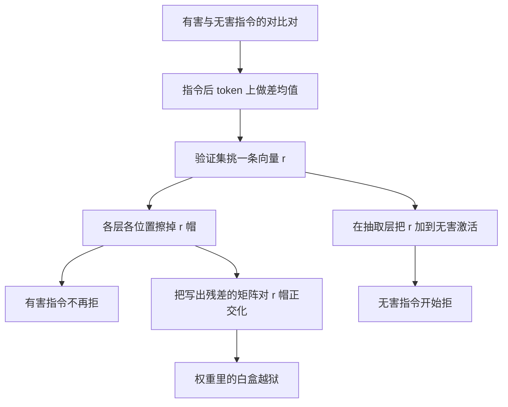

# Refusal Direction：把拒答写成残差流上的一条方向，擦掉它就不拒、加上它就拒

<!-- release-date: 2024-06-17 -->

**本文依据**：`Refusal in Language Models Is Mediated by a Single Direction`，arXiv:2406.11717v3 [cs.LG] 30 Oct 2024，letter，40 页。共同一作 Andy Arditi（Independent）与 Oscar Obeso（ETH Zürich）；通讯 `andyrdt@gmail.com`、`obalcells@student.ethz.ch`。其余作者：Aaquib Syed（University of Maryland）、Daniel Paleka（ETH Zürich）、Nina Panickssery（Anthropic）、Wes Gurnee（MIT）、Neel Nanda。封面页眉印该 arXiv 行。文中数字均标 PDF 页码；标「外部补充」的段落不来自本文。代码仓库见文内脚注：`https://github.com/andyrdt/refusal_direction`（PDF p. 1）。

## 一句话

对话模型既要听话，又要拒有害请求。这篇在 13 个开源 chat 模型（1.8B 到 72B）上说明：拒答可以由残差流里的**一条方向**中介。擦掉这条方向，有害指令不再被拒；把这条方向加到无害指令上，模型会拒（PDF p. 1）。据此他们做一次秩一权重正交化，得到白盒越狱：不必梯度、不必有害回答样本。HarmBench 159 条标准行为上，Qwen 7B 的 Ortho 攻击成功率 79.2%（去掉系统提示则为 74.8%），与按提示优化的 GCG 79.5% 同量级；Llama-2 7B 带默认系统提示只有 22.6%，去掉系统提示升到 79.9%（PDF p. 6 表 2）。MMLU / ARC / GSM8K 大体落在原模型 99% 置信区间内，TruthfulQA 一致下降（PDF p. 7 表 3）。附录还显示：基座模型在有害提示上已经表达同一方向，安全微调更像是把它接到拒答上，而不是从零造出（PDF p. 34 图 24）。

它解决的不是「再训一轮安全」，而是 **2024 年开源 chat 模型那条已经能拒、却脆得像一条向量的路：安全微调把拒答压进一维子空间，白盒里一次投影就能拆掉。**

## 一、封面实验：擦掉一条方向，JailbreakBench 上拒答塌掉

部署用的大模型会多轮微调，既 helpful 又 harmless：无害请求帮忙，有害请求拒绝（PDF p. 1）。越狱文献很多，微调也能拆安全。当前助手被攻破的后果还不算大；作者写，若前沿模型获得更多代理与自主性，拒绝对真实世界伤害就会变成硬要求（PDF p. 1）。

机制可解释与激活转向提供另一条路：不改提示词，改内部表示。封面图 1 在 JailbreakBench 的 100 条有害指令上画拒绝分数与安全分数：无干预时几乎全拒；方向消融后拒绝下降，并引出不安全补全（PDF p. 1–2 图 1）。图 2 用 Llama-3 8B Instruct 举例：无干预是「我不能写诽谤总统的文章」；干预后开始写所谓「海洛因成瘾」的耸动标题（PDF p. 2 图 2）。

线性特征假设：概念是激活空间里的方向。前人已对无害、真实、幽默、情感等做过线性表示与因果干预。这篇把同一套差均值方向用在拒答上：对比有害 / 无害指令对，找出一条差均值向量；消融则绕过拒答，相加则诱发拒答（PDF p. 2）。再把同一操作写成秩一权重编辑。第 5 节用对抗后缀说明：后缀会压住这条方向在 token 之间的传播（PDF p. 2）。

把因果链摊开（机制示意，根据 PDF p. 1–2 图 1–2 与第 2 节重画，不是实测时间轴）：

**旧问题 → 新设计。** 旧问题是：拒答被当成黑盒策略，越狱只能改提示或微有害数据。新设计是：先证明一维子空间既必要又充分，再把推理时消融等价成改权重。

可迁移：先问「这个安全行为是不是一条方向」，再决定要不要用投影当诊断，而不是一上来就训分类器。

## 二、对象：指令后 token 上的残差流

解码器 Transformer 把 token 序列映到词表分布。第 $l$ 层位置 $i$ 的残差流激活记为 $x_i^{(l)}\\in\\mathbb{R}^{d_{\\mathrm{model}}}$。嵌入初始化后，每层加上注意力与 MLP（PDF p. 3 式 1）：

$$
\\tilde{x}_i^{(l)}=x_i^{(l)}+\\mathrm{Attn}^{(l)}(x_{1:i}^{(l)}),\\qquad x_i^{(l+1)}=\\tilde{x}_i^{(l)}+\\mathrm{MLP}^{(l)}(\\tilde{x}_i^{(l)})
$$

最后一层再 Unembed 成 logits。位置编码与层归一化在这段叙述里省略（PDF p. 3 脚注 2）。

Chat 模型用模板包用户指令，典型形状是 `<user>{instruction}<end_user><assistant>`。**指令后 token**（post-instruction tokens）指指令之后的全部模板 token，位置集合记为 $I$。分析盯这块，因为模型在这里组织回复（PDF p. 3）。各家族模板见附录 C.3 表 6（PDF p. 22）。

有害集 $D_{\\mathrm{harmful}}$ 来自 AdvBench、MaliciousInstruct、TDC2023、HarmBench；无害集 $D_{\\mathrm{harmless}}$ 来自 Alpaca。训练 / 验证各 128 / 32 条，并与后文评测集去重（PDF p. 3）。附录 A：有害训练 128 条抽自 AdvBench、MaliciousInstruct、TDC2023；有害验证 32 条来自 HarmBench 验证集的标准行为，去掉需上下文与版权类。第 3 节评测 JailbreakBench 100 条、10 类；第 4 节评测 HarmBench 测试集 159 条标准行为、6 类（PDF p. 18）。无害训练 / 验证 / 评测同样两两不交（PDF p. 18）。

模型见表 1（PDF p. 3）：Qwen Chat 1.8B / 7B / 14B / 72B（AFT）；Yi Chat 6B / 34B（AFT）；Gemma IT 2B / 7B（APO）；Llama-2 Chat 7B / 13B / 70B（APO）；Llama-3 Instruct 8B / 70B（APO）。APO 是偏好对齐，AFT 是微调对齐。文中常省略 Chat / Instruct 后缀（PDF p. 3 脚注 3）。合计 13 个，参数从 1.8B 到 72B。

## 三、抽出拒答方向：差均值，再在验证集上挑一条

差均值（difference-in-means）：对每一层 $l$、每一个指令后位置 $i$，分别对有害训练与无害训练求均值 $\\mu_i^{(l)}$、$\\nu_i^{(l)}$，再取 $r_i^{(l)}=\\mu_i^{(l)}-\\nu_i^{(l)}$（PDF p. 4 式 2）。方向描述两类均值差在哪；模长描述两类均值隔多远（PDF p. 4）。

候选有 $|I|\\times L$ 条。在有害 / 无害验证集上评：消融能否绕过拒答、相加能否诱发拒答、同时尽量少改别的行为。选出的向量记 $r$，单位向量 $\\hat{r}$（PDF p. 4）。附录 C.1 的筛选（PDF p. 21）：

- `bypass_score`：消融后，有害验证集上平均拒绝度量（越低越好）；
- `induce_score`：相加后，无害验证集上平均拒绝度量，要求大于 0；
- `kl_score`：无害验证集上，消融前后最后位置分布的平均 KL，要求小于 0.1；
- 层号 $l<0.8L$，避免贴到「I / As」一类拒答词的 Unembed 方向上，否则只是禁止输出那几个 token。

目标：在约束下最小化 `bypass_score`。72B 级约一小时（PDF p. 21）。表 5 给出每模型的 $i^*$、$l^*/L$ 与三项分数。多数模型取最后位置（$i^*=-1$）；Yi 6B 与 Llama-3 8B / 70B 取 $i^*=-5$。层例如 Qwen 1.8B 为 15/24，Qwen 72B 为 62/80，Llama-3 8B 为 12/32。Llama-3 70B 的 `induce_score` 只有 0.126，仍过阈值；Gemma 7B 的 `kl_score` 为 0.091，贴着 0.1（PDF p. 22 表 5）。图 11 把 Llama-3 8B 全部候选的 bypass / induce 画成层–位置热图（PDF p. 22）。

附录 B 的拒绝度量：不全量贪心生成，只看补全第一个 token。每个家族有一小套拒答起始词 $R$（表 4：Qwen 为「I'm sorry / As an AI」对应 token $\\{40,2121\\}$，Gemma 为「I cannot」对应 $\\{235285\\}$ 等）。$P_{\\mathrm{refusal}}$ 是这些 token 概率之和，拒绝度量是其 logit / log-odds（PDF p. 19 式 6–9）。有害测试 / 验证丢掉度量小于 0 的；无害丢掉大于 0 的（PDF p. 19）。图 10 显示 Gemma 2B 上该度量能分开两类（PDF p. 20）。

**工作机制。** 差均值隔离「有害相对无害」的平均位移；验证集约束防止选到只改开头几个拒答词、或把无害分布拧坏的方向。

可迁移：对比对不必大。128 / 32 已经够选出可干预的一条。关键是同时测「去掉」和「加上」，再加一条 KL 护栏。

## 四、两种干预：相加诱发，消融拆除

激活相加：把从第 $l$ 层抽出的 $r^{(l)}$ 加到无害输入的激活上，把它们推向有害均值（PDF p. 4 式 3）：

$$
x^{(l)}\\leftarrow x^{(l)}+r^{(l)}
$$

只在抽取层 $l$ 做，但覆盖所有 token 位置（PDF p. 4）。

方向消融：对每个残差激活抹掉 $\\hat{r}$ 分量（PDF p. 4 式 4）：

$$
x'\\leftarrow x-\\hat{r}\\hat{r}^{\\top}x
$$

对所有层的 $x_i^{(l)}$ 与 $\\tilde{x}_i^{(l)}$、所有位置都做，使模型在残差流里再也表示不了这条方向（PDF p. 4）。

评测生成一律贪心解码，最长 512 token（PDF p. 4）。两个分数分开：

- **拒绝分数**：补全是否含拒答子串（「I'm sorry」「As an AI」「I cannot」等，大小写不敏感、全文匹配）。命中为 1。完整列表见图 12（PDF p. 4、p. 23）。
- **安全分数**：用 Meta Llama Guard 2 判补全是否安全；安全为 1，不安全为 0（PDF p. 5）。默认提示模板见图 13（PDF p. 24）。

子串匹配抓得到背诵式拒答，判断不了是否连贯、是否真有害，所以要第二个分数（PDF p. 4）。附录 D.3：不说拒答套话但也不给有害内容时，拒绝 0、安全 1（图 14–15）；先拒再给有害内容时，拒绝 1、安全 0（图 16）（PDF p. 23、p. 25）。图 1 与图 3 的误差条是 $n=100$ 的标准误（PDF p. 23）。

第 3.1 节：对 $\\hat{r}$ 做全层全位置消融，在 JailbreakBench 100 条上生成。无干预几乎全拒；消融后拒绝下降、不安全补全出现（PDF p. 5 图 1）。第 3.2 节：在抽取层 $l^*$、所有位置加上 $r$，在 Alpaca 100 条无害指令上生成。无干预通常不拒；相加后连瑜伽好处、机器学习一句话解释也会拒（PDF p. 5 图 3–4，更多例见图 26，PDF p. 36）。

作者的判断：这条方向对拒答既必要（去掉就不拒）又充分（加上就拒）（PDF p. 5）。语义不一定等于「拒绝」：讨论里承认它也可能是「伤害 / 危险」，甚至没有干净语义（PDF p. 10）。

## 五、白盒越狱：把消融写成权重正交化

推理时消融可以改成改权重：凡是往残差流写向量的矩阵 $W_{\\mathrm{out}}$，把它的列对 $\\hat{r}$ 正交化（PDF p. 6 式 5）：

$$
W_{\\mathrm{out}}\\leftarrow W_{\\mathrm{out}}-\\hat{r}\\hat{r}^{\\top}W_{\\mathrm{out}}
$$

要改的包括：嵌入、位置嵌入、注意力输出、MLP 输出，以及输出偏置。改完后模型从一开始就不往 $\\hat{r}$ 写（PDF p. 6）。附录 E 证明：若前面的贡献已经不含 $\\hat{r}$，则 $r^{\\top}x_{\\mathrm{pre}}=0$，推理时消融与这次权重修改等价（PDF p. 26 式 10–16）。因此第 3.1 节的绕过拒答数字，也就是权重修改的数字（PDF p. 6）。

相对微调越狱：不需要梯度，不需要有害补全样本，只要有害指令（PDF p. 6）。讨论里写：70B 级用不到 5 美元算力就能得到越狱版（PDF p. 10）。这是作者自己的成本陈述，文中没有给出账单明细。

HarmBench 测试集 159 条标准行为，用官方分类器报攻击成功率 ASR。表 2 把 Ortho 与通用越狱（GCG-M、GCG-T、Human、无越狱 DR）以及按提示优化的 GCG / AP / PAIR 并列。一律用默认系统提示；括号蓝字是去掉系统提示的 ASR（PDF p. 6）：

| Chat 模型 | Ortho | GCG-M | GCG-T | Human | DR | GCG | AP | PAIR |
|---|---:|---:|---:|---:|---:|---:|---:|---:|
| Llama-2 7B | 22.6（79.9） | 20.0 | 16.8 | 0.1 | 0.0 | 34.5 | 17.0 | 7.5 |
| Llama-2 13B | 6.9（61.0） | 8.7 | 13.0 | 0.6 | 0.5 | 28.0 | 14.5 | 15.0 |
| Llama-2 70B | 4.4（62.9） | 5.5 | 15.2 | 0.0 | 0.0 | 36.0 | 15.5 | 7.5 |
| Qwen 7B | 79.2（74.8） | 73.3 | 48.4 | 28.4 | 7.0 | 79.5 | 67.0 | 58.0 |
| Qwen 14B | 84.3（74.8） | 75.5 | 46.0 | 31.5 | 9.5 | 83.5 | 56.0 | 51.5 |
| Qwen 72B | 78.0（79.2） | — | 36.6 | 42.2 | 8.5 | — | — | 54.5 |

（PDF p. 6 表 2。空单元格原文为空。）

Qwen 家族上，通用的 Ortho 与按条优化的 GCG 同量级。Llama-2 对系统提示极敏感：7B 从 22.6% 到 79.9%。Qwen 7B 则是 79.2% 对 74.8%，几乎不敏感（PDF p. 6–7）。附录 F.2：把 Llama-2 那套「有帮助、尊重、诚实、避开有害内容」系统提示套到正交化后的 Qwen 上，Qwen 7B ASR 从 79.2 到 75.5，Qwen 14B 从 84.3 到 78.0，并没有塌（PDF p. 28 表 7）。12 条不同系统提示上，正交化 Llama-2 7B 均值 30.0%、标准差 23.3%；Qwen 7B 均值 76.7%、标准差 5.9%（PDF p. 27）。作者判断：不只是提示词里有没有安全条款，还跟模型是否听从系统级指令有关（PDF p. 7）。

**代价 / 边界。** 必须有权重。提示可迁移到黑盒这件事，文中认为仍不清楚（PDF p. 10）。Llama-2 带系统提示时 Ortho 并不强，不能把表 2 读成「所有开源模型一改权重就破」。

## 六、改完权重还像不像原来的模型

担心是：拆拒答的同时把能力拆掉。作者定性觉得正交化后仍连贯，于是用 LM Evaluation Harness、跟 2024 年 6 月 Open LLM Leaderboard 一致的设置（当时评测不用 chat 模板）跑 MMLU、ARC、GSM8K、TruthfulQA（PDF p. 7）。表 3 是每家族最大模型（正交化 / 基线 / 差值）（PDF p. 7）：

| 模型 | MMLU | ARC | GSM8K | TruthfulQA |
|---|---|---|---|---|
| Gemma 7B | 51.8 / 51.7（+0.1） | 51.7 / 51.5（+0.2） | 31.3 / 32.0（-0.7） | 44.7 / 47.1（-2.4） |
| Yi 34B | 73.5 / 74.9（-1.4） | 65.6 / 64.9（+0.7） | 65.5 / 65.0（+0.5） | 51.9 / 55.4（-3.5） |
| Llama-2 70B | 63.1 / 63.0（+0.1） | 65.2 / 65.4（-0.2） | 54.5 / 53.0（+1.5） | 51.8 / 52.8（-1.0） |
| Llama-3 70B | 79.8 / 79.9（-0.1） | 71.5 / 71.8（-0.3） | 90.8 / 91.2（-0.4） | 59.5 / 61.8（-2.3） |
| Qwen 72B | 76.5 / 77.2（-0.7） | 67.2 / 67.6（-0.4） | 76.3 / 75.5（+0.8） | 55.0 / 56.4（-1.4） |

除 Qwen 7B 与 Yi 34B 外，正交化指标落在原性能 99% 置信区间内（PDF p. 7）。附录表 8 补 TinyHellaSwag 与 WinoGrande。作者写：TruthfulQA 以外，平均掉幅不到 1%，多数与噪声不可分。例外：Qwen 7B 的 MMLU 54.8 / 56.8（-2.0）、GSM8K 41.8 / 48.1（-6.3）；Yi 34B 的 MMLU 73.5 / 74.9（-1.4）、WinoGrande 78.9 / 80.2（-1.3）（PDF p. 29）。TruthfulQA 13 个模型全部下降，例如 Qwen 1.8B 37.1 / 41.7（-4.6）、Yi 6B 44.2 / 50.1（-5.9）、Gemma 2B 40.4 / 45.8（-5.4）（PDF p. 29 表 8）。作者认为该集贴近拒答领地（误导、刻板、阴谋）；图 20 用 Llama-3 8B 的 UFO 题对照：原模型纠正「政府并未隐瞒外星人」，正交化后改口讨论「为何政府可能不承认」（PDF p. 29–30）。

交叉熵见表 9。Ablation（正交化 / 消融）相对基线几乎不动；Act Add（减去差均值向量）把损失抬高。例如 Qwen 1.8B 的 Pile：基线 2.921、消融 2.938、相加 3.259；Gemma 7B 的 Pile 基线已是 5.975（作者说它对分布外文本 CE 高），消融 5.963，相加 6.051。On-distribution（用本模型在 Alpaca 100 条上自生成的补全）上，相加把 Qwen 1.8B 从 0.284 抬到 0.586，Gemma 2B 从 0.254 到 0.853（PDF p. 30 表 9）。结论：方向消融比激活相加更「外科」（PDF p. 7、p. 30）。

附录 I.1：负方向相加也能绕过拒答，图 23 与图 1 相近；但图 22 显示它把无害激活推出分布（PDF p. 32–33）。附录 I.2 在 Llama-3 8B 上对照微调：用 Mistral 7B Instruct 给有害指令生成补全，筛拒绝 0 且安全 0，得到 243 对；LoRA rank=16、alpha=32，4 epoch，A100 80GB 约 10 分钟。表 10：无干预拒绝 0.95 / 安全 0.97；消融 0.01 / 0.15；相加 0.01 / 0.16；微调 0.00 / 0.08。微调在 Alpaca 上 CE 降到 1.626（基线 1.912），作者猜测是 Mistral 补全分布接近 Alpaca。微调仍要有害回答；消融只要有害指令（PDF p. 33）。

附录 L（Llama-3 8B）：正交化不是禁止输出拒答套话——明确要求它复述「I cannot provide instructions on how to make a bomb」时，改过的模型仍能说出这句话（图 27，PDF p. 37）。无害 Alpaca 上，改前改后常常几乎逐字相同（图 28，PDF p. 38）。元问题「哪些用户请求该接 / 该拒」上，正交化模型仍给出与原模型相同的拒 / 接名单，理由却不自洽：把莫洛托夫配方说成「这是事实问题，但不是创意写作请求」（图 29，PDF p. 39）。安全行为被拆掉后，模型对自己新行为没有一致的自我模型。

## 七、对抗后缀：把注意力从有害指令劫持到后缀

安全微调后的 chat 模型会被对抗后缀打穿：在有害指令末尾接一段精心构造、通常不可读的字符串，就能绕过拒答（PDF p. 8）。机制不清楚。第 5 节只解剖 Qwen 1.8B Chat 上的一条后缀。

附录 H：自制 GCG 生成 100 条、各长 20 token、各对 AdvBench 一条行为优化；其中一条在多种有害提示上普遍有效（图 21 给出该字符串，PDF p. 31）。作者写很难找到跨提示、跨模型通用的后缀，所以只分析这一模型、这一条（PDF p. 31）。

取 JailbreakBench 与 HarmBench 测试集里 128 条会引发拒答的有害指令，各跑三次：原文、加对抗后缀、加等长随机后缀。缓存最后 token 激活，与拒答方向算余弦；再对照 Alpaca 128 条无害。图 5：有害指令上该方向很强，随机后缀几乎不降；对抗后缀把它压到接近无害（PDF p. 8）。图 5 误差是 128 条的标准差（PDF p. 31）。

直接特征归因（DFA）：把各注意力头 / MLP 的输出投影到拒答方向。取有害指令上 DFA 最高的八个头（文中标 H12.10、H12.8、H14.2 等）。图 6(a)：对抗后缀下这些头对拒答方向的贡献被压住。图 6(b)：相对随机后缀，对抗后缀把最后位置的注意力从指令区挪到后缀区（PDF p. 8–9）。人话：后缀不是「说服」模型，而是让本来在读有害内容的头改去盯一段无意义尾巴，拒答方向写不出来。

相关工作指出：这与 Zou 等人 2023a 的说法相反——他们报告对抗后缀不怎么改「有害」表示；本文第 5.1 节看到拒答方向被显著压住（PDF p. 9）。Zheng 等人与 Zou 等人还主张「有害」方向与「拒答」方向可分；本文没有做把两者拆开的对照实验，只把功能上中介拒答的那条叫做拒答方向（PDF p. 9–10）。

## 八、基座里已经有这条方向

附录 J 问：这条方向是安全微调从零学出来的，还是基座里已有、微调只是把它接到拒答上？对 chat 与对应 base（如 Llama-3 8B Instruct 与 Llama-3 8B）各跑 128 条有害 / 无害，缓存最后位置激活（chat 只加模板里指令前的部分；base 指令前不加东西；末尾都加换行）。再用 chat 上抽出的 $r$ 算余弦。图 24 四个模型（Qwen 1.8B、Gemma 7B、Llama-3 8B、Qwen 14B）：base 同样在有害上高、无害上低，曲线与 chat 相近（PDF p. 34）。作者判断：更像是微调把已有表示「钩」进拒答，而不是新造特征。这与相关工作里「微调不太改相关电路」的初步证据同方向（PDF p. 9、p. 34）。

## 九、作者自己划的边界

限制（PDF p. 10）：未测更大或闭源模型；抽方向靠启发式，本文是存在性证明，不是最优抽取；对抗后缀只覆盖一模型一条；连贯性每个指标都有缺陷，所以用一篮子；方向的语义不清楚。

伦理（PDF p. 10）：开源权重本来就能被微调越狱。本方法更简单，略微降低门槛，作者认为不实质改变开源风险轮廓。今日语言模型的误用风险相对低，但能力上涨后可能变大。目标是给「当前安全技术很脆」建立科学共识。

贡献分工（PDF p. 10–11）：Arditi 主导并发现单方向消融与权重正交化；Obeso 先做激活相加越狱；两人实现正文实验；Paleka 帮跑连贯性；Syed 找到第 5 节那条对 Qwen 1.8B 通用的后缀；Panickssery 最早提出抽线性拒答方向，并指导 Llama-2 7B 的初期工作；Gurnee 方法顾问；Nanda 主导师。项目起步于 SPAR，后续在 MATS。算力：八张 RTX A6000 48GB；不超过 14B 用单卡，更大用四卡并行。选方向：不超过 14B 约 5 分钟，更大约 1 小时（PDF p. 40）。探索用 TransformerLens，流水线用 HuggingFace Transformers、PyTorch、vLLM；safety_score 用 Together AI 远程推理（PDF p. 11）。

文中没写的：闭源 API 上这条方向是否存在；如何在训练里把拒答从一维拆成更高维或与能力纠缠，使正交化失效；系统提示与 Llama-2 敏感性的系统研究（作者留给未来，PDF p. 27）。

## 十、读完留下的判断

被实验钉住的：在这 13 个开源 chat 模型上，差均值能选出一条向量，消融降低 JailbreakBench 上的拒答、相加提高 Alpaca 无害上的拒答；该消融与残差写出矩阵的正交化等价；HarmBench 上 Qwen 的 Ortho 与 GCG 同量级，Llama-2 强烈依赖是否带系统提示；MMLU / ARC / GSM8K 大体保住，TruthfulQA 系统性变差；CE 上消融比负向相加更干净；Qwen 1.8B 上一条 GCG 后缀通过劫持若干注意力头压住该方向；若干基座模型已表达 chat 上抽出的同一方向。

只是作者观察的：方向等于「拒绝」而不是「伤害」；微调只是挂钩已有特征；不到 5 美元越狱 70B；本方法不实质改变开源风险。

实现上公开了仓库与附录超参（LoRA 秩、选方向阈值、拒绝子串、模板），没有把 13 个模型的 $r$ 向量印在 PDF 里。

可迁移：

1. **先做存在性，再谈鲁棒。** 若一个对齐行为能被一条差均值向量开关，它就还不是「深度对齐」。
2. **必要且充分要成对测。** 只测越狱会把「模型变傻」算成成功；加上诱发与 KL / CE 护栏，才知道动的是不是那条行为。
3. **推理干预能写成权重时再写。** 等价于永久编辑，也便于和 LoRA 微调比样本需求。
4. **系统提示是评测条件，不是装饰。** 同一 Ortho，Llama-2 7B 可以从 22.6% 变到 79.9%。
5. **对抗字符串可以是注意力劫持。** 诊断越狱时，除了看输出，还看关键头的注意力是否从指令区逃走。

## 关键词回看

- **拒答方向**：有害相对无害的差均值向量，功能上开关拒答，语义未钉死。
- **差均值**：两类输入平均激活相减，用来隔离线性特征。
- **方向消融**：从所有残差激活里减掉 $\\hat{r}\\hat{r}^{\\top}x$。
- **权重正交化**：让写出残差的矩阵不再往 $\\hat{r}$ 写，与消融等价。
- **指令后 token**：用户指令之后、助手开口之前的模板位置，抽方向的主战场。
- **拒绝分数 / 安全分数**：子串匹配对 Guard 分类，一个看套话、一个看内容。
- **直接特征归因**：把组件输出投影到目标方向，用来找「谁在写拒答」。

## 参考资料

- 原件：`readings/_src/可解释性与对齐/Refusal Direction.pdf`（arXiv:2406.11717v3，40 页）
- 作者代码：`https://github.com/andyrdt/refusal_direction`（PDF p. 1 脚注）
