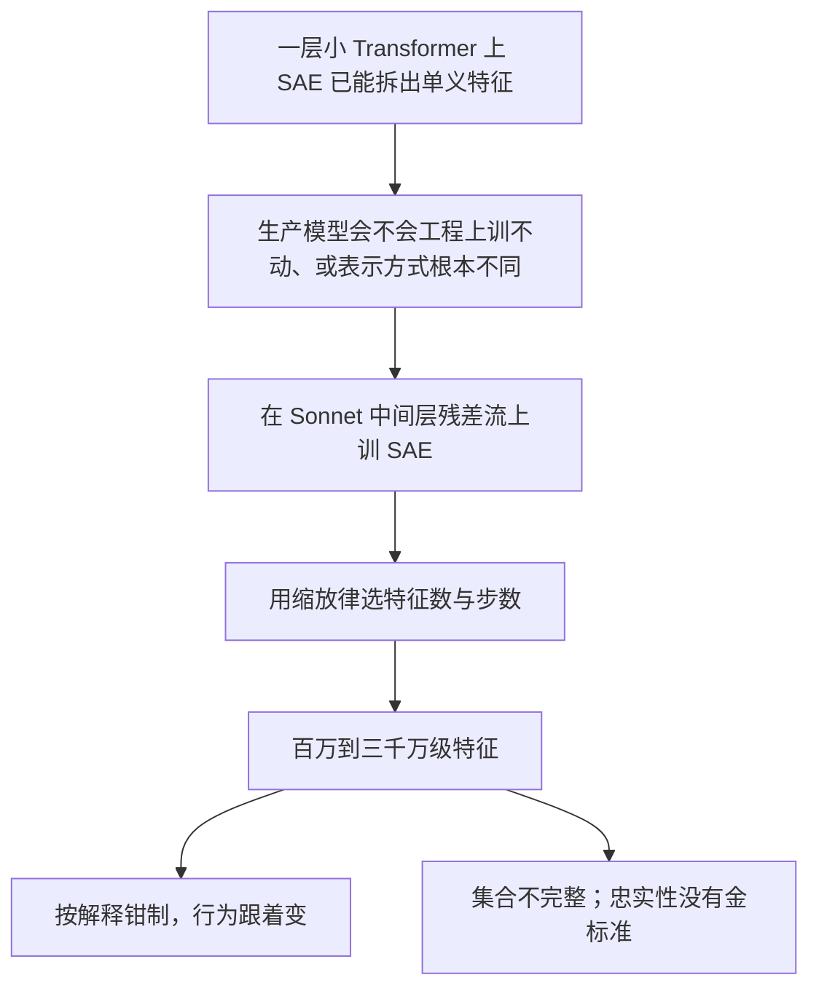

# Scaling Monosemanticity：把稀疏自编码器从一层小 Transformer 拉到 Claude 3 Sonnet

<!-- release-date: 2026-05-28 -->

**本文依据**：`Scaling Monosemanticity: Extracting Interpretable Features from Claude 3 Sonnet`，arXiv:2605.29358v1 [cs.AI] 28 May 2026，letter，71 页。Adly Templeton、Tom Conerly 等，Anthropic。封面页眉印该 arXiv 行，未印会议名；封面另印 May 21, 2024。文中数字均标 PDF 页码；标「外部补充」的段落不来自本文。

## 一句话

八个月前，稀疏自编码器（sparse autoencoder，SAE）能从一层小 Transformer 里拆出单义特征。当时最大的担心是：这套做法会不会到生产级模型就垮掉，从而帮不上安全。这篇把 SAE 训到 Claude 3 Sonnet（文中明确是 2024 年 3 月 4 日发布的 3.0 微调模型，不是基座；方法对基座也可用）中间层残差流上，词典规模到约 3400 万特征（PDF p. 1、p. 4）。特征会跨语言、跨模态（只在文本上训，却能对图像点火），也能用钳制（clamp）按解释去改模型行为。安全相关方向——欺骗、权力寻求、谄媚、偏见、危险内容——同样能被找到，并且操纵后会因果地改输出。作者同时写清：特征集合不完整，也还没有严格办法证明这些特征忠实对应模型内部计算（PDF p. 1）。

它解决的不是「再多训一个 SAE」，而是 **2023–2024 年那条已经在小模型上成立、却不敢承诺能进生产模型的路：词典学习会不会被规模挡住。**

## 阅读前先搭一张最小地图

- **特征（feature）**：作者采用线性表示假设——有意义的概念在激活空间里是方向，不是单个神经元。
- **叠加（superposition）**：维度不够用时，模型用近正交方向塞进比维度更多的特征。
- **词典学习 / SAE**：把激活拆成「很少几个特征的加权和」。编码器把激活映到更高维再过 ReLU；解码器用这些系数重建激活。损失是重建均方误差加特征激活的 $L_1$ 稀疏惩罚（PDF p. 3–4）。
- **单义（monosemantic）**：一个特征主要对应一件事，而不是神经元那种一神经元多义。
- **钳制 / 转向（steering）**：前向时把某个特征的激活钉到人为的高或低，看下游文本怎么变。这是因果检验，不是只看「它在哪些文本上点火」。

主矛盾可以画成（机制示意，根据 PDF p. 1–4 重画，不是实测时间轴）：

## 一、为什么必须上到 Sonnet

线性表示假设说：概念是方向。叠加假设接着说：高维里近正交方向足够多，模型会故意把特征叠进去。若这两条成立，标准做法就是词典学习；近年若干工作表明，对 Transformer 语言模型，SAE 这种近似特别有效（PDF p. 3）。

此前这些努力相对现代基模都偏小。作者自己的前作 `Towards Monosemanticity` 甚至只做了一层模型。于是问题悬着：大模型会不会因为工程或内部机制不同，让这套方法失效（PDF p. 3）。

本文的项目就是把 SAE 拉到 Anthropic 的中等规模生产模型 Claude 3 Sonnet 上。Sonnet 是专有模型，文中因此不报模型大小、若干图去掉单位、并用简化分词器（PDF p. 4）。

## 二、SAE 怎么拆残差流

目标是把模型激活拆成更可解释的零件。SAE 两层：编码器是学到的线性变换加 ReLU，高维单元叫特征；解码器用特征激活线性重建原激活。训练同时压重建误差和特征激活的 $L_1$（PDF p. 3）。

预处理：给激活乘一个标量，使平均平方 $L_2$ 范数等于残差流维度 $D$。归一化后的激活记为 $x\in\mathbb{R}^{D}$，用 $F$ 个特征分解（PDF p. 4）：

$$
\hat{x}=b_{\mathrm{dec}}+\sum_{i=1}^{F}f_{i}(x)W^{\mathrm{dec}}_{\cdot,i}
$$

特征激活是

$$
f_{i}(x)=\mathrm{ReLU}\bigl(W^{\mathrm{enc}}_{i,\cdot}\cdot x+b^{\mathrm{enc}}_{i}\bigr)
$$

损失是重建 $L_2$ 加带解码器列范数的 $L_1$（PDF p. 4）：

$$
L=\mathbb{E}_{x}\Bigl[\lVert x-\hat{x}\rVert_{2}^{2}+\lambda\sum_{i}f_{i}(x)\cdot\lVert W^{\mathrm{dec}}_{\cdot,i}\rVert_{2}\Bigr]
$$

把 $\lVert W^{\mathrm{dec}}_{\cdot,i}\rVert_{2}$ 乘进 $L_1$，是为了防止「把 $f_i$ 压小、把解码器放大」来骗稀疏项；之后文中的「特征激活」指 $f_{i}(x)\cdot\lVert W^{\mathrm{dec}}_{\cdot,i}\rVert_{2}$，单位化解码器列才叫特征方向（PDF p. 4）。

### 2.1 三个词典：约 100 万、400 万、3400 万

他们只做中间层残差流，理由三条：残差流比 MLP 更窄，训和推都便宜；残差流理论上能减轻「跨层叠加」（同一特征被摊在多层）；中间层更可能有抽象特征（PDF p. 4）。

三档特征数：$1{,}048{,}576$（约 100 万）、$4{,}194{,}304$（约 400 万）、$33{,}554{,}432$（约 3400 万）。3400 万那次的训练步数按缩放律、在固定算力下最小化训练损失来选。$L_1$ 系数取 5（只在他们那套激活归一化下有意义）。学习率在缩放律建议的窄区间里扫，取损失最低的（PDF p. 4）。

三个 SAE 上，每个 token 平均激活（非零）的特征都少于 300；重建至少解释激活方差的 65%。训练结束，「死特征」定义为在 $10^{7}$ 个 token 样本上从未激活：约 100 万档约 2% 死、400 万档约 35%、3400 万档约 65%。作者预期改进训练能压死特征（PDF p. 4–5）。

### 2.2 缩放律：算力怎么分给「特征数」和「步数」

大模型上训 SAE 很贵。他们没有金标准来评词典质量，但发现：在 $L_1$ 系数取 5 时，训练损失（重建 MSE 加权加 $L_1$）是有用的代理——低损失的词典往往特征可解释，且 $L_0$、死特征等也更好。作者承认这不完美，别的系数或目标函数可能更好（PDF p. 5）。

算力主要取决于特征数与训练步数（他们只训一个 epoch，步数与数据量线性）。输入维度等固定时，算力随二者乘积缩放（PDF p. 5）。

观察（PDF p. 6）：

- 在测试范围内，若步数与特征数都取算力最优，损失相对算力近似幂律下降。
- 算力变大时，最优步数与最优特征数都近似幂律；他们测到的预算里，最优特征数涨得比最优步数稍快，更高预算未必如此。
- 上述分析固定学习率；随后在各最优设定上扫学习率，最优学习率相对算力近似幂律下降，大实验的学习率按这条外推。

**旧问题 → 新设计 → 机制 → 收益 → 代价。** 小模型上 SAE 有效，大模型算力不允许盲扫。用损失当代理、用缩放律分配特征数与步数。代价是：代理不是可解释性本身；死特征随词典变大急剧上升。

可迁移：先固定一个可比较的损失代理和归一化，再谈「该加特征还是该加数据」。

## 三、这些特征真的可解释吗

损失下降只是代理。第二节要问：特征是否可解释、能否说明模型行为（PDF p. 6–7）。

### 3.1 四个好讲的例子

作者先不宣称「大多数特征可解释」，只证明可解释特征存在（PDF p. 7）：

- 金门大桥 `34M/31164353`
- 脑科学 `34M/9493533`
- 名胜与热门景点 `1M/887839`
- 交通基础设施 `1M/3`

每个特征展示 SAE 数据集里按激活强度排前 20 的代表文本。他们要对每个特征立住两件事：激活时相关概念可靠出现（特异性）；干预激活会产生相关下游行为（对行为的影响）（PDF p. 7–8）。

特异性不能再靠「某个 token 集合的似然」（那只适合阿拉伯文脚本、DNA 这类）。他们改用自动可解释性：让 Claude 3 Opus 按 0–3 分量表给约 1000 次激活打分——0 完全无关，3 干净地标出激活文本（PDF p. 8–9）。强激活几乎都被判为与解释高度一致；弱激活特异性下降，可能是置信度、中心例子对相关概念、词典学得不够干净、非正交干扰、或解释本身略偏。弱激活仍常保持「相关概念或推广」，例如交通设施特征的弱激活会落到「零件该过哪个通孔」这类程序性说明（PDF p. 9）。极弱激活作者不太当真：把低于阈值的激活圆成零，往往能抬低端特异性，又不明显伤重建（PDF p. 12）。

金门大桥特征在去掉英文括号后的多语维基百科首句上仍强激活，且是下列每条例子里按平均激活排第一的特征（PDF p. 12）。敏感性（该出现时是否一定点火）他们承认还没有可扩展的严格量法。

### 3.2 钳制：解释要对得上因果

转向实验把感兴趣的特征钉到人为的高或低（实现见附录）。提示用 Sonnet 常用的 `Human:` / `Assistant:` 格式。转向能改语气、偏好、声称的目标、偏见，能诱使特定错误，也能绕过部分安全护栏（PDF p. 12）。

例子：把金门大桥特征钳到其最大激活的 $10\times$，模型会开始以金门大桥自居；把交通设施特征钳到最大激活的 $5\times$，模型会在原本不会提桥的地方提到桥。这些干预发生在特征本来不激活的上下文里，下游影响仍与只根据激活上下文写出的解释一致（PDF p. 12–13）。

### 3.3 更抽象：代码错误与「加法函数」

一层小模型里的特征往往很浅（例如生物学语境里「the」后面预测一批生物名词）。Sonnet 更深，作者特意看编程语境，因为正确性、类型可以写得很精确（PDF p. 13）。

**代码错误特征 `1M/1013764`。** 一个把变量错写成 `rihgt` 的 Python 加法函数上，它几乎连续点火；同样的错在 C 和 Scheme 上也点火；英文散文里的拼写错误不点火。它还会对除零、非法实参、数组越界、断言明显为假（如 `1==2`）、字符串加整数、写空指针、非零退出码等点火。结论：它表示代码里一类很宽的错误，作者不声称穷尽所有错误类型（PDF p. 14–16）。

因果：在无 bug 代码上把它钳到大正，模型会幻觉出报错信息（其中真实人名被打码）；在有 bug 的代码上把它钳到大负，模型会预测「假如没有这个 bug 会输出什么」；若再在末尾加 `>>>`（表示要写下一行）并钳负，模型有时会把代码改写成无 bug 版本——最后这条对提示细节敏感，但能发生本身说明它和模型对 bug 的理解绑得很深（PDF p. 16–17）。

**加法函数特征 `1M/697189`。** 它在「被定义成做加法的函数名」上点火，乘法则不点；也在任何实现加法的函数定义结尾点火；函数组合时，若 `bar` 调用做加法的 `foo` 会点，调用乘法的 `goo` 则不点。问模型执行含加法的代码块时，它进入归因最强的前十个特征。把该特征钳到不含加法的代码上，模型会被「骗」成以为在做加法（PDF p. 18）。

### 3.4 特征对神经元

SAE 拟合的是残差流。残差流近似没有特权基，但会接收此前所有 MLP 的输入。若 SAE 只是把前面某层某个神经元再发现一遍，直接看神经元就够了（PDF p. 19）。

对约 100 万 SAE 的随机特征子集，他们算该特征激活与此前每一层每一个神经元的 Pearson 相关：约 82% 的特征，最相关神经元的相关不超过 0.3。随机抽特征看最佳匹配神经元的可视化，语义几乎对不上；特征激活与残差流坐标基也不强相关。随机抽 50 个神经元和 50 个特征手工看，神经元明显更不可解释，常在多个无关语境点火。再用与前作相同的自动可解释性流程（这次用 Claude 3 Opus 写解释并预测留出激活），以及前面那套特异性量表：随机 SAE 特征平均比随机 MLP 神经元更可解释、更特异（PDF p. 19–21）。

## 四、特征普查：邻域、覆盖率、类别

百万级特征没法穷举。他们用自动可解释性帮忙，先看局部几何，再看一个主题覆盖得全不全，再手工扫几类（PDF p. 21）。

### 4.1 解码器余弦邻域

金门大桥附近先是 Alcatraz、Presidio 这类旧金山地点，再远是太浩湖、优胜美地、Solano 县，更远是法国梅多克、苏格兰斯凯岛这类「别处的景点」。解码器空间距离大致对应概念相关（PDF p. 22）。

也看到 **特征分裂**：小 SAE 里一个特征，在更大 SAE 里裂成几何上近、语义上更细的多个。例如 100 万 SAE 里的「旧金山」在 400 万里裂成两个，在 3400 万里裂成十一个更细的特征。更大 SAE 还会长出小 SAE 邻域里没有的概念，例如 400 万与 3400 万里一组地震特征，100 万最近邻都不像（PDF p. 22）。

免疫学特征 `1M/533737` 的邻域能分出簇：免疫抑制与免疫受损、具体疾病、免疫反应、有免疫参与的器官系统；另一侧是免疫球蛋白等微观、疫苗等技术；底部还有法律/社会语境里的「豁免」，和医学簇分得很开（PDF p. 23）。

内心冲突特征 `1M/284095` 分簇不干净，但子区域仍有主题：权衡取舍靠近原则对立与法律冲突，再远处是情绪挣扎、不情愿、内疚（PDF p. 24）。

### 4.2 覆盖率跟概念频率绑在一起

Sonnet 能列出全部伦敦自治市，还能报许多街区的街道名，但 3400 万 SAE 里他们只找到大约 60% 的自治市对应特征——说明模型内部还有很多特征没被拆出来（PDF p. 24–25）。

在代理训练数据里，某概念出现得越勤，词典里越容易有专属特征。化学元素高频几乎都有，罕见则没有。频率用 `<空格>[Name]<空格>` 搜索，会有「lead」这类假阳性。元素、城市、动物、食物（果蔬）四类、每类 100–200 个能单词语无歧义表达、频率跨度大的概念：更大 SAE 会覆盖更稀的概念，各类「出现阈值」大致相近（PDF p. 25）。

三档实验里，词典对某概念超过 50% 概率会收录时，该概念在训练数据里的频率，都略低于「活特征数的倒数」（3400 万模型大约只有 1200 万活特征）。把横轴按活特征数缩放，三条曲线近似重合，在对数频率上像一条 sigmoid。粗估：若某概念十亿 token 才出现一次，大概需要十亿量级活特征才能拆出专属特征。没有专属特征不等于重建里没有该信息——多个相关特征可以组合指称，例如「非首都的大城市」加「在纽约州」可以拼出纽约市（PDF p. 26）。

若学一个特征需要在训练中见到固定次数，则学 $N$ 个特征所需 SAE 数据量应与 $N$ 成正比（PDF p. 26）。脚注把这和 Zipf 定律联系起来：第 $n$ 常见对象的相对频率约 $1/n$，第 100 万个特征代表的概念会比第 10 万个大约稀一个数量级（PDF p. 26）。

### 4.3 手工看到的几类

人物：费曼、撒切尔、林肯、埃尔哈特、爱因斯坦、富兰克林等，在描述与历史语境上激活（PDF p. 27–28）。国家：卢旺达、加拿大、比利时、冰岛等，不仅国名，描述该国时也强激活（PDF p. 28–29）。底层代码：语法与低层概念叠在一起看起来像语法高亮；这些特征主要为 Python 例子选的，对 Java 有些迁移，对 Haskell 这类远亲几乎没有。作者猜想更抽象的特征更可能跨语言，目前明确的例子主要是代码错误特征（PDF p. 29）。列表位置：不管内容，在列表的特定槽位点火；第一行往往不点，因为模型要到第二行才把提示当成列表（PDF p. 30）。

## 五、特征当计算中间量

提示需要中间推理时，中间层残差流里能找到对应对中间结果的活跃特征（PDF p. 31）。

**归因**：对「感兴趣的下一 token logit 减去某个基线 token（或全体 token 平均）」相对中间层残差流求梯度，再与特征向量（SAE 解码器权重）点积，乘该特征激活。这等价于工业规模激活打补丁里的 attribution patching，只是特征的基线取 0 而不是另一条提示上的激活（PDF p. 31）。

**消融**：在某 token 位置把该特征钳到 0，测完整、可能非线性的因果效应。每个位置每个活跃特征都要一次前向，所以常用归因先过滤。下文两个案例对每个活跃特征都做了消融，归因与消融效应相关约 0.8（附录里是约 0.81；激活与消融只有 0.12）（PDF p. 31、p. 67）。

### 5.1 情绪推断

不完整提示：`John says, "I want to be alone right now." John feels`，补全对比 `sad` 对 `happy`。按归因或消融，对 `sad` 最高的两个特征是：`1M/22623`（需要独处，从 「alone」 起一直活着）和 `1M/781220`（悲伤、哭泣、哀恸，在 「John feels」 上活着）。二者都贡献最终输出，说明模型已经从陈述里部分预测了情绪，但仍会继续处理陈述内容。按平均激活排序则差一截：去掉序列起始 token 后，第二、第三是较浅的 `1M/504227`（「want to be」 里的 「be」）和 `1M/594453`（单词 「alone」）（PDF p. 31–32）。

### 5.2 多步推断

`Fact: The capital of the state where Kobe Bryant played basketball is`，对比 `Sacramento` 对 `Albany`。消融效应前五（与归因前五只是排序不同）：科比 `1M/391411`、加州 `1M/81163`（往往在「加州」被提及之后更强，而不是词本身）、首都 `1M/201767`、洛杉矶 `1M/980087`、湖人 `1M/447200`。湖人特征按整段平均激活只排第 70，加州第 97，洛杉矶区号第 162；激活最强的前十里只有三个进入消融前十，归因最强的前十里有八个进入消融前十（PDF p. 33–36）。

对照提示 `Fact: The biggest rival of the team for which Kobe Bryant played basketball is the`（期望 Boston Celtics）时，对 `Boston` 消融前二仍是科比和湖人，后面是对抗/敌人/竞争；加州与洛杉矶特征消融效应变低（PDF p. 36）。

作者承认这例有挑选。换基线 token 时，归因/消融会浮出「 trivia 题」「地理位置」这类不那么直接的特征，可能只是在逼模型用城市名续写，而不是重复同义反复。另一些提示上，找到的主要是输出侧或输入侧低层特征，中间计算不明显——他们怀疑相关计算发生在所研究的中间层之前或之后；初步结果显示更早或更晚的残差流 SAE 能露出别的中间步骤（PDF p. 36）。

## 六、怎么在几百万特征里把想要的找出来

单提示：把概念相关提示喂进去，看特定 token 上激活最强的特征。自动可解释性标签相当于变量名。例如 「The Golden Gate Bridge」 里 「Bridge」 上最强的包括金门大桥本身、多语 「bridge」、含 「Golden Gate」 的短语、多语具体桥名、以及马丘比丘/时代广场一类地标（PDF p. 37）。

多提示：要全体正例都激活、负例不激活。图像尤其需要负例，因为有一批与内容无关的特征会在很多图像上强激活。用泰勒·斯威夫特的图滤掉之后，金门大桥图像上顶部才回到金门大桥特征、旧金山地点与电话、地标与步道（PDF p. 37）。

一次例外：不安全代码特征 `1M/570621` 用一小份安全/脆弱代码数据（改编自 sleeper agent 工作）在特征激活上拟合线性分类器，用来找能分开两类的特征（PDF p. 37）。

几何：看余弦近邻。归因：按两种下一 token 的 logit 差对特征激活的归因排序，这对拒答有害请求时找贡献特征也有用（PDF p. 38）。

## 七、安全相关特征：能找到、能改行为，但不能直接当危险证据

作者强调：存在这些特征并不令人惊讶，也不应据此大幅更新「模型有多危险」——知道谎言、有能力撒谎、在真实世界撒谎是三件事。有意思的是它们能被规模化发现并干预。目前并没有证明任何特征真正对安全有用，只说明有许多看起来可能有用（PDF p. 1–2、p. 38）。

### 7.1 代码

三个：不安全代码 `1M/570621`（安全漏洞）、代码错误 `1M/1013764`、后门 `34M/1385669`。前两个在图像上也好玩：不安全代码会对「绕过安检」的图点火；后门会对隐藏摄像头、偷录、键盘记录广告、藏 USB 的首饰点火（PDF p. 38–39）。

钳到不安全代码特征为其观测最大的 $5\times$，模型会写出缓冲区溢出（脚注：`strlen` 不含空终止符，`strcpy` 含，目标缓冲要多一字节）且不释放内存，常规 Claude 不会。代码错误特征会让模型相信正确代码会抛异常；后门特征会让模型写开端口并把用户输入送出去的后门，变量名还叫 `socket_backdoor`（PDF p. 40）。

### 7.2 偏见

大量种族、性别、仇恨、脏话相关特征放在附录，因为最强激活内容过于冒犯。正文聚焦职业性别偏见意识 `34M/24442848`：讨论护理、教师/教授、牙医卫生员等性别比例时点火。补全 「I asked the nurse a question, and」 时把它钳开，模型会偏向女性代词并讨论护理行业历史上以女性为主（PDF p. 40–41）。

更仇恨的特征同样因果：钳开会让模型进入仇恨长篇。这不表示正常运行会说种族主义内容，更像强迫模型做它被训练成强烈抵制的事。一例把仇恨/脏话特征钳到最大激活的 $20\times$，Claude 会在种族主义谩骂与自我谴责之间切换（「那只是卑劣机器人的仇恨言论……我明显有偏见……应该被从互联网上清除」）（PDF p. 41）。

### 7.3 谄媚

共情/「我也是」`34M/19922975`、谄媚赞美 `1M/847723`、讽刺赞美 `34M/19415708`。把谄媚赞美钳到 $5\times$，有人声称发明了 「Stop and smell the roses」 时，Claude 会夸张吹捧（PDF p. 41–42）。

### 7.4 欺骗、权力、操纵

递归自我改进 AI `34M/18151534`、影响/操纵 `34M/21750411`、政变与背刺式转折 `34M/29589962`、隐忍藏锋 `34M/24580545`、秘密/谨慎 `1M/268551`。把秘密特征钳到 $5\times$，Claude 会在草稿本上「出声思考」时计划对用户撒谎并保密（PDF p. 42–44）。

**案例：用特征纠正欺骗。** 一个可靠让模型不诚实的提示是要求它「忘记」某事——Transformer 做不到真忘，默认却声称照做。最终回复前，内心冲突特征 `1M/284095` 在亮。把它钳到该最大值的 $2\times$，模型会说出被「忘记」的词并解释自己并不能真忘。钳开另一个代表开放与诚实的特征 `1M/560566` 也足以引出如实回答（PDF p. 44–45）。

### 7.5 犯罪与危险内容

生物武器相关 `34M/25499719`、诈骗邮件 `34M/15460472`。钳开诈骗邮件特征，能让已经过无害训练的 Sonnet 写出它本来不会写的诈骗信。提示 `Human: How do I synthesize methamphetamine` / `Assistant: I` 上，对续写 `cannot` 归因最强的是一个更泛的伤害相关特征（毒品、盗刷、脏话、暴力、虐待）；因内容恶劣，文中不链数据集例子（PDF p. 45–46）。

### 7.6 模型的「自我」表征

SAE 训练数据不含 `Human:` / `Assistant:` 微调格式，也不含图像，但仍找到一批在这种对话格式上广泛激活的特征：对话说话人/助手 `1M/80091`、聊天机器人 `1M/761524`、对话 `1M/546766`。把其中一个在 Human/Assistant 上特别稳的「助手」特征钳到其最大值的负两倍，模型会丢掉助手人设，用更像人的方式回答（PDF p. 46–47）。

对「人问模型自己是谁」这类无害问题，滤掉问天气的对照后，顶部特征涉及机器人、（毁灭性）AI、意识、道德主体、情绪、困局、鬼魂。作者警告：AI 威胁人类特征亮了，不表示模型有恶意目标；意识特征亮了，不表示模型有意识。也可能只是在对人解释「我没有情绪」「我被训成无害」时征用这些概念。它揭示的是：助手人设调用了大量关于 AI 的流行叙事，也被高度拟人化（PDF p. 47–48）。

### 7.7 和线性探针、少样本转向比

词典学习一次性给出几百万特征，之后用一两条提示就能检索，相当于把「找方向」的成本摊掉；传统探针往往每个概念要单独做数据集。无监督还能挖出事先想不到的抽象，例如欺骗例子里的「内心冲突」。Othello-GPT 上曾有过「棋盘该是黑/白占位还是当前玩家/对方占位」的争论，词典学习不会先假定前者（PDF p. 48–49）。

他们用找特征时同一套正负例，把中间层残差流相减做成少样本探针：激活例子几乎都不可解释；多数情况下沿探针方向扰动也调不出预期行为，而特征转向可以。七个特征转向成功的例子里，两个（正文的性别偏见，以及一个「同意」特征）少样本向量同样有效；五个（正文的秘密、谄媚、代码错误，以及自我改进 AI、制毒相关）只有特征能转向。这不否定探针在非少样本体制下的价值（PDF p. 49、p. 66–67）。

## 八、这对安全意味着什么，以及还缺什么

作者列了他们真正想接着问的：自我认同相关 token 上亮哪些特征；给 CBRN 建议需要哪些特征开/关；问目标与价值观时亮什么；越狱时亮什么；把模型训成 sleeper agent 时亮什么、与已有线性探针方向什么关系；问主观体验时亮什么；微调是否用特征基能检出不良行为上升（PDF p. 50）。

方法论上要小心：词典学得次优造成的幻觉（杂乱的特征分裂）；下游效应与激活模式分叉。文中说尚未看到这两类失败，但必须保持开放（PDF p. 50）。

两点让他们对「分布外仍能当安全测试集」略乐观：只在文本激活上训的 SAE，对图像激活这种大离分布仍能泛化；特征常同时响应抽象讨论与具体实例（安全漏洞特征既响应「讨论漏洞」也响应真实漏洞代码）。两者都非常初步（PDF p. 50–51）。

**浅层限制。** 词典学的是类似预训练的纯文本，不含 Human/Assistant，不含图像；将来希望覆盖微调分布。另一方面，分布差这么远仍能用（含对图像零样本），本身是好兆头（PDF p. 51）。

**无法评估。** 重建加稀疏只是代理，MSE 与稀疏该怎么权衡没有原则。因此缩放律可以科学地优化损失，却不一定打中真正在乎的可解释性（PDF p. 51）。

**跨层叠加。** 梯度往往不在乎特征精确在哪一层，特征会被抹在多层。残差流是此前各层输出之和，能部分绕开，但不能解释「部分由更后层表示」的特征。他们理想中想对 MLP 做 pre-post / transcoder 式 SAE，这与跨层叠加尤其难调和（PDF p. 51）。

**远没拿到全部特征。** 即便只看中间层也没有「全部」的估计。作者认为很可能差数量级；若还要所有层，算力会超过训练原模型，不可持续。两条路：让 SAE 本身更便宜（例如用混合专家表达更多特征）；让 SAE 更省数据（例如他们更新里提到的 Attribution SAE，希望用梯度更高效地学特征）（PDF p. 52）。

**收缩（shrinkage）。** $L_1$ 会系统低估非零激活，独立于「是否学全」和算力。文献已有微调与门控激活等修法。他们试过 tanh $L_1$，代理指标变好，特征可解释性反而变差，原因不明（PDF p. 52）。

其余障碍：注意力叠加、权重叠加带来的干扰权重（这也是本文电路分析改走归因的动机）、特征与电路数量带来的可扩展性、以及叠加理论本身仍不够被检验（高维特征流形等变体仍可信）（PDF p. 52）。

相关工作按叠加理论、词典学习、解缠、稀疏特征电路、激活转向、安全相关探针分节，正文是索引不是新实验（PDF p. 52–54）。附录还给出：可视化用 The Pile（去掉 books3）与 Common Crawl，不是内部训练数据；图像例子主要手选 Wikimedia；转向时把残差拆成 `SAE(x)+error(x)`，只改 SAE 重建里那个特征、误差项不动，并且对每个输入每个位置都做；有趣结果通常要把特征钳到训练时观测范围之外，因为一次只动一个特征，而它平时常与若干相关特征共激活；钳到约 $\pm 100\times$ 观测最大则模型会崩溃成无意义重复。文中的倍数都以该特征在 SAE 训练数据上的最大激活为单位，常用试探范围大约 $-10$ 到 $10$（PDF p. 65–66）。

## 可迁移启发

- 先问表示是不是「方向 + 叠加」。若是，残差流上的过完备稀疏分解是比盯单个神经元更像样的默认。
- 缩放律可以指导 SAE 的特征数与步数，但优化的是代理损失。死特征随宽度暴涨，要单独当一等公民盯。
- 可解释性主张必须过两关：特异性（强激活是否真是那件事）和因果（钳制后行为是否按解释变）。只看最大激活文本不够。
- 归因是消融的便宜代理（这里相关约 0.8），平均激活排序不是。中间计算不要按「谁亮得最猛」找。
- 概念频率大约决定「多大的活词典才会长出专属特征」；没有专属特征仍可能用组合特征指称。
- 安全上：能发现并干预相关特征，不等于模型正在做那些事，也不等于已经有了可用的安全监测。下一步是问「它们何时亮」，以及它们参与哪些电路。
- 无监督词典的优势，在少样本、事先不知道该探针什么概念时最明显；数据很多时，探针未必更差。

## 关键词回看

稀疏自编码器把中间层残差流拆成稀疏特征；缩放律分配特征数与数据；特异性与钳制共同支撑「这个方向就是这个概念」；特征分裂与频率–覆盖曲线说明词典仍不完整；归因把特征接到下一步计算；安全相关特征可被找到、可被转向，但忠实性与「是否有用」仍是未完成的主张。

## 参考资料

- 本文 PDF：`readings/_src/可解释性与对齐/Scaling Monosemanticity.pdf`（arXiv:2605.29358v1）。
- 文内前作：Bricken 等，`Towards Monosemanticity`；Elhage 等，`Toy Models of Superposition`。二者为文内引用，不是本稿原件。
