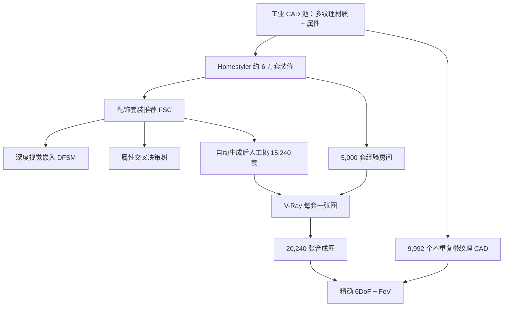

# 3D-FUTURE：工业 CAD 家具带着纹理进库，把学术 3D 基准从「网上捞网格」换成可生产的形状

<!-- release-date: 2020-09-21 -->

**本文依据**：《3D-FUTURE: 3D Furniture shape with TextURE》，arXiv:2009.09633v1 [cs.CV]（2020-09-21），25 页 A4。作者 Huan Fu（通讯，Alibaba Group TaoXi Technology Department）、Rongfei Jia（Alibaba）、Lin Gao（Institute of Computing Technology, Chinese Academy of Sciences）、Mingming Gong（The University of Melbourne）、Binqiang Zhao（Alibaba）、Steve Maybank（Birkbeck College, University of London）、Dacheng Tao（UBTECH Sydney AI Centre, The University of Sydney）。第一作者与通讯单位为 Alibaba Group。页眉印 `arXiv:2009.09633v1 [cs.CV] 21 Sep 2020`。封面抬头是 **Noname manuscript No. (will be inserted by the editor)**，属技术报告体例；封面与全文抽取均未印会议名。官方 abs：`https://arxiv.org/abs/2009.09633`，v1 提交日 **2020-09-21**。文中数字都标 PDF 页码。本文只读这一份 PDF。

## 一句话

当时公开的 3D 基准大多从网上模型库抓 CAD：几何粗、纹理空或假、家具款式过时；图和模型还经常是人工挑一个「大概像」的网格对上，细节对不准（PDF p. 1–2）。3D-FUTURE 把这条路换成**工业生产用的家具 CAD 加信息纹理**，再配上设计师房间和 V-Ray 渲染图。本稿规模是 **20,240** 张室内合成图、**5,000** 套经验设计房间、**9,992** 个不重复 3D 实例；另有 **15,240** 套由推荐系统扩出来、再经人工挑选的审美设计（PDF p. 1、p. 10）。作者用同一份库做了细粒度形状识别、跨域图检索、联合 2D 实例分割与 6DoF 姿态、单图重建、纹理合成五组基线，用来证明：工业级细节一上来，现成方法会掉一截（PDF p. 14–21）。

它解决的不是「再做一个更大的 ShapeNet」，而是：**学术 3D 研究能不能直接吃到可生产的几何和纹理，而不是网上网格的近似物。**

## 一、矛盾：网上网格够训分类，不够做细几何和真纹理

作者先承认 3D 库已经很多：ShapeNet、ModelNet、Pascal 3D+、ObjectNet3D、Pix3D、NYU、SUN RGB-D、ScanNet、Matterport3D 等（PDF p. 1）。那为什么还要再建？

三条硬缺口（PDF p. 2）：

1. **来源不对。** 现有 CAD 多来自 Trimble 3D Warehouse、Yobi3D 一类公开仓。几何细节少，纹理信息弱甚至没有。家居类还往往是设计师已经不用的过时款。
2. **对齐是假的。** 很多图–形基准是人工从库里挑一个大致匹配的 CAD，再估相机。局部细节会被标注目测掉。高质量重建、高精度检索因此缺真监督。
3. **没有同时给真实感室内合成图、实例语义、带纹理的 3D 形状。**

所以这篇不是方法论文，而是**仓库论文**：先把工业家具形状和纹理收进来，再在上面跑几组当时常见任务当基线（PDF p. 1）。

表 1 把自家和前人并排放（PDF p. 3）。3D-FUTURE：**9,992** 形状、**34** 类、来源 Industry、**20,240** 张合成图、**102,972** 个实例、对齐标成 **precise**。对比：ShapeNetCore **51,300** 形状但纹理带星号（无信息或只有一部分有纹理）、无场景图；Pix3D 只有 **395** 形状且对齐是 pseudo；InteriorNet / Structured3D 有大量合成图，但不给带纹理的家具形状。作者强调：本库专做家居，形状都是工业用家具（PDF p. 3）。

上图是机制示意，根据 PDF 第 3–4 节与图 1（p. 4–10）重画，不是实测时间轴。

## 二、相关工作：模型库、RGB-D、室内渲染，缺的是「工业家具 + 纹理 + 精确对齐」

**3D 模型。** ShapeNet 从网上捞百万级原始 CAD，公开子集 ShapeNetCore **51,300**、ShapeNetSem **12,000**（PDF p. 3）。ModelNet、Princeton Shape Benchmark 同类。扫描库如 ObjectScans、ScanObjectNN 走 RGB-D 重建。这些库推了表示、识别、重建、部件分割，但网上形状常缺几何细节，纹理梦幻或没有（PDF p. 3）。

**图–形关联。** PASCAL3D+、ObjectNet3D 给 2D 物体对齐 3D 并标原始姿态；Pix3D 把 **395** 个形状的对齐做细一些。作者说这类仍是 pseudo：贵、难规模化，局部细节仍会被忽略（PDF p. 3）。

**RGB-D 场景。** NYU、SUN RGB-D、SUN3D、ScanNet（**1513** 场景、约 **2.5M** 视角）、Matterport3D 服务真实室内理解。3D-FUTURE 不走这条：它盯的是工业生产用的精装修设计（PDF p. 3–4）。

**最近邻。** InteriorNet、Structured3D 也用专业户型渲真实感图。作者列两点差别：自己给场景里带纹理的家具、共享 6DoF 与相机 FoV；相机机位由设计师指定，图要能看出整套设计意图，而不是随机机位刷冗余帧（PDF p. 4）。

## 三、怎么收数据：先有工业池，再解决「设计师太慢」

收几千套好看的室内设计并不便宜。作者说完成一栋房子的室内设计要设计师几天（PDF p. 2）。于是问两个工程问题：

1. 能不能让创作者更快做出精房间？
2. 能不能在专业布局上自动再生成一批审美设计？

对应两件工具：配饰套装组合（Furnishing Suit Composition，FSC）平台，以及在专家布局上用规则加 FSC 出候选、渲染、人工挑、设计师复审（PDF p. 2）。

### 工业室内库

先建 3D 池：工业 CAD 家具和硬装。每个形状挂多种纹理材质，并标主题色、风格、材质、品牌、真实尺寸、WordNet 分类。分类体系五级、**500** 个细类。每个带纹理模型还有高分辨率 2D 渲染（PDF p. 4–5）。数据来自 Alibaba Topping Homestyler。数百名设计师数年做出约 **60,000** 套装饰住宅，其中约 **30,000** 套被评为优秀或出色（PDF p. 5）。3D-FUTURE 是在这批室内数据上立的项目。

### FSC：把时装搭配那套可解释兼容，搬到家具套装

训练数据是有序套装：$\\{X_1,\ldots,X_N\\}$，$X_i=\\{x_{i1},\ldots,x_{im_i}\\}$。顺序就是设计师先后选中的家具（PDF p. 6）。属性可解释，但属性有限，覆盖不了一件家具的全部外观，所以再训一个深度配饰套装模型（Deep Furnishing Suit Model，DFSM）。

DFSM 一块共享的视觉嵌入网络（Visual Embedding Network，VEN）加两个 Transformer 编码器，做两件事（PDF p. 5–7，图 2）：

**掩码预测。** 从套装里抽连续子集，要预测下一件。按类别从池里在线抽三个负例，并保证负例与正例同风格 / 同色 / 同材质，组成候选集 $C$。VEN 用 MobileNetV2 的 CNN 加投影层，按 Wu et al. 2018 的无监督策略预训练。序列特征送进 TransEnc1，损失是（PDF p. 7 式 1–2）

$$
L_{\mathrm{mp}}=-\frac{1}{N}\sum_{i=1}^{N}\log P(x_{ik+1}\mid \tilde{F}^i;\Theta,\Phi),
$$

其中概率是掩码 token 特征与候选视觉嵌入的 softmax。人话：给定已经摆进去的几件，猜下一件该是哪件。

**兼容打分。** 候选套装过 TransEnc2，用 `[Start]` token 当套装表示，两层全连接加 sigmoid 出分数 $s$。没有真值分数，就用带难例的间隔排序损失（PDF p. 7 式 3–4），间隔 $\alpha=0.1$。负例分数取三个负例里最大的那个。

VEN 训完后，每件家具有一个深度视觉嵌入，后面决策树当「属性」用。

### 决策树：把属性交叉做成可解释规则

目标是自动挖属性交叉（attribute crosses）。作者用 GBDT（PDF p. 8，图 6）。每件家具六个属性：主题色、风格、材质、真实尺寸、二级类、以及刚才学到的视觉嵌入。离散属性 one-hot；主题色和尺寸先 k-Means 再 one-hot。正负套装构造与 DFSM 类似。

### 难例再训

大池子里随机负例太容易，嵌入和树都会漂。做法：给定前缀，用已训 DFSM 出 TopK 推荐，再从 TopK 里抽负例，微调 VEN、重训树（PDF p. 9）。之后固定 VEN，每天用持续增大的线上设计自动重训决策树。

DFSM 接到线上 Topping Homestyler：大形状池、图检索家具、2D 展示、3D 漫游、专业模板、换纹理换件、在线渲染（PDF p. 9）。

### 从 5,000 套模板扩到 20,240 张图

项目收集 **5,000** 套精房间。作者**不打算**给每个房间渲很多机位，而想多要「更好的设计」（PDF p. 9–10）。以经验设计为模板：

1. 按材质、房间风格等描述替换硬装。
2. 按硬装选一个家具种子（例如床）。
3. 用 DFSM 和规则迭代推荐，得到清单；同时学一对一视觉兼容（床–床头柜、沙发–茶几）当附加规则。
4. 把清单物品放回对应位置。

渲染后人工挑出 **15,240** 套看起来好看的；设计师再审（PDF p. 10）。渲染器用 V-Ray，尽量打开它支持的功能以保真实感（PDF p. 10）。

这里摘要和第四节口径要分开读。摘要写「**20,240** 张干净真实合成图，对应 **5,000** 个不同房间」（PDF p. 1）。第 4.1 节写得更细：**20,240** 张图对应 **20,240** 套室内设计 = **5,000** 经验设计 + **15,240** 自动审美设计，每套渲一张（PDF p. 10–11）。后文实验也按「一设计一图」切分。读库规模时以第 4 节为准，摘要是压缩写法。

## 四、库里到底有什么

### 真实感合成图，机位不是随机刷的

相对 Structured3D、InteriorNet：那些随机放相机、每套房冗余多、未经人工核机位（PDF p. 11）。3D-FUTURE 机位由专业设计师建议，求每个房间的最佳展示视角。实例语义 **34** 类，另写「十个超类」（PDF p. 11）；第 4.4 节属性统计又写 **8** 个超类（PDF p. 14）。两类数字原文并存，本文不调和。

图 7 把合成图实例标注和 ADE20K 自然图并排，用来强调视觉观感（PDF p. 9）。

### 2D–3D 对齐是精确的，不是「挑一个像的」

前人对齐是 pseudo：从图里物体到公开库里大致匹配的 CAD（PDF p. 12）。本库给精确 2D–3D 对齐和 3D 姿态：**9,992** 形状、**20,240** 场景图。从场景图裁实例，轻微遮挡下可得到 **37,441** 对图–形，见表 3（PDF p. 12–13）。图 4 给 6DoF 示意（PDF p. 7）。渲染信息含 6DoF 与相机视场 FoV（PDF p. 2）。

### 形状分辨率更匀，纹理是工业用的

图 10 把顶点数、面数分位数和 ShapeNetCore、ModelNet40 比：别人有一批极低分辨率网格，3D-FUTURE 在顶点和面上分布更均匀（PDF p. 11、p. 14）。风格含欧式雕花一类细几何；形状都带信息纹理，并已用于现代工业生产（PDF p. 13–14，图 5）。

### 细粒度属性

每个带纹理形状四类设计师核过的属性：**34** 形状类、**8** 超类、**19** 风格、**15** 材质、**16** 主题（PDF p. 14）。图 8：Modern、Japanese、Smooth Net、Texture Mark、Rough Cloth、Wood 等更常被设计师选用；除特例外，每个属性类至少 **90** 个形状（PDF p. 10）。图 9：34 类数量反映设计师选用频率；梳妆椅只有 **7** 个，因为房间里常用别的椅子顶替；中式椅、贵妃榻只出现在特殊设计（PDF p. 11）。

## 五、基线：同一份切分，五件事

形状切成训练 **6,699**、测试 **3,293**。场景图跟形状切分走：训练 **14,761** 张、测试 **5,479** 张（PDF p. 14）。

### 细粒度 3D 识别：ModelNet 上 90% 的方法，这里掉到约 70%

动机：3D CNN 吃显存；点/网格方法算力紧，只能稀点云、少面片；多视图投影又难接到高分辨率场景（PDF p. 14–15）。相对 ShapeNet / ModelNet，这里要分细家具类，必须吃局部和全局几何。

基线：12 视图 MVCNN，骨干 ResNet50；PointNet++ 每形状 **1024** 点，多尺度分组（MSG）加法向（PDF p. 15）。表 2 均值：MVCNN **69.2%**，PointNet++ **69.9%**（PDF p. 13）。作者对照：两方法在 ModelNet40 和 ShapeNetCore 能到 **90%**，这里因为细类掉下来，希望逼出更好的 3D 表示（PDF p. 15）。图 11 是混淆矩阵（PDF p. 12）。

类间差很大：Kids Bed 只有 **12.5% / 14.3%**；Bed Frame 两边都是 **93.8%**；Children Cabinet 上 MVCNN **72.0%**、点云只有 **32.1%**；Wardrobe 则点云 **82.0%** 高于多视图 **56.7%**（PDF p. 13）。

### 跨域图检索：精确对齐有了，Top-1 仍然难

跨域图像 3D 形状检索（Image-based 3D Shape Retrieval，IBSR）要从图里物体对上 CAD。难处是 2D 外观和 3D 差得大。早期把跨域表示映射到同一嵌入；后来用法向、深度等 2.5D 草图搭桥。作者认为 SOTA 仍远落后 2D 内容检索，因为缺大规模精确 2D–3D 对齐（PDF p. 15–16）。

表 3 切分（PDF p. 13）：遮挡比小于 **0.1** 为 NO（训练 **17,638** / 测试 **3,506**）；**0.1–0.2** 为 Slight（**8,637 / 1,545**）；**0.2–0.3** 为 Standard（**5,169 / 943**）。训练图合计 **31,444**，测试表上 **5,997**；正文写评估用另外 **5,994** 对（PDF p. 16）。检索池 = 测试 CAD + 训练 CAD（测试 CAD **3,293**，训练 **6,699**）。只用 NO / Slight / Standard 三档裁实例。

网络（图 14，PDF p. 13）：用工具箱把 3D 投到 2D 平面缩小域差；查询图、对应 3D、随机负 3D 组成三元组，ResNet-34 抽特征，间隔排序损失把查询拉向对应形状；再加类别分类和实例级非参数 softmax（Wu et al., 2018），让网络看实例之间的形状相似度（PDF p. 16–17）。

指标：TopK Recall、Top5 平均 F-score。表 4 均值：Top1@R **23.4**，Top3@R **40.6**，F-score **47.1**（PDF p. 15）。大量类 Top1 低于 **30**，但检索序列看起来还能看（图 15）；Top1 与 Top3 缺口大，说明池里同类形状很近，适合做细粒度检索研究（PDF p. 17）。

### 联合实例分割和 6DoF 姿态：室内多物、有遮挡

6DoF 姿态是图到模型的旋转加平移。经典路线先建 3D–2D 点对应再 PnP，纹理丰富才稳，无纹理和遮挡就垮；后来 RGB-D 和直接回归。作者认为遮挡、杂乱、多物体可扩展、对称仍没解决好（PDF p. 17–18）。

实例分割两条：基于分割的聚类 / 度量 / 分水岭，和检测后再出 mask。这里改 Cascade Mask R-CNN，一次出 2D 实例和 6DoF（PDF p. 18，图 13）。骨干 ResNeXt-101 **64-4d**，FPN，三阶段框回归和分类，再两个全连接分支出 mask 和姿态。旋转改成视点分类：旋转矩阵转欧拉角，方位 **360°** 分 **18** 箱、仰角 **180°** 分 **9** 箱、平面内 **360°** 分 **18** 箱。平移用 Smooth L1 直接回归（PDF p. 19）。

相对 ObjectNet3D、PASCAL3D+、Pix3D，这里要在多样室内图里给多个遮挡物体估姿态。场景图里 **100K+** 物体有 3D 姿态；遮挡五档：NO、Slight、Standard、Heavy、N/A。N/A 表示没有对应 3D，或物体一部分出画（PDF p. 18）。训练 **14,761**、测试 **5,479**。

分割跟 Mask R-CNN 报 AP / AR。旋转用 PASCAL3D+ 的 Average Viewpoint Precision（AVP）和 KITTI 的 Average Orientation Similarity（AOS）；平移用 RMSE。旋转差定义为

$$
\nabla(R,R_{\mathrm{gt}})=\frac{1}{\sqrt{2}}\bigl\lVert\log(R^{\top}R_{\mathrm{gt}})\bigr\rVert_{F}.
$$

AVP 里正确估计要 $\nabla<\pi/6$；AOS 用 $\cos(\nabla)$（PDF p. 19）。姿态指标相对 AP / AR，IoU 阈值 **0.5–0.95**。

表 5 均值：AP **0.55**、AR **0.65**、AP50 **0.79**、AR50 **0.87**、AP75 **0.58**、AR75 **0.69**、AOS **0.43**、AVP **0.43**、RMSE **0.30**（PDF p. 16）。分割 AP 和当时 MSCOCO 榜上 SOTA 同一量级；姿态平均 AVP **43%**。AOS 的上界是 AP，两者越近旋转越好；图 12 显示 AOS **0.43** 相对 AP **0.55** 仍有缝，多数物体姿态在这个难设定下没建模好，需要按遮挡档细做（PDF p. 19）。定性见图 16–17（PDF p. 15–16）。

类间同样两极：Lazy Sofa AP **0.86**、AOS **0.81**；Barstool AP **0.09**、AOS **0.06**；Shelf AP **0.11**（PDF p. 16）。

### 单图重建：SOTA 吃不住工业细几何

监督重建从明暗恢复、离焦，走到体素 / 点云 / 网格；变形网格和可微渲染的无监督多视图也在发展（PDF p. 19）。这里跑 ONet、Pixel2Mesh、DISN。指标 IoU、Chamfer Distance（CD，**2,048** 点）、F-score（阈值 **1%**，体积边长定义跟 Tatarchenko et al. 2019）。每模型随机渲 **24** 个训练视角、**1** 个测试视角，分辨率 **$256\times 256$**（PDF p. 20）。

表 6 均值（PDF p. 17）：

| 方法 | IoU (%) | CD ($\times 10^{-3}$) | F-score (%) |
|---|---:|---:|---:|
| Pixel2Mesh | 47.32 | 32.35 | 65.69 |
| ONet | 21.32 | 144.76 | 21.42 |
| DISN | 46.50 | 57.33 | 53.46 |

Pixel2Mesh 总体更稳；作者判断三者都无法在几何细节多时恢复高质量形状（PDF p. 20，图 18）。

### 纹理合成：有工业纹理了，生成仍假

纹理重建比几何冷。体素 / 点云上色受分辨率或稀疏限制；后来学 UV 图，用可微渲染当未见视角合成（PDF p. 20）。现有库纹理弱或假，撑不起高质量纹理恢复。这里跑 Texture Fields 和作者改的 BicycleGAN++（在 BicycleGAN 上加纹理编码器做可控合成；加大重建损失权重，再加纹理一致性损失，让多视图重叠区更一致）（PDF p. 20–21，图 19）。

四个超类：Sofa、Bed、Chair、Table。表 7：训练图 / 形状 Sofa **49,056 / 1,533**，Bed **20,032 / 626**，Chair **26,208 / 819**，Table **12,320 / 385**，合计 **107,616 / 3,363**；测试合计 **19,224 / 1,602**（PDF p. 18）。每形状随机渲 **32** 视角扩训练。先在全训练集训，再按类微调。指标 SSIM、L1、FID、Feat1（Inception 特征空间 L1）（PDF p. 21）。

表 8 均值（PDF p. 20）：Texture Fields FID **26.01**、SSIM **0.952**、L1 **0.016**、Feat1 **0.160**；BicycleGAN++ FID **15.12**、SSIM **0.942**、L1 **0.022**、Feat1 **0.144**。BicycleGAN++ 在 FID、Feat1 更好（更像真图）；Texture Fields 在 SSIM、L1 更好（更贴结构细节）。定性：BicycleGAN++ 往往只学到主色、丢掉语义部件；Texture Fields 能保住部分结构纹理，但会做出梦幻纹理。结论：工业网格上视觉上好看的纹理恢复仍然很难（PDF p. 21，图 20–21）。

## 六、作者自己划的边界

这篇几乎不谈训练算力、开源协议、下载接口，也不宣称某个任务 SOTA。它把库的卖点收成四条：设计师精装修、真实感渲染、2D–3D 对齐、以及最重要的——工业家具形状加信息纹理（PDF p. 21）。希望用途：高质量 3D 理解与生成、给 3D 视觉新题目、在学术和工业应用之间搭桥（PDF p. 21–22）。

几处原文内部不要抹平：

- 摘要「5,000 房间 / 20,240 图」与第 4.1 节「20,240 套设计各一张」并存。
- 「十个超类」与「8 个超类」并存。
- 检索测试对数正文 **5,994**、表 3 **5,997**。
- 表 2 / 4 / 5 的类列表不完全同一（有的表没有梳妆椅或侧柜）。

可迁移的不是某一组超参，而是建库时的判断：**任务难，往往是监督和形状来源不对，而不是网络名字不够新。** 网上网格能把 ModelNet 分类做到 90%，换上工业细类和真纹理，识别、检索、姿态、重建、贴图会一起露馅。FSC 那条「用设计师顺序当监督、用难例从推荐列表里挖负例」也可以搬到别的组合生成，但那是本库的采集工具，不是本库对外承诺的基准任务。
