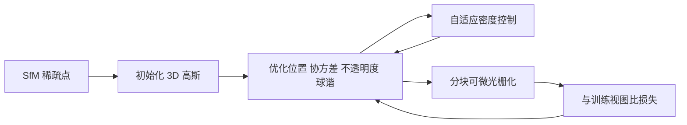

# 3D Gaussian Splatting：用各向异性 3D 高斯加分块可微溅射，把辐射场做到 1080p 实时

<!-- release-date: 2023-08-08 -->

**本文依据**：`3D Gaussian Splatting for Real-Time Radiance Field Rendering`，arXiv 2308.04079v1（2023-08-08），14 页 letter。作者 Bernhard Kerbl\*、Georgios Kopanas\*（同等贡献，Inria, Université Côte d’Azur）、Thomas Leimkühler（MPI Informatik）、George Drettakis（Inria, Université Côte d’Azur）。封面印 ACM Trans. Graph. 42, 4, Article 1（August 2023），DOI 10.1145/3592433。盘上 PDF 页眉写明 arXiv:2308.04079v1 [cs.GR] 8 Aug 2023。首发日取原件首次公开日，即 arXiv v1 提交日 2023-08-08。文中所有数字都标了 PDF 页码；标「外部补充」的段落不来自本文。NeRF 是被对照的前作，本文贡献是表示、密度控制和溅射光栅化。

## 一句话

多视图标定给出稀疏 SfM 点之后，把场景写成一堆没有法线的 3D 高斯：位置、不透明度 $\alpha$、各向异性协方差、球谐颜色。优化这些属性，并每隔固定步数克隆或拆分高斯，让稀疏点长成 100 万到 500 万个能贴几何的椭球。渲染不沿光线随机采样，而是把 3D 高斯投成 2D 椭圆，按深度排序后 $\alpha$ 合成。分块可微光栅化既加速训练，也让 1080p 新视图达到实时（$\ge 30$ fps）（PDF p. 1）。封面图 1 的数字必须按图注读：InstantNGP 9.2 fps、训练 7 min、PSNR 22.1；Plenoxels 8.2 fps、26 min、21.9；Mip-NeRF360 0.071 fps、48 h、24.3；本文 135 fps、6 min、23.6；再训到 51 min 是 93 fps、PSNR 25.2（PDF p. 1 图 1）。

它解决的不是「再发明一种 NeRF」，而是 2023 年前后辐射场卡死的那条路：画质最好的连续体积方法训不起、渲不出实时；最快的网格加速方法画质上不去，无界完整场景、1080p 下没有当时方法能实时显示（PDF p. 1）。

## 一、矛盾：质量、训练时间和帧率三选二

网格和点云显式、适合 GPU 光栅化。NeRF 一类方法把场景写成连续场，用 MLP 加体积光线步进出新视图；当时最快的辐射场也还是连续表示，只是把值存进体素、哈希网格或点上再插值（PDF p. 1）。连续有利于优化，但渲染要随机采样，贵，还带噪声（PDF p. 1）。

画质标杆是 Mip-NeRF360，训练可达 48 小时（PDF p. 2）。快方法（InstantNGP、Plenoxels）训练短，但画质够不上标杆；交互帧率大约 10–15 fps，高分辨率下仍不是实时（PDF p. 2）。作者的目标写得很硬：从多张照片优化出表示，训练时间和最快前作同量级，渲染要实时，质量要能跟最贵的隐式方法打平或更好（PDF p. 2）。

输入与当时 NeRF 类方法相同：SfM 标定相机，顺带得到稀疏点云（PDF p. 2）。多数基于点的神经渲染还要多视图立体（MVS）几何；本文宣称只用 SfM 点就能出高质量。NeRF 合成集甚至随机初始化也够用（PDF p. 2）。

三条组件（PDF p. 2）：

1. 把场景写成可微的 3D 高斯体积，空处不必采样本。
2. 优化位置、$\alpha$、各向异性协方差和球谐系数，并与自适应密度控制交错：加高斯、偶尔删高斯。
3. 可见性感知的快速光栅化：各向异性溅射、排序后 $\alpha$ 合成，反传跟踪任意数量已排序溅射。

测试场景训完大约 100 万到 500 万个高斯（PDF p. 2）。代码与数据写在实现节：`https://repo-sam.inria.fr/fungraph/3d-gaussian-splatting/`（PDF p. 8）。

把流水线画成人能跟住的样子（机制示意，根据 PDF p. 5 图 2 重画，不是实测时间轴）：

## 二、成像模型其实和 NeRF 一样，采样方式完全不同

体积渲染沿光线写像素颜色（PDF p. 3 式 1–2）：

$$
C=\sum_{i=1}^{N} T_i\alpha_i c_i,\qquad
\alpha_i=1-\exp(-\sigma_i\delta_i),\qquad
T_i=\prod_{j=1}^{i-1}(1-\alpha_j).
$$

点基方法对覆盖同一像素、已排序的 $N$ 个点做同样的 $\alpha$ 合成（PDF p. 3 式 3）。作者的判断：成像模型相同，算法不同。NeRF 是连续隐式，空/占都靠随机采样去找，又贵又噪。点是非结构化离散表示，可以创建、销毁、移动几何，却不必维护整块体积（PDF p. 3）。

Pulsar 的快速球光栅化启发了分块与排序，但它是顺序无关的；本文要保持（近似）按深度的常规 $\alpha$ 合成，才能吃到体积表示的好处。还要对一个像素上所有溅射反传，并光栅化各向异性溅射（PDF p. 3）。先前点方法常再接 CNN 出图，时间上会闪；本文不走那条。人体捕获里也用过 3D 高斯，但场景深度复杂度小、多是单物体；本文要处理含背景的室内外完整场景（PDF p. 4）。

**可迁移的一点**：先问成像模型能不能写成前到后的 $\alpha$ 合成。能的话，把「沿光线找样本」换成「把原语投到屏幕再排序」，优化目标可以几乎不动，算力结构却从随机访存变成光栅化。

## 三、表示：没有法线的各向异性 3D 高斯

要从没有法线的稀疏 SfM 点出发。2D 点溅射常假设每个点是带法线的小圆片；SfM 太稀，法线估不准，从这种法线优化噪声法线更难。作者改成 3D 高斯，不做法线（PDF p. 4）。

世界系协方差 $\Sigma$、均值 $\mu$（PDF p. 4 式 4）：

$$
G(x)=\exp\Bigl(-\frac12(x-\mu)^\top\Sigma^{-1}(x-\mu)\Bigr).
$$

溅射时再乘 $\alpha$。投到相机系用视变换 $W$ 和投影仿射近似的雅可比 $J$（PDF p. 4 式 5）：

$$
\Sigma'=JW\Sigma W^\top J^\top.
$$

丢掉 $\Sigma'$ 的第三行第三列，得到 $2\times 2$ 屏幕协方差，结构和「带法线的平面点」出发时一样（PDF p. 4）。

直接优化 $\Sigma$ 不行：协方差必须半正定，梯度下降一步就可能走出合法集合（PDF p. 4）。改成缩放 $S$ 和旋转 $R$（PDF p. 4 式 6）：

$$
\Sigma=RSS^\top R^\top.
$$

存三维缩放向量 $s$ 和四元数 $q$，用时再拼矩阵，并把 $q$ 单位化。梯度手推，避免自动微分开销（附录 A，PDF p. 4、p. 12）。$\alpha$ 用 sigmoid 压到 $[0,1)$，缩放用指数激活（PDF p. 5）。初始协方差取各向同性，轴长等于到最近三个点的平均距离（PDF p. 5）。

图 3 把训完的高斯缩小 60% 可视化：椭球贴在细结构上，用少量大各向异性高斯就能盖均匀区域（PDF p. 5）。颜色用球谐，跟 InstantNGP、Plenoxels 的惯例一致（PDF p. 4）。

**可迁移的一点**：要优化的量如果有流形约束（半正定、单位四元数），不要把约束留给优化器去「碰巧满足」。换成无约束因子再组合，比投影回合法集合更稳。

## 四、优化：损失简单，几何要能长也能死

每步渲染当前高斯，和捕获的训练视图比。三维投到二维有歧义，几何会放错，所以必须能创建、销毁、移动（PDF p. 5）。协方差质量决定紧凑性：大片均匀区域应该被少数大椭球吃掉（PDF p. 5）。

主瓶颈是光栅化，所以快光栅化直接决定训练时间（PDF p. 5）。位置用类似 Plenoxels 的指数衰减日程，只作用在位置上（PDF p. 5）。损失是 $L_1$ 加 D-SSIM，$\lambda=0.2$（PDF p. 5 式 7）：

$$
\mathcal{L}=(1-\lambda)\mathcal{L}_1+\lambda\mathcal{L}_{\mathrm{D\text{-}SSIM}}.
$$

球谐对缺角度的采集很敏感。物体被整个半球拍照时还好；缺角、从内往外拍时，零阶（漫反射底色）会优化错。做法：先只优化零阶，每 1000 步加一个频带，直到 4 带（PDF p. 8）。分辨率上先用 4 倍小图热身，第 250、500 步各上采样一次（PDF p. 8）。实现是 PyTorch 加自定义 CUDA，排序用 NVIDIA CUB 的 Radix sort；交互查看器基于开源 SIBR（PDF p. 8）。

## 五、密度控制：梯度大的地方，要么克隆要么拆

从 SfM 稀疏点出发，热身后每 100 次迭代加密一次，并删掉 $\alpha$ 低于阈值 $\epsilon_\alpha$ 的透明高斯（PDF p. 5）。两类都该加密：欠重建（缺几何）和过重建（一个高斯盖太大）。两者的共同信号是视图空间位置梯度大，因为优化正在把它们往对的地方推。平均梯度幅度超过 $\tau_{\mathrm{pos}}=0.0002$ 就加密（PDF p. 5）。

欠重建里的小高斯：克隆一份同样大小，沿位置梯度方向挪开，增加总体积和个数（PDF p. 5–6 图 4）。过重建里的大高斯：拆成两个，尺度除以 $\phi=1.6$，位置按原 3D 高斯当 PDF 抽样；总体积大致守恒、个数增加（PDF p. 5–6）。

靠近输入相机的漂浮物会把个数顶上去。每 $N=3000$ 步把 $\alpha$ 打近 0，让真正需要的高斯把不透明度涨回来，其余被剔除吃掉（PDF p. 6）。还定期删世界系过大、或视图足迹过大的高斯。高斯始终停在欧氏空间，不做 Mip-NeRF360 / Plenoxels 那种空间压缩或远距变形（PDF p. 6）。

附录算法 1 把循环写死：采样训练视图 → 光栅化 → 损失 → Adam → 细化迭代里按 $\alpha$、过大、梯度阈值决定删、拆、克隆（PDF p. 13）。

**可迁移的一点**：表示容量不要一次铺满。用「误差/梯度大」当插入信号，用「透明或过大」当删除信号，容量跟着难度长。克隆增加覆盖，拆分增加分辨率，两套操作不要合成一个「加点」超参。

## 六、分块光栅化：整图排一次序，反传不限溅射个数

目标有三条：整体要快；排序要快，才能对含各向异性溅射做近似 $\alpha$ 合成；反传不能像 Pulsar 那样硬限制能收梯度的溅射个数（PDF p. 6）。

屏幕切成 $16\times 16$ 块。视锥剔除：只留 99% 置信区间与视锥相交的高斯。再用保护带丢掉均值贴近裁平面、远在锥外的极端位置，因为投 2D 协方差会数值不稳（PDF p. 6）。每个与若干块重叠的高斯按重叠次数实例化，键的低 32 位是视图深度、高位是块 ID，一次 GPU Radix 排序（PDF p. 6、p. 13）。没有额外的逐像素重排，混合完全跟这次全局排序。 splats 接近像素大小时，排序误差可忽略；作者说收敛后几乎看不出伪影，却换来训练和渲染都快很多（PDF p. 6）。

每块找出排序后的起止项。一块一个 thread block，协同把高斯包进共享内存，像素前到后累加颜色和 $\alpha$。像素 $\alpha$ 饱和则该线程停；整块像素都饱和则整块停（PDF p. 6）。停止准则只有 $\alpha$ 饱和，不限制参与混合、能收梯度的原语个数，这样才能学任意深度复杂度，不必按场景调「最多混几个」（PDF p. 6）。

反传要恢复前向混合序列。不在全局内存里给每像素存可变长列表，而是复用前向的排序数组和块范围，改成后到前走。遍历从「影响过该块任一像素的最后一个点」开始；像素只处理深度不超过自己前向最后贡献点的高斯（PDF p. 6–7）。梯度需要前向每一步的累积不透明度。不存逐步变小的 $\alpha$ 列表，只存前向结束时的总累积 $\alpha$，后到前时用它除以当前点的 $\alpha$ 还原中间系数（PDF p. 7）。每像素常数开销（PDF p. 6）。

数值上：$\alpha<\epsilon$（取 $1/255$）跳过更新，$\alpha$ 上限钳到 0.99；前向若计入后累积会超过 0.9999 则提前停，避免反传除零（PDF p. 14）。附录算法 2 是整条 GPU 软件光栅化伪代码（PDF p. 14）。

**代价**：全局一次排序是近似可见性，大溅射交叉时可能突然换前后关系，这就是后文弹出伪影的来源之一。

**可迁移的一点**：可微渲染的反传不必镜像一份动态列表。能用「最终累积量 + 逆运算」还原中间量，就用常数额外存储换任意深度。排序键把「哪一块」和「多深」拼在一起，一次基数排序代替逐像素堆。

## 七、实验：1080p 实时，画质对齐最贵的那档

硬件默认一块 A6000；Mip-NeRF360 在 4 卡 A100 上训 12 小时，作者折成单卡 48 小时，并注明 A100 比 A6000 快（PDF p. 8–9 脚注）。超参全局同一套。真实数据按 Mip-NeRF360 的划分：每 8 张取 1 张测试（PDF p. 8）。测了 Mip-NeRF360 全集、Tanks&Temples 两景、Deep Blending 两景，外加 NeRF 合成 Blender 集，共 13 个真实场景加合成集（PDF p. 8）。图 5 含 Bicycle、Garden、Stump、Counter、Room、Playroom、DrJohnson、Truck、Train（PDF p. 7）。

表 1 是三套数据的平均（PDF p. 8）。带 $\dagger$ 的 Mip-NeRF360 在自家数据上抄原论文，其余作者自己跑。

| 数据 | 方法 | SSIM↑ | PSNR↑ | LPIPS↓ | 训练 | FPS | 显存 |
|---|---|---:|---:|---:|---|---:|---|
| Mip-NeRF360 | Plenoxels | 0.626 | 23.08 | 0.463 | 25m49s | 6.79 | 2.1GB |
| | INGP-Base | 0.671 | 25.30 | 0.371 | 5m37s | 11.7 | 13MB |
| | INGP-Big | 0.699 | 25.59 | 0.331 | 7m30s | 9.43 | 48MB |
| | M-NeRF360 | 0.792† | 27.69† | 0.237† | 48h | 0.06 | 8.6MB |
| | Ours-7K | 0.770 | 25.60 | 0.279 | 6m25s | 160 | 523MB |
| | Ours-30K | 0.815 | 27.21 | 0.214 | 41m33s | 134 | 734MB |
| Tanks&Temples | Plenoxels | 0.719 | 21.08 | 0.379 | 25m5s | 13.0 | 2.3GB |
| | INGP-Base | 0.723 | 21.72 | 0.330 | 5m26s | 17.1 | 13MB |
| | INGP-Big | 0.745 | 21.92 | 0.305 | 6m59s | 14.4 | 48MB |
| | M-NeRF360 | 0.759 | 22.22 | 0.257 | 48h | 0.14 | 8.6MB |
| | Ours-7K | 0.767 | 21.20 | 0.280 | 6m55s | 197 | 270MB |
| | Ours-30K | 0.841 | 23.14 | 0.183 | 26m54s | 154 | 411MB |
| Deep Blending | Plenoxels | 0.795 | 23.06 | 0.510 | 27m49s | 11.2 | 2.7GB |
| | INGP-Base | 0.797 | 23.62 | 0.423 | 6m31s | 3.26 | 13MB |
| | INGP-Big | 0.817 | 24.96 | 0.390 | 8m | 2.79 | 48MB |
| | M-NeRF360 | 0.901 | 29.40 | 0.245 | 48h | 0.09 | 8.6MB |
| | Ours-7K | 0.875 | 27.78 | 0.317 | 4m35s | 172 | 386MB |
| | Ours-30K | 0.903 | 29.41 | 0.243 | 36m2s | 137 | 676MB |

读表时要对齐封面图 1：图 1 是单场景展示用的帧率/时间和 PSNR，表 1 是数据集平均，两者不要混成同一组数。作者的文字结论：完全收敛后与 Mip-NeRF360 持平、有时略好；同等硬件上对方约 48 小时、约 10 秒一帧，本文 35–45 分钟（PDF p. 9）。5–10 分钟已接近 InstantNGP / Plenoxels，再训才能到 SOTA，那两家快方法做不到（PDF p. 9）。Tanks&Temples 上约 7 分钟与 INGP-Base 同量级（PDF p. 9）。附录自己跑的 Mip-NeRF360 在其全集上平均 PSNR 27.58、SSIM 0.790、LPIPS 0.240（PDF p. 14）。图 6：有的场景 7K（约 5 分钟）火车已经成形，30K（约 35 分钟）背景干净很多；有的 7K（约 8 分钟）已经很难看出差别（PDF p. 8）。

合成 NeRF 从包围盒内 10 万个均匀随机点起步，很快剪到约 6–10K 有意义的高斯，30K 步后每场景约 20–50 万个（PDF p. 9）。表 2 白底 PSNR 平均：Plenoxels 31.76，INGP-Base 33.18，Mip-NeRF 33.09，Point-NeRF 33.30，Ours-30K 33.32（PDF p. 8）。合成场景渲染 180–300 FPS（PDF p. 9）。

紧凑性对照 Zhang 等人 2022 的点辐射场：从他们的空间雕刻点云出发，2–4 分钟追上其 PSNR，点数大约四分之一，平均模型 3.8 MB 对 9 MB；该实验球谐只用两阶（PDF p. 9）。

消融表 3 在 Truck / Garden / Bicycle 的 5K 与 30K 上（PDF p. 9）。平均 30K PSNR：完整 26.05；各向同性 25.23；不克隆 25.91；不拆分 23.90；无球谐 25.35；随机初始化 20.42；限制反传点数（Limited-BW）19.19（PDF p. 9）。Limited-BW 取 $N=10$（Pulsar 默认的两倍），Truck 掉 11 dB（PDF p. 10）。随机初始化主要伤背景和覆盖差的区域，合成无背景、相机约束好则无此问题（PDF p. 9）。拆分对背景重要，克隆对细结构收敛更快（PDF p. 9）。图 10 关掉各向异性后细结构对不齐；Ficus 为展示两边都限制不超过 5k 高斯（PDF p. 11）。

分场景表 4–9 在附录（PDF p. 14），例如 Mip-NeRF360 上 Ours-30k 的 bicycle PSNR 25.246、garden 27.410；Tanks Truck 25.187、Train 21.097；Deep Blending Dr Johnson 28.766、Playroom 30.044（PDF p. 14）。

## 八、限制：没看见的地方、弹出、显存

观察差的区域有伪影，Mip-NeRF360 同样会挣扎（PDF p. 10 图 11）。各向异性可能拉出细长条或「斑驳」高斯（PDF p. 10 图 12）。优化出过大高斯时会弹出，多发生在视角相关外观区域。原因之一是光栅化用保护带硬剔除；更原则的裁剪会减轻。另一原因是可见性算法简单，高斯会突然换深度/混合顺序。作者把抗锯齿留给未来，也承认当前没有正则，正则会帮未见区域和弹出（PDF p. 10）。超参虽全局同一套，早期实验表明超大场景（如城市场景）可能要降低位置学习率才能收敛（PDF p. 10）。

相对点方法已经紧凑，相对 NeRF 显存仍高。未优化原型训大场景峰值可超过 20 GB；作者认为把优化逻辑写成类似 InstantNGP 的底层实现能降很多。渲染要放下整个模型（大规模场景数百 MB），光栅化器再加 30–500 MB，随场景和分辨率变（PDF p. 11）。点云压缩是成熟领域，能否迁到这种高斯表示，本文只提出、没做（PDF p. 11）。

讨论里还有一句实现账单：训练时间约 80% 花在 Python/PyTorch 上，只有光栅化是优化过的 CUDA；其余若也搬到 CUDA，还能再快（PDF p. 11）。作者强调：和「必须连续表示才能又快又好地训辐射场」的流行看法相反，非连续的 3D 高斯够用（PDF p. 11）。是否能从高斯抽出网格，本文没有实验（PDF p. 11）。

## 九、可迁移的几条，以及本文没写的

1. **成像模型对齐，执行模型可以换。** 式 2 和式 3 同构，并不强迫你光线步进。
2. **显式原语要带体积，不要过早变成带法线的面片。** 稀疏初始化估不准法线时，各向异性协方差比法线圆片更宽容。
3. **容量用梯度调度，不要一次铺满网格。** 克隆/拆分对应欠重建/过重建，删除对应透明和过大。
4. **可见性用一次排序近似，反传用累积量还原。** 这是实时和任意深度复杂度同时成立的关键工程。
5. **球谐要按角度覆盖逐步打开。** 缺视时先锁住零阶，避免底色漂。

本文没有：动态场景、抗锯齿的完整方案、从高斯抽网格、城市场景的系统超参、点云式压缩的实现。后作里的 4D 高斯、网格提取不在这份 14 页里。

## 关键词回看

**3D 高斯溅射（3D Gaussian Splatting）**：用带协方差的 3D 高斯当辐射场原语，投到屏幕做 $\alpha$ 合成。

**各向异性协方差**：$\Sigma=RSS^\top R^\top$，缩放与四元数分开优化，让椭球贴几何。

**自适应密度控制**：视图空间位置梯度大则克隆或拆分，透明或过大则删。

**分块可微光栅化**：$16\times 16$ 块、深度+块 ID 一次排序、$\alpha$ 饱和停止、反传不限溅射个数。

**SfM 点初始化**：标定副产物当均值，合成有界场景可改为随机点。
