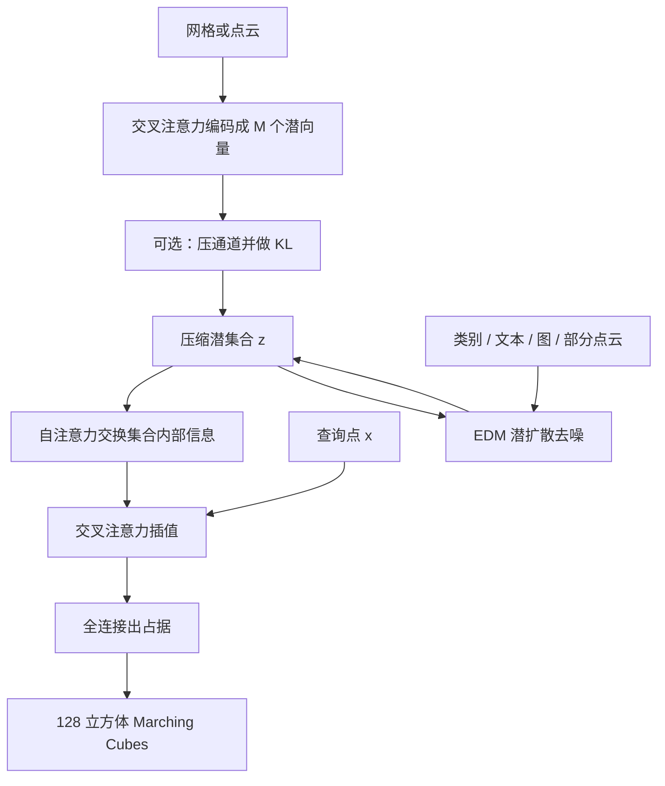

# 3DShape2VecSet：把形状写成一组向量上的神经场，再在压缩潜空间里做扩散

<!-- release-date: 2023-01-26 -->

**本文依据**：`3DShape2VecSet: A 3D Shape Representation for Neural Fields and Generative Diffusion Models`，arXiv:2301.11445v3 [cs.CV] 1 May 2023，16 页 letter。作者 Biao Zhang（KAUST）、Jiapeng Tang（TU Munich）、Matthias Nießner（TU Munich）、Peter Wonka（KAUST）。封面代码：`https://1zb.github.io/3DShape2VecSet/`（PDF p. 1）。官方 abs：`https://arxiv.org/abs/2301.11445`。盘上 PDF 页眉写明 arXiv:2301.11445v3 [cs.CV] 1 May 2023。封面与正文均未印本篇会议名；Creator 元数据里的 acmart 只说明排版模板，本文不补会议。首发日取原件首次公开日，即 arXiv v1 提交日 **2023-01-26**，不因 v3 回写。文中数字都标 PDF 页码；标「外部补充」的段落不来自本文。本文只读这一份 PDF。

## 一句话

2D 扩散已经能无条件、按文本、按修补去生成图，3D 这边卡在表示：体素立方涨、点云难出干净流形、全局一个向量画不细、规则潜网格又太大、不规则网格仍绑着显式坐标。作者把形状写成 **固定长度的一组潜向量**（latent set），查询点与这组向量做交叉注意力，得到占据场；编码侧用交叉注意力把大点云压进这组向量，解码侧用自注意力再交叉注意力插值。第一阶段自编码（可选 KL 压到更短通道），第二阶段按潜扩散 + EDM 在这组压缩向量上加噪去噪。同一套骨干接类别嵌入、BERT 文本、ResNet 单视图、以及同一编码器给出的部分点云条件。作者据此宣称：编码保细节、生成在 FID / KID / FPD / KPD 上超过当时对照，并展示无条件、类别、文本、点云补全、单视图条件五类生成（PDF p. 1–2）。

它解决的不是「再发明一种隐式场」，而是：**神经场要连续、扩散要固定尺寸，二者必须先压成可注意力处理的有限集合，并且尽量别把空间位置手工钉死。**

## 一、矛盾：3D 扩散缺一块既压得动、又画得细的潜表示

引言把应用写得很宽：图形、游戏、虚拟现实（PDF p. 1）。生成模型名单也熟：GAN、VAE、流、自回归；扩散在 2D 已经能无条件、文生图、修补（PDF p. 1）。作者的判断干脆：2D 的成功还没对上 3D（PDF p. 1）。

卡点不在「会不会抄 DDPM」，而在形状怎么存。体素、点云、网格、神经场并存；他们相信下游更吃基于表面的表示，而不是裸点云。神经场连续、给完整表面、还能把传统数据结构与网络拼在一起（PDF p. 2）。

2D 扩散两条路：压缩潜空间（如潜扩散），或一串升分辨率扩散。两边在 3D 都说得通，**初步实验表明压缩潜空间更好做**，于是跟潜扩散（PDF p. 2）。下一刀：手工表示（如小波）轻、好设计；学出来的表示往往更强。他们选学，因此必须两阶段：自编码（变分自编码）进潜空间，再在潜空间训扩散（PDF p. 2）。神经场本身是连续实值函数，可看成无限维向量；扩散又常吃固定尺寸数据。所以必须先编码、再解码（PDF p. 2）。

潜神经场通常三件套：存潜变量的空间数据结构、空间插值、网络。图 2 把谱画出来：全局一个向量简单但细节差；规则 3D 网格加三线性插值细节好，但对生成太大，实际只能很低分辨率（文中例子 $8\times 8\times 8$）；稀疏不规则网格把尺寸砍下来，但仍有改进空间（PDF p. 2–3 图 2）。

3DShape2VecSet 从神经场、径向基函数（RBF）和注意力层拼一块：**固定尺寸的一组潜向量**。作者给两条成功理由。第一，这组东西天然给 Transformer 吃，不必只靠 MLP 处理潜信息，而用线性层加交叉注意力。第二，**不再显式设计位置特征**，只给网络机会自己把位置写进向量里——这和「学出来的表示优先于手工」一致（PDF p. 2）。

贡献五条（PDF p. 2）：

1. 新表示：任意形状写成定长潜数组，交叉注意力加线性层得到神经场。
2. 新网络：含用交叉注意力从大点云聚合信息的积木。
3. 自编码保局部细节，刷新当时重建。
4. 潜集合扩散，按 FID、KID、FPD、KPD 刷新生成。
5. 类别、文本、点云补全、图像条件四类 3D 扩散应用（加上无条件）。

上图是机制示意，根据 PDF 图 3、图 5–7（p. 5–7）重画，不是实测时间轴。

## 二、相关工作：全局向量太粗，网格太贵，点云扩散难出表面

表 1 按潜变量位置分类神经场：单个全局（OccNet、DeepSDF、IM-Net）；规则网格上多个（ConvOccNet、IF-Net、LIG 等）；不规则网格上多个（LDIF、3DILG、POCO 等）；**本文是多个潜变量、位置标成 Global**——向量不再绑 3D 坐标（PDF p. 3 表 1）。全局方法容量有限、细节差；局部方法把向量钉在规则或不规则格子上。本文改成「一张潜向量清单」（PDF p. 4）。

点云网络从 PointNet、DGCNN 走到把点切成 patch 再自注意力的 Transformer。本文也处理点云，但目标是压成更小、更适合生成的表示（PDF p. 3）。体素早期靠 3D 转置卷积，代价随分辨率立方涨；八叉树与稀疏哈希能缓解，但仍是离散体（PDF p. 3）。

表 2 把 3D 生成按模型类型（GAN / NF / EBM / AR / DM）和数据结构（体素 / 点云 / 网格 / 场）列开。点云上的扩散已有 DPM、PVD、LION；坐标自由度高，后处理难出干净流形。DreamFusion 从预训练 2D 扩散抠 3D；NeuralWavelet 先把 SDF 变到小波系数再扩散，优雅但生成通常更吃学出来的表示。并发投稿 TriplaneDiffusion、DiffusionSDF 也在潜空间对神经场做扩散（PDF p. 3–4 表 2）。作者选扩散 + 神经场，并认为这块当时仍薄。

## 三、从 RBF 到「无坐标的潜集合」

预备知识把注意力写成查询、键、值：系数是缩放点积再 softmax，输出是值的线性组合（PDF p. 4 式 1–2）。交叉注意力：查询来自集合 A，键值来自 B（式 3–4）；自注意力是 $A=B$（式 5）。

第 4 节从 RBF 起步。连续函数可用一组带权 3D 点写（PDF p. 4 式 6–8）

$$
\hat O_{\mathrm{RBF}}(x)=\sum_{i=1}^{M}\lambda_i\cdot\phi(\|x-x_i\|).
$$

要保细节往往要非常多点（文中引用 Carr 等人 $M=80{,}000$ 的量级），且吃不到表示学习（PDF p. 5）。把每个形状做成一份独立网络、再用超网络扩散，权重大、表示不紧。他们选共享编解码、每个形状一份编码器给出的潜变量（PDF p. 5）。全局一个 $f$ 细节不够；后续把潜变量排进规则网格再三线性插值。3DILG 把 $f_i$ 放在不规则格点 $x_i$ 上，用核回归插值（式 10–12）。表示仍是 $\{(f_i,x_i)\}$。

作者试过不规则/规则网格、三平面、频率分解等，**没能超过已有不规则网格**。真正拉开的改动是：保留「值 + 相似度」的插值结构，**丢掉显式坐标**，把相似度换成查询坐标与潜向量的交叉注意力（PDF p. 5 式 13–15）

$$
\hat F(x)=\sum_{i=1}^{M} v(f_i)\cdot\frac{1}{Z}\exp\bigl(q(x)^\top k(f_i)/\sqrt{d}\bigr),\qquad
\hat O(x)=\mathrm{FC}(\hat F(x)).
$$

形状于是只剩 $\{f_i\in\mathbb{R}^C\}_{i=1}^M$。人话：RBF 问「离哪个锚点近」；这里问「查询点的特征跟哪根潜向量像」。位置如果有用，网络可以自己写进 $f_i$，不必再维护一份 $x_i$ 给第二阶段扩散添乱。

**可迁移的一点**：扩散要固定基数的对象。把「空间格子」换成「可注意力的集合」，压缩与生成共用同一套代数。

## 四、自编码：大点云进集合，可选 KL，再插值出占据

数据是三角网格，但框架兼容扫描点云、样条、隐式表面（PDF p. 6）。表面采样得到 $N$ 点 $X\in\mathbb{R}^{3\times N}$。挑战是把可能很大的点云聚成 $M$ 个潜向量。流行做法是切 patch、每块一个向量；他们发现更贴 Transformer 的两条路（PDF p. 6 图 4）。

**可学习查询**（DETR / Perceiver 味道）：

$$
\mathrm{Enc}_{\mathrm{learnable}}(X)=\mathrm{CrossAttn}(L,\mathrm{PosEmb}(X))\in\mathbb{R}^{C\times M}.
$$

$L$ 是可学习查询集。

**点查询**：最远点采样 $X_0=\mathrm{FPS}(X)\in\mathbb{R}^{3\times M}$，再

$$
\mathrm{Enc}_{\mathrm{points}}(X)=\mathrm{CrossAttn}(\mathrm{PosEmb}(X_0),\mathrm{PosEmb}(X)).
$$

可看成「部分」自注意力。$M$ 越大重建越好，但 Transformer 训练时间跟着涨。最终 $M=512$、$C=512$，在重建与时间之间折中（PDF p. 6）。

KL 块学自潜扩散的 VAE，**只对第二阶段必要**；纯点云重建可以不要（PDF p. 6）。两支线性层出均值与对数方差，通道压到 $C'\ll C$，重参数 $z_{i,j}=\mu_{i,j}+\sigma_{i,j}\epsilon$，再 $\mathrm{FC}_{\mathrm{up}}$ 抬回解码维度（PDF p. 6–7 式 18–19 图 5）。KL 项是对各维 $\mu^2+\sigma^2-\log\sigma^2$ 的平均（式 20）。实践里 KL 损失权重 **0.001**，推荐 $C'=32$（PDF p. 7）。

解码：潜集合先过 $L$ 层自注意力，查询点按式 13 插值，全连接出占据（PDF p. 7 式 21、14）。损失是查询点上的二元交叉熵，对空间取期望（式 22）。重建表面：在 $128^3$ 网格上查占据，Marching Cubes 抽等值面（PDF p. 7）。

## 五、潜集合扩散：EDM 目标 + 注意力去噪器

生成把潜扩散的压缩空间、EDM 的训练细节、以及「用注意力而不是卷积」拼在一起（PDF p. 7）。扩散直接打在式 19 的瓶颈 $\{z_i\}$ 上。按 EDM，去噪目标是（式 23）

$$
\mathbb{E}_{n_i\sim\mathcal{N}(0,\sigma^2 I)}\frac{1}{M}\sum_{i=1}^{M}\bigl\|\mathrm{Denoiser}(\{z_i+n_i\},\,\sigma,\,C)_i-z_i\bigr\|_2^2.
$$

$\sigma$ 是噪声水平，$C$ 是可选条件（类别、图像、部分点云、文本）。每个 $\sigma$ 都要压这项。采样解 ODE/SDE（PDF p. 7 图 6）。

去噪器是集合到集合的 Transformer。无条件：每层两个自注意力。有条件：一层自注意力加一层交叉注意力，把 $C$ 打进去（PDF p. 7 图 7）。条件怎么做成 $C$：

- 类别：可学习嵌入（55 类就 55 个向量）。
- 单视图：ResNet-18 出全局特征。
- 文本：BERT 出全局特征。
- 部分点云：第 5.1 节同一个形状编码器，出一组潜嵌入。

无条件时交叉注意力退回自注意力（PDF p. 7）。

## 六、数据、对照、指标、训练配方

ShapeNet-v2，55 类人造物体；划分跟 3DILG 那篇；预处理跟 OccNet：先做成水密网格，按包围盒归一化，再采 **500{,}000** 个表面点。学场时随机采 **500{,}000** 个带占据的空间点，再加 **500{,}000** 个近表面点。单视图用 3D-R2N2 的渲染：每形状 24 个随机视角、$224\times 224$ RGB。文本用 ShapeGlot 的 prompt。补全训练把点云采成局部补丁当部分观测（PDF p. 7）。

自编码对照：OccNet（全局）、ConvOccNet 与 IF-Net（规则局部网格）、3DILG（不规则网格）。生成对照：PVD（点云扩散）、3DILG（自回归）、NeuralWavelet（频率域扩散）（PDF p. 8）。

重建指标：Chamfer、体积 IoU、F-score。IoU 在 **50k** 空间查询点上算；Chamfer 与 F-score 在重建/真值表面各采 **50k** 点。IoU、F-score 越高越好，Chamfer 越低越好（PDF p. 8）。

生成质量：把图域 FID/KID 接到 3D——每形状渲染 **10** 个视角，叫 Rendering-FID / Rendering-KID（式 24–25）。作者承认渲染指标本质是从 2D 看 3D，对形状组合理解不准，于是再做表面版：表面采 **4096** 带法向点，送预训练 PointNet++（先在 ShapeNet-55 分类上训）取全局向量，定义 Surface-FPD / Surface-KPD（PDF p. 8、p. 10）。

实现（PDF p. 10）：自编码输入点云 **2048**；每步从 $[-1,1]^3$ 采 **1024** 查询点、近表面再 **1024**。自编码 **8 张 A100**、batch **512**、**1600** epoch；学习率线性升到 $5\times 10^{-5}$（前 **80** epoch），再余弦降到 $1\times 10^{-6}$。扩散 **4 张 A100**、batch **256**、**8000** epoch；学习率线性升到 $1\times 10^{-4}$（前 **800** epoch），同样降到 $1\times 10^{-6}$。EDM 超参用默认。采样 **18** 步去噪即得潜集合。

## 七、实验：重建数字、五类生成、是否背训练集

### 自编码（无 KL 的确定性自编码，表 3）

表 3 给 55 类平均和 7 个最大类。点查询全面好于可学习查询，后续实验用点查询（PDF p. 8、p. 10）。全类平均：

| 指标 | OccNet | ConvOccNet | IF-Net | 3DILG | 可学习查询 | 点查询 |
|---|---|---|---|---|---|---|
| IoU ↑ | 0.825 | 0.888 | 0.934 | 0.953 | 0.955 | **0.965** |
| Chamfer ↓ | 0.072 | 0.052 | 0.041 | 0.040 | 0.039 | **0.038** |
| F-Score ↑ | 0.858 | 0.933 | 0.967 | 0.966 | 0.966 | **0.970** |

（PDF p. 8 表 3。）作者强调 IoU/F1 上限是 1，要看「离 1 还剩多少」，不要只看小数点后第三位的绝对差（PDF p. 11）。图 8 可视化测试集上带薄结构的难形状（PDF p. 9）。

与 3DILG 三条差别（PDF p. 10–11）：编码用交叉注意力学相似度，而不是 KNN 按空间距离选邻域；表示只有潜向量、没有「每点一份坐标」，第二阶段更好训；解码是特征空间里可学习插值，不是空间核插值。

$M$ 消融（点查询口径，表 4，PDF p. 13）：512 / 256 / 128 / 64 的 IoU 为 0.965 / 0.956 / 0.940 / 0.916。全部实验取 $M=512$，更大 $M$ 被算力卡住。

KL 通道 $C'$ 消融（表 5，PDF p. 13）：$C'=1$ 时 IoU 仅 0.727；到 4 已 0.957；$C'=8,16,32,64$ 的 IoU 为 0.960 / 0.962 / 0.963 / 0.964，Chamfer 都钉在 0.038。重建几乎饱和，但第二阶段差很多——潜太大扩散更难训。作者认为：**用 KL 减 $C'$ 比减 $M$ 更划算。**

### 无条件生成

全 ShapeNet。表 6（PDF p. 13）：$C'=32$ 全面最好；64 变差，与「潜太大难训」一致。

| | Grid-83 | 3DILG | $C'=8$ | $C'=16$ | $C'=32$ | $C'=64$ |
|---|---|---|---|---|---|---|
| Surface-FPD ↓ | 4.03 | 1.89 | 2.71 | 1.87 | **0.76** | 0.97 |
| Surface-KPD ($\times 10^3$) ↓ | 6.15 | 2.17 | 3.48 | 2.42 | **0.66** | 1.11 |
| Rendering-FID ↓ | 32.78 | 24.83 | 28.25 | 27.26 | **17.08** | 24.24 |
| Rendering-KID ($\times 10^3$) ↓ | 14.12 | 10.51 | 14.60 | 19.37 | **6.75** | 11.76 |

Grid-83 是 $8^3$ 潜网格，尺寸对齐 AutoSDF（PDF p. 12）。

对 PVD：用官方代码在同一预处理与划分上重训。PVD 无点法向，FPD/KPD 改用不带法向的 PointNet++。表 7（PDF p. 13）：Surface-FPD 2.33 vs **0.63**，Surface-KPD 2.65 vs **0.53**，Rendering-FID 270.64 vs **17.08**，Rendering-KID 281.54 vs **6.75**。图 9 可视化（PDF p. 10）。

### 类别条件

他们训一个真正的多类条件模型。NeuralWavelet 按类分开训，不是同一套条件模型；本文数据大约大一个数量级，且 55 类联合训（PDF p. 12）。表 8 表面 FID/KID（PDF p. 13）：airplane 上 NW 的 Surface-FID 0.38 低于本文 0.62；chair 上本文 0.76 低于 NW 的 1.14；table 上 NW 1.12、本文 1.19；car / sofa 无 NW 权重，本文分别 2.04 / 0.77。图 10 展示 airplane、chair、table（PDF p. 11）。

表 9 补精度/召回与点云 MMD、COV（PDF p. 13）。chair：本文召回 **0.86**，对照 3DILG 0.65、NW 0.57、AutoSDF 0.23；精度 0.86，略低于 NW 的 0.89 与 3DILG 的 0.87。table：召回 **0.89**，COV-CD **25.83**、COV-EMD **43.58**。作者读精度为「像训练集」，读召回为「能覆盖训练集多大比例」；3DShapeGen 与 AutoSDF 两边都偏低（PDF p. 12）。

### 文本条件

图 11：同一句 prompt 采 3 个形状，对照 AutoSDF（PDF p. 12）。作者称这是 **提交时用扩散做文本条件 3D 形状生成的首次展示**；据他们所知当时没有已发表对照（PDF p. 12）。这是作者声明，不是第三方榜单。

### 点云条件补全

部分点云作 $C$，图 12 对照 ShapeFormer：作者说补全更准，且一次条件可多样本（PDF p. 12、p. 14）。正文没有给这张任务的数值表。

### 单视图条件

图 13 对照 IM-Net、OccNet：作者强调薄杆、靠背小洞等细节，以及遮挡下的多模态预测（PDF p. 12–14）。同样主要是图，没有表 3 那种 IoU 表。

### 新颖性

图 14：生成形状按表面点 Chamfer 在训练集里取 top-1。作者判断结构像真东西，但不是把训练样本原样吐出（PDF p. 13–14）。检索本身不能定量证明「未过拟合」，只是可视化论据。

### 限制

两阶段：生成更好，但第一阶段比小波这类手工特征更耗时；形状数据分布一变，第一阶段可能要重训。第二阶段扩散本身也慢。作者把加速（尤其扩散）标成未来工作（PDF p. 13）。结论还点了扫描点云表面重建、带纹理与材质的生成、以及借用图像扩散做 prompt-to-prompt 编辑——这些都是展望，不是本文实验（PDF p. 14）。

## 八、没写什么，以及能搬走什么

PDF 没有：扫描真实点云的定量重建、纹理/材质、网格拓扑编辑、与后作 Gaussian / 大模型 3D 的比较、单视图与文本任务的 FID 表、层数 $L$ 与注意力头数、18 步采样相对更多步的消融。Concurrent 的 TriplaneDiffusion / DiffusionSDF 只在相关工作里点名，没有对打数字。

可迁移、且不绑 ShapeNet 的几条：

1. **扩散要固定基数时，用「集合 + 注意力插值」代替「格子 + 手工坐标」。** 第二阶段不必再生成一份不规则点集。
2. **压缩优先砍通道 $C'$，不要先砍集合大小 $M$。** 表 4 与表 5 把这条钉死。
3. **KL 只为生成服务。** 重建任务可以走确定性自编码，少一条正则。
4. **条件全部做成交叉注意力的 $C$，不要为每个模态换骨干。** 类别是一个向量，点云是一组向量，同一去噪层。
5. **渲染 FID 不够就再做表面特征距离。** 作者自己写了 2D 指标的盲区。

贯穿全文的判断：3D 扩散当时缺的不是更多去噪步数，而是一块 Transformer 吃得下、细节还在、尺寸又压得动的形状代数。VecSet 把 RBF 的「锚点组合」改成「无坐标潜向量的交叉注意力」，让自编码和 EDM 共用同一套集合。
