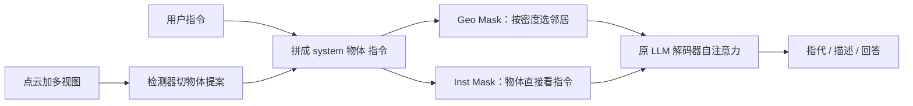

# 3D-SLIM：不改 LLM 结构，只换解码器掩码，让物体 token 按空间关系而不是输入顺序互相看见

<!-- release-date: 2025-12-02 -->

**本文依据**：`Masking Matters: Unlocking the Spatial Reasoning Capabilities of LLMs for 3D Scene-Language Understanding`，arXiv:2512.02487v2 [cs.CV]（2026-03-24），12 页 letter。作者 Yerim Jeon、Miso Lee、WonJun Moon、Jae-Pil Heo*（通讯作者），Sungkyunkwan University。代码 `https://github.com/Jyerim/3D-SLIM`。盘上 PDF 页眉写明 arXiv:2512.02487v2 [cs.CV] 24 Mar 2026。官方 abs：`https://arxiv.org/abs/2512.02487`，v1 提交日 **2025-12-02**。封面与全文抽取均未印会议名。文中数字都标 PDF 页码。本文只读这一份 PDF。

## 一句话

把 LLM 接到 3D 场景上，近年进步大多发生在**输入怎么表示**：用检测器切出物体提案，给每个物体一个标识符和 2D/3D 特征，再拼进解码器（PDF p. 1）。解码器本身仍从语言模型原样借来，自注意力套**因果掩码（causal mask）**：位置 $p$ 只能看 $p$ 之前的 token。这和 3D 物体的本性打架——场景里的椅子、桌子**没有固有先后顺序**，关系是空间上的远近，不是序列上的前后；因果掩码还挡住物体 token 直接看指令，模型只好先把整场物体扫完，再把用户问题接进去（PDF p. 1–2）。作者提出 3D Spatial Language Instruction Mask（3D-SLIM，三维空间语言指令掩码），用两块自适应掩码替换物体相关的因果块：几何自适应掩码（Geometry-adaptive Mask，Geo Mask）按局部密度决定每个物体看几个邻居；指令感知掩码（Instruction-aware Mask，Inst Mask）让物体 token 直接看指令 token。不改网络结构、不加参数，接到 Chat-Scene、3DGraphLLM 以及 Vicuna / Llama3 / Qwen2 / Qwen3 多种解码器上，指代、描述、问答都涨（PDF p. 1–2、p. 6–7）。

它解决的不是「再做一个更强的 3D 编码器」，而是：**解码器注意力该按空间结构和任务指令开窗，而不是按输入顺序单向看。**

## 一、矛盾：物体已经切好了，解码器还在按文本顺序推理

3D 场景–语言理解要同时读点云环境和自然语言，支撑指代（visual grounding）、稠密描述（dense captioning）、问答（PDF p. 1、p. 3）。早期是任务专用头；后来有人做统一框架，但仍靠任务头，对开放指令不灵活（PDF p. 2）。大模型进来之后，难处变成：怎样把 3D 场景写成 LLM 吃得下的序列。作者把输入侧分成三条线（PDF p. 2）：

1. **点/体素**：多视图特征投到点或体素上，几何密。
2. **视频**：多视图当视频，把 3D 信息灌进视频 LLM。
3. **物体中心**：检测器切提案，每个物体一个 ID，便于直接点名。

Chat-Scene、Inst3D-LMM、3DGraphLLM 走第三条。输入构造已经很花功夫，解码器却几乎没人改（PDF p. 1–2）。

物体中心流水线两段（图 2，PDF p. 3）：

1. **输入构造**。预训练检测器出提案；每个物体带几何、外观、关系线索和标识符（如 `<OBJ005>`），标识符写进词表。序列顺序固定为 `[system, objects, instruction]`。
2. **LLM 解码器**。自回归生成。$Q,K,V\in\mathbb{R}^{n\times d}$，注意力是

$$
A=\mathrm{softmax}\left(\frac{QK^{\top}}{\sqrt{d}}+M\right),
$$

因果掩码令 $p<q$ 时 $M_{pq}=-\infty$，于是 $A$ 是下三角（PDF p. 3）。

因果掩码在文本里合理：词序就是句法。搬到物体 token 上，作者点出两处硬伤（PDF p. 1–3）：

- **顺序偏见**。物体没有固有顺序，检测器怎么排，因果掩码就强迫后出现的物体依赖先出现的。模型会学到虚假的「谁排在谁前面」，而不是「谁离谁近」。
- **物体–指令通路被切断**。物体 token 在序列里排在指令前面，按因果规则看不见后面的问题。场景编码与任务脱节，跨模态推理绕远路。

朴素改法是物体之间全连接。作者说这也不对：3D 场景密度不均匀，稠密区需要多看邻居，稀疏区多看会把远处无关物体拉进来（PDF p. 4）。需要的是**按几何开窗，而不是全开或全关**。

上图是机制示意，根据 PDF 图 1–3（p. 1、p. 3–4）重画，不是实测时间轴。系统 token 与生成侧文本仍走原来的因果约束；改的是物体–物体块和物体–指令块。

三条贡献按原文（PDF p. 2）：

- 点明常规 LLM 解码器的两个问题：虚假顺序相关、物体与指令交互不足。
- 提出 3D-SLIM，可插、不加参数。
- 多种底座、多项 3D 场景–语言任务上验证。

## 二、Geo Mask：密度高就多看邻居，密度低就少看

人看房间会把近处的东西先捆成一团，而不是按某个任意编号从 0 扫到 $N$（PDF p. 4，引 Gestalt 分组）。Geo Mask 把这种近邻偏见写进注意力范围。

设物体集合 $\mathcal{O}$，共 $N$ 个，中心 $c_i$。局部密度先算平均距离再翻转（PDF p. 4 式 1）：

$$
\rho_i=\sqrt{3}-\frac{1}{N-1}\sum_{j\neq i}d_{ij},\quad
\tilde{\rho}_i=\frac{\rho_i-\rho_{\min}}{\rho_{\max}-\rho_{\min}},
$$

其中 $d_{ij}=\|c_i-c_j\|_2$。平均距离越小，密度越高。$\tilde{\rho}_i$ 是场景内 min–max 归一化，用来比「相对疏密」，不是绝对米数。

每个物体的邻居个数和邻居集合（PDF p. 4 式 2）：

$$
k_i=\mathrm{round}\bigl((k_{\max}-k_{\min})\cdot\tilde{\rho}_i+k_{\min}\bigr),
$$

$$
\Omega_i=\mathrm{TopK}\bigl(\{-d_{ij}\mid j\neq i\},k_i\bigr).
$$

$k_i$ 被夹在 $[k_{\min},k_{\max}]$。物体–物体掩码（PDF p. 4 式 3）：$j\in\Omega_i$ 或 $j=i$ 时 $M^{\mathcal{O}}_{ij}=0$，否则 $-\infty$。

经验默认 $k_{\min}=2$、$k_{\max}=10$（PDF p. 5）。稠密区 $k_i$ 靠近 10，稀疏区靠近 2，并且至少留两个邻居，避免孤立物体完全看不见别人。作者把它说成一张**随密度改连接度的几何场景图**，不是固定 $k$ 近邻图（PDF p. 4）。

固定阈值（固定个数或固定距离）不够，因为室内场景里家具堆在一起的角落和空旷过道同时存在（PDF p. 4）。全连接则把远物和近物一视同仁，消融里 caption / QA 还会掉（见第七节）。

## 三、Inst Mask：物体编码时就要看见问题

人听到「桌子周围有几把椅子」会先盯桌子和椅子，而不是先无任务地扫完全屋（PDF p. 4–5）。因果掩码让物体 token 在编码阶段看不到指令。Inst Mask 只改物体–指令块：把原来的 $-\infty$ 改成 $0$（PDF p. 5 式 4）——$i\in\mathcal{O}$ 且 $j\in\mathcal{I}$ 时允许注意，其余位置保持原掩码。

这一步不加层、不加投影。物体表示在进入后续层时已经带任务上下文，作者称为任务适配的场景表示（PDF p. 2）。附录可视化里，Chat-Scene 的 Obj→Inst 权重全是零；加上 Inst Mask 后，灯这个物体 token 会高亮 「above」「table」 一类词（PDF p. 11）。

两块掩码都直接替换标准因果掩码对应子块，现成解码器不用改结构（PDF p. 1、p. 4）。

## 四、训练：多任务收成同一套输入–输出，只监督文本

任务定义：给定场景和指令，识别被指物体、描述指定目标、或回答问题（PDF p. 3）。训练目标跟 Chat-Scene：所有 3D 场景–语言任务收成统一 prompt，只用条件在多模态输入上的交叉熵（PDF p. 5 式 5）：

$$
\mathcal{L}=-\sum_{l=1}^{m}\log P(Y_l\mid Y_{1,\ldots,l-1},X),
$$

$X$ 是系统消息 + 场景表示 + 用户指令，$Y$ 是要生成的文本。没有另加几何损失或对比损失。论文没写数据配比、训练步数、epoch，也没写检测器是否一起训。

实现（PDF p. 5）：接到 Chat-Scene 与 3DGraphLLM，超参沿用原配置。LoRA + AdamW，weight decay $0.02$；NMS 的 mask IoU 阈值 $0.9$。Chat-Scene batch $32$、学习率 $5\times 10^{-6}$；3DGraphLLM batch $8$、学习率 $2\times 10^{-5}$。两张 NVIDIA RTX Pro6000。

## 五、数据与指标：五个 ScanNet 基准

五个常用基准都建在 ScanNet 上：1513 个室内场景，1201 训练、312 验证（PDF p. 5）。ScanRefer、Multi3DRefer 做单物体 / 多物体指代；Scan2Cap 做稠密描述；ScanQA 自由问答；SQA3D 情境推理。除 SQA3D 额外报测试集外，其余报验证集（PDF p. 5）。

指标按前人（PDF p. 5）：

- ScanRefer：Acc@0.25 / Acc@0.5（预测框与真值 3D IoU 过阈值的比例）。
- Multi3DRefer：F1@0.25 / F1@0.5。
- Scan2Cap：C@0.5（CIDEr@0.5）、B-4@0.5（BLEU-4@0.5），描述质量还要框 IoU≥0.5。
- ScanQA：C（CIDEr）、B-4。
- SQA3D：EM（精确匹配）、EM-R（精炼精确匹配）。

## 六、主结果：物体中心框架上指代涨得最明显

表 1 把专家模型、点基、视频基、物体基放在一起（PDF p. 6）。作者自己的数字是在 Chat-Scene（Vicuna-7B-v1.5）和 3DGraphLLM（Llama3-8B-Instruct）上加 3D-SLIM。

Chat-Scene → Chat-Scene + Ours（PDF p. 6 表 1）：

| 任务 | 指标 | 原 Chat-Scene | +Ours |
|---|---|---|---|
| ScanRefer val | Acc@0.25 / Acc@0.5 | 55.5 / 50.2 | 59.6 / 54.1 |
| Multi3DRefer val | F1@0.25 / F1@0.5 | 57.1 / 52.4 | 63.7 / 58.7 |
| Scan2Cap val | C@0.5 / B-4@0.5 | 77.1 / 36.3 | 84.2 / 38.0 |
| ScanQA val | C / B-4 | 87.7 / 14.3 | 94.0 / 15.2 |
| SQA3D val | EM / EM-R | 53.2 / 56.1 | 55.9 / 58.9 |
| SQA3D test | EM / EM-R | 54.6 / 57.5 | 55.5 / 58.2 |

3DGraphLLM → 3DGraphLLM + Ours（同一张表）：ScanRefer 62.4/56.6 → 64.1/57.7；Multi3DRefer 64.7/59.9 → 67.3/62.0；Scan2Cap C@0.5 81.0 → 82.2，B-4@0.5 36.5 → 37.3；ScanQA C **88.8 → 88.2**（略降），B-4 15.9 → 15.8；SQA3D val EM 55.9 → 56.8，并补上原表空着的 EM-R 59.7；test EM/EM-R 为 56.1/59.1（原 3DGraphLLM 这两格是「−」）。

相对视频基方法，作者承认：指代（ScanRefer / Multi3DRefer）更高，问答（ScanQA / SQA3D）更低。猜想是底座差异——物体基多用纯文本 LLM，视频基用在大规模图像/视频 QA 上继续训过的 MLLM；表 1 里 Qwen2-VL-7B、LLaVA-Video-7B 的零样本 ScanQA / SQA3D 已经不弱（PDF p. 5–6）。物体基内部，加掩码后指代提升更扎眼（PDF p. 6）。

表 2 把 3D-SLIM 接到 Chat-Scene 框架、换解码器（PDF p. 6–7）。Vicuna-7B-v1.5 基线 ScanRefer Acc@0.25/0.5 为 55.3/49.5，加 Ours 到 59.6/54.1；Multi3DRefer 59.6/54.8 → 63.7/58.7；Scan2Cap C@0.5 78.1 → 84.2；ScanQA C 88.3 → 94.0；SQA3D val EM 53.7 → 55.9。Llama3-8B-Instruct、Qwen2-7B-Instruct、Qwen3-8B-Instruct 同样全面上涨。注意：表 2 的 Vicuna 基线与表 1 的 Chat-Scene 数字不完全同一套（表 2 ScanRefer Acc@0.25 是 55.3，表 1 是 55.5），文章按表各报各的，不把两表捏成一条曲线。

图 1(b) 雷达图上的 Vicuna / Qwen2 数字与表 2 一致，用来展示「换解码器也涨」，不是另一套实验（PDF p. 1）。

## 七、消融：全开注意力不够，密度自适应才够

表 3 只改物体–物体块，关掉 Inst Mask，底座 Chat-Scene + Vicuna-7B（PDF p. 7）。因果掩码 A0：ScanRefer 55.3/49.5，Scan2Cap C@0.5 78.1，ScanQA C 88.3，SQA3D EM 53.7。

- **B0 全序列 Full Mask**：caption 和 QA 掉（Scan2Cap C@0.5 76.5，SQA3D EM 53.2）。去掉顺序约束并恢复跨模态，仍不提供有用结构，甚至碍事（PDF p. 7）。
- **C0 只在物体–物体块 Full Mask、C1 Diagonal（物体之间互不看）**：两者几乎打平。说明去掉物体顺序是对的，但「全看」和「全不看」都抓不住空间结构（PDF p. 7）。
- **D0 固定 Top-5 近邻、D1 Geo Mask**：都超过 C0/C1；D1 再超过 D0（ScanRefer Acc@0.25 57.5 → 58.6，ScanQA C 91.6 → 94.2）。局部性有用，按密度改 $k$ 更有用（PDF p. 7）。

表 4 拆两组件（PDF p. 7）。都不加：55.3/49.5。只 Geo：58.6/53.1。只 Inst：57.6/51.8。两个一起：59.6/54.1，Multi3DRefer F1@0.25 到 63.7。作者说两者互补：一个管空间结构，一个管任务导向（PDF p. 8）。ScanQA C 上只 Geo 是 94.2，两个一起是 94.0，几乎持平，指代和描述仍是合用更高。

表 5 扫 $[k_{\min},k_{\max}]$（PDF p. 8）。$(0,5)$ 太窄；$(0,10)$ 好一些；$(2,10)$ 给稀疏物体保底邻居，最稳；$(2,20)$ 上界太大，注意力摊开，多项回落。默认取 $[2,10]$。

## 八、注意力图：因果掩码会让「序列里第一个物体」看不见任何人

图 4 把输出 token 对物体 token 的注意力对层、对头取平均（PDF p. 8）。问答「电视下面那张桌子旁边是什么」，真值 trash can；3D-SLIM 盯垃圾桶一带，Chat-Scene 盯 table / tv 这类显著名词，答成 bench。指代「白柜子左边的黑柜子」时场景里有两个黑柜，3D-SLIM 对上关系，Chat-Scene 孤立看一个黑柜，选错 ID。

附录图 5 更直接（PDF p. 11–12）。指代两个红靠垫、要「右边还有另一个红靠垫」那一个：Chat-Scene 因因果掩码选了序列第一的 `<OBJ000>`，它对后续全部物体的 Obj→Obj 权重被置零，也几乎看不到指令；3D-SLIM 选对 `<OBJ016>`，邻居注意力落在目标区域，指令侧点亮 red / throw / pillow / couch / another。问答「墙上桌子上方是什么」，真值 White lamp：Chat-Scene 的灯 token 只能看序列里排在它前面的物体，注意力飘到远处，答成 Window；3D-SLIM 把灯和近邻绑在一起，并看 「above」「table」，答 Lamp。

这是作者对「虚假顺序相关」的定性证据，不是定量指标。

## 九、没写什么，以及能搬走什么

论文没写：训练时长与 token 预算、LoRA 秩、检测器（文中引 Mask3D）是否冻结、Geo Mask 在推理时是否每层重算还是预计算一次、$k$ 对室外或极大 $N$ 是否失效。ScanQA 在 3DGraphLLM 上 CIDEr 略降，作者没有单独解释。问答整体仍落后视频 MLLM，作者归因于底座而不是掩码（PDF p. 5–6）。封面未印会议名。

可迁移的不是「再训一个 3D LLM」，而是三条解码器纪律：

1. **模态没有固有顺序时，不要把文本因果掩码整段套上去。** 3D 物体、无序集合、图节点都可能中招。
2. **全连接不是因果的对称修复。** 没有局部结构时，全开和全关可以一样差；要按数据几何开窗。
3. **条件（指令、问题、任务描述）若排在集合 token 后面，集合侧必须有一条合法的反方向注意通路**，否则表示阶段就是无任务的。

3D-SLIM 的代价是：掩码变成输入相关、不可静态编译成一张固定下三角；密度估计依赖物体中心，检测器错了，邻居图也会错。它加在物体中心框架上最顺，因为「一个 token 一个物体」让 $d_{ij}$ 有明确几何含义。点级或视频级序列能不能直接套同一套 $k$，论文没做。
