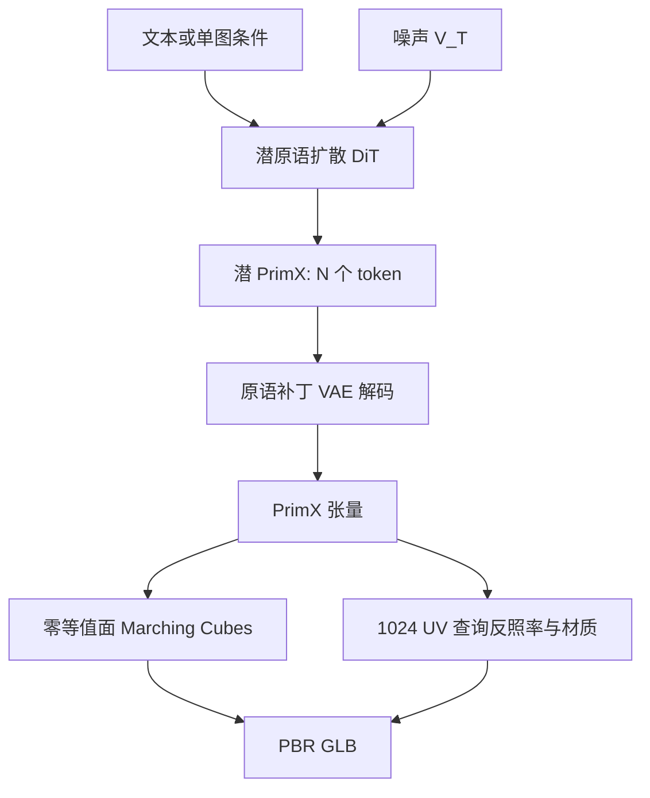

# 3DTopia-XL：用 PrimX 原语扩散把原生 3D 生成推到可进引擎的 PBR GLB

<!-- release-date: 2024-09-19 -->

**本文依据**：`3DTopia-XL: Scaling High-quality 3D Asset Generation via Primitive Diffusion`，arXiv:2409.12957v2 [cs.CV]（2025-03-17），24 页 letter。作者 Zhaoxi Chen^{1}（S-Lab, Nanyang Technological University）、Jiaxiang Tang^{2}（Peking University）、Yuhao Dong^{1,3}、Ziang Cao^{1}、Fangzhou Hong^{1}、Yushi Lan^{1}、Tengfei Wang^{3}、Haozhe Xie^{1}、Tong Wu^{3,4}、Shunsuke Saito、Liang Pan^{3}、Dahua Lin^{3,4}、Ziwei Liu^{1}。^{1} S-Lab, NTU；^{2} Peking University；^{3} Shanghai AI Laboratory；^{4} The Chinese University of Hong Kong。封面项目页 `https://3dtopia.github.io/3DTopia-XL/`。盘上 PDF 页眉写明 arXiv:2409.12957v2 [cs.CV] 17 Mar 2025。官方 abs：`https://arxiv.org/abs/2409.12957`，v1 提交日 **2024-09-19**。封面第 1 页未印会议名，本文不补。文中数字都标 PDF 页码。本文只读这一份 PDF。

## 一句话

工业要的 3D 资产不是「能看的网格」，而是几何、反照率、金属度/粗糙度打包进 GLB、能进图形引擎做物理渲染（PBR）的资产。当时三条主流路都卡在这里：SDS 逐场景优化又慢又糊；稀疏视图重建把 triplane-NeRF 压在低分辨率，还是确定性、多样性差；原生 3D 扩散很少能同时出高质量几何和 PBR（PDF p. 1–2）。3DTopia-XL 的答案是先换表示：用 **PrimX** 把带纹理网格写成 $N\times D$ 张量（表面上一堆小体素，各带位置、全局尺度和 SDF/RGB/材质载荷），再对每个原语做 **Primitive Patch Compression**（局部 3D VAE），最后用 **Latent Primitive Diffusion**（DiT）在潜原语集合上做文/图条件去噪，导出 Marching Cubes 网格加高分辨率 UV 贴图的 GLB（PDF p. 1–2）。作者说这条路不靠超分把 3D 表示放大，也不靠事后网格精修（PDF p. 2）。

它解决的不是「再训一个 3D 扩散」，而是当时原生生成卡死的两件事：**表示既要能拟合高分辨率几何+PBR，又要能在几分钟内从 GLB 张量化**；以及 **扩散对象必须短到 Transformer 能全局建模原语之间的关系**。

## 一、矛盾：要进引擎的资产，三条旧路都交不出

作者把当时 SOTA 分成三类（PDF p. 2）：

1. **SDS**（DreamFusion 一类）：用 2D 扩散先验逐场景蒸馏 3D。慢、几何差、多面不一致。
2. **稀疏视图重建**（LRM 一类）：单视图或多视图回归 3D，底层多是 triplane-NeRF。triplane 参数不经济，有效参数空间被锁在低分辨率；确定性方法多样性也差。后续用 2D 多视图扩散当前端能抬观感，但多视图本身 3D 不一致。
3. **原生 3D 生成**：直接建模 3D 资产的概率分布。体素吃显存、点云难出水密表面、隐式 triplane 折中但仍难出高质量；网格/原语方法泛化或质量不够；潜扩散先训 3D VAE 再扩散，结果不是分辨率低就是不会 PBR。

多数生成模型还用**顶点着色**当纹理，导出网格时质量再掉一截（PDF p. 2）。作者要的输出是几何、纹理、材质打进 **GLB**（PDF p. 2）。图 1 的封面资产就是这种可进引擎的 GLB（PDF p. 1）。

四条贡献按作者自己的清单（PDF p. 2）：① PrimX，高效、张量、可渲染；② 可缩放生成框架，对准高分辨率几何、纹理、材质；③ 从表示抽资产、避免质量落差的实用技巧；④ 图生 3D 与文生 3D 的质量与应用。

上图是机制示意，根据 PDF 图 3（p. 5）与第 3 节重画，不是实测时间轴。

## 二、相关工作：重建快但不多样，原生扩散很少带 PBR

**稀疏视图重建**。LRM 证明端到端 triplane-NeRF 能吃大数据、泛化；质量仍受表示效率限制，且确定性（PDF p. 2）。后续接多视图、Gaussian Splatting、三角网格，作者判断：**很少能同时出高质量 PBR 并保留采样多样性**（PDF p. 3）。

**原生 3D 扩散**。没有像 2D 那样的「通用图像表示」。体素直接从 2D 搬，显存拦高分辨率；点云省内存但难水密；triplane-NeRF 折中；网格与原语仍卡泛化或质量。潜扩散先压再扩散，作者点名的缺口仍是低分辨率或不建模 PBR（PDF p. 3）。本文主张：在 **PrimX** 上做新的 3D 潜扩散，从带纹理网格高效算出，再解包成高分辨率几何加 PBR（PDF p. 3）。

附录还把 PrimX 和几类近邻拆开（PDF p. 12）：相对隐式向量集，PrimX 统一形状+纹理+材质、可微渲染、每个 token 可解释（可做颜色增强、可按 token 掩码做修复）；相对 PrimDiffusion，不需要人体那种共享模板网格、参数更简（只要位置、单一尺度、体素载荷）、几何用 SDF 而不是只能从 2D 学的体积不透明度；相对 M-SDF，M-SDF 只编码形状，PrimX 还带纹理材质且可渲染到 2D；相对 3DGS，高质量物体往往要数十万高斯，DiT 上下文太长，PrimX 用 $N=2048$ 局部体素当「点与密体素之间的插值」（PDF p. 12）。

## 三、PrimX：把带纹理网格写成表面上一堆小体素

作者给大规模 3D 生成立了三条表示原则（PDF p. 3）：参数要经济；要能**快速张量化**，现代网络才吃得进；要**可微渲染**，才能同时从 3D 和 2D 学。

### 定义：每个原语是 $a^3$ 的小格子

形状用有符号距离场（SDF）（PDF p. 3 式 1）：

$$
F_{\mathcal{S}}^{\mathrm{SDF}}(x)=\mathrm{sign}(x,\mathcal{S})\cdot d(x,\partial\mathcal{S}).
$$

表面邻域 $U(\partial\mathcal{S},\delta)$ 上再定义反照率 $C(x)$ 和材质 $\rho(x)$（金属度、粗糙度，输出 $\mathbb{R}^2$）（PDF p. 3 式 2）。整块网格于是是 $\mathbb{R}^3\to\mathbb{R}^6$ 的体积函数。PrimX 用 $N$ 个贴在表面上的体积原语去逼近它（PDF p. 3 式 3）：

$$
\mathcal{V}=\{\mathcal{V}_k\}_{k=1}^{N},\qquad \mathcal{V}_k=\{t_k,s_k,X_k\}.
$$

每个 $\mathcal{V}_k$ 是分辨率 $a^3$ 的小体素：位置 $t_k\in\mathbb{R}^3$，全局正尺度 $s_k$，载荷 $X_k\in\mathbb{R}^{a\times a\times a\times 6}$（SDF、RGB、材质）。作者写明载荷维度可以换，这里实例化成六通道（PDF p. 3–4）。

查询时对所有原语做加权三线性插值（PDF p. 4 式 4–6）。权重是归一化后的 $\hat w_k$，支撑是无穷范数下的单位立方：

$$
\hat w_k(x)=\max\bigl(0,1-\bigl\lVert (x-t_k)/s_k \bigr\rVert_{\infty}\bigr).
$$

这是 Mosaic 体素那种全局加权出光滑表面的思路（作者点名 Yariv 等的 M-SDF）（PDF p. 3–4）。可学习参数拼起来就是 $N\times D$ 张量，$D=3+1+a^3\times 6$（PDF p. 4）。

可微光栅化：沿相机射线对 RGB 场积分，不透明度由 SDF 的高斯型指数给出，$\alpha=0.005$ 控制方差（PDF p. 4 式 7–8）。

### 抽 GLB：零等值面加 1024 UV，不用顶点着色

几何：对 $F^{\mathrm{SDF}}$ 的零等值面跑 Marching Cubes（PDF p. 4）。外观：先在 **$1024\times 1024$** UV 上展开，用光栅化得到有效 3D 采样点，再查 PrimX 的 RGB/材质；对 UV 做膨胀并用最近邻填空洞，减轻锯齿；最后把几何、UV、反照率、材质打进 GLB（PDF p. 4）。作者强调：靠 SDF 表面才能用高分辨率 UV 采样，顶点更少、质量更高（PDF p. 2）。

附录算法 2 还写了加速：离所有原语都远过 $s_k$ 的格点不查 PrimX，用到最近原语的距离乘符号填充（PDF p. 24）。实现用 xatlas 展 UV、nvdiffrast 光栅化、mcubes 做 Marching Cubes（PDF p. 24）。

抽网格消融（图 18）：顶点着色或不打包材质，自然光下没有像样的反射；$256\times 256$ UV 会把纹理和材质弄噪；不做 UV 修复会出现锯齿空洞。作者用来辩护算法 2 的三件事：UV 贴图、高分辨率 UV、按邻接修复（PDF p. 17、图 18）。

### 从 GLB 算 PrimX：好初始化加两阶段微调，约 1.5 分钟

要在大数据上可扩展，拟合必须快。作者的关键判断：**好初始化再轻量微调**（PDF p. 4）。网格顶点先归一化进单位立方。位置：表面均匀随机采 $\hat N$ 个候选，再最远点采样得到 $N$ 个有效位置；尺度取到最近邻的 $L_2$ 距离。载荷：在 $t_k+s_k I$ 上查 SDF（$I$ 是局部单位体素格）；非水密拓扑用带 BVH 的光线行进转体积 SDF。颜色和材质：最近面+重心坐标插 UV，再从贴图取样（PDF p. 4–5）。附录实现写明 SDF 采样来自 cuBVH（PDF p. 24）。

微调损失（PDF p. 5 式 9）在表面邻域上对 SDF、RGB、材质做 $L_1$。两阶段各 1k 步：先 $\lambda_{\mathrm{SDF}}=10$、外观权重 $0$，再 $\lambda_{\mathrm{SDF}}=0$、外观权重 $1$（PDF p. 5）。默认超参：$N=2048$、$a=8$，微调采 50 万点（30 万表面、20 万近表面标准差 $0.01$），2k 迭代、batch 1.6 万点、Adam、学习率 $1\times 10^{-4}$（PDF p. 21）。图 2 把整条张量化画成「约 1.5 分钟」（PDF p. 4）。

初始化消融（表 8）：Uniform+Farthest 的 PSNR-SDF/RGB/Mat 为 **72.12 / 26.26 / 21.65**；只做最远点（M-SDF 那种单一全局尺度）掉到 **56.86 / 14.30 / 10.16**；更复杂的 Coverage 方案 **71.38 / 26.06 / 21.41**，质量和他们最终方案接近但更贵，所以不用（PDF p. 16 表 8、图 16）。

数据侧：从 Objaverse 滤碎片形状和大场景，得到 **25.6 万** 物体（PDF p. 20）。加载把 GLB 当连通图，丢掉面邻接少于 3 的孤立片，用唯一全局包围盒归一化到 $[-1,1]$；没有 PBR 的模型按 Blender principled BSDF 赋默认漫反射（PDF p. 20–21）。

## 四、原语补丁压缩：每个小体素自己压，全局相关留给扩散

PrimX 仍偏胖，直接扩散不划算。作者用变分自编码器，**只在每个原语的局部体素补丁上压**，不把所有补丁做全局压缩（PDF p. 5）。编码器下采样率写 **48**，把 $X_k\in\mathbb{R}^{a^3\times 6}$ 压成 $\hat X_k\in\mathbb{R}^{(a/2)^3\times 1}$（PDF p. 5）。损失是重建 $L_2$ 加 KL（PDF p. 5 式 10）。压完每个原语变成 $\{t_k,s_k,E(X_k)\}$，扩散空间 $V\in\mathbb{R}^{N\times d}$，$d=3+1+(a/2)^3$。默认 $a=8$ 时 $d=68$，序列长仍是 2048（PDF p. 5、p. 21）。

和 2D/3D 潜扩散常见做法的差别：全局语义和补丁间相关**故意留给扩散模型**（PDF p. 5）。作者说这才把固定算力预算下的模型参数量抬上去，是高分辨率缩放的关键（PDF p. 5）。

VAE 训练：98k 子集、6 万迭代、batch 256 个 PrimX 样本（每个原语独立，实际 batch 是 $N\times 256$）、Adam、$1\times 10^{-4}$、$\lambda_{\mathrm{kl}}=5\times 10^{-4}$；8 节点 $\times$ 8 张 A100，约 **18 小时**；作者说对未见数据泛化还行（PDF p. 23）。

压缩率消融（表 3）：$N=2048$、$f=48$ 时 PSNR **24.51**，是表内最优；同样 $f=48$ 但 $N=256$ 是 **23.33**，潜空间分辨率更高，作者发现扩散更难收敛；$f=384$ 两条都明显更差（18.48 / 19.80）（PDF p. 8 表 3）。补丁 VAE 还对比 PCA 和类 JPEG 的 DCT：PCA 各压缩率都难出光滑几何；DCT 在较低压缩率尚可，更高压缩率和 VAE 比不过（PDF p. 17 图 17）。

## 五、潜原语扩散：集合上的 DiT，不用位置编码

生成变成学 $p(V)$。去噪对象 $V^T\in\mathbb{R}^{N\times d}$（PDF p. 5）。每个原语当一个 token。**置换等变，所以 Transformer 不加位置编码**（PDF p. 5）。

最大模型 $g_\Phi$：**28 层**，交叉注意力吃条件，自注意力建模原语间关系，AdaLN 注入时间步（PDF p. 5–6 式 11）。实现细节：16 头、隐维 **1152**，约 **10 亿**参数；Pre-LN；1000 步离散噪声、余弦调度；目标是 **v-prediction** 加无分类器引导（CFG）（PDF p. 6、p. 23）。CFG 训练时条件以概率 $p_0$ 丢掉，换成可学习空嵌入（PDF p. 6 式 12）。$p_0=0.1$（PDF p. 23）。

通道归一化必须单独讲。扩散目标是混合张量 $\{t,s,E(X)\}$：$E(X)$ 接近高斯，坐标 $t$ 不是。全局一个标量标准化（2D 扩散常见）会让点扩散和潜扩散两套分布打架。作者在 5 万随机样本上统计**逐通道均值和方差**，训练时当常数用（PDF p. 23）。

条件：图条件用 DINOv2-ViT-B/14，输入 $518\times 518$；文条件用 CLIP-ViT-L/14（PDF p. 22）。图条件**不**把原始网格离线渲成训练集：用式 7 在线渲正视图，又快又和表示一致（PDF p. 22）。文条件：Objaverse 里 **20 万**样本，六视图白底，GPT-4V 出几何/纹理/风格关键词，GPT-4 收成以「A 3D model of…」开头的一句（PDF p. 22–23）。

训练：AdamW、学习率 $1\times 10^{-4}$、余弦 warmup 3k 步、batch **1024**、EMA 衰减 0.9999。图条件：16 节点 $\times$ 8 A100、**35 万**迭代，约 **14 天**。文条件：同样规模、**20 万**迭代，约 **5 天**（PDF p. 23）。推理默认 25 步 DDIM、CFG **6**；作者给的可用区间是步数 25–100、CFG 4–10；单卡 A100 约 **5 秒**（PDF p. 23）。正文写区间时用的是「25 ∼ 100」，本文按维护约定改写成 en dash。

应用：图 7 展示 3D 修复（掩码引导）和文生样本插值，用来对照重建方法没有的原生扩散性质（PDF p. 8）。同一张图换随机种子能出不同几何和空间变化的 PBR（图 14，PDF p. 18）。PrimX 还能出内部结构和细杆（浇水壶内腔、薄结构）（图 15、图 10a，PDF p. 18–19）。

可微渲染还让 PrimX 能从 2D 反传 refined 纹理（图 19）；作者把它读成：有潜力像 LGM/LRM 那样做稀疏视图重建，底层换成 PrimX 就能混 2D+3D 数据（PDF p. 17–18）。局限节同样把这条写成未来：高质量 3D 数据不够时，可微渲染打开 2D 图集（PDF p. 13）。

## 六、实验：先证明表示本身，再比生成

### 表示：同样 1.05M 参数，PrimX 拟合最快也最准

协议：30 个训练集随机 GLB；A100 上拟合到收敛的平均时间；几何用 Chamfer Distance 和 SDF 的 PSNR；外观用反照率和材质 PSNR；度量都在表面附近 50 万点上算（PDF p. 6）。预算钉死 $2048\times 8^3\approx 1.05\mathrm{M}$（PDF p. 6）。对照：3 层宽 1024 的 MLP；带位置编码的 MLP；$128\times 128\times 16$ 三平面加两层宽 512 MLP；密体素 $100^3$；2048 稀疏潜点加三层 MLP。目标与采样和式 9 相同（PDF p. 6）。表 1 正文列了前四者加 PrimX；稀疏点出现在对照清单和图 4 横轴（PDF p. 6）。

表 1（PDF p. 6）：

| 表示 | 运行时间 | CD $\times 10^{-4}$ $\downarrow$ | PSNR-SDF $\uparrow$ | PSNR-RGB $\uparrow$ | PSNR-Mat $\uparrow$ |
|---|---:|---:|---:|---:|---:|
| MLP | 14 min | 4.502 | 40.73 | 21.19 | 13.99 |
| MLP w/ PE | 14 min | 4.638 | 40.82 | 21.78 | 12.75 |
| Triplane | 16 min | 9.678 | 39.88 | 18.28 | 16.46 |
| Dense Voxels | 10 min | 7.012 | 41.70 | 20.01 | 15.98 |
| PrimX | 1.5 min | 1.310 | 41.74 | 21.86 | 16.50 |

PrimX 几何明显最好；作者写相对第二快大约 **7 倍**收敛（PDF p. 6）。定性：MLP 有周期伪影；三平面和密体素表面鼓包、网格伪影；PrimX 能保住胡须一类细结构（图 4，PDF p. 6）。

原语数与分辨率（表 2、图 6）：固定参数时，**更多、更紧凑的原语**更好。最终 $N=2048$、$a=8$（1.05M）PSNR-SDF/RGB/Mat **62.52 / 24.23 / 18.53**；同样 1.05M 的 $N=256$、$a=16$ 是 **59.05 / 23.50 / 18.61**；2.10M 的 $N=512$、$a=16$ SDF 略高（62.89）但 RGB 不如 2048 设置（PDF p. 7 表 2）。更长序列还会加大 DiT 的 GFlops；附录表 7 在同一 1.05M 预算下，$N=2048$ 的 Rendering-FID **16.16**、Latent-FID **24.43**，对 $N=256$ 的 **76.31 / 104.8**（PDF p. 15 表 7）。图 13：加深加宽，Latent-FID 和基于 DINO 渲染的 Rendering-FID 都下降（PDF p. 16）。

### 图生 3D：几何指标领先，视觉 KID 略输多视图重建

对照两类：稀疏视图重建（LGM、InstantMesh、Real3D、CRM）和图像条件扩散（CraftsMan、Shap-E、LN3Diff）。重建方法吃四或六视图，前端靠预训练多视图扩散；可能不一致。扩散方法是概率模型。作者写：上述方法大多只建模形状和颜色，没有粗糙度/金属度；他们可以带采样多样性地出这些资产（PDF p. 6–7）。公平比法：把各方法网格丢进 Blender，用同一环境贴图渲染；没有 PBR 的赋默认漫反射（PDF p. 7）。

图 5：重建方法多视图不一致、也撑不住空间变化材质；triplane 分辨率不够，法线图表面鼓；现有 3D 扩散和输入对不齐；CraftsMan 表面能打，但只有形状没有纹理材质。3DTopia-XL 观感与几何最好，苛刻环境光下仍有高光（PDF p. 7）。附录强调：**不依赖** 2D 图到多视图扩散（图 8，PDF p. 14）。

Objaverse 600 样本（表 5，PDF p. 13）：

| 方法 | 范式 | KID $\times 10^{-2}$ $\downarrow$ | KIDmat $\times 10^{-2}$ $\downarrow$ | FPD $\downarrow$ | KPD $\times 10^{-2}$ $\downarrow$ | COV $\uparrow$ | MMD $\times 10^{-3}$ $\downarrow$ |
|---|---|---:|---:|---:|---:|---:|---:|
| LGM | 稀疏视图重建 | 0.55 | — | 39.86 | 18.54 | 35.83 | 19.88 |
| CRM | 稀疏视图重建 | 1.93 | — | 37.09 | 14.37 | 31.83 | 25.12 |
| ShapE | 原生 3D 扩散 | 11.95 | — | 20.27 | 7.55 | 59.67 | 14.98 |
| LN3Diff | 原生 3D 扩散 | 0.89 | — | 29.36 | 11.27 | 33.50 | 22.64 |
| Ours | 原生 3D 扩散 | 1.02 | 0.69 | 15.74 | 3.59 | 50.31 | 14.63 |

GSO 300 样本（表 6，PDF p. 13）：

| 方法 | 范式 | KID $\times 10^{-2}$ $\downarrow$ | FPD $\downarrow$ | KPD $\times 10^{-2}$ $\downarrow$ | COV $\uparrow$ | MMD $\times 10^{-3}$ $\downarrow$ |
|---|---|---:|---:|---:|---:|---:|
| LGM | 稀疏视图重建 | 0.94 | 34.44 | 11.12 | 33.11 | 23.32 |
| CRM | 稀疏视图重建 | 1.67 | 26.61 | 4.82 | 38.57 | 17.37 |
| InstantMesh | 稀疏视图重建 | 0.91 | 21.54 | 4.15 | 37.01 | 16.31 |
| ShapE | 原生 3D 扩散 | 13.75 | 22.80 | 4.03 | 40.43 | 18.58 |
| Ours | 原生 3D 扩散 | 1.38 | 16.16 | 3.86 | 55.58 | 14.35 |

几何用点云 FID/KID（预训练 PointNet++）以及 Chamfer 空间的 Coverage / MMD；各方法网格最远点采样 **4096** 点。KIDmat 按 glTF 2.0 把金属度/粗糙度渲成彩色图再算 KID；对照方法大多没有这一列（PDF p. 13）。作者自己的读法：稀疏重建吃了更多视觉输入，2D KID 略好，但级联管道因 2D 多视图不一致而扭曲 3D；他们几何最好，也是表里**唯一**能从图像或文本出 PBR 的（PDF p. 13、p. 15）。Objaverse 上 ShapE 的 COV **59.67** 高于他们的 **50.31**，但 FPD/KPD/MMD 以及外观 KID 更差——数字以表为准，不要把「全面最好」读成每一格都赢。

用户研究：27 名志愿者、48 对、四维偏好（总体质量、图像对齐、表面光滑、物理正确）。对齐相对 CRM 一类只是略好，几何和 PBR 才把总体渲染质量拉开（图 11–12，PDF p. 15–16）。图里没有印出百分比数字，本文不猜。

Unique3D 对照：纹理强，但新视角几何怪、优化长；作者建议用 PrimX 重建当几何初值和网格约束（图 10c，PDF p. 15）。手机随手拍也能出 GLB（图 10b，PDF p. 15）。

### 文生 3D：CLIP Score 24.33

只比**不经过**文到多视图扩散的原生文生 3D。度量是未见提示与资产正视图之间的 CLIP Score。表 4：ShapE **21.98**，3DTopia **22.54**，本文 **24.33**（PDF p. 8）。定性放附录图 9（PDF p. 8、p. 14）。

## 七、限制、没写的东西、可迁移启发

作者承认：已经在「相当大规模」数据上训了，质量仍有空间（PDF p. 13）。PrimX 可微渲染，因而可以混 2D+3D 补高质量 3D 数据缺口；显式、好驱动，操纵原语或原语组可探索动态生成和生成式编辑——这是作者的展望，不是已做实验（PDF p. 13）。

本文 PDF **没有**印 CVPR 录用行。Shunsuke Saito 封面无机构上标。训练用了 GPT-4V/GPT-4 造 caption，提示词模板除「A 3D model of…」和关注几何/纹理/风格外没有完整公开。用户研究图未给出可抄的百分比。表 5 里 ShapE 的 COV 高于本文，作者主叙事强调几何质量与 PBR，读表时要自己对格子。

**可迁移的几条**（从设计因果抽出，不是论文清单）：

1. **表示先过「张量化时钟」**。同样 1.05M 参数，1.5 分钟对 10–16 分钟，决定你能不能在 25 万网格上预处理（表 1）。
2. **局部压、全局扩散**。VAE 不抢全局语义，DiT 才有东西可建；全局 VAE 在 3D 上往往把分辨率或 PBR 先牺牲掉。
3. **混合张量要逐通道标准化**。坐标通道和 KL 潜通道不是同一个分布，抄 2D 的全局标量会训歪。
4. **导出路径是质量的一部分**。顶点着色、低分辨率 UV、不修 UV，都会在进 Blender 的那一步把生成质量吐回去。
5. **置换等变集合可以不加位置编码**，前提是原语本身带 $t_k$。

读完应留下的判断：这篇的主证据是 **PrimX 拟合表 + 图生 3D 的 3D 度量 + 文生 CLIP + 抽 GLB 消融**；「全面超过现有方法」在 2D KID 和个别 COV 格子上并不成立，作者正文也承认多视图重建视觉输入更多。PBR 是他们相对对照方法的结构性差异，不是同一指标上的小幅增益。
