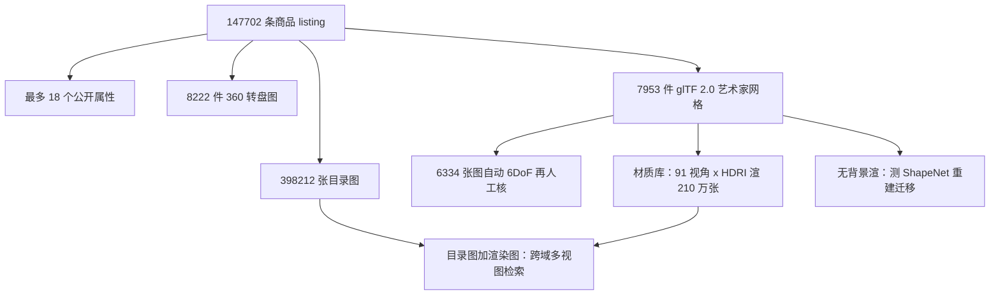

# ABO：把电商目录图和艺术家做的 PBR 网格绑成同一件真家具，用来测重建、材质和跨域检索会不会在真物体上掉下去

<!-- release-date: 2021-10-12 -->

**本文依据**：《ABO: Dataset and Benchmarks for Real-World 3D Object Understanding》，17 页 letter。作者 Jasmine Collins^{1}、Shubham Goel^{1}、Kenan Deng^{2}、Achleshwar Luthra^{3}、Leon Xu^{1,2}、Erhan Gundogdu^{2}、Xi Zhang^{2}、Tomas F. Yago Vicente^{2}、Thomas Dideriksen^{2}、Himanshu Arora^{2}、Matthieu Guillaumin^{2}、Jitendra Malik^{1}。^{1} UC Berkeley，^{2} Amazon，^{3} BITS Pilani。第一作者单位为 UC Berkeley。封面与第 1 页均未印会议名、未印 arXiv 行。官方 abs：`https://arxiv.org/abs/2110.06199`，v1 提交日 **2021-10-12**（只作公开首发日）。文中数字都标 PDF 页码。本文只读这一份 PDF。

## 一句话

2D 识别能靠大规模真图做起来；3D 这边要么网上 CAD 几何糙、纹理假、物体不存在于现实，要么把 CAD 硬贴到真图上、形状只是近似，要么扫描重建费力、规模小、还假设朗伯表面（PDF p. 1–2）。Amazon Berkeley Objects（ABO）从 Amazon.com 商品页出发，把**目录图、元数据、艺术家做的高分辨率 PBR 网格**绑到同一件真实家居商品上（PDF p. 1–2）。规模：**147,702** 条 listing、**398,212** 张不重复目录图、每件最多 **18** 个属性；**8,222** 件有转盘式「360º View」；**7,953** 件有艺术家网格（PDF p. 2）。作者用这份库做三件 PDF 写明的任务：**单视图 3D 重建、材质估计、跨域多视图物体检索**（PDF p. 1）。结论不是「再做一个更大的 ShapeNet」，而是：**在真家具、真材质、真目录图上，现成 ShapeNet 重建和饱和的度量学习基准都会明显掉一截。**

上图是机制示意，根据 PDF 第 1–4 节与图 1–3（p. 1–5）重画，不是实测时间轴。

## 一、矛盾：真图容易标，真 3D 很难标，现成 CAD 又对不上现实

作者先承认 2D 靠大规模标注起来了。3D 若要对每个真实物体标体素或网格，成本卡住规模（PDF p. 1）。于是社区走了三条绕路，每条都留下一个缺口：

1. **只吃合成 CAD**（ShapeNet 一类）。量大，但很多质量低、没纹理、现实里不存在。于是出现一批在干净背景渲染上很好、换真图、新类、复杂几何就掉的重建网络（PDF p. 1）。
2. **把现成 CAD 贴到真图上**（Pascal3D+、ObjectNet3D）。人去对齐姿态，形状只是近似；覆盖、几何、纹理仍受现有 CAD 库限制（PDF p. 1–2）。
3. **IKEA、Pix3D 追求像素对齐的精确匹配**。能当单视图重建训练数据、缩小合成到真的域差，但规模小（分别约 **90** 与 **395** 个不重复模型），Pix3D 只有 **9** 类，网格还没纹理，很难做材质预测（PDF p. 2）。
4. **从视频用 SfM / 多视图立体扫回来**。几何忠实，但手工重、规模仍小（文中举例 **398 / 125 / 1032**），多在实验室拍、缺「使用场景里」的真图，纹理还常当朗伯（PDF p. 2）。

所以缺口是同时要：**多样真实类别、复杂几何、物理材质、对应的真实多视图**。ABO 的来源是商品页，不是网上随便捞的 CAD（PDF p. 2）。

表 1 把 3D 子集和别人并排放（PDF p. 2）：ShapeNet **51.3K** 模型 / **55** 类，无真图、无 PBR；3D-Future **16.6K / 8**，无真图、无 PBR；Google Scans 约 **1K**；CO3D **18.6K / 50** 有真图但无完整 3D；IKEA **219 / 11**、Pix3D **395 / 9** 有真图有网格但无 PBR；PhotoShape **5.8K** 只有椅子一类有 PBR。ABO：**近 8K** 模型、**63** 类，真图、完整 3D、PBR 全勾上。作者的判断：同时具备这四项、类别还更散的，当时就是这一份（PDF p. 2–3）。

许可是 **CC BY-NC 4.0**，下载页写在 PDF 里（PDF p. 2）。

## 二、相关工作：重建在 ShapeNet 上训，材质缺复杂真形状，检索基准快饱和

**3D 物体库。** ShapeNet 是单视图 / 多视图重建的默认燃料。IKEA、Pix3D 要精确 CAD 匹配才有图。Pascal3D+、ObjectNet3D 量大但 3D 只是近似。Object Scans、Objectron 是绕物体拍的视频，类别少。CO3D 有 **50** 类视频，但不给完整网格（PDF p. 2–3）。纹理模型普遍过简。PhotoShapes 给 ShapeNet 椅子自动贴空间变化 BRDF（SV-BRDF，人话：表面上每一点反射可以不一样），仍只有椅子。平面 SV-BRDF 库、齐次 BRDF 库、程序生成形状库都对不上「艺术家给真商品做的网格 + 材质」（PDF p. 3）。

**单视图重建。** 体素、点云、网格、隐式函数都有；全监督单视图 / 多视图多在 ShapeNet 上训。也有用图像、深度、轮廓当多视图监督的。多数按类训、同类新实例测；文中点名只有 GenRe 自称类别无关。作者关心的是：这些 ShapeNet 预训练网络换到更真实的物体上还剩多少（PDF p. 3）。

**材质估计。** 公开、真实、规模够用的库很少。单图齐次 / 平面 SV-BRDF、自增强、闪光灯平面、级联 CNN 估任意形状（还要全局光照中间反弹当监督）、多图但仍是简单几何——都缺「复杂真形状上的物理材质」。ABO 补这块，并给单视图 / 多视图的简单基线（PDF p. 3–4）。

**2D/3D 检索。** 把形状和商品自然图嵌到同一空间，受 ShapeNet 限制（跨视图检索只做到椅和车）。CARS-196、鸟、衣服、少数品类的度量学习（DML）基准，查询和目标图太像、多样性不够，SOTA 接近饱和，也几乎没有结构去分析失败。作者因此从 ABO 拉一套类更多、有验证集、能用 3D 测视点和场景鲁棒性的检索基准（PDF p. 4，表 2 在 p. 3）。

表 2 把 ABO-MVR 和 CUB、Cars-196、In-Shop、SOP 比：ABO 域是 Amazon，**562** 类；实例 train / val / test = **49,066 / 854 / 836**；图 train / val / test-target / test-query = **298,840 / 26,235 / 4,313 / 23,328**；结构是「有 3D 模型的子集」；表上 Recall@1 记 **30.0%**（PDF p. 3）。相对别人动辄 **79%–94%** 的 R@1，作者用来说明：这套更难、更大、还吃 3D。

## 三、库里到底有什么

数据来自全球商品 listing、元数据、图像和 3D，覆盖 **576** 种商品类型、多个 Amazon 自有店面（PDF p. 4）。每条 listing 有 item ID，元数据是商品主页上公开的那些（类型、材质、颜色、尺寸等），媒体则是目录图，以及有则给的转盘图：方位角 **5°** 或 **15°** 一档（**8,222** 件）（PDF p. 4）。正文前段把「360º View」和 **7,953** 件网格分开写，转盘图件数大于网格件数（PDF p. 2、p. 4）。

**网格。** glTF 2.0，艺术家做的。坐标系规范：「正面」对齐（能定义正面时），尺度是真实单位。为了能和 ShapeNet 训过的方法比，每件标了类并映射到 WordNet synset。图 4 是类别直方图，纵轴对数（PDF p. 4）。

**目录图 6DoF。** **6,334** 张有姿态。流水线：已知图中 3D 模型 + 现成实例 mask + 可微渲染，最小化剪影损失

$$
R^{*},T^{*}=\arg\min_{R,T}\lVert \mathrm{DR}(R,T)-M\rVert
$$

其中 $R\in SO(3)$，$T\in\mathbb{R}^{3}$，$\mathrm{DR}$ 是 PyTorch3D 可微渲染器，$M$ 是 mask（PDF p. 4–5）。和 Pix3D 那种人在环里给姿态或对应点不同：优化全自动，最后才人工核一次（PDF p. 5）。附录：mask 来自 LVIS 上的 Mask R-CNN 和 COCO 上的 PointRend，置信度大于 **0.1** 的类都留；每个 mask 随机旋转初始化 **24** 次，Adam、学习率 $10^{-2}$、**1,000** 步，旋转用对称正交化；24 次里取损失最低再给人看（PDF p. 12）。

**材质估计用渲染集。** 用 glTF 2.0 的 Disney 基底色 / 金属度 / 粗糙度。Blender Cycles 路径追踪，物体上半球 **91** 个相机、**512×512**、视场 **60°**。光照：从 **108** 张室内 HDRI 里随机抽 **3** 张，换背景和光。真值：基底色、金属度、粗糙度、法向，外加深度和分割。合计 **210 万** 张渲染图及相机内外参（PDF p. 5）。附录去掉透明物体后剩 **7,679** 模型，切成训练 **6,897**、测试 **782**；**108** 张 HDRI 里留 **10** 张只给测试，用来测新光照（PDF p. 13）。

## 四、任务一：ShapeNet 训出来的单视图重建，换 ABO 同类家具就掉

问题不是再发明一种表示，而是：**全监督、在 ShapeNet 上训熟的方法，迁到真实商品网格上还剩多少**——先不管跨类（PDF p. 5）。

四个方法：3D-R2N2（体素）、Occupancy Networks（隐式）、GenRe（球面图）、Mesh R-CNN（网格）。前三个加 Mesh R-CNN 都在 ShapeNet 上预训练；GenRe 训练类不同，训练和测试都要轮廓 mask。R2N2 与 Occupancy 在**规范坐标**里预测；GenRe 与 Mesh R-CNN 在**视图坐标**里预测（PDF p. 5）。

ABO 有 3D 的 **63** 类里，与常用 ShapeNet 类相交 **6** 类（bench、chair、couch、cabinet、lamp、table），罩住 **4,170 / 7,953** 个模型。飞机这类 ShapeNet 常见类在 ABO 对不上；空调、哑铃这类 ABO 类也对不回 ShapeNet（PDF p. 5）。

渲染（与材质那套分开）：白背景，视角分布尽量像 ShapeNet 训练集。每网格 **30** 视角，Blender，视场 **40°**，物体完整入画。方位角和仰角在单位球上均匀采，仰角下限 **−10°**，少拍底（PDF p. 5）。指标：Chamfer（↓）和绝对法向一致性（↑），协议大体跟 Mesh R-CNN 那篇（PDF p. 5）。

表 3 每个格子是 **ABO / ShapeNet**（PDF p. 5）。Chamfer 上 Mesh R-CNN 几乎全线最低（ABO：bench **1.05**、chair **0.78**、couch **0.45**、cabinet **0.80**、lamp **1.97**、table **1.15**；ShapeNet 对应 **0.09 / 0.13 / 0.10 / 0.11 / 0.24 / 0.12**）。法向一致性上 Occupancy Networks 最好（ABO 约 **0.65–0.71**）。除 GenRe 外都在表中列出的全部 ShapeNet 类上训。作者读表：同一类、同一套评测，ABO 与 ShapeNet 之间有大缝——真实形状和纹理对 ShapeNet 模型是分布外、更难。灯尤其掉得多，定性看是细结构难重建（PDF p. 6，图 5 在 p. 4）。

附录把评测对齐写清楚，否则 Chamfer 不可比（PDF p. 12–13）：

- **视图空间**：深度和尺度可一起漂仍保持投影。用已知外参把真值网格变到视图空间，搜 **51** 个候选深度最小化 Chamfer。对齐后按前人协议报 Chamfer 与法向一致性。Chamfer 随尺度变，故把真值包围盒最长边缩到 **10**。
- **规范空间**：靠 ShapeNet 与 ABO 的跨类语义对齐，全数据共用一个手工旋转；平移和尺度仍模糊，对 Chamfer 搜 **34** 档候选（原文写 34 grid）。R2N2 的体素按 Mesh R-CNN 的批处理办法变成网格，不用 Marching Cubes。

附录表 7 是作者放出的 **80% / 10% / 10%** 训练 / 验证 / 测试切分上、对**全部类平均**的重建数，方便以后用 ABO 训再和 ShapeNet 比——和正文「只测与 ShapeNet 相交的那 6 类、全体模型」不是同一张表（PDF p. 13）：R2N2 Chamfer **1.97** / 法向 **0.55**；OccNets **1.19 / 0.70**；GenRe **1.61 / 0.66**；Mesh R-CNN **0.82 / 0.62**。图 12：细结构上 GenRe 直接不建，Mesh R-CNN 看起来更像凸包（PDF p. 13、p. 16）。

## 五、任务二：复杂真形状上的 SV-BRDF，多视图对齐有用

公开大 3D 库多数没有能物理渲染的反射参数。PhotoShape 有参数但一类。ABO 的网格是艺术家做的，形状和 SV-BRDF 都散，所以能从大量真实感合成图上立材质基准（PDF p. 6）。

**基线。** 单视图：U-Net，骨干 ResNet-34，RGB 进共享编码器，多头解码器分别出 SV-BRDF 各分量。多视图：用深度把邻视图投到参考视图，原图和投影图成对输入；结构复用单视图，全局 max pool 吃任意张数。再加可微渲染层：闪光灯照明下把真值渲一张、预测渲一张，当正则。真值材质图直接监督（PDF p. 6）。输入 **256×256**。训练在二十面体上随机抽 **40** 视角；多视图时参考视图的相邻 **4** 个当邻视图。损失是基底色、粗糙度、金属度、法向、渲染的 MSE。AdamW，**17** 个 epoch，学习率 $10^{-3}$，权重衰减 $10^{-4}$（PDF p. 6）。

表 4（PDF p. 6）：

| | SV-net | MV-net（无投影） | MV-net |
|---|---:|---:|---:|
| 基底色 RMSE ↓ | 0.129 | 0.132 | 0.127 |
| 粗糙度 RMSE ↓ | 0.163 | 0.155 | 0.129 |
| 金属度 RMSE ↓ | 0.170 | 0.167 | 0.162 |
| 法向余弦 ↑ | 0.970 | 0.949 | 0.976 |
| 渲染 RMSE ↓ | 0.096 | 0.090 | 0.086 |

多视图全面好于单视图，尤其粗糙度和金属度——它们管随视角变的高光。消融「不用 3D 对齐」：粗糙度、金属度仍优于单视图；加上结构对齐后所有分量再升（PDF p. 6–7）。图 6 是测试集定性（PDF p. 7）。

真目录图：用第 3 节姿态把多视图对齐，估材质再 relight（图 7，PDF p. 7）。光、背景、合成到真都有域差，作者说预测仍「合理」；最后一行失败，归因自阴影把基底色估偏。这是定性，没有另给一张真图 RMSE 表。

附录图 10 画编码器（ResNet-34 conv1–conv5）和单 / 多视图数据流。投影公式：像素 $p$ 坐标 $x$、深度 $z$，另一视图 $x'=KRK^{-1}x+Kt/z$；遮挡用深度测试，看不见的像素用参考视图填（PDF p. 13）。还可把各视图预测反投到 UV，再过一个编码器–解码器聚成完整纹理（图 11，PDF p. 13–14）。正文实验表评的是逐视图地图，不是这张完整 UV 的单独指标。

## 六、任务三：渲染查询对目录图库，度量学习从「快饱和」变成 R@1 约 30%

把目录图和 3D 渲图并起来，做成**能测视点鲁棒性**的检索。训练用第 3 节那套已知方位角 / 仰角的渲染，场景更杂；测试是从一大库目录图里找回商品。难处：渲染是复杂室内背景，目录图更干净；渲染还有目录里少见的机位——两个域，所以叫多视图跨域检索（PDF p. 7–8）。

方法：PyTorch Metric Learning 覆盖三类 DML——NormSoftmax（分类）、ProxyNCA（proxy）、Contrastive / TripletMargin / NTXent / Multi-similarity（元组）。用 Powerful Benchmarker 做可控对比和贝叶斯超参。骨干 ResNet-50，LayerNorm 后投到 **128** 维，不冻 BN；先 pad 成正方形再缩到 **256×256**。批大小 **256**、每类 **4** 张；NormSoftmax 与 ProxyNCA 改成批 **32**、每类 **1** 张更好。超参搜完训 **1000** epoch，按验证 Recall@1 挑最好 epoch，验证隔一个 epoch 算一次（PDF p. 7）。

训练里目录图 vs 渲染图大致均衡（**188K vs 111K**），但「有渲染的类」vs「没有的类」严重不均（**4K vs 45K**）。每批必须把两类类都采样，否则渲染负对不够，也浪费新视点（PDF p. 8）。

表 5 测试（PDF p. 8）。查询是渲染图时 Recall@1 / 2 / 4 / 8，以及用目录图当查询的 R@1：

| 方法 | 渲染 R@1 | R@2 | R@4 | R@8 | 目录 R@1 |
|---|---:|---:|---:|---:|---:|
| ImageNet 预训练 | 5.0 | 8.1 | 11.4 | 15.3 | 18.0 |
| Contrastive | 28.6 | 38.3 | 48.9 | 59.1 | 39.7 |
| Multi-similarity | 23.1 | 32.2 | 41.9 | 52.1 | 38.0 |
| NormSoftmax | 30.0 | 40.3 | 50.2 | 60.0 | 35.5 |
| NTXent | 23.9 | 33.0 | 42.6 | 52.0 | 37.5 |
| ProxyNCA | 29.4 | 39.5 | 50.0 | 60.1 | 35.6 |
| TripletMargin | 22.1 | 31.1 | 41.3 | 51.9 | 36.9 |

预训练几乎做不成（R@1 **5%**）。DML 是必需的。NormSoftmax、ProxyNCA、Contrastive 约 **29%**，另外三个约 **23%**——这个缺口在别的库不明显，用干净目录图当查询时也没这么大。整体远低于表 2 那些旧基准，作者用来支撑「旧基准可能饱和、需要新方法和更能吃规模与 3D 结构的损失」（PDF p. 8）。表 2 的 **30.0%** 与表 5 里 NormSoftmax 渲染 R@1 **30.0** 对齐。

图 8：渲染查询的方位角 $\theta$、仰角 $\phi$ 一偏，R@1 就掉。对所有方法，**$|\theta|>75°$** 和 **$\phi>50°$** 明显更难。现有损失没有显式用训练数据里的几何（PDF p. 8）。

附录把检索子集写细（PDF p. 14–15）。只用刚性物体，去掉服装、家纺、部分配件。listing 里近重复（同款不同尺码）用分层 Union-Find，共享图像当启发，近重复算同一实例；同一产品线可能共享设计细节的实例必须进同一 train / val / test。val / test **只含有 3D 的实例**：目标集是目录图，查询是渲染图。Union-Find 得到 **29,988** 组、**50,756** 实例，其中 **1,334** 组有 3D（**5,683** 实例）。测试：**836** 个有 3D 实例、**4,313** 张 test-target 目录图、每个环境贴图采 **8** 个渲染视角当 test-query。验证：**854** 实例、**4,707** 张 val-target。训练：**49,066** 实例（**3,993** 有 3D）、**187,912** 张目录图、**110,928** 张渲染图，合计 **298,840**——与表 2 训练图数一致（PDF p. 14）。

训练增强：正方形 pad、缩 **256**、随机 resized crop **227**（scale **0.16–1**，ratio **0.75–1.33**）、水平翻转 $p=0.5$。测试：pad、缩 **256**、中心裁 **227**。主干 ImageNet ResNet-50 出 **2048** 维。域均衡：先各抽 $N$ 个有渲染 / 无渲染的类，再每类抽 $K$ 张。NormSoftmax / ProxyNCA：批 **32**，每类 1 张，16+16 类；其余：批 **256**，每类 4 张，64+64 类。一个 epoch **200** 批；**1000** epoch，验证 **250** epoch 不升就停。验证指标：val-query 渲染对 val-target 目录的 R@1。机器：AWS p3.8xlarge，**8** worker，**4** 张 V100。批内不做 tuple mining。RMSProp：学习率 $10^{-6}$，权重衰减 $10^{-4}$，动量 **0.9**。贝叶斯超参 **30** 次、每次 **100** epoch。附录列出各损失的边距 / 温度 / 选出的 epoch（PDF p. 14–15）。

表 8 / 表 9 是表 5 的完整版，外加 MAP、MAP@R、R-Precision；查询分别是渲染图和目录图，图库都是训练类加测试类的目录图，查询自己从结果里剔除（PDF p. 15）。渲染查询明显难于目录查询。图 13 给低 / 中 / 高仰角的成功与失败例（PDF p. 17）。

## 七、附录里还交代的数据切分，以及作者自己划的边界

表 6 把子集和三个实验的训练 / 测试用法摊开（PDF p. 12）：无背景渲染（重建那套）测试重建；带背景渲染（材质那套）训练和测试材质，也训练和测试检索；目录图训练检索，测试材质（真图定性）和检索。重建**训练**不用 ABO 网格——正文实验是 ShapeNet 预训练直接测。

结论段把三条实验收束（PDF p. 8）：ABO 网格对 ShapeNet 重建是难测试集，视图空间和规范空间方法在同类采样下都迁不好；多视图有助于把 SV-BRDF 分量拆开；检索任务缓解旧基准多样性和结构不足、接近饱和的问题，并能按方位角 / 仰角剖开 DML。

本文**没做**、但作者点名可做的：大量文本（描述、关键词）和非刚性商品（服装、家纺）可做风格 / 图案 / 标题 / 关键词预测；网格对应家里会出现的东西，还带重量和尺寸，可服务操作与导航仿真（PDF p. 8）。致谢：部分经费 NSF GRFP（#1752814）和 Amazon-BAIR Commons（PDF p. 8）。参考文献从第 9 页起，不构成新实验。

封面与全文抽取均未印会议名。

## 八、可迁移的几件事

1. **真图、真网格、真材质要绑在同一 SKU 上。** 只增大 CAD 池或只扫实验室转盘，都补不了「这件商品在电商页上长什么样」。迁移时先问监督是否来自同一物理实例。
2. **测迁移时先冻结方法、只换测试分布。** 重建四个网络都是 ShapeNet 预训练；相交 6 类是为了先排除跨类借口。要声称「真实几何更难」，分母必须是同类。
3. **Chamfer 必须先对齐再比。** 视图空间有深度模糊，规范空间有尺度 / 平移模糊；不写搜索网格（51 档深度、34 档尺度平移、包围盒边长 10），表上的「掉多少」不可复现。
4. **多视图材质的收益来自几何对齐，不只来自多几张图。** 无投影消融已经说明：多图主要帮高光相关量；结构投影再帮所有通道。
5. **检索基准一旦查询 / 目标同域、类少，R@1 会假饱和。** 用渲染杂背景打目录图库，再按 $\theta$、$\phi$ 切片，才能看见损失之间大约 **23% vs 29%** 的缝。批必须域均衡，否则有 3D 的类会被没 3D 的类淹没。
6. **近重复和产品线要进同一划分。** Union-Find 不是锦上添花：同款多尺码若裂到 train / test，检索会虚高。

## 关键词回看

- **ABO（Amazon Berkeley Objects）**：目录图 + 元数据 + 艺术家 PBR 网格的真实家居物体库，并派生三个基准。
- **PBR / SV-BRDF**：物理渲染材质；表面上反射可随位置变。ABO 用 glTF 的 Disney 基底色、金属度、粗糙度。
- **单视图 3D 重建迁移**：ShapeNet 预训练方法在 ABO 相交类上的 Chamfer / 法向一致性掉档。
- **跨域多视图检索（MVR）**：渲染查询、目录图库，用 3D 视点解释失败。
- **6DoF 自动姿态**：已知网格 + mask + 可微渲染，最后人工核。
