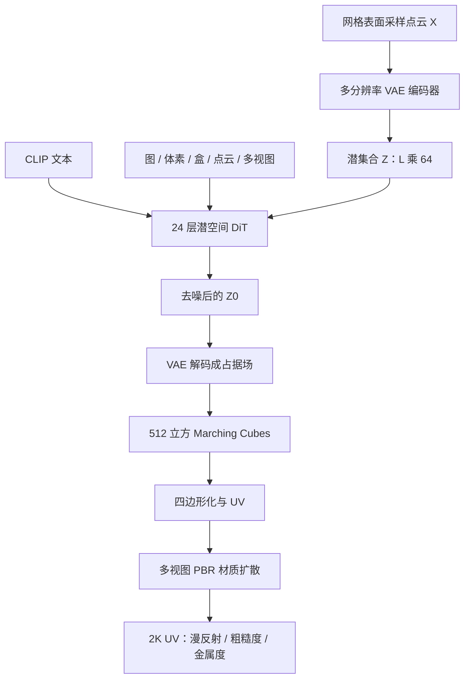

# CLAY：多分辨率 VAE 加潜空间 DiT，把几何与 PBR 材质拆开训，再接 3D 条件

<!-- release-date: 2024-05-30 -->

**本文依据**：`CLAY: A Controllable Large-scale Generative Model for Creating High-quality 3D Assets`，arXiv:2406.13897v1 [cs.CV] 30 May 2024，19 页 letter。作者 Longwen Zhang\*、Ziyu Wang\*（ShanghaiTech University and Deemos Technology Co., Ltd.，共同一作）、Qixuan Zhang†（同上，项目负责人）、Qiwei Qiu（同上）、Anqi Pang（ShanghaiTech University）、Haoran Jiang（ShanghaiTech University and Deemos Technology Co., Ltd.）、Wei Yang（Huazhong University of Science and Technology）、Lan Xu‡、Jingyi Yu‡（ShanghaiTech University，通讯）。封面页眉写明 arXiv:2406.13897v1 [cs.CV] 30 May 2024。官方 abs：`https://arxiv.org/abs/2406.13897`，v1 提交日 **2024-05-30**。封面与正文未印本篇会议名；Creator 为 LaTeX with hyperref，本文不补 SIGGRAPH 或其他会名。文中数字都标 PDF 页码。本文只读这一份 PDF。

## 一句话

2D 文生图已经能靠「先压潜空间、再训大扩散」出图；3D 资产当时还卡在两条路上：一条把 2D 先验抬进三维（SDS、多视图），几何保不住直线与平面；一条在 3D 数据上原生生成，模型小、数据格式不齐。CLAY 把几何和外观拆开：几何走 **3DShape2VecSet 式神经场**，用 **多分辨率变分自编码器（VAE）** 把表面点云压成变长潜集合，再在潜空间用尽量朴素的 **扩散 Transformer（DiT）** 去噪；最大几何生成器 **15 亿** 参数。外观另训多视图 **基于物理的渲染（PBR）** 材质扩散，出漫反射、粗糙度、金属度，UV 上到 **2K**。预训练之后用 LoRA 和并行交叉注意力接文本、图、体素、包围盒、点云、多视图等 3D 条件。作者据此说：不必每次优化一个形状，就能从草图级概念做到可进管线的资产（PDF p. 1–3、p. 5）。

它解决的不是「再发明一种 3D 扩散」，而是当时把 2D 那套 **pretrain-then-adaptation** 搬到 3D 时卡死的三件事：**几何与外观缠在一起**、**3D 数据格式不齐、标不准**、**原生模型没扩到能压过 2D 抬升的规模**。

## 一、矛盾：2D 已经「预训练再适配」，3D 还在 SDS 与小数据原生之间晃

引言把理想工具写得很直：把「孩子捏粘土」那种想象力变成数字几何和纹理，并且要能控（PDF p. 2）。当时 2D 已经靠大数据、Transformer、扩散、LoRA、ControlNet 把工作流改掉了；3D 工作流仍要大量手艺和工时。作者点名两道额外墙：3D 数据相对 2D 极缺，几何和外观缠在同一份资产里（PDF p. 2–3）。

当时最强的两条路线（PDF p. 2–5）：

1. **把 2D 生成抬进 3D**。DreamFusion 一类用分数蒸馏采样（SDS）优化 NeRF / DMTet / 3D 高斯；Zero-1-to-3、MVDream 一类改多视图。外观可以蹭预训练 2D 模型，但 2D 先验不好变成连贯的 3D 先验：**保不住线、角、面**，几何保真差，还容易出多面 Janus。
2. **3D 原生**。点云（Point-E）、网格序列（Polygen、MeshGPT）、多分辨率体素（XCube）、SDF / 占据场上的 VAE 加扩散（SDFusion、3DGen、Shap-E、3DShape2VecSet、Michelangelo）。几何理解更好，但要大模型、大数据；而大数据又正是 3D 生成想解决的稀缺问题。作者还写：当时直接从 3D 数据学的方法，细节和复杂度仍赶不上手做网格（PDF p. 4–5）。

CLAY 的判断是跟文本 / 图像生成同一套 **先预训练、再适配**，把 2D 抬升和 3D 原生两边想要的东西拼起来，缓解数据稀缺（PDF p. 2）。几何侧明确选择 **不靠 2D 重建帮忙出形**：作者写，一旦把 3D 生成模型做大、数据做齐，直接出的几何在多样性和细节上大幅超过 2D 辅助路线（PDF p. 5）。外观侧承认材质图数据更缺，所以改成多视图 PBR 再投到网格上，躲开漫长蒸馏（PDF p. 3）。

上图是机制示意，根据 PDF 图 2（p. 4）、图 3（p. 5–6）、图 5（p. 8）重画，不是实测时间轴。推理墙钟在第 6.1 节另给：单卡 A100 合计约 **45** 秒（PDF p. 13）。

读的时候不要带着后来滤镜。这份 PDF 是 arXiv v1 预印，封面未印录用会；也没有把几何和材质收成端到端一个网络——结论节自己说还没做完（PDF p. 16）。

## 二、相关工作：2D 先验出外观，3D 先验出表面，缺的是「可缩放的原生几何底座」

**用 2D 当先验**。DreamFusion 开了 SDS；后续接到各种神经场和 3D 高斯，改损失、改引导。作者的批评很具体：SDS 用的 2D 扩散 **既不懂几何也不懂视点**，缺透视与显式 3D 监督，就会 Janus。Zero-1-to-3 把变换矩阵接到 Stable Diffusion；一批工作用 SDS 优化更连贯的场，但优化时间长。再往后直接出多视图（PDF p. 3–4）。

**用 3D 当先验**。One-2-3-45 虽常被看成 2D，但用 NeuS 当几何代理。Instant3D、LRM、DMV3D、TGS 一类大重建模型（LRM）用 ViT 加深度 Transformer 直接重建带颜色与密度的 NeRF，优化的是体渲染损失而不是显式表面，几何粗、噪（PDF p. 4）。Point-E 在点云上纯 Transformer 扩散，简单快，难变成干净常用网格。Polygen / MeshGPT 网格质量高，绑在小而精的数据上。XCube 先把几何收成多分辨率体素再扩散，复杂提示和下游任务灵活性不够（PDF p. 4）。

统一表示的尝试包括 SDF、占据场或两者一起。有的给训练集里每个形状一份独特表示，训练吃不到自编码器的共享压缩。SDFusion、ShapeGPT 用 3D VAE 编解码 SDF，主要在 ShapeNet 上，多样性有限。3DGen 用三平面 VAE；Shap-E、3DShape2VecSet、Michelangelo 用 Transformer 把点云编成解码网络的参数（PDF p. 4–5）。作者观察：直接从 3D 数据学，几何已经好过 2D 路线，但仍挖不透数据里的几何特征，模型也太小，泛化与多样性不够。CLAY 要做的就是 **把几何处理管线挖开、把生成模型做大**（PDF p. 5）。

## 三、几何底座：在压缩潜集合上扩散，表示跟 3DShape2VecSet，规模是新的

第 3 节先定两条产品决策（PDF p. 5）：

- 3D 资产拆成 **几何 + 纹理图**，不要「带顶点色的几何」一条路走到黑。
- 几何 **直接生成**，不要从外观反推。

人话：先有能 Marching Cubes 出来的表面，再贴 PBR；2D 生成只允许帮纹理，不允许当几何的拐杖。

### 表示：点云进 VAE，潜集合上 DiT，查询点出占据

从网格表面 $M$ 采样点云 $X$，编码器 $\mathrm{E}$ 给出动态长度的潜码 $Z\in\mathbb{R}^{L\times 64}$，$Z=\mathrm{E}(X)$。DiT 在带噪的 $Z_t$ 上去噪。解码器 $\mathrm{D}$ 把 $Z_0$ 和空间查询点 $p$ 变成占据：$ \mathrm{D}(Z_0,p)\to[0,1]$，判断 $p$ 在形状里还是外（PDF p. 5）。这就是 2D 潜扩散那套「先压再扩散」，只是潜对象从图像潜图换成了 **变长向量集合**。

### 多分辨率 VAE：同一套交叉注意力，采样点数每步乱选

VAE 结构跟 3DShape2VecSet（PDF p. 5–6 式 1–2）：

$$
Z=\mathrm{E}(X)=\mathrm{CrossAttn}(\mathrm{PosEmb}(\tilde X),\mathrm{PosEmb}(X)),
$$

其中 $\tilde X$ 是 $X$ 的 **1/4** 下采样，于是潜长度 $L$ 是输入点数 $N$ 的四分之一。解码器 **24** 层自注意力再加一层交叉注意力，对查询点出占据 logits：

$$
\mathrm{D}(Z,p)=\mathrm{CrossAttn}(\mathrm{PosEmb}(p),\mathrm{SelfAttn}(Z)).
$$

规格：宽 **512**、**8** 头，合计 **8200 万** 参数；潜通道固定 64，$L$ 随点数变（PDF p. 6）。3DShape2VecSet 里点云一般偏小，细几何不够。CLAY 的改法：每个 iteration **随机**从 $\{2048,4096,8192\}$ 里抽一个 $N$，再从网格上采那么多表面点（PDF p. 6）。人话：同一套编码器要同时伺候粗形状和细棱角，不能只认一种分辨率。

图 3 把 VAE 和 DiT 画成「尽量少花样」：DiT 可缩放训，VAE 跨几何分辨率还能工作（PDF p. 5–6）。

### 由粗到细的 DiT：24 层纯 Transformer，文本走交叉注意力

DiT 是 **24** 层纯 Transformer，另加交叉注意力接文本。编码时采 $N=4L$ 个表面点，压成 $Z\in\mathbb{R}^{L\times 64}$。文本用 **CLIP-ViT-L/14** 出特征 $c$。网络 $\epsilon$ 预测 $Z_t$ 上的噪声（PDF p. 6 式 3）：

$$
\epsilon(Z_t,t,c)=\{\mathrm{CrossAttn}(\mathrm{SelfAttn}(Z_t\,\|\,t),c)\}^{24},
$$

$\|$ 是拼接；投影和前馈在式子里省略。为了细几何，他们在高维潜集合上优化，并 **逐步加长 $L$**：先 $L=512$、大学习率，再到 1024、再 2048，每次凭经验降学习率（PDF p. 6）。这就是「由粗到细」：先在短序列上把分布走通，再把容量花在更长的潜集合上。

### 缩放配方：预归一化、v 预测、五档模型到 1.5B

缩放时 VAE 和 DiT 都加 **预归一化** 和 **GeLU**，前馈维是模型维的四倍。噪声：**1000** 步离散调度、余弦 $\beta$。按 Lin 等人 2024 的扩散训练实践，把 $\beta$ 重标定做成 **零终端 SNR**，训练目标用 **v-prediction**，图的是推理更稳（PDF p. 6）。

表 1 五档 DiT（PDF p. 6）：

| 规格 | 参数 | 层 | $d_{\mathrm{model}}$ | 头数 | $d_{\mathrm{head}}$ |
|---|---:|---:|---:|---:|---:|
| Tiny | 227M | 24 | 768 | 12 | 64 |
| Small | 392M | 24 | 1024 | 16 | 64 |
| Medium | 600M | 24 | 1280 | 16 | 80 |
| Large | 853M | 24 | 1536 | 16 | 96 |
| XL | 1.5B | 24 | 2048 | 16 | 128 |

同一规格下 $L$、batch、学习率随阶段变，例如 XL 在 $L=512$ 时 batch **4096**、lr $1\times 10^{-4}$；$L=1024$ 时 batch **2048**、lr $1\times 10^{-5}$；$L=2048$ 时 batch **1024**、lr $5\times 10^{-6}$（PDF p. 6 表 1）。最小模型可在单节点 **8** 张 A800 上因较小 batch 做验证；更大模型用更大 batch。**XL 在 256 张 A800 上渐进训约 15 天**（PDF p. 6）。缩放过程还跟 Gesmundo 与 Maile 的 head addition / heads expansion / hidden dimension expansion：训练中途把 DiT 变大，图的是省时间、留住已学知识、少陷局部最优（PDF p. 6）。

推理： **100** 步去噪、线性时间步间距；VAE 解码在 **$512^3$** 网格上密采样占据，再 Marching Cubes 出网格（PDF p. 6–7）。论文没写：混合精度、EMA、无分类器引导尺度、潜码是否再做 KL 到更短通道。没有就标明没有。

**可迁移的一点**：3D 要扩规模，先把扩散对象收成 **固定通道、可变长度的集合**，再把「加长 $L$」和「加宽 $d$」拆成可接着训的阶段，而不是一上来 $2048\times 2048$ 的潜网格。

## 四、数据：先滤到 527K，再重网格成占据，再用 GPT-4V 写几何标签

3D 没有 Stable Diffusion 那种图文海。ShapeNet、Objaverse 要么小要么质量不齐：非水密、朝向乱、标注差（PDF p. 7）。作者先丢掉复杂场景和碎扫描，从 ShapeNet 与 Objaverse 得到 **527K** 物体（PDF p. 7）。

### 几何统一：UDF 加水密可见性，给 VAE 一个「里面」体积

非水密网格没法直接学占据。现成工具各有坑：Manifold 磨棱角；ManifoldPlus 更好但不稳；mesh-to-sdf、DOGN 算 SDF/UDF 贵。图 4 用没闭合的椅子剖面比：他们的方法在保特征的同时尽量撑大「里面」体积（PDF p. 7）。三条判据：几何保真、体积守恒、能伺候非水密（PDF p. 7）。

做法受 DOGN 启发，用 **无符号距离场（UDF）**，方便在网格格式间转、修顶点面密度不一致。洞多的时候普通 Marching Cubes 只会出薄壳。他们在等值面提取前做 **基于网格的可见性**：一个格点从所有方向都看不见，才标成 inside，把体积撑大，VAE 才训得稳（PDF p. 7）。这不是渲染技巧，是训练监督的定义：占据场必须有一块可靠的内部。

### 文本标注：几何特征要写进 prompt 标签

作者认为 2D 里「魔法 prompt」能控内容和风格，3D 同样要精确文本才能抓住几何与风格。他们做了专用 prompt 标签，并用 **GPT-4V** 出细标注（PDF p. 7）。后文图 10 用 asymmetric / sharp–smooth / low-poly / complex / character 这些标签改桌子、皮卡丘、吊灯、消防栓，作为这套标注真能控的证据（PDF p. 13）。论文没公开标签词表全文、GPT-4V 的系统提示，也没写 527K 里有多少条标注失败被丢掉。

## 五、资产增强：三角百万面不能进引擎，PBR 另训一条多视图扩散

Marching Cubes 出来的是 **数百万不规则三角**，难编、难进游戏引擎，自动 UV 也烦。他们用现成工具（Blender、QuadriFlow 一类）转成四边形，保住锐边和平面，再铺 UV（PDF p. 7–8）。这是图形管线步骤，不是生成网络的一部分。

材质侧：PBR 通常要漫反射、金属度、粗糙度。当时 RichDreamer 往往只有漫反射；Fantasia3D、UniDream 有粗糙度和金属度但属性仍窄。CLAY 要从 Objaverse 里 **仔细挑超过 4 万** 带高质量 PBR 的物体，训 **多视图材质扩散**，再按 TEXTure 那类方式投到 UV（PDF p. 8）。

网络改 MVDream：原来出 RGB，现在要多通道、多模态。受 HyperHuman 启发，在 UNet **最外层卷积** 接三个带跳连的分支，同时去噪多种纹理模态并保多视图一致。训练：每个物体抽正交视图的纹理图；附加层全参、其余 LoRA（PDF p. 8；该段排版在抽取文本里被截过，完整句子以 PDF p. 8 为准）。再叠 Text2Tex 的深度感知精化，以及 Real-ESRGAN 与 MultiDiffusion 做超分，UV 到 **2K**（PDF p. 8）。图 5 把「四边形化 → 多视图出图 → 反投 UV」画成一条增强管线（PDF p. 8）。

**可迁移的一点**：几何数据缺、材质数据更缺时，**不要强迫一个扩散同时出形状和 BRDF**。几何用 3D 原生大模型；材质蹭 2D 多视图扩散的归纳偏置，再靠 UV 投影对齐到网格。

## 六、适配：预训练当底座，条件当残差，3D 条件必须自带坐标

预训练后的 CLAY 被写成基础模型。DiT 注意力层可直接 LoRA：图 6 在岩石集、口袋妖怪集上微调，同一只乐高鸭可以变成石头风或宠物风（PDF p. 8）。条件模态：文本原生；另有图 / 草图、体素、多视图、点云、包围盒、带扩展盒的部分点云。可单用可组合（PDF p. 8）。

### 并行残差交叉注意力

预归一化让注意力输出是残差，于是额外条件可以和文本条件 **并行加**（PDF p. 8–9 式 4）：

$$
Z\leftarrow Z+\mathrm{CrossAttn}(Z,c)+\sum_{i=1}^{n}\alpha_i\,\mathrm{CrossAttn}_i(Z,c_i).
$$

$\alpha_i$ 直接调第 $i$ 路条件的强弱。图像 / 草图用预训练 **DINOv2** 出特征，直接交叉注意力。体素、多视图、点云、包围盒、部分点云若只对特征做交叉注意力，**保不住空间**。原因：他们的 VAE 潜码是动态生成、和坐标缠在一起的，不像 3D U-Net 卷积天然留空间分辨率（PDF p. 9）。

空间控制：给空间特征再学一份位置嵌入。微调或骨干给出 $f\in\mathbb{R}^{M\times C}$，按条件类型采稀疏 3D 点 $p\in\mathbb{R}^{M\times 3}$，交叉注意力写成（PDF p. 9 式 5）

$$
\mathrm{CrossAttn}_i(Z,\,f+\mathrm{PosEmb}(p)).
$$

表 2 各模块规格（PDF p. 9；抽取时表头与单元格有错位，以下按正文与表内数字对齐）：

| 条件 | 参数 | $M$ | $C$ | 骨干 |
|---|---:|---:|---:|---|
| 图像 / 草图 | 352M | 257 | 1536 | DINOv2-Giant |
| 体素 | 260M | 83 | 512 | 无 |
| 多视图 | 358M | 83 | 768 | DINOv2-Small |
| 点云 | 252M | 512 | 512 | 无 |
| 包围盒 | 252M | 8 | 512 | 无 |
| 部分点云 + 扩展盒 | 252M | 2048+8 | 512 | 无 |

实现要点（PDF p. 9–10）：每路只训自己的 $\mathrm{CrossAttn}_i$，其余冻结。图像 / 草图用渲染 RGB 和对应草图对齐。体素：每物体先建 **$16^3$** 占用格，3D 卷积降到 **$8^3$** 特征体，加格心位置嵌入后展平进 DiT。包围盒：$f\in\mathbb{R}^{8\times C}$ 加八角点位置。稀疏点云：**$f=0$**，只采 **512** 个点学 $\mathrm{PosEmb}(p)$——形状几乎全靠坐标。多视图：示范里用 Wonder3D 出的多视图，DINOv2 提特征，反投成 3D 体再降采样，流程像体素。部分点云 + 扩展盒：点云与扩展盒角点拼接，指定「缺的那一块在盒子里生成」，当补全和编辑。

**可迁移的一点**：集合型潜码没有卷积网格，**3D 条件必须显式带上采样点坐标**；否则交叉注意力只剩外观相似，没有「这块体素在世界的哪一角」。

## 七、实验：变大、变长 $L$、加 3D 条件，再和 SDS 比质量和时间

训练谱系（PDF p. 10）：五个 base 用全数据、$L=1024$，Tiny-base 到 XL-base。在 Large-base / XL-base 上用高质量子集 **30 万** 物体训 Large-P / XL-P，$L=1024$。再在同一子集把 $L$ 拉到 **2048** 得到 Large-P-HD / XL-P-HD。LoRA 与各条件模块基于 **XL-P**、同一高质量子集，**每模块独立训 8 小时**。展示多用 XL-P。图 8、图 9 是定性画廊（PDF p. 11）。

### 文生形状：模型越大越好，高质量子集再抬一截

验证集 **1.6 万** 文–形对。指标：八视图渲染的 FID / KID，PointNet++ 点云特征的 P-FID / P-KID，CLIP-ViT-L/14 的文–渲染相似，ULIP-2 的 ULIP-T（归一化 ULIP 特征内积）（PDF p. 10–12）。表 3（PDF p. 12）：

| 模型 | $L$ | render-FID↓ | render-KID$\times 10^3$↓ | P-FID↓ | P-KID$\times 10^3$↓ | CLIP(I-T)↑ | ULIP-T↑ |
|---|---:|---:|---:|---:|---:|---:|---:|
| Tiny-base | 1024 | 12.2241 | 3.4861 | 2.3905 | 4.1187 | 0.2242 | 0.1321 |
| Small-base | 1024 | 11.2982 | 4.2074 | 1.9332 | 4.1386 | 0.2319 | 0.1509 |
| Medium-base | 1024 | 13.0596 | 5.4561 | 1.4714 | 2.7708 | 0.2311 | 0.1511 |
| Large-base | 1024 | 6.5732 | 2.3617 | 0.8650 | 1.6377 | 0.2358 | 0.1559 |
| XL-base | 1024 | 5.2961 | 1.8640 | 0.7825 | 1.3805 | 0.2366 | 0.1554 |
| Large-P | 1024 | 5.7080 | 1.9997 | 0.7148 | 1.2202 | 0.2360 | 0.1565 |
| XL-P | 1024 | 4.0196 | 1.2773 | 0.6360 | 1.0761 | 0.2371 | 0.1564 |
| Large-P-HD | 2048 | 5.5634 | 1.8234 | 0.6394 | 0.9170 | 0.2374 | 0.1578 |
| XL-P-HD | 2048 | 4.4779 | 1.4486 | 0.5072 | 0.5180 | 0.2372 | 0.1569 |

作者写的趋势：更大模型在文生形状上分数更高、对齐更好（PDF p. 12）。表里也有不单调处：Medium-base 的 render-FID **13.0596** 差于 Small-base 的 **11.2982**；XL-P-HD 的 render-FID **4.4779** 差于 XL-P 的 **4.0196**，但 P-FID / P-KID 更好。论文没有单独解释这两处，不要写成「一律单调」。P 后缀对应高质量 30 万子集；HD 对应更长潜码。

### 多模态条件：单路已经能贴，多视图法向最狠

表 4 在 XL-P 上测图像、多视图法向（MVN）、体素，以及与文本 / 图像的组合。几何精度用 CD、EMD、Voxel-IoU、F-score；另加 ULIP-I 看条件图与生成形状（PDF p. 12）。摘几行：

| 条件 | CD$\times 10^3$↓ | EMD$\times 10^2$↓ | Voxel-IoU↑ | F-Score↑ | P-FID↓ |
|---|---:|---:|---:|---:|---:|
| Image | 12.4092 | 17.6155 | 0.4513 | 0.4070 | 0.9946 |
| MVN | 0.9924 | 5.7283 | 0.7697 | 0.8218 | 0.3038 |
| Voxel | 0.5676 | 8.4254 | 0.6273 | 0.6049 | 2.6963 |
| Text-MVN | 0.7301 | 5.4034 | 0.7842 | 0.8358 | 0.2184 |
| Text-Voxel | 0.6090 | 7.4981 | 0.6737 | 0.6689 | 1.0427 |

作者判断：单条件已经很高保真；再加条件能细几何，同时在特征层面对齐文本或图。**MVN 是最突出的设定之一**，因此 CLAY 也可当其他多视图生成模型的重建后端（PDF p. 12）。图 12：单图条件把豹子头做成实心体；Wonder3D 多视图法向再接 CLAY-MVN，能做出薄面具，和 Wonder3D-NeuS 不同（PDF p. 13–14）。

多样性：图 11 用 ULIP 余弦相似度在训练集里检索最近邻。文本条件能出训练集没有的新形；图像条件在忠于图的同时拼出数据里没有的结构组合（例如客机机身加方进气道和战斗机尾翼的概念图）（PDF p. 12–13）。

### 墙钟：A100 上 45 秒，几何大约 5 秒

单卡 Nvidia A100：潜形状生成约 **4** 秒，解码约 **1** 秒（自适应采样），网格处理 **8** 秒，PBR **32** 秒，合计 **45** 秒（PDF p. 13）。对比节又写成几何约 **5** 秒、纹理约 **40** 秒（PDF p. 14）。两处加总都是 45，拆分口径差 1 秒，引用时按小节分开写。

### 和当时 SOTA：CLIP / ULIP 全表领先，用户票也领先

文生 3D 对照 Shap-E、DreamFusion、Magic3D、MVDream、RichDreamer；后两者用开源，DreamFusion / Magic3D 用 threestudio 第三方实现。定性：Shap-E 快但不完整；纯 SDS 出 Janus；MVDream / RichDreamer 多视图一致但表面不够滑、优化久（PDF p. 14 图 13）。图生 3D 对照 Shap-E、Wonder3D、One-2-3-45++、DreamCraft3D、Michelangelo；输入图都是 Stable Diffusion 出的。Michelangelo 只出几何，颜色是手工涂的（PDF p. 14–15 图 14）。

定量：GPT-4 出的测试集，**50** 张图、**50** 条文本。每件资产渲染 **30** 个 RGB 视图和法向图，四个 CLIP 指标再平均。CLIP(N-I)/CLIP(N-T) 看法向与图 / 文；CLIP(I-I)/CLIP(I-T) 看外观（PDF p. 15）。表 5（PDF p. 13，与 6.2 节对照；排版跨页）：

文生 3D：CLAY CLIP(N-T) **0.1948**、CLIP(I-T) **0.2324**、ULIP-T **0.1705**、约 **45s**；RichDreamer 对应 **0.1891 / 0.2281 / 0.1503 / 约 2h**；Shap-E **0.1761 / 0.2081 / 0.1160 / 约 10s**。

图生 3D：CLAY CLIP(N-I) **0.6848**、CLIP(I-I) **0.7769**、ULIP-I **0.2140**、约 **45s**；Michelangelo CLIP(N-I) **0.6726**、ULIP-I **0.1899**、约 **10s**（无 CLIP(I-I)）；DreamCraft3D 约 **4h**。作者写 CLAY 在全部指标上超过对照（PDF p. 15）。测试集只有 50+50，且 SDS 基线用了第三方实现，这是论文自己的评测设定，不是通用排行榜。

PBR：图 15 用「Space rocket」、两种环境光。MVDream 无 PBR，高光对不上；RichDreamer 把高光烤进表面纹理，换光不跟着动；CLAY 金属面高光随环境动（PDF p. 15）。作者把这当成「几何和纹理分开生成」的好处。

用户研究：**150** 名志愿者；测试集约 **5** 条 GPT-4 文本 + **15** 张 SD 图；每人 **15** 道随机题选更喜欢谁。文生 3D：外观 **67.4%**、几何 **78.9%** 投 CLAY，第二名 RichDreamer。图生 3D：外观 **85.4%**、几何 **91.2%**（PDF p. 15 图 16）。这是偏好投票，不是几何误差。

## 八、限制、伦理、论文没写的

伦理：训练数据有审查，但 CLIP / DINO 带来的泛化也可能被用来做违规虚拟资产或假信息（PDF p. 16）。

限制与未来（PDF p. 16）：

1. **还不是端到端**：几何、材质分阶段，外加重网格和 UV。下一步想把几何和 PBR 收进同一架构，并自动出拓扑一致的几何。
2. **数据相对 2D 仍小**。
3. **组合物体脆弱**：例如「老虎骑摩托」，尤其纯文本；作者归因为组合物体数据少、文本不够细。可用文→图→3D 缓解。
4. 想做动态物体，并按语义把几何切成可动的部件。

没公开、不要补：527K 与 30 万子集的具体过滤规则与许可证、GPT-4V 提示词、VAE 的 KL 系数与占据损失公式、DiT 的 CFG 尺度、256×A800 的并行策略与总 GPU 时、材质扩散的完整超参、权重是否开源。这份 PDF 也 **没有** 印会议录用行。

## 九、可迁移启发

1. **先拆模态再扩规模。** 3D 的稀缺往往不是「不会扩散」，而是几何与外观的数据、损失、分辨率绑死。CLAY 把 15 亿参数花在占据潜集合上，把 2K PBR 交给多视图 2D 扩散。
2. **集合潜码能缩放的前提是多分辨率编码。** 只固定一种点数，细棱角进不去；随机 $N$ 和逐步 $L$ 是同一思想的数据侧与模型侧。
3. **3D 条件不是再接一个 CLIP。** 没有卷积网格时，体素 / 盒 / 点必须带着采样坐标进注意力，否则空间控制是假的。
4. **预训练的价值在适配接口。** 24 层纯 Transformer 加预归一化残差，才能把多路 $\alpha_i$ 条件当插件，而不是为每种输入重训生成器。
5. **评测要同时看「像不像」和「几分钟」。** 表 5 把约 10 秒的 Shap-E 和约 2 小时的 SDS 放在同一张表里；CLAY 的主张是 45 秒档打过优化方法，而不是在 10 秒档打过 Shap-E 的速度。

## 关键词回看

- **多分辨率 VAE**：同一套点云交叉注意力编码器，训练时随机 2048 / 4096 / 8192 点，潜长度随 $N/4$ 变。
- **潜空间 DiT**：24 层 Transformer 在 $L\times 64$ 潜集合上去噪，文本交叉注意力，v 预测，零终端 SNR。
- **占据神经场**：解码器对查询点出 inside / outside，再 $512^3$ Marching Cubes。
- **PBR 多视图材质扩散**：漫反射、粗糙度、金属度，UV 2K。
- **3D-aware 条件**：并行残差交叉注意力 + 空间位置嵌入，接体素、包围盒、点云、多视图法向等。
)
