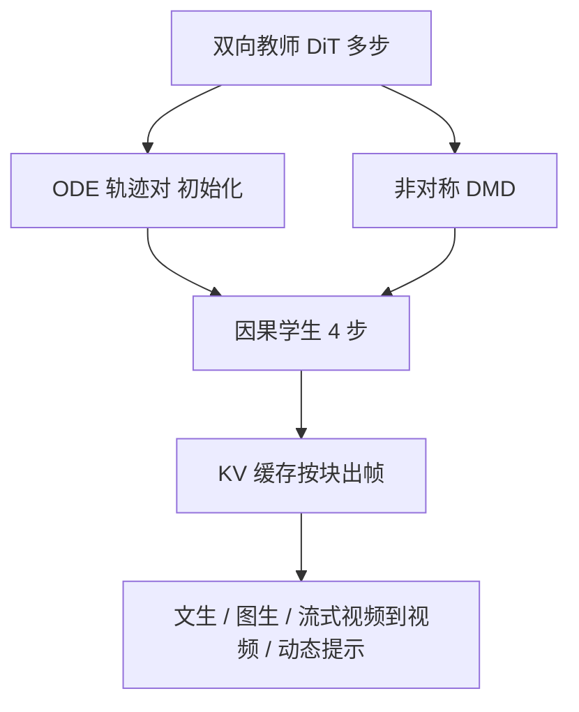

# CausVid：把双向视频扩散蒸成可流式输出的因果少步生成器

<!-- release-date: 2024-12-10 -->

**本文依据**：封面标题 `From Slow Bidirectional to Fast Causal Video Generators`（不是后来摘要页可能改过的名字），arXiv:2412.07772v1 [cs.CV]（2024-12-10），17 页 letter。作者 Tianwei Yin^{1}*、Qiang Zhang^{2}*（共同一作）、Richard Zhang^{2}、William T. Freeman^{1}、Frédo Durand^{1}、Eli Shechtman^{2}、Xun Huang^{2}；^{1} MIT，^{2} Adobe。封面项目页：`https://causvid.github.io/`。官方 abs：`https://arxiv.org/abs/2412.07772`。首发日取原件首次公开日，即 arXiv v1 提交日 **2024-12-10**。盘上 PDF 页眉写明 arXiv:2412.07772v1 [cs.CV] 10 Dec 2024。封面图 1：双向教师生成 128 帧视频延迟 219s；学生初始延迟 1.3s，随后约 9.4 FPS 流式出帧（PDF p. 1）。文中数字都标 PDF 页码；标「外部补充」的段落不来自本文。本文只读这一份 PDF，不把 DiT 骨干论文写成这篇的贡献。

## 一句话

当前视频扩散画得好，但自注意力是双向的：出一帧也要看整段，包括还没发生的未来。交互、流式、用户中途改条件，这条路走不通（PDF p. 1）。**CausVid** 把预训练的双向扩散 Transformer 改成按块因果的自回归生成器，再把 **分布匹配蒸馏（Distribution Matching Distillation，DMD）** 从图像扩到视频：把约 50 步的教师压成 4 步学生（PDF p. 1）。为了蒸得稳，先用教师 ODE 轨迹初始化学生，再用 **非对称蒸馏**：双向教师监督因果学生。误差累积被压住后，短 clip 训出来的模型可以滚长视频。单卡靠 KV 缓存做到约 9.4 FPS 流式；视频到视频、图生视频、动态换提示，摘要写成零样本就能做（PDF p. 1）。代码声明基于开源模型后续放出，本 PDF 没有仓库路径。

它解决的不是「再发明一种视频 DiT」，而是双向高质量与因果低延迟之间的那道墙：双向能画、不能边看边改；朴素自回归能边出边看，却容易一步错、步步错，也远不到交互帧率（PDF p. 2）。

## 一、矛盾：整段一起去噪，交互永远排在队尾

图 1 把对照画死：双向教师要等完整 128 帧，封面写 219 秒才给用户看第一眼；CausVid 先等 1.3 秒，然后约 9.4 FPS 往外推帧（PDF p. 1 图 1）。用户改提示、改画面条件，双向模型还在等未来帧，当前帧根本出不来（PDF p. 1–2）。

算力也不友好。帧数一长，注意力近似平方涨；再叠很多去噪步，长视频又慢又贵（PDF p. 2）。

自回归看起来对症：帧按时间出，第一帧出来就能看，长度也不锁死。但两条硬伤跟着来（PDF p. 2）：

1. **误差累积**。当前帧吃的是上一帧的生成结果，小错会放大。
2. **还是不够快**。当时已有的自回归视频模型，离交互帧率仍远。

CausVid 的结构像解码器大语言模型：训练时每一帧都能给监督；推理时用 KV 缓存，不必每步重算历史（PDF p. 2、p. 4）。速度再靠 DMD。朴素做法是先把双向模型微调成因果多步教师，再蒸成少步学生。作者说这条路弱：因果教师本身就比双向差，误差还会从教师传到学生（PDF p. 4、p. 7）。所以改成非对称：教师保持双向，学生锁因果。

图 2 把能力摊开：文生视频、图生视频、把简陋引擎画面修成写实的流式视频到视频、中途换提示接叙事（PDF p. 2 图 2）。图 3、图 4 是质量示意：作者主张自回归视频扩散可以扩到通用文生视频，质量跟双向接近，蒸馏后再加速几个数量级；图生视频是零样本，因为因果结构允许把首帧当已生成历史（PDF p. 3–4）。

上图是机制示意，根据 PDF 图 1、图 5 与第 4 节重画，不是实测时间轴。

贡献收成几条（PDF p. 1、p. 4）：

1. 预训练双向 Transformer → 在线出帧的因果 Transformer。
2. 视频上的 DMD：50 步 → 4 步。
3. 教师 ODE 初始化 + 非对称蒸馏，压自回归误差累积，短训长滚。
4. KV 缓存流式；视频到视频、图生视频、动态提示按摘要为零样本。

## 二、相关工作：自回归早就有，缺的是「蒸过的因果学生能跟双向比画质」

视频天生有时间序，早期用回归或 GAN 做帧预测；后来把帧离散成 token，用自回归 Transformer 一个一个吐——每帧上千 token，贵（PDF p. 5）。扩散起来之后，主流仍是双向；也有人用上下文帧去噪新帧，或给不同帧不同噪声档（含 Diffusion Forcing 一类），自回归只是「当前比过去更噪」的特例（PDF p. 5）。一批工作把图生或视频扩散改成条件在历史帧上。CausVid 跟这条近，差别是用蒸馏来适配，让自回归在画质上能跟双向打（PDF p. 5）。

长视频：重叠 clip、层次关键帧插值、滑窗。自回归天生变长，但会长滚发散。作者认为 **带双向教师的分布匹配目标** 意外地能压误差（PDF p. 5）。

蒸馏综述一串：逐步蒸馏、一致性、整流流、对抗损失。DMD 近似反向 KL 的梯度，写成数据分数与生成器分数之差；监督在分布层，教师学生架构可以不同——这正是「双向教师、因果学生」能成立的理由（PDF p. 5）。视频蒸馏已有逐步、一致性、对抗，但多半蒸短片（不到 2 秒），而且非因果蒸非因果。本文蒸成因果学生，训练 10 秒视频，滑窗可无限长滚（PDF p. 5）。系统级缓存与并行可以叠在蒸馏之上，PDF 不把它们当本文贡献（PDF p. 6）。

## 三、预备：视频扩散 + DMD，公式只借用来接蒸馏

扩散从 $x_T\sim\mathcal{N}$ 逐步去噪到 $x_0$。前向是

$$
x_t=\alpha_t x_0+\sigma_t\epsilon,\quad\epsilon\sim\mathcal{N}(0,I)
$$

$\alpha_t$、$\sigma_t$ 由噪声日程决定（PDF p. 6 式 1）。去噪器常预测噪声：

$$
L(\theta)=\mathbb{E}_{t,x_0,\epsilon}\lVert\epsilon_\theta(x_t,t)-\epsilon\rVert_2^2
$$

也可以预测 $x_0$ 或 v-prediction。它们都连到分数

$$
s_\theta(x_t,t)=\nabla_{x_t}\log p(x_t)=-\epsilon_\theta(x_t,t)/\sigma_t
$$

后文用 $s_\theta$ 统称扩散模型（PDF p. 6 式 2–3）。高维视频走潜扩散：3D VAE 压时空，去噪器可以是 U-Net 或 Transformer（PDF p. 6）。

DMD 要在随机时间步上，让平滑后的数据分布 $p_{\mathrm{data}}(x_t)$ 与学生输出分布 $p_{\mathrm{gen}}(x_t)$ 的反向 KL 变小。梯度近似成两个分数之差（PDF p. 6 式 4）：数据分数冻结自预训练扩散；生成器分数在学生输出上在线训；学生吃式 4 的梯度去对齐数据。DMD2 把单步扩到少步：输入不再是纯噪声 $\epsilon$，而是半干净的 $x_t$（PDF p. 6）。

## 四、方法：块因果骨干，再非对称蒸成 4 步

训练两段，对应图 5（PDF p. 7）：上半 ODE 初始化，下半非对称 DMD。

### 块因果：块内双向，块间不能看未来

视频先经 3D VAE。编码器按 chunk 独立压成更短的潜帧；解码器按潜 chunk 还原像素。因果扩散 Transformer 在潜空间按潜帧顺序生成（PDF p. 6）。注意力是 **块因果**：chunk 内部双向，抓住局部时间一致；chunk 之间因果，当前块不能看未来块（PDF p. 6–7）。延迟与全因果同类，因为 VAE 解码至少要一块潜帧才能出像素（PDF p. 7）。掩码写成（PDF p. 7 式 5）

$$
M_{i,j}=1\quad\text{当}\quad\lfloor j/k\rfloor\le\lfloor i/k\rfloor,\quad\text{否则 }0
$$

$i,j$ 是帧下标，$k$ 是 chunk 大小。骨干从 DiT 扩到自回归视频：自注意力加上块因果掩码，其余结构尽量不动，好接着双向预训练权重（PDF p. 7）。**这里用的是 DiT 这类架构，不是在重写 Peebles 与 Xie 那篇图像 DiT 论文。**

### 为什么不蒸因果教师

直觉流程：给双向 DiT 加因果掩码，用去噪损失微调。输入是 $N$ 帧、切成 $L$ 块，每块自己的噪声步 $t_i\sim[0,999]$，写法跟随 Diffusion Forcing。推理时一块一块去噪，条件是已经干净的历史块（PDF p. 7）。再把这个因果多步模型蒸成少步，理论上说得通。作者初期实验说结果差：因果扩散通常弱于双向，学生天花板被教师钉死，误差累积还会遗传（PDF p. 7–8）。于是教师用双向注意力，学生锁因果（算法 1，PDF p. 7）。

算法 1 要点（PDF p. 7）：少步时间表 $T=\{0,t_1,\ldots,t_Q\}$；学生先 ODE 回归初始化；生成器分数 $s_{\mathrm{gen}}$ 从 $s_{\mathrm{data}}$ 拷来。每步：采样视频切块；每块抽 $t_i$；加噪；学生预测干净块并拼回整段；再抽一个全局 $t$ 给学生预测加噪；用 $L_{\mathrm{DMD}}$ 更新学生；另抽噪声、用去噪损失更新 $s_{\mathrm{gen}}$。

### ODE 初始化：先学会走教师的轨迹

架构一变，直接上 DMD 会不稳。作者用教师造一小集 ODE 解对（PDF p. 8）：从高斯抽 $\{x_T^i\}$；用预训练双向教师的 ODE 求解器（文中引 DDIM 一类）模拟反向过程，得到整条轨迹；再只留下学生会用到的那几个 $t$。学生在这批对上做回归（PDF p. 8 式 6）

$$
L_{\mathrm{init}}=\mathbb{E}\bigl\lVert G_\phi(\{x_{t_i}^i\},\{t^i\})-\{x_0^i\}\bigr\rVert^2
$$

$G_\phi$ 从教师权重起步。作者强调：迭代少、轨迹对少，算力可接受（PDF p. 8）。

### 推理：KV 缓存之后，块因果掩码可以摘掉

算法 2（PDF p. 8）：帧分成 $L$ 块；缓存 $C$ 清空。对每一块从 $x_{t_Q}$ 高斯出发，从 $j=Q$ 降到 $1$，每步用缓存做 $G_\phi$，再按日程写成更干净的 $x_{t_{j-1}}$。一块干净之后，用 $G_\phi(x_0,0)$ 前向一次写出 KV，追加进 $C$。因为有缓存，推理不再需要块因果掩码，可以走更快的双向注意力实现（PDF p. 8）。

## 五、实验配方：教师像 CogVideoX，学生 4 步、每块 5 潜帧

教师是双向 DiT，架构类似 CogVideoX；潜空间由 3D VAE 提供：16 视频帧 → 一块 5 潜帧。训练 10 秒、分辨率 $352\times 640$、12 FPS（PDF p. 8）。学生除因果注意力外与教师同构：token 只看同块与更早块；每块 5 潜帧；推理每块 4 步，时间步均匀取 $[999,748,502,247]$。训练注意力用 FlexAttention（PDF p. 8）。

数据跟随 CogVideoX 的图+视频混合；安全与美学分过滤。视频裁到 $352\times 640$。约 40 万单镜头视频，内部数据集、作者称有完整版权（PDF p. 8）。先造 1000 对 ODE，AdamW、学习率 $5\times 10^{-6}$，训 3000 步；再非对称 DMD，学习率 $2\times 10^{-6}$，6000 步；引导尺度 3.5；DMD2 的双时间尺度更新比 5。全程约 2 天、64 张 H100（PDF p. 8）。

评测主表用 VBench。主文取 MovieGen 前 128 条提示，报 VBench 竞赛套件里三项：时间质量、帧质量、文本对齐。全部 946 提示、16 指标在附录。计时在 H100（PDF p. 8–9）。

## 六、结果：短片三项全高，长片不塌，延迟掉两个数量级

**短视频（约 5–10 秒）。** 对照 CogVideoX、OpenSORA、Pyramid Flow、MovieGen。表 1：CausVid 时间质量 94.7、帧质量 64.4、文本对齐 30.1，三项都最高；长度取各方法最接近 10 秒的官方设定（PDF p. 9 表 1）。附录 VBench-Long 总分 82.85，作者写超过 CogVideoX、OpenSORA、Mira，以及专有系统 Kling、Gen-3（PDF p. 9；表 7 在 PDF p. 17）。

**人评。** MovieGenBench 前 29 条提示，Prolific 平台；每对模型每条提示 3 人，每对共 87 票。比画质与语义。种子固定 0。图 6：相对 MovieGen、CogVideoX、Pyramid Flow 更常被选中；蒸馏学生相对双向教师整体相当，延迟低几个数量级。图注写偏好分大于 50%（PDF p. 9 图 6）。界面示例在图 10（PDF p. 17）。

**长视频约 30 秒。** 对照 Gen-L-Video、FreeNoise、StreamingT2V、FIFO-Diffusion、Pyramid Flow。滑窗：上一段 10 秒的末帧当下一段上下文；Pyramid Flow 长视频也用同一策略。表 2：时间 94.9、帧 63.4，两项最高；文本对齐 28.9，与 FIFO 的 29.9 接近、高于其余（PDF p. 9 表 2）。图 7：30 秒内成像质量曲线，蒸馏模型与 FIFO 最能稳住；因果教师约 20 秒处突然升高，作者归因于滑窗切换的暂时回光（PDF p. 10 图 7）。多数自回归基线会随时间掉画质。

**延迟与吞吐。** 表 3 测 10 秒、120 帧、$640\times 352$（与封面 128 帧不是同一设定）。总时间含文本编码器、扩散、VAE 解码。CogVideoX-5B：延迟 208.6s、0.6 FPS；Pyramid Flow：6.7s、2.5 FPS；双向教师：219.2s、0.6 FPS；CausVid：1.3s、9.4 FPS（PDF p. 9 表 3）。相对同规模 CogVideoX，正文写延迟降约 160 倍、吞吐升约 16 倍（PDF p. 9）。封面 219s / 1.3s / 9.4 FPS 与表 3 教师 219.2、学生 1.3 / 9.4 对齐，帧数差在 128 对 120。

## 七、消融：少步 + 双向教师 + ODE 初始化，三件都要

表 4 全是 10 秒视频（PDF p. 10）。

不上少步蒸馏、只把双向 DiT 微调成因果多步：双向教师 100 次前向，时间 94.6 / 帧 62.7 / 文本 29.6；因果多步 100 次前向，92.4 / 60.1 / 28.5。因果基线明显弱，图 7 橙色线随时间塌（PDF p. 10）。

蒸馏半边：同样 ODE 初始化时，双向教师 4 步是 94.7 / 64.4 / 30.1（最终配置）；因果教师 4 步是 91.9 / 61.7 / 28.2；教师标 None（只拟合 ODE、不再 DMD）是 92.9 / 48.1 / 25.3，帧质量崩。无 ODE、直接双向教师 4 步是 93.4 / 60.6 / 29.4，低于最终行。图 7：因果教师的误差传给学生（绿）；非对称 DMD + 双向教师（蓝）比多步因果扩散好得多（PDF p. 10）。学生相对双向教师，逐帧质量更好，时间闪烁与多样性更差，细节放到附录（PDF p. 10）。

## 八、应用：按 PDF 写，不要加成「训过的专用头」

**流式视频到视频。** 输入可以无限长。做法借 SDEdit：对每个输入块注入对应 $t_1$ 的噪声，再按文本一步去噪（PDF p. 10）。对照 StreamV2V（图像扩散上的流式编辑）。从 StreamV2V 用户研究的 67 对（源 DAVIS）里选出至少 16 帧的 60 条；两边都不做概念微调。表 5：CausVid 时间 93.2 / 帧 61.7 / 文本 27.7，对 StreamV2V 的 92.5 / 59.3 / 26.9（PDF p. 10 表 5）。作者把时间一致性归到视频先验。

**图生视频。** 无额外训练。把首图复制成第一段帧，再自回归往后滚。对照能出 6–10 秒的 CogVideoX 与 Pyramid Flow，评 VBench-I2V。表 6：CausVid 时间 92.0 / 帧 65.0 / 文本 28.9；CogVideoX-5B 为 6 秒视频 87.0 / 64.9 / 28.9；Pyramid Flow 10 秒 88.4 / 60.3 / 27.6（PDF p. 11 表 6）。作者认为动态质量提升明显，并猜测少量图生视频指令微调还能再抬，但本文没做。

**动态提示。** 图 2 第四行：用户可在视频任意点输入新提示，接动作与场景（PDF p. 2）。摘要把动态提示与流式视频到视频、图生视频并列，写成零样本（PDF p. 1）。主文第 5.3 节定量只给了视频到视频和图生视频；动态提示没有单独一张表。

## 九、附录数字与限制

表 7 是 VBench-Long 全 16 项（PDF p. 17）。CausVid 总分 82.85、质量分 83.71、语义分 79.40。作者在附录 A 点名领先的维度：动态程度 82.20、美学 66.49、成像 70.20、物体类 93.70、多物体 74.68、人类动作 99.80。闪烁 93.85，低于表里多数双向或专有系统（常在 98–99），与正文「时间闪烁更差」一致。双向教师总分 82.10，动态程度 92.22 更高，主体一致性 90.26 低于 CausVid 的 93.33（PDF p. 17 表 7）。雷达图 8 是同一套指标的可视化（PDF p. 16）。图 9 是与教师的定性对照，更多样本指向项目页（PDF p. 16）。

讨论与附录限制（PDF p. 11、p. 16）：

1. 30 秒仍可用，极长会掉；更有效的误差累积策略是未来工作。
2. 延迟已低几个数量级，但仍受 VAE 约束：必须凑齐 5 潜帧才出像素。换成更高效的逐帧 VAE，作者认为延迟还能再降一个数量级。
3. 相邻段常有不连续。解码时加时间重叠、或在 VAE 里加块间因果依赖，是他们点名的方向。
4. DMD 是反向 KL 匹配，多样性略降。未来可试 EM-Distillation、Score Implicit Matching。
5. 滑窗丢掉 10 秒以外的上下文，物体再出现会对不上；附录建议对精选长视频做监督微调，类比 LLM 加长上下文，本文没做。
6. 块边界不连续，部分来自 VAE 单块、块间无依赖；双向教师闪烁也没好到哪去，说明不全是因果学生的锅（PDF p. 16）。
7. 实现约 10 FPS。编译、量化、并行是工程优化，PDF 写成有可能到实时，没有实测。应用想象写了机器人学习、游戏渲染、流式编辑，都是展望不是实验。

没写的：开源权重与训练代码（只承诺未来基于开源模型放）；内部 40 万视频的具体来源表；学生相对教师在闪烁、多样性上的逐项附录细表（正文说有，本 17 页 PDF 的表 7 能看到闪烁，多样性没有单独列）。

## 十、可迁移的几条，以及不要迁移的

可直接借的是设计原则，不是这套 64×H100 配方：

- **教师可以比学生「看得更全」。** 蒸馏目标若在分布层（DMD），架构不必对称。弱因果教师会把误差写进学生。
- **先对齐轨迹，再对齐分布。** ODE 回归便宜，能把跨架构 DMD 从炸掉拉回可训。
- **块因果迁就解码器粒度。** 延迟下限往往在 VAE chunk，不在注意力掩码。推理有 KV 之后，训练用的块掩码可以摘掉换更快核。
- **因果一旦成立，条件任务可以零样本接。** 首帧当历史就是图生；输入块加噪再一步去噪就是流式编辑；中途换文本就是动态提示。定量证明密度不同，不要把图 2 示意当成表 1 那种全面评测。

不要直接抄走的：40 万内部视频、352×640 / 12 FPS / 每块 5 潜帧、4 步时间表 $[999,748,502,247]$、引导 3.5。换一套 VAE 或分辨率，这些超参都要重找。反向 KL 换多样性也不是免费的。

## 关键词回看

**双向视频扩散**：去噪时每帧看全序列，画质高、首帧延迟等于整段时间。**因果 / 块因果**：当前块不看未来块；块内仍可双向。**DMD**：用两个分数之差匹配数据与学生分布，允许教师学生结构不同。**非对称蒸馏**：双向教师监督因果学生。**ODE 初始化**：用教师求解器轨迹当回归数据。**KV 缓存**：历史块的键值留下，新块只算自己。**零样本图生 / 流式视频到视频 / 动态提示**：靠因果接口接条件，主文定量覆盖前两项。

## 参考

- 原件：盘上 `readings/_src/图像、视频与 3D 生成/CausVid.pdf`，arXiv:2412.07772v1，2024-12-10。
- 项目页（封面）：`https://causvid.github.io/`。
- 官方 abs：`https://arxiv.org/abs/2412.07772`。
