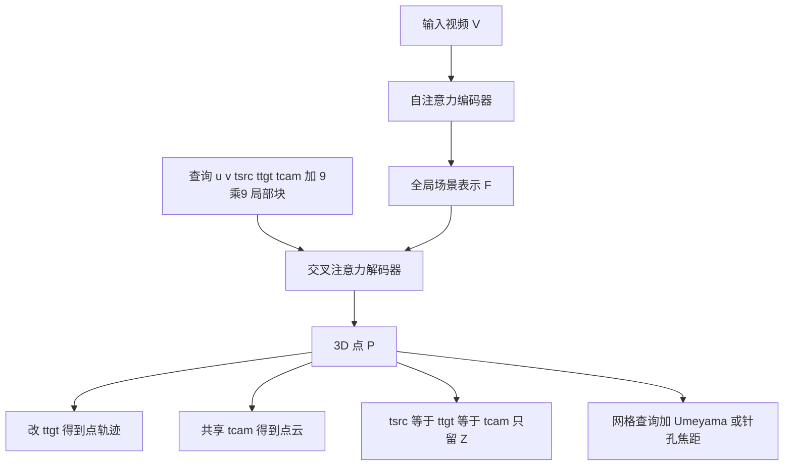

# D4RT：一次查询任意时空点的 3D 位置，把深度、对应和相机收进同一套前馈接口

<!-- release-date: 2025-12-09 -->

**本文依据**：封面标题 `Efficiently Reconstructing Dynamic Scenes One D4RT at a Time`，arXiv:2512.08924v2 [cs.CV]（2025-12-10），17 页 letter。作者 Chuhan Zhang、Guillaume Le Moing、Skanda Koppula（共同一作）、Ignacio Rocco、Liliane Momeni、Junyu Xie（实习于 Google DeepMind）、Shuyang Sun、Rahul Sukthankar、Joëlle K. Barral、Raia Hadsell、Zoubin Ghahramani、Andrew Zisserman、Junlin Zhang、Mehdi S. M. Sajjadi（通讯，`d4rt@msajjadi.com`）。机构：Google DeepMind、University College London、University of Oxford；第一作者归属 **Google DeepMind**。封面项目页：`https://d4rt-paper.github.io/`。官方 abs：`https://arxiv.org/abs/2512.08924`。首发日取原件首次公开日，即 arXiv v1 提交日 **2025-12-09**。盘上 PDF 页眉写明 arXiv:2512.08924v2 [cs.CV] 10 Dec 2025。封面与全文抽取均未印会议名。文中数字都标 PDF 页码。本文只读这一份 PDF。

## 一句话

动态场景要从一段视频同时弄清几何、运动和相机。旧路要么把单目深度、度量深度、运动分割拆成一堆现成模型再做测试时优化（MegaSaM），要么前馈网络仍按帧做稠密解码、再为深度、位姿、点云各挂一个头（VGGT 一类）。动态区域的对应往往还要另开一条跟踪管线，SpatialTrackerV2 能跟动态，却靠多阶段迭代，没有单阶段统一接口（PDF p. 1）。**D4RT**（Dynamic 4D Reconstruction and Tracking）用统一 Transformer：编码器先把整段视频压成一份固定的 **全局场景表示** $F$，解码器再用查询去探测任意点在任意时刻、任意相机坐标系下的 3D 位置，而不是逐帧稠密解码、也不是为每个任务单独挂解码器（PDF p. 1–2）。查询独立、可并行，训练只需抽样监督，推理可按任务改查询组合。作者报告在 4D 重建与跟踪上达到当时最优，位姿吞吐超过 200 FPS，比 VGGT 快 9 倍、比 MegaSaM 快 100 倍（PDF p. 1、p. 4 图 3）。

它解决的不是「再做一个更准的深度网络」，而是：**动态 4D 该不该继续按任务拆解码器、按帧把整张图画完。**

## 一、矛盾：传统 3D 问「所有地方的几何一次给齐」，动态世界吃不消

引言把旧问题写成一句：传统 3D 重建问的是「所有地方、所有东西、同一时刻的几何是什么」。作者认为这种穷尽、刚性的问法对动态世界根本不合适（PDF p. 1）。需求明明是统一的 4D 理解，主流却仍切成任务专用模块。

三条旧路（PDF p. 1）：

1. **拼装再优化**。MegaSaM 用现成模型分别估单目深度、度量深度和运动分割，再靠昂贵的测试时优化把信号粘成几何一致。
2. **前馈但仍按帧、按任务头**。VGGT 一类用 Transformer 从图像直接出几何，却给不同模态挂独立专用解码器；动态部分的对应仍建不起来。
3. **能跟动态，却不是单阶段**。SpatialTrackerV2 引入动态，但仍靠代价高的迭代精修，没有统一单阶段公式。

D4RT 把范式从「碎片化的帧级解码」改成「按需查询」。视频先进编码器得到 $F$，再对任意数量的时空点查询独立解码（PDF p. 1 图 1）。贡献按原文四条（PDF p. 2）：

- 对视频里捕获的点级 4D 信息做高效前馈查询。
- 同一接口给出 4D 对应、点云、深度图和相机参数，静态动态都覆盖。
- 实验上动态 4D 重建与跟踪达新 SOTA，速度和精度都超过已有方法。
- 灵活解码器解锁「跟踪视频里所有像素」的高效算法，做稠密整体场景重建。

上图是机制示意，根据 PDF 图 1–2（p. 1–2）与表 1（p. 3）重画，不是实测时间轴。

## 二、查询接口：五个量决定「这个 2D 点，到那个时刻，在哪台相机里」

架构灵感来自 Scene Representation Transformer（PDF p. 2）。视频 $V\in\mathbb{R}^{T\times H\times W\times 3}$ 经编码器

$$
F=E(V)\in\mathbb{R}^{N\times C}
$$

$F$ 算完就固定。解码器 $D$ 用交叉注意力从任意查询打进 $F$。一条查询是

$$
q=(u,v,t_{\mathrm{src}},t_{\mathrm{tgt}},t_{\mathrm{cam}})
$$

$(u,v)\in[0,1]^2$ 是源帧 $t_{\mathrm{src}}$ 上的归一化 2D 坐标；$t_{\mathrm{tgt}}$、$t_{\mathrm{cam}}\in\{1,\ldots,T\}$ 分别是目标时刻和参考相机坐标系的时间下标（PDF p. 2 图 2）。输出

$$
P=D(q,F)\in\mathbb{R}^3
$$

作者强调三个性质（PDF p. 2）：

1. **下标不必重合**，空间和时间可以拆开：源点、目标时刻、相机参考可以各选各的。
2. **每条查询独立解码**，训练和推理都省，稀疏稠密都能做。
3. **同一接口接下游任务**，不必为每个任务再训一个头。

表 1 把任务写成查询的笛卡尔积（PDF p. 3）：

| 任务 | $u,v$ | $t_{\mathrm{src}}$ | $t_{\mathrm{tgt}}$ | $t_{\mathrm{cam}}$ |
|---|---|---|---|---|
| 点轨迹 | 固定 | 固定 | $1\ldots T$ | 与 $t_{\mathrm{tgt}}$ 同步扫 |
| 点云 | 全像素 | $1\ldots T$ | （随源） | 固定共享参考 |
| 深度图 | 全像素 | $1\ldots T$ | 等于源与相机 | 等于源 |
| 外参 | 粗网格 $h\times w$ | 固定 | 固定 | $1\ldots T$ |
| 内参 | 粗网格 $h\times w$ | （随查询） | $1\ldots T$ | （随查询） |

点轨迹：固定源点，扫 $t_{\mathrm{tgt}}=t_{\mathrm{cam}}=1\ldots T$。点云：所有像素直接预测到共享 $t_{\mathrm{cam}}$，不必先估相机再做坐标变换。深度：令 $t_{\mathrm{src}}=t_{\mathrm{tgt}}=t_{\mathrm{cam}}$，只留 $P$ 的 $Z$（PDF p. 2）。

**外参**。任意两帧 $i,j$ 上，在 $(h,w)$ 网格上采源点，构造

$$
q_{i,k}=(u_k,v_k,i,i,i),\quad q_{j,k}=(u_k,v_k,i,i,j)
$$

两组 $P$ 描述同一批 3D 点在不同参考系里，用 Umeyama 算法做 $3\times 3$ SVD 求刚体变换（PDF p. 3）。

**内参**。同样在网格上解码 $P=(p_x,p_y,p_z)$，假定针孔、主点 $(0.5,0.5)$：

$$
f_x=p_z(u-0.5)/p_x,\quad f_y=p_z(v-0.5)/p_y
$$

对 $k$ 个估计取中位数。带畸变（如鱼眼）可在初估上再加非线性精修（PDF p. 3）。内参外参都只查粗网格，为了更快（PDF p. 3 表 1 注）。

对人来说，这套接口的迁移点很硬：**任务差异尽量下放到查询组合，而不是下放到网络头。** 头一多，训练信号互相抢，推理还要全开。

## 三、编码器大、解码器小：查询之间故意不通消息

编码器是 Vision Transformer，层间交错 **帧内局部自注意力** 与 **全局自注意力**，写法跟 VGGT 一类（PDF p. 3）。为简单、并支持任意长宽比，视频先缩成固定正方形再分词；原始长宽比另做成一个 token 送进 Transformer（PDF p. 3）。主实验编码器是 ViT-g，40 层，时空 patch $2\times 16\times 16$，约 10 亿参数；解码器 8 层交叉注意力，约 1.44 亿参数（PDF p. 5）。

查询 token 的拼法（PDF p. 3、图 2）：$(u,v)$ 的 Fourier 特征，加上 $t_{\mathrm{src}}$、$t_{\mathrm{tgt}}$、$t_{\mathrm{cam}}$ 的可学习离散时间嵌入。作者还观察到：在 $(u,v)$ 为中心拼上 **$9\times 9$ 局部 RGB 块** 的嵌入，性能会大幅提升（PDF p. 3，消融见第 4.4 节）。交叉注意力之后，线性投影出 $P$。

查询之间 **不做自注意力**。这是刻意设计：训练时只需解一小批查询就能给整网监督；推理时查询可以跨帧任意选，不必互相相关来躲分布外；早期实验打开查询间自注意力，性能会明显掉（PDF p. 3）。并行也因此几乎是平凡的。图 3 与表 3 用来支撑「多任务上精度和延迟的折中最好」（PDF p. 3–4）。

附录图 7 把输出摊成 13 维：XYZ（3）、图像平面 UV（2）、可见性（1）、运动位移（3）、法向（3）、置信度（1）（PDF p. 12）。主文训练只强调 3D 位置是主损失，其余是辅助头（PDF p. 3）。

## 四、训练：归一化 3D 的 L1，再加一串只在有真值处生效的辅助项

实现写在 Kauldron。端到端最小化一批 $N$ 条采样查询上的加权损失（PDF p. 3）。主信号是归一化 3D 点的 L1：预测与真值各自用平均深度归一化（DUSt3R 同款），再过

$$
\mathrm{sign}(x)\cdot\log(1+|x|)
$$

压远点对损失的权重（PDF p. 3）。辅助项：图像平面 2D 坐标 L1；3D 法向余弦相似度；目标点可见性的二元交叉熵；运动向量 L1。各项 **只在有真值的地方算**。再加置信度惩罚 $-\log(c)$，$c$ 同时给 3D 点误差加权（PDF p. 3–4）。

附录把合成损失写成（PDF p. 12）

$$
L=\frac{1}{N}\sum_{i=1}^{N}\Bigl(c\lambda_{3\mathrm{D}}L_{3\mathrm{D}}-\lambda_{\mathrm{conf}}\log c+\lambda_{2\mathrm{D}}L_{2\mathrm{D}}+\lambda_{\mathrm{vis}}L_{\mathrm{vis}}+\lambda_{\mathrm{disp}}L_{\mathrm{disp}}+\lambda_{\mathrm{conf}}L_{\mathrm{conf}}+\lambda_{\mathrm{normal}}L_{\mathrm{normal}}\Bigr)_i
$$

权重：$\lambda_{3\mathrm{D}}=1.0$，$\lambda_{2\mathrm{D}}=0.1$，$\lambda_{\mathrm{vis}}=0.1$，$\lambda_{\mathrm{disp}}=0.1$，$\lambda_{\mathrm{conf}}=0.2$，$\lambda_{\mathrm{normal}}=0.5$；原文把 $\lambda_{\mathrm{conf}}=0.2$ 写了两遍（PDF p. 12）。AdamW，权重衰减 $0.03$；学习率 2500 步升到 $10^{-4}$，余弦降到 $10^{-6}$；梯度 L2 范数裁到 10（PDF p. 12）。

数据增强（PDF p. 12）：时间一致的亮度、饱和、对比、色相；概率 0.2 的随机去色；概率 0.4 的高斯模糊；随机裁切尺度比 0.3–1.0，对数域均匀采样长宽比；裁切时概率 0.05 随机放大；时间维对整段视频随机步长抽帧。

查询采样来自真值点轨迹。为盯难区域，沿 $u,v$ 的 **30%** 采样靠近深度不连续或运动边界（深度图上 Sobel 预计算）。$t_{\mathrm{src}}$、$t_{\mathrm{tgt}}$、$t_{\mathrm{cam}}$ 均匀随机，但以概率 **0.4** 强制 $t_{\mathrm{tgt}}=t_{\mathrm{cam}}$，作者说这对下游更好（PDF p. 12）。

主实验训练混合：公开加内部，点名 BlendedMVS、Co3Dv2、Dynamic Replica、Kubric、MVS-Synth、PointOdyssey、ScanNet++、ScanNet、TartanAir、VirtualKitti、Waymo Open（PDF p. 5）。48 帧 clip、$256\times 256$，每步解 2048 条随机查询并在特定区域过采样。500k 步，AdamW，64 块 TPU 上 local batch size 1，稍多于 2 天（PDF p. 5）。消融默认改成 ViT-L、6 层解码器、300k 步、batch size 16（PDF p. 7）。

内部数据的配比、各公开集权重，本 PDF 没写。这是训练侧最大的未公开缺口。

## 五、稠密跟踪：别对所有像素做 $O(T^2 HW)$ 次查询

naive 给视频里每个像素建整段轨迹，查询数是 $O(T^2 HW)$，多数浪费（PDF p. 4）。算法 1 用占用网格 $G\in\{0,1\}^{T\times H\times W}$：只从未访问像素发起新轨迹；一条整视频轨迹把它可见经过的时空像素标成已访问（PDF p. 3 算法 1）。经验加速 **5–15 倍**，随运动复杂度变（PDF p. 4）。这套策略能用，正因为解码器又稀疏又轻。作者点名三类旧方法不适合：多数对动态部分根本不给对应（MegaSaM、VGGT、$\pi^3$）；稠密帧级解码仍锁在 naive 代价（St4RTrack）；重稀疏解码器每条查询都贵（CoTracker3、SpatialTrackerV2）（PDF p. 4）。

图 4 把定性差距钉死：纯重建把天鹅走位叠成重影，$\pi^3$ 花都建不出来；SpatialTrackerV2 能跟动态，但只能从一帧出点，天鹅和火车背后留下洞。D4RT 声称是唯一把视频全部像素收进完整 4D 表示的方法（PDF p. 5 图 4）。野外视频图 5：静态行出重建，动态行再加点轨迹（PDF p. 6）。

## 六、相关工作：前馈 3D 缺动态对应，3D 跟踪缺统一头

经典 SfM / MVS / COLMAP 几何一致、可解释，但贵且脆（PDF p. 4）。

前馈 3D：DUSt3R 对无位姿无标定图像对端到端重建；VGGT 用带全局注意力的 ViT 扩到多图。后续扩到动态视频和更快推理，但仍有共性限制：不少不支持视频内改内参；若干只能用第一帧当相机参考；VGGT 风格要么每任务一个解码头，要么 4D 子任务各用一个模型；动态区域对应仍然直接给不了（PDF p. 4）。

2D 到 3D 跟踪：从 Particle Video 到稠密逐像素跟踪，再靠深度和内参把 2D 轨迹抬到 3D。SpatialTracker、L4P、DPM、St4RTracker 开始直接预测 3D 轨迹。St4RTracker 与 DPM 仍是 DUSt3R 式成对，做不了整段整体处理；SpatialTrackerV2 多阶段、靠迭代、慢；L4P 对同一类量（光流对 2D 跟踪、深度对 3D 跟踪）还要不同头。D4RT 把这些收进同一架构。表 2 按能力打勾：3D 重建、动态对应、灵活参考帧、稀疏解码、全局上下文、单一解码器——作者给自己全勾，对照方法都缺至少一项（PDF p. 4 表 2）。

## 七、实验：跟踪、深度、点云、位姿，再加吞吐

评测顺序：先看图 4 能力差，再 4.2 节 4D 重建与跟踪，再 4.3 节纯重建，最后 4.4 消融（PDF p. 5）。

### 4D 跟踪（TAPVid-3D）

三份真实子集：DriveTrack、ADT、PStudio。相机坐标系跟踪报 AJ、APD3D、OA；世界坐标系跟踪（测隐式换参考系）报 APD3D 与 L1。PStudio 无相机运动，世界坐标任务与相机坐标实质相同，故省略（PDF p. 6）。

表 4 无 GT 内参时，D4RT 相机坐标：DriveTrack AJ **0.257** / APD3D **0.345** / OA **0.875**；ADT AJ **0.240**（低于 SpatialTrackerV2 的 0.260）；PStudio AJ **0.138**。世界坐标 DriveTrack APD3D **0.373**、L1 **0.020**；ADT APD3D **0.319**、L1 **0.096**（PDF p. 6 表 4）。有 GT 内参时 D4RT 相机坐标 DriveTrack AJ **0.304**、ADT AJ **0.307**、PStudio AJ **0.372**；世界坐标 DriveTrack APD3D **0.470**、L1 **0.017**（PDF p. 6）。作者写「相对先前 SOTA 更优」；同一张表里无 GT 内参的 ADT AJ，SpatialTrackerV2 仍高一点，正文没有单独解释这一格。

吞吐表 3（单卡 A100，整视频 3D 轨迹条数，D4RT 每条轨迹是 $T$ 条独立查询）（PDF p. 5）：

| 方法 | 60 FPS | 24 FPS | 10 FPS | 1 FPS |
|---|---|---|---|---|
| DELTA | 0 | 5 | 408 | 5,770 |
| SpatialTrackerV2 | 29 | 84 | 219 | 2,290 |
| D4RT | **550** | **1,570** | **3,890** | **40,180** |

作者写比别人快 **18–300 倍**（PDF p. 5、p. 7）。

### 点云、视频深度、相机

点云：Sintel 与 ScanNet，先按 MegaSaM 口径做均值平移对齐，再报平均 L1。D4RT：Sintel **0.768**、ScanNet **0.028**，表 5 左列均为最低（PDF p. 7 表 5）。

深度：Sintel、ScanNet、KITTI、Bonn；尺度对齐（S）与尺度加平移（SS）后算 AbsRel。D4RT 在 Sintel S/SS 为 **0.171 / 0.148**；ScanNet **0.020 / 0.018**；KITTI **0.055 / 0.051**（与 $\pi^3$ 的 0.055 / 0.053 接近）；Bonn **0.036 / 0.036**，略差于 $\pi^3$ 的 0.033 / 0.032（PDF p. 7 表 5）。作者强调 Sintel 最难、动态最强，D4RT 在那里领先最明显。

位姿：Sintel 用带运动模糊与大气效果的 14 序列子集；Sim(3) 对齐后报 ATE、RPE-T、RPE-R，以及 Pose AUC@30。D4RT：Sintel ATE **0.065**、RPE-T **0.024**、RPE-R **0.126**；ScanNet ATE **0.014**、RPE-T **0.010**、RPE-R **0.302**；Re10K Pose AUC **83.5**（PDF p. 7 表 6）。图 3：位姿精度定义为 $1-$ 误差，在 Sintel 与 ScanNet 上对 ATE/RTE/RPE 平均；A100 上 D4RT **200+ FPS**，比 VGGT 快 9 倍、比 MegaSaM 快 100 倍。比公平起见，基线去掉与相机无关的解码头后再测速度（PDF p. 4 图 3、p. 7）。

## 八、消融：局部 RGB 块、骨干、辅助损失

除非另说，消融用 ViT-L、6 层解码器、300k、batch 16，Sintel 上深度和位姿（PDF p. 7）。

**局部 RGB 块**（表 7）：无块 AbsRel(S) **0.366**、ATE **0.173**；有块 **0.302**、**0.091**（PDF p. 8）。图 6：有块的深度边界更锐。作者给两条原因：局部外观帮查询对上时空特征；低层线索帮把物体从背景切开。相对 DPT 那种编解码 skip，他们说这更简单。附录 C 再说明块还能解锁亚像素精度（PDF p. 8）。

**辅助损失**（表 8，相对完整 D4RT 的增量）：去掉 2D 位置，AbsRel(S) $+0.071$；去掉法向 $+0.043$；去掉位移深度略升、位姿也略升；去掉可见性深度略好、位姿变差；去掉置信度 ATE $+0.126$（PDF p. 8 表 8）。深度和位姿有轻微互斥，作者仍认为全部辅助项对总体有帮助。

**骨干**（表 9，Sintel）：ViT-B AbsRel(S) **0.319**、ATE **0.145**；ViT-L **0.256**、**0.073**；ViT-H **0.226**、**0.070**；ViT-g **0.191**、ATE **0.078**（ATE 相对 ViT-H 略回升），RPE-R 从 ViT-B 的 0.266 降到 ViT-g 的 **0.160**（PDF p. 8）。参数量：ViT-B 90M 到 ViT-g 1B（PDF p. 8）。

## 九、附录：长视频拼块、高分辨率查询、预训练与块大小

**长视频**（附录 B）。视频切成重叠段，重叠区取置信度最高的 **85%** 点，用 Umeyama 估 Sim(3) 对齐。类似 VGGT-Long 的第一阶段，但故意不做闭环检测和全局优化，为了看重建模型的生精度（PDF p. 13）。KITTI sequence 00 约 1000 帧：图 8 上例 ATE VGGT **58.7 m**、$\pi^3$ **35.6 m**、D4RT **15.5 m**；下例 VGGT **36 m**、$\pi^3$ **15.8 m**、D4RT **16.3 m**（与 $\pi^3$ 相当）（PDF p. 13 图 8）。

**高分辨率解码**（附录 C）。$(u,v)$ 在连续 $[0,1]^2$ 上，解码分辨率可以与 $F$ 的分辨率脱钩。表 10 固定 ViT-g 编码 $256\times 256$，用 Pseudo Depth Boundary Error $\epsilon^{\mathrm{acc}}_{\mathrm{PDBE}}$。配置 1 无 RGB 块、输出 256：AbsRel 0.254、PDBE 3.323；配置 2 加 256 分辨率块：0.218 / 2.254；配置 3 输出原分辨率但块仍 256：0.217 / 2.266；配置 4 块也从原分辨率源帧取：AbsRel 0.220，PDBE **2.193**（尺度对齐）。作者说配置 4 边更锐，头发丝一类细节回来，且不增加整体模型的算力和显存需求（PDF p. 14 表 10、图 9）。

**VideoMAE 初始化**（表 11）：随机初始化 AbsRel(S) **0.738**、ATE **0.334**；VideoMAE **0.302**、**0.091**（PDF p. 15）。

**RGB 块大小**（图 10）：Sintel 上深度与位姿平均误差，**$9\times 9$ 到 $12\times 12$** 最好，主文取 9（PDF p. 15）。

附录 E 图 11–13 是更多静态/动态重建、跨方法点云与深度定性图，主张大运动模糊下几何仍更细（PDF p. 16–17）。

## 十、限制与没写清的地方

结论没有单独的 Limitations 节。正文承认的边界包括：查询间自注意力会掉点，所以不做（PDF p. 3）；稠密全像素 naive 查询不可行，要靠占用网格（PDF p. 4）；长视频拼块不做闭环，KITTI 第二例并未全面超过 $\pi^3$（PDF p. 13）；表 4 无 GT 内参的 ADT AJ 未超过 SpatialTrackerV2；表 5 Bonn 深度略逊 $\pi^3$。训练混合含内部数据，公开集如何加权、内部数据是什么，PDF 没给。代码仓库路径本 PDF 未印，只给项目页。鱼眼非线性精修只点到文献，没有本方法的实验。

## 十一、可迁移启发

1. **把「任务头」收成「查询语言」**。深度、轨迹、点云、相机差在五个下标怎么取，而不是差在三个解码器。多任务几何系统可以先问：能否用同一 $P\in\mathbb{R}^3$ 加查询组合覆盖。
2. **编码器一次、解码器按需**。$F$ 固定后，训练只解 2048 条查询，推理只解用户要的点。对贵编码器、便宜询问的设定可直接搬。
3. **查询独立是能力也是约束**。并行和任意抽样是收益；查询间不说话，所以早期实验加自注意力会坏。若任务强依赖点与点关系，这条路可能不够。
4. **局部外观补全局 token**。$9\times 9$ 块比 DPT skip 简单，却同时抬对应和锐度；高分辨率细节可以只加在查询侧的 RGB 块，不必把整网编码分辨率拉上去。
5. **稠密输出用占用网格吃冗余**。轨迹一旦可见经过某像素，就别再从那里开新轨。任何「全像素、长时间」的点级模型都可以先估 5–15 倍这种自适应加速，而不是一上来 $O(T^2 HW)$。
6. **相机不必是网络头**。外参是两套点云的 Umeyama，内参是针孔中位数。几何后处理可以很薄，前提是 $P$ 已经在共享 3D 里一致。
7. **辅助损失按下游选**。2D 与法向偏深度，置信度偏位姿，可见性对深度甚至略负。迁移时按你真正要的指标做减法，不要默认全开。

## 关键词回看

- **D4RT**：一段视频进统一 Transformer，查询任意时空点的 3D 位置，同时得到深度、对应和相机。
- **全局场景表示 $F$**：编码器一次算出、解码期间冻结的视频潜表示。
- **查询 $q=(u,v,t_{\mathrm{src}},t_{\mathrm{tgt}},t_{\mathrm{cam}})$**：源像素、目标时刻、相机参考；下标可拆开。
- **独立交叉注意力解码**：查询互不看，换来抽样训练与平凡并行。
- **局部 $9\times 9$ RGB 块**：补低层外观，锐化边界，并支持亚像素查询。
- **占用网格稠密跟踪**：未访问像素才开新轨，经验 5–15 倍加速。
- **Umeyama 外参 / 针孔中位数内参**：从同一套 $P$ 反推相机，而不是再训一个位姿头。

## 参考资料

- 原件：`readings/_src/图像、视频与 3D 生成/D4RT.pdf`
- abs：`https://arxiv.org/abs/2512.08924`
- 项目页：`https://d4rt-paper.github.io/`
