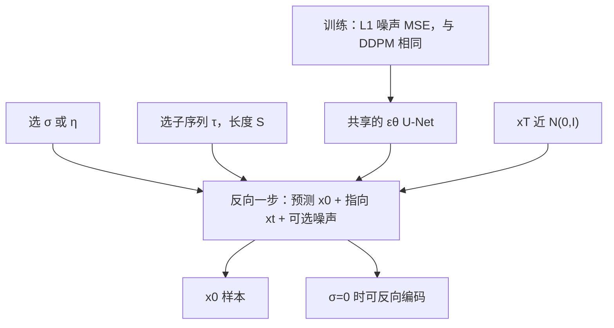

# DDIM：同一份去噪目标，换一条非马尔可夫前向，就能确定性、少步出图

<!-- release-date: 2020-10-06 -->

**本文依据**：`Denoising Diffusion Implicit Models`，arXiv 2010.02502v4（2022-10-05），22 页 letter。作者 Jiaming Song、Chenlin Meng、Stefano Ermon，Stanford University。盘上 PDF 页眉写明 arXiv:2010.02502v4 [cs.LG] 5 Oct 2022。第 1 页印有 Published as a conference paper at ICLR 2021。官方 arXiv：https://arxiv.org/abs/2010.02502。首发日取原件首次公开日，即 arXiv v1 提交日 2020-10-06，不回写成 v4。文中所有数字都标了 PDF 页码；标「外部补充」的段落不来自本文。

## 一句话

去噪扩散概率模型（denoising diffusion probabilistic models，DDPM）已经能画出高质量图，但采样必须把一条很长的马尔可夫链逐步模拟完。这篇论文提出去噪扩散隐式模型（denoising diffusion implicit models，DDIMs，读音写作 /d:Im/）：前向过程改成一族非马尔可夫推断，边缘仍和 DDPM 一样，训练目标因此完全相同；反向却可以取确定性、也可以故意走短轨迹。同一张已训好的网，少步采样墙钟可比原 DDPM 快 10 倍到 50 倍，还能在潜变量里做语义插值，并把观测以很低误差重建回来（PDF p. 1）。

它解决的不是「再发明一种去噪器」，而是 DDPM 自己钉死的那条不对称：训练一次 SGD 只抽一个 $t$，采样却必须把 $T$ 步串行走完。作者的判断是：训练目标其实只盯着边缘 $q(x_t\mid x_0)$，不盯着整条联合；联合可以换，反向链就可以变短、甚至变成隐式模型。

## 一、矛盾：图已经好看，出一张却要走完几千步

2020 年前后，GAN 在图像质量上仍压过似然模型（VAE、自回归、流），但训练脆、容易漏模式（PDF p. 1）。DDPM 和噪声条件分数网络（noise conditional score networks，NCSN）证明：不必对抗训练，也能画出接近 GAN 的图。做法是在许多高斯噪声水平上训去噪自编码器，再从白噪声出发，用马尔可夫链一步步去噪（PDF p. 1–2）。

代价立刻出现。生成链被写成前向扩散的近似反向，前向可以有上千步；每一步都要串行过网络，不能并行。论文给的墙钟对照（一块 Nvidia 2080 Ti）：从 DDPM 采 5 万张 $32\times 32$ 大约 20 小时，GAN 不到一分钟；采 5 万张 $256\times 256$ 接近 1000 小时（PDF p. 1–2）。这就是要关的效率缺口。

读的时候不要带着后来的滤镜。正文没有分类器引导、没有把整条扩散改写成一般 SDE 再另开一套分数匹配工程。那些是后作或并行工作。这篇要把钉死的是：同一份 DDPM 训练目标，换非马尔可夫前向，反向就可以确定性、可以跳步。

图 1 是两条推断图：左边马尔可夫扩散，右边非马尔可夫（每一步还看见 $x_0$）（PDF p. 2）。把机制画成能跟住的流水线（根据 PDF p. 2 图 1 重画，不是实测时间轴）：

训练时仍然随机抽 $t$，用闭式式 4 直接造 $x_t$。变的是：采样不必再假装自己是那条特定马尔可夫前向的精确反向。

把整篇的模块位置先放一张全景（机制示意，根据第 3–5 节，不是一张实测图）：

训练模块完全冻结之后，推理侧还剩两颗旋钮：$\eta$（或一般的 $\sigma$）决定每步注入多少噪声，$\tau$ 决定走哪些时刻。后面所有实验都只拧这两颗。

## 二、DDPM 背景：目标只看见边缘，链却被迫等长

给定数据分布 $q(x_0)$，要学一个好采样的 $p_\theta(x_0)$。DDPM 是隐变量模型（PDF p. 2 式 1）：

$$
p_\theta(x_0)=\int p_\theta(x_{0:T})\,dx_{1:T},\qquad p_\theta(x_{0:T}):=p_\theta(x_T)\prod_{t=1}^{T}p_\theta(x_{t-1}\mid x_t)
$$

$x_1,\ldots,x_T$ 与 $x_0$ 同维。参数靠变分下界去拟合数据（PDF p. 2 式 2）。和普通 VAE 不同：推断过程 $q(x_{1:T}\mid x_0)$ 固定、不可学，隐变量还是高维图。

Ho 等人用递减序列 $\alpha_{1:T}\in(0,1]^T$ 参数化高斯马尔可夫前向（PDF p. 2 式 3）。注意记号：本文的 $\alpha_t$ 就是 DDPM 论文里的累积 $\bar\alpha_t$（附录 C.2，PDF p. 17）。任意时刻仍有闭式（PDF p. 3 式 4）

$$
x_t=\sqrt{\alpha_t}\,x_0+\sqrt{1-\alpha_t}\,\epsilon,\qquad\epsilon\sim\mathcal{N}(0,I)
$$

$\alpha_T$ 足够接近 0 时，$q(x_T\mid x_0)$ 对所有 $x_0$ 都接近标准正态，先验取 $p_\theta(x_T)=\mathcal{N}(0,I)$ 就自然（PDF p. 3）。条件高斯、均值可学、方差固定时，变分目标可写成加权噪声预测（PDF p. 3 式 5）

$$
L_\gamma(\epsilon_\theta)=\sum_{t=1}^{T}\gamma_t\,\mathbb{E}\bigl\|\epsilon_\theta^{(t)}(\sqrt{\alpha_t}x_0+\sqrt{1-\alpha_t}\epsilon_t)-\epsilon_t\bigr\|_2^2
$$

Ho 等人实际优化 $\gamma=1$ 的 $L_1$，这也是 NCSN 那类去噪分数匹配目标（PDF p. 3）。采样：先抽 $x_T$，再逐步从生成过程抽 $x_{t-1}$。

$T$ 为什么大？变分视角下，大 $T$ 让反向更接近高斯，用高斯条件去拟合才说得通；Ho 等人取 $T=1000$（PDF p. 3）。但 $T$ 步必须串行，延迟敏感的任务用不起。

第 3 节开场的关键观察（PDF p. 3）：式 5 这种 $L_\gamma$ 只依赖边缘 $q(x_t\mid x_0)$，不直接依赖联合 $q(x_{1:T}\mid x_0)$。同一组边缘可以对应许多联合。换联合，就能换生成过程。

为什么「只依赖边缘」不是口号？式 5 的期望是：从数据抽 $x_0$，从标准正态抽 $\epsilon$，用式 4 合成 $x_t$，再比较 $\epsilon_\theta(x_t)$ 和 $\epsilon$。积分里没有 $x_{t-1}$，也没有 $q(x_t\mid x_{t-1})$。只要合成 $x_t$ 的那个高斯不变，损失的数值分布就不变。马尔可夫扩散恰好给出这族边缘，但不是唯一给出这族边缘的联合。第 3 节要做的，就是把「非唯一」写成可调的 $\sigma$，并给每个 $\sigma$ 配一条合法的反向链。

变分下界式 2 看起来仍依赖整个联合 $q(x_{1:T}\mid x_0)$。定理 1 的工作，是证明换联合之后，界与 $L_\gamma$ 只差一个不依赖网络的常数。所以你优化 $L_1$ 时，并不知道自己到底在为哪一条联合服务——这正是可以事后选采样器的原因。

## 三、非马尔可夫前向：$\sigma$ 管随机性，边缘钉死不动

### 一族带 $\sigma$ 的推断

考虑由 $\sigma\in\mathbb{R}_{\ge 0}^{T}$ 索引的推断族 $Q$（PDF p. 3 式 6）

$$
q_\sigma(x_{1:T}\mid x_0):=q_\sigma(x_T\mid x_0)\prod_{t=2}^{T}q_\sigma(x_{t-1}\mid x_t,x_0)
$$

终点边缘仍是 $q_\sigma(x_T\mid x_0)=\mathcal{N}(\sqrt{\alpha_T}x_0,(1-\alpha_T)I)$。对 $t>1$，条件高斯的均值特意选成：积分之后边缘仍是 $q_\sigma(x_t\mid x_0)=\mathcal{N}(\sqrt{\alpha_t}x_0,(1-\alpha_t)I)$（引理 1，附录 B，PDF p. 13–14）。人话：每一步 $x_{t-1}$ 同时看见当前的 $x_t$ 和原图 $x_0$，所以前向不再马尔可夫；但任意单时刻看起来仍和 DDPM 同一档噪声。

条件均值的构造值得用人话拆开。式 7 把 $x_{t-1}$ 写成三块：一块是 $\sqrt{\alpha_{t-1}}x_0$，一块是把「$x_t$ 里除掉 $\sqrt{\alpha_t}x_0$ 之后剩下的噪声方向」按 $\sqrt{1-\alpha_{t-1}-\sigma_t^2}$ 缩放到 $t-1$，一块是方差 $\sigma_t^2 I$ 的新鲜噪声（PDF p. 3–4）。$\sigma_t$ 越小，新鲜噪声越少，给定 $x_0$ 与 $x_t$ 之后 $x_{t-1}$ 越被钉死。引理 1 从 $t=T$ 向 $t=1$ 归纳：对 $x_t$ 积分之后，均值塌回 $\sqrt{\alpha_{t-1}}x_0$，协方差塌回 $(1-\alpha_{t-1})I$，于是每个单时刻边缘都和 DDPM 的式 4 一致（PDF p. 13–14）。Bishop 教材 2.115 节被用来算两个高斯复合仍是高斯（PDF p. 14）。

$\sigma$ 控制前向有多随机。$\sigma\to 0$ 是极端：只要看见某对 $x_0$ 和 $x_t$，$x_{t-1}$ 就确定下来（PDF p. 4）。由贝叶斯还能写出 $q_\sigma(x_t\mid x_{t-1},x_0)$，它也是高斯，正文后面不用这一式（PDF p. 4）。为什么可以不用？因为训练从不采样这条「真前向联合」，只采样边缘 $x_t\sim q(x_t\mid x_0)$。联合存在，是为了给反向条件一个合法的概率对象，不是为了在数据上再走一遍前向。

### 生成：先预测 $x_0$，再代入反向条件

给定带噪 $x_t$，网络 $\epsilon_\theta^{(t)}(x_t)$ 去预测式 4 里的那份噪声，再反解出对 $x_0$ 的预测（PDF p. 4 式 9）

$$
f_\theta^{(t)}(x_t):=\bigl(x_t-\sqrt{1-\alpha_t}\,\epsilon_\theta^{(t)}(x_t)\bigr)/\sqrt{\alpha_t}
$$

生成过程先验仍是 $\mathcal{N}(0,I)$。$t=1$ 时取 $\mathcal{N}(f_\theta^{(1)}(x_1),\sigma_1^2 I)$，好让密度处处有支撑；其余步把式 7 里的 $x_0$ 换成 $f_\theta^{(t)}(x_t)$（PDF p. 4 式 10）。直觉就是：先猜干净图，再按选定的非马尔可夫反向条件走一步。

对应的变分目标记成 $J_\sigma$（PDF p. 4 式 11）。表面上每个 $\sigma$ 是不同目标、要分别训。定理 1 说：对任意 $\sigma>0$，存在正权重 $\gamma$ 和常数 $C$，使得 $J_\sigma=L_\gamma+C$（PDF p. 4）。

定理 1 的证明把 $J_\sigma$ 先写成一串 KL（PDF p. 14 式 29）。$t>1$ 时，生成条件被定义成 $q_\sigma(\cdot\mid x_t,f_\theta(x_t))$，于是 KL 是两个同方差高斯之比，正比于 $\|x_0-f_\theta(x_t)\|^2/(2\sigma_t^2)$（PDF p. 14 式 30）。再把 $x_0$ 和 $f_\theta$ 都用式 4 换成噪声，得到 $\|\epsilon-\epsilon_\theta(x_t)\|^2$ 乘一个只依赖 $\sigma_t,\alpha_t$ 的系数（PDF p. 14–15 式 31–32）。$t=1$ 那项同样落到预测 $x_0$ 的平方误差。把各步系数收集成 $\gamma$，就得到 $J_\sigma=L_\gamma+C$。$C$ 可以依赖 $q_\sigma$，不依赖网络。

脚注 4 说：也可以给 $x_0$ 的预测学一个分布，实验上几乎没好处（PDF p. 4）。所以正文始终用点估计 $f_\theta$。

若各 $t$ 的网络参数不共享，则 $L_\gamma$ 的最优解不依赖权重——每一项可以分开最大化。于是两件事同时成立：DDPM 用 $L_1$ 当变分界的代理是有理由的；而 $J_\sigma$ 的最优也和 $L_1$ 相同。参数若跨 $t$ 共享，论文仍直接沿用 Ho 等人的 $L_1$ 当代理（PDF p. 4–5）。共享参数时，「最优与 $\gamma$ 无关」不再严格，这是实现向 DDPM 配方对齐的选择，不是定理的推论。

**因果链**：旧问题是生成过程被绑在那条马尔可夫前向上，步数不能少。新设计是换联合、保边缘。机制上 $J_\sigma$ 只是 $L_\gamma$ 加常数。收益是同一张网服务一整族反向。代价是定理 1 字面要求 $\sigma>0$；$\sigma_t=0$ 的 DDIM 要用很小的 $\sigma$ 去逼近（脚注 5，PDF p. 5）。

**可迁移的一点**：目标如果只约束边缘，实现上就可以把「怎么走联合」留到推理时再选。这不是调采样器的启发式，而是变分目标的自由度。

这一节接到系统的位置是：训练循环一行都不用改，改的是「采样器认为自己在反谁」。DDPM 采样器认为自己在反式 3 的马尔可夫扩散；DDIM 采样器认为自己在反 $\sigma=0$ 的非马尔可夫联合。两者对同一张 $\epsilon_\theta$ 都合法，因为 $\epsilon_\theta$ 只通过边缘损失被约束。若有人把 DDIM 理解成「把 DDPM 的 $\sigma_t z$ 强行关掉」，机制上就说反了：关掉噪声是 $\sigma=0$ 那条联合的推论，不是对 DDPM 反向的残缺实现。

## 四、采样：$\sigma=0$ 就是 DDIM，子序列就是加速

### 一步更新拆成三块

从式 10 得到（PDF p. 5 式 12）

$$
x_{t-1}=\sqrt{\alpha_{t-1}}\,\underbrace{\frac{x_t-\sqrt{1-\alpha_t}\,\epsilon_\theta^{(t)}(x_t)}{\sqrt{\alpha_t}}}_{\text{预测的 }x_0}+\underbrace{\sqrt{1-\alpha_{t-1}-\sigma_t^2}\,\epsilon_\theta^{(t)}(x_t)}_{\text{指向 }x_t\text{ 的方向}}+\sigma_t\epsilon_t
$$

$\epsilon_t\sim\mathcal{N}(0,I)$ 与 $x_t$ 独立，$\alpha_0:=1$。同一张 $\epsilon_\theta$，换 $\sigma$ 就换生成过程，不必重训。

当

$$
\sigma_t=\sqrt{(1-\alpha_{t-1})/(1-\alpha_t)}\sqrt{1-\alpha_t/\alpha_{t-1}}
$$

对所有 $t$ 成立时，前向回到马尔可夫，生成过程就是 DDPM（PDF p. 5）。

另一端：所有 $\sigma_t=0$（$t=1$ 除外）。前向在给定 $x_{t-1}$ 和 $x_0$ 时变成确定的；生成里随机项系数也是 0。样本由 $x_T$ 经固定手续映到 $x_0$，这是隐式概率模型（implicit probabilistic model）。作者把它叫 DDIM：用 DDPM 目标训出来的隐式模型，尽管前向已经不是扩散（PDF p. 5）。读音在文中写成 /d:Im/（PDF p. 5）。

三块更新对应三种设计意图。第一块把当前图拉向预测的干净图，步长由 $\sqrt{\alpha_{t-1}}$ 决定。第二块把「还指向 $x_t$ 的那截噪声」留下来，系数是 $\sqrt{1-\alpha_{t-1}-\sigma_t^2}$：$\sigma$ 越大，留给确定性方向的预算越小。第三块是真正的随机注入。$\sigma=0$ 时第三块消失，第二块变成 $\sqrt{1-\alpha_{t-1}}$，整步没有新鲜噪声。$\sigma$ 取 DDPM 那档时，随机项恢复成 Ho 等人的 $\sigma_t z$。不必重训，是因为这三块里只有 $\sigma$ 变，网络始终只提供同一个 $\epsilon_\theta(x_t)$。

### 短轨迹：边缘对上即可，不必走满 $T$

$L_1$ 只要 $q_\sigma(x_t\mid x_0)$ 固定，就不依赖具体前向怎么走。于是前向可以只定义在子集 $\{x_{\tau_1},\ldots,x_{\tau_S}\}$ 上，$\tau$ 是 $[1,\ldots,T]$ 的递增子序列，长度 $S$。各边缘仍是 $\mathcal{N}(\sqrt{\alpha_{\tau_i}}x_0,(1-\alpha_{\tau_i})I)$（图 2 以 $\tau=[1,3]$ 示意，PDF p. 5）。生成按反转的 $\tau$ 走，这条路径叫采样轨迹。$S\ll T$ 时，迭代次数少，墙钟就下来。

式 12 只需改下标即可用于 DDPM、DDIM 以及式 10 里所有过程；细节在附录 C.1（PDF p. 5、p. 16–17）。原则上可以训任意多前向步、甚至连续时间 $t$，采样只用其中一部分；作者把实证留给未来（PDF p. 5）。

附录 C.1 把加速时的联合拆开：$\tau$ 上是一条链，补集 $\bar\tau$ 上每个 $x_t$ 直接连 $x_0$，像星形。变分目标里出现的 KL 仍是方差与 $\theta$ 无关的高斯对，同样能化成某种 $L_\gamma$（PDF p. 16–17）。

实验里用一个标量 $\eta\ge 0$ 把 $\sigma$ 插在 DDIM 和 DDPM 之间（PDF p. 6 式 16）

$$
\sigma_{\tau_i}(\eta)=\eta\sqrt{(1-\alpha_{\tau_{i-1}})/(1-\alpha_{\tau_i})}\sqrt{1-\alpha_{\tau_i}/\alpha_{\tau_{i-1}}}
$$

$\eta=0$ 是 DDIM，$\eta=1$ 是原 DDPM 生成过程。另外还试了比 $\sigma(1)$ 更大的噪声标准差 $\hat\sigma_{\tau_i}=\sqrt{1-\alpha_{\tau_i}/\alpha_{\tau_{i-1}}}$：Ho 等人的实现只在 CIFAR10 样本上用过这一档，其他数据集不用（PDF p. 6）。附录 D.3 写明：$\hat\sigma$ 那步对噪声项用了不同系数，比 $\eta=1$ 更随机，所以短轨迹更差（PDF p. 18–19）。

**因果链**：旧问题是生成步数被前向长度锁死。新设计是只在子序列上定义前向。机制是边缘匹配，$L_1$ 仍合法。收益是少步、可插 $\eta$。代价是短轨迹是对原长链的离散化，质量会换计算。

跳步不是「每隔 $k$ 步用一次 DDPM 更新」。DDPM 更新里的系数来自相邻 $t$ 与 $t-1$ 的 $\alpha$；子序列更新把 $t-1$ 换成 $\tau_{i-1}$，系数用 $\alpha_{\tau_i}$ 与 $\alpha_{\tau_{i-1}}$ 重算（附录 D.3，PDF p. 18–19）。若只是稀疏散 DDPM 的 $z$，方差日程会对错号。图 2 的 $\tau=[1,3]$ 是最小例子：中间的 $x_2$ 不在链上，它在星形补集里直接连 $x_0$，采样根本不经过它（PDF p. 5、p. 16）。

$\eta$ 插值也要按公式读，不要想象成「混合两份样本」。式 16 把 DDPM 那档 $\sigma$ 乘上 $\eta$，确定性方向的系数跟着 $\sqrt{1-\alpha_{\tau_{i-1}}-\sigma^2}$ 变。$\eta=0.2$ 与 $0.5$ 在表 1 里介于 0 与 1 之间，短链上已经明显好于 $\eta=1$，说明「稍微关一点噪声」比「完全随机或完全确定」更细。$\hat\sigma$ 不是 $\eta>1$ 的连续延伸：它对噪声项换了另一套系数，比 $\eta=1$ 更吵，所以短链 FID 爆炸（PDF p. 18–19）。

## 五、和 Neural ODE 的关系：确定性链可以正向编码

把式 12 在 $\sigma=0$ 时改写成对 $\sqrt{\alpha}$ 归一化后的差分，形状像欧拉积分（PDF p. 6 式 13）。再把 $\sqrt{(1-\alpha)/\alpha}$ 叫 $\sigma$，$x/\sqrt{\alpha}$ 叫 $\bar x$，连续极限是（PDF p. 6 式 14）

$$
d\bar x(t)=\epsilon_\theta^{(t)}\Bigl(\frac{\bar x(t)}{\sqrt{\sigma^2+1}}\Bigr)\,d\sigma(t)
$$

初值对应很大的 $\sigma(T)$（$\alpha\approx 0$）。离散步够密时，生成可以反过来：从 $t=0$ 走到 $T$，把 $x_0$ 编成 $x_T$。DDPM 做不到这件事，因为每步都在加独立噪声。作者说 $x_T$ 这种编码可能对需要潜表示的下游有用（PDF p. 6）。$x_T$ 和 $x_0$ 同维，压缩率不是他们关心的对象（脚注 7，PDF p. 9）。

附录 B 把等价写清楚，避免把「ODE 一样」听成「采样器一样」。他们引入 VE-SDE 常用的 $\bar x(t)=x(t)/\sqrt{\alpha(t)}$ 与 $\sigma(t)=\sqrt{(1-\alpha(t))/\alpha(t)}$，两者与 $(x,\alpha)$ 一一对应（PDF p. 15 式 36–40）。DDIM 的差分除以 $-\Delta t$ 再取极限，得到 $d\bar x/dt=(d\sigma/dt)\epsilon_\theta$（PDF p. 15 式 45）。VE 概率流是 $\mathrm{d}\bar x=-\frac12 g(t)^2\nabla\log p_t\,\mathrm{d}t$，最优分数与最优 $\epsilon_\theta$ 差一个 $-\epsilon_\theta/\sigma(t)$（PDF p. 16 式 47–49）。代进去，两条 ODE 相同，初值都是 $\bar x(T)\sim\mathcal{N}(0,\sigma^2(T)I)$（PDF p. 16）。差只在离散：少步时 $\alpha_t$ 与 $\alpha_{t-\Delta t}$ 离得远，式 13 与式 15 不再接近。

附录 C.2 提醒读者不要把两篇的 $\alpha$ 对错号。Ho 等人先引入 $\beta_t$，再定义 $\alpha_t:=1-\beta_t$ 与累积 $\bar\alpha_t$。本文用 $\alpha_t$ 直接表示那个累积量，理由有三：超参只剩一套；前向不再被激励成扩散，加速时更好写；$\alpha_{1:T}$ 与时刻下标同构，$\beta_t$ 没有这种同构（PDF p. 17）。从本文的 $\alpha$ 可以唯一反解 $\beta_t=1-\alpha_t/\alpha_{t-1}$。附录后半把 DDPM 的 $\tilde\mu$ 参数化再推回噪声 MSE，只为和前作对齐，不是新目标（PDF p. 17–18）。

并行工作 Song 等人 2020 的概率流 ODE 从基于分数的 SDE 恢复边缘。命题 1：式 14 在最优 $\epsilon_\theta$ 下，等价于他们 Variance-Exploding SDE 的概率流 ODE（PDF p. 6，证明在附录 B，PDF p. 15–16）。ODE 等价，欧拉离散不必等价：对方对 $dt$ 做欧拉，这里对 $d\sigma(t)$ 做欧拉，少步时差得开（PDF p. 6 式 15）。正文点到为止，不把那篇 SDE 论文重写一遍。

讨论里还建议：若采样像 Neural ODE，Adams–Bashforth 这类多步法或许能在更少步里降离散误差；隐式模型的其他性质（如 Bau 等人讨论的 GAN 不可生成内容）也值得查。这些都是展望，没有实验（PDF p. 10）。

## 六、实验设定：同一张 $T=1000$ 的网，只改怎么采

每个数据集都用同一份已训模型，$T=1000$，目标是式 5 的 $L_\gamma$ 且 $\gamma=1$。训练过程零改动，只改 $\tau$（多快）和 $\sigma$（多随机）（PDF p. 6）。

四个集：无条件 CIFAR10 $32\times 32$、CelebA $64\times 64$、LSUN Bedroom 与 Church 均为 $256\times 256$。$\alpha$ 日程按 Ho 等人的启发式，好直接比。CIFAR10、Bedroom、Church 用原 DDPM 仓库的预训练检查点；CelebA 没有现成权重，作者用 $L_1$ 自己训。骨干仍是基于 Wide ResNet 的 U-Net。CelebA 五个分辨率（$64\times 64$ 到 $4\times 4$），用原版 CelebA 而非 CelebA-HQ，预处理来自 StyleGAN 仓库（附录 D.1，PDF p. 18）。

子序列两种：线性 $\tau_i=\lfloor c i\rfloor$；二次 $\tau_i=\lfloor c i^2\rfloor$。$c$ 选成 $\tau$ 的末项靠近 $T$。CIFAR10 用二次，其余用线性，各自比另一种 FID 略好（附录 D.2，PDF p. 18）。

## 七、少步质量：确定性在短轨迹上更稳

表 1 用 FID 报 CIFAR10 与 CelebA（PDF p. 7）。$\eta=1.0$ 与 $\hat\sigma$ 算 DDPM 侧（Ho 等人原实验只认真考虑 $T=1000$；$S<T$ 可以看成在模拟「按 $S$ 步训出来的 DDPM」），$\eta=0$ 是 DDIM。

CIFAR10 FID：

| $\eta$ | $S=10$ | 20 | 50 | 100 | 1000 |
|---|---:|---:|---:|---:|---:|
| 0.0 | 13.36 | 6.84 | 4.67 | 4.16 | 4.04 |
| 0.2 | 14.04 | 7.11 | 4.77 | 4.25 | 4.09 |
| 0.5 | 16.66 | 8.35 | 5.25 | 4.46 | 4.29 |
| 1.0 | 41.07 | 18.36 | 8.01 | 5.78 | 4.73 |
| $\hat\sigma$ | 367.43 | 133.37 | 32.72 | 9.99 | 3.17 |

CelebA FID：

| $\eta$ | $S=10$ | 20 | 50 | 100 | 1000 |
|---|---:|---:|---:|---:|---:|
| 0.0 | 17.33 | 13.73 | 9.17 | 6.53 | 3.51 |
| 0.2 | 17.66 | 14.11 | 9.51 | 6.79 | 3.64 |
| 0.5 | 19.86 | 16.06 | 11.01 | 8.09 | 4.28 |
| 1.0 | 33.12 | 26.03 | 18.48 | 13.93 | 5.98 |
| $\hat\sigma$ | 299.71 | 183.83 | 71.71 | 45.20 | 3.26 |

步数越多质量越好，计算和观感可以换。$S$ 小时 DDIM 最好；同样 $S$ 下更随机的过程通常更差。唯一明显例外：$S=1000$ 且 $\hat\sigma$ 时，CIFAR10 FID 3.17、CelebA 3.26，DDIM 略差（4.04 / 3.51）。$\hat\sigma$ 一缩短轨迹就崩，短链不适合它。DDIM 则更一致（PDF p. 7）。

图 3：同样步数、不同 $\sigma$。DDPM 在 10 步时观感迅速变差；$\hat\sigma$ 短轨迹带更多噪声扰动，FID 对这种扰动很敏感（PDF p. 7）。

图 4：一块 2080 Ti 上采 5 万张的小时数随步数近似线性。DDIM 用 20 到 100 步就能接近 1000 步模型的质量，相对原 DDPM 是 10 倍到 50 倍墙钟加速。DDPM 用 100 步也能到还过得去的质量，但 DDIM 更少步就够：CelebA 上 100 步 DDPM 的 FID 和 20 步 DDIM 相近（PDF p. 7–8）。摘要写的是 10 倍到 50 倍；引言经验部分还写加速采样 10 倍到 100 倍时 DDIM 质量优于 DDPM（PDF p. 1–2）。两处口径不同：前者是「够接近 1000 步质量」的墙钟，后者是「同样加速倍率下谁更好」。

第 5 节开头还写过相对原 DDPM 生成过程 10 倍到 100 倍加速（PDF p. 6）。读数字时按表 1 的 $S$ 对齐，不要把三处倍率混成一个口号。

附录表 3（PDF p. 18）。1000 步 DDPM：Bedroom FID 6.36，Church 7.89。

| | Bedroom 10 | 20 | 50 | 100 | Church 10 | 20 | 50 | 100 |
|---|---:|---:|---:|---:|---:|---:|---:|---:|
| DDIM $\eta=0$ | 16.95 | 8.89 | 6.75 | 6.62 | 19.45 | 12.47 | 10.84 | 10.58 |
| DDPM $\eta=1$ | 42.78 | 22.77 | 10.81 | 6.81 | 51.56 | 23.37 | 11.16 | 8.27 |

256 分辨率上，短链仍然是 DDIM 明显更好；Church 的 100 步 DDPM（8.27）反而好过 100 步 DDIM（10.58）。论文没有把「任何分辨率、任何 $S$ 都是 $\eta=0$ 最优」写成定律。图 7–8、图 10 是 CIFAR10 / CelebA / Church 的 1000 步 DDPM、1000 步 DDIM 与 100 步 DDIM（或 100 步对照）样例（PDF p. 19–20）。

表 1 里有几处容易读歪，单独钉一下。第一，$S=1000$ 时 CIFAR 的 $\hat\sigma$ FID 3.17 正是 Ho 等人报告的那个数；DDIM 在同一检查点上是 4.04，所以「换采样器」在满步时并不自动更好。第二，CelebA 满步 DDIM 3.51 好过 $\eta=1$ 的 5.98，却仍略差于 $\hat\sigma$ 的 3.26，随机性的最优档随数据集变。第三，从 $S=10$ 到 $S=50$，DDIM 的 CIFAR FID 从 13.36 掉到 4.67，已经贴近满步 4.04；再加步主要修细节。这和一致性观察对得上：高层特征早定，后面步数买的是 FID 敏感的纹理。第四，引言写加速 10 倍到 100 倍时 DDIM 质量优于 DDPM，对应表里同一 $S$ 下 $\eta=0$ 对 $\eta=1$ 的列；摘要的 10 倍到 50 倍指 20–100 步对齐 1000 步质量的墙钟。两句话都对，比较的对象不同（PDF p. 1–2、p. 7）。

训练侧几乎无故事可写，这本身是贡献。论文没有新的学习率、没有新骨干、没有新 $\beta$ 日程。CIFAR / Bedroom / Church 的网来自 DDPM 官方实现；CelebA 只是因为没有现成权重才自己用 $L_1$ 训，架构仍跟随 Ho 等人的 U-Net（PDF p. 18）。因此表 1、表 3 应读成「同一检查点上的采样器消融」，不是「两个模型比质量」。若把 DDIM 的 FID 拿去和另一篇换了骨干的扩散比，比较已经不成立。

子序列是唯一还算超参的东西。二次日程在 CIFAR 上略好，线性在其余集上略好，作者说只是略好，没有理论（PDF p. 18）。实现上 $c$ 要让最后一个 $\tau$ 靠近 $T$，否则终点信噪比和训练时 $x_T$ 对不齐。这和 DDPM 附录强调 $L_T\approx 0$ 是同一类「终点要够吵」的约束，只是现在发生在子序列的最后一项。

## 八、一致性、插值、重建：确定性带来的三件事

### 同 $x_T$、不同轨迹，高层特征还在

DDIM 生成确定，$x_0$ 只依赖初态 $x_T$。图 5：同一 $x_T$、不同 $\tau$。高层特征大多相似；许多情况下 20 步已经和 1000 步在高层上接近，只差细节。于是 $x_T$ 本身像图像的信息编码，影响质量的细节则在网络参数和更长轨迹里（PDF p. 7–8）。图 9 是 CelebA 上同一随机 $x_T$、不同步数（PDF p. 20）。DDPM 没有这条「一致性」：同 $x_T$ 会走出很不一样的 $x_0$（PDF p. 2、p. 9）。

### 在 $x_T$ 上插值，而不是在像素附近搅

因为高层特征由 $x_T$ 编码，作者问它会不会像其他隐式模型（如 GAN）那样出现语义插值。这和 Ho 等人的插值不同：DDPM 同 $x_T$ 会因随机生成而高度多样；脚注 6 说若插值全部 $T$ 份噪声，或许仍可能，Song & Ermon 2020 做过类似的事（PDF p. 9）。图 6 显示：在 $x_T$ 上做简单插值，就能在两张样本之间走出语义上说得通的中间图，$\mathrm{dim}(\tau)=50$（PDF p. 8–9）。DDIM 因此能直接用潜变量做高层控制，DDPM 不能（PDF p. 9）。

附录 D.5：线上插值是抽两个标准正态 $x_T$，球面线性插值（slerp），再 DDIM 映到 $x_0$（PDF p. 19 式 67）。网格插值：四个潜变量分成两对，先对内 slerp，再跨对 slerp。图 11–13 是 CelebA、Bedroom、Church 上 $\mathrm{dim}(\tau)=50$ 的更多格子（PDF p. 19、21–22）。

### 沿 ODE 编码再解码，误差随 $S$ 下降

把式 14 反向当编码器、正向当解码器。CIFAR-10 测试集、同一 CIFAR 模型，编码和解码都用 $S$ 步，报缩放到 $[0,1]$ 后的逐维均方误差，四舍五入到 $10^{-4}$（表 2，PDF p. 9）：

| $S$ | 10 | 20 | 50 | 100 | 200 | 500 | 1000 |
|---|---:|---:|---:|---:|---:|---:|---:|
| 误差 | 0.014 | 0.0065 | 0.0023 | 0.0009 | 0.0004 | 0.0001 | 0.0001 |

$S$ 越大误差越低，行为接近 Neural ODE 和归一化流。DDPM 随机，做不成同一件事（PDF p. 9）。论文写的是「很低误差」，没有声称无损或低于某个信息论界。

球面线性插值不是装饰。两个标准正态向量的线性平均会改变范数，落在低密度区；slerp 沿着大圆走，范数保持，这是隐式模型插值的常规做法，论文直接引用 Shoemake 1985（PDF p. 19 式 67）。$\theta=\arccos\bigl((x_T^{(0)})^\top x_T^{(1)}/(\|x_T^{(0)}\|\|x_T^{(1)}\|)\bigr)$，再按 $\sin((1-\alpha)\theta)/\sin\theta$ 与 $\sin(\alpha\theta)/\sin\theta$ 配权重。网格插值用两次独立的 $\alpha$，所以格子不是单一折线，而是一张由两对端点张起来的面。图 6 与图 11–13 应看成这种几何的结果，而不是「像素混合」。DDPM 若只插 $x_T$、其余步仍加独立噪声，中间帧会在图像空间附近抖动，论文说 DDPM 的插值靠近图像空间，因为生成过程是随机的（PDF p. 2）。

重建实验的协议是：编码 $S$ 步、解码 $S$ 步，测试集，逐维 MSE 缩放到 $[0,1]$。$S=10$ 时 0.014 已经很小，但相对 $S=1000$ 的 $0.0001$ 仍差两个数量级；「很低误差」随离散步变好，符合欧拉法截断误差随步长下降，而不是声称学到了精确的可逆流（PDF p. 9）。DDPM 做不成对照，因为反向每步的噪声不可逆。

一致性、插值、重建是同一性质的三个面。一致性说 $x_T$ 编码高层；插值说这个编码的几何有语义；重建说编码可逆到像素。少步时高层已经对、像素还对不齐，所以 20 步图「像」1000 步图，但重建 MSE 仍要几百步才掉到 $10^{-4}$。不要用插值成功去推断重建已经无损，也不要用重建 MSE 去推断 FID。

## 九、相关工作、离散推广、论文没做的事

相关工作把 DDPM / NCSN 放进「把生成模型写成马尔可夫转移算子」的大家族，引用包括 Sohl-Dickstein 2015、Bengio 等人的生成随机网络、Salimans 的 MCMC–变分桥、A-NICE-MC、Variational Walkback、以及用网络泛化 HMC 的工作（PDF p. 9）。其中 DDPM 优化对数似然的变分下界，NCSN 在数据的非参数 Parzen 密度估计上做分数匹配（Hyvärinen；Vincent；Raphan & Simoncelli）（PDF p. 9）。动机不同，做法接近：都在多噪声水平上做去噪自编码，采样都像朗之万（Neal 等人综述的哈密顿 MCMC 语境里，朗之万是梯度流的离散）。所以少步质量差，不是实现没调好，而是这条采样器家族的结构（PDF p. 9）。

DDIM 被放在隐式生成模型一侧，性质开始像 GAN 和可逆流：样本由潜变量唯一确定，因而可以做语义插值（PDF p. 9）。推导却是纯变分，朗之万的限制不再是前提；作者认为这可能部分解释少步时为何优于 DDPM。采样还让人想起 Neural ODE 与 FFJORD 那种连续深度：同一潜变量、不同轨迹，高层外观仍接近（PDF p. 9）。

致谢列出 Yang Song、Shengjia Zhao 讨论想法，Kuno Kim 读过早期草稿，Sharvil Nanavati 与 Sophie Liu 指出笔误。资助是 NSF、ONR、AFOSR 与 Amazon AWS（PDF p. 10）。这些不影响技术判断，只说明并行概率流 ODE 的作者就在致谢名单里，正文把它当 concurrent work 处理是有意的。

附录 A 把非马尔可夫想法搬到离散：观测 $x_0$ 是 $K$ 维 one-hot。边缘写成类别分布 $q(x_t\mid x_0)=\mathrm{Cat}(\alpha_t x_0+(1-\alpha_t)1_K)$，$\alpha_0=1$、$\alpha_T=0$（PDF p. 13 式 17）。反向条件是三份类别的混合：以 $\sigma_t$ 的概率停在当前 $x_t$，以 $\alpha_{t-1}-\sigma_t\alpha_t$ 的概率跳到 $x_0$，剩下的质量分给均匀 $1_K$（PDF p. 13 式 18–19）。生成过程把 $x_0$ 换成网络输出的 $K$ 维向量 $f_\theta^{(t)}(x_t)$（式 20）。当 $(1-\alpha_{t-1})-(1-\alpha_t)\sigma_t\to 0$，每步高概率只在「留下 $x_t$」和「跳到预测的 $x_0$」之间选，随机性下降。两类类别分布的 KL 良定义；由凸性得到分类损失上界，于是改 $\sigma_t$ 仍然只改权重（PDF p. 13）。正文焦点是加速高斯扩散的反向，离散实验留作未来。

讨论还说：非马尔可夫前向暗示可以有非高斯的连续前向——原扩散框架里有限方差的稳定分布只有高斯（PDF p. 10）。组合结构上的类似替代也被点名为值得查，没有公式。

图 4 的纵轴是「一块 2080 Ti 采 5 万张要多少小时」，CIFAR10 与 Bedroom 两条曲线都随步数近似直线（PDF p. 8）。这张图要和表 1 一起读：质量换的是这条直线上的位置，不是另一次训练。Bedroom 分辨率高，同样步数墙钟更长，所以 256 上「少步」的收益按小时计更明显，尽管表 3 的绝对 FID 仍高于 CIFAR 的短链数字。

论文明确没写或没做的：

- 没有改网络、没有改 $L_1$ 训练循环；CIFAR / Bedroom / Church 甚至直接加载 DDPM 检查点（PDF p. 6、p. 18）。
- 没有把「训很多步、采很少步」或连续 $t$ 做成实验（PDF p. 5）。
- 没有离散数据实验（PDF p. 13）。
- 没有多步 ODE 求解器实验（PDF p. 10）。
- 没有似然数字、没有对抗训练、没有条件生成或引导。
- 并行的概率流 ODE 只证等价并指出少步欧拉不同，不在本文展开 SDE 工程（PDF p. 6）。

## 十、限制与可迁移启发

限制要按论文自己的边界读。确定性少步换来的一致性，代价是失去 DDPM 那种「同 $x_T$ 多样本」的随机性；多样要从不同 $x_T$ 来。Church 100 步上 DDPM FID 更好，说明 $\eta=0$ 不是处处占优。定理 1 不覆盖精确的 $\sigma=0$，实现上靠很小的 $\sigma$ 逼近。重建误差是逐维 MSE，不是感知指标。墙钟曲线来自一块 2080 Ti、5 万张，线性关系论证的是「步数正比时间」，不是跨硬件的绝对吞吐。

还有几条实现边界。论文没有公布 CelebA 自训的步数、学习率或 FID 训练曲线，只说用了 $L_1$ 和同一套 U-Net（PDF p. 18）。Bedroom / Church 的 1000 步 DDPM FID 6.36 / 7.89 写在表 3 注里，没有把 1000 步 DDIM 的 256 分辨率 FID 放进同一张表，不能从短链数字外推满步 DDIM 在 LSUN 上是否更好。图 4 的小时数是读图，正文没有把每个 $S$ 的精确小时数写成表。离散附录没有实验。ODE 多步法、隐式模型的其他诊断（Bau 等人）都是展望（PDF p. 10）。

脚注 4 的「给预测学分布几乎没好处」没有表；脚注 5 的「用很小 $\sigma$ 逼近 $\sigma=0$」没有给出数值下限。读的时候不要把这两条补成超参建议。

把设计原则收束成几条，而不是收束成名词：

1. 先问目标到底约束了联合还是边缘。只约束边缘时，推理图可以换。DDIM 的全部花样都坐在这条裂缝上。
2. 训练和采样的计算图不必同构。训满 $T$ 档噪声、采 $S$ 点子序列，合法与否看边缘是否仍匹配，不看「像不像原扩散」。
3. 随机性是旋钮，不是道德。$\eta$ 从 0 到 1 连续插在隐式模型和 DDPM 之间；短链上关噪声，长链上 Ho 的 $\hat\sigma$ 仍能刷 FID。
4. 确定性强加了一种潜变量语义。同 $x_T$ 同图、可 slerp、可沿 ODE 来回，这三件是采样器性质，不必重训。
5. 少步离散化的坐标系有选择。对 $d\sigma(t)$ 还是对 $dt$ 做欧拉，连续极限可以一样，二十步时不必一样。

## 关键词回看

- **边缘与联合**：训练损失看见的是各 $t$ 的 $q(x_t\mid x_0)$；联合 $q(x_{1:T}\mid x_0)$ 可以是马尔可夫扩散，也可以每步还以 $x_0$ 为条件。
- **非马尔可夫前向 $q_\sigma$**：用 $\sigma$ 管随机性，同时用均值公式钉住与 DDPM 相同的高斯边缘。
- **噪声预测 $\epsilon_\theta$ 与去噪观察 $f_\theta$**：先猜 $\epsilon$，再解出当前步对应的 $\hat x_0$，代入反向条件。
- **DDIM**：$\sigma_t=0$ 的隐式模型；样本是 $x_T$ 的确定函数。
- **$\eta$ 与轨迹 $\tau$**：前者在确定与 DDPM 之间插值，后者决定走多少步、走哪些 $t$。
- **一致性**：同 $x_T$、不同 $S$，高层特征保持；插值和重建都靠它。

## 参考资料

- 本文：Song, Meng, Ermon. Denoising Diffusion Implicit Models. ICLR 2021. arXiv:2010.02502。
- 前作训练配方与检查点来源：Ho, Jain, Abbeel. Denoising Diffusion Probabilistic Models. NeurIPS 2020. arXiv:2006.11239。库内研读见同方向 `DDPM.md`，本文不重复其参数化推导。
- 并行提及、不在本文展开：Song et al. Score-Based Generative Modeling through Stochastic Differential Equations. arXiv:2011.13456（PDF p. 6、p. 12）。
