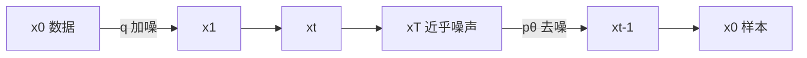

# DDPM：把加噪马尔可夫链反过来走，用预测噪声把变分界训成去噪器

<!-- release-date: 2020-06-19 -->

**本文依据**：`Denoising Diffusion Probabilistic Models`，arXiv 2006.11239v2（2020-12-16），25 页 letter。作者 Jonathan Ho、Ajay Jain、Pieter Abbeel，UC Berkeley。盘上 PDF 页眉写明 arXiv:2006.11239v2 [cs.LG] 16 Dec 2020。第 1 页印有 34th Conference on Neural Information Processing Systems (NeurIPS 2020), Vancouver, Canada。实现仓库写在摘要末尾：`https://github.com/hojonathanho/diffusion`（PDF p. 1）。首发日取原件首次公开日，即 arXiv v1 提交日 2020-06-19，不回写成 v2 日期。文中所有数字都标了 PDF 页码；标「外部补充」的段落不来自本文。

## 一句话

扩散概率模型是一类隐变量模型：先把数据沿着一条固定的高斯加噪马尔可夫链走到近乎纯噪声，再学一条同样长度的反向高斯链，把噪声一步步去干净。这篇论文证明，只要把反向均值参数化成「预测所加的噪声」，变分下界就变成多噪声尺度上的去噪分数匹配；再丢掉小噪声项上过重的权重，无条件 CIFAR10 就能到 Inception Score 9.46、FID 3.17，256×256 LSUN 的观感接近 ProgressiveGAN（PDF p. 1）。采样过程本身还是一种渐进有损解码：大结构先出现，细节后补上。

它解决的不是「再发明一种生成模型」，而是 2015 年 Sohl-Dickstein 那套非平衡热力学扩散模型一直缺的那块：**能不能真画出高质量图**。作者的判断是：能，而且关键不在换更花的架构，而在反向过程怎么参数化、变分界怎么加权。

## 一、矛盾：扩散模型好训，却没人信它能画好图

2020 年前后，能出好看样本的生成模型已经很多：GAN、自回归、流、VAE，以及能量模型和分数匹配（PDF p. 1）。扩散概率模型（diffusion probabilistic models，下文简称扩散模型）在这份名单里是个尴尬角色。它来自 Sohl-Dickstein 等人 2015 年的工作：一条固定的前向马尔可夫链往数据里加噪声，一条可学习的反向链把噪声去掉，用变分推断来训（PDF p. 2）。定义简单，训练也高效，但作者写得很直：就他们所知，**还没有人证明它能生成高质量样本**（PDF p. 2）。

所以这篇论文要同时做三件事（PDF p. 2）：

1. 证明扩散模型可以出高质量图，有时比当时已发表的其他生成模型还好（第 4 节）。
2. 给出一种参数化，使训练等价于多噪声水平的去噪分数匹配，采样等价于退火朗之万动力学（第 3.2 节）。最好的样本质量就来自这种参数化，作者把它当成主要贡献之一。
3. 解释一个反差：似然并不强，样本却很好。无损码长大部分花在人眼看不见的细节上；采样过程可以读成一种渐进有损解码，像把自回归解码推广到一种不能靠重排像素坐标得到的「比特顺序」（第 4.3 节）。

读的时候不要带着后来的滤镜。正文没有加速采样、没有确定性短链、没有把连续时间写成 SDE。那些是后作。这篇要把钉死的是：**有限步高斯扩散 + 预测噪声 + 简化加权目标**，已经够画出当时第一档的无条件图。

图 1 是 CelebA-HQ 256×256 与无条件 CIFAR10 的生成样例（PDF p. 1）。图 2 是贯穿全文的有向图：前向 $q(x_t\mid x_{t-1})$ 往右加噪，反向 $p_\theta(x_{t-1}\mid x_t)$ 往左去噪（PDF p. 2）。

把这条链画成人能跟住的流水线（机制示意，根据 PDF p. 2 图 2 重画，不是实测时间轴）：

训练时并不真的从 $x_0$ 逐步走到 $x_T$。因为有闭式式 4，随机抽一个 $t$ 就能直接得到那一档噪声的图。采样时才必须从 $t=T$ 一步步走回 $t=0$，所以训练便宜、出图贵，这个不对称是设计如此，不是实现疏忽。

## 二、前向扩散：把数据慢慢搅成标准正态

### 模型长什么样

扩散模型是隐变量模型（PDF p. 2 式 1）：

$$
p_\theta(x_0) := \int p_\theta(x_{0:T})\,dx_{1:T}
$$

$x_1,\ldots,x_T$ 与数据 $x_0\sim q(x_0)$ **同维**。这和 VAE 那种「低维码」不一样：每一步隐变量都是一张同样大小的图。联合分布 $p_\theta(x_{0:T})$ 叫**反向过程**（reverse process），是从 $p(x_T)=\mathcal{N}(x_T;0,I)$ 出发、带可学习高斯转移的马尔可夫链（PDF p. 2 式 1）：

$$
p_\theta(x_{0:T}) := p(x_T)\prod_{t=1}^{T} p_\theta(x_{t-1}\mid x_t)
$$

和其他隐变量模型真正分家的，是近似后验 $q(x_{1:T}\mid x_0)$。它叫**前向过程**或**扩散过程**，**固定、不可学**：按方差日程 $\beta_1,\ldots,\beta_T$ 往数据里逐步加高斯噪声（PDF p. 2 式 2）：

$$
q(x_{1:T}\mid x_0) := \prod_{t=1}^{T} q(x_t\mid x_{t-1})
$$

每一步 $q(x_t\mid x_{t-1})$ 是高斯。噪声很小的时候，反向转移取条件高斯就够了，神经网络参数化因此特别简单（PDF p. 2）。

### 为什么能闭式跳到任意 $t$

记 $\alpha_t:=1-\beta_t$，$\bar\alpha_t:=\prod_{s=1}^{t}\alpha_s$。前向过程有一个关键性质：任意时刻的 $x_t$ 可以直接从 $x_0$ 抽，不必逐步走（PDF p. 3 式 4）：

$$
q(x_t\mid x_0)=\mathcal{N}\bigl(x_t;\sqrt{\bar\alpha_t}\,x_0,(1-\bar\alpha_t)I\bigr)
$$

人话：时刻 $t$ 的图，等于把原图按 $\sqrt{\bar\alpha_t}$ 缩小，再混进方差 $1-\bar\alpha_t$ 的噪声。$\bar\alpha_t$ 越小，信号越弱。训练时随机抽 $t$，用这一式直接造 $x_t$，再对变分界的随机项做 SGD（PDF p. 3）。

### 变分界先写成一串高斯 KL

训练目标是负对数似然的常规变分上界（PDF p. 2 式 3）。直接蒙特卡洛方差大。利用前向后验在给定 $x_0$ 时可算，可以把界改写成（PDF p. 3 式 5）：

$$
\mathbb{E}_q\Bigl[D_{\mathrm{KL}}\bigl(q(x_T\mid x_0)\,\|\,p(x_T)\bigr)+\sum_{t>1}D_{\mathrm{KL}}\bigl(q(x_{t-1}\mid x_t,x_0)\,\|\,p_\theta(x_{t-1}\mid x_t)\bigr)-\log p_\theta(x_0\mid x_1)\Bigr]
$$

三项分别标成 $L_T$、$L_{t-1}$、$L_0$。前向后验是高斯（PDF p. 3 式 6–7）：

$$
q(x_{t-1}\mid x_t,x_0)=\mathcal{N}\bigl(x_{t-1};\tilde\mu_t(x_t,x_0),\tilde\beta_t I\bigr)
$$

$$
\tilde\mu_t(x_t,x_0)=\frac{\sqrt{\bar\alpha_{t-1}}\beta_t}{1-\bar\alpha_t}x_0+\frac{\sqrt{\alpha_t}(1-\bar\alpha_{t-1})}{1-\bar\alpha_t}x_t,\qquad \tilde\beta_t=\frac{1-\bar\alpha_{t-1}}{1-\bar\alpha_t}\beta_t
$$

于是式 5 里所有 KL 都是高斯对高斯，可以 Rao-Blackwell 成闭式，不必高方差采样估计（PDF p. 3）。

$\beta_t$ 既可以重参数化来学，也可以当超参钉死。作者选后者：前向过程没有可学参数，$L_T$ 是训练常数，直接丢掉（PDF p. 3 第 3.1 节）。实验里线性日程 $\beta_1=10^{-4}$ 到 $\beta_T=0.02$，相对缩放到 $[-1,1]$ 的数据很小，反向与前向近似同型，同时让 $x_T$ 的信噪比尽量低；$L_T\approx 10^{-5}$ bits/dim（PDF p. 5）。

闭式跳步为什么重要，值得再钉一次。没有式 4，训练每条样本都要走完 $T$ 步前向，才能对某一项 $L_{t-1}$ 求梯度。有了式 4，一次 SGD 只做三件事：从数据抽 $x_0$，从 $\{1,\ldots,T\}$ 抽 $t$，从标准正态抽 $\epsilon$，合成 $x_t$，然后只更新那一项。这就是「定义简单、训练高效」在实现上的全部内容。代价立刻出现在另一头：似然或采样仍然要（近似）走完整条链。

$\tilde\mu_t$ 的两项也值得用人话拆开。给定已经看到的 $x_t$ 和原图 $x_0$，前向后验均值是「往 $x_0$ 拉一点、往 $x_t$ 拉一点」的加权平均。$\beta_t$ 越大、累积噪声 $1-\bar\alpha_t$ 越大，就越相信原图那一项；当前步还很干净时，更相信 $x_t$ 自己。反向网络如果直接预测这个均值，等于每一步都在猜「去噪之后应该站在哪」。改成预测 $\epsilon$，等于猜「当前这团噪声是谁」，再用式 11 把均值算出来。两条路在数学上对同一个高斯，只是坐标换了。

附录 A 把式 5 从定义展开到高斯 KL，材料来自 Sohl-Dickstein，收录只为完备（PDF p. 13–14）。读的时候抓住一次测度替换：在 $q(x_t\mid x_{t-1})$ 的分母里乘除 $q(x_{t-1}\mid x_0)$，把逐步转移改写成「给定 $x_0$ 的前向后验」。没有 $x_0$，前向后验不可算；有了 $x_0$，它是高斯，KL 闭式。这就是为什么训练目标看起来像在比较两个高斯均值，而不是在比较两条整链的采样轨迹。

式 16 那条不可估版本把 $H(x_0)$ 露出来，给第 4.3 节的自回归类比用，不拿来做 SGD（PDF p. 14）。两条界讲的是同一条链，拆法不同：一条方便训练（条件 $x_0$），一条方便讲「按坐标或按噪声尺度逐位解码」。

**可迁移的一点**：想让终点先验和前向推到 $T$ 的边缘对得上，就要把信号几乎毁干净。附录 C 把这一点写成与 NCSN 的差：NCSN 不把信号毁到 $L_T\approx 0$，采样时先验和聚合后验会对不齐（PDF p. 15）。

## 三、反向去噪：均值怎么写，决定你在学什么

反向一步写成 $p_\theta(x_{t-1}\mid x_t)=\mathcal{N}(x_{t-1};\mu_\theta(x_t,t),\Sigma_\theta(x_t,t))$，$1<t\le T$（PDF p. 3）。

### 方差不学

$\Sigma_\theta(x_t,t)=\sigma_t^2 I$，不训练，只随 $t$ 变。两个极端都试过：$\sigma_t^2=\beta_t$（对 $x_0\sim\mathcal{N}(0,I)$ 最优）和 $\sigma_t^2=\tilde\beta_t$（对 $x_0$ 钉死在一点最优）。它们对应坐标单位方差数据上反向熵的上下界。实验里两者差不多（PDF p. 3–4）。表 2 更狠：把对角 $\Sigma_\theta$ 放进变分界去学，训练不稳、样本更差（PDF p. 5）。

### 最直的均值：预测 $\tilde\mu_t$

固定各向同性方差后，$L_{t-1}$ 就是预测前向后验均值的平方误差（PDF p. 4 式 8）：

$$
L_{t-1}=\mathbb{E}_q\Bigl[\frac{1}{2\sigma_t^2}\bigl\|\tilde\mu_t(x_t,x_0)-\mu_\theta(x_t,t)\bigr\|^2\Bigr]+C
$$

$C$ 与 $\theta$ 无关。最直的参数化：网络直接预测 $\tilde\mu_t$。

### 换成预测噪声 $\epsilon$

用式 4 重参数化 $x_t(x_0,\epsilon)=\sqrt{\bar\alpha_t}\,x_0+\sqrt{1-\bar\alpha_t}\,\epsilon$，$\epsilon\sim\mathcal{N}(0,I)$，再代入式 7，式 8 变成：$\mu_\theta$ 必须在给定 $x_t$ 时预测（PDF p. 4 式 10–11）

$$
\mu_\theta(x_t,t)=\frac{1}{\sqrt{\alpha_t}}\Bigl(x_t-\frac{\beta_t}{\sqrt{1-\bar\alpha_t}}\epsilon_\theta(x_t,t)\Bigr)
$$

$x_t$ 已经是网络输入，于是可以让网络去预测 $\epsilon$。采样一步就是（PDF p. 4 算法 2）：

$$
x_{t-1}=\frac{1}{\sqrt{\alpha_t}}\Bigl(x_t-\frac{\beta_t}{\sqrt{1-\bar\alpha_t}}\epsilon_\theta(x_t,t)\Bigr)+\sigma_t z
$$

$t>1$ 时 $z\sim\mathcal{N}(0,I)$，$t=1$ 时 $z=0$。整条采样链长得像朗之万动力学，$\epsilon_\theta$ 扮演数据密度梯度的角色（PDF p. 4）。

同一参数化下，式 10 简化成（PDF p. 4 式 12）

$$
\mathbb{E}_{x_0,\epsilon}\Bigl[\frac{\beta_t^2}{2\sigma_t^2\alpha_t(1-\bar\alpha_t)}\bigl\|\epsilon-\epsilon_\theta(\sqrt{\bar\alpha_t}\,x_0+\sqrt{1-\bar\alpha_t}\,\epsilon,t)\bigr\|^2\Bigr]
$$

这就是多噪声尺度（用 $t$ 编号）上的去噪分数匹配。优化一个长得像去噪分数匹配的目标，等价于用变分推断去拟合一条像朗之万的有限时间采样链的边缘（PDF p. 4）。

还可以预测 $x_0$。作者说实验早期样本质量更差，正文不再展开（PDF p. 4）。

算法 1 和算法 2 应该对照着读，不要分开记（PDF p. 4）。训练循环没有「从噪声生成」这一步：永远从真 $x_0$ 出发造带噪输入，永远回归那一份已知的 $\epsilon$。采样循环没有「真 $x_0$」：从 $x_T\sim\mathcal{N}(0,I)$ 出发，每一步用当前 $\epsilon_\theta$ 减噪再加 $\sigma_t z$，最后一步不加 $z$。把 $z$ 在 $t=1$ 关掉，是因为离散解码器要给出一张确定的展示图 $\mu_\theta(x_1,1)$，而不是再抖一层看不见的噪声（PDF p. 4）。

「像朗之万」是形状上的像，不是把朗之万的步长手调进去。系数 $\frac{1}{\sqrt{\alpha_t}}$、$\frac{\beta_t}{\sqrt{1-\bar\alpha_t}}$、$\sigma_t$ 全部由前向 $\beta$ 推出来。附录 C 第 4 条把这件事写成与 NCSN 的硬差别：那边采样系数事后手调，训练目标并不直接保证 $T$ 步之后的边缘对上数据（PDF p. 15）。这篇的卖点是，变分界一旦写成式 12，你优化的就是这条采样器本身。

表 2 把选择钉死在无条件 CIFAR10 上（PDF p. 5）：

| 目标 | IS | FID |
|---|---|---|
| $\tilde\mu$ 预测 + 变分界 $L$，学对角 $\Sigma$ | $7.28\pm 0.10$ | 23.69 |
| $\tilde\mu$ 预测 + $L$，固定各向同性 $\Sigma$ | $8.06\pm 0.09$ | 13.22 |
| $\|\tilde\mu-\tilde\mu_\theta\|^2$ | 不稳定，空着 | 空着 |
| $\epsilon$ 预测 + $L$，学对角 $\Sigma$ | 不稳定，空着 | 空着 |
| $\epsilon$ 预测 + $L$，固定各向同性 $\Sigma$ | $7.67\pm 0.13$ | 13.51 |
| $\|\epsilon-\epsilon_\theta\|^2$（$L_{\mathrm{simple}}$） | $9.46\pm 0.11$ | 3.17 |

空白格是训练不稳、样本差、分数出界。基线「预测 $\tilde\mu$」只有训在真正的变分界上才像样，换成类似式 14 的无权重 MSE 就不稳。预测 $\epsilon$ 在固定方差的变分界上和预测 $\tilde\mu$ 差不多，但配上简化目标就拉开（PDF p. 6）。

**因果链**：旧问题是反向均值有多种合法写法，朴素预测 $\tilde\mu$ 并不自动给出好看样本。新设计是把均值改写成预测所加噪声。机制上，变分界的一项变成去噪分数匹配，采样步变成带推导系数的朗之万式更新。收益是样本质量跳到表 2 最后一行。代价是这仍只是 $p_\theta(x_{t-1}\mid x_t)$ 的另一种参数化，似然并不因此变好；学方差这条路在他们的实现里还不稳。

## 四、加权变分界：把小噪声项的权重拿掉

### 离散解码器 $L_0$

图像像素是 $\{0,1,\ldots,255\}$ 的整数，线性缩到 $[-1,1]$，好让反向网络从标准正态先验开始吃到尺度一致的输入（PDF p. 4）。为了报离散对数似然，最后一步不用连续高斯密度，而用从 $\mathcal{N}(x_0;\mu_\theta(x_1,1),\sigma_1^2 I)$ 导出的独立离散解码器：每个坐标在对应 bin 上积分，两端 $\pm 1$ 把尾巴并进去（PDF p. 4 式 13）。变分界因此是离散数据的无损码长，不必再往数据里加噪声，也不必把缩放的雅可比写进似然。采样结束展示的是无噪声的 $\mu_\theta(x_1,1)$（PDF p. 4）。作者说换成更强的条件自回归解码器很直接，留给未来（PDF p. 4）。

### $L_{\mathrm{simple}}$

式 12 加式 13 已经可微，本可以直接当训练目标。作者发现，对样本质量更好、实现也更简单的是（PDF p. 5 式 14）

$$
L_{\mathrm{simple}}(\theta):=\mathbb{E}_{t,x_0,\epsilon}\bigl\|\epsilon-\epsilon_\theta(\sqrt{\bar\alpha_t}\,x_0+\sqrt{1-\bar\alpha_t}\,\epsilon,t)\bigr\|^2
$$

$t$ 在 $\{1,\ldots,T\}$ 上均匀。$t=1$ 对应把离散解码器积分近似成高斯密度乘 bin 宽，忽略 $\sigma_1^2$ 和边界；$t>1$ 对应式 12 的**无权重**版本，权重方式类比 NCSN 的去噪分数匹配（PDF p. 5）。$L_T$ 因 $\beta_t$ 固定而不出现。算法 1 就是：抽 $x_0$、抽 $t$、抽 $\epsilon$，对 $\|\epsilon-\epsilon_\theta(x_t,t)\|^2$ 做梯度下降（PDF p. 4）。

式 14 丢掉了式 12 里的系数，所以是加权变分界：相对标准变分界，它强调重建的不同侧面（PDF p. 5）。第 4 节的扩散设置会让简化目标压低小 $t$ 对应的损失。小 $t$ 是几乎没噪声的去噪，相对容易；压低它们，网络才能把力气花在大 $t$ 的难去噪上。实验里这个重加权给出更好的样本质量（PDF p. 5）。

权重从哪来，可以不记公式只记方向。式 12 前面那串 $\beta_t^2/(2\sigma_t^2\alpha_t(1-\bar\alpha_t))$ 在 $t$ 小时并不小：信噪比高、去噪残差的每一格都更值钱，标准变分界会逼着网络把最后那点不可见误差也拟合掉。丢掉这串系数之后，每个 $t$ 的 MSE 平权，再配上均匀抽 $t$，困难的大噪声步才不会被小噪声步的梯度淹没。这和 $\beta$-VAE 把 KL 项拧紧是同一类「改权重、不改模型族」的操作，论文也点了那两篇（PDF p. 5）。差别是这里拧的不是 KL，而是不同噪声尺度上的重建项。

表 1 把后果写清楚（PDF p. 5）：真正的变分界 $L$（固定各向同性 $\Sigma$）NLL $\le 3.70$（训练 3.69）bits/dim，但 IS $7.67\pm 0.13$、FID 13.51；$L_{\mathrm{simple}}$ 的 NLL 略差，$\le 3.75$（训练 3.72），样本却是 IS $9.46\pm 0.11$、FID 3.17。作者说「如所料，真变分界码长更好；简化目标样本最好」（PDF p. 6）。

**可迁移的一点**：似然最优和样本最优可以不是同一个加权。如果你的下游看的是图好不好看，而不是 bits/dim，把「太容易的噪声尺度」从损失里降权，是这篇论文用实验买下来的设计，不是事后解释。

## 五、网络、日程、算力：论文实际怎么跑

所有实验 $T=1000$，为了让采样时的网络次数和前作对齐（PDF p. 5）。反向骨干是类似未掩码 PixelCNN++ 的 U-Net，全程 Group Normalization；时间共享一套参数，用 Transformer 正弦位置编码把 $t$ 喂进网络；在 $16\times 16$ 特征图上做自注意力（PDF p. 5）。细节在附录 B（PDF p. 14）。

附录 B 的规格（PDF p. 14）：

- 骨干跟 PixelCNN++：基于 Wide ResNet 的 U-Net。用 GroupNorm 换掉 WeightNorm，实现更简单。
- $32\times 32$ 模型四个分辨率（$32\times 32$ 到 $4\times 4$）；$256\times 256$ 六个。每级两个卷积残差块；自注意力插在 $16\times 16$ 的卷积块之间。
- $t$ 以正弦位置编码加进每个残差块。
- CIFAR10：3570 万参数。LSUN 与 CelebA-HQ：1.14 亿。更大的 LSUN Bedroom 把通道加到约 2.56 亿。
- 硬件：TPU v3-8（文中写类似 8 块 V100）。CIFAR batch 128 时 21 step/s，80 万步训完约 10.6 小时；采 256 张约 17 秒。CelebA-HQ / LSUN $256^2$ batch 64 时 2.2 step/s；采 128 张约 300 秒。
- 步数：CelebA-HQ 50 万；LSUN Bedroom 240 万；LSUN Cat 180 万；LSUN Church 120 万；更大 Bedroom 115 万。
- 超参几乎只在 CIFAR10 上搜，再搬到别的集。$\beta_t$ 在常数 / 线性 / 二次里选，约束 $L_T\approx 0$，最终线性 $10^{-4}$ 到 $0.02$；$T=1000$ 没扫。CIFAR dropout 在 $\{0.1,0.2,0.3,0.4\}$ 里定为 0.1，关掉会出类似未正则 PixelCNN++ 的过拟合伪影；其他集 dropout 直接 0。CIFAR 用随机水平翻转，略有帮助；除 LSUN Bedroom 外其他集也翻转。优化器早年在 Adam 与 RMSProp 里选了 Adam，超参用默认；学习率 $2\times 10^{-4}$ 没扫，$256\times 256$ 降到 $2\times 10^{-5}$，因为大学习率不稳。batch：CIFAR 128，大图 64，没扫。参数 EMA 衰减 0.9999，没扫。
- 最终实验各训一次，训练过程中持续评样本质量；IS、FID、似然都报在训练过程 FID 最小的点。CIFAR 的 IS/FID 用 5 万张样本，分别跑 OpenAI 与 TTUR 原仓库；LSUN FID 用 StyleGAN2 仓库的代码、同样 5 万张（PDF p. 14）。

这张 recipe 里有几处「故意没扫」，读的时候不要事后发明成调参艺术。$T=1000$ 是为了和 Sohl-Dickstein、NCSN 的网络次数对齐，不是验证过的最优长度（PDF p. 5）。学习率对大图不稳才降到 $2\times 10^{-5}$。CIFAR 必须留 0.1 dropout，否则样本像未正则的 PixelCNN++；大图集 dropout 直接关掉。Bedroom 不做水平翻转，其他集做。EMA 0.9999 是带过来的，没有网格搜索。超参搜索的主体在 CIFAR 样本质量，再迁移。因此 LSUN / CelebA-HQ 的数字，应读成「同一套 CIFAR 配方搬家之后的结果」，不是每个数据集单独榨干（PDF p. 14）。

算力账也要按论文报的读，不要换算成未给出的 GPU 小时。CIFAR 80 万步、batch 128、21 step/s、约 10.6 小时训完；采样 256 张 17 秒。256 分辨率 2.2 step/s、batch 64；Bedroom 小模型 240 万步，大模型 115 万步。采样 128 张 300 秒（PDF p. 14）。训练步数和采样墙钟放在一起，是为了让「高质量」的代价可见：反向链每张图都要过一千次 U-Net。

采样贵，是这篇自己写在附录里的事实：CIFAR 256 张 17 秒，256 分辨率 128 张 300 秒（PDF p. 14）。正文没有提出少步采样。第 4.3 节只说高斯扩散的长度不必等于数据维，可以缩短来快采样、加长来增加表达力——这是机制上的自由度，不是他们做过的加速实验（PDF p. 8）。

## 六、实验：样本很好，码长花在看不见的地方

### CIFAR10

表 1（PDF p. 5）。无条件 $L_{\mathrm{simple}}$：IS $9.46\pm 0.11$，FID 3.17，NLL $\le 3.75$（训练 3.72）bits/dim。FID 按惯例相对训练集算；相对测试集是 5.24，仍优于文献里许多训练集 FID（PDF p. 5）。作者强调：3.17 让无条件模型的样本质量好过当时文献里大多数模型，**包括一类条件模型**（PDF p. 5）。同表对照（都是论文抄来的数，不是本文重跑）：条件 BigGAN IS 9.22 / FID 14.73；条件 StyleGAN2+ADA(v1) IS 10.06 / FID 2.67；无条件 StyleGAN2+ADA(v1) IS $9.74\pm 0.05$ / FID 3.26；NCSN IS $8.87\pm 0.12$ / FID 25.32；原版扩散（Sohl-Dickstein）只给了 NLL $\le 5.40$（PDF p. 5）。

似然仍竞争不过其他似然模型：Sparse Transformer 测试 NLL 2.80，Gated PixelCNN 3.03（训练 2.90）（PDF p. 5）。作者的解释不是「没训够」，而是归纳偏置偏向有损压缩（下一节）。训练–测试码长差最多 0.03 bits/dim，和其他似然模型的 gap 同量级，说明没明显过拟合；附录 D 用最近邻可视化支撑这一点（PDF p. 6）。

表 1 里还有几行，避免只记住 9.46 / 3.17。原版扩散只报了 NLL 上界 $\le 5.40$，没有 IS/FID，这正是引言抱怨的「没人证明能画好图」的定量版本（PDF p. 5）。能量模型 EBM 无条件 IS 6.78、FID 38.2；NCSNv2 只有 FID 31.75；NCSN 的 IS 已经到 $8.87\pm 0.12$，FID 仍是 25.32。GAN 一侧 SNGAN-DDLS 无条件 IS $9.09\pm 0.10$、FID 15.42。把 $L_{\mathrm{simple}}$ 的 FID 3.17 放进这张表，跨度是从「分数匹配能出像 GAN 的图」再往前走一截，走进当时 StyleGAN2+ADA 无条件 3.26 旁边，而不是从零发明生成（PDF p. 5）。条件 StyleGAN2+ADA 的 FID 2.67、IS 10.06 仍更好，论文没有用无条件数字去打条件模型的擂台；那句「好过大多数模型，包括一类条件模型」针对的是表里那些 FID 两位数的条件 EBM / JEM / BigGAN（PDF p. 5）。

Inception Score 带 $\pm$，FID 主结果 3.17 不带。表 2 的 $9.46\pm 0.11$ 与表 1 一致。测试集 FID 5.24 只在正文出现一次，用来堵「只刷训练集 FID」的质疑（PDF p. 5）。

### LSUN 256×256

图 3 Church FID=7.89，图 4 Bedroom FID=4.90（PDF p. 6）。摘要写「与 ProgressiveGAN 样本质量相近」（PDF p. 1）。附录 Extra 表 3 把数字摊开（PDF p. 13）：

| 模型 | Bedroom | Church | Cat |
|---|---|---|---|
| ProgressiveGAN | 8.34 | 6.42 | 37.52 |
| StyleGAN | 2.65 | $4.21^*$ | $8.53^*$ |
| StyleGAN2 | — | 3.86 | 6.93 |
| 本文 $L_{\mathrm{simple}}$ | 6.36 | 7.89 | 19.75 |
| 本文 $L_{\mathrm{simple}}$，大模型 | 4.90 | — | — |

带 $^*$ 的是 StyleGAN2 论文当基线报的，其余是各作者自报（PDF p. 13）。Bedroom 大模型 4.90 好过 ProgressiveGAN 的 8.34，仍差 StyleGAN 的 2.65。Church 7.89 比 ProgressiveGAN 6.42 略差。Cat 19.75 好过 ProgressiveGAN 37.52，差 StyleGAN2 的 6.93。摘要那句 similar to ProgressiveGAN 指的是这一档，不是宣称超过 StyleGAN2。

参数量也要跟着读：CIFAR 3570 万；LSUN / CelebA-HQ 默认 1.14 亿；Bedroom 大模型把通道加上去到约 2.56 亿，只报了 Bedroom FID 4.90，Church 和 Cat 没有大模型数字（PDF p. 13–14）。不要把 4.90 当成三个 LSUN 子集的共同成绩。图 17 是大模型 Bedroom 样张，图 18 是小模型 FID 6.36，图 16 Church 7.89，图 19 Cat 19.75（PDF p. 22–25）。猫类明显更难，论文没有另给解释，表 3 里 ProgressiveGAN 的 Cat 同样是三列里最差的 37.52。

附录 D 还有未挑选的 CelebA-HQ、CIFAR10、LSUN 样张（图 11、13、16–19，PDF p. 17–25），以及像素空间 / Inception 特征空间最近邻（图 12、15，PDF p. 18、21）。

## 七、渐进解码：采样链就是一种广义自回归

### 无损码长大半在描述看不见的失真

CIFAR10 最高质量样本那个模型，把 $L_1+\cdots+L_T$ 当 rate、$L_0$ 当 distortion：rate 1.78 bits/dim，distortion 1.97 bits/dim，对应 $[0,255]$ 上 RMSE 0.95。无损码长一半以上在描述不可见失真（PDF p. 6）。作者因此说：扩散模型有一种让它成为优秀**有损**压缩器的归纳偏置（PDF p. 6）。似然比能量模型、分数匹配用退火重要采样报出的那些大估计更好，但比不过其他似然生成模型（PDF p. 6）。

### 渐进有损码

算法 3 / 4 按式 5 的形状发码：发送端依次发送 $x_T\sim q(x_T\mid x_0)$，再发送 $x_t\sim q(x_t\mid x_{t+1},x_0)$，最后发 $x_0$；接收端只用反向条件 $p_\theta$ 收（PDF p. 6）。这假定有一种近似按 $D_{\mathrm{KL}}(q\|p)$ bits 传样本的手续（如 minimal random coding）。对 $x_0\sim q(x_0)$，总期望码长等于式 5。接收端在任意 $t$ 已经握有完整的 $x_t$，可以渐进估计（PDF p. 7 式 15）

$$
x_0\approx\hat x_0=\bigl(x_t-\sqrt{1-\bar\alpha_t}\,\epsilon_\theta(x_t)\bigr)/\sqrt{\bar\alpha_t}
$$

图 5 是无条件 CIFAR10 测试集的 rate–distortion 对时间：低码率区失真陡降，说明多数比特确实分给了不可见失真（PDF p. 7）。表 4 是配图数字（PDF p. 13），注意横轴是反向已走步数 $T-t+1$：

| 反向已走步 | Rate (bits/dim) | Distortion (RMSE, $[0,255]$) |
|---|---|---|
| 1000 | 1.77581 | 0.95136 |
| 900 | 0.11994 | 12.02277 |
| 800 | 0.05415 | 18.47482 |
| 700 | 0.02866 | 24.43656 |
| 600 | 0.01507 | 30.80948 |
| 500 | 0.00716 | 38.03236 |
| 400 | 0.00282 | 46.12765 |
| 300 | 0.00081 | 54.18826 |
| 200 | 0.00013 | 60.97170 |
| 100 | 0.00000 | 67.60125 |

读表：走完约 100 步时 rate 已经几乎为 0、RMSE 仍约 68；真正把 RMSE 压到 1 以下的码长，堆在最后那一段「细去噪」里。这和 $L_{\mathrm{simple}}$ 故意压低小 $t$ 损失是同一件事的两面：样本质量不靠把最后那点不可见误差也拟合到似然最优。

附录 Extra 写明：算法 3/4 只是概念验证，minimal random coding 对高维数据不可行。它们是 Sohl-Dickstein 变分界的压缩解读，**还不是实用压缩系统**（PDF p. 13）。

### 渐进生成

无条件生成可以看成从随机比特做渐进解压：一边按算法 2 采样，一边用式 15 预测最终 $\hat x_0$。图 6、图 10、图 14：大尺度特征先出现，细节最后出现（PDF p. 7、16、20）。图 10 把这件事量化：无条件 CIFAR10 的 IS 与 FID 随反向已走步数变化。曲线形状和表 4 一致——前面很长一段，图还很糊，分数不好看；真正把 IS 拉高、FID 拉低的，是靠近 $t$ 小的那一段细去噪（PDF p. 16）。不要把「大结构先出现」理解成「前几步就已经 FID 很好」。人眼认得出教堂轮廓，和 FID 认得出分布对上，不是同一时刻发生的。图 7：同一中间潜变量 $x_t$ 冻结，从 $p_\theta(x_0\mid x_t)$ 多次采样。$t$ 小时只剩细部在变；$t$ 大时只保住大尺度。作者写「也许是概念压缩的线索」（PDF p. 7）。附录 D：链在 $x_{1000}$ 处分叉，样本差很多；走得越久再分叉，性别、发色、眼镜、饱和度、姿态、表情开始共享——中间量如 $x_{750}$ 已经编码这些属性，尽管人眼看图还像噪声（PDF p. 15）。

### 和自回归解码的关系

把式 5 改写成（PDF p. 7 式 16）

$$
L=D_{\mathrm{KL}}(q(x_T)\,\|\,p(x_T))+\mathbb{E}_q\sum_{t\ge 1}D_{\mathrm{KL}}\bigl(q(x_{t-1}\mid x_t)\,\|\,p_\theta(x_{t-1}\mid x_t)\bigr)+H(x_0)
$$

若令 $T$ 等于数据维，前向每步遮住第 $t$ 个坐标，$p(x_T)$ 钉在空白图，且 $p_\theta(x_{t-1}\mid x_t)$ 充分表达，则最小化那些 KL 就是在训一个自回归模型：复制已有坐标、预测被遮的那个（PDF p. 7–8）。因此高斯扩散（式 2）可以读成一种自回归，只是「比特顺序」无法靠重排数据坐标得到。前作表明重排会引入影响样本质量的归纳偏置；作者推测高斯噪声对图像比掩码噪声更自然，效果可能更大。$T$ 也不必等于维数：他们用 $T=1000$，小于 $32\times 32\times 3$ 或 $256\times 256\times 3$。高斯扩散可以缩短来快采样，也可以加长来增加表达力（PDF p. 8）。

**因果链**：旧问题是「样本好看但 bits/dim 不争气」，容易被读成模型失败。新视角是把变分界拆成 rate + distortion，再把反向采样读成按噪声尺度的渐进解码。机制上，先恢复大结构、后恢复细节，对应一种不能写成像素扫描的广义自回归顺序。收益是解释了「码长浪费」其实是把预算花在人眼不敏感的残差上。边界：这套发送–接收算法不是可落地的编解码器；$T$ 与维数解耦只是表达力旋钮，本文没有用它做加速。

## 八、插值：前向当随机编码器

两张源图 $x_0,x_0'\sim q(x_0)$，用 $q$ 当随机编码器得到 $x_t,x_t'\sim q(x_t\mid x_0)$，线性混合 $\bar x_t=(1-\lambda)x_t+\lambda x_t'$（原文把两张源图的加噪结果记成 $x_t,x_t'$，混合后记 $\bar x_t$），再反向解码 $\bar x_0\sim p(x_0\mid\bar x_t)$。效果是：先把源图破坏，线性插值的伪影交给反向过程清掉（PDF p. 8）。不同 $\lambda$ 固定同一份噪声，使 $x_t$ 与 $x_t'$ 不变。图 8 右：$t=500$ 的 CelebA-HQ 256×256 插值与重建。反向给出高质量重建，以及姿态、肤色、发型、表情、背景平滑变化的插值，但眼镜不跟着变。更大的 $t$ 插值更粗、更多样；$t=1000$ 变成新样本（附录图 9，PDF p. 8、16）。图 9 从 0 步（像素空间混合）扫到 1000 步（源信息丢失、插值即新样本）（PDF p. 16）。

## 九、和谁像、和谁不像：只按第 5 节与附录 C

扩散模型外表像流和 VAE，但设计上 $q$ **没有参数**，顶层潜变量 $x_T$ 与数据 $x_0$ 的互信息几乎为零（PDF p. 8）。$\epsilon$ 预测把扩散模型和「多噪声水平去噪分数匹配 + 退火朗之万采样」连起来；差别是扩散模型能直接评对数似然，并且训练手续用变分推断**显式训练**那条朗之万式采样器（PDF p. 8）。反过来：某类加权去噪分数匹配，就是在用变分推断训一个像朗之万的采样器（PDF p. 8）。

附录 C 把与 NCSN 的差写成四条，不是一句「我们更好」（PDF p. 15）：

1. 架构：本文 U-Net + 自注意力；NCSN 用 RefineNet + 膨胀卷积。本文所有层都加正弦 $t$ 编码，不是只进归一化层（NCSNv1）或只进输出（v2）。
2. 前向每步把数据乘 $\sqrt{1-\beta_t}$，加噪时方差不膨胀，反向网络输入尺度稳定；NCSN 没有这个缩放。
3. 前向把信号毁到 $L_T\approx 0$，先验和 $x_T$ 的聚合后验对齐；$\beta_t$ 很小，保证前向可用条件高斯马尔可夫链可逆。两条都减少采样时的分布偏移。
4. 采样器的步长、噪声尺度等系数从 $\beta_t$ 严格推出来，训练直接把 $T$ 步后的边缘往数据分布上推。NCSN 的采样系数事后手调，训练不保证直接优化采样器的质量指标。

其他学马尔可夫转移算子的方法，正文点了 infusion training、variational walkback、GSN 等，不展开成对照实验（PDF p. 8）。rate–distortion 曲线是一次变分界求值沿时间扫出来的，让作者想起退火重要采样里沿失真惩罚扫曲线。渐进解码论证在 convolutional DRAW 及相关模型里也能看到，并可能启发自回归模型更一般的子尺度顺序或采样策略（PDF p. 8）。这些是论文自己的「像什么」，不是要读者去改写那些工作。

## 十、作者承认的边界，以及没写的东西

结论把贡献收成：高质量图像样本，以及扩散模型与「马尔可夫链的变分训练、去噪分数匹配、退火朗之万（并延伸到能量模型）、自回归、渐进有损压缩」之间的联系。作者认为扩散对图像数据有很好的归纳偏置，期待它用到其他模态，以及作为其他生成模型和机器学习系统的组件（PDF p. 9）。

正文已经写明的短板：

- 似然不争气。样本质量不等于 bits/dim 第一。CIFAR10 最好样本的无损码长仍大约 3.7 bits/dim 量级，比 Sparse Transformer 的 2.80 差一截（PDF p. 5–6）。
- 采样要跑满 $T=1000$ 次网络。附录给出了墙钟时间。没有少步采样实验（PDF p. 5、14）。
- 学反向方差不稳。表 2 空白格（PDF p. 5）。
- 压缩解读不可用。算法 3/4 依赖对高维不可行的编码手续（PDF p. 13）。
- LSUN 没有全面超过当时最强 GAN。表 3 对 StyleGAN / StyleGAN2 仍有缺口（PDF p. 13）。
- 超参几乎只在 CIFAR10 上搜。大图学习率是因为不稳才降，不是扫出来的最优（PDF p. 14）。

Broader Impact 单独成段（PDF p. 9）：生成模型可被用来做公众人物的假图假视频；CNN 生成图当时还有可检测的细微缺陷，生成模型变强会让检测更难。模型会反映训练集偏见；自动从网上刮的大图数据很难去偏，生成样本若再流回网络，偏见会被加固。另一面：扩散或许可用于数据压缩、无标注表征学习，以及艺术、摄影、音乐。资助写了 ONR PECASE、NSF GRFP DGE-1752814，以及 Google TFRC 的 Cloud TPU（PDF p. 9）。

本文没写、也不应补成「论文结论」的：连续时间 SDE、概率流 ODE、DDIM 式确定性短链、分类器引导、潜空间扩散、视频与 3D。那些是后作。仓库 URL 在摘要里，训练细节以附录 B 与「源码发布」为准（PDF p. 1、14）。

## 十一、可迁移的几条，仍然只从这篇出发

1. **先固定一条几乎不可逆的毁信过程，再只学反向。** 前向无参、$L_T\approx 0$、$\beta_t$ 很小，是为了让反向高斯链在函数形式上站得住，也为了先验对得齐。不要把「终点还留着信号」的加噪日程和这篇的采样器直接混用——附录 C 把混用的后果写成分布偏移（PDF p. 15）。
2. **参数化要选和采样器一致的那个。** 预测 $\epsilon$ 不是记号偏好：它让变分界的一项变成去噪分数匹配，并给出采样更新里每一个系数。预测 $\tilde\mu$、预测 $x_0$、学 $\Sigma$，在他们的消融里都更差或不稳（PDF p. 4–5）。
3. **样本质量可以、也应该和似然用不同加权。** $L_{\mathrm{simple}}$ 故意看轻小噪声项。若产品指标是 FID / 观感，把损失做成「难去噪优先」是这篇的核心配方；若指标是 bits/dim，就要回到真变分界（PDF p. 5–6）。
4. **时间是共享骨干上的条件，不是 $T$ 套网络。** 正弦位置编码加进每个残差块，U-Net 多尺度加 $16\times 16$ 自注意力，是他们能把 $T=1000$ 训起来的实现选择（PDF p. 5、14）。
5. **把采样链读成粗到细的码。** 中间 $x_t$ 已经编码高层次属性，即使看起来像噪声。做插值、做部分解码、做「先看结构再看细节」的可视化，都可以直接用式 15，不必另训编码器（PDF p. 7–8、15）。
6. **$T$ 是表达力旋钮，不是魔法数。** 正文只保证他们为了对齐前作选了 1000。机制上它可以短可以长；短了快、长了更表达——代价评估要自己做（PDF p. 8）。

对自己项目最不该抄走的：把 2020 年 CIFAR FID 3.17 当成「扩散一定强过 GAN」的一般结论。同一张表里条件 StyleGAN2+ADA 的 FID 是 2.67；LSUN 上 StyleGAN2 仍更低（PDF p. 5、13）。这篇证明的是扩散可以进入同一质量带，以及进入的关键是 $\epsilon$ 预测加简化加权，不是证明 GAN 这条线结束了。

再补一条实现纪律。离散解码器式 13 看起来像在找麻烦：像素先缩到 $[-1,1]$，最后又按 $1/255$ 的 bin 做积分。它要保证两件事同时成立。第一，反向网络从标准正态走到尺度稳定的连续值，中间每一步高斯假设说得通。第二，报出来的 NLL 是离散图像的无损码长，和 VAE 解码器、自回归模型用的离散化连续分布是同一类口径，不必再往数据加噪声，也不必把缩放雅可比写进似然（PDF p. 4）。采样展示用无噪声均值，是为了给人看的图不再抖最后一档 bin 内噪声。若有人把连续高斯密度直接当图像似然报，数字会和这张表不可比。

式 13 两端的 $\delta_+$、$\delta_-$ 处理 $x=\pm 1$ 的尾巴：最亮、最暗两个 bin 把高斯撑到 $\pm\infty$，避免边界概率漏掉。论文说换成条件自回归解码器很直接，但实验没用。因此表 1 的 NLL 是「独立离散解码器 + 高斯反向链」的码长，不是「再叠一个 PixelCNN 头」之后的码长（PDF p. 4）。

插值实验不要读成「潜空间已经解耦出眼镜」。论文只观察：在 $t=500$ 时姿态、肤色、发型、表情、背景会平滑变，眼镜不变；更大 $t$ 更粗更随机（PDF p. 8）。这是现象，不是可控编辑接口。噪声在不同 $\lambda$ 之间保持同一份，是为了让变化来自混合系数而不是来自重新抽噪。

## 关键词回看

- **前向过程 / 扩散过程 $q$**：固定的加噪马尔可夫链，把 $x_0$ 逐步搅到近乎 $\mathcal{N}(0,I)$。
- **反向过程 $p_\theta$**：可学习的去噪马尔可夫链，从纯噪声走回数据。
- **方差日程 $\beta_t$**：每步加多少噪声；本文钉死为线性常数。
- **$\bar\alpha_t$**：前向累积信号系数，决定任意 $t$ 的闭式采样。
- **变分界 $L$**：负对数似然的上界，改写成 $L_T+L_{t-1}+L_0$。
- **$\epsilon$ 预测**：反向均值的一种写法，网络输出所加噪声。
- **$L_{\mathrm{simple}}$**：丢掉式 12 权重、对 $t$ 均匀的噪声 MSE，加权变分界。
- **渐进解码**：按 $t$ 从大到小恢复图像，大结构先、细节后。
- **FID / IS**：样本质量指标；本文 CIFAR 主结果 FID 3.17、IS 9.46（PDF p. 1、5）。

## 参考资料

- 原论文 PDF（盘上 25 页 v2）：`readings/_src/图像、视频与 3D 生成/DDPM.pdf`
- arXiv：https://arxiv.org/abs/2006.11239
- 摘要给出的实现：https://github.com/hojonathanho/diffusion
