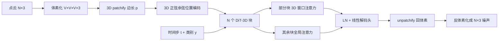

# DiT-3D：把 2D DiT 搬到体素化点云上，用窗口注意力和 ImageNet 微调做 3D 形状生成

<!-- release-date: 2023-07-04 -->

**本文依据**：`DiT-3D: Exploring Plain Diffusion Transformers for 3D Shape Generation`，arXiv:2307.01831v1 [cs.CV]（2023-07-04），19 页 letter。作者 Shentong Mo^{1}（MBZUAI）、Enze Xie^{2}*（通讯，Huawei Noah’s Ark Lab）、Ruihang Chu^{3}（CUHK）、Lewei Yao^{2}、Lanqing Hong^{2}（Huawei Noah’s Ark Lab）、Matthias Nießner^{4}（TUM）、Zhenguo Li^{2}（Huawei Noah’s Ark Lab）。项目页 `https://DiT-3D.github.io`。盘上 PDF 页眉写明 arXiv:2307.01831v1 [cs.CV] 4 Jul 2023。封面页脚写 **Preprint. Under review.** 官方 abs：`https://arxiv.org/abs/2307.01831`，v1 提交日 **2023-07-04**。本文不补会议名。文中数字都标 PDF 页码。本文只读这一份 PDF，不把 2D DiT 原文或后作写成这篇论文。

## 一句话

2D 图像扩散已经把骨干从卷积 U-Net 换成了尽量标准的 Transformer（DiT）。3D 形状扩散当时还几乎全是 U-Net。这篇论文问：同样一套「朴素」扩散 Transformer，能不能直接在点云上做去噪？作者的答案是：点坐标本身太稀疏、太无序，直接训不起来；先把点云体素化，加上 3D 位置编码和 3D patch 嵌入，再用 3D 窗口注意力压住多出来的那一维 token，最后把体素解码回点云噪声。因为块结构和 2D DiT 几乎同构，ImageNet 上训好的 DiT-2D 权重可以当初始化，甚至可以按 DiffFit 只训约 **0.09MB** 参数。ShapeNet 上相对当时最强的点云扩散 LION，Chamfer Distance 口径的 1-NNA 降 **4.59**、Coverage 升 **3.51**（PDF p. 1）。

它解决的不是「再发明一种 3D 扩散」，而是当时把 2D DiT 往 3D 搬时卡死的两件事：**点云没有像素那种网格顺序**，以及 **多一维之后自注意力按 $L^2$ 爆炸**。

## 一、矛盾：2D 已经换骨干了，3D 还停在 U-Net，直接抄 DiT 又抄不过去

2023 年前后，图像扩散里 Transformer 已经证明能画出高质量样本；作者点名的代表是 Peebles 等人的 DiT：用可缩放 Transformer 替换 U-Net，在潜图 patch 上训 2D 潜扩散（PDF p. 1–2）。3D 形状生成这边，早期工作用 Chamfer Distance（CD）和 Earth Mover’s Distance（EMD）这类启发式损失直接优化；后来是 GAN 与流模型；再后来一批人把去噪扩散概率模型（DDPM）接到整形状生成上，例如 PVD 用点–体素表示当 DDPM 输入（PDF p. 1–2）。这些 3D 扩散大多仍用 U-Net 骨干。

把 2D DiT 原样接到点云上，作者说会撞上两堵墙（PDF p. 2）：

1. **点云内在无序**。图像像素有固定邻接；点集合没有。作者还写过：直接在点坐标上训扩散 Transformer，点在 3D 嵌入空间里太稀疏，训不起来（PDF p. 5）。
2. **token 多一维**。体素相对 2D 特征图多一个空间轴，序列长度从 $(I/p)^2$ 变成 $(V/p)^3$，全局自注意力按 $L^2$ 涨，训练时间和显存都扛不住。

所以设计不是「把 DiT 的 2D patch 改成 3D patch」一句话能完。流水线必须先给无序点云一份规则网格，再在网格上做几乎标准的 Transformer 去噪，最后还得回到点云空间去比噪声。图 2 把 2D 潜扩散 Transformer 和 3D 体素扩散 Transformer 并排放：左边吃 $32\times 32\times 4$ 的潜噪声，右边吃 $32\times 32\times 32\times 4$ 的体素噪声（图注里体素通道按他们画的是 4 通道示意；方法节写的输入是 $V\times V\times V\times 3$ 坐标体素）（PDF p. 4–5）。

上图是机制示意，根据 PDF 图 2（p. 4）与第 3.2 节重画，不是实测时间轴。扩散目标在点云空间：网络预测的是 $\epsilon_\theta(x_t,t)$，和加在点上的高斯噪声比均方（PDF p. 4–5）。

读的时候不要带着后来滤镜。这篇是 **Preprint. Under review.**，没有文生 3D 产品线，也没有把 SDF / 网格当主表示；附录自己说还没探这些模态（PDF p. 1、p. 14）。

## 二、相关工作：3D 生成已经会扩散，缺的是「朴素 Transformer 当骨干」

**3D 形状生成**。VAE、GAN、归一化流都做过点云或网格。PointFlow 用连续归一化流从两层层次分布出点；ShapeGF 在梯度场上做分数匹配；GET3D 用 SDF 与纹理场两个潜码直接出带纹理网格（PDF p. 3）。本文主线是：从随机噪声出发的 DDPM 点云生成，**点和形状分布不拆开训**（PDF p. 3）。

**扩散模型**。DDPM 前向逐步加高斯噪声，反向学逆过程。3D 侧：PVD 把 PVCNN 接到点–体素上；LION 用两个 DDPM 分别学全局形状潜变量和点结构潜空间（PDF p. 3）。作者对照的缺口有三条：先前 DDPM 往往按单类训、用 PVCNN 抽 3D 特征、学不出显式的类别条件嵌入，也就没法把单类预训练高效迁到新类（PDF p. 5）。他们要的是：用朴素 Transformer 替换 U-Net 去做从观测点云到高斯噪声的反向过程，并带可学习类别嵌入做多类条件，以及跨模态 / 跨类的参数高效微调（PDF p. 3）。

**扩散里的 Transformer**。DiT 在 Stable Diffusion 的 VAE 潜 patch 上做去噪；U-ViT 把时间、条件和噪声图 patch 都当 token，还加长短跳连；UniDiffuser 用一个 Transformer 同时拟合多种模态分布（PDF p. 3）。这些都还停在 2D。本文声称是第一份在体素化点云上做去噪的朴素扩散 Transformer，并支持跨模态、跨域的参数高效微调（PDF p. 2–3）。

## 三、预备：3D DDPM 公式跟图像那套一样，骨干和表示才是新的

给定形状集合 $S=\{p_i\}$，$M$ 个类别。每个点云 $p_i\in\mathbb{R}^{N\times 3}$，带类别标签。训练时把类别当条件，做无分类器引导，写法跟随 2D DiT（PDF p. 4）。

前向：$q(x_t\mid x_{t-1})=\mathcal{N}(x_t;\sqrt{1-\beta_t}\,x_{t-1},\beta_t I)$。重参数后

$$
x_t=\sqrt{\bar\alpha_t}\,x_0+\sqrt{1-\bar\alpha_t}\,\epsilon,\qquad \epsilon\sim\mathcal{N}(0,I).
$$

反向 $p_\theta(x_{t-1}\mid x_t)=\mathcal{N}(\mu_\theta(x_t,t),\sigma_t^2 I)$。变分下界里两项高斯之间是 KL；把 $\mu_\theta$ 重参数成噪声预测后，简单目标是

$$
L_{\mathrm{simple}}=\lVert\epsilon-\epsilon_\theta(x_t,t)\rVert^2
$$

（PDF p. 4–5，式 1）。采样从 $x_T\sim\mathcal{N}(0,I)$ 逐步抽 $x_{t-1}$。

2D DiT 复习一句话就够：先用现成 VAE 把图压成潜码 $z$，再在 $z$ 的 patch 序列上训 Transformer。本文**不走这条潜码路**。作者明确写：DiT 需要预训练 VAE 的潜码当去噪对象；DiT-3D 的扩散空间直接就是体素化点云（PDF p. 6）。经验观察也写在方法里：把 DiT 直接扩到点云上不行（PDF p. 5）。

## 四、设计：体素网格把无序变成有序，窗口注意力把立方复杂度压下去

### 体素化去噪：先有格子，Transformer 才有邻接可讲

每个 $p_i\in\mathbb{R}^{N\times 3}$ 先体素化成 $v_i\in\mathbb{R}^{V\times V\times V\times 3}$（PDF p. 5）。默认实现 $V=32$，即 $32\times 32\times 32\times 3$（PDF p. 7）。人话：每个格子记的是落在这格里的点的坐标通道，不是 RGB。扩散加噪、网络去噪都在这份密表示上走，最后再反体素化回 $N\times 3$。

消融把这件事钉死了。表 2 第一行：不体素化、直接在点坐标上去噪，Chair 上 1-NNA@CD **99.86**、COV@CD **7.768**，基本没生成出能匹配参考集的形状，还要训 **86.53** 小时。加上体素扩散后 1-NNA@CD 掉到 **67.46**、COV@CD 升到 **38.97**（PDF p. 8 表 2）。正文把相对无体素基线的 1-NNA 降幅写成 32.40@CD 和 30.46「@AUC」（PDF p. 9）；表内第二列是 EMD，AUC 应视为排版笔误，数字以表为准。

### 3D 位置编码与 patch 嵌入：和 2D 一样切块，位置改成三维正弦余弦

体素 $v_i$ 按 $p\times p\times p$ 做 patchify，得到 $L=(V/p)^3$ 个 token。3D 卷积把 patch 映成 $e\in\mathbb{R}^{L\times D}$，再加频率正弦–余弦 **3D** 位置编码，而不是 DiT 的 2D 版（PDF p. 5）。时间嵌入 $t$ 和类别嵌入 $c$ 进块，做多类条件；作者强调这和当时以 U-Net 为骨干的 3D 生成不同（PDF p. 5）。

表 2 第三行：体素已经有了，再加 3D 位置编码，1-NNA@CD 从 67.46 降到 **51.99**，COV@CD 从 38.97 升到 **54.76**（PDF p. 8）。网格给了「谁挨着谁」；3D 位置编码告诉网络这个 patch 在立方体的哪一角。少了后者，卷积切出来的 token 仍缺绝对方位。

可迁移的不是「必须正弦余弦」，而是：**无序集合要先投影到有坐标的规则域，位置编码才有定义；位置编码和表示域是一套，不能沿用 2D 的 $(x,y)$。**

### 3D 窗口注意力：复杂度从 $O(L^2)$ 收到 $O(L^2/R^3)$

全局多头注意力：

$$
\mathrm{Attention}(Q,K,V)=\mathrm{Softmax}\Bigl(\frac{QK^\top}{\sqrt{D_h}}\Bigr)V
$$

$Q,K,V$ 长度都是 $L=(V/p)^3$，复杂度 $O(L^2)$。体素分辨率一升就贵。作者把 2D 窗口注意力扩成 3D：窗口边长 $R$，先把 $K$ reshape 成更短的一组，再线性投回 $D$ 维，于是注意力里的键长度按 $R^3$ 缩小，复杂度写成 $O(L^2/R^3)$（PDF p. 5–6 式 2–3）。默认 $R=4$。文中说启发来自 ViTDet 那一类「朴素 ViT 做检测」的窗口操作（PDF p. 6，参考文献 [36]）。

实现不是每一层都窗口。默认骨干 **S/4**（Small，patch $p=4$），只在部分块（文中写 **0,3,6,9**）用 3D 窗口注意力，其余块仍全局注意力（PDF p. 7）。人话：隔几层做一次便宜的局部混合，中间层仍允许信息跨整个立方体走。窗口注意力与普通注意力**共享参数**，这才方便从 2D DiT 加载权重（PDF p. 2）。

表 2 最后一行：体素 + 3D 位置 + 窗口，训练墙钟从 **91.85** 小时降到 **41.67** 小时，1-NNA@CD **49.11**（PDF p. 8）。正文还写相对最朴素基线，窗口三项一起让训练少 **44.86** 小时（PDF p. 9）。COV 在加窗口后相对「体素+位置、全全局」略降（54.76→52.45 @CD），1-NNA 变好：作者用窗口换算力，质量按 1-NNA 仍涨。

代价也清楚：窗口是近似，远距离依赖要靠那些仍做全局注意力的层补。$R$ 和「哪些层窗口」没有更细的消融表。

### 反体素化解码头：预测必须落回 $N\times 3$

块在体素 token 上算，不能直接用 2D 那种线性头出点云噪声。流程：最后 LN，每个 token 线性成 $p\times p\times p\times L\times 3$ 形状的张量（原文如此书写），unpatchify 成 $V\times V\times V\times 3$，再反体素化成 $N\times 3$ 的 $\epsilon_\theta(x_t,t)$（PDF p. 6）。最后一层线性零初始化，其余跟 ViT 标准初始化（PDF p. 7）。

### 和 2D DiT 的四条差别（作者自己列的）

第 3.4 节四条（PDF p. 6）：

1. 扩散空间是体素化点云，不是 VAE 潜码。
2. 频率 3D 位置编码配 patch 嵌入，强调体素局部性。
3. 自称首次在 DiT 块里用 3D 窗口注意力降复杂度。
4. 最后线性层之后加反体素化，噪声在点云空间对齐。

命名与 2D 对齐：voxel $\in\{16,32,64\}$，patch $\in\{2,4,8\}$，规格 Small / Base / Large / Extra Large。**DiT-3D-S/4** 就是 Small 且 $p=4$（PDF p. 6）。

## 五、2D→3D 与类间迁移：结构像，才能只训 0.09MB

因为和 DiT-2D 的结构、参数高度同构，作者把 ImageNet 上预训练的 DiT 权重装进 DiT-3D 再微调。窗口注意力与普通注意力共享参数，加载才说得通（PDF p. 2）。参数高效设定跟 DiffFit：冻住大部分权重，只训新加的 scale、bias、归一化和类别条件；$\gamma$ 初始化为 1，再乘到冻结层上（PDF p. 6）。训练参数从 **32.8MB** 降到 **0.09MB**（PDF p. 2）。

表 3a，Chair（PDF p. 8）：

| ImageNet 预训练 | 高效微调 | 参数（MB） | 1-NNA@CD | 1-NNA@EMD | COV@CD | COV@EMD |
|---|---|---:|---:|---:|---:|---:|
| 否 | 否 | 32.8 | 51.99 | 49.94 | 54.76 | 57.37 |
| 是 | 否 | 32.8 | 49.07 | 49.76 | 53.26 | 55.75 |
| 是 | 是 | 0.09 | 50.87 | 50.23 | 52.59 | 55.36 |

正文：全量加载 ImageNet 权重后 1-NNA 降 **2.92@CD**、**0.18@EMD**（PDF p. 9）。高效微调参数少两个数量级，1-NNA@CD 从 49.07 回到 50.87，仍优于从零训的 51.99。作者据此说：2D 图和 3D 点云域差很大，ImageNet 表示仍能抬 3D 生成（PDF p. 2）。这是论文里最值得记住的经验判断，不是定理；表 3a 只在 Chair 上。

类间：源类（如 chair）训好的 DiT-3D，按同一套 DiffFit 迁到 airplane、car。表 3b：Airplane→Chair 只训 0.09MB，1-NNA@CD **52.56**，对比 Chair 上全量 32.8MB 的 **51.99**；Chair→Airplane 为 **63.58**，对比 Airplane 全量 **62.81**（PDF p. 8）。「只训 0.09MB 从源类到目标类，各指标仍可比」是引言和第 4.3 节的原话（PDF p. 2、p. 9）。

可迁移启发：**跨模态微调首先要求算子同构（含共享参数的注意力），其次才是冻哪些层。** 没有体素网格和共享注意力，ImageNet 权重没有对应槽位。

## 六、训练 recipe：ShapeNet 三类、Adam、$T=1000$、默认 S/4

数据：ShapeNet 的 Chair、Airplane、Car，跟随 PVD / LION。每个形状从文献 [38] 提供的 5000 点里采 **2048** 点。划分与预处理同 PointFlow，在整个数据集上做全局归一化（PDF p. 7）。

指标：用 CD 与 EMD 算 **1-NNA**（越低越好，兼顾质量与多样性）和 **Coverage（COV）**（越高越好，主要反映多样性）。作者写明：低质量但很散的样本也能把 COV 抬高，所以 COV 不单独当质量（PDF p. 7）。

实现：PyTorch。体素 $32^3\times 3$。Adam，学习率 $1\times 10^{-4}$，batch **128**，**10000** epoch。扩散步 $T=1000$。默认骨干 S/4（PDF p. 7）。论文没写：GPU 型号与卡数、混合精度、EMA 是否使用、无分类器引导的尺度 $s$、体素化时一格多点怎么聚合、反体素化怎么从格子回到 2048 点。没有就标明没有。

附录 A.1 多类：可学习类别嵌入后，Chair+Car+Airplane 一个全局模型，在 Chair 上测 1-NNA@CD **53.35**，对比只训 Chair 的 **51.99**（PDF p. 13 表 5）。作者的点是：不必为每个类各训一个 DDPM。附录图 4：推理采样步扫到 1000 时 Chair 上 1-NNA 最低、COV 最高，并说与 LION 一类 DDPM 结论一致（PDF p. 13）。

## 七、实验：主表对 LION 的 4.59 / 3.51，缩放跟 2D DiT 同一方向

主对比表 1（PDF p. 7）。基线从 r-GAN / l-GAN、PointFlow、SoftFlow、SetVAE、DPF-Net，到 DPM、PVD、LION，再到网格侧 GET3D、MeshDiffusion。DiT-3D 一行：

| 类 | 1-NNA CD | 1-NNA EMD | COV CD | COV EMD |
|---|---:|---:|---:|---:|
| Chair | 49.11 | 50.73 | 52.45 | 54.32 |
| Airplane | 62.35 | 58.67 | 53.16 | 54.39 |
| Car | 48.24 | 49.35 | 50.00 | 56.38 |

Chair 上相对 LION（53.70 / 52.34 / 48.94 / 52.11）：1-NNA@CD **4.59**、1-NNA@EMD **1.61**、COV@CD **3.51**、COV@EMD **2.21**（PDF p. 8）。这就是摘要那句「相对 SOTA 的 1-NNA 降 4.59、COV 升 3.51，在 CD 上评」的出处（PDF p. 1）。正文把 LION 误标成参考文献 [15]（[15] 是 MeshDiffusion）；表 1 与参考文献列表里 LION 是 [13]。数字以表 1 为准。

相对 MeshDiffusion，作者说 Chair 全面更好，用来支撑「用朴素扩散 Transformer 替换 U-Net、从观测点云去噪」这条叙事（PDF p. 8）。相对流模型 DPF-Net，Chair 上 1-NNA@CD 降 **12.89**、COV@CD 升 **7.74**（PDF p. 8）。Airplane 与 Car 同样全面优于表内点云扩散基线。图 1、图 3 是精选高保真多样本；附录图 5 与 SetVAE / DPM / PVD 并排；图 6–8 从噪声到形状的 1000 步过程；图 9–11 更多样本（PDF p. 2、p. 8、p. 13–19）。定性图没有可检索的数字。

**缩放（表 4，PDF p. 9）**。patch $\in\{8,4,2\}$：更小 patch 更好，S 上 $p=2$ 时 1-NNA@CD **51.78**，对比 $p=8$ 的 **53.84**；作者说趋势与 2D DiT 一致。体素 $16\to 64$：1-NNA@CD **54.00→50.32**。规格在 **2000 epoch**（不是主实验的 10000）下 S/4→XL/4：参数 32.8 / 130.2 / 579.0 / **674.7** MB，1-NNA@CD **56.31→51.95**（PDF p. 9）。注意表 4 的 S/4 是 56.31，和表 1 的 49.11 不可比：训练轮数不同，且表 4 这段没写是否开窗口。结论只收到作者允许的粒度：加大模型、加密体素、减小 patch，指标往好的方向走。

## 八、限制、偏见，以及论文没写的东西

附录 C：还没做 SDF、网格，也还没在更大 3D 集上放大；列为未来工作（PDF p. 14）。更广影响：只在 ShapeNet 上训，可能学到数据里的内部偏见，部署要小心（PDF p. 14）。

没写的实现：体素占用怎么从点聚合、空体素怎么表示、反体素化的插值、采样算法是 DDPM 还是 DDIM、引导尺度、硬件与吞吐、窗口注意力 reshape 公式与实现是否一一对应（式 3 的记号在 PDF 里排版很挤）。表 2 正文出现 @AUC，与表头 EMD 不一致。主表把 LION 引用成 [15]。这些当阅读时的缺口，不补实验。

## 九、读完留下的判断

被表支持的：在 ShapeNet Chair / Airplane / Car、2048 点、CD/EMD 的 1-NNA 与 COV 上，默认 DiT-3D 优于表 1 里的 GAN、流、PVD、LION 和两个网格扩散基线；Chair 相对 LION 的 CD 口径 4.59 / 3.51 对得上摘要。体素化是从「训不动」到「能训」的开关；3D 位置编码再抬一截；窗口注意力主要省墙钟，1-NNA 略好、COV 略降。ImageNet 全量初始化在 Chair 上降 1-NNA；DiffFit 用 0.09MB 换可接受的回退。多类一个模型接近单类。采样步 1000 最好。规格 / 体素 / patch 的缩放方向与 2D DiT 同号。

只是作者观察、实验没钉死的：2D 预训练「尽管域差很大仍显著有帮助」只在 Chair 全量微调那一行最干净；窗口公式的严格复杂度与「部分层窗口」如何交互，没有单独拆开。SOTA 只相对于表 1 那一列 2023 年中的点云 / 网格生成基线。

可迁移的三条：

1. 把 2D 架构搬到点云，先解决无序与稀疏，再谈 Transformer 是否可缩放。
2. 多一维之后，$L^2$ 注意力默认不可行；局部窗口加少量全局层，是换算力的第一种手段。
3. 跨模态微调的前提是块同构和参数可加载；冻骨干、只训 scale / bias / 条件，能把 32.8MB 训参收到 0.09MB，质量按 Chair 的 1-NNA 仍接近全量。

## 关键词回看

体素化点云、3D patchify、$L=(V/p)^3$、3D 正弦余弦位置编码、3D 窗口注意力（$R=4$，块 0/3/6/9）、反体素化噪声头、无分类器引导的类别嵌入、DiffFit 式 2D→3D 微调、1-NNA 与 Coverage（CD / EMD）、ShapeNet Chair–Airplane–Car。
