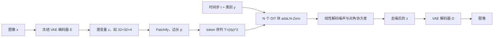

# DiT：用 ViT 式 Transformer 替换扩散 U-Net，用 Gflops 解释 FID 怎么掉下来

<!-- release-date: 2022-12-19 -->

**本文依据**：`Scalable Diffusion Models with Transformers`，arXiv:2212.09748v2 [cs.CV]（2023-03-02），25 页 letter。作者 William Peebles*（UC Berkeley；脚注：工作完成于 Meta AI，FAIR Team 实习期间）、Saining Xie（New York University）。盘上 PDF 页眉写明 arXiv:2212.09748v2 [cs.CV] 2 Mar 2023。官方 arXiv：`https://arxiv.org/abs/2212.09748`。首发日取原件首次公开日，即 arXiv v1 提交日 **2022-12-19**，不因 v2 回写。封面图 1 是类别条件 DiT-XL/2 在 ImageNet $512\times 512$ 与 $256\times 256$ 上的精选样本（PDF p. 1）。第 1 页未印会议名，本文不补。文中数字都标 PDF 页码；标「外部补充」的段落不来自本文。本文只读这一份 PDF，不把后作里的文生图产品线或后续 DiT 变体写进来。

## 一句话

当时最强的一批图像扩散模型，骨干几乎清一色是卷积 U-Net。这篇论文把骨干换成尽量标准的 Vision Transformer（ViT）：先把 VAE 潜图切成 patch，再在 token 序列上做 Transformer 去噪，作者把这类模型叫 **扩散 Transformer（Diffusion Transformers，DiT）**（PDF p. 1–2）。他们不拿参数量当复杂度，而用前向 **Gflops** 看规模：加深加宽、或减小 patch 从而加长 token 序列，Gflops 上去，FID 就下来（PDF p. 1）。最大的 DiT-XL/2 在类别条件 ImageNet $256\times 256$ 上拿到 FID **2.27**，并同时刷新 $512\times 512$ 上此前扩散模型的最好 FID（PDF p. 1、p. 2、p. 8–9）。

它解决的不是「再发明一种扩散」，而是当时扩散社区的一个默认假设：**U-Net 的卷积归纳偏置是画好图所必需的**。作者的判断是：不是。把骨干换成可缩放的 Transformer，样本质量会跟着前向计算量一起走。

## 一、矛盾：扩散已经画得很好，骨干却还停在 2020 年的 U-Net

2022 年前后，Transformer 已经吃掉语言、视觉识别和一批其他领域；图像级生成模型却还在「抗」。自回归模型里 Transformer 用得很广，扩散模型则几乎全部采用卷积 U-Net 当默认骨干（PDF p. 1）。Ho 等人把 U-Net 从 PixelCNN++ 一脉带进扩散：主体是 ResNet 块，低分辨率处再插空间自注意力。Dhariwal 与 Nichol 的 ADM 消融过自适应归一化、通道数，但 **Ho 那套 U-Net 的高层设计基本没动**（PDF p. 2）。

作者要做的事很具体：把架构选择从「神秘」变成可对照的经验基线。他们主张 U-Net 的归纳偏置对扩散表现不是关键，可以换成标准 Transformer；扩散因此能继承别的领域已经验证过的训练配方，以及可缩放、稳健、高效这些性质。统一架构还会打开跨领域研究（PDF p. 2）。DiT 尽量贴着 ViT 的最佳实践，因为 ViT 在识别上已经比传统卷积网络更好扩（PDF p. 2）。

贯穿全文的度量不是参数量。图像模型的参数数不包含分辨率，分辨率却会大幅改写表现。本文主要用理论 Gflops 看复杂度，和架构文献对齐；作者也承认「黄金复杂度」仍取决于场景（PDF p. 3）。Nichol 与 Dhariwal 已经对 U-Net 做过可缩放性与 Gflop 分析；本文把同一把尺子对准 Transformer 这一类（PDF p. 3）。

图 2 左：400K 训练步时，气泡面积表示扩散模型 flops，FID-50K 随模型 flops 稳步下降。右：DiT-XL/2 相对先前 U-Net 扩散（如 ADM、LDM）更算力高效（PDF p. 2）。

上图是机制示意，根据 PDF 图 3（p. 3）与图 4（p. 4）重画，不是实测时间轴。自编码器是现成卷积 VAE，扩散骨干是 Transformer：作者把整条流水线叫混合方案（PDF p. 4）。

读的时候不要带着后来滤镜。正文没有训文生图权重，只在结论里说 DiT 可以当 DALL·E 2、Stable Diffusion 一类模型的即插骨干（PDF p. 9）。那些后作不在这份 PDF 里。

## 二、相关工作：Transformer 在生成里早就有，缺的是「当扩散骨干并看它怎么扩」

Transformer 在语言、视觉、强化学习、元学习里替换了领域专用架构，并在语言侧对模型规模、训练算力与数据表现出可缩放性（PDF p. 2）。图像上，它们被拿来自回归预测像素，也在离散码本上做自回归或掩码生成；前者扩到 200 亿参数仍好看（PDF p. 2）。扩散里也用过 Transformer，但对象往往不是空间图像本身——例如 DALL·E 2 用它合成 CLIP 图像嵌入（PDF p. 2）。本文问的是：Transformer **作为图像扩散骨干**时，规模怎么走。

扩散与基于分数的模型这两年已经在图像上超过曾长期占优的 GAN。改进主要来自采样（尤其无分类器引导）、把模型改成预测噪声、以及低分基座加超分的级联，而不是换骨干——上面列出的扩散模型，U-Net 仍是默认（PDF p. 3）。同期工作 [24] 为 DDPM 提出基于注意力的高效架构；作者声明自己探索的是纯 Transformer（PDF p. 3）。

## 三、预备：扩散公式本文只借 ADM 那一套，不重写 DDPM

高斯扩散的前向过程把数据 $x_0$ 逐步加噪：

$$
q(x_t\mid x_0)=\mathcal{N}\bigl(x_t;\sqrt{\bar\alpha_t}\,x_0,(1-\bar\alpha_t)I\bigr)
$$

重参数后 $x_t=\sqrt{\bar\alpha_t}\,x_0+\sqrt{1-\bar\alpha_t}\,\epsilon_t$，$\epsilon_t\sim\mathcal{N}(0,I)$（PDF p. 3）。反向 $p_\theta(x_{t-1}\mid x_t)=\mathcal{N}(\mu_\theta(x_t),\Sigma_\theta(x_t))$。变分下界在两个高斯之间变成 KL；把 $\mu_\theta$ 重参数成噪声预测网络 $\epsilon_\theta$ 后，简单目标是

$$
L_{\mathrm{simple}}(\theta)=\lVert\epsilon_\theta(x_t)-\epsilon_t\rVert_2^2
$$

若还要学反向协方差 $\Sigma_\theta$，就要优化完整 $D_{\mathrm{KL}}$。作者跟随 Nichol 与 Dhariwal：$\epsilon_\theta$ 用 $L_{\mathrm{simple}}$，$\Sigma_\theta$ 用完整 $L$（PDF p. 3）。采样从 $x_{t_{\max}}\sim\mathcal{N}(0,I)$ 出发，用重参数逐步抽 $x_{t-1}$。

类别条件时反向变成 $p_\theta(x_{t-1}\mid x_t,c)$。无分类器引导把输出读成分数，用

$$
\hat\epsilon_\theta(x_t,c)=\epsilon_\theta(x_t,\varnothing)+s\bigl(\epsilon_\theta(x_t,c)-\epsilon_\theta(x_t,\varnothing)\bigr)
$$

$s>1$ 是引导尺度；$s=1$ 退回普通采样。训练时随机丢掉 $c$，换成可学的空嵌入 $\varnothing$（PDF p. 4）。作者写明：这对 DiT 同样显著抬样本质量。

像素空间高分辨率扩散贵。潜扩散（LDM）先训自编码器，把图压成更小的空间表示 $z=E(x)$，再在 $z$ 上训扩散，采样后再 $x=D(z)$（PDF p. 4）。图 2 显示 LDM 用远少于 ADM 一类像素扩散的 Gflops 就能拿到好结果，所以作者拿它当架构探索的起点。DiT 也可以不加修改用在像素空间；本文实验全部在潜空间（PDF p. 4）。

这一节只是借用。LDM 的感知压缩怎么选 $f$、U-Net 交叉注意力怎么接文本，都不在这篇论文的贡献里。

## 四、设计空间：尽量标准的 ViT，只改条件怎么进块

作者目标是尽量忠于标准 Transformer，好保住可缩放性。因为要建模图像的空间表示，DiT 基于在 patch 序列上工作的 ViT（PDF p. 4）。图 3 是完整前向：潜图 → patchify → 一串 DiT 块 → 线性解码噪声与对角协方差。设计空间三件套：**patch 大小、块结构、模型规格**（PDF p. 5）。

### Patchify：改 $p$ 几乎不改参数量，却会改 Gflops

输入是空间表示 $z$。对 $256\times 256\times 3$ 的图，$z$ 形状是 $32\times 32\times 4$（PDF p. 4）。第一层把每个 $p\times p$ patch 线性嵌成维度 $d$ 的 token，再加 ViT 那套正弦—余弦频率位置编码。token 数

$$
T=(I/p)^2
$$

$I$ 是潜图边长。图 4：$p$ 减半，$T$ 变四倍，Transformer Gflops 至少变四倍。作者强调：这对下游参数量几乎没有实质影响（PDF p. 4）。设计空间加入 $p=2,4,8$。

人话：想加计算量，不必先堆参数。把同一张潜图切得更碎，注意力就要看更长的序列。

### 四种条件块：最后留下 adaLN-Zero

扩散除了噪声潜图，还要吃时间步 $t$、类别 $c$ 等。作者试了四种对标准 ViT 块的小改动（PDF p. 3 图 3、p. 4–5）：

1. **上下文条件（in-context）**。把 $t$、$c$ 的向量嵌成两个额外 token 拼进序列，像 ViT 的 cls。最后一块之后丢掉这两个 token。几乎不增加 Gflops。
2. **交叉注意力**。$t$ 与 $c$ 嵌成长度 2 的另一条序列，自注意力后再加一层多头交叉注意力，类似原版 Transformer，也类似 LDM 用交叉注意力吃类别。开销最大，大约 **15%**（PDF p. 5）。
3. **自适应层归一化（adaLN）**。U-Net 扩散与 GAN 里已经广泛用自适应归一化。这里不直接学逐维 $\gamma,\beta$，而从 $t$ 与 $c$ 嵌入之和回归它们。三种里 Gflops 最少，也是唯一对所有 token 施加同一函数的机制（PDF p. 5）。
4. **adaLN-Zero**。ResNet 文献发现把每个残差块初始化成恒等有好处；扩散 U-Net 也会把残差前最后一层卷积零初始化。adaLN-Zero 除了 $\gamma,\beta$，再回归一组 $\alpha$，乘在残差连接之前。MLP 初始化成对所有 $\alpha$ 输出零向量，于是整块一开始是恒等。相对普通 adaLN，Gflops 可忽略（PDF p. 5）。

实验在第 5 节：四种都拿最高 Gflop 的 DiT-XL/2 训。Gflops 分别是 in-context 119.4、交叉注意力 137.6、adaLN 与 adaLN-Zero 都是 118.6（PDF p. 6）。图 5：全程 adaLN-Zero 的 FID 低于交叉注意力和 in-context；400K 步时 adaLN-Zero 的 FID 几乎只有 in-context 的一半。初始化也关键：恒等初始化的 adaLN-Zero 明显好于普通 adaLN。后文全部用 adaLN-Zero（PDF p. 6）。

为什么 adaLN 会赢交叉注意力，值得停一下。交叉注意力让每个图像 token 去读那两个条件 token，理论上更灵活：不同空间位置可以和 $t$、$c$ 有不同的注意力权重。adaLN 恰恰相反——同一组 $\gamma,\beta$（以及 Zero 版的 $\alpha$）乘到所有 token 上。实验却表明，对类别条件和时间步这种**全局、非空间对齐**的条件，强制共享调制更稳、也更便宜（PDF p. 5–6）。LDM 用交叉注意力吃文本是因为文本是变长 token；这里的 $c$ 只是一个类别嵌入，没必要为它付 15% 的注意力税。

恒等初始化解决的是另一件事。28 层 XL 一开始如果每块都随便改表示，深层很难把「还几乎是噪声」的 $z$ 传到解码头。把 $\alpha$ 置零，等于先允许信号原样穿过，再慢慢学要不要改。这和 U-Net 残差前卷积置零是同一类归纳，只是搬到了 Transformer 块里（PDF p. 5）。

可迁移的不是「必须 adaLN」，而是：**条件怎么注入，会在几乎相同 Gflops 下把 FID 砍半；残差块的恒等初始化在生成 Transformer 里同样值钱**。

### 模型规格：S / B / L / XL

$N$ 个块，隐维 $d$。跟着 ViT 联合缩放 $N$、$d$ 和头数。四个配置（表 1，PDF p. 5；Gflops 按 $I=32,p=4$）：

| 配置 | 层数 $N$ | 隐维 $d$ | 头数 | Gflops |
|---|---:|---:|---:|---:|
| DiT-S | 12 | 384 | 6 | 1.4 |
| DiT-B | 12 | 768 | 12 | 5.6 |
| DiT-L | 24 | 1024 | 16 | 19.7 |
| DiT-XL | 28 | 1152 | 16 | 29.1 |

全文覆盖从 0.3 到 118.6 Gflops（PDF p. 5）。命名规则：配置加潜空间 patch 大小，例如 **DiT-XL/2** 是 XL 且 $p=2$（PDF p. 5）。

### 解码头

最后一块之后，要还原成与输入同形状的噪声预测和对角协方差。标准线性解码：最后一层 LN（若用 adaLN 则是自适应的），每个 token 线性成 $p\times p\times 2C$ 张量，$C$ 是输入通道数，再拼回空间布局（PDF p. 5）。

## 五、训练 recipe：超参几乎原样从 ADM 搬来，VAE 现成冻住

类别条件潜空间 DiT，分辨率 $256\times 256$ 与 $512\times 512$，数据 ImageNet（PDF p. 5）。最后一层线性零初始化，其余用 ViT 标准初始化。优化器 AdamW。学习率恒定 $1\times 10^{-4}$，无权重衰减，batch 256，数据增强只有水平翻转（PDF p. 6）。和许多 ViT 工作不同，他们发现学习率 warmup 和正则都不是训到高性能所必需的；所有配置都稳定，没见到常见的 Transformer 损失尖峰。EMA 衰减 0.9999，所有结果用 EMA 权重。**所有模型大小和 patch 大小用同一套超参**，几乎全部从 ADM 原样留下：没有调学习率、衰减/warmup、Adam $\beta$ 或权重衰减（PDF p. 6）。

扩散侧：现成 VAE 来自 Stable Diffusion / LDM。编码器下采样因子 8：$256\times 256\times 3$ 的 RGB 变成 $32\times 32\times 4$ 的 $z$。本节实验都在这个 $Z$ 空间；采样后再 $x=D(z)$（PDF p. 6）。扩散超参同样留自 ADM：$t_{\max}=1000$，线性方差日程从 $1\times 10^{-4}$ 到 $2\times 10^{-2}$，协方差 $\Sigma_\theta$ 的参数化，以及时间步与标签的嵌入方式（PDF p. 6）。

评测：主指标 FID-50K，**250 步 DDPM 采样**。FID 对实现细节敏感，全部样本导出后用 ADM 的 TensorFlow 评测套件。本节 FID **默认不用无分类器引导**，除非另行声明。次要指标：Inception Score、sFID、Precision/Recall（PDF p. 6）。

实现：JAX，TPU-v3 pod。最重的 DiT-XL/2 在 TPU v3-256、全局 batch 256 上大约 **5.7 iter/s**（PDF p. 6）。

附录 A 补了块内部：时间步先 256 维频率嵌入，再两层 MLP，宽度等于 Transformer 隐维，SiLU。每个 adaLN 把时间步与类别嵌入之和送进 SiLU 和线性层，输出神经元数是隐维的 4 倍（adaLN）或 6 倍（adaLN-Zero）。核心 Transformer 用 GELU（tanh 近似）（PDF p. 12）。

论文没写：具体 ImageNet 预处理以外的数据清洗、多机通信、混合精度细节、以及文生图数据。没有就标明没有。

## 六、缩放实验：真正相关的是 Gflops，不是参数量

### 块设计已经在上一节钉死

其余模型一律 adaLN-Zero。

### 12 个模型：规格 × patch

扫 S/B/L/XL 与 $p\in\{8,4,2\}$。L 与 XL 的相对 Gflops 比其他配置更近（PDF p. 8）。图 2 左是 400K 步时各模型 Gflops 与 FID。所有情况下：**加大模型、减小 patch，扩散都明显变好**（PDF p. 8）。

图 6 上：固定 $p$，加深度宽度，训练全程 FID 都更好。图 6 下：固定规格，减小 $p$（也就是加长 token），参数几乎不变，FID 同样全程下降（PDF p. 7–8）。

### 为什么说关键是 Gflops

固定规格、减小 $p$ 时，总参数基本不变（甚至略降），变的是 Gflops。图 8：400K 步 FID-50K 对模型 Gflops，相关系数 **-0.93**。Gflops 接近的不同配置 FID 也接近，例如 DiT-S/2 与 DiT-B/4（PDF p. 8）。作者的结论：额外的模型计算才是改进 DiT 的关键原料。附录图 12 显示 Inception Score 等指标同样跟 Gflops 强相关（PDF p. 8、p. 13–14）。

图 9：FID 对总训练算力。估算是

$$
\text{训练算力}\approx \text{模型 Gflops}\times\text{batch}\times\text{步数}\times 3
$$

因子 3 把反向大约算成前向的两倍（PDF p. 8）。小模型即使训更久，相对「更大、训更少步」的 DiT 也会算力不经济。只差 $p$ 的模型，即便训练 Gflops 对齐，曲线也不一样：大约 $10^{10}$ Gflops 之后 XL/2 超过 XL/4（PDF p. 8）。

图 7：400K 步、同一份起始噪声 $x_{t_{\max}}$、同一份采样噪声和类别，从 12 个模型各出一张。加深加宽或加 token，观感都明显上去（PDF p. 7）。

附录表 4 把 400K、无引导的 FID-50K 写全（ft-MSE 解码器，不含 VAE 的 84M 编解码参数）（PDF p. 12–13）。摘几行：

| 模型 | Gflops | 参数（M） | FID-50K（无引导，400K） |
|---|---:|---:|---:|
| DiT-S/8 | 0.36 | 33 | 153.60 |
| DiT-S/2 | 6.06 | 33 | 68.40 |
| DiT-B/2 | 23.01 | 130 | 43.47 |
| DiT-L/2 | 80.71 | 458 | 23.33 |
| DiT-XL/2 | 118.64 | 675 | 19.47 |
| XL/2 in-context | 119.37 | 449 | 35.24 |
| XL/2 交叉注意力 | 137.62 | 598 | 26.14 |
| XL/2 adaLN | 118.56 | 600 | 25.21 |

同一张表：256 的 XL/2 训到 2352K 步无引导 FID 10.67，7000K 步 9.62；512 的 XL/2 1301K 步 13.78，3000K 步 11.93（PDF p. 13）。作者写：两个分辨率的 XL/2 都没看到 FID 饱和，能训多久训多久。

图 13：训练损失是噪声 MSE 与 $D_{\mathrm{KL}}$ 之和。Gflops 更大（更大 Transformer 或更多 token）的曲线下降更快、饱和更低，作者把它和语言模型「更大 Transformer 既降损失又抬下游」的趋势对照（PDF p. 13、p. 15）。

## 七、把 XL/2 训满：ImageNet 上的当时最好扩散

缩放分析之后，继续训最高 Gflop 的 DiT-XL/2，256 分辨率 **7M 步**（PDF p. 8）。

### $256\times 256$（表 2，PDF p. 9）

无引导的 DiT-XL/2：FID 9.62、sFID 6.85、IS 121.50、Precision 0.67、Recall 0.67。加无分类器引导后：

| 模型 | FID↓ | sFID↓ | IS↑ | Prec.↑ | Rec.↑ |
|---|---:|---:|---:|---:|---:|
| StyleGAN-XL | 2.30 | 4.02 | 265.12 | 0.78 | 0.53 |
| ADM-G, ADM-U | 3.94 | 6.14 | 215.84 | 0.83 | 0.53 |
| LDM-4-G（cfg=1.50） | 3.60 | — | 247.67 | 0.87 | 0.48 |
| DiT-XL/2-G（cfg=1.25） | 3.22 | 5.28 | 201.77 | 0.76 | 0.62 |
| DiT-XL/2-G（cfg=1.50） | **2.27** | 4.60 | 278.24 | 0.83 | 0.57 |

有引导时，DiT-XL/2 超过此前所有扩散模型，把 LDM 的最好 FID-50K **3.60** 降到 **2.27**（PDF p. 8–9）。图 2 右：XL/2 **118.6 Gflops**，相对潜空间 U-Net LDM-4 **103.6 Gflops** 仍算力高效，远低于像素 U-Net ADM **1120 Gflops**、ADM-U **742 Gflops**（PDF p. 8）。作者还写：相对 LDM-4 与 LDM-8，测试过的所有引导尺度上 XL/2 的 recall 都更高。只训 **2.35M 步**（与 ADM 相近）时 FID 仍是 **2.55**，已经超过先前扩散（PDF p. 9）。FID 2.27 也低于表中 StyleGAN-XL 的 2.30，作者据此称低于此前所有生成模型（PDF p. 9）。

### $512\times 512$（表 3，PDF p. 9）

新训一个 XL/2，**3M 迭代**，超参与 256 相同。$p=2$ 时，$64\times 64\times 4$ 的潜图 patchify 后 **1024** 个 token，**524.6 Gflops**（PDF p. 9）。

| 模型 | FID↓ | sFID↓ | IS↑ | Prec.↑ | Rec.↑ |
|---|---:|---:|---:|---:|---:|
| StyleGAN-XL | 2.41 | 4.06 | 267.75 | 0.77 | 0.52 |
| ADM-G, ADM-U | 3.85 | 5.86 | 221.72 | 0.84 | 0.53 |
| DiT-XL/2 | 12.03 | 7.12 | 105.25 | 0.75 | 0.64 |
| DiT-XL/2-G（cfg=1.25） | 4.64 | 5.77 | 174.77 | 0.81 | 0.57 |
| DiT-XL/2-G（cfg=1.50） | **3.04** | 5.02 | 240.82 | 0.84 | 0.54 |

512 的 Precision/Recall 按前作只用 1000 张真图，作者为对齐也这样做（PDF p. 9）。XL/2 再次超过此前所有扩散，把 ADM 的最好 FID **3.85** 降到 **3.04**。token 变多仍然算力高效：ADM 1983 Gflops，ADM-U 2813，XL/2 524.6（PDF p. 9）。附录表 6 把这些 U-Net 基线的 Gflops 拆开，只计 DDPM 部分（PDF p. 13）：

| 模型 | 分辨率 | 基座 Gflops | 超分器 Gflops | 合计 |
|---|---|---:|---:|---:|
| ADM | $128\times 128$ | 307 | — | 307 |
| ADM | $256\times 256$ | 1120 | — | 1120 |
| ADM | $512\times 512$ | 1983 | — | 1983 |
| ADM-U | $256\times 256$ | 110 | 632 | 742 |
| ADM-U | $512\times 512$ | 307 | 2506 | 2813 |
| LDM-4 | $256\times 256$ | 104 | — | 104 |
| LDM-8 | $256\times 256$ | 57 | — | 57 |

读这张表时要分清两件事。第一，LDM-4 的 104 Gflops 和 DiT-XL/2 的 118.6 已经同量级，所以 2.27 vs 3.60 主要不是「潜空间比像素便宜」——那笔账 LDM 已经付过了——而是骨干从 U-Net 换成更大容量的 Transformer（PDF p. 8）。第二，ADM-U 的超分器单独就比整个 XL/2 贵；级联用低分基座加超分，前向复杂度会在分辨率轴上爆炸，DiT 则靠 VAE 的 $f=8$ 把 $512$ 图变成 $64\times 64\times 4$，再在 1024 个 token 上做自注意力（PDF p. 9、p. 13）。

注意表 3 无引导 FID 12.03 与表 4 的 11.93 差一截：表 4 写明用 ft-MSE 解码器，表 2、表 3 的最终数用 ft-EMA（PDF p. 13）。不要混。

### 采样算力补不回模型算力（第 5.2 节）

扩散独特之处：训完还能靠加采样步数加计算。作者问：小模型多花测试算力，能不能追上大模型？12 个 400K 模型，每张图分别用 16、32、64、128、256、1000 步算 FID-10K（PDF p. 9、图 10）。例子：L/2 用 1000 步，每张图 **80.7 Tflops**；XL/2 用 128 步只要 **15.2 Tflops**（大约 1/5），FID-10K 仍是 XL/2 更好（23.7 vs 25.9）。结论：**把采样算力做大，补不回模型算力的缺口**（PDF p. 9）。

这和「多走几步 DDIM 就能让小 U-Net 赶上」的直觉相反。至少在这篇的 12 个 DiT 上，质量首先由前向 Gflops 决定。

## 八、附录里正文没展开、但会改你怎么复现的细节

**只对部分通道做引导（PDF p. 12）。** 有引导的实验里，他们只对潜变量前三个通道做引导，不是四个。事后发现三通道与四通道相近：三通道尺度 $(1+x)$ 大致对应四通道 $(1+\frac{3}{4}x)$。例子：三通道 1.5 给出 FID-50K **2.27**，四通道 1.375 给出 **2.20**。作者觉得「只引导子集仍能很好」有点意思，留给后作。

**VAE 解码器消融（表 5，PDF p. 13）。** 编码器相同，解码器可热插拔。DiT-XL/2-G、cfg=1.5、ImageNet 256：

| 解码器 | FID↓ | sFID↓ | IS↑ | Prec.↑ | Rec.↑ |
|---|---:|---:|---:|---:|---:|
| original（LDM 原版） | 2.46 | 5.18 | 271.56 | 0.82 | 0.57 |
| ft-MSE | 2.30 | 4.73 | 276.09 | 0.83 | 0.57 |
| ft-EMA | 2.27 | 4.60 | 278.24 | 0.83 | 0.57 |

换回 LDM 原解码器，XL/2 仍超过先前扩散（PDF p. 13）。缩放分析监控用 ft-MSE；表 2、表 3 最终数用 ft-EMA。图 11 精选样本：512 用引导尺度 6.0，256 用 4.0，两者都用 ft-EMA 解码器（PDF p. 12）。

**未筛选样本（图 14–33，PDF p. 16–25）。** 250 步 DDPM + ft-EMA。与先前引导文献一致：尺度越大观感越真、多样性越低（PDF p. 12）。512 展示了尺度 4.0 / 2.0 / 1.5，256 展示了 4.0 / 2.0 / 1.5。这些图是展示，不是新指标。

## 九、结论、限制、论文没写的东西

结论（PDF p. 9）：DiT 是简单的 Transformer 扩散骨干，超过先前 U-Net，并继承 Transformer 的可缩放性。鉴于本文的缩放结果，后作应继续把 DiT 扩到更大模型和更多 token；也可以把它当文生图模型的即插骨干。

正文没有单独的 Limitations 节。能从实验读出的边界包括：

- 主结果是 **类别条件 ImageNet**，不是开放词汇文生图。文生图只作为未来工作出现（PDF p. 9）。
- 2.27 依赖无分类器引导（cfg=1.50）和 ft-EMA 解码器；无引导的 7M 步 XL/2 仍是 9.62（PDF p. 9、p. 13）。
- 512 上 3.04 仍高于 StyleGAN-XL 的 2.41，作者在 512 表上强调的是超过先前 **扩散**（PDF p. 9）。
- 小模型加采样步数追不上大模型——若部署只能上小骨干，别指望用 1000 步补回来（PDF p. 9）。
- 训练在 TPU v3-256 上跑 XL/2；超参几乎不调，不代表换优化器或换数据仍零调参。
- 与 U-Net 的对比建立在 LDM/ADM 的 Gflops 表上，不是逐层重实现所有前作。

封面写 「Code and project page available here」，PDF 正文没有印出 URL。

## 可迁移启发

1. **先换可缩放的骨干，再谈卷积归纳偏置是否神圣。** 扩散质量在这篇里跟 Gflops 走，不跟「必须 U-Net」走。
2. **复杂度用前向 Gflops，不要只用参数量。** 同样 675M，XL/8 与 XL/2 的 FID 完全不是一档（表 4）。
3. **加 token 是一条不涨参数的加计算路径。** $p$ 减半，序列变四倍。显存和注意力代价是边界。
4. **条件注入和残差初始化比再堆一层交叉注意力更划算。** 交叉注意力最贵，却输给 adaLN-Zero。
5. **超参可以从 U-Net 扩散原样搬。** 作者几乎没调 ADM 的 AdamW 配方，稳定性和损失尖峰都不是换骨干后的必然灾难。
6. **测试时加步数补不回训练时没堆的模型算力。** 服务端「小模型 + 很长采样链」在这篇的图 10 上不成立。
7. **引导可以只作用在潜变量的一部分通道。** 这是复现 2.27 时必须对齐的实现细节，不是理论必然。

依赖这篇特定规模/硬件的是：TPU v3-256 上的 7M 步 XL/2、524.6 Gflops 的 512 模型、以及现成 SD/LDM VAE。可直接复用的是设计空间切法（规格 × $p$ × 条件块）和「FID 对 Gflops 作图」的评测习惯。

## 关键词回看

- **DiT**：在（潜）图像 patch token 上做去噪的 Transformer 扩散骨干。
- **Patchify / $p$**：把 $I\times I\times C$ 切成 $T=(I/p)^2$ 个 token；$p$ 主要改 Gflops 不改参数。
- **adaLN-Zero**：从 $t$ 与 $c$ 回归 $\gamma,\beta,\alpha$，并把块初始化成恒等。
- **Gflops vs FID**：本文的主缩放轴，图 8 相关系数 -0.93。
- **DiT-XL/2**：28 层、隐维 1152、$p=2$；256 上 118.6 Gflops，有引导 FID 2.27。
- **无分类器引导**：采样时外推条件与无条件噪声预测之差；表 2 的 2.27 用 cfg=1.50。
- **混合流水线**：卷积 VAE + Transformer DDPM，不是端到端重训自编码器。

## 参考资料

- 本文 PDF：`readings/_src/图像、视频与 3D 生成/DiT.pdf`
- arXiv：https://arxiv.org/abs/2212.09748 （v1 2022-12-19；盘上为 v2，2023-03-02）
