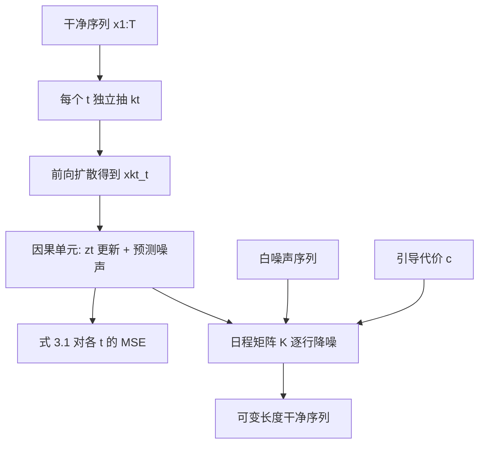

# Diffusion Forcing：给每个 Token 独立加噪，让下一词预测也能走全程扩散引导

<!-- release-date: 2024-07-01 -->

**本文依据**：`Diffusion Forcing: Next-token Prediction Meets Full-Sequence Diffusion`，arXiv:2407.01392v4 [cs.LG]（2024-12-10），35 页 letter。作者 Boyuan Chen（MIT CSAIL）、Diego Marti Monso（Technical University of Munich；脚注写明工作完成于 MIT 访问学生期间）、Yilun Du、Max Simchowitz、Russ Tedrake、Vincent Sitzmann（MIT CSAIL）。盘上 PDF 页眉写明 arXiv:2407.01392v4 [cs.LG] 10 Dec 2024。第 1 页印有 **38th Conference on Neural Information Processing Systems (NeurIPS 2024)**。摘要末给出项目页：`https://boyuan.space/diffusion-forcing`（PDF p. 1）。官方 arXiv：`https://arxiv.org/abs/2407.01392`。首发日取原件首次公开日，即 arXiv v1 提交日 2024-07-01，不回写成 v4 日期。文中数字都标 PDF 页码；标「外部补充」的段落不来自本文。本文只读这一份 PDF。

## 一句话

**Diffusion Forcing（扩散强迫）** 不是再发明一种去噪网络，而是换训练方式：同一条序列里，每个 Token 抽自己的噪声档，模型必须在「过去有的干净、有的半糊、有的全噪」的任意组合上去噪（PDF p. 1）。落到序列上，作者做成 **因果扩散强迫（Causal Diffusion Forcing，CDF）**：用因果骨干（正文最小实现是 RNN）按下一 Token（或下几个 Token）去噪，采样时再在一张二维日程表上，让不同时刻走不同噪声日程（PDF p. 1–2、p. 4–5）。

它同时要下一 Token 模型的可变长度、可变历史，以及全程扩散的轨迹引导。额外能力写在摘要里：连续 Token（例如视频）可以滚出训练视野之外而不像基线那样散掉；决策与规划里，可变视野加因果结构还能做 **蒙特卡洛引导（Monte Carlo Guidance，MCG）**；训练目标被证明是对「按前向过程加噪后的序列」对数似然的变分下界的一种重加权，并且在适当条件下，也同时给所有噪声档序列、从而给训练集里所有子序列的似然一个下界（PDF p. 1、p. 5、附录 A）。

它解决的不是「视频扩散能不能画」，而是 2024 年前后两条主流序列生成路线各缺一块：教师强迫的下一 Token 模型没法对整段未来做引导，连续域一滚出训练长度就散；全程扩散能引导、能画连续信号，但骨干非因果、长度锁死（PDF p. 1–2）。朴素地把下一 Token 模型拿去训全程扩散也不行：早 Token 的一点不确定，后面必须更不确定，统一噪声档学不到这件事（PDF p. 2）。

## 一、矛盾：下一 Token 能变长，全程扩散能引导，两边不能直接拼

概率序列模型横跨语言、视频预测和决策（PDF p. 1）。下一 Token 模型有几件全程扩散做不到的事：变长生成（一个 Token 或自回归滚「无限」长）、可变长度历史、树搜索、在线反馈控制（PDF p. 1）。它们通常用 **教师强迫（teacher forcing）** 训：历史给真值，只预测紧邻下一步（PDF p. 1）。两条硬伤跟着来（PDF p. 1–2）：

1. 没有机制把整段采样往某个目标推。过去必须先定死，才能抽未来，多步引导进不去。
2. 连续数据上自回归不稳。视频这种连续帧（相对文本或向量量化码）一滚过训练视野，帧间小误差会堆起来，模型散掉。

全程扩散看起来像解药。视频和长视野规划里，常见做法是把固定个数 Token 拼起来一起扩，所有 Token 同一噪声档（PDF p. 2）。它能做扩散引导，决策里很值钱；连续信号（视频）也画得好。但骨干几乎一律非因果、不掩码：采样只能出整段，长度不能变。图 1 把引导、树搜索、可组合性、因果不确定、灵活视野列成能力表：教师强迫、全程扩散、Diffusion Forcing 各占一截，作者主张最后一行两边都要（PDF p. 2 图 1）。

把下一 Token 模型直接训成「整段同一档去噪」，作者说生成差。直觉是：前面 Token 若还有不确定，后面 Token 的不确定必须更大；统一噪声档不建模这件事（PDF p. 2）。

加噪在作者眼里是一种 **部分掩码**：噪声为零等于没掩，纯噪声等于整块掩掉（PDF p. 2）。Diffusion Forcing 强迫模型对任意一堆「噪声档各不相同」的 Token 做反掩码（PDF p. 2 图 2）。预测再拆成下一 Token（或下几个）的组合，长度可变，也能把训练时见过的子轨迹拼成新轨迹（PDF p. 2）。

贡献收成四条（PDF p. 2）：

1. 一种概率序列模型：下一 Token 的灵活度，加全程扩散那种长视野引导。
2. 一套决策框架：同一模型既当策略，也当规划器。
3. 形式证明：在适当条件下，训练目标最大化训练时见到的所有子序列联合分布似然的一个下界。
4. 视频、基于模型的规划、视觉模仿、时间序列上的实验，以及稳定长滚出、按用户定的记忆视野组合子序列、MCG 等能力。

读的时候不要套后作滤镜。正文最小实现是 vanilla RNN，Transformer 放到附录 B.1 当延伸，没有互联网规模消融（PDF p. 4、p. 10）。AR-Diffusion、Rolling Diffusion 是相关工作，噪声档沿时间线性绑定，采样必须跟训练同一套日程，作者认为那正好缺独立噪声才能做的稳定自回归与损坏观测条件（PDF p. 3–4、附录 C）。

把训练和采样画成人能跟住的图（机制示意，根据 PDF p. 3 图 2 与 p. 5 算法 1–2 重画，不是实测时间轴）：

时间轴是序列，噪声轴是扩散。两轴交织，是全文的中心图景（PDF p. 3）。

## 二、背景：滤波一条轴，扩散另一条轴

相关工作先把两套语言钉死（PDF p. 3）。下标 $t$ 是时间；上标 $k$ 是不确定（噪声档）。观测 $x\in\mathcal{X}$，隐状态 $z\in\mathcal{Z}$。

**贝叶斯滤波。** 隐马尔可夫模型里，先验 $p(z_{t+1}\mid z_t)$ 只凭当前隐状态猜下一步，观测模型 $p(x_t\mid z_t)$ 从隐状态出观测，新观测来了再用后验 $p(z_{t+1}\mid z_t,x_{t+1})$ 更新。端到端神经网络里，隐状态不必对应物理量，只要能概括过去、预测未来观测（PDF p. 3）。

**扩散。** 数据 $x^0\equiv x\sim q$。前向马尔可夫链逐步加高斯噪声（PDF p. 3 式 2.1）：

$$
q(x^k\mid x^{k-1})=\mathcal{N}\bigl(x^k;\sqrt{1-\beta_k}\,x^{k-1},\beta_k I\bigr)
$$

$\{\beta_k\in(0,1)\}_{k=1}^K$ 是方差日程，$x^K$ 近乎纯噪声。反向也是马尔可夫，均值用网络，协方差可取与 $k$ 有关的常数倍单位阵（PDF p. 3 式 2.2）。正文采用噪声预测重参数，最小二乘目标是 $L(\theta)=\mathbb{E}_{k,x^0,\epsilon}\|\epsilon^k-\epsilon_\theta(x^k,k)\|^2$（PDF p. 3 式 2.3）。采样走朗之万一步。

**引导。** 分类器引导把朗之万梯度改成 $\epsilon_\theta(x^k,k)-\sqrt{1-\bar\alpha_k}\nabla_{x^k}\log c(y\mid x^k)$，不必训条件模型也能偏向标签 $y$；决策里也用过最小二乘能量（PDF p. 3–4）。

**下一 Token。** 连续数据常最小化 $\|\hat x-x\|^2$，离散走交叉熵。采样时把 $\hat x_{t+1}$ 当 $x_{t+1}$ 再往下滚。过去必须完全确定，才能抽未来，多步引导进不去（PDF p. 4）。

**序列上的扩散。** Diffusion-LM 用全程扩散做可控文本；Video Diffusion Models 用滑窗滚更长视频；Diffuser 把全程扩散当离线强化学习规划器；TimeGrad 在教师强迫下对下一 Token 去噪；AR-Diffusion 用因果骨干做文本全程扩散，噪声档沿时间线性相关。详细对比在附录 C（PDF p. 4）。

## 三、方法：独立噪声档 + 因果骨干

### 加噪就是部分掩码

掩码是挡住一部分数据再恢复。任意一堆 Token 都可以按下标 $t$ 排成有序列。教师强迫等于沿时间轴掩当前 Token、从 $x_{1:t-1}$ 预测。全程前向扩散则是沿噪声轴部分掩码：扩 $K$ 步之后 $x^K_{1:T}$ 近似白噪声，原数据信息没了（PDF p. 4）。

统一记号：$x_{1:T}$ 是序列；$x^{k_t}_t$ 是 $x_t$ 在前向过程式 2.1 下噪声档 $k_t$ 的版本；$x^0_t$ 干净，$x^K_t$ 是 $\mathcal{N}(0,I)$。于是 $(x^{k_t}_t)_{1\le t\le T}$ 是一串各带自己噪声档的观测，$k_t$ 就是该 Token 被加噪掩到什么程度（PDF p. 4）。

### Diffusion Forcing 本身

框架要训、要采任意长度的噪声 Token 序列，每个时刻的 $k_t$ 可以不同（PDF p. 4）。正文聚焦时间序列，骨干因果（$x^{k_t}_t$ 只依赖过去的噪声 Token），称作 CDF。最小实现是 vanilla RNN；Transformer 放到附录 B.1（PDF p. 4）。

RNN 权重 $\theta$，隐状态 $z_t$ 概括过去。更新是马尔可夫的：$z_t\sim p_\theta(z_t\mid z_{t-1},x^{k_t}_t,k_t)$。$k_t=0$ 时这就是滤波后验更新；$k_t=K$ 时输入是纯噪声、无信息，等价于先验 $p_\theta(z_t\mid z_{t-1})$（PDF p. 5）。给定 $z_t$，观测模型 $p_\theta(x^0_t\mid z_t)$ 预测干净 $x_t$。脚注：实现里 $z_t$ 取确定性，表示信念分布而不是一次抽样，才能对式 3.1 反传（PDF p. 5）。

这个单元的输入输出和一个条件扩散模型一样：条件变量 $z_{t-1}$，噪声 Token $x^{k_t}_t$，预测干净 $x_t$，再仿射重参数得到噪声。因此可以直接用常规扩散目标。噪声预测写作 $\epsilon_\theta(z_{t-1},x^{k_t}_t,k_t)$，最小化（PDF p. 5 式 3.1）：

$$
\mathbb{E}_{k_t,x_t,\epsilon_t}\sum_{t=1}^{T}\bigl\|\epsilon_t-\epsilon_\theta(z_{t-1},x^{k_t}_t,k_t)\bigr\|^2
$$

其中 $z_t\sim p_\theta(z_t\mid z_{t-1},x^{k_t}_t,k_t)$，$k_{1:T}$ 从 $[K]^T$ 均匀抽，$x_{1:T}$ 来自训练数据，$\epsilon_t$ 按前向过程抽。算法 1 是伪代码（PDF p. 5）。损失同时装了滤波和条件扩散。附录 D.1 把常见扩散训练技巧重推到这个设定，视频实验特别有用；附录 B.2 解释为什么 $k_{1:T}$ 要均匀独立抽（PDF p. 5）。

**定理 3.1（非正式）。** 算法 1 优化的是对期望对数似然 $\ln p_\theta((x^{k_t}_t)_{1\le t\le T})$ 的 ELBO 的一种重加权；期望对噪声档 $k_{1:T}\sim[K]^T$ 以及按前向过程加噪的 $x^{k_t}_t$ 取。而且在适当条件下，优化式 3.1 也同时最大化所有噪声档序列似然的一个下界（PDF p. 5）。

一个特例：每个 $k_t$ 只能是 $0$ 或 $K$。于是可以掩掉任意过去 Token，模型仍应采到正确条件分布，也就是训练集所有可能子序列的分布（PDF p. 5–6）。这就是摘要里「子序列变分下界」那句话的正文落点；严格 ELBO 在附录 A。

### 采样：一张 $M\times T$ 的噪声日程表

算法 2 用日程矩阵 $K\in[K]^{M\times T}$：列是时刻 $t$，行 $m$ 规定这一轮该 Token 要到哪一档。$K_{m,t}$ 是第 $m$ 行、时刻 $t$ 的目标噪声档。整段长度 $T$ 的生成：先把 $x_{1:T}$ 初始化成白噪声（档 $K$），再按行从上往下、行内从左到右降到 $K$ 规定的档；最后一行 $m=0$ 时 $K_{0,t}\equiv 0$，Token 干净（PDF p. 6）。边角情况在附录 D.5；$(\alpha_k,\bar\alpha_k,\sigma_k)$ 取标准值。因为训练时见过所有噪声档组合，$K$ 可以在不重训的前提下换成不同行为（PDF p. 6）。

算法 2 还接受初始隐状态 $z_0$ 和引导代价 $c(\cdot)$：每走完一行，可对部分扩散的 $x_{1:H}$ 加 $\nabla_x\log c$（PDF p. 5 算法 2）。

## 四、新能力：稳定滚出、未来留不确定、长视野引导

**稳定自回归。** 高维连续序列（视频）自回归容易散，尤其滚过训练长度。Diffusion Forcing 更新隐状态时，不用完全干净的上一帧，而用带一点点噪声的 Token：$0<k\ll K$。实验 4.1 显示长视野明显更好；直觉在附录 B.4（PDF p. 6）。附录把这解释成行为克隆里给模仿者看噪声观测（DART），以及 HINT 的理论保证方向；Transformer 实现里也可以对已扩散 Token 再做一次前向加噪来稳定（PDF p. 20）。

**让未来保持不确定。** 从 $[x^K_1,x^K_2,x^K_3]^\top$ 出发，可以先把第一个 Token 去干净、第二个只去一半，得到 $[x^0_1,x^{K/2}_2,x^K_3]^\top$，再变成 $[x^0_1,x^0_2,x^K_3]^\top$，最后全干净。噪声档读成不确定：近处比远处更确定。这种「之字形」采样让后面的引导更有效（PDF p. 6）。

**长视野引导。** 算法 2 第 10 行可对部分扩散轨迹加引导。未来依赖过去，未来 Token 上的梯度能沿时间回传。独特之处：未来可以在过去尚未完全去噪时先扩，梯度因此能改过去 Token 的采样——既做长视野引导，又尊重因果。实现细节附录 B.3；规划实验 4.2 显著好于被引导的全程扩散（PDF p. 6）。

附录 B.8 用长度 3、3 步 DDIM 把教师强迫、全程扩散、因果不确定、稳定滚出写成具体噪声表，说明同一套训练模型采样时可以切换这些日程，不必重训（PDF p. 21–22）。

## 五、决策：同一套模型既当策略也当规划器

马尔可夫决策过程：动力学 $p(s_{t+1}\mid s_t,a_t)$，观测 $p(o_t\mid s_t)$，奖励 $p(r_t\mid s_t,a_t)$。目标是策略 $\pi(a_t\mid o_{1:t})$ 最大化期望累计奖励 $\mathbb{E}[\sum_{t=1}^{T}r_t]$。Token 取 $x_t=[a_t,r_t,o_{t+1}]$。轨迹 $x_{1:T}$ 长度可变，训练仍是算法 1（PDF p. 6）。

执行时，过去干净 Token $x_{1:t-1}$ 收成 $z_{t-1}$。条件这个隐状态，用算法 2 采一段计划 $\hat x_{t:t+H}$，其中 $\hat x_t=[\hat a_t,\hat r_t,\hat o_{t+1}]^\top$。$H$ 是前瞻窗，类似模型预测控制。执行 $\hat a_t$ 后环境给 $r_t$ 和 $o_{t+1}$，下一 Token 是 $x_t=[\hat a_t,r_t,o_{t+1}]^\top$，隐状态按后验 $p_\theta(z_t\mid z_{t-1},x_t,0)$ 更新（PDF p. 6–7）。

三条灵活度（PDF p. 7）：

**灵活规划视野。** (a) 每步顺序选动作，任务视野可变；(b) 把 $H$ 缩短当低延迟策略，拉长做长视野规划（靠下面的引导），不改架构、不重训。全程扩散如 Diffuser 锁死整段视野，做不到 (a)；扩散策略需要固定的小前瞻，做不到 (b)。

**灵活奖励引导。** 附录 B.3：任何定义在未来步上的奖励都能当 $\log c$。整段稠密 $\sum_{t=1}^{T}r_t$、前瞻窗稠密 $\sum_{t'=t}^{t+H}r_{t'}$、稀疏目标 $-\|o_T-g\|^2$。逐步策略用不上最后这种长视野引导。

**蒙特卡洛引导。** 因果结构让 Token $x^{k}_t$ 能被整段未来 $x_{t+1:T}$ 的分布引导。算梯度时不抽一条未来，而抽多条、平均梯度。这叫 MCG。精神类似 MPPI 一类射击法：$x^{k}_t$ 被所有未来结果的期望奖励推，而不是被一条样本推。未来 Token 在近处去噪时保持高噪声（之字形），MCG 更强。附录 B.5 说明全程扩散在同一噪声档上没有明显随机源来做这种蒙特卡洛估计（PDF p. 7、p. 21）。

## 六、实验：视频、迷宫、组合、真机、时间序列

数据集与复现细节在附录；视频结果在项目页（PDF p. 7）。

### 视频：训练视野之外还不散

卷积 RNN 版 CDF，数据是 Minecraft 游戏录像与 DMLab 导航，来自 TECO 用过的那套（PDF p. 7、附录 F.1）。采样用 3.3 节的稳定自回归。两个基线共用同一套 RNN：教师强迫的下一帧扩散，以及因果全程扩散（PDF p. 8）。

图 3：从未见过的帧往外滚。Diffusion Forcing 在训练视野之外仍时间一致，例如滚到 1000 帧；教师强迫和全程扩散很快散。训练视野内，全程扩散还有帧间跳变；Diffusion Forcing 的滚出是在一致的三维环境里做自我运动（PDF p. 7–8）。

附录 E.3：不必滑窗、也不重置 $z_0$，RNN 连续滚。可视化长度 180 帧；Minecraft 训练最长 72 帧，DMLab 训练 36 帧（图注）或附录 F.1 写子序列 48 帧，能滚到训练长度的约 2–5 倍。作者还试过 2000 帧，两边都没有吹掉。Minecraft 偶尔整屏卡在泥土块上，他们归为数据问题，转身之后能恢复（PDF p. 28）。Minecraft 分辨率 128、子序列 72 帧，丢掉配对动作以增加随机性，算力只够大约 10% 子序列；DMLab 分辨率 64（PDF p. 31–32）。

### 规划：MCG、因果不确定、灵活视野

离线强化学习基准 D4RL，二维迷宫稀疏奖励：随机起点走到指定目标。附录 E.5 写环境。数据是迷宫里的随机走，因而随机。每个迷宫一个模型（PDF p. 8）。

表 1 数字（PDF p. 8；$\pm$ 为表中标准差）：

| 环境 | MPPI | CQL | IQL | Diffuser* | Diffuser 执行扩散出的动作 | 本文无 MCG | 本文 |
|---|---:|---:|---:|---:|---:|---:|---:|
| Maze2D U-Maze | 33.2 | 5.7 | 47.4 | 113.9 ± 3.1 | 6.3 ± 2.1 | 110.1 ± 3.9 | 116.7 ± 2.0 |
| Maze2D Medium | 10.2 | 5.0 | 34.9 | 121.5 ± 2.7 | 13.5 ± 2.3 | 136.1 ± 10.2 | 149.4 ± 7.5 |
| Maze2D Large | 5.1 | 12.5 | 58.6 | 123.0 ± 6.4 | 6.3 ± 2.1 | 142.8 ± 5.6 | 159.0 ± 2.7 |
| 单任务平均 | 16.2 | 7.7 | 47.0 | 119.5 | 8.7 | 129.67 | 141.7 |
| Multi2D U-Maze | 41.2 | — | 24.8 | 128.9 ± 1.8 | 32.8 ± 1.7 | 107.7 ± 4.9 | 119.1 ± 4.0 |
| Multi2D Medium | 15.4 | — | 12.1 | 127.2 ± 3.4 | 22.0 ± 2.7 | 145.6 ± 6.5 | 152.3 ± 9.9 |
| Multi2D Large | 8.0 | — | 13.9 | 132.1 ± 5.8 | 6.9 ± 1.7 | 129.8 ± 1.5 | 167.1 ± 2.7 |
| 多任务平均 | 21.5 | — | 16.9 | 129.4 | 20.6 | 127.7 | 146.2 |

Diffuser* 表示实现里丢掉生成的动作，用手写 PD 控制器从生成状态反推动作；直接执行生成动作则崩掉（PDF p. 8）。去掉 MCG 后成绩下降，但仍有竞争力（PDF p. 8）。

因果：决策会执行、会收反馈，近处动作比远处重要。Diffuser 生成的状态–动作彼此不因果一致。Diffusion Forcing 的原始动作自洽，甚至超过「Diffuser 状态 + 手写 PD」（PDF p. 9）。

灵活视野：许多 RL 任务视野固定，智能体往前走时规划窗应缩短。Diffusion Forcing 天生能缩；全程模型即使用替换技巧也差，附录 B.6 说替换条件既不经济（只剩一步仍要扩整段），也被 Video Diffusion Models 指为数学上不干净、序列会不一致（PDF p. 9、p. 21）。

图 1 上半：采样时远未来噪声档高于近未来；Diffuser 全程同一档（PDF p. 8）。

附录 D.8 提醒：回合奖励不一定公平。数据里没有「到目标后停住」，规划方法到了还会走。Diffuser 若生成很慢的计划，会在目标附近多待几步、把奖励刷高。作者鼓励后作改用「第一次到达目标的时间」（PDF p. 25）。迷宫观测 4 维（位置+速度），动作 2 维加速度，目标半径 0.5 内奖励 1 否则 0；三个环境 ID 为 maze2d-medium-v1、maze2d-large-v1、maze2d-umaze-v1（PDF p. 32）。引导不用数据集奖励，而用 $\sum_t\|p_t-g\|$，让任意时刻都可能当终点；同一目标 Diffuser 调了也不好使（PDF p. 24–25）。

### 组合生成：改采样日程，不改模型

二维正方形平面上，轨迹从一角到对角，训练集呈十字。图 1 / 附录图 7：要忠实复制十字，就让 HMM 满记忆、用全视野采样；要组合出 V 形（把十字的两段子轨迹缝起来），就用 MPC 出短计划、不要记忆（PDF p. 9、p. 27）。正文把定量图放到附录 E.2。

### 真机：有记忆的模仿，观测坏了也能用先验

Franka 臂，三个槽位交换苹果和橙子，必须借用第三槽。水果初始槽位随机，因此存在两种目标。图 4：一个水果已在第三槽时，单帧看不出下一步，必须记住初始配置（PDF p. 9）。相对常见行为克隆，DF 把记忆放在隐状态里。成功率 **80%**；无记忆的扩散策略失败（PDF p. 9）。文中未给扩散策略的成功百分数，只写失败。

观测缺失或噪声：执行时加视觉干扰甚至完全挡住相机。把这些观测标成 $k>0$（「这帧不可信」），模型更多靠先验。成功率只降 **4** 个点到 **76%**。下一帧扩散基线必须把扰动观测当真值，成功率 **48%**（PDF p. 9–10）。图 4 还显示：同一模型从单帧合成机器人执行过程的视频，把扩散策略/模仿和视频生成放在一个模型里，给无标注视频预训练留了口子（PDF p. 10）。这是作者的展望，不是已做的大规模预训练实验。

附录 F.3：150 条专家演示，VR 遥操作加阻抗控制；两种初始配置各一半；手眼相机 + 正面相机；6 自由度手部动作。每条 500–600 帧，训练用整段，但相邻帧太像，填充并下采样到 40 帧，每帧捆绑 15 个动作（PDF p. 33）。干扰实验：训练集没有目标袋，测试时把袋子扔上桌（PDF p. 30、p. 35 图 16）。失败模式是不再对物体随机位置的视觉线索作出反应，没有因为干扰而乱动（PDF p. 30）。

### 时间序列：当通用序列模型并不亏

附录 E 按文献设定，在多元时间序列预测上与先前扩散（TimeGrad）和 Transformer（Transformer-MAF）等比。表 2 报测试集 CRPS$_{\mathrm{sum}}$（越低越好），本文五种子、均值±标准差（PDF p. 26–27）：

| 方法 | Exchange | Solar | Electricity | Traffic | Taxi | Wikipedia |
|---|---:|---:|---:|---:|---:|---:|
| Transformer-MAF | 0.005 ± 0.003 | 0.301 ± 0.014 | 0.021 ± 0.000 | 0.056 ± 0.001 | 0.179 ± 0.002 | 0.063 ± 0.003 |
| TimeGrad | 0.006 ± 0.001 | 0.287 ± 0.020 | 0.021 ± 0.001 | 0.044 ± 0.006 | 0.114 ± 0.020 | 0.049 ± 0.002 |
| ScoreGrad sub-VP SDE | 0.006 ± 0.001 | 0.256 ± 0.015 | 0.019 ± 0.001 | 0.041 ± 0.004 | 0.101 ± 0.004 | 0.043 ± 0.002 |
| 本文 | 0.003 ± 0.001 | 0.289 ± 0.002 | 0.023 ± 0.001 | 0.040 ± 0.004 | 0.075 ± 0.002 | 0.085 ± 0.007 |

除 ScoreGrad 外全面更好；与 ScoreGrad 总体打平，Wikipedia 上本文第四。作者强调时间序列不是核心应用，只说明换目标没有明显亏（PDF p. 27）。GluonTS 数据特征见表 3：Exchange 维数 8、6071 步、预测 30；Solar 137 维、7009 步、24；Electricity 370、5833、24；Traffic 963、4001、24；Taxi 1214、1488、24；Wikipedia 2000、792、30（PDF p. 35）。验证 CRPS-sum 连续 6 个 epoch 不升则早停；架构 1 个 MLP + 4 个 GRU，批大小 32（PDF p. 26）。

## 七、实现清单：损失加权、骨干、日程、算力

这些在附录 D，正文实验依赖它们。

**融合 SNR 重加权。** 图像扩散常用 SNR 重加权加速。这里条件 $z_{t-1}$ 本身可能已含 $x_t$ 的大量信息（确定性马尔可夫、上一帧 $k_{t-1}=0$ 时，后验几乎已决定 $x^0_t$）。作者把逐步 SNR 因子 $S_t\in[0,1]$（min-SNR 再除上界）和指数衰减 $\gamma\in(0,1)$ 合成累积 $\bar S_t=\gamma\bar S_{t-1}+(1-\gamma)S_t$，再按独立事件合成 $S'_t=1-(1-S_t)(1-\bar S_{t-1})$。视频预测靠它加速收敛；非图像域没看到提升，不用（PDF p. 23）。

**架构。** 视频：$x$ 与 $z$ 都是二维特征图，同宽高。转移用扩散 U-Net，U-Net 输出进 GRU，$z_{t-1}$ 当 GRU 隐状态，GRU 输出当 $z_t$。观测模型一层 ResNet 再卷积。$z$ 通道：DMLab 16，Minecraft 32。Minecraft 约 **3600 万** 参数，DMLab 约 **2400 万**；迷宫规划 **433 万**。非空间数据用残差 MLP + GRU（PDF p. 23–24）。

**参数化。** 视频用 $v$ 预测，对收敛和画质都必要；规划和模仿更吃 $x^0$ 预测（不强调高频）；时间序列也看到 $v$ 的好处（PDF p. 24）。

**噪声日程。** 视频 sigmoid，迷宫规划线性，其余余弦（PDF p. 24）。

**采样加速。** 每 Token 用 DDIM。训练扩散步 $K=1000$，采样视频 100 步 DDIM，非视频 50 步。帧堆叠：DMLab 4，Minecraft 8，迷宫 10。算法 2 第 8 行直接把 $z^{\mathrm{new}}_t$ 赋给 $z_t$，不算后验，计算减半，且正好实现「用略高噪声档的隐状态」那种稳定滚出（PDF p. 25）。

**金字塔日程。** 附录式 D.1：远未来噪声档始终不低于近未来，称为金字塔调度，用于因果规划（PDF p. 25）。

**算力。** 全部 fp16 混合精度。时间序列、迷宫、组合、视觉模仿可单卡 2080 Ti 11GB；迷宫/组合批大小 2048，视觉模仿 32；通常 5 万–10 万步收敛，约 4–8 小时。视频：8 张 A100，5 万步，批大小 $8\times 16$，约 12 小时，常在 4 万步收敛（PDF p. 26）。

## 八、理论：ELBO 在说什么，子序列界从哪来

附录 A 是正文定理 3.1 的展开。前向过程任意马尔可夫 $q(x^{1:K}\mid x^0)=\prod_k q(x^k\mid x^{k-1})$；生成模型满足马尔可夫：$z_{t-1}$ 对当前噪声观测是充分统计。确定性隐状态时，要把 $z_t$ 理解成按历史噪声档 $k_{1:t}$ 索引的一簇变量，否则不同噪声史无法对应同一个联合概率（PDF p. 13–14 注记 1）。

**定理 A.1。** 对固定干净序列 $x^0_{1:T}$，在均匀噪声档与前向加噪下，$\mathbb{E}[\ln p_\theta((x^{k_t}_t)_{1\le t\le T})]$ 被一项只依赖数据的常数，加上对每个 $t$ 的「$k_t=0$ 时的重建对数似然」和「各反向步 KL」的平均从下面托住。不等式只有两处：隐状态非确定性时松一道；变分 $p_\theta(x^{k_t}_{t:T}\mid x^{k_t}_t,z_{t-1})$ 不等于真条件时再松一道。两处都紧时，ELBO 成为等式（PDF p. 14）。作者说「居然只有两个不等式」，当作目标不算弱（PDF p. 14–15）。

**推论 A.2。** 高斯扩散、$x^0$ 预测时，KL 变成加权 $\| \hat x^0_\theta-x^0_t\|^2$。$\epsilon$ 预测、$v$ 预测仿射等价，可同样写。隐状态足够表达时，各时刻项在充分统计下解耦，加权系数对优化无关，可以丢掉或重标定——这给式 3.1 和算法 1 背书（PDF p. 15）。

**定理 A.3。** 噪声档不必均匀 i.i.d.，任意分布 $D$（可时间相关）仍有同类下界，高斯情形同样落到加权 $x^0$ 误差。$D$ 退化成一条固定噪声档序列时，训练目标不必仍是那条序列似然的下界，但下界里出现的项（重加权后）是训练损失的子集。网络充分表达、能把各项一起压到最小时，优化式 3.1 是最大化所有可能噪声序列似然的合法代理——包括 $k_t\in\{0,K\}$ 那种子序列（PDF p. 15–16）。

证明细节（展开隐状态、望远镜 KL、对均匀 $k_t$ 取期望）在 A.2，解读不必逐步重推；要记住的判断是：独立噪声档不是为了花样采样才拍脑袋，训练目标在变分意义上覆盖所有子序列（PDF p. 16–19）。

## 九、相关工作里必须划清的两条近亲

掩码自编码器把图像/视频当表征学习；再接到扩散上，是对未掩 patch 条件生成掩掉的块。把非序列数据（图像）当成序列来生成，是另一支。非扩散的概率序列模型（如 VRNN）对逐步转移做变分，并不直接最大化整段联合概率（PDF p. 22–23）。

**AR-Diffusion：** 也想让下一 Token 模型做序列扩散，但噪声档随词在序列中的位置线性绑定。作者认为关键贡献是独立噪声档，这才打开稳定自回归、损坏观测条件、以及训练一次、采样换日程。AR-Diffusion 只做语言、不做引导；本文把 DF 当通用序列模型，并引入 MCG（PDF p. 23）。

**Rolling Diffusion：** 采样时近处确定、远处不确定，像 DF 的因果不确定日程；但训练噪声档仍绑位置，采样必须用同一套，限制与 AR-Diffusion 同类（PDF p. 23）。

附录 B.2 还说：独立噪声带来的能力（稳定滚出、因果不确定、条件时不必昂贵重建引导）全程扩散没有；AR-Diffusion 与 Rolling Diffusion 最多拿到其中第一和第三项。超参上可以只换采样日程、不重训。计算开销：作者在实验性 Transformer 实现里，先图像预训练再视频微调，第二阶段较少步数已经好过收敛的全程扩散，推测与「扩散目标即带增强的 ELBO」那类数据增强效应有关。这段明确写了「与正文 RNN 实验不完全一致」，当作附录观察，不当成正文结论（PDF p. 19–20）。

无掩码 Transformer 仍可用噪声档模拟因果：未来标成纯噪声则不向过去漏信息；未来标成干净则完全非因果；未来半噪则给过去一点点信息。作者说已验证有效，但超出本文范围（PDF p. 19）。

## 十、限制、没写什么、可迁移的判断

限制写得很短（PDF p. 10）：当前因果实现是 RNN；更高分辨率视频或更复杂分布大概需要按附录 B.1 上大 Transformer。没有调查互联网规模数据与任务上的缩放。未来工作点了非时间序列域，以及把 DF 放大。

没写、不要补的：没有 FID/FVD 视频表，视频结论是定性加项目页；没有扩散策略在水果交换任务上的成功百分数（只写失败）；Minecraft 训练长度正文图 3 强调 1000 帧滚出，附录训练 72 帧，DMLab 图注 36 帧与 F.1 的 48 帧子序列并存，解读里并列，不擅自抹平；没有把后作里的大规模视频扩散产品线写进来。

可迁移、且不依赖 8 张 A100 的几条：

1. **独立噪声档是训练一次、采样多日程的开关。** 稳定自回归、之字形不确定、金字塔规划、把损坏观测标成 $k>0$，都是同一损失的不同 $K$ 矩阵，不必为每种行为重训。
2. **连续自回归不要把预测当真值。** 用 $0<k\ll K$ 的历史更新隐状态，等于告诉模型「这是生成出来的，当噪声观测」。行为克隆里给模仿者看噪声观测，是同一思想。
3. **引导要对期望未来，而不是一条样本未来。** MCG 需要能从当前 Token 滚出多条未来；全程同步去噪没有这条随机源。规划里若只能扩整段，先问自己梯度到底在对哪一个未来负责。
4. **策略和规划器可以是同一套权重。** 缩短 $H$ 当策略，拉长 $H$ 加引导当规划；全程扩散锁死视野，逐步策略吃不到稀疏目标。
5. **子序列似然不是口号。** 均匀独立 $k_t$ 让 $k\in\{0,K\}$ 成为特例，模型理论上应对任意掩掉的过去做对条件。组合十字成 V，是这条理论的采样侧用法：改记忆视野，等于改正在采样的子序列分布。
6. **视频损失加权要算进历史信号。** 融合 SNR 把 $z_{t-1}$ 里已经有的信息算进权重，否则条件已经足够时还按单帧 SNR 猛训当前噪声，会歪。非图像域作者自己关掉了，说明这条依赖模态。

关键词回看：Diffusion Forcing 是独立逐 Token 噪声档的训练；CDF 是它的因果序列实例；教师强迫是真值历史上只预测下一步；全程扩散是整段同一噪声档、通常非因果；MCG 是对多条未来引导梯度取平均；金字塔/$K$ 矩阵是采样日程；融合 SNR 是序列版损失加权。

## 参考资料

- 原论文 PDF（盘上 `readings/_src/图像、视频与 3D 生成/Diffusion-Forcing.pdf`）：arXiv:2407.01392v4，NeurIPS 2024。
- 项目页（写在摘要）：https://boyuan.space/diffusion-forcing
- 官方 abs：https://arxiv.org/abs/2407.01392
