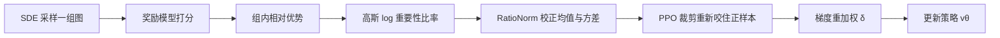

# GRPO-Guard：用受控裁剪，挡住流匹配强化学习里的隐性过优化

<!-- release-date: 2025-10-25 -->

**本文依据**：`GRPO-Guard: Mitigating Implicit Over-Optimization in Flow Matching via Regulated Clipping`，arXiv 2510.22319v2（2025-10-30），14 页 letter。作者 Jing Wang^{1,2}（实习期间完成）、Jiajun Liang^{2}（项目负责人）、Jie Liu^{3}、Henglin Liu^{2,4}、Gongye Liu^{2,5}、Jun Zheng^{1}、Wanyuan Pang^{6}、Ao Ma^{7}、Zhenyu Xie^{1}、Xintao Wang^{2}、Meng Wang^{2}、Pengfei Wan^{2}、Xiaodan Liang^{1}（通讯）；^{1} Shenzhen Campus of Sun Yat-Sen University，^{2} Kling Team, Kuaishou Technology，^{3} CUHK MMLab，^{4} Tsinghua University，^{5} HKUST，^{6} USTB，^{7} UCAS。封面页眉写明 arXiv:2510.22319v2 [cs.CV] 30 Oct 2025。官方 arXiv：https://arxiv.org/abs/2510.22319。v1 提交日 **2025-10-25**，盘上这份是 v2。首发日取原件首次公开日，即 arXiv v1 提交日 2025-10-25，不回写成 v2 日期，也不发明会议录用。文中所有数字都标了 PDF 页码；标「外部补充」的段落不来自本文。本文只解读这一份预印本，不把流匹配（Flow Matching）或 GRPO 本身写成这篇论文的发明。

## 一句话

把群体相对策略优化（Group Relative Policy Optimization，GRPO）接到流匹配图像模型上之后，策略更新本该靠重要性比率（importance ratio）的 PPO 裁剪（clipping）拦住过自信的正负梯度。作者观察到：扩散里的高斯转移概率会让这个比率系统性地左偏——均值掉到 1 以下，方差还随去噪时间步剧烈变化——于是正优势样本几乎进不了上裁剪区，裁剪机制名存实亡。代理奖励（proxy reward）继续涨，画质、文图一致性和多样性却塌掉。这篇把这种「代理涨、真指标跌」叫 **隐性过优化（implicit over-optimization）**。对策是 **GRPO-Guard**：先做比率归一化（ratio normalization，RatioNorm），把每一步的 $\log r_t$ 校正到均值近零、方差可对齐；再做梯度重加权，不让低噪声步独占更新。合在一起就是受控裁剪（regulated clipping）。作者在 SD3.5-M 与 Flux.1-dev 上，接到 Flow-GRPO 与 DanceGRPO，代理任务覆盖 GenEval、TextRender 与 PickScore；不加 KL 正则，复合金标准分（gold score）在相近代理分下更高（PDF p. 1、p. 6–7 表 1）。

它解决的不是「再发明一种 GRPO」，而是 2025 年 Flow-GRPO / DanceGRPO 已经能把确定性 ODE 改成可探索的 SDE、却直接沿用了语言模型那套比率裁剪的那块：**高斯概率不是离散 token 概率，均值小于 1 时，上裁剪对正样本根本咬不住**。

## 一、矛盾：代理分在涨，能用的图在塌

图 1 把故事钉死。左边：FlowGRPO 训练时代理分上升，金标准分持续下降，作者标出过优化区。右边：同一代理水平下，FlowGRPO 多样性、细节、画质和文图一致性明显变差；GRPO-Guard 金标准分更稳、观感更好（PDF p. 1 图 1）。

作者的判断很具体（PDF p. 1–2）：

1. GRPO 里的重要性比率裁剪，本应把新策略相对旧策略的偏离卡在 $[1-\epsilon,1+\epsilon]$，正负更新对称截断。
2. 理想分布应以 1 为中心，各时间步方差差不多。
3. 实测却是均值稳定低于 1、方差随时间步拉开（图 2）。正优势样本进不了上裁剪区，过自信的正更新几乎不被拦。
4. 于是进入隐性过优化：代理奖励继续升，图像保真和文本对齐急剧变差，策略没法落地。
5. 根因不是「忘了加 KL」，而是 **扩散算的是高斯状态转移概率，语言模型算的是离散 token 概率**；FlowGRPO / DanceGRPO 把 GRPO 公式原样搬过来，没有适配。

已有挡法各有代价（PDF p. 3）：重 KL 能减漂移，但代理分和真指标一起变慢；放大或集成奖励模型贵；早停可能停早。这篇选择把裁剪机制本身修好，而不是再加一层重正则。

把流水线画成人能跟住的图（机制示意，根据 PDF p. 2–6 式 5–12 与图 2 重画，不是实测时间轴）：

训练时：同一条件 $c$ 下用 SDE 出一组样本，组内标准化得到优势，再按受控裁剪更新速度网络。采样仍是去噪轨迹；本文不改骨干网络结构。

## 二、读前背景：流匹配怎么接到 GRPO

流匹配假定 $x_1$ 是高斯噪声、$x_0$ 来自数据。整流流写法把噪声样本写成（PDF p. 3 式 1）

$$
x_t=(1-t)x_0+t x_1.
$$

Transformer 速度网络 $v_\theta$ 去预测 $v=x_1-x_0$，损失是期望平方误差（PDF p. 3 式 2）。这是预训练；本文不重做这条回归。

强化学习阶段，Flow-GRPO 与 DanceGRPO 把确定性 ODE 改成 SDE，才能在同一条件上采出一组可比较的图。SDE 一步可写成（PDF p. 4 式 3，符号按原文）

$$
x_{t+\mathrm{d}t}=\mu_\theta(x_t,t)\,\mathrm{d}t+\sigma_t\sqrt{\mathrm{d}t}\,\epsilon,\qquad\epsilon\sim\mathcal{N}(0,I).
$$

Flow-GRPO 取 $\sigma_t=\eta\sqrt{(1-t)/t}$；DanceGRPO 取常数 $\sigma=\eta$。同一条件 $c$ 下采 $G$ 张图，奖励模型给标量 $R(x_0^i)$，组内相对优势是（PDF p. 4 式 4）

$$
\hat A^i_t=\frac{R(x_0^i)-\mathrm{mean}_j R(x_0^j)}{\mathrm{std}_j R(x_0^j)}.
$$

策略目标是 PPO 风格的最小裁剪（PDF p. 4 式 5）：比率 $r_t^i(\theta)=p_\theta(x_{t-1}^i\mid x_t^i,c)/p_{\theta_{\mathrm{old}}}(\cdots)$，取 $r\hat A$ 与 $\mathrm{clip}(r,1-\epsilon,1+\epsilon)\hat A$ 的较小者再对组与时间步平均。Flow-GRPO 另加 $D_{\mathrm{KL}}(\pi_\theta\|\pi_{\mathrm{ref}})$ 防奖励黑客；DanceGRPO 要求组内初始噪声相同，变化只来自后续随机性。这些都是前作设定，本文沿用。

## 三、比率为什么会左偏：二次项给出负期望

理想裁剪如图 2(a)：均值近 1，正负对称截断（PDF p. 5 图 2）。流匹配里 $\log p_\theta(x_{t-1}\mid x_t,c)$ 用高斯公式（PDF p. 4 式 6）。令 $\Delta\mu_\theta=\mu_{\theta_{\mathrm{old}}}-\mu_\theta$，对数重要性比率展开后（PDF p. 4–5 式 7）

$$
\log r_t(\theta)=-\frac{\|\Delta\mu_\theta\|^2}{2\sigma_t^2\mathrm{d}t}-\frac{\Delta\mu_\theta\cdot\epsilon}{\sigma_t\sqrt{\mathrm{d}t}}.
$$

一维高斯、$\epsilon\sim\mathcal{N}(0,I)$ 时，$\mathbb{E}[\log r_t]=-\|\Delta\mu_\theta\|^2/(2\sigma_t^2\mathrm{d}t)$。二次项恒非正，所以 **期望比率一般小于 1**。正优势样本很难越过上界 $1+\epsilon$，过自信的正梯度几乎全留下；负样本更容易撞下界，约束反而更狠。策略就被正更新拖进过优化。

方差还绑在调度参数 $\sigma_t$、$\mathrm{d}t$ 上，各时间步差很大。低噪声步频繁超阈，高噪声步几乎不裁，过优化还会集中在某几步（PDF p. 5）。

**旧问题到这里钉死了：不是裁剪公式写错，是高斯二次项把整个分布往左推，PPO 上裁剪对正样本失效。**

## 四、RatioNorm：先把均值拉回，再削掉调度带来的方差

给每步单独调一套裁剪区间当然能堵，但超参爆炸。作者改标准化 $\log r_t$（PDF p. 5）。操作（PDF p. 5 式 8）

$$
\log\hat r_t(\theta)=\sigma_t\sqrt{\mathrm{d}t}\Bigl(\log r_t(\theta)+\frac{\|\Delta\mu_\theta\|^2}{2\sigma_t^2\mathrm{d}t}\Bigr)=-\Delta\mu_\theta\cdot\epsilon.
$$

人话：先加上那个恒负的二次项，再乘 $\sigma_t\sqrt{\mathrm{d}t}$，把调度系数剥掉。均值被推到零附近，符号和 $\Delta\mu_\theta$ 的相对大小还在，语义不丢。图 2(b)(c) 显示：FlowGRPO 左偏且低噪声方差变大；加 RatioNorm 后均值平衡、方差更齐，各步裁剪重新工作（PDF p. 5 图 2）。

只做这一步还不够。高噪声步仍很少被裁，大正比率的正优势样本会带着满梯度走，过优化还在。方差差主要来自与噪声项相关的系数（PDF p. 5）。归一化里的乘加还会改策略梯度的尺度，必须单独看。

## 五、梯度重加权：别让某一步的噪声条件独吞更新

省略裁剪、min 和 KL 后，Flow-GRPO 的策略梯度可写成（PDF p. 6 式 9–10）。由式 3，$\nabla_\theta\mu_\theta$ 与 $\nabla_\theta v_\theta$ 差一个系数。Flow-GRPO 的 $\sigma_t=\eta\sqrt{(1-t)/t}$ 使 $(1+\sigma_t^2(1-t)/(2t))$ 近似常数，记为 $\beta$。梯度尺度仍含 $\sigma_t$、$\mathrm{d}t$ 和 $\Delta\mu_\theta$。图 3：梯度幅度与该尺度强相关，噪声越低幅度越大；各时间步大约差 **20 倍**（PDF p. 6 图 3）。这与 TempFlow-GRPO 用 $\sigma_t\sqrt{\mathrm{d}t}$ 做噪声感知重加权的观察一致；那种加权能加快优化，但也更容易过优化（PDF p. 6，图 9）。

RatioNorm 之后，梯度对 $\Delta\mu_\theta$、$\sigma_t$ 不那么敏感，尺度接近 $\beta\mathrm{d}t\epsilon$，像 TempFlowGRPO 的 on-policy 加权；但仍受 $\mathrm{d}t$ 牵制，某一步会主导整条轨迹（PDF p. 6 式 11）。作者再乘 $\delta=1/\mathrm{d}t$。图 3 上 GRPO-Guard 把跨步差异压到约 **2.5 倍**（PDF p. 6 图 3）。DanceGRPO 的 $\sigma_t=\eta$，系数变成 $\beta=1+\cdots$，重加权改为 $\delta=\beta/\mathrm{d}t$。最终策略损失（PDF p. 6 式 12）是在归一化比率 $\hat r$ 上做 min-clip，再乘 $\delta$。

$r_t$ 与 $\hat r_t$ 通常落在 $[1-10^{-3},1+10^{-3}]$，对梯度的直接倍数几乎可忽略；真正起作用的是裁剪重新咬住正样本，以及各步梯度不再差一个数量级（PDF p. 6）。

**收益**：代理分上升趋势还在，过优化明显减轻（表 1、图 4）。**代价**：裁剪区间和学习率要按新的比率尺度重调；正样本被裁多了，代理分爬坡会略慢（消融里写过）。**边界**：挡不住奖励模型本身的代理–金标准鸿沟。

## 六、实验设定：两个骨干、两个基线、三个代理任务

接到 Flow-GRPO 与 DanceGRPO，骨干是 SD3.5-M 与 Flux.1-dev。两边都用 LoRA：rank 32，$\alpha=64$。基线学习率 $3\times10^{-4}$，裁剪区间 $1\times10^{-4}$。GRPO-Guard 因比率与梯度尺度变了，裁剪区间改为 $2\times10^{-6}$；SD3.5-M 学习率 $1\times10^{-4}$，Flux.1-dev 为 $2\times10^{-4}$。PickScore 奖励黑客较轻，裁剪区间用更小的 $4\times10^{-6}$。**不加 KL**。训练与验证集与 FlowGRPO 一致（PDF p. 6）。

三个代理任务（PDF p. 6–7）：

- **GenEval**：规则评测，数物体个数、颜色、空间关系，测指令跟随。
- **TextRender**：文本绘制。
- **PickScore**：在 CLIP 编码器上微调回归头，对齐人类偏好。

金标准只看画质：HPSv2、ImageReward（ImR）、UnifiedReward（UniR）。Average 是把三个金标准相对基座（记为 1）归一化后取平均。训练中用 PickScore 在线盯 GenEval 与 TextRender 的金标准。验证：三个代理任务用 FlowGRPO 对应验证集；HPSv2 / ImageReward / UnifiedReward 都用 PickScore 验证集（PDF p. 7）。

## 七、主结果：相近代理分，金标准分更高

表 1 是复合金标准对照，方括号标该行对应的代理任务（PDF p. 7 表 1）。基座 SD3.5-M：GenEval 0.63、PickScore 21.5、Text Render 0.58、HPSv2 0.293、ImR 1.06、UniR 3.31、Average 1.00。Flux.1-dev：0.63、21.6、0.60、0.302、1.01、3.31、1.00。

SD3.5-M + Flow-GRPO：

| 设定 | 步数 | 代理任务 | 基线 Average | Ours Average |
|---|---:|---|---:|---:|
| GenEval | 1860 | GenEval 0.94 → 0.95 | 0.84 | 0.89（+0.05） |
| PickScore | 1020 | PickScore 23.1 → 23.3 | 1.16 | 1.20（+0.04） |
| Text Render | 480 | Text Render 0.94 → 0.93 | 0.88 | 0.99（+0.11） |

Flux.1-dev + DanceGRPO：

| 设定 | 步数 | 代理任务 | 基线 Average | Ours Average |
|---|---:|---|---:|---:|
| GenEval | 1260 | GenEval 0.80 → 0.81 | 0.88 | 1.02（+0.14） |
| Text Render | 540 | Text Render 0.90 → 0.89 | 0.96 | 1.02（+0.06） |

读表时注意：代理分几乎打平甚至 Text Render 上略降 0.01，金标准分却明显回升。GenEval 1860 步上 Flow-GRPO 的 HPSv2 从基座 0.293 掉到 0.236，Ours 为 0.254；ImR 0.85 vs 0.87，UniR 3.05 vs 3.22。DanceGRPO 在 Flux 上 GenEval 1260 步，ImR 从 0.79 拉到 1.08，UniR 3.18 → 3.35（PDF p. 7 表 1）。图 4：基线代理分猛涨、金标准分猛跌；GRPO-Guard 全程金标准分更高（PDF p. 7 图 4）。

观感（PDF p. 7–8 图 5–8）：FlowGRPO 在 GenEval / OCR 上画质崩、指令跟随差；DanceGRPO 出现明显横竖条纹伪影；PickScore 上基线分数不一定大掉，但人体比例扭曲、脸部多样性塌成几乎同一张脸。随步数看（图 8），基线大约在训练中段进入过优化：文字区域占比越来越大，直到只认字、不管场景。GRPO-Guard 在提高文字正确率的同时，观感更接近基座。

## 八、消融、人评、黑客发生在哪一步

消融在 SD3.5-M、OCR、FlowGRPO、480 步（PDF p. 8–9 表 2、图 9）：

1. **Mean-revised**：只把二次项加回去，校正均值。金标准分下滑明显减缓。
2. **RatioNorm**：再对齐跨步方差。过优化压得更死；正优势大比率被裁得多，代理分爬坡略慢。
3. **GRPO-Guard**：再乘 $1/\mathrm{d}t$。相对 TempFlowGRPO 的 Temp-Reweight：后者优化更快，但更早掉进过优化；本文的重加权代理分涨得更温和，金标准分掉得更少。

人评：GenEval 与 OCR 上各 100 对，比画质、文本对齐、总体质量，胜/平/负见图 10。作者结论：画质和总体质量明显优于基线，说明基线过优化已经伤到保真度（PDF p. 9 图 10）。图中精确百分比是条形图，本文不从渲染里猜数。

**Hacking Step**（PDF p. 9–10 图 11）：因为 $r>1+\epsilon$ 的梯度从未被截，黑客模型在全部去噪阶段都病。高噪声步：结构过简，往往只剩狗和桌子这类主体，全局布局过早定死。低噪声步：细部修不回来，最后几步仍有残噪和伪影。过优化不是「最后一步才坏」，是整条轨迹的能力一起掉。

**Clip Fraction**（PDF p. 9–11 图 12）：FlowGRPO 上，$r<1-\epsilon$ 的裁剪几乎只堆在最后一步（文中 step 8）；$r>1+\epsilon$ 的比例保持为零——正优势截断从未发生。GRPO-Guard 各步裁剪更稳，上下越界比例大致相当。

## 九、限制：裁剪修好了，奖励模型鸿沟还在

结论重申：左偏且不一致的比率分布让标准裁剪挡不住过优化；RatioNorm + 梯度重加权把裁剪重新管住，实验上减轻过优化、保住或提升生成质量（PDF p. 11）。

限制写得很硬（PDF p. 11–12）：正样本裁剪被重新激活，仍 **不能消灭** 奖励模型自身造成的黑客——代理分与金标准分之间有鸿沟。下一步自然是把奖励模型做大，例如 RewardDance 那种更接近综合金标准的路线；但 GRPO 要采大量样本再打分，算力与墙钟都会上去。作者把「又全又便宜、能把代理分对齐金标准」的奖励模型写成未来工作。致谢点名 Ziyang Yuan、Borui Liao、Haoran He、Yuanxing Zhang、Qunzhong Wang、Jiaheng Liu（PDF p. 12）。正文没有公开代码仓库、没有视频骨干实验数字、没有把 MixGRPO / Flow-CPS 接到 Guard 上的表。

## 十、可迁移启发

1. **先问裁剪有没有真的在裁。** 把 $r>1+\epsilon$ 与 $r<1-\epsilon$ 按时间步画出来。若上裁剪全程为零，PPO 在你的问题上已经失效。这比先加 KL 更便宜。
2. **连续状态的重要性比率会自带负偏。** 高斯（或任何带二次对数似然的密度）给出 $\mathbb{E}[\log r]\le 0$。从 LLM 抄 GRPO 时，先推 $\mathbb{E}[\log r]$，再决定要不要做均值校正。
3. **均值校正和方差对齐不是同一件事。** 只加回二次项，高噪声步仍可能从不触阈。调度系数要从 $\log r$ 里剥掉，裁剪区间才能共用。
4. **加速更新的重加权会加速过优化。** TempFlowGRPO 式按 $\sigma_t\sqrt{\mathrm{d}t}$ 放大有效步，代理分涨得快，金标准分也掉得快。若目标是「别黑奖励」，应压跨步梯度差，而不是只追代理曲线斜率。
5. **代理任务打平不是安全信号。** PickScore 分数可以不明显掉，脸和肢体已经坏了。金标准要用与训练奖励不同源的画质模型，并且要看图。
6. **KL 不是唯一的安全阀。** 本文在实验里关掉 KL，靠受控裁剪吃饭。若你的裁剪分布已经健康，重 KL 可能只是在买慢。

这些不依赖 SD3.5 或 Flux 的具体结构，依赖的是「多步高斯策略 + 组相对优势 + 共用裁剪区间」这一类实现。

## 十一、关键词回看

- **隐性过优化**：代理奖励上升的同时，金标准画质与对齐下降；裁剪失效导致，不一定表现为代理分本身异常。
- **重要性比率左偏**：高斯二次项使 $\mathbb{E}[\log r]<1$ 对应的均值，正样本难进上裁剪区。
- **RatioNorm**：$\sigma_t\sqrt{\mathrm{d}t}(\log r+\|\Delta\mu\|^2/(2\sigma_t^2\mathrm{d}t))$，均值回零并去掉调度方差。
- **梯度重加权 $\delta$**：Flow-GRPO 用 $1/\mathrm{d}t$，DanceGRPO 用 $\beta/\mathrm{d}t$，避免单步噪声条件主导。
- **受控裁剪**：归一化比率上的 PPO min-clip，让正负更新重新对称。
- **复合金标准分**：HPSv2、ImageReward、UnifiedReward 相对基座归一化后平均，用来盯黑客而不是用来训练。
