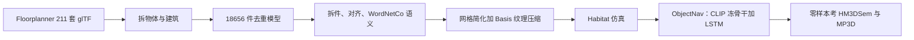

# HSSD：用人写的少量高质量合成室内，换 ObjectGoal 导航对扫描真房的零样本泛化

<!-- release-date: 2023-06-20 -->

**本文依据**：`Habitat Synthetic Scenes Dataset (HSSD-200): An Analysis of 3D Scene Scale and Realism Tradeoffs for ObjectGoal Navigation`，arXiv:2306.11290v3 [cs.CV]（2023-12-08），20 页 letter。作者 Mukul Khanna^{1}*、Yongsen Mao^{2}*（共同一作）、Hanxiao Jiang^{2}、Sanjay Haresh^{2}、Brennan Shacklett^{3}、Dhruv Batra^{1,4}、Alexander Clegg^{4}、Eric Undersander^{4}、Angel X. Chang^{2}、Manolis Savva^{2}。^{1} Georgia Tech，^{2} Simon Fraser University，^{3} Stanford University，^{4} Meta AI。盘上 PDF 页眉写明 arXiv:2306.11290v3 [cs.CV] 8 Dec 2023。官方 abs：`https://arxiv.org/abs/2306.11290`，v1 提交日 **2023-06-20**。项目页（封面）：`https://3dlg-hcvc.github.io/hssd/`。封面与全文抽取均未印会议名。文中数字都标 PDF 页码。本文只读这一份 PDF。

## 一句话

具身导航要在仿真里练、在扫描真房里考。扫描库有洞、薄结构糊、物体拆不开；程序生成库可以堆到上万间，但视觉保真和物体共现对不上真房（PDF p. 1–3）。作者交出 **HSSD-200**：**211** 套人工写的合成室内，**18,656** 件真实物体模型、**466** 个语义类，布局多半是房产中介按真房复刻，物体多半对得上真实品牌（PDF p. 1、p. 3）。主实验是 ObjectGoal 导航（ObjectNav）：随机出生，走到床 / 椅 / 沙发 / 电视 / 植物 / 马桶之一（PDF p. 2、p. 6）。图 1 图注写死：在 HM3DSem 上零样本，**122** 间 HSSD 训出的智能体成功率 **19.2**，压过 **10,000** 间 ProcTHOR 的 **12.5**（PDF p. 1）。表 5 同一设定的均值是 **19.15% vs 12.53%**（PDF p. 8）。规模对上之后，HSSD-122 仍压 ProcTHOR-122（HM3DSem 成功率 **19.15 vs 9.33**，PDF p. 8）。作者的判断：规模很快饱和，瓶颈改成真实感和质量。

它解决的不是「再扫一千间房」，而是：**合成室内该堆数量，还是先把房子写得像真的。**

## 一、矛盾：扫描脏且不可操作，程序生成又便宜得不像真房

仿真平台能安全、可重复地练导航和操作，前提是有「像真世界」的 3D 场景库（PDF p. 1）。社区两条路：

1. **扫描重建**（Matterport3D、Gibson、HM3D / HM3DSem）。布局多样，但薄结构、反光面几何缺失，墙上有洞，物体只重建一半。智能体会专门学这些伪影。采集和标注贵，难扩。整栋是一块网格，加 / 删 / 开抽屉都要先分割再补洞，操作任务几乎做不了（PDF p. 1–2）。HM3D 有 **1,000** 景，语义标注当时只有 **216** 景能训语义智能体；Ramakrishnan 等人还指出墙、天花、地板上的洞会害 ObjectNav 训练（PDF p. 3）。
2. **合成场景**：人做的 CAD 摆进房间。可以组合、可交互。但已有库要么单间（iTHOR）、要么场景少（ReplicaCAD、RoboTHOR）、要么不完整：3D-FRONT 厨房卫生间空着，算法换资产还会穿模（PDF p. 3、附录 p. 13–14）。ProcTHOR 把规模推到近无穷，却没人专门问：**堆规模对任务到底值多少钱。**

作者把前人库当黑盒用、又把「泛化到真扫描」当目标，于是缺的是一次对照：**场景数 / 可导航面积** 对 **视觉保真 + 和真房统计的相关**（PDF p. 2）。

上图是机制示意，根据 PDF 第 3 节、图 5 与附录图 7（p. 3–7、p. 12–13）重画，不是实测时间轴。

## 二、相关工作：ObjectNav 是积木，场景库决定语义从哪来

ObjectNav 三大家族：端到端强化学习（像素进、动作出，RNN 当记忆）、模仿学习（跟人演示）、模块化（建语义地图再走）（PDF p. 3）。作者选它，因为：重排等长程任务先得走到物体旁；任务本身吃物体语义和常见摆放规律，所以库的视觉保真和共现统计会进策略（PDF p. 3）。

训练环境从单间扩到多房间扫描。语义标注扫描仍少。Deitke 等人用程序生成场景提高 ObjectNav，并向扫描房迁移（PDF p. 3）。作者的问题收成一句：**大规模够不够，还是真实感（对上真房）也重要？** 他们用比 ProcTHOR 少得多、但更像真房的 HSSD 来答（PDF p. 3）。

## 三、HSSD-200：人写室内，再做成能在 Habitat 里跑的资产

### 来源与规模

211 套住宅，**18,656** 物体、**466** 语义类。用 Floorplanner 网页室内设计工具做；布局多半是房产中介按真房复刻；单件由职业 3D 美术做，多数对得上真实家具电器品牌。数据授权自 Floorplanner，学术使用（PDF p. 3）。相对前人：全人工高质量室内；细粒度语义对齐 WordNet 本体；资产压缩以便高吞吐仿真（PDF p. 3）。将开源，学术许可、免费（PDF p. 2）。

### 流水线：拆 → 分件 → 朝向 → 语义 → 压

原场景从 Floorplanner 库导出成**一份** glTF。拆成物体、建筑（墙地天花）和开口（门窗），去重进共享模型库（PDF p. 3）。有的源模型是「一桌加椅加餐具」：四名研究生标成单物体或多物体（可拆的可命名部件）。**1,791** 个多物体模型；基于 Mao 等人网页 UI，先用网格连通分量初分割，再人工拆 **1,662** 个，得到 **11,153** 个部件；提子网格、去重几何，用有向包围盒初始化再跑一轮 ICP 对齐（例如桌边多把椅）（PDF p. 4）。

全部物体（含单件）再对齐「上」和「前」：共 **2,883** 个要手调（PDF p. 4）。语义用增强版 WordNet，作者叫 **WordNetCo**（WordNet common objects）：补花盆、壁灯、平板、U 盘这类 WordNet 偏粗的日常物。先把 Floorplanner 内部标签映过去，再人工改、细化，并标「通常出现在哪类房间」。物体已按真实尺寸建模，不必像部分库那样估尺度（PDF p. 4）。

压缩：二次误差网格简化，阈值 $1 \times 10^{-3}$；纹理最长边最多 **256**；Basis 超压缩。磁盘体积降到约 **1/12.4**，GPU 显存同量级下降（PDF p. 4）。

附录补场景级清理：去掉漂浮在房子外的物体；ObjectNav 实验去掉内部门、留外部门防智能体跑出屋；去掉动物和人（PDF p. 12）。训练 episode 实际用 **122** 间，因为训练划分 **125** 间里有几间室内外分不清（PDF p. 18）。文件名写 HSSD-200、正文写 211 套——200 是品牌量级，不是实验划分。

### 为什么不拿 3D-FRONT 做导航

附录 A.5：版权限制下原资产换成 3D-FUTURE，房间类型只剩客厅餐厅卧室一类，厨房卫生间衣帽间空着；小件很少摆上大家具，没有墙饰；换资产还会穿模。语义室内导航要的是填满且摆得像真的，3D-FRONT 不合适（PDF p. 13–14，图 15–16）。

## 四、库本身：规模不大，面积、杂乱和共现更像扫描房

表 1（PDF p. 4；不含建筑构件；RoboTHOR 与 HM3DSem 不含隐藏测试集）：

| 数据集 | 场景 | 独特物体 | 类别 | 总可导航面积（m²） | 每景可导航 | 导航复杂度 | 杂乱 | 每景类别 | 每景实例 |
|---|---:|---:|---:|---:|---:|---:|---:|---:|---:|
| HM3DSem（扫描） | 181 | 59,269 | 1,533 | 20.7K | 114.4 | 9.7 | 4.0 | 103.9 | 327.5 |
| MP3D（扫描） | 90 | 50,851 | 1,658 | 29.6K | 328.4 | 12.8 | 2.8 | 95.5 | 565.0 |
| Gibson tiny（扫描） | 35 | 2,397 | 35 | 4.9K | 139.4 | 8.8 | 4.2 | 15.5 | 68.5 |
| ReplicaCAD | 90 | 92 | 39 | 4.5K | 49.8 | 7.2 | 4.8 | 14.3 | 25.5 |
| iTHOR | 120 | 3,748 | 112 | 2.0K | 17.1 | 2.4 | 9.6 | 28.2 | 46.2 |
| RoboTHOR | 75 | 652 | 47 | 1.9K | 25.9 | 8.1 | 5.8 | 28.8 | 38.4 |
| ProcTHOR | 12K | 1,547 | 95 | 808.4K | 67.4 | 10.0 | 5.2 | 40.5 | 74.7 |
| HSSD-200 | 211 | 18,656 | 466 | 53.2K | 252.2 | 13.7 | 5.9 | 61.5 | 329.7 |

导航复杂度和杂乱按 Ramakrishnan 等人定义；复杂度用相距至少 **1** 米的点（PDF p. 4）。HSSD 场景少，但独特物体过 **18K**，每景可导航 **252.2 m²** 高于先前合成库；每景类别和实例也更接近 HM3DSem / Gibson / MP3D（PDF p. 5）。图 3：ProcTHOR 可导航面积峰窄、房子偏小；HSSD 更贴扫描房。MP3D 更宽，因为还有公共和商业大空间（PDF p. 5）。复杂度：每景实例 **329.7 vs ProcTHOR 74.7**（四倍以上），总类别 **466 vs iTHOR 112**（约四倍），靠近 HM3DSem 的 **327.5** 实例 / **1,533** 类和 MP3D 的 **565** 实例 / **1,658** 类（PDF p. 6）。

视觉保真跟 Ramakrishnan 等人一样用 FID、KID，比的是「合成库 + Habitat 光栅化渲染」对扫描图，不是纯几何（PDF p. 5）。表 3（PDF p. 5）：

| 数据集 | HM3D FID ↓ | HM3D KID ↓ | Gibson FID ↓ | Gibson KID ↓ | MP3D FID ↓ | MP3D KID ↓ |
|---|---:|---:|---:|---:|---:|---:|
| ProcTHOR | 88.5 | 78.0 ± 1.6 | 95.6 | 82.6 ± 1.8 | 87.2 | 63.7 ± 1.3 |
| HSSD | 65.2 | 57.0 ± 1.4 | 73.0 | 61.7 ± 1.6 | 61.6 | 43.3 ± 1.3 |
| HM3D | — | — | 18.4 | 12.8 ± 0.8 | 25.2 | 18.3 ± 0.7 |
| Gibson | 18.4 | 12.7 ± 0.8 | — | — | 38.4 | 26.2 ± 1.2 |
| MP3D | 25.3 | 18.3 ± 0.7 | 38.5 | 26.2 ± 1.2 | — | — |

HSSD 全线低于 ProcTHOR。作者承认：将来渲染变好，FID 还能动；这套指标也不直接量「语义真实」（PDF p. 5）。

语义真实改看共现：选出三库都有的 **28** 类（闹钟、床、书、瓶……洗衣机，完整名单在附录，PDF p. 12），质心欧氏距离小于 **1** 米算共现（PDF p. 5）。图 4 热图：HSSD 更像 HM3DSem / MP3D。Spearman：$\rho_{\text{HSSD-HM3D}} = 0.219$ vs $\rho_{\text{THOR-HM3D}} = 0.083$；对 MP3D 是 **0.103 vs 0.017**（PDF p. 6）。再对共现矩阵层次聚类、阈值 **0.8** 切簇，簇对用匈牙利算法配对后算平均 Jaccard：$s_{\text{HSSD-HM3D}} = 0.40$ vs $s_{\text{THOR-HM3D}} = 0.14$；对 MP3D **0.28 vs 0.07**（PDF p. 6，图 4）。附录：距离矩阵 $D = 1 - C$，最远点连接，SciPy 切平簇，$t = 0.8$（PDF p. 18）。

## 五、仿真吞吐：同一套压缩管线也能抬 ProcTHOR

把 ProcTHOR 用同一套压缩，在 Habitat 里和 AI2-THOR 原资产比导航 FPS。小集 / 大集各随机 **50** 景，每景随机智能体走 **2K** 步，渲 $224 \times 224 \times 3$ RGB。1 GPU 用 **15** 个仿真进程，8 GPU 每卡 15 进程。机器：8 张 NVIDIA RTX Quadro **4000**。AI2-THOR 原文基准用的是 Quadro **8000**（显存和 CUDA 核更多）（PDF p. 5）。表 2（PDF p. 4）：

| 仿真器 | ProcTHOR-S 1 进程 | 1 GPU | 8 GPU | ProcTHOR-L 1 进程 | 1 GPU | 8 GPU |
|---|---:|---:|---:|---:|---:|---:|
| AI2-THOR | 240 ± 69 | 1,427 ± 74 | 8,599 ± 359 | 115 ± 19 | 见注 | 3,208 ± 127 |
| Habitat 未压缩 | 2,297 ± 447 | 6,374 ± 798 | 57,160 ± 4,917 | 1,007 ± 187 | 5,237 ± 1,130 | 39,510 ± 6,345 |
| Habitat 压缩 | 2,523 ± 300 | 7,363 ± 394 | 58,947 ± 1,804 | 1,233 ± 224 | 6,508 ± 495 | 46,674 ± 5,640 |

AI2-THOR 在 ProcTHOR-L、1 GPU 那格原文印了 **6,280**，作者与 Deitke 等人通信后确认是笔误、真值未知。ProcTHOR-L 的 8 GPU Habitat 未压缩因显存用每卡 **7** 进程而不是 15（PDF p. 4）。多数设置接近一个数量级的提升。这批优化过的 ProcTHOR 资产本身也能加速别人的具身实验（PDF p. 5）。附录：从 Unity 经 UnityGLTF 导出 glTF + JSON 元数据；门开着以便跨房间；建筑几何按 ProcTHOR JSON 重建（PDF p. 12–13）。

## 六、实验设定：六类目标、冻 CLIP、DDPPO

任务跟 Habitat ObjectNav 2022：六类 `bed, chair, sofa, tv, plant, toilet`。在目标周围视点 **0.1** 米内预测 STOP 算成功。智能体 LoCoBot，底半径 **0.18** m、高 **0.88** m，RGB + 罗盘 + GPS。动作：STOP、前进、左右转、抬头低头；前进步 **0.25** m，转角 **30°**（PDF p. 6）。

架构近似 Khandelwal 等人（图 5，PDF p. 6–7）：RGB $224 \times 224$ 过冻结 CLIP 预训练 ResNet-50，得 **2048** 维；目标类、位姿、上一步动作各嵌成 **32** 维；拼起来进两层 LSTM，再线性层出动作。目标与动作嵌入矩阵训练时学。优化：DDPPO + VER，**4** 张 A40，每卡 **24** 个环境 worker（PDF p. 7）。

HSSD 按 **60/20/20** 划 train/val/test。ProcTHOR、HM3DSem 用标准划分。iTHOR 从 80/20 里滤掉没有六类目标或太小的房间，每景 **2K** 条训练 episode。ProcTHOR 与 HSSD 每景 **1K**。HM3DSem 按前人每景 **50K**、**145** 个训练景。MP3D 去掉非六类目标后：**56** 景、每景约 **16.5K** 训练；验证 **10** 景、共 **658** 条（PDF p. 7）。验证：HSSD / iTHOR / HM3DSem 每景 **30** 条，ProcTHOR 每景 **10** 条，在类别和实例间均匀切（PDF p. 7）。表 4（PDF p. 7）：

| 数据集 | 训练景 | 每景 episode | 训练总计 | 验证景 | 每景 | 验证总计 |
|---|---:|---:|---:|---:|---:|---:|
| iTHOR | 64 | 2K | 128K | 13 | 30 | 390 |
| ProcTHOR | 10K | 1K | 10M | 1K | 10 | 10K |
| HSSD | 122 | 1K | 122K | 40 | 30 | 1.2K |
| MP3D | 56 | 16.5K | 925K | 10 | 65.8 | 658 |
| HM3DSem | 145 | 50K | 7.25M | 36 | 30 | 1.08K |

附录 B 视点：目标周围网格，丢掉脚下不可导航、离包围盒超过 **1** m、室外的点；吸附到可导航后丢掉半径小于 **1.5** m 的小岛（桌面、台面、床上）；再看像素覆盖，低于 **0.1%** 丢掉。起点测地距离在 **1–30** m，并控制近直线 episode 比例。ProcTHOR 房子小，短测地 episode 多、更好走；HSSD 与 HM3DSem 的距离分布更接近（PDF p. 14、p. 18，图 18）。

## 七、结果：零样本是主证据，微调会把差距洗平

各库训到收敛，取验证 SPL 最高的 checkpoint，三次独立训练平均，见表 5（PDF p. 8）。同库自评最好。iTHOR 与 ProcTHOR 共用物体资产，互相迁得还行。

零样本迁到扫描房（表 5，PDF p. 8）：

| 训练集 | HM3DSem 成功 ↑ | HM3DSem SPL ↑ | MP3D 成功 ↑ | MP3D SPL ↑ |
|---|---:|---:|---:|---:|
| iTHOR | 6.16 ± 0.19 | 2.38 ± 0.22 | 6.18 ± 0.41 | 2.13 ± 0.27 |
| ProcTHOR-10K | 12.53 ± 0.49 | 5.26 ± 0.2 | 8.26 ± 0.73 | 2.96 ± 0.46 |
| HSSD-122 | 19.15 ± 0.95 | 7.71 ± 0.47 | 14.44 ± 1.29 | 5.17 ± 0.48 |
| MP3D（同域） | 31.95 ± 1.17 | 13.13 ± 0.45 | 32.07 ± 1.22 | 14.73 ± 0.99 |
| HM3DSem（同域） | 48.1 ± 1.54 | 22.16 ± 0.05 | 30.8 ± 1.82 | 13.99 ± 0.89 |

第 6 节正文写 MP3D 成功 **12.56% vs 8.26%**（PDF p. 7），与表 5 的 **14.44** 不一致。以表为准；图 1 图注的 **19.2 vs 12.5** 是表 5 HM3DSem 成功率的圆整（PDF p. 1、p. 8）。HSSD 自测成功 **54.81**、SPL **24.12**；迁到 iTHOR / ProcTHOR 反而差（**27.5 / 9.57**），说明优势不是「哪儿都强」，是**对扫描真房**（PDF p. 8）。

在目标训练集上微调后再评该库验证集：差距缩小。HSSD-122 预训再微调：**48.23%** 成功、**23.1** SPL；ProcTHOR-10K：**48.32%** 成功、**21.8** SPL。成功几乎持平，SPL 仍略高。作者认为零样本更像部署到没见过的环境（PDF p. 7）。附录表 6 把 60 / 122 / 10K 预训都微调到 HM3DSem：成功落在 **47.85–48.48**，SPL **22.16–23.1**，HSSD 在 SPL 上仍略领先；直接在 HM3DSem 上训是成功 **48.10**、SPL **22.16**（PDF p. 19–20）。

拆开规模与真实感：HSSD 取 60 景和全部 122 训练景；ProcTHOR 取 60、122 和全部 10K。60 与 122 的 ProcTHOR 子集按可导航面积分布去贴 HSSD，每景仍 **1K** episode（PDF p. 7，附录图 19）。图 6：HSSD-60 / 122 全面压规模对齐的 ProcTHOR。122 景对照尤其大——HM3DSem：**19.15 vs 9.33** 成功、**7.71 vs 3.47** SPL；MP3D：**14.44 vs 5.47** 成功、**5.17 vs 1.83** SPL（PDF p. 8）。ProcTHOR-10K 相对 ProcTHOR-122 只略好，单独堆规模价值有限（PDF p. 8）。图 1 右栏从 pdftotext 读出的点：**8.1、17.4、19.2**（HSSD）对 **9.3、11.6、12.5**（ProcTHOR）（PDF p. 1）。

附录训练曲线：验证约 **2 亿** 步经验饱和；iTHOR 更快，因为单间更简单。零样本对 HM3DSem / MP3D 的曲线上，HSSD 预训全程高于 ProcTHOR 和 iTHOR（PDF p. 19，图 20–21）。

## 八、失败模式：主要是不会把房子走完

附录 E：HSSD 预训、HM3DSem 微调后，在验证失败 episode 里随机抽 **100** 条（PDF p. 20，图 22）：

| 模式 | 比例 | 人话 |
|---|---:|---|
| 探索失败 | 33% | 房子有的区域根本没走到，常在一处打转 |
| 错误预测 | 19% | 在非目标前停（绿玩具当植物） |
| 跨层导航 | 14% | 出生层没有目标，需要换楼层 |
| 识别失败 | 13% | 看见了但不走过去 |
| 过早停止 | 8% | 找到了但停在几厘米外 |
| 标注缺失 | 6% | 走到了真目标，HM3DSem 没标，判失败 |
| 语义混淆 | 6% | 扶手椅当沙发 |

作者说：探索仍是大头；标注补全、目标同层，分数还会动（PDF p. 20）。

## 九、作者自己划的边界

只测一类智能体：像素到动作、端到端 RL。模块化方法和模仿学习会不会走出另一条规模–质量曲线，本文没有做（PDF p. 8）。FID 绑的是 Habitat 光栅化，不是路径追踪。合成库没有在真机器人上部署。操作与重排被点名为 HSSD 能做的事（可组合、可增删物体），但本 PDF **没有**操作任务数字（PDF p. 2）。扫描同域上限仍远高于合成零样本（HM3DSem 自训成功 **48.1**），HSSD 没有取代扫描标注（PDF p. 8）。

## 十、可迁移的几件事

1. **先问规模有没有饱和，再买生成器。** 10K 程序房相对 122 间同分布子集几乎不涨零样本；122 间人写房却能翻倍。迁移到别的仿真数据时，用「等面积、等场景数」子集当对照，不要只报全库。
2. **真实感要拆成可导航面积、渲染分布、共现三张表。** 只报 FID 会漏摆放规律；只报物体数会漏房子太小导致的短 episode。
3. **资产管线和任务数字分开卖。** 同一套简化 + Basis 压缩让 Habitat 相对 AI2-THOR 快一个数量级，这是别人能直接拿的工程；导航结论是另一件事。
4. **零样本和微调讲的是两种部署。** 微调后成功挤在 48% 附近，故事会被洗掉；若目标是没见过的扫描房，以零样本为主表。
5. **合成库要能拆件。** 扫描网格动不了抽屉；HSSD 的价值一半在导航分数，一半在组合式表示——即使操作实验还没写进这篇。

## 关键词回看

- **HSSD-200 / HSSD**：211 套人工合成室内 + 18,656 真实物体 CAD，给 Habitat 用。
- **ObjectGoal 导航（ObjectNav）**：出生点随机，走到指定物体类别。
- **规模 vs 真实感**：场景数 / 可导航面积，对视觉保真和与真房统计的相关。
- **ProcTHOR**：程序生成大规模室内；本文里的「堆规模」对照。
- **HM3DSem / MP3D**：带语义的扫描真房，零样本考场。
- **WordNetCo**：补了日常物的 WordNet 同义词集。
- **SPL**：成功且看路径效率的综合指标。
- **DDPPO / VER / 冻结 CLIP**：本实验的像素到动作配方，不是新算法贡献。
