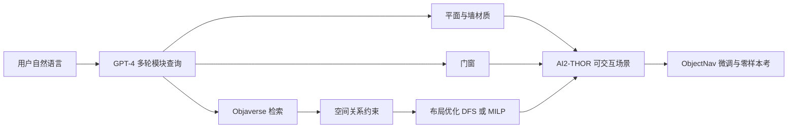

# Holodeck：用语言把可交互 3D 具身环境从「住宅模板」扩到 Arcade、博物馆和未见场景

<!-- release-date: 2023-12-14 -->

**本文依据**：`HOLODECK: Language Guided Generation of 3D Embodied AI Environments`，arXiv:2312.09067v2 [cs.CV]（2024-04-22），21 页 letter。作者 Yue Yang（共同一作）、Fan-Yun Sun（共同一作）、Luca Weihs（共同一作）、Eli Vanderbilt、Alvaro Herrasti、Winson Han、Jiajun Wu、Nick Haber、Ranjay Krishna、Lingjie Liu、Chris Callison-Burch、Mark Yatskar、Aniruddha Kembhavi、Christopher Clark。单位：University of Pennsylvania、Stanford University、University of Washington、Allen Institute for Artificial Intelligence。第一作者第一单位是 **University of Pennsylvania**。封面脚注写「Work done while at PRIOR@AI2」，那不是机构格。封面印 `arXiv:2312.09067v2 [cs.CV] 22 Apr 2024`。官方 abs：`https://arxiv.org/abs/2312.09067`，v1 提交日 **2023-12-14**。封面未印会议名。项目页写在第 1 页：`yueyang1996.github.io/holodeck/`。文中数字都标 PDF 页码。本文只读这一份 PDF。

## 一句话

具身智能（Embodied AI）要在模拟器里练，但现成环境要么靠艺术家手搭、要么扫真房、要么用硬编码程序生成，场景类型窄、人力贵（PDF p. 1–2）。把 2D 基础模型抬成 3D 网格或 NeRF 又常有穿模、不可交互（PDF p. 2）。Holodeck 架在 AI2-THOR 上，用 **GPT-4** 当常识与空间先验，从用户一句话自动出平面、材质、门窗和摆放；物体从 **Objaverse** 检索，库连同 ProcTHOR 资产共 **51,464** 件标注件（PDF p. 2–3、p. 6）。摆放不让 LLM 直接吐坐标，而是先采样空间关系约束，再优化布局，避免重叠与出界（PDF p. 3、p. 5）。**680** 名研究生评住宅场景，总体更偏好 Holodeck 而非 ProcTHOR（总体 **64.4%**，PDF p. 6）；在 MIT Scenes 的 **52** 类场景上也能出多数人可接受的室内（PDF p. 7）。下游：在 Holodeck 合成的未见类型上微调 ObjectNav，再到艺术家做的 NoveltyTHOR 上零样本考，平均成功率 **20.40%**，高于只换资产的 ProcTHOR 变体 **17.02%** 和原 ProcTHOR **4.11%**（PDF p. 8）。

它解决的不是「再扫一千套真房」，而是：**语言描述能不能直接变成可交互、多样、还能拿去训智能体的 3D 环境。**

## 一、矛盾：模拟器能交互，场景类型却卡在住宅规则上

训练具身智能体主要在模拟器里做。环境要真实、多样、可交互，这条链才转得动（PDF p. 2）。旧三条路各自卡死一类事：

1. **手工设计**（AI2-THOR、RoboTHOR 一类）：布局、资产、语义一致性全靠人，扩类型不现实（PDF p. 2）。
2. **3D 扫描**：省人力，但交互弱（PDF p. 2）。
3. **硬编码程序生成**（ProcTHOR）：能堆规模，规则写死，主要还是住宅四类（PDF p. 2、p. 6）。

近年把 2D 基础模型接到文本生成 3D 场景，网格常扭曲，也缺具身需要的可交互部件。只做平面或只做摆放的模型又缺整屋一致性，还绑任务专用数据（PDF p. 2）。

因此缺口是：**提示进、整屋出，资产可检索、布局物理上说得通、还能进 AI2-THOR 训智能体。**

上图是机制示意，根据 PDF 图 2 与第 3 节（p. 3–6）重画，不是实测时间轴。

## 二、相关工作：LLM 直接吐坐标会穿模

**具身环境。** 艺术家场景难扩；扫描场景交互弱；ProcTHOR 证明大规模可交互生成有用；Phone2Proc 用手机扫描对齐真房；同期 RoboGen 用生成任务与场景训机器人。Holodeck 自称切口是：**文本驱动的 3D 可交互场景**（PDF p. 2）。

**LLM 做场景。** 从 3D 库学先验或人机迭代，类别常被 3D-FRONT 一类数据卡住。已有工作让 LLM 直接输出数值布局，物理上常重叠。Holodeck 改成 **约束 + 求解器**；人评更偏好这条，而不是端到端数值（PDF p. 3，见第 4.3 节）。

**文本驱动 3D。** 早期学形状分布；CLIP 之后可零样本做纹理与单物体；Text2Room / SceneScape / Text2NeRF 一类把文生图加深度做成网格或 NeRF，缺模块化和交互。Holodeck 用资产库换可组合、可交互的屋（PDF p. 3）。

## 三、系统：四个模块，多轮对话，最后才进求解器

Holodeck 是可提示系统，基于 AI2-THOR，资产来自 Objaverse。四个模块（PDF p. 3，图 2）：

1. **Floor & Wall**：矩形房间四角坐标、墙体、地面与墙材质。
2. **Doorway & Window**：连通与开窗。
3. **Object Selection**：按描述和尺寸从 Objaverse 取件。
4. **Constraint-based Layout**：空间关系约束，再优化位姿。

每个模块的 LLM 提示含三块：任务说明、输出格式、**one-shot** 例子。蓝框里是简化提示；完整提示在附录，并加了「每间最少 **9 m²**」一类防错句（PDF p. 4）。高阶回复后处理成模块参数。

### 平面、材质、门窗：把常识写成规格

房间是矩形，四元组给角点。GPT-4 直接出坐标，并给尺寸与连通。图 3：六间教室夹长廊、十字四卧中厅一类复杂提示也能出平面（PDF p. 4）。

材质：LLM 描述对齐 **236** 种材质（各 **148** 色），用 CLIP 选图再选色。监狱用混凝土、粉卧室、红砖酒窖、格子地 80s 酒吧，都是这条在干活（PDF p. 4，图 4）。墙高也可按提示建议，例如博物馆挑高（PDF p. 12）。

门窗分开问 LLM。门：**40** 种风格；窗：**21** 种。可改尺寸、高度、数量。轮椅公寓加宽门、阳光房落地窗是图 5 的例子（PDF p. 4）。连接类型三种：门框无门、有门、完全敞开；门宽 single **1 m** / double **2 m**（PDF p. 12）。窗类型 fixed / slider / hung（PDF p. 12）。

附录平面提示还写死：边长 **3–8 m**，单间面积上限 **48 m²**，房间名唯一，允许合理的单间方案（PDF p. 16）。

### 选物体：描述 × 尺寸 × 多视角，不靠类名硬匹配

LLM 提案，例如「多层猫爬架，**60×60×180 cm**」。检索看视觉、文本、尺寸三维（PDF p. 5）。脚注：CLIP 看图、Sentence-BERT 看字、3D 包围盒看尺寸。图 6：地板、墙、小件、天花都能按提示定制（PDF p. 5）。

附录把匹配写成加权和。候选资产 $o$ 有文本 $t$、尺寸 $(w,d,h)$、三视角图 $I$（$0^\circ,45^\circ,-45^\circ$）；LLM 提案 $o'$ 有 $t'$ 与目标尺寸。视觉相似度取多视角 CLIP 最大；$T$ 用 SBERT（`all-mpnet-base-v2`）；尺寸差 $S$ 是三边绝对差的均值。总分（PDF p. 12–13）：

$$
\mathcal{M}(o,o') = \alpha \cdot \mathcal{V}(o,o') + \beta \cdot \mathcal{T}(o,o') - \gamma \cdot \mathcal{S}(o,o')
$$

权重 $\alpha=100$，$\beta=1$，$\gamma=10$。取最高分资产（PDF p. 13）。CLIP 全篇用 OpenCLIP ViT-L/14、LAION-2B（PDF p. 12）。

### 布局：十种软约束 + 碰撞硬约束，DFS 限时 30 秒

前人让 LLM 直接给包围盒绝对值，资产一多就出界、碰撞（PDF p. 5）。Holodeck 改让 LLM 出关系，例如「茶几，在沙发前面」，再优化。

预定义 **十种** 约束，五类（PDF p. 5）：

- 全局：edge、middle
- 距离：near、far
- 位置：in front of、side of、above、on top of
- 对齐：center aligned
- 朝向：face to

每种物体选一个子集，房间变成场景图（图 7）。软约束可违反；硬约束禁止碰撞、禁止出房间（PDF p. 5）。LLM 的随机性让同一提示能出多种合法布局（图 8，PDF p. 5）。

求解：先把关系写成数学条件（中心对齐 = 同 $x$ 或同 $y$）。自回归放置：LLM 指定锚点，探索锚点位置，再用 **DFS** 放其余物体。只接受满足全部硬约束的放置。卧室常以床为锚，再放床头柜（PDF p. 5–6）。限时 **30 秒** 出多个候选，返回满足约束最多的那个（PDF p. 6）。脚注：约束近线性，也可用 MILP；正文实验用 DFS，MILP 分析在附录（PDF p. 5）。

附录 DFS：物体五元组 $(x,y,w,d,\text{rotation})$，旋转 $0^\circ/90^\circ/180^\circ/270^\circ$。先网格化缩小搜索；先放锚点，再尽量满足软约束（PDF p. 13，图 15）。MILP：位置 $(x,y,\text{rotate}_{90},\text{rotate}_{180})$ 两布尔表示 $90^\circ$ 与 $180^\circ$，两者都真即 $270^\circ$；用 Gurobi；near/far 进目标，其余作硬约束（PDF p. 13）。墙件靠「在哪件地板物上方」加离地高度（厘米）；小件由 LLM 提案后调用 AI2-THOR `RandomSpawn`（PDF p. 13–14）。

### 资产入库：Objaverse 1.0 室内子集 + GPT-4-Vision 标注

从 Objaverse 1.0 筛室内可用件，GPT-4-Vision 多视角截图自动标描述、尺度、规范视图等。加上 ProcTHOR 资产，库 **51,464** 件（PDF p. 6）。导入 AI2-THOR：减面、可见性点、碰撞体，降加载时间（PDF p. 6）。附录 A.7：下模型、转网格、表面可见点、凸分解碰撞、压 albedo/normal/emission；缓存与卸载以撑运行时上千件。任意 3D（含文生 3D，图 17 用 LumaAI）也能进同一管道（PDF p. 14）。默认 Unity 渲染以便训智能体；可用 Blender 换观感（PDF p. 14，图 18）。

GPT-4-V 四正交图（$0^\circ/90^\circ/180^\circ/270^\circ$）输出类别、最近 WordNet synset（给 ObjectNav）、长宽高厘米、体积、质量、正视图编号、描述、材质列表、以及 ONCEILING / ONWALL / ONFLOOR / ONOBJECT 布尔（PDF p. 14，图 16）。

### 成本：每间约 0.2 美元、约 3 分钟

$k$ 个房间要 **$3+3k$** 次 API。模型 `gpt-4-1106-preview`，约 **\$0.2 / 房间**。当时实现单间约 **3 分钟**（含 API 与布局优化），测在 M1 MacBook 上（PDF p. 12）。

## 四、人评：住宅赢 ProcTHOR，类型能铺到 52 类

**680** 名研究生，三组实验：（1）住宅对比 ProcTHOR；（2）多样场景；（3）布局消融（PDF p. 6）。

### 4.1 住宅：120 对，三项偏好

ProcTHOR 当时是唯一能出完整可交互场景的程序基线，但只覆盖浴室、卧室、厨房、客厅（PDF p. 6）。双方各 **120** 景（每类 **30**），ProcTHOR 可用同一套 Objaverse。Holodeck 提示就是场景类型名。成对俯视图打乱，三问：资产是否更贴类型、布局是否更像常识、总体更想要哪套（PDF p. 6）。

图 9（PDF p. 6；括号是票数）：

| 准则 | Holodeck | ProcTHOR | 同等 |
|---|---:|---:|---:|
| 资产选择 | 59.8%（1347） | 17.0%（382） | 23.2%（523） |
| 布局连贯 | 56.9%（1283） | 28.0%（631） | 15.0%（338） |
| 总体偏好 | 64.4%（1450） | 23.3%（524） | 12.3%（277） |

CLIP Score：俯视图对模板「a top-down view of [scene type]」，OpenCLIP ViT-L/14、LAION-2B，余弦相似度 ×100。iTHOR 人工场景当上界。Holodeck 四类住宅均高于 ProcTHOR、接近 iTHOR（PDF p. 6，图 10）。图是柱状，正文**没有**把各柱读成一张数字表。

### 4.2 多样场景：MIT 52 类，260 个样本

MIT Scenes 五类：商店、家、公共、休闲、办公。受 ProcTHOR 框架限制，泳池、地铁等要特殊结构的类型被滤掉（PDF p. 7 脚注）。每类提示场景名出 **5** 个，共 **260**。标注看俯视图加 **360°** 视频，1–5 分（资产、布局、总体匹配）。对照里放 ProcTHOR 与 iTHOR 住宅各 **20** 景（PDF p. 7）。

相对 ProcTHOR 在住宅上的分数，Holodeck 在 **52** 类里有 **28** 类更高。作者判断：住宅用常见家具和简单布局本来就好做；能铺开类型说明更稳。仍吃亏在复杂布局（如餐厅）和 Objaverse 没有的独特件（如牙科 X 光机）（PDF p. 7）。图 11 有洗衣店、实验室、书店、花店、托儿所、仓库、烘焙、自助餐等定性例；三条横线是 iTHOR / Holodeck / ProcTHOR 在四类住宅上的均分（PDF p. 7）。正文**没有**把 52 类分数印成表。

### 4.3 布局消融：约束优于绝对值

四法：CONSTRAINT（Holodeck）、ABSOLUTE（LLM 直接给坐标朝向，类 LayoutGPT）、RANDOM（无碰撞随机）、EDGE（靠墙）。改 4.1 的住宅布局、物体不变。四张打乱俯视图排序，看越界、碰撞、可达空间、真实感（PDF p. 7）。

表 1，Mean Reciprocal Rank，越高越好（PDF p. 7）：

| 方法 | 浴室 | 卧室 | 厨房 | 客厅 | 平均 |
|---|---:|---:|---:|---:|---:|
| ABSOLUTE | 0.369 | 0.343 | 0.407 | 0.336 | 0.364 |
| RANDOM | 0.422 | 0.339 | 0.367 | 0.348 | 0.369 |
| EDGE | 0.596 | 0.657 | 0.655 | 0.672 | 0.645 |
| CONSTRAINT | 0.696 | 0.745 | 0.654 | 0.728 | 0.706 |

CONSTRAINT 在浴室、卧室、客厅明显更好；厨房与 EDGE 接近，因为厨房本就靠墙。ABSOLUTE 不优于 RANDOM，因为碰撞与出界多，人评差（PDF p. 8）。附录图 24 对照 DFS / MILP / 绝对值 / 随机 / 靠墙（PDF p. 19）。

## 五、NoveltyTHOR：未见场景上的 ObjectNav

现有 ObjectNav 基准几乎都是住宅，物体类合计 **16** 种（PDF p. 8）。作者请职业数字艺术家做 **NoveltyTHOR**：**10** 套测试环境，五类各两套——Office、Daycare、Music Room、Gym、Arcade；含钢琴、跑步机等新类；全库 **92** 种独特物体（PDF p. 8）。附录 C：把 Objaverse 转 Unity prefab 的工具链与艺术家界面；图 26–27 是十套俯视图（PDF p. 15、p. 20–21）。

除随机动作外，都从 ProcTHOR-10K 预训练 ObjectNav 出发，约 **4 亿** 步、**16** 类（PDF p. 8；此处引用写成 [26]，与正文 ProcTHOR-10K [7] 编号不一致，本文按句子抄「P ROC THOR-10K」）。两种适应、都不用人搭训练集：

- **+Holodeck**：每类自动生成 **100** 景；提示用场景名及其改写（Arcade 用 game room、amusement center）（PDF p. 8）。
- **+Objaverse**：ProcTHOR 换上 Holodeck 按类型选出的同类 Objaverse 资产，用来拆「选物」和「摆放」。

模型：CLIP 架构，CNN 视觉 + GRU 时间（Khandelwal 等人）。每模型 **100** 景训 **5000 万** 步，约 **1 天**、**8** 块 Quadro RTX 8000。按自身验证集最好 checkpoint 选点（PDF p. 8）。

表 2，零样本 ObjectNav 于 NoveltyTHOR。Success 是成功率（%），SPL 是成功加权路径长度（PDF p. 8）：

| 方法 | Office Succ / SPL | Daycare | Music Room | Gym | Arcade | 平均 |
|---|---|---|---|---|---|---|
| Random | 3.90 / 0.039 | 4.05 / 0.041 | 5.20 / 0.052 | 2.84 / 0.029 | 2.54 / 0.025 | 3.71 / 0.037 |
| ProcTHOR | 8.77 / 0.031 | 2.87 / 0.011 | 6.17 / 0.027 | 0.68 / 0.002 | 2.06 / 0.005 | 4.11 / 0.015 |
| +Objaverse | 18.42 / 0.068 | 8.99 / 0.061 | 25.69 / 0.157 | 18.79 / 0.101 | 13.21 / 0.076 | 17.02 / 0.093 |
| +Holodeck | 25.05 / 0.127 | 15.61 / 0.127 | 31.08 / 0.202 | 18.40 / 0.110 | 11.84 / 0.069 | 20.40 / 0.127 |

Holodeck 平均最好，Office / Daycare / Music Room 拉开明显。Gym 与 Arcade 上 +Holodeck 与 +Objaverse 接近。作者把差距主要归因于摆放：音乐室里钢琴、琴盒、大提琴靠近，Holodeck 也会类似地聚在一起。ProcTHOR 常接近随机，因为训练时物体覆盖差（PDF p. 8）。

## 六、限制：资产库、复杂布局、文化刻板

结论：计划加更多 3D 资产，并拓宽具身应用（PDF p. 9）。正文 4.2 已写：复杂布局和库里没有的器械会失败（PDF p. 7）。

附录 D：偏差来自 LLM 和检索。提示含「Japanese」时，卧室可能堆漫画海报。可加后缀「no cultural bias」或写细兴趣（如 classic arts）；作者说这**不太可能**彻底去掉偏差，但定性上有帮助（PDF p. 15，图 19）。

完整提示模板在图 20–22（平面 / 墙高 / 门 / 窗、选物 JSON、布局约束、GPT-4-V 标注）（PDF p. 16–17）。选物提示要求至少 **10** 类大家具，并禁止再提案毯、窗、门、帘、天花件（这些已装）（PDF p. 17）。布局提示要求先锚点、先大家具、后者只依赖前者、同类常对齐、优先靠墙、椅必须靠近并朝向桌（PDF p. 17）。near 定义为 **50 cm < 距离 < 150 cm**，far 为 **≥ 150 cm**（PDF p. 17）。

## 七、可迁移启发

1. **别让语言模型直接操作连续坐标。** 让它采样离散关系，把物理可行性交给求解器。人评里绝对值布局不比随机强（PDF p. 7–8）。
2. **把「选什么」和「放哪」拆开做对照。** NoveltyTHOR 上 +Objaverse 已经远超原 ProcTHOR；再加约束布局，在若干类型上继续涨。要归因时，只换资产的基线比「有无 Holodeck」整包对比更干净（PDF p. 8）。
3. **检索不要只靠文本。** 视觉 CLIP、句子向量、尺寸差三项加权，是为了对上「大客厅要大沙发」这类规格，而不是同名不同尺（PDF p. 12–13）。
4. **模块提示写成可解析格式 + 一条防错约束。** 最少面积、房间不重叠、必须有外门，都是观察失败后加进模板的（PDF p. 4、p. 16）。
5. **具身可用性是资产工程，不只是生成质量。** 减面、碰撞、缓存、卸载，否则 Objaverse 进不了 Unity 运行时（PDF p. 6、p. 14）。

## 关键词回看

- **Holodeck**：语言引导、基于 AI2-THOR 的自动 3D 具身环境生成系统。
- **空间关系约束**：edge / near / face to 一类软关系，加碰撞与出界硬约束。
- **Objaverse**：大规模 3D 资产库；本文室内子集经 GPT-4-Vision 标注后与 ProcTHOR 资产合计 51,464 件。
- **NoveltyTHOR**：艺术家设计的 10 套未见类型测试房，用来考 ObjectNav。
- **ObjectNav**：导航到指定物体类别；本文在未见场景类型上做零样本评测。

## 参考资料

- 原件：`readings/_src/图像、视频与 3D 生成/Holodeck.pdf`
- arXiv：`https://arxiv.org/abs/2312.09067`
- 项目页（封面）：`https://yueyang1996.github.io/holodeck/`
