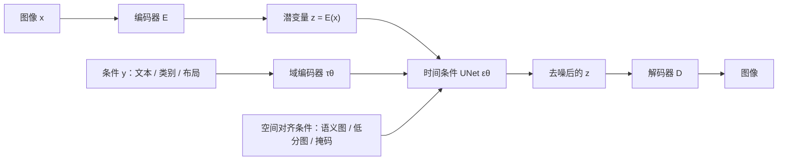

# Latent Diffusion：先把图压到感知等价的潜空间，再在那里做扩散

<!-- release-date: 2021-12-20 -->

**本文依据**：`High-Resolution Image Synthesis with Latent Diffusion Models`，arXiv:2112.10752v2 [cs.CV]（2022-04-13），45 页 letter。作者 Robin Rombach1*、Andreas Blattmann1*（同等贡献）、Dominik Lorenz1、Patrick Esser（Runway ML）、Björn Ommer1；机构1 Ludwig Maximilian University of Munich & IWR, Heidelberg University, Germany。封面 GitHub：`https://github.com/CompVis/latent-diffusion`（PDF p. 1）。盘上 PDF 页眉写明 arXiv:2112.10752v2 [cs.CV] 13 Apr 2022。官方 arXiv：`https://arxiv.org/abs/2112.10752`。首发日取原件首次公开日，即 arXiv v1 提交日 **2021-12-20**，不因 v2 回写。封面与正文均未印本篇会议名；文中出现的 CVPR 均在参考文献里指他人工作，本文不补本篇会议名。文中数字都标 PDF 页码；标「外部补充」的段落不来自本文。本文只读这一份 PDF，不把后作里的 Stable Diffusion 产品线写进来。

## 一句话

像素空间扩散模型已经能画出当时最好的图，但训练动辄几百 GPU 天、采样还要在 RGB 上串行几十到上千步。这篇论文把图像生成拆成两段：先用一次训好的感知自编码器，把图压到空间更小、对人眼几乎等价的潜空间；再在这个二维潜变量上训去噪扩散。他们把这类模型叫 **潜扩散模型（Latent Diffusion Models，LDM）**。因为 UNet 自带空间归纳偏置，不必像自回归 Transformer 那样把图压成极短一维码，下采样因子 $f$ 可以更温和，重建也更忠（PDF p. 1–2）。再给 UNet 加交叉注意力，同一套骨干就能吃文本、布局、类别；把空间对齐的条件拼到通道上，还能卷积地做语义合成、超分、修复，并画出约 $1024^2$ 的大图（PDF p. 2）。

它解决的不是「再发明一种扩散」，而是像素扩散的那笔固定开销：**语义压缩本该发生在潜空间，却一直在每个像素上算梯度**。

## 一、矛盾：扩散模型画得好，却把算力花在看不见的细节上

2021 年前后，高分辨率自然场景合成几乎被两类东西占满。一类是自回归 Transformer，参数可以到数十亿（PDF p. 1）。另一类是 GAN：采样快、观感好，但对抗训练难扩到多峰、复杂分布（PDF p. 1）。扩散模型（diffusion models，DM）用一串去噪自编码器把标准噪声一步步还原成图，当时已经在图像及以外任务上拿到很强的结果，类别条件与超分也到了当时最好一档；无条件模型还能直接拿去做修复、上色、笔触合成，而不必像 GAN、流、VAE 那样换一套任务头（PDF p. 1）。它是似然模型，不像 GAN 那样容易模式崩；靠参数共享，也不必像自回归那样堆出几十亿参数（PDF p. 1）。

代价写在计算图里。似然模型有 **mode-covering** 倾向：为了把密度估准，会把容量砸在几乎看不见的高频上（PDF p. 1）。Ho 等人的重加权变分目标会少采前几步去噪，但训练和推理仍要在高维 RGB 上反复求函数值和梯度。文中例子：当时最强的一批像素 DM 要 150–1000 个 V100 天；在单卡 A100 上出 5 万张样本大约要 5 天（PDF p. 1–2）。采样还要串行 25–1000 步（PDF p. 2）。后果是：只有很少实验室训得起，碳足迹大；已经训好的模型，时间和显存仍然贵。

图 2 把这件事画死：数字图像里大部分比特是人眼不在乎的细节。DM 可以通过压低对应损失项来「忽略」它们，但梯度与骨干仍要在每个像素上算一遍（PDF p. 2）。作者因此要把压缩从生成里拆出来：第一阶段只丢掉感知上不重要的东西；第二阶段的扩散只学语义怎么拼。

上图是机制示意，根据 PDF 图 3（p. 4）重画，不是实测时间轴。自编码器只训一次，可以复用到很多扩散任务上（PDF p. 2）。

相对先前两阶段工作，作者钉了六条贡献（PDF p. 2）：

1. 不像纯 Transformer 方案那样必须狠压空间，重建更忠，也能卷积地做百万像素合成。
2. 无条件生成、修复、随机超分等多任务上有竞争力，训练和推理都比像素 DM 便宜。
3. 不像 LSGM 那样同时学编解码与分数先验，不必在重建与生成之间细调权重；潜空间几乎不用狠正则。
4. 超分、修复、语义合成这类稠密条件任务，可以卷积地画出约 $1024^2$ 且全局一致的图。
5. 用交叉注意力做通用条件，覆盖类别、文生图、布局生图。
6. 放出预训练 LDM 与自编码器，仓库见封面链接。

封面图 1 用 DIV2K 验证集、$512^2$ 评估：他们的 $f=4$ 重建 PSNR 27.4、R-FID 0.58；对照 DALL-E 的 $f=8$（PSNR 22.8，R-FID 32.01）和 VQGAN 的 $f=16$（PSNR 19.9，R-FID 4.98）。R-FID 与 PSNR 在 ImageNet-val 上算（PDF p. 1）。人话：扩散骨干适合空间数据，不必把图压成极短码，温和下采样已经够把维度砍下来。

读的时候不要带着后来产品线的滤镜。正文没有把「潜扩散」做成一套对外服务的权重名；文生图是 LAION 上的 1.45B LDM-8（KL），引导来自当时的无分类器引导工作（PDF p. 6–7）。那些后作不在这份 PDF 里。

## 二、相关工作：两阶段早就有，缺的是「别压太狠」

GAN 采样高效、观感好，但难优化、难盖住整个数据分布（PDF p. 2–3）。VAE 与流能出高分辨率，样本质量赶不上 GAN。自回归密度估计强，架构贵、采样串行，分辨率上不去。像素里那些几乎看不见的高频会让最大似然把容量花错地方，训练变长（PDF p. 3）。于是出现两阶段：VQ-VAE 用自回归先验建模离散潜空间；DALL-E 一类工作再把图和文本的离散表示联合建模；VQGAN 给第一阶段加上对抗与感知损失，好让 Transformer 吃更大的图（PDF p. 3）。问题是：自回归要可行，压缩率必须很高，参数会到数十亿，重建就伤了。少压一点，计算又爆。LDM 用卷积 UNet，潜空间可以更高维，压缩率可以选在「第一阶段够强、又不把感知压缩全甩给扩散」的中间点（PDF p. 3）。

像素 DM 已经靠 UNet 吃到图像归纳偏置，重加权目标让它像有损压缩。但优化和求值仍在像素上，高分辨率梯度极贵。更快的采样器、分层扩散能缓解推理，训练梯度还是绕不开（PDF p. 3）。LSGM 一类工作同时学编解码和分数先验，重建与生成要细调权重；另一些分数先验工作主要对着人脸这种结构很强的图（PDF p. 3）。LDM 把第一阶段冻住，后面只在固定潜空间里训扩散。

## 三、第一阶段：感知压缩，空间因子叫 $f$

旧问题：若把压缩交给扩散自己用损失加权去「忽略」高频，骨干仍在全像素上跑。需要一个对人眼几乎等价、维数却低得多的空间。

新设计沿用 VQGAN 那套：自编码器同时吃感知损失和基于 patch 的对抗目标，逼重建落在图像流形上、局部真实，避免只靠 $L_2$/$L_1$ 带来的糊（PDF p. 3）。图像 $x\in\mathbb{R}^{H\times W\times 3}$，编码器给出 $z=E(x)\in\mathbb{R}^{h\times w\times c}$，解码 $\tilde x=D(z)=D(E(x))$。空间下采样因子定义为（PDF p. 4）

$$
f = H/h = W/w
$$

他们扫 $f=2^m$。为避免潜变量方差爆炸，试了两种轻正则（PDF p. 4）：

- **KL-reg.** 对学到的潜分布加很轻的 KL，推向标准正态，像 VAE。
- **VQ-reg.** 在解码器里放向量量化层。可以读成「量化被解码器吃掉的 VQGAN」。

因为后续扩散要利用 $z$ 的二维结构，压缩可以相对温和，重建就好。这和必须把 $z$ 拉成一维再自回归的前作相反——那些做法几乎丢掉了 $z$ 自带的空间结构（PDF p. 4）。完整目标在附录 G。

收益：同一套第一阶段可以给很多扩散复用。代价：再温和也会丢一点像素精度；作者后来说 $f=4$ 已经很小，但超分这种要像素级对齐的任务仍可能被重建卡住（PDF p. 9）。

可迁移的不是「必须用 VQGAN」，而是：**压缩率要由第二阶段的归纳偏置来定**。第二阶段若是卷积扩散，就不必为了序列长度去 $f=16$。

## 四、第二阶段：在 $z$ 上做重加权去噪

扩散模型学的是：从标准正态出发，沿一条长度 $T$ 的固定马尔可夫链反向去噪，逼近数据分布 $p(x)$（PDF p. 4）。图像上最成功的一批用变分下界的重加权形式，等价于去噪分数匹配。可以看成一串等权的去噪自编码器 $\epsilon_\theta(x_t,t)$，$t=1,\ldots,T$，预测加在 $x$ 上的噪声。简化目标是（PDF p. 4 式 1）

$$
L_{\mathrm{DM}}=\mathbb{E}_{x,\epsilon\sim\mathcal{N}(0,1),t}\bigl\|\epsilon-\epsilon_\theta(x_t,t)\bigr\|_2^2
$$

$t$ 在 $\{1,\ldots,T\}$ 上均匀抽。附录 B 把 SNR 参数化、ELBO 拆项、再换成预测 $\epsilon$ 的过程写全了（PDF p. 16–17）。正文要记住的只有：训练时前向固定，$x_t$ 可以闭式得到；他们把同样的目标搬到潜空间。

有了 $E$ 和 $D$，高频不可见细节已经被抽象掉。似然模型现在可以（i）盯语义比特，（ii）在低维空间里算（PDF p. 4）。UNet 的二维卷积归纳偏置还在，所以不必像离散潜空间上的自回归 Transformer 那样狠压。重加权界写成（PDF p. 4 式 2）

$$
L_{\mathrm{LDM}}:=\mathbb{E}_{E(x),\epsilon\sim\mathcal{N}(0,1),t}\bigl\|\epsilon-\epsilon_\theta(z_t,t)\bigr\|_2^2
$$

骨干是时间条件 UNet。训练时 $z_t$ 从 $E(x)$ 闭式加噪得到；采样得到 $z$ 后，解码器 **一次前向** 就回到像素（PDF p. 4）。这和像素 DM「每一步都在 RGB 上跑完整 UNet」是不对称的：贵的串行发生在小特征图上。

有趣的实验观察：VQ 正则的第一阶段重建略差于连续 KL 版（见表 8），但有时在上面训出的 LDM **样本更好**（PDF p. 5）。作者没把它吹成定理，只是报告现象。高于 $256^2$ 的泛化与两种正则的视觉对比放在附录 D.1。

## 五、条件：交叉注意力吃 token，拼接吃对齐的图

扩散原则上能建模 $p(z\mid y)$：去噪网络写成 $\epsilon_\theta(z_t,t,y)$，$y$ 可以是文本、语义图或图到图任务（PDF p. 4）。但当时除了类别标签、或把输入糊掉再当条件，别的条件形式几乎没人系统做（PDF p. 4）。

新设计有两条，对应图 3（PDF p. 4）：

**交叉注意力。**
用域编码器 $\tau_\theta$ 把 $y$ 编成 $\tau_\theta(y)\in\mathbb{R}^{M\times d_\tau}$，再注入 UNet 中间层（PDF p. 4）：

$$
\mathrm{Attention}(Q,K,V)=\mathrm{softmax}\!\left(\frac{QK^\top}{\sqrt{d}}\right)V
$$

其中 $Q=W_Q^{(i)}\varphi_i(z_t)$，$K=W_K^{(i)}\tau_\theta(y)$，$V=W_V^{(i)}\tau_\theta(y)$；$\varphi_i(z_t)$ 是 UNet 某一层展平后的中间特征。条件 LDM 的目标是（PDF p. 5 式 3）

$$
L_{\mathrm{LDM}}:=\mathbb{E}_{E(x),y,\epsilon\sim\mathcal{N}(0,1),t}\bigl\|\epsilon-\epsilon_\theta\bigl(z_t,t,\tau_\theta(y)\bigr)\bigr\|_2^2
$$

$\tau_\theta$ 与 $\epsilon_\theta$ 联合训。文本时 $\tau_\theta$ 可以是不掩码的 Transformer（PDF p. 5）。

**拼接。**
超分、修复、语义合成这类和像素空间对齐的条件，把下采样后的条件通道拼到 $\epsilon_\theta$ 的输入上（PDF p. 7）。此时 $\tau_\theta$ 可以是恒等。

工作机制：token 类条件没有空间网格，用注意力对准；图类条件已经有网格，用拼接保住对齐。收益是同一套 UNet 配方覆盖多模态。代价是交叉注意力要额外的 $\tau_\theta$；文生图那只 1.45B 模型大部分容量就在这里（PDF p. 7、p. 25 表 15）。

可迁移启发：**条件的几何形状决定接口**。别把边界框硬塞进拼接，也别把低分图先编成一句文本再交叉注意。

## 六、$f$ 的折中：太小训得慢，太大先把细节弄丢

第 4.1 节把计算钉死在 **单卡 NVIDIA A100、同样步数、同样参数量**，扫 $f\in\{1,2,4,8,16,32\}$，记作 LDM-$f$，LDM-1 就是像素 DM（PDF p. 5）。

图 6：ImageNet 类别条件、2M 步。LDM-{1,2} 进度慢，因为感知压缩几乎全留给扩散；LDM-32 很快饱和，第一阶段压太狠，信息没了，质量上不去。LDM-{4–16} 比较均衡。2M 步后像素 LDM-1 与 LDM-8 的 FID 差 38（PDF p. 5）。采样用 100 步 DDIM，$\kappa=0$。

图 7：CelebA-HQ 与 ImageNet 上，用 DDIM 的 $\{10,20,50,100,200\}$ 步对吞吐和 FID。LDM-{4–8} 明显优于压缩比不合适的模型；相对 LDM-1，FID 更低、吞吐更高。复杂数据（ImageNet）不能压太狠。结论：LDM-4 和 LDM-8 是高质量合成的最佳工作点（PDF p. 5–6）。FID 在 5000 张样本上算；CelebA 训 500k 步，ImageNet 训 2M 步，都在 A100 上（PDF p. 6）。

附录图 17 把横轴换成 35 个 V100 天，趋势同类（PDF p. 22）。表 8 是 OpenImages 上训、ImageNet-val 上评的第一阶段全家桶，例如 $f=4$、码本 8192、通道 3 的 VQ：R-FID 0.58，PSNR $27.43\pm 4.26$；同设定 KL：$0.27$，PSNR $27.53\pm 4.54$。DALL-E 的 $f=8$ R-FID 32.01；VQGAN $f=16$ 码本 16384 时 R-FID 4.98（PDF p. 21）。$\dagger$ 标无注意力自编码器（PDF p. 21）。

人话：**$f$ 不是「越小越精细就一定越好」**。它是在「扩散还要不要学纹理」和「潜空间还剩多少语义」之间选点。

## 七、无条件生成：CelebA-HQ 上当时新的 FID 5.11

在 $256^2$ 上训 CelebA-HQ、FFHQ、LSUN-Churches、LSUN-Bedrooms，用 FID 与 Precision-Recall 看质量和覆盖（PDF p. 5）。表 1（PDF p. 6）：

| 数据 | 模型 | FID $\downarrow$ | Prec. | Rec. | 采样 |
|---|---|---|---|---|---|
| CelebA-HQ | LDM-4 | 5.11 | 0.72 | 0.49 | 500 步 DDIM |
| FFHQ | LDM-4 | 4.98 | 0.73 | 0.50 | 200 步 |
| LSUN-Churches | LDM-8（KL） | 4.02 | 0.64 | 0.52 | 200 步 |
| LSUN-Bedrooms | LDM-4 | 2.95 | 0.66 | 0.48 | 200 步 |

CelebA-HQ 的 5.11 超过文中列出的 DC-VAE（15.8）、VQGAN+Transformer（10.2）、PGGAN（8.0）、LSGM（7.22）、UDM（7.16），作者称为该设定上新的当时最好 FID，也超过联合训第一阶段的 LSGM（PDF p. 5–6）。除 LSUN-Bedrooms 外，他们超过先前扩散方法；Bedrooms 上接近 ADM（1.90），但参数大约一半、训练资源大约四分之一（PDF p. 6，细节见附录 E.3.5）。Precision/Recall 上 LDM 系统性好于表中 GAN，作者把它归因于似然目标的 mode-covering（PDF p. 6）。图 4 是各数据 $256^2$ 样例（PDF p. 5）。

超参表 12：这些无条件模型扩散步数都是 1000、线性噪声日程、单卡 A100。CelebA/FFHQ/Bedrooms 用 $f=4$、$z$ 为 $64\times 64\times 3$、码本 8192、约 274M 参数；Churches 用 $f=8$、294M。迭代分别约 410k、635k、500k、1.9M（PDF p. 23）。

## 八、交叉注意力条件：文生图、布局、类别

### 文生图

在 LAION-400M 上训 1.45B 参数、KL 正则、语言条件的 LDM（PDF p. 7）。分词用 BERT tokenizer，$\tau_\theta$ 是 Transformer，多头交叉注意力打进 UNet。图 5 是用户提示样例：LDM-8（KL），200 步 DDIM，$\eta=1.0$，无条件引导 $s=10.0$（PDF p. 6）。MS-COCO $256^2$ 验证集上表 2（PDF p. 6）：

| 方法 | FID $\downarrow$ | IS $\uparrow$ | 参数 |
|---|---|---|---|
| CogView | 27.10 | 18.20 | 4B |
| LAFITE | 26.94 | 26.02 | 75M |
| GLIDE | 12.24 | — | 6B |
| Make-A-Scene | 11.84 | — | 4B |
| LDM-KL-8 | 23.31 | $20.03\pm 0.33$ | 1.45B |
| LDM-KL-8-G | 12.63 | $30.29\pm 0.42$ | 1.45B |

无引导是 250 步 DDIM；带引导的 LDM-KL-8-G 同样 250 步，$s=1.5$。作者的判断：参数少得多，却和当时最新的扩散（GLIDE）与自回归（Make-A-Scene）打平（PDF p. 6–7）。v2 的 changelog 写明：这组文生图数字来自新训的更大模型（1.45B），并补了与同期或更晚挂到 arXiv 的方法的对比（PDF p. 16）。

表 15：文生图 $f=8$，$z$ 为 $32\times 32\times 4$，通道 320，batch 680，390K 迭代，学习率 $1.0\times 10^{-4}$，交叉注意力分辨率 32/16/8，嵌入维 1280，Transformer 深度 1（PDF p. 25）。表 17：$\tau_\theta$ 序列长 77、深度 32、维 1280（PDF p. 26）。

### 布局生图

OpenImages 上训、再在 COCO 上微调（PDF p. 7）。图 8 是 COCO 布局样例；定量在附录 D.3。表 9（PDF p. 22）：COCO $256$ 上，从 OpenImages 微调的 LDM-4（200 步）FID 40.91，超过 LostGAN-V2（42.55）、OC-GAN（41.65）、SPADE（41.11）、VQGAN+T（56.58）；从零在 COCO 上训的 LDM-8（100 步）是 42.06。OpenImages $256$/$512$ 上 LDM-4 为 32.02 / 35.80，相对 Jahn 等人的 45.33 / 48.11，FID 大约好 11（PDF p. 20、p. 22）。图 16：100 步 DDIM，$\eta=0$（PDF p. 21）。布局把框离散成 $(l,b,c)$ 元组（PDF p. 26）。

### 类别条件 ImageNet

第 4.1 节最好的 $f\in\{4,8\}$ 模型放进表 3（PDF p. 7）：LDM-4 无引导 FID 10.56、IS $103.49\pm 1.24$，400M，250 步；LDM-4-G 用无分类器引导 $s=1.5$，FID **3.60**、IS $247.67\pm 5.59$，Precision 0.87、Recall 0.48。对照 ADM-G：FID 4.59、IS 186.7、608M。作者说超过当时最好的扩散模型 ADM，同时参数和算力更低，见表 18（PDF p. 7）。v2 changelog：表 3 数字来自更大 batch 重训，并开始用无分类器引导抬保真（PDF p. 16）。

附录表 10 更全：LDM-8 在 batch 64、4.8M 步时无引导 FID 15.51；带分类器引导、scale 10 时 7.76（506M）。LDM-4 是 178K 步、batch 1200；$s=1.25$ 时 FID 3.95（PDF p. 22）。潜空间里训噪声尺度分类器比像素便宜（PDF p. 20–21）。

## 九、卷积采样：稠密条件可以画出百万像素

把空间对齐的条件拼进 $\epsilon_\theta$ 后，LDM 变成通用的图到图模型（PDF p. 7）。语义合成用风景图与语义图，把下采样语义图拼到 $f=4$（VQ-reg.）的潜变量上。训练分辨率 $256^2$（从 $384^2$ 裁），评估时卷积地推到百万像素量级（图 9，PDF p. 7）。同一行为也用在超分与修复上，出 $512^2$–$1024^2$。

关键细节：潜空间的信噪比会显著改结果。附录 D.1 对比（i）直接用 $f=4$ KL 潜空间，（ii）按分量标准差重标定。KL 空间方差大、SNR 高，反向过程很早堆语义细节；标定后 SNR 下降，卷积大图更稳。VQ 空间方差接近 1，不必重标定（PDF p. 7、p. 20）。图 15 是风景语义合成上的视觉对比（PDF p. 20）。文生图 LDM-KL-8-G 把重标定与无分类器引导合在一起，可以直接合成大于 $256^2$ 的图（图 13，PDF p. 7、p. 15）。

风景模型后来还在 $512^2$ 上微调（图 12、图 23，PDF p. 14、p. 34）。图 25 给出 $1024\times 384$ 的语义合成：模型只在 $256^2$ 上训过（PDF p. 36）。

无条件模型卷积放大容易全局结构发糊。附录 C 把 Dhariwal 与 Nichol 的分类器引导改写成事后图像引导：用可微变换 $T$（恒等、下采样等）把目标图 $y$ 变成对 $z_t$ 的校正（PDF p. 18 式 16–17）。图 14：用 $256^2$ 无条件样本加 $L_2$ 引导，卷积出更连贯的 $512^2$ 风景（PDF p. 18）。超分里他们还试过用 LPIPS 代替 $L_2$（PDF p. 8、p. 19）。

## 十、超分：拼低分图，FID 好于 SR3，PSNR 不是目标

按 SR3 的设定：退化固定为 4 倍双三次插值，ImageNet 数据处理对齐 SR3。第一阶段用 OpenImages 预训练的 $f=4$ VQ 自编码器，低分条件 $y$ 与 UNet 输入拼接，$\tau_\theta$ 为恒等（PDF p. 7–8）。表 5，ImageNet-Val、$256^2$、$\times 4$（PDF p. 8）：

| 方法 | FID $\downarrow$ | IS $\uparrow$ | PSNR $\uparrow$ | SSIM $\uparrow$ | 参数 | A100 吞吐（样本/秒） |
|---|---|---|---|---|---|---|
| Image Regression | 15.2 | 121.1 | 27.9 | 0.801 | 625M | — |
| SR3 | 5.2 | 180.1 | 26.4 | 0.762 | 625M | — |
| LDM-4，100 步 | 2.8 / 4.8 | 166.3 | $24.4\pm 3.8$ | $0.69\pm 0.14$ | 169M | 4.62 |
| LDM-4 big，100 步 | 2.4 / 4.3 | 174.9 | $24.7\pm 4.1$ | $0.71\pm 0.15$ | 552M | 4.5 |
| LDM-4，50 步 + 引导 | 4.4 / 6.4 | 153.7 | $25.8\pm 3.7$ | $0.74\pm 0.12$ | 184M | 0.38 |

FID 的两个数分别相对验证集 / 训练集特征。回归模型 PSNR/SSIM 最高，但作者引用感知度量文献：这些指标偏向糊、不喜欢没对齐的高频（PDF p. 8）。LDM-SR FID 优于 SR3，IS 不如 SR3。图 10：LDM 纹理更真，SR3 细结构更连贯（PDF p. 8）。

用户研究跟 SR3 的 2AFC：中间放低分图，问更像哪张高分。表 4（PDF p. 8）：相对真值，像素 DM 16.0% vs LDM-4 30.4%；两模型对决 LDM-4 70.6% vs 像素 29.4%。看 3 秒再选（PDF p. 27）。

事后感知损失引导能把 PSNR/SSIM 推高（PDF p. 8）。表 11 还加了同等步数、参数量相近的像素基线：再加 15 epoch 后 LDM FID 2.6/4.6，像素 5.1/7.1（PDF p. 23）。

双三次退化泛化差。他们换成更杂的 BSR 退化管线（JPEG、传感器噪声、多种插值、高斯模糊与噪声，随机顺序），参数相对原论文调弱，得到 LDM-BSR（PDF p. 8、p. 23）。图 18：LDM-SR 在「非双三次」输入上糊，LDM-BSR 能把类别条件 LDM 的样本拉到 $1024^2$（PDF p. 23）。图 19 是 LSUN-Cows 上同样做到 $1024^2$（PDF p. 30）。

表 15：超分 $f=4$，169M，860K 迭代，条件方式 concat，单卡 A100（PDF p. 25）。

## 十一、修复：潜空间相对像素至少 2.7 倍加速，微调后 FID 新高

任务：填被掩的区域。评测跟 LaMa：Places 上的协议写在 E.2.2。先比第一阶段设计，参数量对齐。表 6（PDF p. 8）：相对无第一阶段的 LDM-1，LDM-4 训练吞吐从 0.11 提到约 0.32–0.35 样本/秒；$256^2$ 采样从 0.26 提到约 0.97–0.99；$512^2$ 从 0.07 提到约 0.34–0.36；每 epoch 训练从 20.66 小时降到约 6.7–7.7 小时；6 个 epoch 后 FID@2k 从 24.74 降到约 15。作者总结：潜扩散相对像素至少 **2.7×** 加速，FID 至少好 **1.6×**（PDF p. 8）。无注意力的 VQ 第一阶段还能减小高分辨率解码显存（PDF p. 8）。

表 7：Places 测试图上 30k 个 $512\times 512$ 裁块（PDF p. 9）。40–50% 大洞与全体样本两档。大模型微调后（big, w/ ft）：大洞 FID 9.39、全体 1.50，作者称为修复 FID 新的当时最好。LaMa 大洞 12.0 / 全体 2.21；他们复现的 LaMa 为 12.31 / 2.23。LPIPS 略高于 LaMa（0.246 vs 0.24 量级），作者认为 LaMa 只出一张、更像平均图，LDM 更多样（图 21，PDF p. 8–9、p. 32）。用户研究表 4：相对真值 21.0% vs LaMa 13.6%；对决 68.1% vs 31.9%（PDF p. 8）。

更大 UNet：三层注意力、BigGAN 残差做上下采样，387M 对 215M（PDF p. 8）。训完后 $256^2$ 与 $512^2$ 质量不一致，猜想是多出来的注意力。再在 $512^2$ 上微调半个 epoch，特征统计对上，得到表 7 的 SOTA 行（PDF p. 9）。图 11、图 22 是物体移除（PDF p. 9、p. 33）。

训练：LaMa 代码生成合成掩码；2k 验证、30k 测试；训时 $256\times 256$ 随机裁，评 $512\times 512$（PDF p. 26）。表 15：inpainting $f=4$，215M，360K 迭代，学习率 $1.0\times 10^{-6}$，**八张 V100**（PDF p. 25）——这是文中少数不是单卡 A100 的设定。

## 十二、限制、社会影响、算力

限制（PDF p. 9）：相对像素已经便宜，但串行采样仍慢于 GAN。$f=4$ 重建损失很小（图 1），可一旦任务要像素级高精度，重建就会成为瓶颈；作者认为超分已经碰到这个墙。

社会影响（PDF p. 9）：降成本会让探索更民主，也更容易做假图和垃圾信息；深度伪造对女性伤害不成比例。生成模型可能泄漏训练数据；图像 DM 泄漏到什么程度当时还没搞清。两阶段混合了对抗训练和似然，会不会比纯扩散更扭曲分布，仍是研究问题。

结论（PDF p. 9）：潜扩散用简单办法同时改进训练与采样效率，质量不降；加上交叉注意力，不必为每个任务定制架构。

表 18 把训练算力换成 V100 天（A100 按 $\times 2.2$ 折，依据 NVIDIA 博客对 UNet 的加速，PDF p. 28）。摘几行（PDF p. 28）：

- LSUN Churches：LDM-8 训练 18 V100 天、吞吐 6.80 样本/秒、FID 4.02；StyleGAN2 训练 64 天、FID 3.86。
- LSUN Bedrooms：LDM-4 约 55–60 天、吞吐 1.07、FID 2.95；ADM 232 天、FID 1.9。
- CelebA-HQ：LDM-4 14.4 天、FID 5.11。
- ImageNet：第一阶段 VQGAN-f-4 / f-8 分别 29 / 66 天，R-FID 0.58 / 1.14。LDM-4-G（$s=1.5$）271 天、吞吐 0.4、FID 3.60；ADM-G 962 天、FID 4.59。

作者的判断：接近 StyleGAN2 与 ADM 的质量，算力明显更低（PDF p. 28）。

## 十三、附录里还有哪些正文没展开的机制

**Changelog（PDF p. 16）。**
v2 相对 v1：文生图换成 1.45B；ImageNet 类别条件更大 batch 重训；两处都加上无分类器引导；按 SR3 协议补了超分与修复用户研究；主文加入图 5，若干图挪到附录。

**自编码器目标（PDF p. 29 式 25）。**
patch 判别器区分真图与重建；正则 $L_{\mathrm{reg}}$ 要么是权重约 $10^{-6}$ 的 KL，要么是大码本 VQ。潜空间训扩散时：KL 版采样 $z=E_\mu(x)+E_\sigma(x)\cdot\varepsilon$，并可按第一批数据的分量标准差把 $z$ 标定到单位标准差；VQ 版在量化前进 $z$，量化算进解码器第一层（PDF p. 29）。

**$\tau_\theta$ 实现（PDF p. 24–26）。**
不掩码 Transformer：token+位置嵌入，再 $N$ 层自注意力 / LN / MLP。UNet 里把原来的自注意力换成浅 Transformer：$T$ 块交替自注意力、逐位置 MLP、交叉注意力（表 16）。他们 **不** 让 $\tau_\theta$ 吃时间步，以免推理变慢。类别条件的 $\tau_\theta$ 只是 $512$ 维嵌入，输出 $\zeta\in\mathbb{R}^{1\times 512}$（PDF p. 26）。

**评测口径。**
无条件 / 类别条件 FID 用 5 万样本对全集；torch-fidelity 与 ADM 脚本在 ImageNet、LSUN-Bedrooms 上会差一点点（7.76 vs 7.77，2.95 vs 3.0）（PDF p. 26–27）。文生图跟 DALL-E 协议，3 万张 MS-COCO 验证样本（PDF p. 27）。布局生图 COCO 用 Segmentation Challenge 的 2048 张未增强图，样本与 Jahn 等人对齐；OpenImages 用验证集 2048 张中心裁（PDF p. 27）。折中实验的 FID 只用 5k 样本，会和表 1、表 10 不完全一致（PDF p. 27）。

**最近邻。**
小数据无条件模型在 VGG-16 特征空间找 10 个近邻，用来目视是否过拟合（图 32–34，PDF p. 29、p. 43–45）。

## 可迁移启发

1. **把「人眼不在乎的比特」从生成循环里拿出去**：不是再加权损失假装忽略，而是换一个空间，让每一步 UNet 更小。
2. **压缩率由第二阶段架构决定**：卷积扩散允许温和的 $f$；自回归才逼你 $f=16$。先定骨干，再定 $f$。
3. **第一阶段只训一次**：这份工作的探索效率来自复用自编码器，而不是每次任务重训像素 DM。
4. **条件接口跟几何走**：token 用交叉注意力，对齐的图用拼接。混用会又贵又对不齐。
5. **卷积外推要管 SNR**：潜变量方差没标定，大图会在去噪早期就把细节堆死。VQ 接近单位方差是意外的工程便利。
6. **FID 与 PSNR 会打架**：超分里回归模型赢 PSNR，人眼与 FID 站 LDM。选指标之前先问任务要的是对齐还是观感。
7. **分辨率换了要微调**：修复大模型从 $256$ 到 $512$ 只微调半个 epoch，FID 就从「有注意力的那档」跳到表 7 最好一行。注意力层对特征统计敏感。

这些原则不依赖后来的产品名。依赖特定硬件的是：文生图 1.45B、ImageNet LDM-4 的 batch 1200、修复的八卡 V100。更小的无条件模型是单卡 A100 就能复现量级的。

## 关键词回看

- **潜扩散模型（LDM）**：在自编码器潜空间里训的去噪扩散，而不是在 RGB 上。
- **下采样因子 $f$**：编码器把边长缩小的倍数；$f=4$ 把 $256^2$ 变成 $64^2$ 潜图。
- **感知压缩 vs 语义压缩**：先丢掉不可见高频，再学概念怎么组合。图 2 的两段。
- **KL-reg. / VQ-reg.** 潜空间的两种轻正则；VQ 的量化算进解码器。
- **交叉注意力条件**：$\tau_\theta(y)$ 作为 $K,V$，UNet 特征作为 $Q$。
- **卷积采样**：空间条件在训练分辨率上学，推理时在更大网格上滑。
- **无分类器引导**：文中写 c.f.g.，用来抬文生图与 ImageNet 保真；细节在引用的 Ho 与 Salimans 工作里，本文只报 $s$ 和结果。

## 参考资料

- 本文 PDF：`readings/_src/图像、视频与 3D 生成/Latent-Diffusion.pdf`
- arXiv：https://arxiv.org/abs/2112.10752 （v1 2021-12-20；盘上为 v2，2022-04-13）
- 封面仓库：https://github.com/CompVis/latent-diffusion
