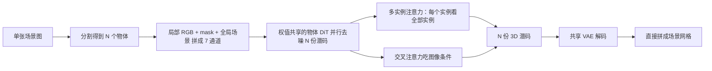

# MIDI：把预训练图生 3D 物体模型扩成多实例扩散，一次生成带空间关系的场景

<!-- release-date: 2024-12-04 -->

**本文依据**：`MIDI: Multi-Instance Diffusion for Single Image to 3D Scene Generation`，arXiv:2412.03558v3 [cs.CV]（2025-07-17），14 页 letter。作者 Zehuan Huang^{1}（Beihang University）、Yuan-Chen Guo^{2}†（项目负责人，VAST）、Xingqiao An^{3}（Tsinghua University）、Yunhan Yang^{4}（The University of Hong Kong）、Yangguang Li^{2}、Zi-Xin Zou^{2}、Ding Liang^{2}（VAST）、Xihui Liu^{4}（The University of Hong Kong）、Yan-Pei Cao^{2}（VAST）、Lu Sheng^{1}（Beihang University）。项目页 `https://huanngzh.github.io/MIDI-Page/`。盘上 PDF 页眉写明 arXiv:2412.03558v3 [cs.CV] 17 Jul 2025。官方 abs：`https://arxiv.org/abs/2412.03558`，v1 提交日 **2024-12-04**。封面与全文抽取均未印会议名。文中数字都标 PDF 页码。本文只读这一份 PDF。

## 一句话

单张图要变成可组合的 3D 场景，难处不在「每个物体单独长什么样」，而在**只看到一个视角、却要同时猜出多个物体的几何和它们在空间里怎么摆**（PDF p. 1）。当时两条旧路都不稳：用场景级数据训前馈重建，数据少、域外差；从 CAD 库检索再对齐，库里永远缺那件「刚好对上这张图」的模型（PDF p. 1–2）。后来有人把强的图生 3D 物体模型当工具，按「分割 → 补全单物体图 → 逐个生成 → 再优化布局」拼场景，流程长、误差会叠，而且布局优化改不了上一阶段已经定死、又没看过全局场景的那几个物体（PDF p. 2）。MIDI 的做法是：**把已经训好的图生 3D 物体扩散，扩成一次并行去噪多个实例的多实例扩散**；用多实例注意力在去噪过程里直接学物体之间的交互；条件用局部物体图加全局场景图；训练时场景数据很少，就用单物体数据当正则，保住预训练泛化（PDF p. 1）。合成、真实、文生图风格化场景上都报了当时最好的一组指标（PDF p. 1、p. 6）。

它解决的不是「再做一个更强的单物体 3D 生成器」，而是：**空间关系能不能写进生成过程本身，而不是事后拼装。**

## 一、矛盾：单物体先验已经很强，场景却还在多阶段拼

作者把单图场景方法分成两类（PDF p. 1–2）：

1. **前馈重建**。用场景级 3D 数据训网络，一次前向出几何。监督少，未见过的场景质量差。
2. **检索组装**。从图里猜形状、姿态、尺度，到数据库里捞 CAD 再摆回去。单图线索不够，检索会错；库也不可能覆盖「恰好对应这张输入」的每一个模型，只能近似对齐。

两边共同的缺口是：**新形状和新布局上的精度与域外泛化都不够**（PDF p. 2）。

与此同时，大规模图生 3D 物体模型已经能从一张物体图出高质量几何（PDF p. 2）。把它们当工具拼场景，常见流水线是（图 2，PDF p. 2）：分割场景图 → 给每个物体 inpaint 补全 → 各自做 3D 生成 → 再优化相对位置。先验被用上了，但作者指出两处硬伤：

- 步骤多，中间一步错，后面全歪。
- 布局优化只能挪已经生成好的物体；那些物体在上一阶段是**没有全局场景上下文、一个一个独立生成的**，和整张图对不齐（PDF p. 2）。

因此，如果物体之间的空间关系能**直接写进 3D 生成模型**，就可以端到端同时生成所有实例，并带上一致的摆放（PDF p. 2）。这就是 MIDI：在预训练物体生成模型上做多实例扩散，加多实例注意力，不再走复杂多步流程（PDF p. 2）。

上图是机制示意，根据 PDF 图 2–4（p. 2–4）与第 4 节重画，不是实测时间轴。平面背景（地板、墙）不在生成范围内，作者说可用已有方法另做（PDF p. 5）。

三条贡献按原文（PDF p. 2）：

- 新范式：多实例扩散，把预训练图生 3D 扩成同时生成空间相关的多个 3D 实例。
- 多实例注意力：在生成过程里建跨实例交互，保证空间关系。
- 实验：当时 SOTA，物体关系更准、和输入更对齐。

## 二、相关工作：重建、检索、分步生成，缺的是「生成时就看见别人」

**单图场景重建**。前馈法用编码器–解码器预测几何和实例标签；联合预测布局和物体姿态能保证内在一致性，但 3D 场景监督稀缺，域外差（PDF p. 3）。检索法如 DiffCAD 用扩散在合成监督下建模 CAD 形状、姿态、尺度分布，再检索对齐；细节可以很好，但绑死数据库多样性，单图信息不够就会检索错、对不齐（PDF p. 3）。组合生成法调用大感知模型和图像 / 3D 生成模型，流水线仍是分割、物体补全、逐物体生成、布局优化；泛化靠预训练，但误差累积，且**逐物体阶段没有全局场景上下文**（PDF p. 3）。

**单图 3D 物体生成**。一类先出多视图再重建；一类训原生 3D 几何，通常是 VAE 加潜空间扩散 Transformer（DiT），数据大、泛化强（PDF p. 3）。MIDI 选后一类当底座：**微调物体几何生成器，去出组合实例，同时尽量保住泛化**（PDF p. 3）。

## 三、底座：物体生成模型已经是 VAE + 潜扩散 + 图像交叉注意力

第 3 节把底座拆成三块（PDF p. 3–4）：

1. Transformer 结构的 VAE：编码器 $\mathcal{E}$、解码器 $\mathcal{D}$，把 3D 几何压到低维潜空间。
2. 去噪网络 $\epsilon_\theta$，在潜空间把 $\epsilon\sim\mathcal{N}(0,I)$ 变成数据分布 $z_0$。
3. CLIP / DINO 一类条件编码器，用交叉注意力把文本或图像条件送进去。

推理时先在潜空间采样，解码器出 SDF 或 tri-plane 一类表示，再 marching cubes 或另接映射网络成网格（PDF p. 4）。

附录把他们自己的底座写得更具体（PDF p. 13）。几何 $x\in\mathbb{R}^{L\times 6}$ 是 $L$ 个点的位置加法向，压成 $z=\mathcal{E}(x)\in\mathbb{R}^{l\times c}$；解码用 $s=\mathcal{D}(z)$ 回归 SDF。VAE 块结构跟随 3DShape2VecSet。去噪跟 rectified flow：沿直线

$$
z_t = t\,z_0 + (1-t)\,\epsilon
$$

（PDF p. 13 式 4）。实际用 logit-normal 采样，给中间时间步更大权重。去噪网 **21** 个带残差的注意力块，目标是逼近这条直线的斜率（PDF p. 13 式 5）。MIDI 的实现声明基于他们自己的图生 3D 模型，rectified flow，21 块，从已有物体生成方法发展而来（PDF p. 5）。

## 四、设计：并行去噪 + 多实例注意力 + 局部加全局条件

给定一张场景图，目标是生成 $N$ 个空间相关的潜码 $\{z_i^0\}_{i=1}^{N}$，解码后直接拼成场景（PDF p. 4）。相对原来的物体 DiT，多实例扩散改三处（PDF p. 4，图 3）：

1. **多份潜码并行去噪**，网络权值共享。
2. **多实例注意力**进 DiT，学跨实例交互、给全局意识。
3. **图像条件**：局部物体图加全局场景。

VAE 仍用底座那套，分别压每个实例。去噪网络条件是全局场景图 $c_g$、各物体 RGB $\{c_i^l\}$ 和 mask $\{m_i^l\}$（PDF p. 4）。

### 多实例注意力：从「只问自己」改成「问全场」

组合生成要求多个实例在 3D 里有交互。作者把这件事放进去噪过程：在潜特征上建跨实例交互，独立生成变成同步交互（PDF p. 4）。

原来物体自注意力里，每个物体的 token 只 query 自己。多实例注意力把 $K$ 层这种自注意力改掉，让实例 $i$ 的特征 $f^i$ 去看全部实例 $\{f^j\}_{j=1}^{N}$（PDF p. 4 式 1、图 4）：

$$
f^i_{\mathrm{out}}=\mathrm{Attention}\bigl(f^i,\{f^j\}_{j=1}^{N}\bigr).
$$

人话：每个 token 现在可以问场景里所有实例的 token，包括自己。空间依赖不再等后处理。

实现上 **21** 块里只改 **$K=5$** 层（PDF p. 5）。消融说明为什么不能全改：见第七节。

### 图像条件：7 通道拼图，交叉注意力灌进去

每个实例 $z^i$ 把局部 RGB $c_i^l$、mask $m_i^l$ 和全局场景 $c_g$ **沿通道拼接**，得到 $y\in\mathbb{R}^{h\times w\times c}$，$c=7$。ViT 图像编码器（基于 DINO）把输入投影扩到 7 通道，抽出图像 token，再由去噪 Transformer 的交叉注意力吃进去（PDF p. 4–5）。$y$ 分辨率设 **512**（PDF p. 5）。

这就是「部分物体图 + 场景上下文」：局部告诉模型这个实例长什么样、在图上哪一块；全局告诉它整间屋子怎么排。去掉全局图，摆放会乱（PDF p. 8）。

## 五、训练：场景数据少，用单物体正则保住预训练

底座是 rectified flow。MIDI 把单物体损失扩成多实例（PDF p. 5）。一步里对所有实例抽**同一个**噪声水平 $t\in[0,1]$，沿直线扰动（PDF p. 5 式 2）：

$$
\{z_t^i\}_{i=1}^{N}=t\{z_0^i\}_{i=1}^{N}+(1-t)\{\epsilon^i\}_{i=1}^{N}.
$$

然后对去噪网 $\epsilon_\theta$ 和图像编码器 $\tau_\theta$ 用（PDF p. 5 式 3）

$$
\mathbb{E}\Bigl[\sum_{i=1}^{N}\lVert z_0^i-\epsilon^i-\epsilon_\theta(z_t^i,t,\tau_\theta(y))\rVert_2^2\Bigr].
$$

场景训练集远小于单物体预训练集，所以另外混 3D 物体数据。实践上 **30%** 概率关掉多实例注意力，把模型当普通图生 3D，在 Objaverse 子集上训（PDF p. 5）。微调用 LoRA（PDF p. 5）。

数据：3D-Front 室内合成场景，滤掉交叉、悬浮等不合理摆放，约 **15,000** 高质量场景；随机抽 **1,000** 张场景图做测试（PDF p. 5）。评测还用 BlendSwap（合成）、Matterport3D 与 ScanNet（真实）；泛化再用 SDXL 等文生图出的风格化场景（PDF p. 5）。

指标：整场景 Chamfer Distance 与 F-Score（默认阈值 **0.1**）；物体级 CD / F-Score；物体包围盒 Volume IoU；以及每场景平均运行时间（PDF p. 5）。

附录训练细节（PDF p. 13）：最多同时生成 **$N=7$**。3D-FRONT 里五件及以下占多数，超过五件的场景用聚类挑五个代表物体来训，而不是直接丢掉。条件图以 **0.1** 概率 drop，给分类器自由引导留空条件。学习率 **$5\times 10^{-5}$**，**5** 个 epoch，**8** 张 NVIDIA A100。推理：Grounded-SAM 分割；CFG，步数 **50**，引导尺度 **7.0**；单图出场景约 **40** 秒（A100）（PDF p. 13）。

表 3 训练成本（batch size = 1，PDF p. 13）：

| 实例数 $N$ | 显存 (GB) | 速度 (iter/s) |
|---|---|---|
| 1 | 15 | 1.50 |
| 3 | 17 | 0.83 |
| 5 | 19 | 0.55 |
| 7 | 21 | 0.40 |

$N=7$ 时作者认为仍可承受（PDF p. 13）。

## 六、实验：合成表上全面最好，真实和风格化靠图说话

基线：前馈 PanoRecon、Total3D、InstPIFu、SSR；检索 DiffCAD；组合生成 Gen3DSR、REPARO（PDF p. 5）。

表 1 合成数据（PDF p. 6）。3D-Front 上 MIDI：场景 CD **0.080**、F-Score **50.19**，物体 CD **0.103**、F-Score **53.58**，盒 IoU **0.518**。次优检索 DiffCAD 场景 CD 是 **0.117**、盒 IoU **0.392**；组合生成里 Gen3DSR 物体 CD **0.157**、REPARO 物体 F-Score **40.85**。BlendSwap 上 MIDI：场景 CD **0.077**、F-Score **78.21**，物体 CD **0.090**、F-Score **62.94**，盒 IoU **0.663**。运行时间 **40s**，和前馈重建同一量级（32–39s），远低于 Gen3DSR **9min**、REPARO **4min**（PDF p. 6）。

作者把增益拆两层（PDF p. 6）：物体级靠预训练 3D 物体先验，相对「只在有限场景数据上重建」跳一截；场景级和盒 IoU 说明多实例扩散比多阶段逐物体生成更稳、更准。图 5：前馈几何和布局常错；检索对不齐输入；多阶段缺场景约束，实例对不齐整图。MIDI 几何和质量摆放都更好（PDF p. 6）。

真实图：Matterport3D 与 ScanNet 测试集各抽场景，每场景一张图，共 **10** 个场景做定性对比（PDF p. 6–7，图 6）。作者说精度和完整性明显更好，用来支撑多实例扩散的泛化，**没有给真实集上的表 1 同款数字**。

风格化：SDXL 出多样风格场景图；因其他方法吃不了这么多样的输入，只和 REPARO 比（PDF p. 7，图 8）。MIDI 仍能出对齐、连贯的 3D 场景。

纹理不在主模型里。附录：先 MIDI 出几何，再用 MV-Adapter 按每个实例的局部图贴纹理（PDF p. 13–14，图 10）。

## 七、消融：注意力层数、全局图、Objaverse 混训，三件都不是装饰

表 2 在 3D-Front 上（PDF p. 7）。

| 设定 | CD-S↓ | F-Score-S↑ | CD-O↓ | F-Score-O↑ | IoU-B↑ |
|---|---|---|---|---|---|
| $K{=}0$，无全局图、无 Objaverse | 0.152 | 41.16 | – | – | – |
| $K{=}0$，有全局图 + Objaverse | 0.145 | 40.94 | 0.096 | 54.16 | 0.327 |
| $K{=}5$，全开（正文默认） | 0.080 | 50.19 | 0.103 | 53.58 | 0.518 |
| $K{=}21$，全开 | 0.127 | 44.88 | 0.141 | 48.55 | 0.423 |
| $K{=}5$，无全局图 | 0.134 | 41.49 | 0.102 | 52.91 | 0.459 |
| $K{=}5$，无 Objaverse | 0.137 | 42.00 | 0.126 | 51.62 | 0.502 |

**什么都不加的底座**：直接在场景数据上微调物体生成器，**分不出可分离的多实例**，空间关系也弱，因为场景数据太少（PDF p. 7–8，图 7）。表里这一行物体级和 IoU 是空的。

**$K$**：0 / 5 / 21。$K=0$ 抓不住正确空间关系，布局不连贯，盒 IoU 只有 **0.327**。$K=21$ 把全部自注意力都改成多实例，场景数据相对预训练太小，过拟合、几何扭曲，物体 CD 升到 **0.141**。$K=5$ 只改一部分层，交互和预训练先验折中最好（PDF p. 8）。

**去掉全局场景图**：只看局部物体图和 mask，场景 CD 从 **0.080** 升到 **0.134**，摆放错、关系乱（PDF p. 8）。

**去掉 Objaverse 混训**：几何变差，物体 CD **0.126** 对默认 **0.103**；作者说会在较小场景集上过拟合。单物体数据用来保住物体级知识（PDF p. 8）。

注意：$K=0$ 且开了全局图和 Objaverse 时，物体 CD **0.096** 甚至略好于 $K=5$ 的 **0.103**，但盒 IoU **0.327** 远差于 **0.518**。多实例注意力换的是**布局**，不是单物体表面精度。

## 八、限制：小物体分辨率、复杂交互、开放世界规模

结论节与附录第 10 节（PDF p. 8、p. 14，图 11）：

- 输入分辨率很低、实例交互很复杂时较差。
- 实例生在全局场景坐标系、归一化到 $[-1,1]$。小物体只占空间一小块，分辨率低于「在物体自己的规范空间里、模型全力生成一件」的情况。作者设想：规范空间生成物体，再显式出场景位置。
- 现有场景数据里的交互关系简单，动态、复杂交互（例如「熊猫弹吉他」这类人–物互动）吃力，需要专门数据（PDF p. 8）。
- 未来方向还包括：更显式的 3D 几何知识、更高效的多实例注意力；探场景生成模型里隐式的 3D 感知；把物体数量和开放世界规模做上去（PDF p. 8）。

致谢：国家自然科学基金 62132001 与中央高校基本科研业务费（PDF p. 9）。

论文**没有写**：底座 VAE 的 $L$、$l$、$c$ 具体数字；LoRA 秩；Objaverse 子集规模；真实场景的定量表；分割错误如何回传。纹理依赖后作 MV-Adapter，不是 MIDI 本体。

## 九、可迁移的几件事

1. **后处理优化改不了已经独立生成的物体。** 空间关系要进生成过程。多实例注意力是「共享骨干 + 改一部分自注意力让 token 看见别人」，不是另训一个布局网络。
2. **只改全部注意力层会毁掉预训练。** $K=21$ 比 $K=5$ 差，因为场景数据远小于物体预训练。迁移时先改子集层。
3. **场景数据少时，关掉跨实例模块、混单物体数据**（这里 30%）是在保先验，不是凑 batch。
4. **局部条件不够。** 7 通道里必须有全局图；否则物体几何还在，房间摆乱。
5. **生成坐标系影响分辨率预算。** 全局 $[-1,1]$ 对小物体不友好；规范空间加显式位姿是论文自己标出的下一刀。
6. **评测要拆物体几何和布局。** 物体 CD 和好的盒 IoU 可以不同步；$K=0$ 就是例子。

## 十、关键词回看

- **多实例扩散（multi-instance diffusion）**：共享去噪网并行去噪 $N$ 份 3D 潜码，而不是物体生成完再拼。
- **多实例注意力（multi-instance attention）**：自注意力的 key/value 来自场景内全部实例。
- **部分物体图 + 场景上下文**：RGB、mask、全局图拼成 7 通道，交叉注意力注入。
- **单物体正则**：30% 关掉多实例注意力，在 Objaverse 上当普通图生 3D 训。
- **Rectified flow 直线插值**：同一 $t$ 扰动所有实例，预测 $z_0-\epsilon$。

## 参考资料

- 本 PDF：`readings/_src/图像、视频与 3D 生成/MIDI.pdf`
- 项目页：`https://huanngzh.github.io/MIDI-Page/`
- arXiv abs：`https://arxiv.org/abs/2412.03558`
