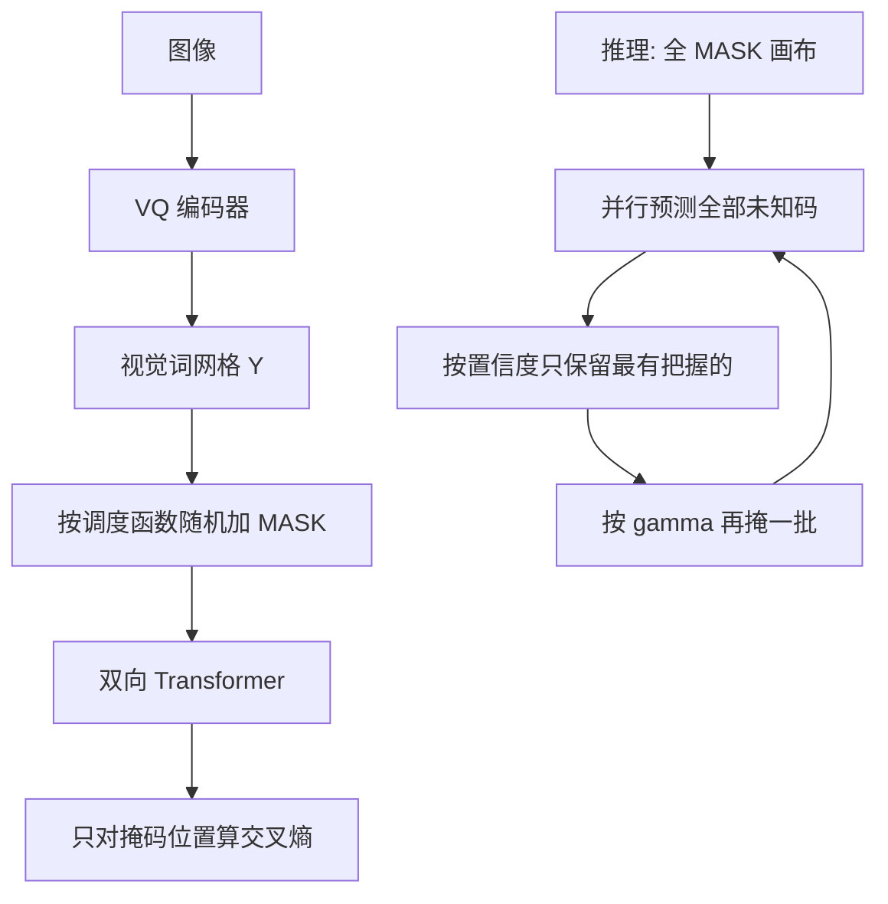

# MaskGIT：把图像当画布，用双向掩码一次猜很多码

<!-- release-date: 2022-02-08 -->

**本文依据**：`MaskGIT: Masked Generative Image Transformer`，arXiv:2202.04200v1 [cs.CV]（2022-02-08），23 页 letter。作者 Huiwen Chang、Han Zhang、Lu Jiang、Ce Liu（脚注：currently affiliated with Microsoft Azure AI）、William T. Freeman，Google Research。盘上 PDF 页眉写明 arXiv:2202.04200v1 [cs.CV] 8 Feb 2022。封面图 1 三列分辨率分别为 $512\times 512$、$512\times 512$、$512\times 2560$（PDF p. 1）。首发日取 arXiv v1 提交日 **2022-02-08**。文中数字都标 PDF 页码；标「外部补充」的段落不来自本文。本文只解读 MaskGIT 自己的第二阶段（掩码视觉词建模与迭代并行解码），不把 VQ-GAN 或 ImageGPT 写成这篇论文。

## 一句话

当时最好的生成 Transformer 仍把图当成一条从左到右、一行接一行的词序列，自回归按光栅扫描吐码。MaskGIT 改成 BERT 式双向训练：随机盖住一部分视觉词，用全方向上下文去猜；推理时从全掩码画布出发，每步并行预测所有未知位置，只留下最有把握的码，再按调度函数逐步揭开，常数步就能出图。ImageNet 上它相对当时的自回归 Transformer（VQGAN）更快（最高约 $64\times$），质量也更好；同一套权重还能做框内换类、补洞和外推（PDF p. 1–2）。

它解决的不是「再换一套码本」，而是第二阶段的解码顺序：图像不是句子，不该被迫按打印顺序生成。

## 一、矛盾：图不是句子，光栅自回归又慢又别扭

2022 年初，GAN 仍常占高保真合成的榜首，但训练不稳、模式崩塌、多样性差仍是公开问题（PDF p. 1）。受 Transformer 与 GPT 带动，视觉侧出现一批两阶段生成器：第一阶段把图量化成离散视觉词；第二阶段用自回归 Transformer 按已生成的码预测下一个（PDF p. 1）。相对 GAN 的 min-max，它们用最大似然，训练更稳，覆盖更好（PDF p. 1）。

作者的判断是：当时工作几乎都在抠第一阶段怎么量化、怎么少丢信息，第二阶段直接从 NLP 搬过来（PDF p. 1）。于是即便当时最强的生成 Transformer，仍把二维格子压成一维，按光栅扫描从左到右、从上到下解码（PDF p. 1–2，图 2）。

这有两处不对：

1. **图像不是序列**。画家先素描再改细节，不是一行行打印（PDF p. 2）。
2. **序列随分辨率平方涨**。长程相关难建模，解码也贵。文中例子：在 GPU 上对 $32\times 32$ 个码做自回归，出一张图要约 30 秒（PDF p. 2）。

图 2 把对照钉死：自回归要 256 轮；MaskGIT 从全未知（浅灰）出发，每轮并行填一批散落的码（深灰），8 轮结束（PDF p. 2）。

上图是机制示意，根据 PDF 图 2–3（p. 2–3）重画，不是实测时间轴。码本接口沿用 VQGAN；本文贡献在第二阶段的掩码目标与迭代解码。

## 二、第一阶段故意不改：沿用 VQGAN 的视觉词

### 旧问题

像素上直接最大似然很难。VQVAE 把生成挪到离散潜空间：编码器 $E$ 把 $x\in\mathbb{R}^{H\times W\times 3}$ 编成嵌入，码本 $e_k\in\mathbb{R}^{D}$（$k=1,\ldots,K$）做最近邻量化，解码器 $G$ 从视觉词重建（PDF p. 3）。第二阶段再对词序列建先验，最后用 $G$ 映回像素（PDF p. 3）。

DALL-E 用 Transformer 加强第二阶段；VQGAN 在第一阶段加对抗损失与感知损失提高保真；同期 VIM 用 ViT 骨干改进量化（PDF p. 3）。只要第二阶段仍是自回归，解码时间就随词长线性涨（PDF p. 3）。

### 新设计（本文的边界）

作者明确，目标是 **改进第二阶段**。第一阶段采用与 VQGAN 相同的设定，量化上的改进留给后作（PDF p. 3）。不要把 VQGAN 的感知损失、patch 判别器写成 MaskGIT 的贡献。

实验里每个数据集只训一套自编码器、解码器和 1024 词的码本，在裁切的 $256\times 256$ 上完成；空间下采样固定为 16，即 $H\times W$ 变成 $h\times w=(H/16)\times(W/16)$。同一套自编码器可复用到 $512\times 512$（PDF p. 5）。

## 三、训练：掩码视觉词建模（MVTM）

### 旧问题

BERT 的掩码语言模型用双向自注意力，被掩的位置能看两边（PDF p. 3）。视觉里已有人把掩码建模用到表示学习，但很少成功用到生成：双向注意力和自回归解码对不上（PDF p. 3）。作者声称：据他们所知，本文是在常用 ImageNet 基准上，第一次给出掩码建模对图像生成有效的证据（PDF p. 2–3）。灵感来自双向机器翻译；新意在掩码策略与解码算法（PDF p. 3）。

### 新设计

记 $Y=[y_i]_{i=1}^{N}$ 为 VQ 编码器给出的潜词，$N$ 是展平后的长度；$M=[m_i]_{i=1}^{N}$ 是二元掩码。训练时抽一部分位置换成特殊的 `[MASK]`：$m_i=1$ 则替换，$m_i=0$ 则保留（PDF p. 3）。

掩码比例由调度函数 $\gamma(r)\in(0,1]$ 给出：先从 0 到 1 抽一个比例，再在 $Y$ 上均匀选 $\lceil\gamma(r)\cdot N\rceil$ 个位置盖住（PDF p. 3–4）。目标是被掩位置的负对数似然（PDF p. 4 式 1）：

$$
\mathcal{L}_{\mathrm{mask}}=-\mathbb{E}_{Y\sim\mathcal{D}}\Bigl[\sum_{i:m_i=1}\log p(y_i\mid Y_M)\Bigr]
$$

把 $Y_M$ 送进多层双向 Transformer，对每个被掩位置得到 $P(y_i\mid Y_M)$，与真实 one-hot 做交叉熵（PDF p. 4）。

和自回归的关键差别：条件依赖是双向的，生成时能看整图上下文，而不是只看光栅顺序里已经吐出的前缀（PDF p. 4）。

### 接在系统哪里

第一阶段把像素变成短网格；第二阶段的损失只加在被掩的码上。推理时同一套网络不再按「下一个位置」，而按「当前画布上所有洞」。

### 可迁移启发

若你已经有离散码本，第二阶段不必默认 GPT 式因果掩码。双向目标更贴「改一处要看四周」的编辑，但必须配套非自回归采样，否则训练和推理对不上。

## 四、推理：迭代并行解码，而不是一行行打印

### 旧问题

自回归按已生成输出逐个吐码，无法并行；图像词长常是 256 或 1024，比句子长得多，所以慢（PDF p. 4）。理论上双向模型可以一轮填满整图，但与训练任务不一致，很难一次做对（PDF p. 4）。

### 新设计

从全掩码空白画布 $Y_M^{(0)}$ 开始。第 $t$ 轮四步（PDF p. 4）：

1. **Predict**。给定当前 $Y_M^{(t)}$，对所有被掩位置并行得到概率 $p^{(t)}\in\mathbb{R}^{N\times K}$。
2. **Sample**。每个被掩位置 $i$ 按 $p_i^{(t)}\in\mathbb{R}^{K}$ 从码本采样一个 $y_i^{(t)}$，把该位置的预测分数当作置信度；未被掩的位置置信度记为 $1.0$。
3. **Mask Schedule**。按 $\gamma$ 计算本轮还要盖住的个数 $n=\lceil\gamma(t/T)N\rceil$，$T$ 是总轮数。
4. **Mask**。把置信度低于「第 $n$ 高」的那些位置重新盖住，得到下一轮的 $Y_M^{(t+1)}$：若 $c_i<\mathrm{sorted}_j(c_j)[n]$ 则 $m_i^{(t+1)}=1$，否则为 0（PDF p. 4）。

每轮并行猜全部未知码，只留下最有把握的；其余下一轮重猜。掩码比例递减，直到 $T$ 轮内全部填完。实现上还会对要重掩的位置做带温度退火的随机采样，以增加多样性（效果在 4.4 节讨论；PDF p. 4）。图 2 的例子是 $T=8$；例如 $t=1$ 只留 1 个码、其余全盖（PDF p. 4）。

相对光栅自回归：条件不再只来自扫描前缀，而是来自所有方向上已经揭开的码（PDF p. 2）。

### 收益与边界

步数从与词长成正比变成常数 $T$。图 2 是 8 对 256；表 1 里 $256\times 256$ 用 8 步，$512\times 512$ 用 12 步（PDF p. 2、p. 6）。代价是：必须设计 $\gamma$，否则训练时见到的掩码比例和推理轨迹对不齐；步数也不是越多越好（见第六节）。

### 可迁移启发

「并行猜全部、只提交高置信、低置信下一轮重来」是一套与 BERT 训练对齐的采样，不必先发明新骨干。编辑任务往往只是改初始掩码 $M$，不必换网络。

## 五、掩码调度：余弦，而不是 BERT 的 15%

### 旧问题

BERT 固定掩 15%，适合从完整句子里挖洞，不适合从空白画布生成整图（PDF p. 4）。$\gamma$ 同时用于训练和推理：推理输入是 $0/T,1/T,\ldots,(T-1)/T$；训练则在 $[0,1)$ 上随机抽 $r$，模拟各种解码进度（PDF p. 4）。

作者要求 $\gamma$ 连续、值域在 0 与 1 之间，且对 $r$ 单调下降，$\gamma(0)\to 1$、$\gamma(1)\to 0$，以保证解码收敛（PDF p. 4）。

### 三类函数（PDF p. 4–5，图 8）

- **线性**：每步揭开大致同样多。
- **凹函数**（余弦、平方、立方、指数）：先少后多。开头几乎全掩，模型只需做出少量有把握的预测；结尾掩码比例陡降，强迫一次填很多。信息量在过程中增加。
- **凸函数**（平方根、对数）：先多后少。前几轮就要敲定绝大部分码。

消融里余弦全面最好，成为默认（PDF p. 5、p. 8）。

### 工作机制（人话）

把生成想成「先钉构图、再填纹理」。凹调度让前几步只提交最像「骨架」的码，后几步才在已揭开的骨架上补细节。这和封面那句「画家先素描」是同一条因果，不是装饰比喻。

## 六、实验设定与类别条件生成

### 模型与训练（PDF p. 5）

所有第二阶段模型同一套配置：24 层、8 个注意力头、嵌入维 768、隐层 3072；可学习位置编码、LayerNorm、截断正态初始化（stddev $=0.02$）。超参：label smoothing $=0.1$，dropout $=0.1$，Adam 的 $\beta_1=0.9$、$\beta_2=0.96$。增强用 RandomResizeAndCrop。$4\times 4$ TPU、batch size 256。ImageNet 训 300 epoch，Places2 训 200 epoch。作者写将发布代码与模型以便复现（PDF p. 5）。

### 质量（表 1，PDF p. 5–6）

ImageNet $256\times 256$，不用 beam search、top-k、nucleus 或分类器引导：FID 6.18 对 VQGAN 的 15.78，IS 182.1 对 78.3（PDF p. 5）。他们用同一套 tokenizer 与超参重训了一个 VQGAN 基线（表中 $^*$），双向仍明显更好（PDF p. 5）。相对 BigGAN-deep 的 FID 6.95，MaskGIT 的 6.18 更好；ADM 的 FID 是 10.94（数字取自既有文献，表注 $\diamond$；PDF p. 6）。

$512\times 512$：MaskGIT FID 7.32、IS 156.0、12 步；BigGAN-deep 为 8.43 / 232.5 / 1 步；他们的 VQGAN$^*$ 为 26.52 / 66.8 / 1024 步；ADM 为 23.24 / 58.06 / 250 步（PDF p. 6）。文中称 512 分辨率 FID 为当时新 SOTA（PDF p. 2、p. 5）。

参数量：MaskGIT 与重训 VQGAN 都是 227M；原论文 VQGAN 为 1.4B、256 步；VQVAE-2 估计 13.5B、5120 步；BigGAN-deep 160M、1 步（PDF p. 6）。

### 速度（PDF p. 5–6，图 4）

「步数」定义为生成一张样本所需的网络前向次数。表 1 里 MaskGIT 在非 GAN 模型中步数最少。墙钟上，单 GPU 对比 VQGAN 解码：加速约 30–64 倍，分辨率（词长）越高越明显（PDF p. 5，图 4）。摘要里的「最高 $64\times$」指这条对比（PDF p. 1）。

### 多样性：CAS 与 Precision/Recall（PDF p. 5–7）

CAS：只用候选模型生成的图训 ResNet-50，再在 ImageNet 验证集上测精度。真实训练集参考是 top-1 76.6%、top-5 93.1%（PDF p. 5）。$256\times 256$ 按惯例对 CAS 分类器做 RandAugment，无增强结果放附录 B（PDF p. 5）。

表 1（PDF p. 6）：

| 设定 | 模型 | FID↓ | IS↑ | Prec↑ | Rec↑ | 步数 | CAS top-1 / top-5 |
|---|---|---|---|---|---|---|---|
| 256 | BigGAN-deep | 6.95 | 198.2 | 0.87 | 0.28 | 1 | 43.99 / 67.89 |
| 256 | VQGAN$^*$ | 18.65 | 80.4 | 0.78 | 0.26 | 256 | 53.10 / 76.18 |
| 256 | MaskGIT | 6.18 | 182.1 | 0.80 | 0.51 | 8 | 63.14 / 84.45 |
| 512 | BigGAN-deep | 8.43 | 232.5 | 0.88 | 0.29 | 1 | 44.02 / 68.22 |
| 512 | VQGAN$^*$ | 26.52 | 66.8 | 0.73 | 0.31 | 1024 | 51.29 / 74.24 |
| 512 | MaskGIT | 7.32 | 156.0 | 0.78 | 0.50 | 12 | 63.43 / 84.79 |

VQVAE-2 的 256 CAS 为 54.83 / 77.59（PDF p. 6）。作者称两边分辨率的 CAS 都是当时新 SOTA（PDF p. 2、p. 5）。

Precision/Recall：相对 BigGAN，Recall（覆盖）更好；相对 VQVAE-2 与扩散，Precision（样本质量）更好；相对自己的 VQGAN 基线，Recall 升、Precision 略升（PDF p. 7）。图 5 用类别 009、980、993 对照：MaskGIT 在光照、姿态、尺度、背景上更散（PDF p. 6–7）。

### 附录 B：带拒绝采样的分数（PDF p. 12–13）

按先前 Transformer 做法，用预训练 ResNet 按预测概率打分，接受率 0.05（与 VQGAN 相同）。表 4：$256\times 256$ 上 MaskGIT FID 4.02、IS 355.6，VQGAN 为 5.88 / 304.8，ADM（guidance 1.0）为 4.59 / 186.70；$512\times 512$ 上 MaskGIT 4.46 / 342.0，ADM 7.72 / 172.71。文中称加上拒绝采样后 IS 为当时 SOTA（PDF p. 13）。

表 5 用 Inception 特征算 Precision/Recall，并给出无 RandAugment 的 CAS：MaskGIT Prec 0.78、Rec 0.50、CAS 58.20 / 79.65；VQGAN$^*$ 为 0.61 / 0.47 与 47.50 / 68.90；BigGAN-deep 为 0.82 / 0.27 与 42.65 / 65.92。真实数据参考改为 73.1 / 91.5（PDF p. 13）。作者认为 Inception 特征下的分数更符合「VQGAN 比 BigGAN 多样」的观感（PDF p. 13）。

## 七、编辑：换初始掩码，不必改网络

多向性让框内编辑、补洞、任意方向外推几乎只是约束迭代解码的初始 $M$（PDF p. 7）。不改架构、不做任务专用训练，三件事都能出像样结果；补洞与外推上相对专用模型也有可比数字，尽管本模型不是为它们设计的（PDF p. 2、p. 7）。

### 类别条件框内编辑（PDF p. 7，图 6）

给定框与目标类，只重生框内、框外保持。自回归做不到：会破坏它们的预测顺序。MaskGIT 把框当成初始掩码即可。图 6 目标类是 tiger cat。作者观察到：能换物体并在一定程度上补全背景；还能拼出训练集里少见但说得通的组合（飞猫、汤碗里的猫、花里的猫），说明学到了可组合的表示（PDF p. 7）。附录 C 还有金鱼、冰熊、蘑菇、吸蜜鹦鹉、火车、虎等（PDF p. 13、图 14）。

### Places2 补洞与外推（表 2，PDF p. 7–8）

把带洞的图 tokenize，把像素掩码解释成迭代解码的初始掩码；输出再按掩码边界与输入线性混合（做法跟随 In&Out；PDF p. 8）。为与基线训练对齐，在 Places2 的 $512\times 512$ 中心裁切上训 MaskGIT，超参与 ImageNet 模型相同（PDF p. 8）。

中心 $50\%\times 50\%$ 补洞（Places2 验证集）：MaskGIT FID 7.92、IS 22.95；DeepFill 11.51 / 22.55；ICT 13.63 / 17.70；HiFill 16.60 / 19.93；CoModGAN 7.13 / 21.82。表注：标 512 的在 $512\times 512$ 上评，其余在对应的 $256\times 256$ 上评（PDF p. 7）。相对 DeepFill、HiFill 明显更好，接近当时补洞 SOTA CoModGAN（PDF p. 8）。

向右外推 50%：MaskGIT 512 的 FID 6.78、IS 11.69；Boundless 35.02 / 6.15；In&Out 23.57 / 7.18；InfinityGAN 10.60 / 5.57；Boundless TFHub 7.80 / 5.99（PDF p. 7）。作者称外推 FID 与 IS 为当时 SOTA（PDF p. 8）。图 7：同一输入不同种子能出多样补全与多方向外推（PDF p. 7–8）。假设是 Transformer 全局注意力有助于补物体与整体结构（PDF p. 8）。

附录 D：与 ImageGPT、VQGAN 比上下各外推 50%。ImageGPT 最高约 $192\times 192$；MaskGIT 与 VQGAN 因 tokenization 能上更高分辨率。自回归模型单模型只能沿一个方向外推；MaskGIT 可任意方向（PDF p. 13，图 16–17）。附录 E：相对 GAN，结构更连贯、伪影更少；大掩码比（中心 $50\%$ 与 $31.25\%$）上 GAN 更吃力（PDF p. 13，图 18–20）。附录 C 图 15：从 $512\times 256$ 反复左右外推到 $512\times 2304$ 的「全景」（PDF p. 13）。封面图 1(c) 是 $512\times 2560$（PDF p. 1）。

## 八、消融：调度函数与步数甜区

默认设定在 ImageNet $256\times 256$ 上（PDF p. 8）。表 3 报各函数的最佳 FID / IS / NLL 及对应 $T$（PDF p. 8）：

| $\gamma$ | $T$ | FID↓ | IS↑ | NLL |
|---|---|---|---|---|
| Exponential | 8 | 7.89 | 156.3 | 4.83 |
| Cubic | 9 | 7.26 | 165.2 | 4.63 |
| Square | 10 | 6.35 | 179.9 | 4.38 |
| Cosine | 10 | 6.06 | 181.5 | 4.22 |
| Linear | 16 | 7.51 | 113.2 | 3.75 |
| Square Root | 32 | 12.33 | 99.0 | 3.34 |
| Logarithmic | 60 | 29.17 | 47.9 | 3.08 |

凹函数整体优于线性，线性再优于凸。余弦略优于平方，定为默认（PDF p. 8）。作者假设：凹函数训练时更常遇到高掩码比（更难的案例），解码时也符合「先少后多」；但过凹有代价：立方不如平方，指数明显更差（PDF p. 8）。

步数 $T$：不是越多越好。除对数全程差以外，其他函数都有性能峰，过峰再变差；越不凹，峰越靠后。余弦、平方、线性里，余弦总分最好，峰也最早，约 8–12 步（PDF p. 8，图 8）。假设：步太多会阻止模型留下不够自信的预测，伤害词的多样性（PDF p. 8）。注意表 3 余弦最佳点写 $T=10$、FID 6.06，主表 1 主模型是 8 步、FID 6.18，两者都来自原文，不要混成同一个数。

## 九、附录 A：重建说明视觉词很冗余

随机按比例 $r$ 掩潜词，再跑迭代解码做重建。图 9 展示 $r$ 从 95% 到 75%；图 10 用 PSNR 与 LPIPS 对 $r$ 作图（PDF p. 12）。即便掩掉约 95%，仍能恢复姿态、前景形状等整体信息。约 90% 附近有拐点：降到 90% 之前质量与一致性猛升，之后变慢。例如虎前的栅栏、车的颜色，掩码低于 90% 才稳定抓住，95% 时不行（PDF p. 12）。结论：整体重建只需要很小一部分码（文中举例约 10%），其余主要补外观细节——这与第三节「前几个码最关键」一致。同期 MAE 也讨论图像空间冗余；那是表示学习，不是本篇贡献（PDF p. 12）。

## 十、限制（附录 F）与本文没写的

图 21（PDF p. 13、p. 23）：

- **(A)(B)** 外推时语义或颜色漂移：注意力范围有限，画到另一头会「忘掉」这一头。
- **(C)(D)** 补洞/外推时忽略或改掉边界上的物体。
- **(E)** 人脸、文字、对称结构上过平滑或多余伪影。

这些改进留作未来工作（PDF p. 13）。结论还说：与当时 SOTA GAN 可比后，把该方法用到其他合成任务是值得做的方向（PDF p. 9）。

本文没有：改 tokenizer、文本条件、视频、开源仓库 URL（只承诺将发布）、训练墙钟总时长、或把 VQGAN/ImageGPT 的算法重写一遍。第一阶段数字若需要，应去读 VQ-GAN 那篇，而不是从这里脑补。

## 可迁移启发

1. **第二阶段的顺序是独立设计点**。有了离散码，不必默认光栅因果。双向训练 + 置信度筛选，能把步数从 $N$ 压到常数 $T$。
2. **训练掩码分布要覆盖「从空白到只剩几个洞」**。固定 15% 对生成不够。凹调度（余弦）把「先骨架后细节」写进 $\gamma$，而不是事后调采样温度。
3. **编辑可以是同一生成器的初始条件**。框、洞、外推区域都是 $M$ 的子集。若产品要修图，优先问能不能复用生成权重，而不是先上专用 GAN。
4. **步数有甜区**。并行解码不是「迭代越多越精细」；过多会筛掉多样性。要把 $T$ 和 $\gamma$ 一起扫。
5. **量化接口可以冻结**。这篇把贡献边界划在第二阶段，用对照实验（同一 tokenizer 的单向 vs 双向）把增益从「更好的码本」里分离出来。做消融时值得学这一刀。

## 关键词回看

- **视觉词 / 量化**：卷积 VQ 把图压成 $h\times w$ 的码本下标网格；本文沿用 VQGAN，不改这一段。
- **MVTM（Masked Visual Token Modeling）**：随机盖码，双向 Transformer 只在被盖位置算交叉熵。
- **迭代并行解码**：每步猜全部未知位置，按置信度提交一部分，其余重掩。
- **掩码调度 $\gamma$**：决定每步盖多少；余弦默认；推理用 $t/T$，训练随机抽 $r$。
- **CAS**：用生成图训分类器，再在真实验证集上测，兼看质量与覆盖。

## 参考资料

- 原论文：https://arxiv.org/abs/2202.04200 （v1，2022-02-08）
- 同方向已解读、只作边界、不当作本篇证据：`readings/图像、视频与 3D 生成/VQ-GAN.md`、`DDPM.md`
