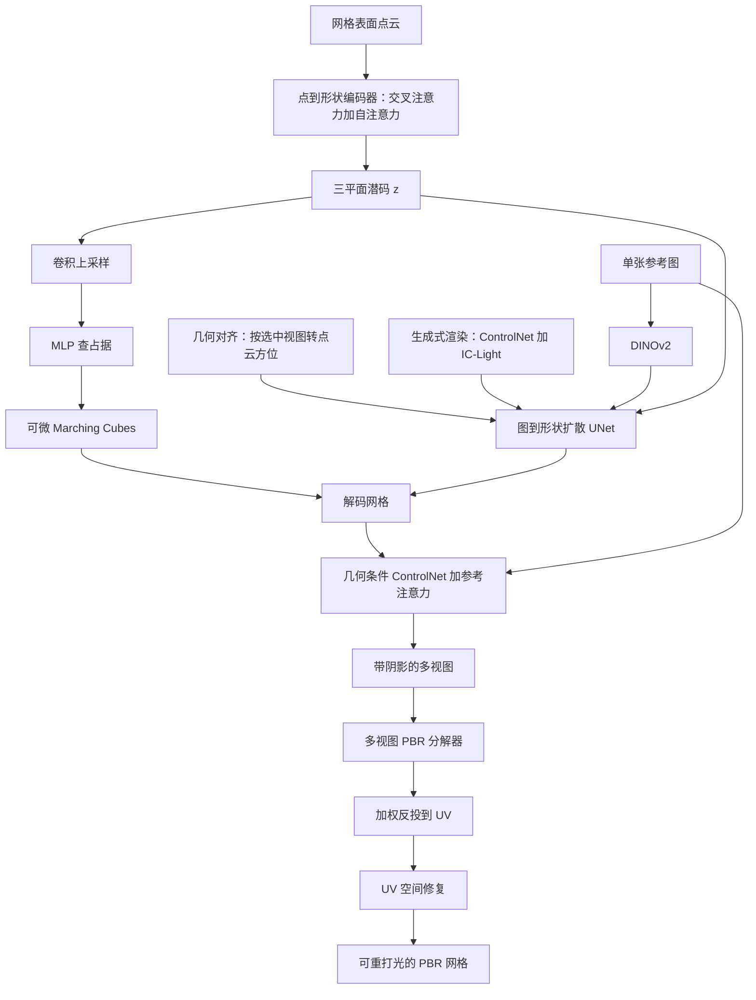

# MeshGen：渲染增强点到形状自编码器加生成式增广，单图出带 PBR 的网格

<!-- release-date: 2025-05-07 -->

**本文依据**：`MeshGen: Generating PBR Textured Mesh with Render-Enhanced Auto-Encoder and Generative Data Augmentation`，arXiv:2505.04656v1 [cs.GR] 7 May 2025，25 页 letter。作者 Zilong Chen^{1}（Beijing National Research Center for Information Science and Technology (BNRist)，Department of Computer Science and Technology, Tsinghua University）、Yikai Wang^{2}†（School of Artificial Intelligence, Beijing Normal University，通讯）、Wenqiang Sun^{3}（HKUST）、Feng Wang^{1}（Tsinghua）、Yiwen Chen^{4}（S-Lab, School of Computer Science and Engineering, Nanyang Technological University）、Huaping Liu^{1}†（Tsinghua，通讯）。封面页眉写明 arXiv:2505.04656v1 [cs.GR] 7 May 2025。项目页 `https://heheyas.github.io/MeshGen`。官方 abs：`https://arxiv.org/abs/2505.04656`，v1 提交日 **2025-05-07**。封面与全文抽取均未印会议名；Creator 为 LaTeX with hyperref。文中数字都标 PDF 页码。本文只读这一份 PDF。

## 一句话

单张参考图要变成可进管线的 **基于物理的渲染（PBR）** 网格，当时两条路都卡：大重建模型走体表示再转网格，几何会掉；原生 3D 扩散把网格压进潜空间再生成，自编码器缺感知损失、公开数据又少又对称，形状对不上图，纹理还容易把光照烤死（PDF p. 1–2）。MeshGen 拆成三段：先用 **渲染增强的点到形状自编码器**，把网格压成三平面潜码，粗阶段只学占据，细阶段加法线感知损失和射线正则；再在潜空间训单图到形状的扩散，用 **几何对齐增广** 和 **生成式渲染增广** 补数据、对齐图与形；最后用参考注意力的多视图 ControlNet 出带阴影的多视图，再接多视图 PBR 分解器和 UV 修复，填看不见的面（PDF p. 1–2、p. 3 图 1）。作者写整条管线可在 **30 秒** 内出带 PBR、几何与外观都尽量贴参考图的网格（PDF p. 2）。

它解决的不是「再做一个更强的图生 3D」，而是：**自编码器能不能保住高频表面、有限公开数据上图和形能不能对上、纹理能不能拆成可重打光的 PBR 而不是烤光贴图。**

## 一、矛盾：原生 3D 已经能出网格，却对不上图、贴不出 PBR

引言把当时进展分成三层（PDF p. 1–2）：

1. **按场景优化**。分数蒸馏采样（SDS）蹭文生图先验，慢，还容易模态崩和 Janus。
2. **多视图生成加大重建模型**。先出多视图再重建，或把稀疏视图直接映到三平面 NeRF、3D 高斯。快一些、好看一些，但表示常常是体而不是网格，转网格会掉质量；只靠多视图监督，复杂几何也容易对不齐。
3. **原生 3D 扩散**。用 3D 自编码器把网格压进紧凑潜空间，直接学生成分布，不再从多视图重建。这是 MeshGen 站的那一类。

原生路线仍有三处硬伤（PDF p. 1–2）：

- 自编码器几乎只靠占据，**没有感知损失**，高频表面和细节装不进去。
- 公开数据少、质量差，Objaverse 里大量物体几何对称、纹理不真实，训出来的扩散爱出简单对称形，和参考图差一截。
- 图条件纹理对不上参考图，而且常常只能出 **把光照烤进贴图** 的外观，不是应用里要的 PBR 材质。

因此作者把产品目标写死：图生 3D 管线，几何和外观都尽量像参考图，并且纹理是可重打光的 PBR（PDF p. 2）。三条贡献按原文（PDF p. 2）：

- **渲染增强自编码器**：由粗到细加感知损失，再加射线正则，稳住表面、抬几何表示质量。
- **生成式数据增广**：在「几何–纹理已拆开」的框架上，做几何对齐和生成式渲染增广，有限公开数据上也要可控、能泛化。
- **一致的 PBR 纹理生成器**：多视图几何信息进 ControlNet，同时保住参考图观感；再接 PBR 分解器。

上图是机制示意，根据 PDF 图 1（p. 3）与第 3 节重画，不是实测时间轴。30 秒是作者在引言里给的整条管线说法（PDF p. 2），附录没有把几何、纹理各自的墙钟拆开写成一张表。

读的时候不要带着后来滤镜。这份 PDF 是 arXiv v1 预印，封面未印录用会；致谢写了 rebuttal 阶段有人帮忙（PDF p. 9），但正文没印会议名。几何和纹理也不是一个端到端网络：先出形，再贴 PBR。

## 二、相关工作：重建出体、原生出形，纹理还在烤光和缝

**3D 生成**。早期 CLIP 相似度和 SDS 按场景优化；随后多视图生成与大重建模型（InstantMesh 先多视图到三平面 NeRF 再接到 FlexiCubes；MeshFormer 用分层体素）（PDF p. 2）。作者的批评很具体：多视图生成本身不够稳，网格质量要求又在涨，所以原生 3D 生成被推到前台。3DShape2VecSet 与 CLAY 用潜向量集合；CraftsMan 给自编码器加点法向、再做法向增强；Direct3D 用三平面抓结构（PDF p. 2）。MeshGen 编码器跟点到形状这一路，潜表示却选三平面而不是向量集合，原因写在下一节。

**纹理**。一类只用图扩散做迭代修复和优化（TEXTure 按视点推进 UV；FlashTex 用光照 ControlNet 做文生 PBR）。一类在带纹理的 3D 数据上训生成模型（Texturify 的 GAN、Paint3D 的由粗到细、Meta 3D TextureGen 的几何条件多视图）（PDF p. 2）。MeshGen 要的是：**几何已经对不齐图时，仍能出和参考图一致、且可分解成 PBR 通道的外观**，而不是再做一遍深度到图的逐步涂色。

## 三、自编码器：点云进、三平面出，粗学占据、细看法线

第 3.1 节先定表示（PDF p. 3）。离散三角网格要压成连续潜空间，编码器跟先前原生方法同一套 **点到形状编码器**：从表面均匀采 $N_P$ 个点，做傅里叶位置编码，用可学习查询做交叉注意力，再叠自注意力：

$$
\mathbf{z}=\texttt{SelfAttn}^{n}(\texttt{CrossAttn}(Q,\texttt{PE}(P))),
$$

其中 $Q\in\mathbb{R}^{N_z\times d_z}$，$P\in\mathbb{R}^{N_P\times 3}$（PDF p. 3 式 1）。附录表 4：$N_P=65536$，$N_z=3072$，自注意力 **10** 层，$d_z=16$（PDF p. 15）。

潜表示不选 3DShape2VecSet 的向量集合，改选 **三平面**（跟 Direct3D 同类）。作者给的理由：查占据只需 MLP，不必对全部潜码做交叉注意力，才方便更高分辨率抽表面，也才接得上渲染损失（PDF p. 3）。三个平面沿 **高度维拼接** 而不是通道维拼接，避免空间错位伪影（PDF p. 3）。占据写成

$$
\mathrm{Occupancy}(\mathbf{x})=\mathrm{MLP}(\texttt{UpSample}(\mathbf{z}_{\mathrm{tile}}),\mathbf{x}),
$$

$\texttt{UpSample}$ 是卷积上采样，$\mathbf{z}_{\mathrm{tile}}$ 是高度拼接后的三平面（PDF p. 3 式 2）。

### 为什么要渲染损失，又为什么不能直接加

旧点到形状自编码器只监督占据，高频细节差。他们想用法线图加感知损失补表面信息：训练时在 $256^3$ 网格上查占据，可微抽等值面（PDF p. 3）。早期实验写得很直：**只加渲染损失会出严重浮游面**，附录 B.1 有例子，前人重建模型也碰到过（PDF p. 3、p. 18 图 8）。

对策两件：

1. **基于射线的正则**。对每条相机射线，在射线与包围盒交点和表面点之间均匀采 $N_s$ 个点（表 4 里 $N_s=128$），强迫空处占据接近 0（PDF p. 3–4、p. 15）。没有这条正则，训练会不稳、浮游面很重（PDF p. 18）。
2. **由粗到细**。可微 Marching Cubes 的梯度只能传到表面顶点附近，所以必须先有一个粗网格，渲染损失才有效（PDF p. 3–4）。

粗阶段损失（PDF p. 4 式 3）：

$$
\mathcal{L}_{\mathrm{coarse}}=\mathcal{L}_{\mathrm{BCE}}+\lambda_{\mathrm{KL}}\mathcal{L}_{\mathrm{KL}}+\lambda_{\mathrm{TV}}\mathcal{L}_{\mathrm{TV}}.
$$

细阶段再加上法线的 MSE、LPIPS，以及射线正则（PDF p. 4 式 4）。表 4：$\lambda_{\mathrm{KL}}=10^{-6}$，$\lambda_{\mathrm{TV}}=5\times 10^{-3}$，$\lambda_{\mathrm{MSE}}=1.0$，$\lambda_{\mathrm{LPIPS}}=2.0$，$\lambda_{\mathrm{reg}}=0.5$（PDF p. 15）。

附录训练配方：过滤后的 Objaverse 约 **15 万** 三角网格；归一化到 $[-1,1]^3$；表面 65536 点；近表面再加标准差 0.01 的高斯扰动采 10 万空间点；随机点在 $64^3$ 分层采样。粗阶段 **150** epoch、batch **192**；细阶段再 **50** epoch、batch **16**。全程约 **6 天、8 张 NVIDIA A100**（PDF p. 15）。非水密网格先按 CLAY 思路算 $512^3$ 无符号距离场，阈值 $2/512$ 做 Marching Cubes，再用连通域把不连最外层的部分标成内部；CUDA 工具下单网格预处理约 **0.1 秒**（PDF p. 15）。

主文表 3 在 Objaverse 测试集上：Vecset 准确率 94.844%、体积 IoU 87.426%；他们不加 refine 的变体 94.745% / 87.164%；完整渲染增强 **96.987% / 91.045%**（PDF p. 8）。附录表 6 在 2048 个验证物体上拆损失：去掉法线 MSE 或 LPIPS 都会掉；3D patch GAN 到 96.224% / 90.149%，仍低于完整设定（PDF p. 18）。点数方面作者说重建质量在高点数饱和，所以用 65536（PDF p. 17 图 9）。

**可迁移的一点**：3D 自编码器若只靠占据，表面高频进不去；渲染损失能进，但梯度局部，必须 **先粗后细**，并显式把空处占据按到 0，否则浮游面会吃掉你加进去的感知项。

## 四、图到形状扩散：几何可协变、外观应不变，所以做两种增广

第 3.2 节先诊断：相对大重建模型，当时原生 3D 生成爱出简单对称形，和参考图差很远（PDF p. 4 图 4）。作者归因于训练几乎绑在 Objaverse，里面大量对称几何、不真实纹理，扩散就复制简单几何，遇到复杂纹理或光照就泛化差（PDF p. 4）。

他们拿点到形状自编码器，和 Rodin、3DTopia 一类 **按物体优化 NeRF 当潜码** 的原生管线对比，抽出两条性质（PDF p. 4）：

1. **几何协变**。NeRF 潜码要预计算、存大量潜变量，物体一变换还得重优化辐射场，没有几何协变。点到形状吃点云、不必按物体优化，旋转一类变换直接改点云即可。
2. **外观不变**。旧 NeRF 原生方法出带纹理资产，输入图和纹理缠在一起。这里的扩散 **只把图映到形状**，合理纹理或光照下的渲染应对应同一形状。

于是两种增广（PDF p. 4 图 2）：

**几何对齐增广**。每个物体从多视图里选一张当条件，把点云方位角转到和这张图朝向对齐，再当训练对。作者写：这不只是扩大数据，图–形对齐也明显变好；消融在图 6（PDF p. 4、p. 8）。

**生成式渲染增广**。用物体几何，把数据集里已有渲染的法线、深度当控制信号，ControlNet 合成更真实的渲染，再用 IC-Light 换光照。作者写这对理解光照、泛化到真实图很有用（PDF p. 4–5）。附录：除法线深度 ControlNet 和 IP-Adapter 外，把初始噪声设成原图潜码再加有限噪声，让合成图更像原图；IC-Light 从左/右/上/下四个预定义光照方向里随机抽，再配一套光照提示。低质量图用 MLP 评估器：在 500 个样本上用原图与重打光图的 CLIP 嵌入打分，验证集 100 张准确率 **91%**（PDF p. 15）。

扩散 UNet 跟 Stable Diffusion 类似，卷积与注意力交错；三平面沿高度拼接进 UNet，平面之间靠自注意力（跟 Rodin）。参考图用预训练 **DINOv2** 编码，交叉注意力注入。训练日程跟 SD3：**rectified flow** 加 logit-normal 时间步采样（PDF p. 5）。附录：UNet 编码器 **8** 个带空间自注意力的 ResNet 块，解码器对称；图像编码器是 **DINOv2-G**。数据是过滤后的 GObjaverse，约 **12 万** 高质量网格。Objaverse 网格重力轴已对齐，他们强制生成 **绝对仰角为 0** 的网格，实验上比生成带仰角旋转更好。训练：**16 张 NVIDIA A800**、bf16、有效 batch **1536**，约 **18 天**（PDF p. 15–16）。

**可迁移的一点**：表示若几何协变、生成目标若与外观解耦，增广就可以 **对点云做刚体对齐、对条件图做生成式换材质换光**，而不必为每个姿态重优化一份潜场。这是在数据少时抬可控性和域外能力的杠杆，不是再堆一个更大的 UNet。

## 五、纹理：形已经对不齐图，所以不能直接反投

第 3.3 节把纹理管线写成三步：几何条件 ControlNet 加参考注意力出带阴影多视图 → PBR 分解器估通道 → 反投 UV 再修复看不见的面（PDF p. 5）。

主矛盾写得很具体：生成形状和输入图 **对不齐**，不能直接反投或做纹理优化。前人用 IP-Adapter 塞参考图，常常不像。他们改用 **参考注意力**：把参考图自注意力层的 key、value 接到去噪过程里，比 CLIP 特征更贴原图（PDF p. 5；机制图在附录图 7，PDF p. 16）。几何意识：在底座上接 ControlNet，用多视图法线、深度出多视图。但只做这一步不够（图 3 的「无参考注意力微调」）：训练时参考图和几何完全对齐，模型会 **优先几何对应、忽略语义**（PDF p. 5）。所以 ControlNet 训完后再加一段 **参考微调**：随机平移、旋转条件图，模拟对不齐，只微调参考注意力 key/value 的投影矩阵。图 3：轻量微调能补上对不齐带来的损失，又不会像全参微调那样把纹理抹平（PDF p. 5）。

底座是 **Zero123++**：给定正视图出六视图，排成 3×2 网格，在 Objaverse 渲染上微调 Stable Diffusion（PDF p. 16）。深度控制 **不做** 原版 Depth ControlNet 那种归一化视差，改成按相机距离和物体包围盒对角线做统一多视图归一化（PDF p. 16）。

### 多视图 PBR 分解

可重打光需要把带阴影多视图拆成 PBR 分量。分解器是 InstructPix2Pix 式架构，把带阴影图潜码和噪声潜码沿通道拼接，按文本提示分别出 metallic、roughness、albedo（PDF p. 5 式 5）。附录补充：建在 Zero123++ 上，每个通道用对应英文词当提示（PDF p. 16）。多视图融到 UV 用视角加权反投，权重是视线与点法向夹角的余弦，再 softmax；附录把 softmax 温度写成 **0.1**（PDF p. 5、p. 16）。ControlNet 有时画出物体轮廓外，反投会打到后面的面。他们做深度突变处滤波，丢掉这些像素，颜色靠其他视图补（PDF p. 16、p. 18 图 8）。

### UV 修复

拓扑复杂时固定多视图盖不住整张表面。UV 图和日常照片差得远，所以先在 Objaverse 纹理图上训 LoRA，合并进原 UNet，再在上面训修复 ControlNet。控制信号不只是掩膜图，还有 UV 空间的法线和位置图（PDF p. 5）。附录：修复器是多通道 ControlNet，底座是 LoRA 微调过的 Stable Diffusion 1.5；输入 **9** 通道（UV 法线 3 + 位置 3 + 带掩膜纹理 3，待修区域像素为 −1）。推理时按 ControlNet inpainting 在潜空间掩膜，保住不需要修的区域（PDF p. 16–17）。训练用的带 PBR 的 Objaverse 子集渲染出约 **3.5 万** 组多视图（法线、深度、albedo、粗糙度、金属度）（PDF p. 16）。可见掩膜在像素和 UV 上随机腐蚀，图的是更鲁棒（PDF p. 16）。

附录还把分解器和 HyperHuman / CLAY 那种 **专家分支** 做过同数据对比：共享骨干加不同输入输出适配器，容易通道串色、金属度和粗糙度不合理；分解器输入里自带全部多视图，一致性更好。作者也承认自己数据有限，更大数据上的对比留作未来（PDF p. 19–20 图 16）。

**可迁移的一点**：几何生成已经对不齐条件图时，纹理不要假设「能投影回去」。先用参考注意力在 **对不齐的几何条件** 下出多视图，再把外观拆成 PBR，最后在 UV 上修洞。对不齐要在微调里显式模拟，否则模型会只会「几何对上了就抄几何」。

## 六、实验：几何对标重建与原生扩散，纹理对人、也对可重打光指标

评测分两类几何基线（PDF p. 6）：大重建模型 InstantMesh、TripoSR、MeshFormer（MeshFormer 走官方 demo，当时未开源）；原生扩散 LN3Diff、3DTopia-XL、CraftsMan。设定跟 MeshFormer：GSO 与 OmniObject3D 上算 F-Score（阈值 0.2）和 Chamfer。MeshGen 是生成模型，表 1 报 **五个随机种子** 的均值和方差（PDF p. 7）。

表 1（PDF p. 7）：

| 方法 | GSO FS↑ | GSO CD↓ | Omni FS↑ | Omni CD↓ |
|---|---:|---:|---:|---:|
| One2345++ | 0.936 | 0.039 | 0.871 | 0.054 |
| TripoSR | 0.896 | 0.047 | 0.895 | 0.048 |
| CRM | 0.886 | 0.051 | 0.821 | 0.065 |
| LGM | 0.776 | 0.074 | 0.635 | 0.114 |
| InstantMesh | 0.934 | 0.037 | 0.889 | 0.049 |
| MeshLRM | 0.956 | 0.033 | 0.91 | 0.045 |
| MeshFormer | 0.963 | 0.031 | 0.914 | 0.043 |
| CraftsMan | 0.702 | 0.088 | 0.599 | 0.143 |
| LN3Diff | 0.647 | 0.102 | 0.534 | 0.168 |
| Ours | 0.971±0.014 | 0.028±0.005 | 0.918±0.010 | 0.040±0.004 |

作者据此说两项指标都超过表中前人（PDF p. 7）。定性：重建模型在外星人嘴、文件架一类结构上吃力，还受多视图不一致拖累；原生方法形状过简、过对称（PDF p. 6）。图 5 纹理对比 EASI-Tex（约 30 分钟）和 Paint3D（10 秒）；他们烤光版约 **10 秒**，albedo 约 **15 秒**（PDF p. 7 图 5 标题）。EASI-Tex 即使用图反演做逐输入优化，仍难对齐且慢一个数量级；Paint3D 简单反投加修复，有缝、易 Janus（PDF p. 7）。

用户研究：52 名志愿者在 TEXTure、EASI-Tex、Paint3D 和本文中选最好。表 2 胜率（PDF p. 7）：图像对齐 1.92 / 3.85 / 1.92 / **92.31**；总体质量 3.85 / 7.69 / 5.77 / **82.69**。

附录表 5 把增广拆开（相对改动写在括号里）：加渲染增强 VAE 后 FS 0.907、CD 0.061；再加生成式渲染 0.918 / 0.053；再加几何对齐 0.955 / 0.035；完整 0.970 / 0.028。非对称物体 F-Score 和复杂光照 F-Score 也随增广上升；完整设定 $FS_{\mathrm{asym}}=0.965$、$FS_{\mathrm{complex}}=0.902$（PDF p. 17）。几何对齐主要抬非对称物体，生成式渲染主要抬复杂光照（PDF p. 17）。

附录表 7 纹理定量（无法出 PBR 的方法用烤光当 albedo 做重打光，表中用 † 标）（PDF p. 19）：

| 方法 | FID↓ | KID↓ | 原光照 PSNR↑ | 原光照 LPIPS↓ | 重打光 PSNR↑ | 重打光 LPIPS↓ |
|---|---:|---:|---:|---:|---:|---:|
| TEXTure | 28.03 | 7.6 | 18.74 | 0.157 | 16.21† | 0.188† |
| Fantasia3D | 24.16 | 5.22 | 19.04 | 0.134 | 17.42 | 0.155 |
| Paint3D | 25.28 | 5.19 | 19.2 | 0.144 | 16.04† | 0.192† |
| Ours | 20.14 | 3.21 | 22.87 | 0.089 | 22.44 | 0.098 |

与 InstantMesh、MeshLRM、MeshFormer 的带纹理网格对比在图 10；与 Direct3D 论文图、HyperHuman Rodin 官网（关掉 symmetric 标签）的闭源产品对比在图 11：作者承认网格质量仍略低于商业产品，但增广让图–形更齐，商业产品更爱出对称物（PDF p. 19–20）。真实抓拍例子在图 12（PDF p. 21）。相对 WaLa（十亿参数、数据更大），作者仍称网格质量和图–形对齐更好，归功于增广（PDF p. 17）。

主文消融图 6：渲染增强保住触手上的吸盘、表带缝；去掉几何对齐会回到对称物体；去掉生成式渲染则不会借光照线索推几何（PDF p. 8）。

## 七、限制、没写清的，以及能带走的

结论复述整条管线后，限制指向纹理质量和透明物体，失败例在附录 C（PDF p. 8、p. 20）。附录三条写得更具体（PDF p. 20 图 13）：

1. 多视图扩散分辨率和自编码器限制下，高频细节（盒子上的字）复现不准。
2. 复杂高频纹理加复杂光照时，脸一类区域对不准输入的纹理和光。
3. 透明物体几何和纹理都还搞不定。

论文没写：开源权重与代码的许可和提交哈希（只有项目页 URL）；几何扩散推理步数、无分类器引导尺度；PBR 分解器和 UV 修复各自的 GPU 天数；15 万 / 12 万 / 3.5 万过滤规则的完整清单。没有就标明没有。

致谢：National Natural Science Fund for Distinguished Young Scholars 62025304、青年基金 62306163，以及清华计算机系与西门子（中国）工业智能与物联网联合研究中心二期种子经费（PDF p. 9）。

**可迁移的三条**，都绑在这篇自己的因果链上：

1. 3D 自编码器要接可微渲染，先保证粗占据，再看法线感知；空处占据要用射线显式按掉。
2. 图到形状若与外观解耦，缺数据时优先做 **几何对齐** 和 **生成式换光换材质**，而不是只加参数。
3. 形状已经对不齐图时，纹理管线要把「对不齐」写成训练分布（随机平移旋转参考注意力），再分解 PBR、在 UV 上修洞，不要假设反投总能对上。
