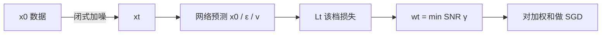

# Min-SNR：把各噪声档当成互相打架的任务，用截断 SNR 给损失加权

<!-- release-date: 2023-03-16 -->

**本文依据**：`Efficient Diffusion Training via Min-SNR Weighting Strategy`，arXiv 2303.09556v3（2024-03-11），18 页 letter。作者 Tiankai Hang、Xin Geng、Baining Guo*（Southeast University）；Shuyang Gu*、Jianmin Bao、Dong Chen、Han Hu（Microsoft Research Asia）；Chen Li（National Key Laboratory of Human-Machine Hybrid Augmented Intelligence、National Engineering Research Center for Visual Information and Applications、Institute of Artificial Intelligence and Robotics，Xi’an Jiaotong University）。通讯作者标 *（PDF p. 1）。页眉 arXiv:2303.09556v3 [cs.CV] 11 Mar 2024。摘要给出实现仓库 `https://github.com/TiankaiHang/Min-SNR-Diffusion-Training`（PDF p. 1）。官方 arXiv：`https://arxiv.org/abs/2303.09556`。首发日取原件首次公开日，即 arXiv v1 提交日 2023-03-16，不回写成 v3 日期。本 PDF 第 1 页未印会议名。文中所有数字都标了 PDF 页码；标「外部补充」的段落不来自本文。本文只读这一份 PDF，不把 P2-Weighting 写成这篇的方法，也不重写 DDPM / ADM / LDM 本身。

## 一句话

扩散模型各噪声档共用一套网络权重。作者发现：专门微调某一档噪声，往往会伤到离它较远的档；优化方向互相打架，是训练收敛慢的一部分原因。他们把每个时间步当成一项任务，把整段训练看成多任务学习，再给出一种预先写死的全局权：Min-SNR-γ，即 $w_t=\min\{\mathrm{SNR}(t),\gamma\}$。相对当时常用的常数权、SNR 权、带下界的 Max-SNR，这套权更接近逐步求解 Pareto 方向，却不必每步做二次规划。ImageNet 256×256 上，同一套 ViT-B 预测 $x_0$ 时，达到 FID 10 比对照快 3.4 倍；ViT-XL 加无分类器引导到 FID 2.06（PDF p. 1、p. 6、p. 8–9）。

它解决的不是「再发明一种扩散架构」，而是训练目标怎么给各时间步加权：共享权重已经定了，能不能用更稳、更便宜的权，让各档少互相拆台。

## 一、矛盾：共享权重能画图，各档梯度却在互相拆台

2022 年前后，去噪扩散已经是图像生成的主流路线，并扩到文生图、图像编辑、视频、文本、三维头像（PDF p. 1）。相对当时的 GAN，作者写的是保真度和多样性上的优势（PDF p. 2）。卡点不在「能不能出图」，而在**收敛慢**：要大量 GPU 小时才能训起来，实验周转贵（PDF p. 1）。

他们先做了一个很短的诊断。把去噪过程按时间步切成若干箱子，在某一箱子里微调已经训过的扩散模型，再看其他箱子的损失怎么变。图 2：微调 $[100,200)$、$[200,300)$、$[300,400)$ 时，邻近箱子的 MSE 往往下降，离得远的箱子则变差（PDF p. 3）。人话：专门把某一噪声水平学好，会伤害别的噪声水平。当前主流做法又是各噪声档**共用**一套权重（DDPM、ADM、LDM 一类），冲突的梯度会拖慢整体收敛（PDF p. 1）。

因果链因此很短：先承认冲突存在，再把各时间步当成多任务，最后用一种不依赖当步噪声梯度的全局权去平衡，而不是每步现场算 Pareto。

图 1 是 ImageNet 上 FID 对训练迭代：对照曲线下降慢，Min-SNR 标了 3.4× 加速，并落到更低的 FID（PDF p. 1）。实现仓库写在摘要末尾（PDF p. 1）。

把训练目标画成一条能跟住的流水线（机制示意，根据 PDF p. 3–5 式 1–4 与 3.4 节重画，不是实测时间轴）：

权只改训练。前向过程、网络、采样器都可以原样继承。换预测目标时，要把 SNR 因子除掉，使「名义上的 Min-SNR」在不同参数化下对应同一套相对难度（PDF p. 6–7）。

## 二、背景：前向加噪、三种预测目标、以及 SNR

### 前向与反向

记训练数据分布为 $p(x_0)$。前向是高斯转移：逐步把不同尺度的噪声加到 $x_0$ 上，得到 $x_1,\ldots,x_T$（PDF p. 3 式 1–2）：

$$
q(x_t\mid x_0)=\mathcal{N}(x_t;\alpha_t x_0,\sigma_t^2 I),\qquad x_t=\alpha_t x_0+\sigma_t\epsilon
$$

$\epsilon\sim\mathcal{N}(0,I)$。噪声日程 $\sigma_t$ 随 $t$ 单调增大。本文用方差保持过程，$\alpha_t=\sqrt{1-\sigma_t^2}$（PDF p. 3）。

反向是另一条可学习的高斯链，从纯噪声还原 $x_0$（PDF p. 3 式 3）。Ho 等人把方差固定成 $\sigma_t^2 I$，均值写成 $x_t$ 与噪声预测网络的线性组合，并发现预测噪声配合简化加权损失好用（PDF p. 3 式 4）：

$$
L_t^{\mathrm{simple}}(\theta)=\mathbb{E}_{x_0,\epsilon}\bigl\|\epsilon-\hat\epsilon_\theta(\alpha_t x_0+\sigma_t\epsilon)\bigr\|_2^2
$$

后续工作改成预测无噪声状态 $x_0$（PDF p. 3 式 5），或直接预测速度 $v$（PDF p. 3）。作者强调：预测目标不同，但改损失权重之后，数学上可以互相换写（PDF p. 3）。附录 B 把换写钉死：$\epsilon$ 空间损失等于 $x_0$ 空间损失乘 $\mathrm{SNR}(t)=\alpha_t^2/\sigma_t^2$；$v=\alpha_t\epsilon-\sigma_t x_0$ 时，相对 $x_0$ 还要再乘 $\mathrm{SNR}(t)+1$（PDF p. 12–13）。

### 共享权重的副作用

为了少参数，先前工作让所有步共用一套去噪网络（PDF p. 3）。各步的去噪难度差很远：$t\to 0$ 接近「把输入抄回去」就能把损失压低；$t\to T$ 则几乎是从噪声里还原结构。共用权重时，简单档的最优方向不必对难档也最优。图 2 把这件事做成实验，而不是口号（PDF p. 3）。

## 三、多任务视角：想找一个不伤任何一档的更新方向

把 $T$ 个时间步看成 $T$ 个任务，参数 $\theta$，第 $t$ 档损失 $L^t(\theta)$。理想更新方向 $\delta\neq 0$ 应满足所有档的损失都不升（PDF p. 4 式 6）。一阶展开后，这等价于 $\delta$ 与每一档梯度的内积都不为正（PDF p. 4 式 7–8）。

定理 1：若存在满足式 8 的方向，则取

$$
\delta^*=-\sum_{t=1}^{T} w_t\nabla_\theta L^t(\theta)
$$

其中 $w$ 是「加权梯度范数最小、且权非负、权和为 1」这个二次规划的解，这个 $\delta^*$ 就满足式 8；若不存在非零解，则已经到 Pareto 驻点，训练在这个意义上收敛（PDF p. 4）。更一般的形式来自 MGDA 一类多目标工作；证明放在附录 A（PDF p. 4、p. 12）。

生成时必须走完所有时间步，任何一档都不能在训练里被扔掉。因此他们给权加正则，避免 $w_t$ 过小（PDF p. 4 式 11）。求解可用 Frank–Wolfe，或把 $w_t$ 写成 softmax 再无约束梯度下降（UGD）（PDF p. 4 式 12–13）。

这两条优化路线有两个硬伤（PDF p. 4）：

1. **贵。** 每个训练迭代都要再做一轮权优化，墙钟时间明显变长。
2. **不稳。** 每档每步只有有限样本，梯度噪声大。图 3：样本少时权乱跳；样本多了权才稳，但算力跟着涨（PDF p. 4）。

引言里还补了第三条：扩散的任务数可以到上千。通用多任务方法常假设任务很少。Pareto 解在扩散上容易把大多数时间步的权打成 0，那些步完全不学，整条去噪链就断了（PDF p. 2）。所以他们不要「每步现场调权」，而要一套 **预先写死的全局、按步的权** （PDF p. 2）。

全局策略是次优的，但作者给了两个为什么还能用的理由：各去噪任务的优化动态主要由该档噪声水平决定，不必过度跟单张样本走；训过中等步数之后，后续梯度更稳，可以用定常权去近似（PDF p. 2）。

## 四、Min-SNR-γ：用截断 SNR 当难度，而不是当场算梯度

为讨论方便，3.4 节先假设网络预测 $x_0$；其他预测目标在 4.2 节换写（PDF p. 4）。对照的几种权是（PDF p. 4–5）：

| 名称 | 公式（预测 $x_0$ 时） | 论文怎么评 |
|---|---|---|
| 常数 | $w_t=1$ | 各任务同等重要；离散与连续扩散都有人用 |
| SNR | $w_t=\mathrm{SNR}(t)=\alpha_t^2/\sigma_t^2$ | 当时最常用；预测噪声时，数值上等价于常数权 |
| Max-SNR-γ | $w_t=\max\{\mathrm{SNR}(t),\gamma\}$ | Salimans 与 Ho 为避免 SNR 为 0 的步权变成 0 而提出，默认 $\gamma=1$；权仍集中在小噪声档 |
| Min-SNR-γ | $w_t=\min\{\mathrm{SNR}(t),\gamma\}$ | 本文：避免模型过度盯小噪声档 |
| UGD | 每步用式 13 优化 $w_t$ | 训练过程中会变 |

信噪比（signal-to-noise ratio，SNR）在这里就是 $\alpha_t^2/\sigma_t^2$：信号尺度平方除以噪声方差。$t$ 小、图还干净时 SNR 大；$t$ 大、图很噪时 SNR 小。Min-SNR 的人话是：**干净档（SNR 很大）不要再按 SNR 无限加码，权封顶在 $\gamma$；很噪的档仍按 SNR 给较小的权。** 这和「SNR 权把几乎全部注意力堆在最干净的几档」对着干（PDF p. 5–6）。

图 4 把上述权代入式 11 的目标值：UGD 最低，Min-SNR-γ 最接近它，明显好过常数和 SNR（PDF p. 5）。作者据此说：这套预先写死的权，已经相当接近「同时改善各档」的 Pareto 方向，却没有稀疏、不稳、每步二次规划那三笔账（PDF p. 2、p. 5）。

默认截断 $\gamma=5$（PDF p. 6）。接到现有训练循环上，就是给该档 MSE 乘上 $w_t$，不必改网络。

## 五、实验设定：像素空间与潜空间、ViT 与 UNet

数据（PDF p. 5）：无条件用 CelebA，162,770 张人脸，按 ScoreSDE 中心裁到 140×140 再缩到 64×64。有条件用 ImageNet，约 130 万张、1000 类，测 64×64 与 256×256。

训练（PDF p. 5）：低分辨率跟 ADM，直接在像素上训。高分辨率跟 LDM：先把图压进潜空间再扩散。潜编码器用 Stable Diffusion 的 VQ-VAE（脚注 Hugging Face `stabilityai/sd-vae-ft-mse-original`），$256\times 256\times 3$ 编成 $32\times 32\times 4$（PDF p. 5）。骨干同时试 vanilla ViT（不加改）和 UNet。时间步 $t$ 与类别 $c$ 作为可学习 token 喂给 ViT。UNet 跟 ADM，FLOPs 与 ViT-B 接近，参数约 1.5 倍（PDF p. 5）。作者写明：再定制结构还能涨点，但本文要看的是扩散的一般性质，不是刷架构。

扩散一律余弦噪声日程，$T=1000$。优化器 AdamW。CelebA：500K 迭代、batch 128，前 5,000 步线性升温，其余学习率 $1\times 10^{-4}$。ImageNet：默认学习率 $1\times 10^{-4}$；64² batch 1024，256² batch 256（PDF p. 5）。

评测：EMA 0.9999；采样用 EDM 的 Heun；有条件时加无分类器引导（classifier-free guidance）；FID 在 50K 张生成图上算（PDF p. 5）。附录 C：ViT 的 AdamW $(\beta_1,\beta_2)=(0.99,0.99)$，UNet 为 $(0.9,0.999)$。消融里 ViT-B / UNet 采样 30 步；表 4 的 ImageNet 64 用 20 步；表 5 的 ImageNet 256 用 50 步（PDF p. 13）。

附录表 6 的 ViT 规格（PDF p. 13）：

| 模型 | 层数 | 隐层 | 头数 | 参数 |
|---|---:|---:|---:|---:|
| ViT-Small | 13 | 512 | 6 | 43M |
| ViT-Base | 12 | 768 | 12 | 88M |
| ViT-Large | 21 | 1024 | 16 | 269M |
| ViT-XL | 28 | 1152 | 16 | 451M |

CelebA 用 ViT-Small；消融默认 ViT-Base；ImageNet 64 用 21 层 ViT-Large 以便和 U-ViT 比；ImageNet 256 用与 DiT 同深度、隐层、patch 的 ViT-XL（PDF p. 13）。消融用的 UNet：基通道 192，通道倍率 1, 2, 2, 2，每分辨率 3 个残差块，注意力在 8 与 16，4 头（PDF p. 13）。高分辨率 UNet 用 LDM 的 395M、在 $32\times 32\times 4$ 上操作（PDF p. 13）。

## 六、消融：权、预测目标、架构、γ

### 预测 $x_0$ 时四种权（图 5 左）

默认骨干 ViT-B，数据 ImageNet 256×256。四种设定：常数、$w_t=\mathrm{SNR}(t)$、$\max\{\mathrm{SNR}(t),1\}$、$\min\{\mathrm{SNR}(t),5\}$（PDF p. 6）。训练越久 FID 都降，但 Min-SNR 明显更快：达到 FID 10 是 3.4 倍加速（PDF p. 6）。SNR 权最差，作者归因于过度盯噪声很小的阶段（PDF p. 6）。

图 6 把权拿掉，只报 $\|x_0-\hat x_\theta\|_2^2$，按箱子 $[0,100)$、$[200,300)$、$[600,700)$、$[800,900)$ 平均。常数权在高噪声箱子好、低噪声箱子差；SNR 权反过来。Min-SNR 在四个箱子上都更低，和 FID 曲线一致（PDF p. 6）。

图 7：同一随机种子，从 50K、200K、400K、1M 迭代采样。Min-SNR-5 在 200K 就已经能看出清楚物体，同迭代的其他权更糊（PDF p. 7）。

### 换成预测 $\epsilon$ 或 $v$

预测噪声在数学上等于预测 $x_0$ 再乘 SNR，所以实现上要把 SNR 除掉。预测噪声时的 Min-SNR 写成 $w_t=\min\{\mathrm{SNR}(t),\gamma\}/\mathrm{SNR}(t)=\min\{\gamma/\mathrm{SNR}(t),1\}$；此时「SNR 权」退化成常数权。预测 $v$ 时还要再除 $\mathrm{SNR}+1$。文中仍沿用原来的名字，以免四套公式对不上（PDF p. 6–7）。

图 5 中、右：把网络输出当噪声时，常数权或 Max-SNR 会发散；Min-SNR 在 $\epsilon$ 与 $v$ 上都比其余权更快收敛。作者的判断：平衡各档是内在问题，不绑死某一种参数化（PDF p. 6–7）。

### UNet（表 1）

参数量靠近 ViT-B，训 1M 迭代，中途报 FID（PDF p. 7）：

| 设定 | 200K | 400K | 600K | 800K | 1M |
|---|---:|---:|---:|---:|---:|
| Baseline（$x_0$） | 25.93 | 15.41 | 11.54 | 9.52 | 8.33 |
| + Min-SNR-5 | 7.99 | 5.34 | 4.69 | 4.41 | 4.28 |
| Baseline（$\epsilon$） | 8.55 | 5.43 | 4.64 | 4.35 | 4.21 |
| + Min-SNR-5 | 7.32 | 4.98 | 4.48 | 4.24 | 4.14 |

无论预测 $x_0$ 还是 $\epsilon$，Min-SNR-5 都更快、终值更好（PDF p. 7）。

### γ 鲁棒性（表 2）

ImageNet-256、ViT-B、预测 $x_0$，再扫预测 $\epsilon$ 与 UNet。$\gamma\in\{1,5,10,20\}$（PDF p. 7–8）：

| 骨干 | γ=1 | γ=5 | γ=10 | γ=20 |
|---|---:|---:|---:|---:|
| ViT（$x_0$） | 4.98 | 4.92 | 5.34 | 5.45 |
| ViT（$\epsilon$） | 4.89 | 4.84 | 4.94 | 5.41 |
| UNet（$x_0$） | 4.49 | 4.28 | 4.32 | 4.37 |
| UNet（$\epsilon$） | 4.30 | 4.14 | 4.14 | 4.12 |

$\gamma<20$ 时 FID 只有小幅波动；$\gamma=5$ 通常已经够好，因此定为默认（PDF p. 8）。

## 七、和当时方法比：CelebA-64、ImageNet-64、ImageNet-256

### CelebA 64×64（表 3）

无条件，UNet 与 ViT 都训 500K 迭代，EDM 采样器出 50K 张算 FID（PDF p. 8）。ViT-Small 43M 到 FID 2.14，超过所列先前 ViT（U-ViT-Small 44M 为 2.87）。UNet 59M 到 1.60，超过所列先前 UNet（DDIM 79M 为 3.26，Soft Truncation 62M 为 1.90）（PDF p. 8）。作者强调 naive 结构没改，还有上涨空间。

### ImageNet 64×64（表 4）

类别以 0.15 概率丢掉，便于无分类器引导。训 800K 迭代；推理 cfg=1.5，EDM 采样器（PDF p. 8）。21 层 ViT-Large 269M，参数量靠近 U-ViT-Large 287M，FID 2.28，对照 U-ViT-Large 的 4.26、ADM 296M 的 2.61、IDDPM large 270M 的 2.92（PDF p. 8）。表里 StyleGAN-XL 的 1.51、CDM 的 1.48 仍更低；作者写的是相对先前扩散 / ViT 路线的提升，不是「超过表中每一行」。

附录另用与 ADM 相同的 296M UNet，ImageNet 64、900K 迭代、batch 1024，FID 2.11（PDF p. 13）。图 12 注记 ImageNet 64 的 UNet 样例 FID 为 2.14（PDF p. 17）；与 2.11 不是同一行设定，正文没有把两者强行对齐。

### ImageNet 256×256（表 5）

先压到 $32\times 32\times 4$，EDM 加无分类器引导（PDF p. 8）。表 5 摘录（PDF p. 8）：

| 方法 | 参数 | FID |
|---|---:|---:|
| BigGAN-deep | 340M | 6.95 |
| StyleGAN-XL | — | 2.30 |
| Improved VQ-Diffusion | 460M | 4.83 |
| ADM-G | 554M | 4.59 |
| ADM-U + ADM-G | 608M | 3.94 |
| LDM | 400M | 3.60 |
| UNet（本文） | 395M | 2.81† |
| U-ViT-L | 287M | 3.40 |
| DiT-XL-2（cfg=1.50） | 675M | 2.27 |
| ViT-XL（本文，cfg=1.50） | 451M | 2.06 |

† 只训 1.4M 迭代（PDF p. 8）。表注写：ViT-XL 达到新的 FID 记录 2.06（PDF p. 8）。正文把路径拆成两段：预测 $\epsilon$ 加 Min-SNR-5 时，2.1M 迭代 FID 2.08，比 DiT 快 3.3 倍，并超过先前记录 2.27；再按 DiT 那篇大约 7M 迭代继续训，改成预测 $x_0$ 加 Min-SNR-5，得到 2.06（PDF p. 8–9）。395M UNet 约 1.4M 迭代到 2.81（PDF p. 9）。摘要与结论重复的是 2.06 这一终报，并强调架构比先前 SOTA 更小（PDF p. 1、p. 9）。

## 八、附录还做了什么

附录 A 证明定理 1：从「存在对所有任务内积非负的方向 $u$」推到加权梯度范数最小，中间用正则化的 minimax 和 von Neumann 定理（PDF p. 12）。附录 B 给出 $\epsilon$、$x_0$、$v$ 三套损失的 SNR 换写（PDF p. 12–13）。

附录 D.1：消融改到 ImageNet 64 像素空间，ViT-B、800K、batch 512，预测 $x_0$ 与 $\epsilon$，Min-SNR $\gamma=5$，用 ADM 预训练的 64×64 噪声分类器做条件引导。图 8：两种预测目标上，Min-SNR 都比常数权收敛更快；这里采样改成 DPM-Solver，50K 张算 FID（PDF p. 13–14）。

附录 D.1.1：把 Min-SNR 接到 EDM 的 denoiser 框架，实现是在官方 `EDMLoss` 上乘 $\min\{\mathrm{SNR},5\}/\mathrm{SNR}$（仓库脚注 `https://github.com/NVlabs/edm.git`）（PDF p. 13–14）。超参跟官方 ImageNet-64，含 batch 与优化器。算力不够，没有训到 EDM 原文大约 2k epoch。采样 2nd Heun、18 步（NFE=35）。图 9：FID 对「见过的训练图像数（百万）」下降更快（PDF p. 14）。

图 10–13 是 CelebA UNet FID 1.60、ImageNet 64 ViT 2.28、ImageNet 64 UNet 2.14、ImageNet 256 ViT 2.06 的额外样例。前两张 64 分辨率图注写明随机合成、未精选（PDF p. 14–18）。

## 九、相关工作里他们怎么给自己定位

相关工作三块（PDF p. 2–3）：扩散模型本身（UNet 为主，U-ViT / DiT 把 Transformer 引进来）；改进质量、加速采样、蒸馏、噪声日程、预测目标、以及按噪声水平分专家（MoE，参数更多、训更久）；多任务学习里的负迁移、梯度冲突、GradNorm、MTO / Pareto。本文既不走「每步现场调权」，也不走「给不同噪声水平各配一个专家」。

## 十、限制与本文没写的东西

没有单独的 Limitations 节。能从正文读出的边界：

1. **全局权是次优。** 图 4 上 UGD 的目标值仍低于 Min-SNR；他们用稳定和便宜换最优（PDF p. 2、p. 5）。
2. **γ 仍是超参。** 表 2 显示不太敏感，但没有理论给出 5 这个数（PDF p. 8）。
3. **ImageNet 256 的 2.06 依赖潜空间、无分类器引导、长训练。** 2.08 是 2.1M 迭代预测 $\epsilon$；2.06 是约 7M 迭代预测 $x_0$。表 5 的 UNet 行只训 1.4M（PDF p. 8–9）。
4. **评测几乎只有 FID。** 没有 Inception Score、召回、人评。采样器主要是 EDM Heun，消融里才出现 DPM-Solver。
5. **没有系统测视频、文本、三维。** 那些只出现在引言的应用名单里（PDF p. 1）。
6. **没有公开墙钟、GPU 型号、端到端训练小时。** 「3.4×」是达到同一 FID 的迭代倍数，不是硬件吞吐（PDF p. 1、p. 6）。
7. **定理 1 的证明依赖一阶展开与任务同等重要的假设**；附录把细节写全，但实验并没有验证一阶近似在上千档上有多紧（PDF p. 12）。

资助：国家重点研发计划 2018AAA0100104，国家自然科学基金 62125602、62076063。致谢 Yixuan Wei、Zheng Zhang、Stephen Lin（PDF p. 9）。

## 十一、可迁移启发

1. **共享骨干的多噪声档训练，先查梯度是否互伤。** 图 2 的「按箱子微调再看别的箱子」比直接调 $\lambda_t$ 更能解释收敛慢。
2. **任务数上到几百、上千时，现场 Pareto 容易稀疏。** 权打成 0 等于那一档停学；生成链又必须经过那一档。预先写死、保证每档都有非零权，往往比「理论上最优的当步权」更安全。
3. **难度用 SNR 这种与样本无关的标量，比用当步梯度范数稳。** 图 3 是反面教材：样本少，权就跳。
4. **换预测目标时，先把 SNR 因子剥掉，再谈「同一套 Min-SNR」。** 否则预测 $\epsilon$ 时的「SNR 权」其实已经是常数权，消融会对不上。
5. **干净档封顶、噪档仍按 SNR 降权。** Max-SNR 把下界抬起来，注意力仍在小噪声；Min-SNR 做的是上截断。若训练后期细节很好、结构出不来，优先怀疑干净档权过大。
6. **只改权、不改架构，也能在 ViT 与 UNet、像素与潜空间、EDM 损失上复现加速。** 代价是 γ 仍要扫一圈；表 2 说明 5 附近够用，不必当成另一套网格搜索。

## 关键词回看

- **时间步冲突**：专训某一噪声档会伤远离它的档；共用权重时表现为收敛慢。
- **多任务 / Pareto 驻点**：希望有一个更新让所有档损失都不升；若不存在非零方向，则已到驻点。
- **SNR**：$\alpha_t^2/\sigma_t^2$，衡量该档还剩多少信号。
- **Min-SNR-γ**：$w_t=\min\{\mathrm{SNR}(t),\gamma\}$；预测 $\epsilon$ 时再除以 $\mathrm{SNR}(t)$。
- **Max-SNR-γ**：$w_t=\max\{\mathrm{SNR}(t),\gamma\}$，先前为避免零 SNR 把权打成 0。

## 参考资料

- 原件 PDF：`readings/_src/图像、视频与 3D 生成/Min-SNR.pdf`
- 官方 arXiv：https://arxiv.org/abs/2303.09556
- 作者代码（PDF p. 1）：https://github.com/TiankaiHang/Min-SNR-Diffusion-Training
