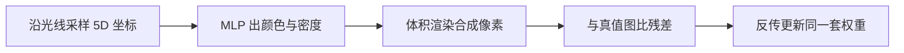

# NeRF：把场景写成连续 5D 辐射场，用可微体积渲染从稀疏视角合成新视图

<!-- release-date: 2020-03-19 -->

**本文依据**：`NeRF: Representing Scenes as Neural Radiance Fields for View Synthesis`，arXiv 2003.08934v2（2020-08-03），25 页，版心小于 letter（`pdfinfo` 为 413.858 × 615.118 pts）。作者 Ben Mildenhall^{1}?、Pratul P. Srinivasan^{1}?、Matthew Tancik^{1}?（三人同等贡献）、Jonathan T. Barron^{2}、Ravi Ramamoorthi^{3}、Ren Ng^{1}。^{1} UC Berkeley，^{2} Google Research，^{3} UC San Diego。盘上 PDF 页眉写明 arXiv:2003.08934v2 [cs.CV] 3 Aug 2020。第 1 页摘要与引言未印会议名；参考文献里出现的 ECCV 只属于被引论文（PDF p. 16–17），不是本文录用信息，本文不补。首发日取原件首次公开日，即 arXiv v1 提交日 2020-03-19，不回写成 v2 日期。文中所有数字都标了 PDF 页码；标「外部补充」的段落不来自本文。

## 一句话

把静态场景写成一个连续的五维函数：三维位置加二维视线方向，输出该点的体积密度和随方向变的发射颜色。用一个没有卷积层的全连接网络（MLP）去拟合这个函数；沿相机光线查询网络，再用经典体积渲染把颜色与密度积成像素。体积渲染对网络权重可微，所以只要一组已知位姿的 RGB 图，就能用梯度下降把场景「烤」进网络权重。朴素实现既拟合不出高频几何与纹理，每条光线又要采太多点；位置编码把坐标抬到高频特征空间，分层采样把查询预算砸到真正挡住视线的地方。作者据此宣称：这是第一份能从自然拍摄的 RGB 图，渲染出真实物体与场景的高分辨率、照片级新视图的连续神经场景表示（PDF p. 1、p. 3）。

它解决的不是「再发明一种网格或体素」，而是 2020 年前后神经场景表示与基于图像的渲染共同卡死的那条路：连续隐式形状画不细，离散体素又存不起、采不够。后作里的哈希网格、3D 高斯溅射不在本文范围内。

## 一、矛盾：连续表示画不细，体素又存不起

视图合成是老问题：给一组已拍视图，造出没拍过的相机位姿上的图。光线足够密时，光场插值就能出照片级结果（PDF p. 4）。视角一稀，就必须先猜几何和外观。

当时两条主流路都有硬伤。

**网格这条**。 网格可以带漫反射或随视角变的外观，可微光栅化或路径追踪也能用重投影误差去优化网格（PDF p. 4）。但基于图像重投影的网格优化常常卡在局部极小或病态损失面；更要命的是，优化前通常要一张拓扑固定的模板网格当初始化，无约束真实场景根本没有这张模板（PDF p. 4）。

**体素这条**。 体积表示能画复杂形状和材质，也适合用投影图做梯度优化，视觉伪影通常比网格少（PDF p. 4）。早期做法直接给体素上色；后来一批工作用多场景大数据训深度网络，从输入图预测一份采样体积，再沿光线做 alpha 合成或学出来的合成（PDF p. 4）。还有工作把 CNN 和采样体素网格按场景一起优化，让 CNN 去补低分辨率体素的离散化伪影，或让体素随时间、动画控制变（PDF p. 4）。上限写得很清楚：分辨率一升，三维采样就更密，时间和空间复杂度一起炸。更高分辨率的图，要求对三维空间更细的采样（PDF p. 4）。

**隐式 MLP 这条刚刚兴起，但还画不出现实场景**。 把三维坐标映成符号距离或占据场，可以表示连续形状，可它们通常要真值三维几何，数据多来自 ShapeNet 这类合成库（PDF p. 3）。后续用可微渲染放松了三维监督：Niemeyer 等人把表面写成占据场，沿光线数值求交，再用隐式微分拿精确导数，交点送进神经纹理场出漫反射颜色（PDF p. 3）。Sitzmann 等人的场景表示网络（SRN）在每个连续三维坐标输出特征向量和 RGB，再用循环网络沿光线走、决定表面在哪（PDF p. 3）。作者的判断同样干脆：这些技术理论上能表示复杂高分辨率几何，迄今却只做出几何简单、渲染过平滑的形状（PDF p. 3）。

NeRF 的赌注是换表示，而不是再叠一层卷积去预测体素。把场景编码成 **5D 辐射场**（三维体积加上二维随视角变的外观），用 MLP 的权重去存一份连续体积。收益按作者的话说有两层：渲染质量明显高于先前体积方法，存储只是那些采样体积表示的一小部分（PDF p. 4）。图 1 用合成 Drums 场景的 100 张半球随机输入视图，展示优化后的两张新视图（PDF p. 2）。

把流水线画成人能跟住的样子（机制示意，根据 PDF p. 5 图 2 重画，不是实测时间轴）：

训练时并不先重建网格。每条光线采一串点，网络给出 $(c,\sigma)$，积分出像素，和观测像素比平方误差。多视图一起压，网络才愿意把高密度和准颜色放到真正有内容的地方（PDF p. 2）。

## 二、表示：密度只看位置，颜色才看方向

连续场景写成一个五维向量值函数：输入三维位置 $x=(x,y,z)$ 和二维视线方向 $(\theta,\phi)$，输出发射颜色 $c=(r,g,b)$ 和体积密度 $\sigma$（PDF p. 4）。实现里方向改写成三维笛卡尔单位向量 $d$。MLP 记成 $F_\Theta:(x,d)\to(c,\sigma)$，优化权重 $\Theta$（PDF p. 5）。

多视图一致性靠一条硬约束：**密度 $\sigma$ 只是位置 $x$ 的函数，颜色 $c$ 才同时看位置和方向**。 否则同一点从不同相机看，密度可以对不上，几何会飘。做法是：先把 $x$ 送进 8 层全连接（ReLU，每层 256 通道），输出 $\sigma$ 和 256 维特征向量；特征再与视线方向拼接，过一层 128 通道的 ReLU 全连接，得到随视角变的 RGB（PDF p. 5）。附录图 7 把跳连也画出来：位置编码 $\gamma(x)$ 进那 8 层，并按 DeepSDF 的写法把输入拼到第 5 层激活上；$\sigma$ 再过 ReLU 保证非负；特征与 $\gamma(d)$ 拼接后，最后一层 sigmoid 出 RGB（PDF p. 18）。

图 3 用 Ship 场景两个固定三维点（船侧、水面）展示：换相机，高光跟着变，并且在整个视线半球上连续过渡（PDF p. 6）。图 4 把视角依赖拿掉，推土机履带上的镜面反射就复不出来（PDF p. 7）。

人话：$\sigma$ 回答「这里有没有东西挡住光线」，$c$ 回答「从这个角度看，这一点发什么颜色」。朗伯表面几乎不需要后一项；金属、水面、烤漆需要。把方向过早送进密度头，等于允许「换个角度看，固体消失」——多视图损失会打它，但优化更难。作者选择从结构上禁止这件事。

**可迁移的一点**：多视图几何该不该随观测变，和外观该不该随观测变，是两件不同的事。表示上把二者拆开，比事后用损失去「希望」一致更硬。

## 三、渲染：把辐射场积成像素，积分本身可微

体积密度 $\sigma(x)$ 读成：光线在 $x$ 处碰到无穷小粒子并终止的微分概率（PDF p. 5）。相机光线 $r(t)=o+td$，近远界 $t_n$、$t_f$，期望颜色是（PDF p. 5 式 1）

$$
C(r)=\int_{t_n}^{t_f} T(t)\,\sigma(r(t))\,c(r(t),d)\,dt,\qquad
T(t)=\exp\Bigl(-\int_{t_n}^{t}\sigma(r(s))\,ds\Bigr).
$$

$T(t)$ 是从近平面走到 $t$ 还没撞上任何粒子的累积透过率。新视图就是：对虚拟相机每个像素追一条光线，估这个积分。

离散体素常用确定性求积。若 MLP 只在固定格子上被问到，表示的分辨率就被格子钉死（PDF p. 6）。作者改用分层采样：把 $[t_n,t_f]$ 切成 $N$ 个等宽箱子，每个箱子里均匀随机抽一个点（PDF p. 6 式 2）

$$
t_i\sim \mathcal{U}\Bigl[t_n+\frac{i-1}{N}(t_f-t_n),\; t_n+\frac{i}{N}(t_f-t_n)\Bigr].
$$

优化过程中查询位置在连续区间里抖动，所以表示仍是连续的。求积用 Max 综述里的规则（PDF p. 6 式 3）

$$
\hat C(r)=\sum_{i=1}^{N} T_i\bigl(1-\exp(-\sigma_i\delta_i)\bigr)c_i,\qquad
T_i=\exp\Bigl(-\sum_{j=1}^{i-1}\sigma_j\delta_j\Bigr),
$$

$\delta_i=t_{i+1}-t_i$。这就是带 $\alpha_i=1-\exp(-\sigma_i\delta_i)$ 的传统 alpha 合成，对 $(c_i,\sigma_i)$ 平凡可微（PDF p. 6）。

机制上要钉死一件事：监督信号不是三维点的颜色标签，而是整条光线积完之后的二维像素。梯度穿过求和与指数，回到每个样本的 $\sigma$ 和 $c$，再回到 MLP 权重。空处的 $\sigma$ 会被压低（否则透过率提前掉光），挡住视线的薄层会被抬高。多张图从不同方向穿过同一空间，三维密度才有机会对齐。

式 3 值得用人话拆一次。$T_i$ 是走到第 $i$ 个样本之前还没被挡住的概率；$1-\exp(-\sigma_i\delta_i)$ 是在这一小段 $\delta_i$ 里被挡住的概率；两者相乘再乘 $c_i$，就是「光线在这一段贡献给像素的颜色」。后面的段即使 $\sigma$ 很大，只要前面 $T$ 已经掉到接近 0，也加不进像素——这就是遮挡。梯度因此有方向：观测像素偏暗，可能是前面 $\sigma$ 太大（过早挡住）或颜色偏了；观测像素能看见后面的东西，前面就必须更透明。多视图从不同方向穿过，同一点的 $\sigma$ 被反复约束，颜色则被允许随 $d$ 变。这和 SRN「每条光线一个表面点、一个颜色」的差别就在这里：半透明、薄结构和「看起来像表面的密度峰」都可以存在，不必先声明拓扑。

**代价立刻出现**：分辨率不再由体素格子决定，而由「沿光线采多密、MLP 拟合多高频」决定。采太稀，薄结构被跳过；处处采密，自由空间和被挡住的区域浪费查询。这就是下一节两记补丁要接的矛盾。

## 四、位置编码：先把坐标抬到网络肯拟合的频率

第 4 节那套组件还不够达到第 6.4 节消融里的质量（PDF p. 7）。作者观察到：MLP 直接吃 $xyz\theta\phi$，高频颜色和几何拟合很差。这和 Rahaman 等人的结论一致——深度网络偏向学低频函数；先用高频函数把输入映到更高维，再送进网络，更能拟合含高频变化的数据（PDF p. 7）。

于是把 $F_\Theta$ 写成 $F_{\Theta'}\circ\gamma$：$\gamma$ 不可学，$F_{\Theta'}$ 仍是普通 MLP（PDF p. 7）。编码是（PDF p. 7 式 4）

$$
\gamma(p)=\bigl(\sin(2^{0}\pi p),\;\cos(2^{0}\pi p),\;\ldots,\;\sin(2^{L-1}\pi p),\;\cos(2^{L-1}\pi p)\bigr).
$$

它对 $x$ 的三个坐标分别作用（先归一化到 $[-1,1]$），也对 $d$ 的三个分量分别作用（单位向量本身已在 $[-1,1]$）（PDF p. 7–8）。实验取 $L=10$ 给 $\gamma(x)$，$L=4$ 给 $\gamma(d)$（PDF p. 8）。

名字来自 Transformer 的位置编码，目标完全不同：Transformer 是给没有顺序概念的结构提供离散 token 位置；这里是把连续坐标抬维，让 MLP 更容易逼近高频函数（PDF p. 8）。同期从投影重建蛋白质三维结构的工作也用了类似坐标映射（PDF p. 8）。

图 4 去掉位置编码，几何和纹理糊成一团（PDF p. 7）。表 2 第 2 行：完整模型去掉位置编码，Realistic Synthetic 平均 PSNR 从 31.01 掉到 28.77（PDF p. 14）。第 7、8 行改 $L$：$L=5$ 降到 30.59；$L=15$ 是 30.81，并不比 10 更好。作者的解释：一旦 $2^L$ 超过采样输入图里的最高频率（他们的数据大约 1024），再加频率收益有限（PDF p. 14）。

**可迁移的一点**：网络容量不够拟合高频时，先检查输入有没有被谱偏置压扁，再去加层。把坐标写成傅里叶特征，是把「频率预算」从权重里挪到特征里，代价是维度涨、对噪声更敏感——真实场景附录里才对 $\sigma$ 加噪声正则（PDF p. 17）。

## 五、分层采样：粗网络指路，细网络花钱

沿每条光线密查 $N$ 个点仍然浪费：自由空间和被挡住的区域对像素几乎没贡献，却被反复问（PDF p. 8）。作者从早期体积渲染得到启发，同时优化两个网络：粗（coarse）和细（fine）（PDF p. 8）。

先按分层采样抽 $N_c$ 个位置，用粗网络按式 2、式 3 求积。把粗网络的合成颜色改写成沿光线各样本颜色的加权和（PDF p. 8 式 5）

$$
\hat C_c(r)=\sum_{i=1}^{N_c} w_i c_i,\qquad w_i=T_i\bigl(1-\exp(-\sigma_i\delta_i)\bigr).
$$

把权重归一化成 $\hat w_i=w_i/\sum_j w_j$，得到沿光线的分段常数 PDF。再用逆变换采样抽出第二组 $N_f$ 个位置；细网络在 **两组样本的并集** 上求值，用全部 $N_c+N_f$ 个点按式 3 得到最终颜色 $\hat C_f(r)$（PDF p. 8）。

作者特意说：目标和重要性采样相近，但他们把样本当成整段积分域的非均匀离散化，而不是把每个样本当成整个积分的独立概率估计（PDF p. 8）。人话：粗网络先画一张「哪里不透明」的直方图，细网络按这张直方图加密，而不是拿几个点去赌整条光线的期望。

损失对粗、细两路渲染的像素平方误差一起加（PDF p. 9 式 6）

$$
\mathcal{L}=\sum_{r\in\mathcal{R}}\Bigl(\bigl\|\hat C_c(r)-C(r)\bigr\|_2^2+\bigl\|\hat C_f(r)-C(r)\bigr\|_2^2\Bigr).
$$

最终出图用 $\hat C_f$，但粗路也要拟合，否则它给出的权重不能给细网络分配样本（PDF p. 9）。

实验超参：每步随机抽一批光线，batch 4096 条；粗网络 $N_c=64$，细网络再加 $N_f=128$（PDF p. 9）。Adam，学习率从 $5\times 10^{-4}$ 指数衰减到 $5\times 10^{-5}$，$\beta_1=0.9$，$\beta_2=0.999$，$\epsilon=10^{-7}$（PDF p. 9）。单场景大约 100–300k 次迭代，一块 NVIDIA V100 约 1–2 天（PDF p. 9）。每个场景单独优化一份连续体积网络；需要的是该场景的 RGB 图、相机位姿与内参、场景边界。合成数据用真值位姿、内参和边界；真实数据用 COLMAP 估计（PDF p. 8–9）。

附录补了两处实现。合成实验把场景缩进边长为 2、中心在原点的立方体，只在该包围盒内查询（PDF p. 17）。物体在球心里转一圈，远近差有限，度量深度够用。真实前向拍摄则不然：草地可以贴在镜头前，山可以在无穷远，同一条光线的 $t$ 跨度极大。若仍在度量深度上均匀分层，近处箱子太厚、远处箱子浪费在空天上。作者改用归一化设备坐标（NDC）：把深度映到 $[-1,1]$，把所有光线原点移到近平面，透视光线在变换后的体积里变成平行光线，并用视差（逆深度）代替度量深度，坐标才有界（PDF p. 17）。远平面取无穷时，$a_z=1$、$b_z=2n$（PDF p. 21 式 23–24）。附录 C 从标准透视投影矩阵推到 NDC 光线原点与方向（式 25–26）；实现上先把原点移到近平面 $z=-n$，再在 NDC 里把 $t'$ 从 0 线性采到 1，对应原空间从 $n$ 到 $\infty$ 的线性视差采样（PDF p. 19–21）。这不是装饰性坐标变换：分层采样的「等宽箱子」在 NDC 里等的是视差，近处自然更密。

真实数据优化时还对输出的 $\sigma$（进 ReLU 之前）加零均值、单位方差的高斯噪声，作者说略能改善新视图观感。实现框架是 TensorFlow（PDF p. 17）。合成数据没有写这条噪声。可以读成：真实密度场更容易塌成一层纸或到处漏，抖一下 $\sigma$ 等于要网络在扰动下仍能把像素对上。

附录还给出查询量：合成数据每张图 640k 条光线，真实场景每张 762k 条，渲染一张图要 1.5 亿到 2 亿次网络查询；V100 上大约每帧 30 秒（PDF p. 18）。训练贵、出图也贵，这是「连续 MLP + 沿光线查询」的直接账单，本文没有加速结构。

表 2 第 4 行去掉分层、改成沿光线 256 个均匀样本：PSNR 30.06，低于完整模型的 31.01（PDF p. 14）。分层不是画质的最大贡献项（位置编码和视角依赖更大），它买的是在固定查询预算下把样本放到可见内容上。

**可迁移的一点**：积分或注意力预算不够时，用一个便宜的粗估计当 PDF，再在并集上算细估计，比「全程加密」便宜，也比「只信粗估计」稳。代价是要维护两套网络，并且粗路必须进损失，否则 PDF 会漂。

## 六、和先前神经渲染比什么

第 2 节和第 6.2 节要对照着读：前者讲类别，后者讲三个具体基线怎么训、怎么渲染。

三类对照（PDF p. 3–4、p. 10–13）：

1. **神经三维形状 / 隐式表面**。 SDF、占据场、SRN 这类：连续，但要三维真值或只能在简单形状上做可微渲染，结果过平滑。SRN 每条光线只选一个深度和一个颜色，表示能力被「不透明表面」钉死（PDF p. 13）。
2. **按场景优化的离散体积**。 Neural Volumes（NV）用三维卷积预测 $128^3$ 的 RGB$\alpha$ 体素和 $32^3$ 的三维变形网格，光线在变形后的体素里行进；物体必须完整落在有界体积里，背景要单独拍一张没有物体的（PDF p. 10）。$128^3$ 格子限制了高分辨率细节（PDF p. 13）。
3. **跨场景训好、测试时前馈的采样体积**。 Local Light Field Fusion（LLFF）用三维卷积为每个输入视图预测一份视锥采样的 RGB$\alpha$ 网格（多平面图像 MPI），新视图靠附近 MPI 的 alpha 合成与混合（PDF p. 13）。它在大数据上训 **一个** 网络，测试时处理新场景；NeRF、NV、SRN 则是每个场景单独一份网络，输入视图集合相同（PDF p. 10）。LLFF 有一条采样指南：输入视图之间视差不要超过 64 像素；合成数据里视图间视差可以到 400–500 像素，几何经常估错（PDF p. 13）。不同视图还在不同场景表示之间混合，视频里能看出不一致（PDF p. 13）。

作者的自我定位：就他们所知，本文是第一份能从自然场景拍摄的 RGB 图，渲染真实物体与场景之高分辨率照片级新视图的连续神经场景表示（PDF p. 3）。定量上超过「拟合神经三维表示」和「训深度卷积去预测采样体积」两类（PDF p. 3）。

时间和空间的交换写在第 6.3 节。所有按单场景优化的方法，每场景至少训 12 小时；LLFF 处理一小份输入不到 10 分钟（PDF p. 13）。但 LLFF 为每张输入图存一份大三维体素网格，一个「Realistic Synthetic」场景超过 15GB；NeRF 网络权重只要 5 MB，相对 LLFF 约 3000× 压缩，甚至小于任一数据集里单个场景的输入图像本身（PDF p. 13）。

失败模式也可以按表示对上号。SRN 选错深度，整条光线就只有一种颜色，高频纹理没有地方可放，所以图 5、图 6 一律糊。NV 的 $128^3$ 格子对麦克风网罩、Lego 齿轮这种亚体素结构不够用，Ship 索具这种一维结构更是直接消失。LLFF 在前向、视差受控时很强，一到 360° 合成或视差 400–500 像素，MPI 之间对不齐，条带、重影、重复边缘都来自「多份离散体积混合」。NeRF 用同一份连续场回答所有光线，所以跨视图更稳；它付出的是每条新光线都要重新查 MLP，不能把某张输入图对应的 MPI 缓存下来混合。

不要把后来的「实时 NeRF」读进这一段。本文承认：分层采样让训练和测试都更省样本，但如何高效优化和渲染神经辐射场，还有大量工作要做；体素和网格容易推理渲染质量和失败模式，把场景编码进深度网络权重之后，如何分析这些问题并不清楚（PDF p. 14）。

## 七、实验：三套数据，一张主表

### 数据

**Diffuse Synthetic 360°**。 DeepVoxels 的四个朗伯、几何简单的物体，$512\times 512$，上半球采样，479 张输入、1000 张测试（PDF p. 9）。

**Realistic Synthetic 360°**。 作者自己用路径追踪做的八个物体，几何更复杂，材质非朗伯；六个上半球、两个整球；每场景 100 张输入、200 张测试，均为 $800\times 800$（PDF p. 9）。图 1 的 Drums 属于这一套（PDF p. 2）。

**Real Forward-Facing**。 八个真实场景，手持手机大致前向拍摄；五个来自 LLFF 论文，三个作者自采；每场景 20 到 62 张图，留出 1/8 做测试；图像 $1008\times 756$（PDF p. 10）。NV 不能在这套上评：它只重建有界体积内的物体（PDF p. 10）。

### 表 1 主结果（PDF p. 10）

| 方法 | Diffuse PSNR / SSIM / LPIPS | Realistic PSNR / SSIM / LPIPS | Real PSNR / SSIM / LPIPS |
|---|---|---|---|
| SRN | 33.20 / 0.963 / 0.073 | 22.26 / 0.846 / 0.170 | 22.84 / 0.668 / 0.378 |
| NV | 29.62 / 0.929 / 0.099 | 26.05 / 0.893 / 0.160 | — |
| LLFF | 34.38 / 0.985 / 0.048 | 24.88 / 0.911 / 0.114 | 24.13 / 0.798 / 0.212 |
| Ours | 40.15 / 0.991 / 0.023 | 31.01 / 0.947 / 0.081 | 26.50 / 0.811 / 0.250 |

PSNR、SSIM 越高越好，LPIPS 越低越好。真实前向这套上，LLFF 的 LPIPS 略好（0.212 对 0.250）；作者请读者看补充视频，认为自己的多视图一致性更好、伪影更少（PDF p. 10）。附录 D 说逐场景拆开后与汇总表一致，LLFF 仍在部分 LPIPS 上略好（PDF p. 22）。

定性：图 5 合成测试视图，NeRF 能收回 Ship 索具、Lego 齿轮与履带、麦克风支架高光与网罩、Materials 的非朗伯反射；LLFF 有条带和重影，SRN 模糊扭曲，NV 丢细节、索具几何直接失败（PDF p. 11）。图 6 真实场景：Fern 叶子、T-Rex 骨架肋骨和栏杆跨视图更稳；被部分挡住的架子、背景叶子，LLFF 清不干净；Orchid 上沿还能看到 LLFF 混合造成的重复边缘；SRN 只有低频几何和颜色（PDF p. 12）。图 8 是 DeepVoxels 那套：物体简单、479 张输入，NeRF 与 LLFF 都近乎完美，LLFF 插值体积时仍偶发伪影，SRN 与 NV 细不进去（PDF p. 22）。

附录 B：NV、SRN 用作者开源仓库按单场景、无时间依赖来训；LLFF 用作者预训练模型（PDF p. 18）。SRN 官方实现即使用 4 块 V100 并行，也只能到 $512\times 512$；因此 SRN 的定量指标在合成数据上按 $512\times 512$、真实数据按 $504\times 376$ 算，其他方法分别是 $800\times 800$ 与 $1008\times 752$（PDF p. 19）。比的是各方法能跑的分辨率，不是把 SRN 上采样到同一像素数。

### 消融（表 2，Realistic Synthetic 八场景平均，PDF p. 14）

完整模型：输入 $xyz\theta\phi$，100 张图，$L=10$，$(N_c,N_f)=(64,128)$，PSNR 31.01 / SSIM 0.947 / LPIPS 0.081。

- 去掉 PE、视角依赖、分层，只吃 $xyz$、256 个样本：26.67 / 0.906 / 0.136。
- 只去位置编码：28.77。
- 只去视角依赖：27.66。
- 只去分层（256 个样本）：30.06。
- 输入减到 25 张：27.78；50 张：29.79。作者说 25 张仍超过 NV、SRN、LLFF 在 100 张上的全部指标（见补充材料，PDF p. 13）。
- $L=5$：30.59；$L=15$：30.81。

附录表 3–6 是逐场景数。DeepVoxels 四场景 NeRF 的 PSNR 例如 Chair 42.65、Pedestal 41.44、Cube 39.19、Vase 37.32；DeepVoxels 方法的指标直接引自原论文，不报 LPIPS，SSIM 只给两位（PDF p. 23）。Realistic 八场景 NeRF 的 PSNR：Chair 33.00、Drums 25.01、Ficus 30.13、Hotdog 36.18、Lego 32.54、Materials 29.62、Mic 32.91、Ship 28.65（PDF p. 23）。真实八场景 NeRF 的 PSNR：Room 32.70、Fern 25.17、Leaves 20.92、Fortress 31.16、Orchids 20.36、Flower 27.40、T-Rex 26.80、Horns 27.45（PDF p. 24）。Leaves 的 SSIM 上 LLFF 0.697、NeRF 0.690，是少数 NeRF 不占优的格子，和主表「真实集 LPIPS 上 LLFF 略好」是同一类现象，不要读成全面碾压。

这些数字证明的是：**在「每场景一份 MLP + 已知位姿 RGB」这个设定里**，连续 5D 辐射场加可微体积渲染，比当时的隐式表面和离散体积基线更能出高频、非朗伯的新视图。它们不证明实时，也不证明动态场景——NV 论文本身能做时间，本文基线明确按无时间依赖来训（PDF p. 18）。

## 八、本文没写什么，以及可以搬走的几条

没写的，按原文边界列清：

- 没有把场景做成可编辑网格或语义部件；结论里只说朝「用真实图像组成图形管线、复杂场景由从实物图优化来的辐射场组成」迈了一步（PDF p. 14）。
- 没有加速数据结构、没有哈希编码、没有把体积换成点或高斯。分层采样是本文给出的全部样本效率手段。
- 没有跨场景共享的生成先验：每个场景从零优化 1–2 天。
- 真实数据依赖 COLMAP 位姿；位姿误差怎么传进辐射场，正文当输入条件，不当研究对象。
- 动态、光照变化、曝光、镜头畸变，正文当静态、已知相机处理。

可迁移的，不依赖后来的工程：

1. **把「该不该随观测变」写进网络拓扑**。 密度禁方向、颜色开方向，比事后加一致性损失更硬。
2. **监督落在可微积分上，而不是落在三维标签上**。 体积渲染把多视图像素误差变成对连续场的约束。
3. **频谱偏置用输入映射修，不一定先加宽网络**。 $L$ 要和图像最高频率对齐，不是越大越好。
4. **查询预算用粗估计当 PDF 再加密**。 粗路必须进损失。
5. **连续表示的压缩比是真的**。 5 MB 对 15 GB 不是宣传口号，是「权重代替规则网格」在 2020 年这篇设定下的实测（PDF p. 13）。账单在另一头：每帧 30 秒、每场景一两天。

## 关键词回看

- **神经辐射场（neural radiance field，NeRF）**：MLP 把连续 5D 坐标映成密度加随方向的 RGB；场景存在权重里，不存在体素里。
- **体积密度 $\sigma$**：光线在该点终止的微分概率；只依赖位置。
- **体积渲染 / alpha 合成**：沿光线把 $T\cdot\sigma\cdot c$ 积成像素；离散成 $\alpha_i=1-\exp(-\sigma_i\delta_i)$。
- **分层采样（stratified sampling）**：每个深度箱子里随机抽一点，避免查询位置被格子钉死。
- **位置编码 $\gamma$**：$\sin/\cos$ 的 $2^k$ 频率把坐标抬维。
- **分层体积采样（hierarchical volume sampling）**：粗网络出权重 PDF，细网络在并集上渲染。
- **NDC 光线**：真实前向场景把透视光线变成有界平行光线，深度改视差。

## 参考资料

- 盘上原件：`readings/_src/图像、视频与 3D 生成/NeRF.pdf`（arXiv:2003.08934v2，25 页）。
- 官方摘要页：https://arxiv.org/abs/2003.08934 （v1 提交 2020-03-19）。
- 正文提到的开源基线仓库（附录 B，PDF p. 18）：Neural Volumes `https://github.com/facebookresearch/neuralvolumes`；SRN `https://github.com/vsitzmann/scene-representation-networks`；LLFF `https://github.com/Fyusion/LLFF`。
