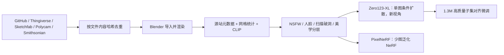

# Objaverse-XL：用网页爬来的一千万去重 3D 物体，把新视角合成从「手搓 CAD」推到可缩放预训练

<!-- release-date: 2023-07-11 -->

**本文依据**：`Objaverse-XL: A Universe of 10M+ 3D Objects`，封面印 **Preprint. Under review.**，arXiv:2307.05663v1 [cs.CV] 11 Jul 2023，33 页 letter。第一作者 Matt Deitke，其余作者含 Ruoshi Liu、Matthew Wallingford、Huong Ngo、Oscar Michel、Aditya Kusupati、Alan Fan、Christian Laforte、Vikram Voleti、Samir Yitzhak Gadre、Eli VanderBilt、Aniruddha Kembhavi、Carl Vondrick、Georgia Gkioxari、Kiana Ehsani，以及共同通讯 Ludwig Schmidt、Ali Farhadi。机构：Allen Institute for AI（第一作者第一机构）、University of Washington, Seattle、Columbia University、Stability AI、California Institute of Technology、LAION。官方 abs：`https://arxiv.org/abs/2307.05663`，v1 提交日 **2023-07-11**。封面与全文抽取均未把本文写成已录用会议论文；致谢里出现 NeurIPS 写作规范字样，不当作录用声明。文中数字都标 PDF 页码。本文只读这一份 PDF。

## 一句话

2D 和语言已经靠网页规模数据把模型推上去，3D 还卡在 ShapeNet 量级的手搓 CAD 上：专业设计师贵、难众包，生成与重建只好借用 2D 大模型（PDF p. 1–2）。Objaverse-XL 的做法是：**去网页上把已经存在的 3D 文件爬下来、按内容哈希去重、能进 Blender 的就渲**。来源包括 GitHub、Thingiverse、Sketchfab（即 Objaverse 1.0）、Polycam 可保存扫描、史密森学会文物扫描（PDF p. 4–5）。表 1 写 **10.2M** 个物体，比 Objaverse 1.0 的 **800K** 大约一个数量级，比 ShapeNet 常用的 **51K** 大约两个数量级（PDF p. 3）。摘要写：用这份库训 Zero123 做新视角合成，用了 **超过 1 亿** 张多视角渲染图，得到更强的零样本泛化（PDF p. 1）。实验侧还把 PixelNeRF 推到 **两百多万** 个物体、**2400 万** 张渲染图，规模上去质量仍在涨（PDF p. 8–9）。

它解决的不是「再雇一批 3D 美术」，而是：**3D 预训练数据能不能像图像和文本一样，从手工装配改成网页采集。**

## 一、矛盾：3D 还在用「手工金标」，2D 已经在用「网页脏数据」

作者把近年突破写成同一条因果：参数变多 → 数据必须变多 → 数据从人工标注改成网页采集（PDF p. 2）。语言侧从 GPT-2 大约 **300 亿** token 走到 Chinchilla / LLaMA 的万亿级网页文本；视觉侧从 ImageNet **100 万** 图走到 LAION-5B 量级，才有 CLIP 和扩散模型（PDF p. 2）。3D 没有走完这一步。ShapeNet 依赖专业软件和设计师，难众包、难扩。结果是：3D 物体生成远远落后于 2D 图像生成；现有 3D 生成还常常借用在超大 2D 数据上训好的模型，而不是从 3D 从头训（PDF p. 2）。AR / VR 需求上来之后，这条瓶颈会更硬。

网页上其实已经堆了不少 3D：GitHub、Sketchfab、Thingiverse、Polycam、史密森一类专题站。作者的判断是：创作工具、扫描和需求把互联网上的 3D 抬起来了，缺的是一次统一采集和去重（PDF p. 2）。Objaverse-XL 就是这次采集。图 1 把多源物体渲进同一场景，用来强调多样性，不是定量实验（PDF p. 1）。

规模实验的主结论写在引言末尾：Zero123 用 XL 预训练后，对写实资产、卡通、绘画、草图的零样本更好；PixelNeRF 在少图新视角上也有同类提升。预训练数据从一千个资产一路加到一千万，指标还在涨、减速不明显（PDF p. 2）。这是作者用来证明「网页规模 3D 值得做」的证据，不是对所有 3D 任务的承诺。

上图是机制示意，根据 PDF 第 3–4 节与图 4–6（p. 4–9）重画，不是实测时间轴。

## 二、相关工作：3D 库一直在变好看，但数量差了几个数量级

**预训练数据集。** ImageNet 仍是检测分割的默认预训练；LAION-5B 支撑 Stable Diffusion 和 CLIP / Flamingo；SAM 用 **10 亿** 掩码训「任意物体分割」（PDF p. 2–3）。语言侧 Common Crawl 一类网页库支撑 GPT-4。作者的缺口很窄：这些大规模努力几乎全在图像和语言上，3D 没有对等物（PDF p. 3）。

**3D 数据集。** ShapeNet 理论上有 **300 万** 带纹理 CAD，实务里按网格和纹理质量过滤后常用 **51K**；分辨率低、纹理往往过于简单（PDF p. 3）。ABO、GSO、OmniObject3D 把纹理做漂亮了，但最大的也大约 **15K** CAD（PDF p. 3）。Objaverse 1.0 给出 **800K** 高质量、多样纹理和类别的模型，大约是先前库的 **15×**，相对视觉和语言主流库仍差几个数量级（PDF p. 3）。表 1（PDF p. 3）：

| 数据集 | 物体数 |
|---|---:|
| IKEA | 219 |
| GSO | 1K |
| EGAD | 2K |
| OmniObject3D | 6K |
| PhotoShape | 5K |
| ABO | 8K |
| Thingi10K | 10K |
| 3d-Future | 10K |
| ShapeNet | 51K |
| Objaverse 1.0 | 800K |
| Objaverse-XL | 10.2M |

图 2 用 CLIP L/14 嵌入的 t-SNE：相对 1.0（橙色），XL 更密地铺满资产分布（PDF p. 3）。这是定性密度图，不是类别精确计数。

**3D 应用。** 从图像重建 3D 的一批工作（新表示、新网络、可微渲染）实验几乎都在小规模 ShapeNet 上（PDF p. 3）。生成侧：MCC 做自监督重建；DreamFusion / Magic3D 靠文生图模型出 3D；Point-E / Shape-E 用未公开来源的 3D 做文生 3D；Zero123 在 Objaverse 1.0 上训图像条件扩散，Stable Dreamfusion 再用它替换 DreamFusion 里的文生图模型（PDF p. 3）。缩放定律暗示生成和预测都吃更大模型和更大预训练集。作者把 XL 定位成「目前最大的 3D 库」，用来支撑大规模 3D 训练（PDF p. 3–4）。

## 三、库怎么拼起来：五源网页，能渲才算数

第 3 节定义：Objaverse-XL 是互联网上高度多样的 3D 源组成的网页规模物体库（PDF p. 4）。图 3 给各源例子；Thingiverse 无颜色，渲染时主色随机（PDF p. 4）。

### GitHub

索引 **3700 万** 个带常见 3D 扩展名的公开文件：`.obj`、`.glb`、`.gltf`、`.usdz`、`.usd`、`.usda`、`.fbx`、`.stl`、`.dae`、`.ply`、`.abc`、`.blend`。选这些扩展是因为 Blender 支持最好，而他们用 Blender 渲 2D（PDF p. 4）。只收「基仓库」（非 fork；fork 星数超过原仓的除外）。文件来自超过 **50 万** 个仓库（PDF p. 4）。

全库按文件内容哈希去重，去掉大约 **2300 万** 个文件。剩下的里，成功导入并渲染 **550 万**。失败原因：导入不兼容（例如 FBX ASCII 不能原生进 Blender）、文件里没有网格、根本不是合法 3D（例如 `.obj` 其实是 C 编译器文件）（PDF p. 4–5）。作者预期：若有统一格式转换，还能再挖出数百万独特物体（PDF p. 5）。

### Thingiverse

约 **350 万** 个物体，绝大多数 Creative Commons。主体是 STL：常是水密、无纹理网格，适合学形状先验。渲染时随机上色以拉宽图像分布（PDF p. 5）。

### Sketchfab = Objaverse 1.0

本项目用的 Sketchfab 数据就是 Objaverse 1.0：**80 万** 个 CC 许可模型，统一 GLB。从真扫描到软件里做的复杂设计都有（PDF p. 5）。

### Polycam

手机扫描应用的 explore 页里，只收标成可保存、且许可为 CC-BY 4.0 的物体。索引 **7.2 万**，去重后 **7.1 万** 独特物体（PDF p. 5）。

### 史密森 3D 数字化

**2400** 个模型，CC0，多为文物扫描，压缩 GLB（PDF p. 5）。

图 4c 的桑基图把源、去重、成功渲染、Blender 不兼容画在一起：GitHub 37M、Thingiverse 3.5M、Sketchfab 800K、Polycam 72K、Smithsonian 2.4K；去重 23M；成功渲染约 10M；Blender 不兼容 8M（PDF p. 5）。Datasheet 把成功渲染的 **约 10.2M** 拆成：约 **56%** GitHub、**35%** Thingiverse、**8%** Sketchfab，Polycam 与史密森合计不到 **1%**（PDF p. 27）。索引到但因去重或不好进 Blender 而未计入的 GitHub 链接也会放出来（PDF p. 27）。

## 四、元数据：源站热度、Blender 网格统计、CLIP 代理标签

每件物体带源站元数据，再在 Blender 和 CLIP ViT-L/14 上抽一层（PDF p. 6）。

**源站。** 常有热度、许可、文本描述。GitHub 用仓库星数当热度，文件名当文本配对（PDF p. 6）。

**Blender。** 成功渲染的物体记录：`sha256`、文件大小、多边形 / 顶点 / 边数、材质数、纹理数、物体数、动画数、链接文件、场景尺寸、缺失纹理。缺纹理则随机填色。图 4e 给多边形、顶点、边数的密度（PDF p. 6）。

**动画。** 相对 1.0，带动画的从 **41K** 到 **459K**，带骨架（armature）的从 **34K** 到 **438K**（PDF p. 6，图 4e）。

**CLIP。** 在空心球内随机相机渲 **12** 张，平均 CLIP ViT-L/14 嵌入。用来预测美学分、NSFW、人脸、摄影测量破洞（细节在附录 C.3，PDF p. 6）。

图 4a–b 给带地理标签物体在美国和各国的密度（对数色阶）。这只覆盖有 geotag 的子集，不是全库地理普查（PDF p. 5）。

## 五、清洗代理：NSFW 极少，人脸多半是玩偶，扫描背面常破

多数源站本身 NSFW 政策严或自过滤。网页规模仍要过一遍渲染图（PDF p. 6）。

**NSFW。** 每物体 12 视角，图像过 Gadre 等人在 LAION-5B NSFW 集上、用 CLIP ViT-L/14 训的分类器。阈值 **0.9**；至少 **3** 张判 NSFW 才标整物体。最终 **1000 万** 里只滤掉 **815** 件。高阈值加多视角一致，是因为 LAION 与 XL 有分布差，无害物体的某些视角也会被误标（PDF p. 6）。

**人脸。** 同一套「至少 3 张检出」规则，估计 **26.6 万** 件含人脸。作者强调：多数来自玩偶、历史雕塑、拟人动画，隐私压力小于普通网页图（PDF p. 6）。Datasheet 写成即便算上这些，也大约只有 **2.5%** 检出人脸（PDF p. 28–29）。

**摄影测量破洞。** 背面或底面没扫到，多视角渲染会出现破洞。Polycam 里非平凡数量缺「背面」信息，背面视角往往噪声大、保真低或有洞（PDF p. 6–7）。人工标了 **1200** 张 Polycam 渲染为好 / 坏，在 CLIP 特征上训两层 MLP，「渲染分」阈值 **0.5** 时交叉验证准确率超过 **90%**。**7.1 万** Polycam 物体 × 12 张里，**38.20%** 渲染判坏；**5.8 万** 件至少有 **2** 张坏渲染（PDF p. 7）。

附录 D：LAION-Aesthetics V2 打在渲染上，用来滤更高质量子集。表 4（PDF p. 33）：

| 档 | 含义 | 美学分切分 | 占库比例 |
|---|---|---|---:|
| T1 | 最高 | 大于 4.5 | 14.2% |
| T2 | 中 | 4–4.5 | 69.2% |
| T3 | 低 | 小于 4 | 16.6% |

图 19 随机样例：经验上 T1 最好，然后 T2、T3（PDF p. 33）。这是渲染美学代理，不是网格拓扑质量的金标。

## 六、实验一：Zero123-XL，同一套新视角扩散，只把数据换成 XL

新视角合成被写成 3D 里的「下一词预测」：简单、好扩、预训练之后会出零样本（PDF p. 7）。Zero123 是视角条件扩散，权从 Stable Diffusion 初始化，在 Objaverse 1.0 上渲输入 / 新视角对。Zero123-XL 方法相同，数据换成 XL（PDF p. 8）。预训练好的视角条件扩散还能塞进 DreamFusion 或 SJC 一类分数蒸馏，得到 3D 资产（PDF p. 8）。

**零样本。** 图 5：人、二次元、卡通、家具、草图。1.0 版 Zero123 常把输入当成平面做单应变换；XL 能给出更一致的新视角，草图还能保住风格和几何。第 2 行还显示视角可控性明显变好（PDF p. 7）。附录图 7–18 是更多对照，结论同：相机变换跟得更紧、输出更像合理 3D（PDF p. 14–26）。

**随规模涨。** 在 Google Scanned Objects 上做零样本新视角。图 6 右：视觉相似度（LPIPS，图中 ×10 便于看）随数据量从 **800**、**8k**、**80k**、**800k** 到 **10M** 持续变好；**800K** 点是原 Zero123，**10M** 点是 Zero123-XL（PDF p. 8）。低于 800K 的子集从 Objaverse 1.0 随机抽（PDF p. 14）。图注把「预测新视角与真值的视觉相似度持续改善」写在正文 p. 8；纵轴画的是 LPIPS（越低越好），不要把「相似度上升」读成 LPIPS 数值上升。

**对齐微调。** 作者类比 InstructGPT / LIMA：大规模预训练不等于对齐人偏好；在精选高质量子集上微调可以补。他们用顶点数、面数、源站热度、数据来源等启发式，选出 **130 万** 件当对齐子集；全库预训练后再降学习率微调（PDF p. 8）。表 2，零样本 Google Scanned Objects（PDF p. 7）：

| Zero123-XL | PSNR ↑ | SSIM ↑ | LPIPS ↓ | FID ↓ |
|---|---:|---:|---:|---:|
| Base | 18.225 | 0.877 | 0.088 | 0.070 |
| 加对齐微调 | 19.876 | 0.888 | 0.075 | 0.056 |

附录 A.1：训练 batch **2048**，学习率 $1 \\times 10^{-4}$；第二阶段高质量子集学习率 $5 \\times 10^{-5}$。第一阶段 **375K** 步，第二阶段 **65K** 步。其余设定跟 Zero123 原文一致（PDF p. 14）。

## 七、实验二：PixelNeRF，少图泛化也吃规模

经典 NeRF 要几十张图、且只服务当前场景。后续少图跨场景方法卡在相机参数难拿，训练数据一直很小（PDF p. 8–9）。作者在 XL 上把 PixelNeRF 训到 **超过 200 万** 个物体，比先前常用数据大几个数量级；泛化更好，且随规模持续改善（图 6、表 3，PDF p. 9）。

图 6 左：单图条件 PixelNeRF，在 XL 留出子集上评 PSNR；数据从 **1k** 到 **2M**，质量仍在涨。正文补一句：即便到 **200 万** 物体、**2400 万** 张渲染图，新视角质量还在随物体数上升（PDF p. 9）。

下游微调。单图条件，报 PSNR。表 3（PDF p. 9）：

| PixelNeRF | DTU ↑ | ShapeNet ↑ |
|---|---:|---:|
| 从头训 | 15.32 | 22.71 |
| 从 Objaverse-XL 微调 | 17.53 ± 0.37 | 24.22 ± 0.55 |

这是「大库预训练再迁到旧基准」的 2D 式故事，不是新的重建算法。

## 八、限制、Datasheet 与没写的东西

第 5 节三条限制（PDF p. 9）：

1. 比 1.0 大一个数量级以上，相对现代十亿级图文库仍差几个数量级；后续要继续扩 3D 库、让 3D 更好采集和创作。
2. 未必每条样本都对高性能模型必要；怎么选点还没做。
3. 本文实验集中在生成式新视角；判别式（3D 分割、检测）留给后人。

结论重复：**10.2M** 资产；零样本新视角上，固定结构、只加数据，经验趋势看好（PDF p. 9）。

致谢：实验算力来自 Stability AI，LAION 提供支持；Allen AI 也提供采集与渲染算力（Datasheet 再写一遍，PDF p. 10、p. 27）。按 NeurIPS 写作规范声明用了 LLM 改句子和辅助写代码——这是致谢合规句，不是录用证明（PDF p. 10）。

Datasheet（附录 C，PDF p. 27–32）里对使用者更硬的几条：

- 实例是 3D 物体加元数据；无统一任务标签；无全库推荐划分（PDF p. 27–28）。
- 去重只做内容 sha256，近重复仍可能在；可用渲染 CLIP 再滤（PDF p. 28）。
- 发布形态不自包含：Polycam 与 Sketchfab 放完整物体；GitHub、Thingiverse、史密森放可下载链接加元数据。无下载费。Thingiverse 要 API key；GitHub 可 clone。必须遵守原文件许可和各平台 ToS（PDF p. 27–28）。
- 整体库许可 **ODC-By 1.0**；单件仍跟原许可走（PDF p. 31）。
- 计划通过 Python API 分发，托管 Hugging Face；Datasheet 写「2023 年 6 月底前后公开」（PDF p. 31–32）。联系 `mattd@allenai.org`。可申请把特定样本加入黑名单。当时无立即更新计划；Objaverse 1.0 会继续维护（PDF p. 32）。
- 采集主要在 2023 年 Q1–Q2；Sketchfab 部分来自 1.0。Python 脚本 + AWS CPU。采集成本量级「数千美元」。过滤依据：许可、重复、能否成功进 Blender。无 IRB。未通知原上传者（PDF p. 29–30）。
- 可能含机密、冒犯或敏感内容，作者写「罕见但可能」。扫描人像或许能从外观或元数据姓名识别（PDF p. 28–29）。
- 软件（清洗与渲染）将公开；下载到的是未改文件内容的原始数据（PDF p. 30）。
- 潜在用途举例：3D 工具（修复、文生 3D、图生 3D）、机器人仿真与具身、用动画训视频模型、2D 分割等（PDF p. 30–31）。

本 PDF **没有**公开：完整训练代码与超参表（Zero123 只补了 batch / 学习率 / 步数）、PixelNeRF 的完整配方、统一格式转换器、近重复过滤器、判别式实验、以及「哪些样本可以扔掉」的选点算法。图 6 是曲线不是数值表，除表 2–3 外不要从记忆补中间刻度。

## 九、可迁移启发

1. **3D 预训练的第一刀可以不是更好的 CAD，而是更好的网页采集。** 哈希去重 + 渲染能否成功，已经从 3700 万 GitHub 文件收到 550 万可渲件（PDF p. 4–5）。自己做 3D 语料时，先定「能进渲染器」比先定「语义类」更可扩。
2. **多源就要接受异构：无纹理 STL 随机上色，缺纹理随机填，扫描背面单独当「坏渲染」建模。** 否则规模会被破洞和编译器误后缀污染（PDF p. 5–7）。
3. **安全过滤在 3D 上可以走多视角投票，而不是单张图一票否决。** NSFW 用 12 视角、阈值 0.9、至少 3 张，才从 10M 里拿出 815 件（PDF p. 6）。分布一偏，2D 分类器会误杀。
4. **生成式 3D 也可以抄 LLM 的两段式：全量预训练 + 启发式高质量子集降学习率对齐。** 表 2 的 PSNR / LPIPS / FID 都动了（PDF p. 7–8、p. 14）。代理指标（顶点数、热度、来源）不是人偏好本身，但比不选要强。
5. **固定结构、只加数据，在新视角合成上至少看到「到 10M 还没饱和」。** 这不能外推到分割检测；作者自己把判别式列为未做（PDF p. 2、p. 8–9）。
6. **发布网页 3D 库等于发布一堆外链和许可义务。** ODC-By 管整包元数据，管不了 GitHub 上那份 STL 的原许可（PDF p. 28、p. 31）。下游产品必须按件审计，不能把「数据集开源了」读成「所有网格都能商用」。

## 十、关键词回看

- **Objaverse-XL**：网页爬取、内容哈希去重后的 **10.2M** 3D 物体库（PDF p. 3、p. 9）。
- **Objaverse 1.0**：Sketchfab 上 **800K** CC 模型，构成本库的 Sketchfab 源（PDF p. 3、p. 5）。
- **新视角合成（novel view synthesis）**：给定一张（或少张）图，生成另一相机位姿下的物体图；本文把它当 3D 的可缩放预训练任务（PDF p. 7–8）。
- **Zero123 / Zero123-XL**：从 Stable Diffusion 初始化的视角条件扩散；XL 只换更大 3D 渲染对，并可接分数蒸馏出 3D（PDF p. 8）。
- **对齐微调（alignment finetuning）**：全量预训练后，在 **1.3M** 启发式高质量子集上降学习率再训（PDF p. 8、p. 14）。
- **PixelNeRF**：少图、可跨场景的神经辐射场；本文用 XL 把训练物体数推到百万级（PDF p. 8–9）。
- **摄影测量破洞**：扫描未覆盖背面 / 底面导致的坏渲染；Polycam 上用 CLIP+MLP 代理（PDF p. 6–7）。
- **ODC-By 1.0**：整库分发许可；单件仍跟源站许可（PDF p. 31）。
