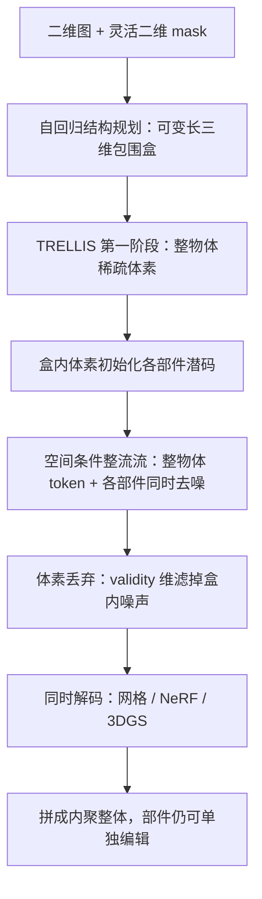

# OmniPart：先自回归规划部件盒，再同时生成带纹理的部件

<!-- release-date: 2025-07-08 -->

**本文依据**：`OmniPart: Part-Aware 3D Generation with Semantic Decoupling and Structural Cohesion`，arXiv:2507.06165v1 [cs.CV] 8 Jul 2025，11 页 letter。作者 Yunhan Yang\*（The University of Hong Kong）、Yufan Zhou\*（Harbin Institute of Technology，共同一作）、Yuan-Chen Guo、Zi-Xin Zou、Ying-Tian Liu、Ding Liang、Yan-Pei Cao†（VAST）、Yukun Huang（The University of Hong Kong）、Hao Xu（Zhejiang University）、Xihui Liu†（The University of Hong Kong，通讯）。封面页眉写明 arXiv:2507.06165v1 [cs.CV] 8 Jul 2025。官方 abs：`https://arxiv.org/abs/2507.06165`，v1 提交日 **2025-07-08**。封面与全文抽取均未印会议名。项目页 `https://omnipart.github.io/`（PDF p. 1）。文中数字都标 PDF 页码。本文只读这一份 PDF。

## 一句话

当时图生 3D 已经能出整块好看的形状，但物体在真实世界里是**可拆、可编、可动的零件组合**；整块网格没有显式部件，编辑、动画、赋材质、语义理解都卡住（PDF p. 2）。部件感知生成要同时做到两件事：**语义解耦**（零件彼此独立、能单独点到）和 **结构内聚**（拼回去仍是一个合理整体）（PDF p. 2）。旧路要么从二维部件分割抬到三维，视图对不齐、看不见的内部缺；要么直接在三维里生成部件，粒度控不住，还要大量稀缺的三维部件标注（PDF p. 2）。OmniPart 把任务拆成两段：先用自回归结构规划，在二维图加二维 mask 条件下出可变长度的三维部件包围盒；再把预训练整物体生成器（TRELLIS）改成空间条件整流流，**同时**出所有带纹理的部件（PDF p. 1 图 1、p. 2）。Mask 不必与三维盒一一对应，也不必带语义标签（PDF p. 2）。

它解决的不是「再做一个更强的整物体生成器」，而是：**高层结构规划与细节合成能不能拆开，又用强条件把它们钉在一起。**

## 一、矛盾：整物体已经能生成，零件却还不能当资产用

引言把目标写得很直：交互应用要的是**可编辑的部件结构**，而当时多数生成方法只出**整块形状**（PDF p. 1–2）。DreamFusion、TRELLIS、CLAY 一类整物体生成已经强，但结构不透明，组合编辑、程序化动画、分部件赋材质都不好直接做（PDF p. 2）。

作者把部件感知生成的平衡写成一对张力（PDF p. 2）：

- **低语义耦合**：零件要分得开、能单独操作。
- **高结构内聚**：零件要能合成一个说得通的整体。

当时两条旧路都偏一边（PDF p. 2）：

1. **从二维部件分割重建**（Part123、PartGen 一类）。视图聚合难，二维模型也看不到完整三维部件几何，细节和一致性都不够。
2. **直接三维部件生成**（PASTA 一类）。细粒度分解控不住，或绑死大规模三维部件标注，标不起、扩不开。

因此作者强调：稳健的部件感知生成，关键是**把高层结构规划与细节部件合成原则性拆开，再用强条件统一**（PDF p. 2）。这就是两阶段流水线。

上图是机制示意，根据 PDF 图 1（p. 1）、图 2（p. 4）、图 3（p. 4）与第 3 节重画，不是实测时间轴。端到端墙钟在表 3：约 **0.75** 分钟（PDF p. 8）。

三条贡献按原文（PDF p. 2）：

- 两阶段生成：结构规划与几何合成拆开，可控性、部件连贯、整体质量一起抬。
- 自回归规划：二维 mask 控可变粒度和三维分解。
- 空间条件合成：按规划布局**同时**出全部三维部件，借预训练整物体模型，部件监督可以少。

## 二、相关工作：整形状、组合生成、部件分割，缺的是「规划后再同时合成」

**三维形状生成**（PDF p. 3）。DreamFusion 用分数蒸馏从二维扩散优化三维，不要三维监督。另一路先出多视图再靠一致性重建，二维视图本身不一致、又没有原生三维监督，几何容易花。再往后是几何感知潜空间上的潜扩散 / VAE（含 3DShape2VecSet、CLAY）。TRELLIS 提出结构化潜变量，两阶段由粗到细。MeshGPT 一路则在点云条件下自回归出网格面。OmniPart **不另起一套表示**，直接站在 TRELLIS 的稀疏体素潜空间上（PDF p. 3–4）。

**组合生成**（PDF p. 3）。二维里已有按文本或按图层的组合。三维部件这边：Comboverse 各物体 / 部件独立重建再组合，缺全局结构，几何对不齐。Part123 先多视图再按图像 mask 重建，部件仍粘在一起，分割停在表面。PASTA 把物体写成长方体原语序列，再用 Transformer 混合成网格。PartGen 多视图分割、补全遮挡再重建各部件，多视图不一致会把几何保真度打下来。共同缺口是：**要么孤立生成、要么粘在表面上，缺「先规划空间、再同时合成」**。

**三维部件分割**（PDF p. 3）。早期点云 / 网格全监督要大量部件标注，覆盖窄。后来把 SAM、GLIP、CLIP 的二维知识投到多视图再抬回三维表面，看不见的内部和遮挡部位天然缺，下游要完整几何时不够用。HoloPart 按表面 mask 和整物体补全各部件，质量绑死输入分割。分割可以当「从完整形状抠零件」的手段，但**不是从一张图直接生成可编辑零件**。

## 三、底座：TRELLIS 的结构化潜变量，OmniPart 只改「怎么用它」

条件是**输入图像加二维部件 mask**，目标是部件感知、可控、高质量三维（PDF p. 3）。两阶段名字：部件结构规划、结构化部件潜变量生成（PDF p. 3，图 2）。

TRELLIS 把资产 $C$ 编成结构化潜变量 $c$，是三维网格上的一组局部潜码（PDF p. 4 式 1）：

$$
c=\{(f_i,p_i)\}_{i=1}^{L},\quad f_i\in\mathbb{R}^{D},\quad p_i\in\{0,1,\ldots,N-1\}^{3}.
$$

$p_i$ 是与表面相交的活跃体素坐标，$f_i$ 是该体素上的局部特征，$N$ 是网格分辨率。人话：活跃体素勾出粗结构，潜特征扛细几何和外观。

TRELLIS 自己也是两阶段（PDF p. 4）：先生成覆盖整物体（含内部）的活跃体素 $v$；再训整流流，给每个表面体素出潜特征 $f$，解码成网格、NeRF 或 3D 高斯溅射（3DGS）。OmniPart 第一阶段规划盒时，会先跑 TRELLIS 的结构生成拿到体素；第二阶段微调的是 TRELLIS 的**第二阶段**整流流（PDF p. 5–6）。

## 四、第一阶段：自回归出可变长包围盒，用二维 mask 解开组合歧义

结构用粗而灵活的三维包围盒表示。每个盒对应一个有意义的部件，自回归可以出任意个数（PDF p. 4）。

**分词。** 把每个盒 $b$ 的最小、最大坐标展成序列；整段前加 $\langle\mathrm{bos}\rangle$、后加 $\langle\mathrm{eos}\rangle$。盒按最小坐标 **z–y–x 从低到高**排序，方便序列建模（PDF p. 4）。朴素写法是 $6n$ 维，$n$ 是盒数（PDF p. 4）。

**为什么要二维 mask。** 同一物体可以有多种切法：角色的手可以单独成件，也可以跟手臂合成一件。这就是作者说的组合歧义，规划会不可预测（PDF p. 2、p. 4–5）。mask 来自用户或 SAM 一类二维模型，标出希望分解的区域，**不要求与三维盒一一对应，也不要求语义标签**（PDF p. 2、p. 5）。单张 mask 也罩不住全部零件，所以他们采用**非一一对应、与标签无关**的盒，免去盒与 mask 区域显式匹配（PDF p. 5）。

图像 $I\in\mathbb{R}^{H\times W\times 3}$ 先过 DINOv2 得 $f\in\mathbb{R}^{h\times w\times d}$（PDF p. 5）。mask $M$ 的每个位置是二维部件下标，$K$ 是最大部件数；可学习表 $E\in\mathbb{R}^{K\times d}$ 给每个下标一行嵌入，逐位置加到视觉特征上（PDF p. 5）：

$$
f'_{i,j}=f_{i,j}+E[M_{i,j}].
$$

要对齐第二阶段的稀疏体素坐标：先用 TRELLIS 结构阶段出体素，当点云，用 3DShape2VecSet 编码器压成定长 token $q$；$f'$ 展平后与 $q$ 拼接，作为序列前缀条件（PDF p. 5）。

**训练。** 解码器 only Transformer，基于 OPT 代码（PDF p. 5）。下一 token 损失 $L_{\mathrm{base}}$ 在条件 $[f';q]$ 下做标准自回归（PDF p. 5）。因为第二阶段能丢无效体素、**补不回缺失体素**，规划阶段希望盒偏大、把该部件的体素罩全。于是加 **Part Coverage Loss**：对最小坐标 token 惩罚「预测最小点比真值还大」，对最大坐标 token 惩罚「预测最大点比真值还小」，即用 ReLU 把盒往外推（PDF p. 5 式 2）。总损失：

$$
L_{\mathrm{total}}=L_{\mathrm{base}}+\lambda_{\mathrm{cov}}L_{\mathrm{coverage}}.
$$

$\lambda_{\mathrm{cov}}$ 的具体数值 PDF **没有写**。

没有合适预训练先验，这一阶段用全部 **18 万** 带部件标注的形状**从头训**；盒仍按 z–y–x 升序再分词（PDF p. 6）。

## 五、第二阶段：整物体与各部件一起去噪，多一维来丢盒内噪声

规划得到的盒与稀疏体素空间对齐。第 $i$ 个盒里的体素 $v_i$ 是该部件的粗几何（PDF p. 5）。目标是**高效同时生成全部部件且彼此连贯**。高质量部件标注少，所以尽量吃预训练整物体模型的先验，微调 TRELLIS 第二阶段（PDF p. 5）。

图 3：整形状与各部件的带噪潜码经部件感知的稀疏下 / 上采样，展成一维序列进 Transformer；token 加位置嵌入和 **部件位置嵌入（PPE）**（PDF p. 4 图 3、p. 5）。整物体 token 放序列开头，共享 PPE 下标 **0**；后续每个部件从 **1** 起各一个下标，同一部件内共享。这样可以同时去噪、同时解码成网格 / NeRF / 3DGS（PDF p. 5）。整物体 token 的作用写得很明确：**保住底座先验，加强部件–整体连贯**（PDF p. 5）。

体素只是粗几何，邻接部件边界常重叠；盒内初始化也会掺进别的部件的「噪声」体素（PDF p. 2、p. 5）。作者给部件潜码多一维 $f_{\mathrm{valid}}$。训练时噪声体素标 $-\alpha$、有效体素标 $+\alpha$（$\alpha$ 是预定常数，**未给数值**）。推理时对该维做 sigmoid，与阈值 $\beta$ 比，大于则保留。实验取 $\beta=0.5$（PDF p. 6）。

生成仍用整流流，线性插值前向 $x(t)=(1-t)x_0+t\epsilon$，用条件流匹配（CFM）训网络 $v_\theta$ 去逼近 $\epsilon-x_0$（PDF p. 6）。

这一阶段只在 **1.5 万** 高质量标注形状上微调。每个部件随机渲染 **150** 视图，DINOv2 提特征再反投到三维体素融合；再故意构造含噪声体素的训练数据：先体素化各部件拼成整物体，再取各盒内体素做初始化（里面会有邻部件噪声）（PDF p. 6）。

## 六、数据：18 万带标，1.5 万高质量，测试 300

收集 **18 万** 带部件标签的物体（过滤加人工标注）。标注质量不齐，另做打分，筛出 **1.5 万** 高质量（PDF p. 6）。图 4 按每模型部件数画分布，示例分四档：**0–5、6–10、11–15、16–50**（PDF p. 5 图 4、p. 6）。

测试集从同一数据里抽 **300** 个物体，按部件数四档**按比例**抽样，兼顾件数多样和类别覆盖（PDF p. 6）。先评规划（4.1），再评全流水线（4.2），再展示应用（4.3）。

打分系统怎么算、类别表、学习率、卡数、步数，PDF **都没写**。

## 七、实验：规划看覆盖，全流程看部件级与整体级

### 规划：宁可盒大一点，也不能漏体素

三个指标（PDF p. 6 表 1）：**BBox IoU** 看盒重叠；**Voxel recall** 看有效部件体素有多少落在预测盒里（第二阶段能丢多余、不能补缺失，所以覆盖优先）；**Voxel IoU** 看盒内体素与真值的交并。预测盒不受语义标签和数量约束，没有一一对应，评测时把每个真值盒配到**邻近**的预测盒（PDF p. 6）。

基线 PartField：零样本点云分割。把体素当点云喂进去，并**把真值部件数告诉它**当分割尺度，再从分割结果提盒（PDF p. 6）。OmniPart 规划阶段没有这个特权。

表 1（百分数，PDF p. 6）：

| 方法 | Voxel recall ↑ | Voxel IoU ↑ | Bbox IoU ↑ |
|---|---|---|---|
| PartField | 79.12 | 39.02 | 27.30 |
| OmniPart（无二维 mask） | 66.98 | 31.44 | 25.90 |
| OmniPart（无 coverage loss） | 64.50 | 50.56 | 41.24 |
| OmniPart（全文） | 85.96 | 61.02 | 38.37 |

去掉 coverage 后 **Bbox IoU 反而更高（41.24 vs 38.37）**，但 voxel recall 掉到 **64.50**、Voxel IoU 掉到 **50.56**；作者说盒看起来更贴近真值，体素覆盖却差，会伤第二阶段（PDF p. 6）。去掉二维 mask 后三指标全面差，控不住盒的大小和位置（PDF p. 6）。全文相对 PartField：recall **85.96 vs 79.12**，Voxel IoU **61.02 vs 39.02**，Bbox IoU **38.37 vs 27.30**（PDF p. 6）。

### 全流水线：部件级拉开，整体甚至超过「不分部件的 TRELLIS」

三条对照路线（PDF p. 6–8）：

1. 先生成完整三维再分割：TRELLIS+SAM3D、TRELLIS+PartField。
2. 分割后再逐部件补全：TRELLIS+PartField+HoloPart。
3. 单图直接出部件感知形状：Part123、PartGen。

形状归一化到 $[-0.5,0.5]$，报 Chamfer Distance 与 F1；F1 两个阈值：**CD < 0.1** 与 **CD < 0.05**（粗 / 细）。朝向不定，每物体转 **0°、90°、180°、270°**，取最好（PDF p. 8）。表头把细档写成 `F1-0.5`，表注写的是 **CD < 0.05**——以表注与正文为准（PDF p. 8）。表题写了 `(%)`，表内 CD 是 **0.18** 这一量级，按表内数字抄，不自行改成百分数。

表 2（PDF p. 8）：

| 方法 | 部件 CD ↓ | 部件 F1-0.1 ↑ | 部件 F1 细档 ↑ | 整体 CD ↓ | 整体 F1-0.1 ↑ | 整体 F1 细档 ↑ |
|---|---|---|---|---|---|---|
| TRELLIS+SAM3D | 0.49 | 0.38 | 0.28 | 0.08 | 0.92 | 0.77 |
| TRELLIS+PartField | 0.19 | 0.69 | 0.52 | 0.08 | 0.92 | 0.77 |
| TRELLIS+PartField+HoloPart | 0.19 | 0.68 | 0.51 | 0.08 | 0.91 | 0.77 |
| Part123 | 0.43 | 0.31 | 0.16 | 0.47 | 0.33 | 0.19 |
| PartGen | 0.44 | 0.43 | 0.30 | 0.11 | 0.86 | 0.69 |
| OmniPart | 0.18 | 0.74 | 0.59 | 0.07 | 0.93 | 0.80 |

作者特别指出：整体栏前两行其实是 **TRELLIS 不分部件直接出的整物体**；OmniPart 拼回去的整体 **CD 0.07、细档 F1 0.80**，高于这条整物体基线（0.08 / 0.77），因为每个部件能补全边界和遮挡区，整物体一次生成补不准这些地方（PDF p. 8）。相对 Part123 / PartGen，部件级和整体级都明显更好（PDF p. 8）。

图 5：他们用 TRELLIS 同时解码网格和 3DGS，把高斯颜色烤到网格上得到**带纹理部件**；HoloPart 与 Part123 官方实现无纹理，用纯色可视化。分割法只有表面 mask；HoloPart 补全仍受分割质量限制；PartGen 能出完整零件，几何与语义质量低。OmniPart 自称低语义耦合、高结构内聚（PDF p. 7–8）。

图 7 走完整流水线：输入图与二维 mask → 包围盒 → 各部件网格 → 合并整体；粒度由 mask 控，几何和纹理一起出（PDF p. 8–9）。

表 3 端到端时间（单图到部件级三维，PDF p. 8）：Part123 约 **15** 分钟，PartGen 约 **5** 分钟，OmniPart 约 **0.75** 分钟。Part123 要多视图、优化重建、再分割；PartGen 要多视图分割、补全、再逐部件重建。OmniPart 统一骨干**同时**出全部部件，并直接解成网格 / 3DGS / NeRF（PDF p. 8）。硬件型号 PDF **没写**。

### 应用：mask 控结构，粒度、材质、几何后处理跟部件走

第 4.3 节与图 6（PDF p. 7–8）：动画、mask 控制生成、多粒度、材质编辑、几何处理。动画在配套视频里，PDF 正文没有定量。

- **Mask 控制**：合并 SAM 过分割区域得到可用二维 mask；图 6(a) 用 mask 控机器人结构。
- **多粒度**：改二维分割尺度；图 6(b) 机器人与画板两套粒度。
- **材质编辑**：图 6(c) 改企鹅帽子、领带、衣服、裤子的纹理。
- **几何处理**：图 6(d) 三角网格重网格成四边形；有部件时接缝干净，无部件时接缝容易花。

## 八、限制：轴对齐盒会把噪声体素送进第二阶段

结论复述两阶段：自回归盒规划（二维 mask 引导）+ 空间感知合成，借预训练整物体生成器；部件监督有限仍能出细节连贯、低耦合高内聚的零件，粒度可控，并支撑动画、材质、几何处理（PDF p. 10）。

限制只有一条（PDF p. 10）：第一阶段为简化训练，**目前用轴对齐包围盒**；有时会把过多噪声体素交给第二阶段。更精确的结构规划表示留作未来工作。没有用户研究，没有开源仓库声明写在这篇 PDF 里（项目页只在摘要末尾给出 URL）。

## 九、可迁移启发

- **把「怎么切」和「切完长什么样」拆开。** 组合歧义出在规划，几何质量出在合成；硬揉成一步，要么控不住粒度，要么零件对不齐。
- **条件用灵活的二维 mask，而不是语义标签或一一对应。** 用户和 SAM 都给得起；模型不要假设 mask 数等于零件数。
- **下游能丢不能补时，上游损失要偏向覆盖。** Coverage loss 让 BBox IoU 略降、voxel recall 升，这是为第二阶段买保险，不是评测刷盒重叠。
- **微调整物体先验时，把「整体 token」留在序列里。** PPE 区分零件，整物体通道保住预训练，比从零训部件扩散更省标注（1.5 万高质量 vs 规划阶段 18 万从头训）。
- **盒初始化一定脏，多一维 validity 比把盒收得很紧更稳。** 轴对齐盒的代价作者自己写了；丢体素是配套补丁，不是可选花活。

## 十、关键词回看

- **语义解耦 / 结构内聚**：零件能单独点到，拼回去仍是一个物体。
- **结构规划**：自回归可变长三维包围盒，二维 mask + DINOv2 + 体素 token 当前缀。
- **Part Coverage Loss**：把盒往外推，优先罩住有效体素。
- **空间条件部件合成**：TRELLIS 整流流微调；整物体与各部件同时去噪；PPE 区分身份。
- **体素丢弃**：$f_{\mathrm{valid}}$，推理 $\mathrm{sigmoid}>\beta$，$\beta=0.5$。
- **结构化潜变量**：TRELLIS 稀疏体素上的局部潜码，可解网格 / NeRF / 3DGS。
